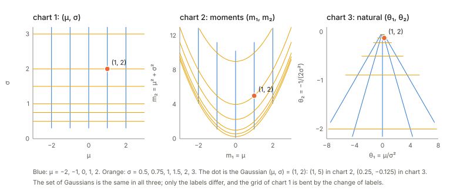
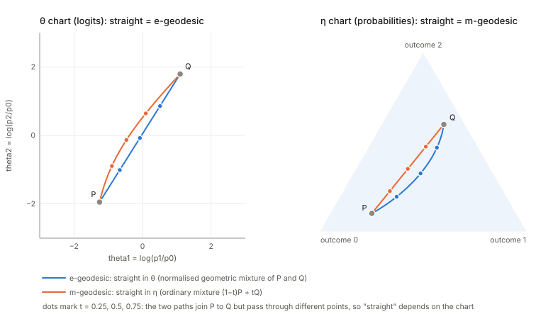
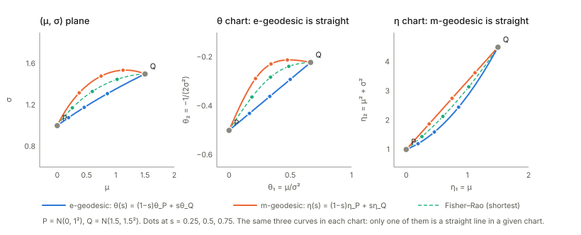
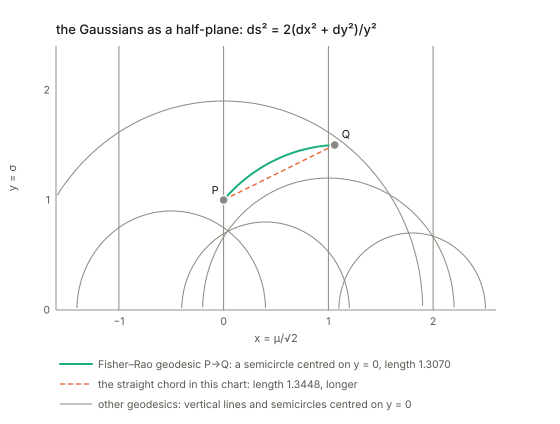
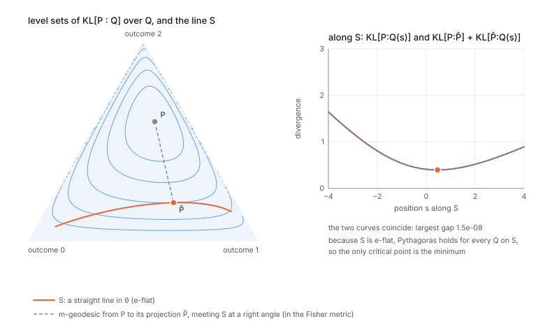
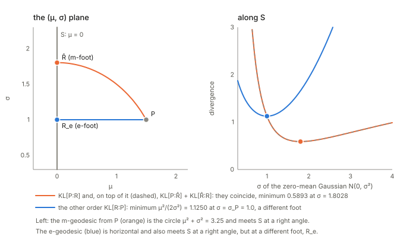
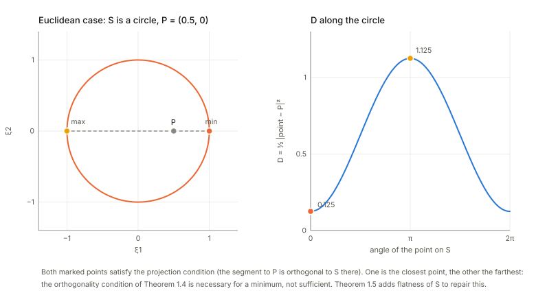

## Links

- **[Interactive companion](figures/interactive.html)**: eleven widgets. (1) One Gaussian in three coordinate charts, with the grid bent by the change of labels.
  (2) The KL divergence between two Gaussians, both orders, with the integrand that adds up to it. (3) Tangent vectors and the Fisher metric on the Gaussians:
  Fisher ellipses over the half-plane, a tangent step, its Riemannian length and the KL it costs. (4) What a positive-definite Hessian looks like: drag a 2×2 matrix
  and watch the ellipse, eigen-directions and curvature by direction. (5) The Bregman divergence as the gap above a tangent, for five choices of the convex function.
  (6) The Legendre transform: slope as a coordinate and the tangent's intercept as the dual function. (7) Two kinds of straight line on the three-outcome probability
  triangle: drag two distributions and watch the e-geodesic (straight in the logits), the m-geodesic (straight in the probabilities) and the Fisher–Rao geodesic part ways.
  (8) Pythagoras on the Gaussians: the 3-4-5 triangle's cousin, stacking two KL divergences against the direct one, with a tilt away from the right angle.
  (9) Build a right-angled triangle on the probability triangle and tilt it to see the Pythagorean theorem fail by exactly the amount the proof predicts.
  (10) Projection onto the zero-mean Gaussians: both feet, both orders of KL, and the Pythagorean split along the family.
  (11) Project a point onto a straight line or a curved arc on the probability triangle, for either order of the KL divergence, and count the critical points.
- **[Runnable checks](https://github.com/msrepo/information_geometry_notes/tree/main/chapters/ch01-dually-flat-structure/code)**:
  `code/dually_flat.py` prints every number on this page and regenerates the figures with
  `python3 code/dually_flat.py --figures`. `make verify` runs it, in about a second.
- The book: Amari, *Information Geometry and Its Applications* (Springer, 2016), DOI
  [10.1007/978-4-431-55978-8](https://doi.org/10.1007/978-4-431-55978-8). These notes cover Chapter 1 only. Equation numbers
  such as (1.69) refer to the book. No text of the book is reproduced here; everything is restated and re-derived.
- Background pages on the annotations site that this chapter leans on: **[The Fisher information matrix](https://msrepo.github.io/theory_inclined_papers_with_annotations/fisher-information/)**
  (the metric $g$ of §2 is the Fisher matrix when the family is a statistical model; natural gradient is §7 there),
  **[EM and Gaussian mixtures](https://msrepo.github.io/theory_inclined_papers_with_annotations/expectation-maximization/)** (the alternating projections of §6
  are the geometric reading of EM).
- Papers on the annotations site that use this geometry: **[Gao & Chaudhari 2021](https://msrepo.github.io/theory_inclined_papers_with_annotations/2021-gao-coupled-transfer-distance/)**
  and **[Karczewski et al. 2026](https://msrepo.github.io/theory_inclined_papers_with_annotations/2026-karczewski-spacetime-diffusion/)**.

## In one paragraph

Take a family of probability distributions, say the outputs of a 3-class softmax classifier. Two coordinate systems
describe it equally well: the **logits** $\theta$ and the **probabilities** $\eta$. Neither is "right", but each makes a
different kind of path look straight. The chapter's idea is that **one convex function $\psi$ builds a whole geometry**.
Its gap above its own tangent is a **divergence** $D_\psi$ (an asymmetric stand-in for squared distance); its
slope $\eta=\nabla\psi(\theta)$ is the second coordinate system (the **Legendre transform**); and its curvature
$G=\nabla^2\psi$ is a **metric** that turns the divergence into a local squared length. For softmax, $\psi$ is
log-sum-exp, $\eta$ is the softmax output, $\psi^*$ is the negative entropy and $D_\psi$ is the KL divergence with
its arguments reversed. The payoff is a **Pythagorean theorem**: if the $\eta$-straight line from $P$ to $Q$ meets
a $\theta$-straight line from $Q$ to $R$ at a right angle (in the metric $G$), then $D(R{:}P)=D(Q{:}P)+D(R{:}Q)$
exactly, not just approximately. From it follow the **projection theorem** (the closest point on a flat family is
where the orthogonality holds, and it is unique), and the **alternating minimisation** that underlies EM and
iterative scaling. Almost everything in the rest of the book is this chapter applied to something.

## The spine of the argument

1. A **manifold** is a space where each point can be labelled by $n$ numbers; relabelling is allowed. Probability
   families, positive measures, positive-definite matrices and weight spaces all qualify (§1).
2. A **divergence** $D[P{:}Q]$ is a non-negative, zero-only-at-equality function that looks like a *positive-definite
   quadratic form* for nearby points. That quadratic form is a Riemannian metric $g$, so a divergence gives a
   manifold a geometry for free (§2).
3. Convexity gives divergences on demand: **gap of a convex function above its tangent plane = Bregman divergence**,
   and its metric is the Hessian (§3). Exponential families are the example that matters: $\psi$ is their
   normaliser, $\nabla\psi$ the mean, $\nabla^2\psi$ the covariance, and $D_\psi$ a KL divergence.
4. Slopes are coordinates too. The **Legendre transform** $\eta=\nabla\psi(\theta)$ is invertible, its potential
   $\psi^*$ is convex, $G^*=G^{-1}$, and the divergence of the dual is the divergence of the primal with the two
   arguments swapped (§4).
5. So the manifold carries **two flat structures** at once, one straight in $\theta$, one straight in $\eta$, joined
   by one metric. Vectors have two sets of components that pair up without needing the metric (§5).
6. A right angle between a straight line of one kind and a straight line of the other kind makes
   $D$ **additive**: Pythagoras. Everything else, projections, uniqueness, alternating minimisation, is
   a corollary (§6).

## Setup and notation

The running example throughout is a **3-class softmax**, because it makes every object concrete.

| Chapter-1 object | In the softmax example | Name in the book |
|---|---|---|
| point $P$ | a distribution $p=(p_0,p_1,p_2)$ | point of a manifold |
| $\theta$ | logits relative to class 0: $\theta_i=\log(p_i/p_0)$, $i=1,2$ | affine coordinates; "natural parameters" |
| $\eta=\theta^*$ | probabilities $(p_1,p_2)$ | dual affine coordinates; "expectation parameters" |
| $\psi(\theta)$ | $\log(1+e^{\theta_1}+e^{\theta_2})$, log-sum-exp with baseline logit 0 | potential; cumulant function; free energy |
| $\psi^*(\eta)$ | $\sum_{i=0}^2 p_i\log p_i$, the negative entropy | Legendre dual |
| $D_\psi[P{:}Q]$ | $\mathrm{KL}[p_Q\Vert p_P]$, **reversed** | Bregman divergence |
| $G=\nabla^2\psi$ | $\operatorname{diag}(\eta)-\eta\eta^\top$, the softmax covariance | Riemannian metric $g_{ij}$ |
| $G^*=\nabla^2\psi^*$ | $\operatorname{diag}(1/\eta_i)+\tfrac1{p_0}\mathbf 1\mathbf 1^\top$, equal to $G^{-1}$ | $g^{*ij}$ |
| straight in $\theta$ | $p_i(t)\propto p_i^{1-t}q_i^{t}$, a normalised geometric mixture | "geodesic" (e-geodesic in later chapters) |
| straight in $\eta$ | $p(t)=(1-t)p+tq$, an ordinary mixture | "dual geodesic" (m-geodesic in later chapters) |

Two words that are easy to misread. **"Geodesic" here means "straight line in an affine coordinate system", not
"shortest path".** The shortest path in the metric (the Fisher–Rao geodesic) is a third curve, shown in §5.
And **"flat" is a property of a submanifold relative to a chart**: a family that is a straight line in $\theta$ is
*flat* (e-flat in later chapters), one that is a straight line in $\eta$ is *dual flat* (m-flat).

## 1. Manifolds and coordinates (§1.1)

A manifold, in the sense used here, is a set of objects such that each one can be labelled by $n$ real numbers and
nearby objects get nearby labels. You can always relabel by an invertible smooth map $\zeta=f(\xi)$. What stays
fixed is the *set*, what changes is the *description*. The whole subject lives off a tension: the geometry should not
depend on the description, but some natural notions (straightness, convexity) do.

Examples the chapter lists, with the coordinates worth knowing.

- **Gaussians** $N(\mu,\sigma^2)$: three charts, worked through in the next subsection.
- **Distributions on $n+1$ outcomes**: the open probability simplex $S_n$. The charts are $(p_1,\dots,p_n)$ (with $p_0$
  determined) and the logits $\theta_i=\log(p_i/p_0)$.
- **Positive measures** $\mathbb R^n_+$: the same, with the total mass left free. Images, spectra and histograms live here.
- **Positive-definite matrices**, an $n(n+1)/2$-dimensional manifold, and **neural networks**, whose weights $W$ are a
  chart for the "neural manifold". The book only names these here and returns to them later.

### Worked example: the Gaussians in three charts

The *points* of this manifold are Gaussian curves. A *chart* is a way of naming one such curve with two numbers. Three
namings are in common use.

- **Chart 1, $(\mu,\sigma)$**: where the bell sits and how wide it is. The only restriction is $\sigma>0$, so the chart is
  a half-plane.
- **Chart 2, moments $(m_1,m_2)=(\mu,\mu^2+\sigma^2)$**: the two averages $\mathbb E[x]$ and $\mathbb E[x^2]$. Not every
  pair is a Gaussian: $m_2-m_1^2=\sigma^2>0$ confines the chart to the region above the parabola $m_2=m_1^2$.
- **Chart 3, natural parameters $\theta=(\mu/\sigma^2,\,-1/(2\sigma^2))$**: write the density as
  $\exp\{\theta_1x+\theta_2x^2-\psi(\theta)\}$, so $\theta_1,\theta_2$ are the coefficients of $x$ and $x^2$ in the exponent
  (this is the exponential-family form of §3). The restriction is $\theta_2<0$, which is $\sigma>0$ again.

Numbers (from `code/dually_flat.py`): the Gaussian $(\mu,\sigma)=(1,2)$ is $(m_1,m_2)=(1,5)$ and $\theta=(0.25,-0.125)$;
$(0,1)$ is $(0,1)$ and $(0,-0.5)$; $(-1.5,0.5)$ is $(-1.5,2.5)$ and $(-6,-2)$. Going back, $\mu=m_1$, $\sigma^2=m_2-m_1^2$,
and $\sigma^2=-1/(2\theta_2)$, $\mu=\theta_1\sigma^2$; the script recovers $(\mu,\sigma)$ from both charts at all three points.

The picture is the point of the example. Nothing about the *set* of Gaussians changes between the panels; only the labels do,
and the grid of chart 1 gets bent. Equal steps of $\sigma$ at $\mu=1$ ($\sigma=0.5,1,2,3$) give $m_2=1.25,\,2,\,5,\,10$ in chart 2
but $\theta_2=-2,\,-0.5,\,-0.125,\,-0.0556$ in chart 3, which squeezes everything toward $\theta_2=0$. So **distances read off a
chart are not real distances**; a chart is only a naming. Making "distance" chart-independent is the job of the metric in
§2, and it is why straightness and convexity, which *do* depend on the chart, must be fixed by choosing one on purpose.

Why chart 2 and chart 3 are called a dual pair: the normaliser of the density in chart 3 is
$\psi(\theta)=-\theta_1^2/(4\theta_2)+\tfrac12\log(-\pi/\theta_2)$, and its gradient is exactly $(m_1,m_2)$. Each chart is the slope
of a convex function of the other (§3 checks this numerically, and §4 develops the duality).

The interactive companion's first widget lets you move $\mu$ and $\sigma$ and watch the same Gaussian, and the bent grid, in all three charts.

### Worked example: the softmax in four charts

The same exercise for the running example. A 3-class softmax turns three real numbers $z=(z_0,z_1,z_2)$, the logits, into probabilities $p_k=e^{z_k}/\sum_je^{z_j}$. The *points* of this manifold are the distributions $p$. The logits are one naming of them, and a redundant one: adding the same number to all three logits changes no probability, so a network can move its logits along a whole line without changing its output. The redundancy can be removed in more than one way, and the probabilities are another naming altogether. Four are worth knowing.

- **Chart 1, logits relative to outcome 0**, $\theta=(z_1-z_0,\;z_2-z_0)=\bigl(\log\tfrac{p_1}{p_0},\,\log\tfrac{p_2}{p_0}\bigr)$: pin the first logit to 0. These are the natural parameters of §3 (the distribution is $\exp\{\theta_1x_1+\theta_2x_2-\psi(\theta)\}$, with $x$ the indicator vector of the outcome), and every pair of real numbers is allowed, so the chart is the whole plane.
- **Chart 2, centred logits** $z-\bar z$, $\bar z=\tfrac13(z_0+z_1+z_2)$: remove the redundancy by subtracting the mean instead, so that no outcome is special. The three numbers add to zero, so they live in a plane, which the picture draws oriented like the probability triangle. It is a linear image of chart 1, so straight lines stay straight; what shows up is the three-fold symmetry that the choice of a reference outcome hid.
- **Chart 3, probabilities** $(p_0,p_1,p_2)$, or $\eta=(p_1,p_2)$ once $p_0=1-p_1-p_2$ is eliminated: the expectation parameters, confined to the triangle $p_k>0$.
- **Chart 4, square roots** $(x_1,x_2)=(2\sqrt{p_1},\,2\sqrt{p_2})$: with $x_0=2\sqrt{p_0}$ the point $(x_0,x_1,x_2)$ lies on the sphere of radius 2, and the chart is the octant of that sphere seen from above, a quarter disc. The Fisher metric becomes the ordinary length on the sphere, which is why §5 uses this chart for the Fisher–Rao geodesic.

Numbers (from `code/dually_flat.py`): $P=(0.7,0.2,0.1)$, the $P$ of the geodesic figure in §5, is $\theta=(-1.2528,-1.9459)$ in chart 1, the centred logits $(1.0662,-0.1865,-0.8797)$ in chart 2, itself in chart 3 and $(0.8944,0.6325)$ in chart 4. The uniform distribution is the origin $\theta=(0,0)$, the centred logits $(0,0,0)$, and $(1.1547,1.1547)$ in chart 4. Going back, every chart returns $p$ to $1.1\times10^{-16}$ for $P$, for $Q=(0.1,0.3,0.6)$, for the uniform distribution and for a saturated output, $p=(0.0179,0.9796,0.0024)$ from the logits $(0,4,-2)$, which is $\theta=(4,-2)$ and centred logits $(-0.6667,3.3333,-2.6667)$. Shifting the logits $(0.3,-1.2,2.0)$ by $7.3$ changes the softmax by at most $1.7\times10^{-16}$.

The picture is the counterpart of the Gaussian one: nothing about the *set* of distributions changes between the panels, only the labels do, and the grid of chart 1 (equal steps of one logit) is bent. The bending has a concrete meaning.

**Saturation.** The lines $\theta_1=c$ (blue) are, in chart 3, straight lines through the corner of outcome 2, because $\theta_1=c$ means $p_1=e^cp_0$. They meet the opposite edge at $p_1=1/(1+e^{-c})=0.0474,\,0.1192,\,0.2689,\,0.5000,\,0.7311,\,0.8808,\,0.9526$ for $c=-3,\dots,3$: equal steps of a logit crowd towards the corners. Along $\theta_2=0$ the logits $\theta_1=-4,-2,0,2,4$ give $p_1=0.0091,\,0.0634,\,0.3333,\,0.7870,\,0.9647$, so the four steps of two logits move the probability by $0.0543,\,0.2700,\,0.4537$ and $0.1777$. Near the centre a small change of a logit is a large change of the output, near the boundary the output hardly responds: that is the saturation of the softmax. The area scale between charts 1 and 3 is $\det G=p_0p_1p_2$ (the finite-difference Jacobian agrees to the six digits printed): $0.037037$ at the uniform distribution, $0.014000$ at $P$, $0.005781$ at $\theta=(3,3)$ and $0.000043$ at the saturated output, so a unit square of logits covers far less probability where the softmax is saturated.

**What does not bend.** Length measured with the metric. The step $dp=(-0.02,0.05,-0.03)$ at $P$ has squared length $ds^2=0.022071$ whichever chart computes it, each with its own metric: $G_\theta=\operatorname{diag}(\eta)-\eta\eta^\top$ in chart 1, the covariance of the logit change under $p$ in chart 2, $G^*=\operatorname{diag}(1/\eta_i)+\tfrac1{p_0}\mathbf 1\mathbf 1^\top$ in chart 3 and $I+xx^\top/x_0^2$ in chart 4. The four numbers agree with $\sum_kdp_k^2/p_k$ to $10^{-17}$. Cells of equal size in one panel are not equal lengths; the metric of §2, not the picture, says how far apart two distributions are.

**Lines that are straight in two charts.** The blue lines are straight in charts 1 and 3. In chart 4 they are great circles through the corner of outcome 2: $x_1=e^{c/2}x_0$ is a plane through the origin (residual $2.2\times10^{-16}$ along the line $c=1.2$), and the arcs of ellipses that the quarter disc shows are the projection of those circles, $(1+e^c)x_1^2+e^cx_2^2=4e^c$ (residual $3.6\times10^{-15}$). As sets, these particular lines are therefore e-geodesics (straight in $\theta$), m-geodesics (straight in $\eta$: mixtures of a fixed pair of outcomes with a point mass on outcome 2) and Fisher–Rao geodesics all at once; as paths with a speed they differ, the e-geodesic being affine in $\theta_2$ and the m-geodesic in the mixing weight. A generic e-geodesic, like the blue curve of the figure in §5, bends in chart 3. The orange lines do the same with outcome 1, and the third family, $z_1-z_2=$ const, with outcome 0; chart 2 treats the three alike.

## 2. Divergence: a squared distance that is not symmetric (§1.2)

**What is asked of $D$.** Three things: $D[P{:}Q]\ge0$; $D[P{:}Q]=0$ only if $P=Q$; and for $Q=P+d\xi$ the function
is, to second order, a positive-definite quadratic form in $d\xi$:

$$
D[\xi:\xi+d\xi]=\tfrac12\,g_{ij}(\xi)\,d\xi^i d\xi^j+O(|d\xi|^3),\qquad G=(g_{ij})\succ0 .
$$

**Why the first-order term is missing.** For fixed $P$, the map $Q\mapsto D[P{:}Q]$ is $\ge0$ and equals $0$ at $Q=P$, so $P$ is a
minimum and the gradient there is zero. What is left at second order is the Hessian, which is a
quadratic form; condition (3) just says it is positive-definite rather than merely positive semi-definite. The
metric is *defined* by $ds^2=2D[\xi:\xi+d\xi]=g_{ij}d\xi^id\xi^j$, with the factor 2 chosen so that
$D=\tfrac12\|\Delta\|^2$ gives the identity matrix.

Check on the softmax at $p=(0.5,0.3,0.2)$, moving along $(+1,-1)$ in the coordinates $(p_1,p_2)$ (metric
$\left[\begin{smallmatrix}5.333&2\\2&7\end{smallmatrix}\right]$ there). The ratio of the true $\mathrm{KL}[p{:}p+d\xi]$ to
$\tfrac12 d\xi^\top g\,d\xi$ is $1.2558$ for a step of $0.1$, $1.0121$ for $0.01$ and $1.0011$ for $0.001$, tending to
1 linearly in the step, as a third-order remainder predicts.

**Asymmetry is the point.** $D[P{:}Q]\ne D[Q{:}P]$ in general: for $P=(0.7,0.2,0.1)$ and $Q=(0.1,0.3,0.6)$,
$\mathrm{KL}[P{:}Q]=1.1019$ and $\mathrm{KL}[Q{:}P]=1.0021$. You can symmetrise by averaging (1.26), but the book
insists the asymmetry carries information, and §5 and §6 show how. Two nearby points are nevertheless almost symmetric:
expanding $D[\xi{+}d\xi{:}\xi]$ about the base point $\xi{+}d\xi$ and using $g(\xi+d\xi)=g(\xi)+O(|d\xi|)$ shows
the two orderings agree up to $O(|d\xi|^3)$, so *every* divergence with the same metric looks alike at second order.
What distinguishes them is the third-order asymmetry, which the book defers to Part II (a general divergence yields a metric plus a pair of dual affine connections, not flat in general).

**A worked example: KL between two Gaussians.** Fix $p=N(0,1)$ and let $q=N(m,\sigma^2)$ move. Then
$\mathrm{KL}[p{:}q]=\int p\log\frac pq\,dx=\log\sigma+\frac{1+m^2}{2\sigma^2}-\frac12$, and the other order is
$\mathrm{KL}[q{:}p]=-\log\sigma+\frac{\sigma^2+m^2}{2}-\frac12$. What you can see by moving $q$ (the interactive page's second widget):

- *The integrand can be negative, the integral cannot.* The integrand $p\log(p/q)$ is positive where $q<p$ and negative where $q>p$.
  For $q=N(1,0.5^2)$ it dips as low as $-0.2896$, yet the total is $2.8069>0$ (the numeric integral agrees to four decimals).
- *Zero only at equality, quadratic nearby.* With equal widths a shift $e$ costs exactly $e^2/2$ in both orders
  ($0.0050$ at $e=0.1$, $1.1250$ at $e=1.5$). That is (1.24) with $g=1$, the Fisher information of the mean at $\sigma=1$.
- *Asymmetric as soon as the widths differ.* $q=N(1,0.5^2)$ gives $\mathrm{KL}[p{:}q]=2.8069$ but $\mathrm{KL}[q{:}p]=0.8181$; $q=N(0,2^2)$ gives
  $0.3181$ and $0.8069$. $\mathrm{KL}[p{:}q]$ punishes a $q$ that is too narrow where $p$ has mass; $\mathrm{KL}[q{:}p]$ punishes the reverse.

**Tangent spaces and the metric, on the Gaussian manifold.** Intuition first. A *tangent vector* at a point is a velocity: pass a smooth curve of Gaussians through $N(\mu,\sigma^2)$ and record how fast the
mean and the width are changing, $v=(\dot\mu,\dot\sigma)$. Collect all such velocities and you get the **tangent space** at that point, a flat plane attached to it. Every point has its own plane; they are
copies of $\mathbb R^2$, but a vector in one plane is not a vector in another until you say how to compare them. A **Riemannian metric** is a rule for measuring the length of the vectors in each plane,
$|v|^2=g_{ij}v^iv^j$, changing smoothly from point to point. Here it comes from the divergence, $ds^2=2D$, and for the Gaussians in the chart $(\mu,\sigma)$ it is

$$
g=\begin{bmatrix}1/\sigma^2&0\\0&2/\sigma^2\end{bmatrix},\qquad ds^2=\frac{d\mu^2+2\,d\sigma^2}{\sigma^2}.
$$

Why this shape: whether a change in the mean matters depends on how wide the bell is. A shift $d\mu$ is hard to notice when $\sigma$ is large and easy when $\sigma$ is small, so the same Euclidean
step is *longer* where the Gaussian is narrow. Numbers from `code/dually_flat.py`: a Euclidean step of length $0.2$ along $\mu$ has Riemannian length $0.4000$ at $\sigma=0.5$, $0.2000$ at $\sigma=1$ and $0.1000$ at $\sigma=2$.
At $(\mu,\sigma)=(1,2)$ the metric is $\operatorname{diag}(0.25,0.5)$ and the set of steps of unit Riemannian length (the *indicatrix*) is an ellipse with half-axes $2.0000$ along $\mu$ and $1.4142$ along $\sigma$;
at $(1,0.5)$ it is $\operatorname{diag}(4,8)$ with half-axes $0.5000$ and $0.3536$. The ellipses shrink as $\sigma\to0$, which is the picture on the interactive page.

The length is what you pay in divergence: for a small step $d$, $\mathrm{KL}\approx\tfrac12 d^\top g\,d$. At $(1,2)$ along the direction $(0.6,-0.8)$ the ratio $\mathrm{KL}/(\tfrac12ds^2)$ is $2.4540$ for a step of length 1,
then $1.0737,\ 1.0070,\ 1.0007$ as the step is scaled by $0.1,\ 0.01,\ 0.001$: it tends to 1, with the error shrinking linearly in the step (the next term in the expansion is cubic). Large steps, especially near small $\sigma$ (at $(1,0.5)$ a step of $(0.12,-0.16)$ gives ratio
$1.9660$), are far from the quadratic regime.

The length does not depend on the chart. The step $(0.12,-0.16)$ at $(1,2)$ has $ds^2=0.0164$ in $(\mu,\sigma)$; in natural coordinates it becomes $d\theta=J\,d=(0.0700,-0.0200)$ and
$d\theta^\top G_\theta d\theta=0.0164$ with $G_\theta=\nabla^2\psi$: the same number. That is the tensor law (1.130) at work: $g$ changes with the chart, but the *length of the same tangent vector* does not.
Euclidean length is chart-dependent and misleading: the step above has Euclidean length $0.2000$ and Riemannian length $0.1281$ at $\sigma=2$, $0.5122$ at $\sigma=0.5$.

**Deriving the KL divergence between two Gaussians.** Let $p=N(\mu,\sigma^2)$ and $q=N(\mu+a,(\sigma+b)^2)$; write $\mu'=\mu+a$ and $\sigma'=\sigma+b$. KL is the average, under $p$, of the log-ratio of the densities, so start by writing the two log-densities:

$$
\log p(x)=-\ln\!\big(\sigma\sqrt{2\pi}\big)-\frac{(x-\mu)^2}{2\sigma^2},\qquad
\log q(x)=-\ln\!\big(\sigma'\sqrt{2\pi}\big)-\frac{(x-\mu')^2}{2\sigma'^2}.
$$

Subtracting, the $\sqrt{2\pi}$ cancels:

$$
\log\frac{p(x)}{q(x)}=\ln\frac{\sigma'}{\sigma}-\frac{(x-\mu)^2}{2\sigma^2}+\frac{(x-\mu')^2}{2\sigma'^2}.
$$

Now take the expectation under $p$, where $x$ has mean $\mu$ and variance $\sigma^2$. The constant $\ln(\sigma'/\sigma)$ stays. The middle term uses $\mathbb E_p[(x-\mu)^2]=\sigma^2$, giving $-\sigma^2/(2\sigma^2)=-\tfrac12$.
For the last term, split $x-\mu'=(x-\mu)+(\mu-\mu')=(x-\mu)-a$; the cross term has mean zero, so
$\mathbb E_p[(x-\mu')^2]=\sigma^2+a^2$. Putting the three pieces together,

$$
\boxed{\ \mathrm{KL}[p{:}q]=\ln\frac{\sigma'}{\sigma}+\frac{\sigma^2+a^2}{2\sigma'^2}-\frac12
=\ln\frac{\sigma+b}{\sigma}+\frac{\sigma^2+a^2}{2(\sigma+b)^2}-\frac12\ }
$$

which is the formula used in the expansion below. Check at $p=N(1,2^2)$, $q=N(1.6,1.2^2)$ ($a=0.6$, $b=-0.8$): the three terms are $-0.5108$, $-0.5000$ and $1.5139$, summing to $0.5031$; numerical integration of $\int p\log(p/q)$ gives $0.5031$. The two expectations
also check: $\mathbb E_p[(x-\mu)^2]=4.0000=\sigma^2$ and $\mathbb E_p[(x-\mu')^2]=4.3600=\sigma^2+a^2$. Swapping the roles gives the other order,
$\mathrm{KL}[q{:}p]=\ln\frac{\sigma}{\sigma'}-\frac12+\frac{\sigma'^2+a^2}{2\sigma^2}$, which is $0.2358$ here (quadrature agrees), against $0.5031$: the asymmetry in numbers.

Sanity checks on the formula. *Identical Gaussians* ($a=b=0$): $0+\tfrac12-\tfrac12=0$. *Equal widths* ($b=0$): $\mathrm{KL}=a^2/(2\sigma^2)$, half the squared shift measured in units of the width ($0.0450$ for $a=0.6$, $\sigma=2$, matching the formula).
*Equal means* ($a=0$), with $r=\sigma'/\sigma$: $\mathrm{KL}=\ln r+\frac1{2r^2}-\frac12$, which is $0.8069,\ 0.0000,\ 0.3181,\ 0.9175$ at $r=0.5,\ 1,\ 2,\ 4$: zero only at $r=1$, and bigger for a too-narrow $q$ ($r<1$) than for a too-wide one of the same ratio
(compare $r=0.5$ with $r=2$). That last point is the asymmetry that §2 describes in words: $\mathrm{KL}[p{:}q]$ punishes a $q$ that is narrower than $p$.

**Deriving $g$, $ds^2$ and the length of a tangent vector.** *Velocity.* A path of Gaussians $t\mapsto(\mu(t),\sigma(t))$ has velocity $v=(\dot\mu,\dot\sigma)$ at $t=0$, with components in the basis
$\partial/\partial\mu,\ \partial/\partial\sigma$. *Metric.* By definition $ds^2=2D[\xi{:}\xi+d\xi]$. For the step $(\mu,\sigma)\to(\mu+a,\sigma+b)$ the KL divergence has the closed form
$\mathrm{KL}=\ln\frac{\sigma+b}{\sigma}+\frac{\sigma^2+a^2}{2(\sigma+b)^2}-\frac12$. Expand each piece to second order:

$$
\ln\!\Big(1+\frac b\sigma\Big)=\frac b\sigma-\frac{b^2}{2\sigma^2}+\cdots,\qquad
\frac{\sigma^2+a^2}{2(\sigma+b)^2}=\frac12+\frac{a^2}{2\sigma^2}-\frac b\sigma+\frac{3b^2}{2\sigma^2}+\cdots
$$

(the term $a^2b$ is cubic and dropped). Adding them and subtracting $\tfrac12$, the $b/\sigma$ terms cancel:

$$
\mathrm{KL}\approx\frac{a^2}{2\sigma^2}+\frac{b^2}{\sigma^2}=\tfrac12\,\frac{a^2+2b^2}{\sigma^2}
\ \Longrightarrow\ g=\begin{bmatrix}1/\sigma^2&0\\0&2/\sigma^2\end{bmatrix},\quad ds^2=\frac{d\mu^2+2\,d\sigma^2}{\sigma^2}.
$$

Check at $(1,2)$: a step $(0.01,0)$ has $\mathrm{KL}=1.250\times10^{-5}$ against the prediction $1.250\times10^{-5}$, and a step $(0,0.01)$ has $2.479\times10^{-5}$ against $2.500\times10^{-5}$ (the $1\%$ gap is the cubic term).
*A second route.* The Fisher information is $g_{ij}=\mathbb E[s_is_j]$ with scores $s_i=\partial_i\log p$. Here $s_\mu=(x-\mu)/\sigma^2$ and $s_\sigma=((x-\mu)^2-\sigma^2)/\sigma^3$, so with
$z=(x-\mu)/\sigma$ standard normal, $\mathbb E[s_\mu^2]=1/\sigma^2$, $\mathbb E[s_\sigma^2]=\mathbb E[(z^2-1)^2]/\sigma^2=2/\sigma^2$ and $\mathbb E[s_\mu s_\sigma]=\mathbb E[z(z^2-1)]/\sigma^2=0$. By quadrature at $(1,2)$:
$0.2500$, $0.5000$ and $-6.6\times10^{-18}$, the same matrix. *Length of a vector.* For $v=(\dot\mu,\dot\sigma)$ at the point $(\mu,\sigma)$,
$|v|^2=v^\top Gv=(\dot\mu^2+2\dot\sigma^2)/\sigma^2$, and the length of a curve is $\int\sqrt{(\dot\mu^2+2\dot\sigma^2)/\sigma^2}\,dt$.

**The Fisher ellipse, and why it shrinks.** The *Fisher ellipse* (indicatrix) at a point is the set of tangent vectors of fixed length $\varepsilon$:
$\dot\mu^2/(\varepsilon\sigma)^2+\dot\sigma^2/(\varepsilon\sigma/\sqrt2)^2=1$, with half-axes $\varepsilon\sigma$ along $\mu$ and $\varepsilon\sigma/\sqrt2$ along $\sigma$. Since $\mathrm{KL}\approx\tfrac12|v|^2$, every step on one ellipse
costs the same divergence $\approx\varepsilon^2/2$: it is the set of changes to the distribution that are equally detectable. For $\varepsilon=0.15$ the half-axes are $(0.0750,0.0530)$ at $\sigma=0.5$, $(0.1500,0.1061)$ at $\sigma=1$
and $(0.3000,0.2121)$ at $\sigma=2$. It shrinks as $\sigma\to0$ for two reasons. In the mean direction a shift $a$ costs $a^2/(2\sigma^2)$: a narrow bell leaves its former self after a small shift, so a fixed cost allows only $a=\varepsilon\sigma$.
In the width direction the cost $b^2/\sigma^2$ depends only on the *relative* change $b/\sigma$, so the allowed $b$ is again proportional to $\sigma$. Said once: in relative units $(d\mu/\sigma,\,d\sigma/\sigma)$, $ds^2=(d\mu/\sigma)^2+2(d\sigma/\sigma)^2$ and the ellipse has half-axes $\varepsilon,\ \varepsilon/\sqrt2$
at *every* $\sigma$ (the check prints $0.1500,\ 0.1061$ for each); the absolute sizes shrink because the unit of measurement, $\sigma$, does. This matches the statistical reading: the mean of $N=100$ samples is known to
$\sigma/\sqrt N$, i.e. $0.050$ at $\sigma=0.5$ and $0.200$ at $\sigma=2$, so shifts smaller than that are invisible. (Writing $ds^2=2\big[(d\mu/\sqrt2)^2+d\sigma^2\big]/\sigma^2$ shows the half-plane is the hyperbolic plane of curvature $-\tfrac12$ in
the coordinates $(\mu/\sqrt2,\sigma)$; the Fisher notes make the same point.)

**It is not a distance, not even after a square root.** Take three coins that land heads with probability $0.99$, $0.5$, $0.01$.
Then $\mathrm{KL}[a{:}c]=4.503$ while $\mathrm{KL}[a{:}b]+\mathrm{KL}[b{:}c]=0.637+1.614=2.252$, so the
triangle inequality fails. The book also says the square root fails; here it does, narrowly: $\sqrt{4.503}=2.122$ against
$0.798+1.271=2.069$.

**The book's examples (1.28)–(1.34), and what I checked about them.**

- *Euclidean* $\tfrac12\|\xi_P-\xi_Q\|^2$: $g=I$, symmetric.
- *KL* (1.30), and its extension to positive measures (1.31): $\sum m_{1i}\log\frac{m_{1i}}{m_{2i}}-m_{1i}+m_{2i}$, which reduces
  to ordinary KL when both masses are 1.
- *Matrix divergences* for positive-definite $P,Q$:
  (1.32) $\operatorname{tr}(P\log P-P\log Q-P+Q)$ (quantum relative entropy);
  (1.33) $\operatorname{tr}(PQ^{-1})-\log\det(PQ^{-1})-n$;
  (1.34) an $\alpha$-family, $\frac4{1-\alpha^2}\operatorname{tr}\!\big(-P^{\frac{1-\alpha}2}Q^{\frac{1+\alpha}2}+\frac{1-\alpha}2P+\frac{1+\alpha}2Q\big)$.
  On 2000 random pairs of $3\times3$ positive-definite matrices the smallest values were $0.2881$ (1.32), $0.1112$
  (1.33), $0.2662$ and $0.2820$ (1.34 with $\alpha=0.3$ and $-0.7$), all positive, and all vanish at $P=Q$.
  Two facts the book does not state: **(1.33) is exactly twice the KL divergence between the zero-mean Gaussians $N(0,P)$ and
  $N(0,Q)$** (quadrature in 2-D gives $0.60454$ for the KL and $1.20908$ for (1.33), ratio $2.0000$), and **the
  $\alpha\to-1$ limit of (1.34) is (1.32)** ($4.91458$ against $4.91458$ for $\alpha=-0.999999$), while $\alpha\to+1$ gives
  (1.32) with the arguments swapped ($5.37512$ against $5.37513$). That matters later: which sign of $\alpha$ is "KL
  from the data" depends on this convention.

## 3. Convex functions give divergences (§1.3)

**A picture first.** Draw a convex function $\psi$ and its tangent line at a point $\theta_0$. The curve stays above
the line. The vertical gap at another point $\theta$ is the **Bregman divergence**

$$
D_\psi[\theta:\theta_0]=\psi(\theta)-\psi(\theta_0)-\nabla\psi(\theta_0)\cdot(\theta-\theta_0).
$$

It is $\ge0$ by convexity, and it is zero only at $\theta=\theta_0$ if $\psi$ is *strictly* convex. Taylor-expanding $\psi$ about
$\theta_0$ shows $D_\psi[\theta_0+d\theta:\theta_0]=\tfrac12d\theta^\top\nabla^2\psi(\theta_0)\,d\theta+O(|d\theta|^3)$, so the metric of §2 is
the **Hessian**, $g_{ij}=\partial_i\partial_j\psi$ (1.86).

**Bregman divergence, step by step, in one dimension.** Pick a convex $\psi$ and two points $x_0$ (the base) and $x$ (the probe).

1. Draw the tangent line of $\psi$ at $x_0$: $\ell_{x_0}(x)=\psi(x_0)+\psi'(x_0)(x-x_0)$.
2. Because $\psi$ is convex it lies on or above its tangent everywhere.
3. The vertical gap at the probe is $D_\psi[x{:}x_0]=\psi(x)-\ell_{x_0}(x)$, "how far above the tangent drawn at $x_0$ is the function at $x$".

Swap the roles (draw the tangent at $x$, measure at $x_0$) and you get $D_\psi[x_0{:}x]$, a different gap unless $\psi$ is a parabola. Numbers
from `code/dually_flat.py`, base $x_0$ and probe $x$:

| $\psi$ | $x_0$ | $x$ | $D_\psi[x{:}x_0]$ | $D_\psi[x_0{:}x]$ | what it is |
|---|---|---|---|---|---|
| $\tfrac12x^2$ | 0.5 | 2 | 1.1250 | 1.1250 | half the squared distance, symmetric |
| $\log(1+e^x)$ | −0.4 | 2 | 0.6508 | 0.5000 | KL between two coins, reversed |
| $-\log x$ | 1 | 3 | 0.9014 | 0.4319 | Itakura–Saito |
| $x\log x$ | 1 | 3 | 1.2958 | 0.9014 | generalised KL |

Near the base the gap is a parabola with curvature $\psi''(x_0)$: at $e=0.1$ the true gap $D_\psi[x_0{+}e{:}x_0]$ against $\tfrac12\psi''(x_0)e^2$ is $0.005000$
vs $0.005000$ for $\tfrac12x^2$, $0.001209$ vs $0.001201$ for $\log(1+e^x)$, $0.004690$ vs $0.005000$ for $-\log x$ and $0.004841$ vs $0.005000$ for $x\log x$
(the last two have a $\psi''$ that changes quickly, so the match is looser at this step). Away from the base the shape is set by the third and higher derivatives, which is where the
asymmetry lives. And if $\psi''(x_0)=0$ there is no parabola at all: for $\psi=x^4$ at $0$, $D=0.0625$ at $x=0.5$ and the gap grows like $x^4$, so it is not a squared length.
The interactive page's fourth widget draws the tangent, both gaps and the parabola for five choices of $\psi$.

**Strict convexity caveat.** The book states that a smooth function is convex exactly when its Hessian is positive-definite.
Strictly, positive *semi*-definite is the criterion for convex, and positive-definite is *sufficient* for strictly convex but not
necessary. $\psi(x)=x^4$ is strictly convex, so $D[x{:}0]=x^4=0.0625$ at $x=0.5$ is positive, yet its Hessian $12x^2$ is zero at
$x=0$. Then criterion (3) of Definition 1.1 (a positive-definite $g$) fails at that point: you get a divergence-like gap but not a Riemannian
metric there. What the construction actually needs is $\nabla^2\psi\succ0$ everywhere.

**What "positive-definite Hessian" means, concretely.** Near a point, a smooth function is its tangent plane plus a quadratic bowl:
$\psi(\theta+d)\approx\psi(\theta)+\nabla\psi\cdot d+\tfrac12\,d^\top H\,d$ with $H=\nabla^2\psi(\theta)$. For a Bregman divergence the tangent plane
is subtracted off, so only the bowl is left, $D\approx\tfrac12 d^\top Hd$. The matrix $H$ is **positive-definite** when $d^\top Hd>0$ for *every*
direction $d\ne0$, that is, when the bowl curves upwards in every direction. Four equivalent ways to say it:

- *Every direction curves up.* The "curvature along the unit direction $u$" is $u^\top Hu$, and it must be positive for all $u$.
- *All eigenvalues are positive.* The eigenvectors are the directions of extreme curvature, the eigenvalues are the curvatures there, and every other direction
  lies in between. For the Gaussian potential at $(\mu,\sigma)=(1,2)$, $H=\left[\begin{smallmatrix}4&8\\8&48\end{smallmatrix}\right]$ has eigenvalues $2.5906$ and
  $49.4094$; scanning 1800 directions the curvature never leaves $[2.5906,\,49.4094]$.
- *The unit ball is an ellipse.* Define the length $|d|_H=\sqrt{d^\top Hd}$; the set $|d|_H=1$ is an ellipse whose half-axes are $1/\sqrt{\lambda_i}$ along the
  eigenvectors ($0.1423$ and $0.6213$ for the Gaussian). This is why a positive-definite $H$ can serve as a **metric**: it assigns every nonzero step a positive length.
  Where $\lambda$ is large, steps are expensive and the ellipse is thin.
- *Sylvester's test (2×2).* $H=\left[\begin{smallmatrix}a&b\\b&c\end{smallmatrix}\right]$ is positive-definite exactly when $a>0$ and $\det H=ac-b^2>0$; for the Gaussian, $4>0$ and $\det=128>0$.

What goes wrong otherwise, with the examples the widget offers: if the smallest eigenvalue is **zero** (positive *semi*-definite) there is a flat direction, a trough, along which
steps have length zero. $\psi=x^4+y^2$ at the origin has $H=\left[\begin{smallmatrix}0&0\\0&2\end{smallmatrix}\right]$, eigenvalues $0$ and $2$; a step $e=0.3$ along $x$ has true gap
$D=0.0081$ but the quadratic term predicts $0.0000$, so the Hessian is blind there and is not a metric. If an eigenvalue is **negative** the surface is a saddle or a hill in that direction:
$\psi=x^2-y^2$ has eigenvalues $-2$ and $2$, "length" would be imaginary along $y$, and $\psi$ is not convex. For the softmax at $\theta=(0.4,-0.8)$ the Hessian
$\left[\begin{smallmatrix}0.2499&-0.0775\\-0.0775&0.1294\end{smallmatrix}\right]$ has eigenvalues $0.0915$ and $0.2879$ and determinant $0.0263$, positive-definite as a covariance matrix must be
(§3 below). The interactive page's third widget lets you drag the three entries of a 2×2 matrix and watch the ellipse, the eigen-directions and the curvature-by-direction curve turn into a trough or a saddle.

**Examples (1.37)–(1.50).**

- $\psi=\tfrac12\|\xi\|^2$ gives $D=\tfrac12\|\xi-\xi_0\|^2$ and $g=I$: ordinary Euclidean geometry.
- $\psi=-\sum\log\xi_i$ on positive vectors gives $D=\sum[\log\frac{\xi'_i}{\xi_i}+\frac{\xi_i}{\xi'_i}-1]$ (1.48), the
  Itakura–Saito divergence of audio processing. At random points the Bregman definition and this closed form agree
  ($0.601510$ both).
- $\varphi=\sum\xi_i\log\xi_i$ gives the generalised KL (1.31); on probability vectors, plain KL ($0.094608$ both ways in my
  check). Negative entropy is convex, which is why KL is a Bregman divergence at all.
- **Exponential family** (1.39–1.58), the example that carries the whole book. A distribution of the form
  $p(x;\theta)=\exp\{\theta\cdot x+k(x)-\psi(\theta)\}$ has a normaliser $\psi(\theta)=\log\int e^{\theta\cdot x+k(x)}dx$.
  For softmax, $x$ is the indicator vector of classes 1 and 2 and $\psi$ is log-sum-exp.

**Why $\psi$ is convex, and what its derivatives are.** Differentiate the normalisation $\int p(x;\theta)\,dx=1$
with respect to $\theta_i$: $\int(x_i-\partial_i\psi)\,p\,dx=0$, so
$\nabla\psi(\theta)=\mathbb E_\theta[x]$ (1.54), the mean of the sufficient statistic. Differentiate once more:
$\partial_i\partial_j\psi=\mathbb E[(x_i-\bar x_i)(x_j-\bar x_j)]$, the covariance matrix (1.56), which is positive-definite
because a covariance is. So $\psi$ is convex and its Hessian is the covariance. Checks: for the softmax at
$\theta=(0.4,-0.8)$ the finite-difference gradient $(0.507224,0.152773)$ equals the mean of the class indicators, and the
Hessian $\left[\begin{smallmatrix}0.24995&-0.07749\\-0.07749&0.12943\end{smallmatrix}\right]$ equals their covariance, entry by entry.

**The Gaussian, as promised.** With $x=(x,x^2)$ the natural parameters are $\theta=(\mu/\sigma^2,-1/(2\sigma^2))$,
$\psi(\theta)=-\theta_1^2/(4\theta_2)+\tfrac12\log(-\pi/\theta_2)$, and $\nabla\psi=(\mu,\mu^2+\sigma^2)$: the **moment coordinates
of §1.1 are the dual coordinates**. At $(\mu,\sigma)=(1,2)$, $\nabla\psi=(1,5)$ and the Hessian is
$\left[\begin{smallmatrix}4&8\\8&48\end{smallmatrix}\right]$, matching the covariance of $(x,x^2)$ by quadrature
($\operatorname{Var}x=\sigma^2=4$, $\operatorname{Cov}(x,x^2)=2\mu\sigma^2=8$, $\operatorname{Var}x^2=2\sigma^4+4\mu^2\sigma^2=48$).

**Bregman divergence of an exponential family = KL, with the arguments reversed.** The book says "after careful
calculation"; here it is in two lines. Since $\log p(x;\theta')-\log p(x;\theta)=(\theta'-\theta)\cdot x-\psi(\theta')+\psi(\theta)$,

$$
\mathrm{KL}[p_{\theta'}\Vert p_\theta]=\mathbb E_{\theta'}\big[(\theta'-\theta)\cdot x\big]-\psi(\theta')+\psi(\theta)
=\psi(\theta)-\psi(\theta')-\nabla\psi(\theta')\cdot(\theta-\theta')=D_\psi[\theta{:}\theta'],
$$

using $\mathbb E_{\theta'}[x]=\nabla\psi(\theta')$. So **$D_\psi[\theta{:}\theta']=\mathrm{KL}[p_{\theta'}\Vert p_\theta]$ (1.57–1.58)**. Numerically, for
softmax logits $\theta=(0.4,-0.8)$ and $\theta'=(-0.5,0.9)$: $D_\psi[\theta{:}\theta']=0.570189$, $\mathrm{KL}[p_{\theta'}\Vert p_\theta]=0.570189$
and the other order $0.520678$. For the Gaussians $N(1,2^2)$ and $N(-0.5,1.2^2)$ the Bregman value $0.472076$ equals the KL by
quadrature. **Keep this reversal in mind**; it decides which projection minimises which KL in §6.

## 4. The Legendre dual: slopes as coordinates (§1.4)

**Idea.** Because $\nabla^2\psi\succ0$, the slope map $\theta\mapsto\eta=\nabla\psi(\theta)$ is one-to-one: distinct points of the
graph have distinct tangent planes. So *the slope can serve as a coordinate*. For softmax this says that the logits
and the probabilities are two names for the same point, and the map between them (softmax) is the slope map of log-sum-exp.

**The Legendre transform, three pictures of one thing.** Take a convex $\psi$ and a slope $\eta$.

1. *Slope as a name.* Each point $\theta$ of the graph has a tangent line with slope $\eta=\psi'(\theta)$; because $\psi'$ is increasing, distinct points have distinct slopes, so
   the slope identifies the point just as well as $\theta$ does.
2. *Intercept as the dual function.* Draw the tangent line of slope $\eta$. Where it crosses the vertical axis $\theta=0$ is $\psi(\theta)-\eta\theta$, so
   $\psi^*(\eta)=\eta\theta-\psi(\theta)$ is **minus the intercept**. Tracing how the intercept changes with the slope draws the curve $\psi^*$.
3. *The best a linear function can do.* $\psi^*(\eta)=\max_{\theta'}\{\eta\theta'-\psi(\theta')\}$: the largest amount by which the line $\eta\theta'$ rises above $\psi$. The maximum is at the
   $\theta'$ where the slope of $\psi$ equals $\eta$, which is picture 1 again.

Numbers from `code/dually_flat.py` (each: the intercept, the supremum over a fine grid, and the closed form agree):

| $\psi(\theta)$ | $\theta_0$ | $\eta=\psi'(\theta_0)$ | $\psi^*(\eta)$ | closed form of $\psi^*$ |
|---|---|---|---|---|
| $\tfrac12\theta^2$ | 1.5 | 1.5000 | 1.1250 | $\tfrac12\eta^2$ |
| $\log(1+e^\theta)$ | −0.4 | 0.4013 | −0.6735 | $\eta\log\eta+(1-\eta)\log(1-\eta)$ |
| $e^\theta$ | 1 | 2.7183 | 0.0000 | $\eta\log\eta-\eta$ |
| $\theta^4$ | 1 | 4.0000 | 3.0000 | $\tfrac34\eta(\eta/4)^{1/3}$ |

Two things to see. The slope of $\psi^*$ at $\eta$ is $\theta_0$ in every row ($1.5000$, $-0.4000$, $1.0000$, $1.0000$): the roles of point and slope are exchanged, which is (1.64). And the curvatures are
reciprocal, $\psi''(\theta_0)\,\psi^{*\prime\prime}(\eta)=1$ in every row ($0.2403\times4.1621$ for the coin, $2.7183\times0.3679$ for $e^\theta$): a steep potential has a flat dual and vice versa, which is $G^*=G^{-1}$ of (1.66).
Transforming twice returns $\psi$: starting from $\psi^*=\eta\log\eta-\eta$ and maximising $\eta\cdot1-\psi^*(\eta)$ gives $2.7183=e^1$. The interactive page's fifth widget shows the tangent, its intercept and the dual curve
together for the four potentials above.

**The dual potential.** Define $\psi^*(\eta)=\theta\cdot\eta-\psi(\theta)$ with $\theta=\theta(\eta)$ the inverse of the slope map
(equivalently $\psi^*(\eta)=\max_{\theta'}\{\theta'\cdot\eta-\psi(\theta')\}$, the usual definition, because the maximiser has slope $\eta$).
Differentiate with respect to $\eta$:

$$
\nabla\psi^*(\eta)=\theta+\frac{\partial\theta}{\partial\eta}\eta-\nabla\psi(\theta)\frac{\partial\theta}{\partial\eta}=\theta ,
$$

because the last two terms cancel when $\nabla\psi(\theta)=\eta$. So the map is **symmetric**: $\eta=\nabla\psi(\theta)$ and
$\theta=\nabla\psi^*(\eta)$ (1.64). Differentiating again, $\nabla^2\psi^*=\partial\theta/\partial\eta$, the Jacobian of the inverse map, which
is the matrix inverse of $\partial\eta/\partial\theta=\nabla^2\psi$. So $G^*=G^{-1}$ (1.66), positive-definite, and $\psi^*$ is
convex. In the softmax example, at $\theta=(0.4,-0.8)$: $G=\left[\begin{smallmatrix}0.2499&-0.0775\\-0.0775&0.1294\end{smallmatrix}\right]$,
$G^*=\left[\begin{smallmatrix}4.9127&2.9412\\2.9412&9.4868\end{smallmatrix}\right]$ and their product is the identity to 10 decimals.

**The dual divergence is the primal one with its arguments swapped** (1.68). Write $\theta_a,\theta_b$ for the points with
dual coordinates $\eta_a,\eta_b$. Then

$$
D_{\psi^*}[\eta_a{:}\eta_b]=\psi^*(\eta_a)-\psi^*(\eta_b)-\theta_b\cdot(\eta_a-\eta_b)
=\psi(\theta_b)-\psi(\theta_a)-\eta_a\cdot(\theta_b-\theta_a)=D_\psi[\theta_b{:}\theta_a],
$$

where the middle step substitutes $\psi^*(\eta)=\theta\cdot\eta-\psi(\theta)$ at both points and the terms collapse. With
$\theta=(0.4,-0.8)$, $\theta'=(-0.5,0.9)$ again: $D_\psi[\theta{:}\theta']=0.570189=D_{\psi^*}[\eta'{:}\eta]$. For one coin
($\psi=\log(1+e^\theta)$, $\theta_0=-0.4$, $\theta_1=2$, so $\eta_0=0.401$ and $\eta_1=0.881$) the two gaps in the figure above
are $0.6508$ and $0.6508$.

**Theorem 1.1, the self-dual form.** $D_\psi[P{:}Q]=\psi(\theta_P)+\psi^*(\eta_Q)-\theta_P\cdot\eta_Q$. Proof: substitute
$\psi^*(\eta_Q)=\theta_Q\cdot\eta_Q-\psi(\theta_Q)$ and use $\eta_Q=\nabla\psi(\theta_Q)$; you get the definition back. This is
the Fenchel–Young inequality, $\psi(\theta)+\psi^*(\eta)\ge\theta\cdot\eta$, with equality exactly when $\eta=\nabla\psi(\theta)$ (the
check gives $1.1\times10^{-16}$ at $\eta'=\eta$). The form is what makes the Pythagorean proof short: it separates the
divergence into a term depending on $\theta_P$, a term depending on $\eta_Q$, and one *bilinear pairing* between them.

**Examples (1.71)–(1.79).**

- Euclidean $\psi$ is its own dual ($\psi^*=\tfrac12\|\xi^*\|^2$, $\xi^*=\xi$): self-dual, so the two flat structures coincide.
- The pair $\psi=-\sum\log\xi_i$, $\psi^*=-\sum[1+\log(-\xi^*_i)]$, and the pair $\varphi=\sum\xi_i\log\xi_i$, $\varphi^*=\sum e^{\xi^*_i-1}$. Both
  verified numerically at $\xi=(0.7,1.9,0.4)$: $-3.631112$ both ways for the first, $3.000000$ both ways for the second,
  and the gradients of the duals return $\xi$.
- **Exponential family**: $\theta^*=\nabla\psi(\theta)=\mathbb E_\theta[x]$ is the expectation parameter, and
  $\psi^*(\theta^*)=\int p\log p\,dx$, the **negative entropy** (1.78). For the softmax at $\theta=(0.4,-0.8)$,
  $\psi^*(\eta)=-0.998131$ and $\sum_ip_i\log p_i=-0.998131$. The dual divergence is KL in the natural order,
  $D_{\psi^*}[\theta^*{:}\theta^{*\prime}]=\mathrm{KL}[p_\theta\Vert p_{\theta'}]$ (1.79).

A deep-learning reading of the whole section: **logits ↔ probabilities is a Legendre pair, log-sum-exp ↔ negative
entropy is its potential pair, and cross-entropy training (a KL divergence) is a Bregman divergence in one of the two charts.**

## 5. Two flat structures and one metric (§1.5)

**Two kinds of straight.** Declare $\theta$ an affine coordinate system: a curve $\theta(t)=at+b$ is straight, an
*e-geodesic*. Declare $\eta$ affine too: $\eta(t)=at+b$ is a *m-geodesic*. Because $\theta\mapsto\eta$ is not linear, the
two families of lines are different. The picture below shows one pair $P=(0.7,0.2,0.1)$, $Q=(0.1,0.3,0.6)$
joined by both, in the logit chart (left, e-geodesic straight) and the probability triangle (right, m-geodesic straight).

At $t=0.5$ the e-geodesic passes through $(0.3507,0.3247,0.3247)$ (a normalised geometric mixture, $p_i\propto\sqrt{p_iq_i}$)
and the m-geodesic through $(0.4,0.25,0.35)$. Neither is the **Fisher–Rao geodesic**, the true shortest path for the
metric $G$ (a great-circle arc after $p\mapsto\sqrt p$), which passes through $(0.3788,0.2821,0.3391)$. In this example it sits
between the other two in eight of the nine coordinates I looked at ($t\in\{0.25,0.5,0.75\}$, three coordinates each); the exception is $p_2$ at $t=0.75$, where the three
values are $0.4692$ (e), $0.4750$ (m) and $0.4754$ (Fisher–Rao). That is the pattern one expects from the standard fact, which this chapter does not prove, that the Riemannian
connection is the average of the two flat ones, but it is only an observation about one pair of points.

**The two straight lines on the Gaussian manifold.** Take the example from §1: a point is $N(\mu,\sigma^2)$, with two affine charts, the natural parameters $\theta=(\mu/\sigma^2,\,-1/(2\sigma^2))$ and the moments $\eta=(\mu,\ \mu^2+\sigma^2)$. Join $P=N(0,1^2)$ and $Q=N(1.5,1.5^2)$.

*The e-geodesic: straight in $\theta$.* Put $\theta(s)=(1-s)\theta_P+s\,\theta_Q$. Translating back to $(\mu,\sigma)$ with $\theta_2=-1/(2\sigma^2)$ and $\theta_1=\mu/\sigma^2$:

$$
\frac1{\sigma_s^2}=\frac{1-s}{\sigma_P^2}+\frac{s}{\sigma_Q^2},\qquad
\frac{\mu_s}{\sigma_s^2}=(1-s)\frac{\mu_P}{\sigma_P^2}+s\,\frac{\mu_Q}{\sigma_Q^2}.
$$

In words: the **precisions** $1/\sigma^2$ average linearly, and the mean is the **precision-weighted** average, $\mu_s=\sigma_s^2\big[(1-s)\mu_P/\sigma_P^2+s\,\mu_Q/\sigma_Q^2\big]$. Equivalently, the density is a normalised geometric mixture,
$\log p_s=(1-s)\log p+s\log q+\text{const}$, which for Gaussians is again a Gaussian. At $s=0.5$: precision $(1/1+1/2.25)/2=0.7222$, so $\sigma_s=1.1767$, and $\mu_s=1.3846\times(1.5/2.25)/2=0.4615$.

*The m-geodesic: straight in $\eta$.* Put $\eta(s)=(1-s)\eta_P+s\,\eta_Q$. The first moment is linear, $\mu_s=(1-s)\mu_P+s\mu_Q$, and the second moment is linear, so the variance is

$$
\sigma_s^2=(1-s)\sigma_P^2+s\,\sigma_Q^2+s(1-s)(\mu_P-\mu_Q)^2 .
$$

This is the variance of the *mixture* $(1-s)p+s\,q$: the mixture's two moments are averaged, and the extra $s(1-s)(\mu_P-\mu_Q)^2$ is the spread between the two component means. At $s=0.5$: $\mu_s=0.75$ and $\sigma_s^2=(1+2.25)/2+0.25\times1.5^2=2.1875$, so $\sigma_s=1.4790$.
**A subtlety.** The mixture itself is *not* a Gaussian (the 50/50 mixture has excess kurtosis $+0.1127$), so it is not a point of the Gaussian manifold. The point of the m-geodesic is the Gaussian with the *same mean and variance as the mixture*
($0.7500$ and $2.1875$ by quadrature, matching). Within the manifold, "straight in $\eta$" means exactly this moment-matched curve.

*The third curve.* The Fisher–Rao geodesic, the true shortest path for the metric $G$, is neither. In the coordinates $(x,y)=(\mu/\sqrt2,\sigma)$ the metric is $ds^2=2(dx^2+dy^2)/y^2$, a hyperbolic half-plane, whose geodesics are semicircles centred on $y=0$; that gives the third curve below.

Midpoints and numbers (from `code/dually_flat.py`; each curve is straight in its own chart to $10^{-16}$):

| $s$ | e-geodesic $(\mu,\sigma)$ | m-geodesic $(\mu,\sigma)$ | Fisher–Rao $(\mu,\sigma)$ |
|---|---|---|---|
| 0.25 | (0.1935, 1.0776) | (0.3750, 1.3170) | (0.2575, 1.1724) |
| 0.50 | (0.4615, 1.1767) | (0.7500, 1.4790) | (0.6000, 1.3304) |
| 0.75 | (0.8571, 1.3093) | (1.1250, 1.5360) | (1.0230, 1.4479) |

The e-curve stays *narrower* than the m-curve at every $s$: the e-path averages precisions (small $\sigma$ dominates), the m-path averages variances and adds the mean-spread term. The Fisher–Rao curve lies between them in all six entries of the table,
and it is the shortest in the metric: the lengths $\int\sqrt{(\dot\mu^2+2\dot\sigma^2)/\sigma^2}\,ds$ are $1.3313$ (e), $1.3250$ (m) and $1.3070$ (Fisher–Rao).
They are also *different paths*, not different speeds on the same path: the KL divergences from the two ends differ. At the e-midpoint $\mathrm{KL}[P{:}E]=0.1007$ and $\mathrm{KL}[E{:}Q]=0.2901$; at the m-midpoint $\mathrm{KL}[P{:}M]=0.2485$ and $\mathrm{KL}[M{:}Q]=0.1252$.

Which is "straight" depends on which coordinates you count as affine, and the chapter's choice of $\psi$ makes $\theta$ affine for one structure and $\eta$ for the other. For the exponential family $\theta$-lines are the *natural* interpolations (average the exponent: geometric mixtures),
and $\eta$-lines are the moment interpolations (average what you can measure: mixtures). Interpolating two trained Gaussian models, say, by averaging logits and averaging probabilities are the same dichotomy.

**The Fisher–Rao geodesic.** The e- and m-geodesics are "straight" in a chart. The Fisher–Rao geodesic is something else: the path that is **shortest for the metric $G$**, locally. Intuition first: a path through the manifold has a length, add up the Riemannian length of each little step, and a *geodesic* is a path
you cannot shorten by wiggling it with the endpoints held fixed. Formally

$$
L[\gamma]=\int_0^1\sqrt{g_{ij}(\gamma)\,\dot\gamma^i\dot\gamma^j}\;dt ,
$$

and a geodesic is a critical point of $L$; it satisfies $\ddot\gamma^k+\Gamma^k_{ij}\dot\gamma^i\dot\gamma^j=0$, where the symbols $\Gamma$ are built from $g$ and its derivatives (the Levi-Civita connection; the book develops it in Part II, and I use it here only through its answer). Parametrised at constant speed, a geodesic does no "sideways steering".
It differs from the e- and m-lines because the metric is not constant in $\theta$ or in $\eta$: in a chart where $g$ varies, a straight line in the chart is not the shortest path.

*On the Gaussians it can be written down.* With $x=\mu/\sqrt2$ and $y=\sigma$ the metric is $ds^2=2(dx^2+dy^2)/y^2$: twice the hyperbolic metric of the upper half-plane. Its geodesics are the **vertical half-lines** and the **semicircles centred on the axis $y=0$**. Why, in three steps:
(i) a vertical line is the fixed set of the reflection $x\mapsto 2x_0-x$, which is an isometry, so a shortest path cannot leave it; (ii) inversion in a circle centred on $y=0$ is an isometry and maps vertical lines to semicircles; (iii) a semicircle $x=c+r\cos\varphi,\ y=r\sin\varphi$ has
$ds=\sqrt2\,d\varphi/\sin\varphi$, so its length is $\sqrt2\,[\ln\tan(\varphi/2)]$ between two angles, and moving uniformly in $\ln\tan(\varphi/2)$ is moving at constant speed (that is how the points in the table above were placed).

*The distance.* Two Gaussians $(\mu_1,\sigma_1)$ and $(\mu_2,\sigma_2)$ are at Fisher–Rao distance

$$
d=\sqrt2\;\operatorname{arccosh}\!\Big(1+\frac{(\Delta\mu)^2/2+(\Delta\sigma)^2}{2\sigma_1\sigma_2}\Big).
$$

For $P=N(0,1^2)$ and $Q=N(1.5,1.5^2)$: $\Delta x=1.0607$, $\Delta y=0.5$, $\sigma_1\sigma_2=1.5$, the argument is $1.4583$ and $d=1.3070$; numerically integrating the length along the semicircle gives $1.3070$. The semicircle is centred at $x=1.1196$ with radius $1.5012$.
Checks that it really is the shortest: the straight chord between $P$ and $Q$ in the $(\mu,\sigma)$ plane has length $1.3448$; the e-geodesic has $1.3313$ and the m-geodesic $1.3250$; and in 300 random smooth perturbations with the endpoints fixed, the *smallest* increase in length was $+0.00689$ (every perturbation lengthens the path).
The constant-speed parametrisation splits the length into four equal quarters of $0.3267$. A vertical line is a geodesic too: from $N(0,1)$ to $N(0,3)$ the distance is $\sqrt2\ln3=1.5537$, and the formula gives $1.5537$.

*Relation to KL.* For nearby points $d^2\approx2\,\mathrm{KL}$ in either order, because both share the quadratic part (§2). The table below takes $P=N(0,1)$ and $q=N(\varepsilon,(1+\varepsilon/2)^2)$:

| $\varepsilon$ | $d$ | $\sqrt{2\,\mathrm{KL}[P{:}q]}$ | $\sqrt{2\,\mathrm{KL}[q{:}P]}$ |
|---|---|---|---|
| 0.01 | 0.01222 | 0.01219 | 0.01224 |
| 0.1 | 0.11949 | 0.11696 | 0.12215 |
| 1 | 0.98026 | 0.83655 | 1.19961 |

The three agree as $\varepsilon\to0$ and spread as it grows; in these rows the true distance lies between the two KL-based numbers. At the far ends of our pair, $\sqrt{2\,\mathrm{KL}[P{:}Q]}=1.1204$ and $\sqrt{2\,\mathrm{KL}[Q{:}P]}=1.6398$ against $d=1.3070$. So KL is not a distance, and its two orders over- and under-estimate the shortest-path distance by different amounts.
The Fisher–Rao distance, unlike KL, is symmetric, satisfies the triangle inequality and does not depend on the chart.

*Three curves, three meanings.* The e-geodesic is straight in the natural coordinates and the m-geodesic straight in the moment coordinates: they depend on the *flat structures* built from $\psi$. The Fisher–Rao geodesic depends only on the *metric*, so it is the same for every divergence that induces this $g$
(§2: all of them agree to second order). It is the Riemannian geodesic of the dually flat manifold; that it lies "between" the e- and m-geodesics (as in the table) is what one expects from the standard fact that the Riemannian connection is the average of the two flat ones, which this chapter does not prove and I have only seen confirmed on this pair of points.

**The metric, and the two sets of components.** On the dually flat manifold, $ds^2=2D_\psi[\theta{:}\theta+d\theta]=g_{ij}d\theta^id\theta^j$
with $g_{ij}=\partial_i\partial_j\psi$ (1.85–1.86). The tangent vectors along the $\theta$-axes, $e_i$, are the same
at every point (the chart is affine), and $g_{ij}=\langle e_i,e_j\rangle$. Along the $\eta$-axes the tangent vectors are $e^{*i}$,
and $\langle e_i,e^{*j}\rangle=\delta_i^{\,j}$: the two bases are **reciprocal**. A vector can be written either way,
$A=A^ie_i=A_ie^{*i}$, and the two component lists are related by $A_i=g_{ij}A^j$, $A^i=g^{ij}A_j$ (1.105).

*The Einstein convention, in plain words.* When an index appears once up and once down in a term, sum over it. It
is bookkeeping with a purpose: an up index means "how many steps along each $\theta$-axis", a down index means "how
much the vector registers on each $\eta$-axis", and a sum of one with the other is a number that does not depend on the chart.
So the length is $|A|^2=A^iA_i=g_{ij}A^iA^j$.

Concretely, at $p=(0.5,0.3,0.2)$ (so $\theta=(\log0.6,\log0.4)$): $G=\left[\begin{smallmatrix}0.21&-0.06\\-0.06&0.16\end{smallmatrix}\right]$ and
$G^*=G^{-1}=\left[\begin{smallmatrix}5.3333&2\\2&7\end{smallmatrix}\right]$. A unit step along $\theta_1$ has components
$A^i=(1,0)$ and $A_i=GA=(0.21,-0.06)$, so $|A|^2=0.2100$. The *same* components $A^i$ at the point
$p=(0.2,0.2,0.6)$ give $|A|^2=0.1600$: parallel transport in the flat structure keeps components, **not lengths**,
because the metric changes from place to place.

**The remarkable property: orthogonality survives if you transport the two vectors by different rules.** Transport $A$ so that its
$A^i$ stay fixed (the $\theta$-flat rule), and $B$ so that its $B_i$ stay fixed (the $\eta$-flat rule). Then
$\langle A,B\rangle=A^iB_i$ never changes. Check: pick $B$ with $B^\top GA=0$ at $p=(0.5,0.3,0.2)$. Transporting both by the
$\theta$ rule gives $\langle A,B\rangle=+0.0156$ at $p=(0.2,0.2,0.6)$, so the right angle is lost; transporting
$A$ by the $\theta$ rule and $B$ by the $\eta$ rule gives $0.0$. This is the algebraic reason the Pythagorean theorem needs *one
line of each kind*.

**What survives and what does not under a change of chart.** The convexity of $\psi$ is a property of the chart:
re-expressing the Gaussian potential in $(\mu,\sigma)$ gives $\tilde\psi=\mu^2/(2\sigma^2)+\log\sigma+\text{const}$ and at
$(\mu,\sigma)=(0,1)$ the second derivative in $\sigma$ is $-1.0000<0$, so it is **not convex there** (1.80), while it is convex in $\theta$.
Only **affine** maps $\theta'=A\theta+b$ keep it (1.81): then $\psi'(\theta')=\psi(A^{-1}(\theta'-b))$ is convex, the new dual
coordinates are $\eta'=A^{-\top}\eta$ (check: $(-0.752257,-0.517311)$ both ways) and the divergence is unchanged
($0.570189$ both before and after). So the structure is *tied to an affine class of charts*, not to the manifold alone.

## 6. The Pythagorean theorem and projections (§1.6)

### Theorem 1.2 and its proof

Let $P,Q,R$ be three points. Suppose the **m-geodesic** from $P$ to $Q$ is orthogonal, at $Q$, to the **e-geodesic**
from $Q$ to $R$. Then $D_\psi(R{:}P)=D_\psi(Q{:}P)+D_\psi(R{:}Q)$.

*Proof, with the algebra written out.* Expand all three divergences with the self-dual form
$D(X{:}Y)=\psi(\theta_X)+\psi^*(\eta_Y)-\theta_X\cdot\eta_Y$ and use $\psi(\theta_Q)+\psi^*(\eta_Q)=\theta_Q\cdot\eta_Q$ (equality in
Fenchel–Young at a single point). Everything collapses to

$$
D(Q{:}P)+D(R{:}Q)-D(R{:}P)=(\theta_Q-\theta_R)\cdot(\eta_Q-\eta_P).
$$

The m-geodesic is $\eta(t)=(1-t)\eta_P+t\eta_Q$ with tangent $\eta_Q-\eta_P$; the e-geodesic is $\theta(t)=(1-t)\theta_Q+t\theta_R$ with
tangent $\theta_R-\theta_Q$. Orthogonality in the metric is *exactly* the vanishing of the pairing of one tangent given by its
$\eta$-components with the other given by its $\theta$-components, which is the right-hand side. $\blacksquare$

Numerically, with $P=(0.7,0.2,0.1)$, $Q=(0.1,0.3,0.6)$ and $R$ placed on the $\theta$-line through $Q$ orthogonal to $PQ$, the sides
hold to rounding error for every $t$: at $t=2.2$ ($R=(0.1055,0.1054,0.7891)$) $D(Q{:}P)=1.101868$, $D(R{:}Q)=0.144079$ and
$D(R{:}P)=1.24594757=D(Q{:}P)+D(R{:}Q)$.

**In KL language** (recall $D_\psi(R{:}P)=\mathrm{KL}[p_P\Vert p_R]$): if the *m*-geodesic $PQ$ meets the *e*-geodesic $QR$
at a right angle, then $\mathrm{KL}[P\Vert R]=\mathrm{KL}[P\Vert Q]+\mathrm{KL}[Q\Vert R]$: here $1.245948=1.101868+0.144079$.
Theorem 1.3 is the mirror statement for $D_{\psi^*}$, with the roles of the two flat structures exchanged; it holds
numerically in the same way ($1.01763228$ on both sides at one test, $1.09640857$ at another).

### Pythagoras, a picture to hold on to

*Start from the one you know.* Put $P=(0,0)$, $Q=(3,0)$, $R=(3,4)$ in the plane and take $\psi=\tfrac12\|x\|^2$, so that $D=\tfrac12\times$ squared distance. Then $D(Q{:}P)=4.5$, $D(R{:}Q)=8.0$, their sum is $12.5=D(R{:}P)$: the 3-4-5 triangle with every
side squared and halved. The right angle is the statement $(Q-P)\cdot(R-Q)=0$. Two things played a role, and both get generalised.

| In the plane | In a dually flat manifold |
|---|---|
| squared length $\tfrac12\|x-y\|^2$ | the divergence $D_\psi$ |
| the right angle $(Q-P)\cdot(R-Q)=0$ | the pairing $(\eta_Q-\eta_P)\cdot(\theta_R-\theta_Q)=0$ |
| a straight line (one kind) | an $\eta$-straight line for one leg, a $\theta$-straight line for the other |
| $\theta=\eta$ | $\theta\ne\eta$: the two charts differ, so "perpendicular" must pair a difference of one with a difference of the other |

The pairing is the whole trick. When $\psi=\tfrac12\|x\|^2$ the charts coincide ($\eta=\theta$) and the pairing is the ordinary dot product; in general the leg $P\to Q$ is naturally described by the *difference of $\eta$*, the leg $Q\to R$ by the *difference of $\theta$*, and orthogonality
is the vanishing of their pairing.

*The same statement for Gaussians.* Take $P=N(0,1^2)$ and $Q=N(1.5,1.5^2)$. Their dual coordinates are $\eta=(\mu,\mu^2+\sigma^2)$, giving $\eta_P=(0,1)$ and $\eta_Q=(1.5,4.5)$, and the natural parameters $\theta=(\mu/\sigma^2,-1/(2\sigma^2))$, giving $\theta_P=(0,-0.5)$ and
$\theta_Q=(0.6667,-0.2222)$. The m-geodesic from $P$ to $Q$ is the line $\eta(s)=(1-s)\eta_P+s\eta_Q$ (a path of mixtures of moments, drawn as a curve in the $(\mu,\sigma)$ plane). Leave $Q$ along the $\theta$-straight line in the direction orthogonal to it,
$\theta(t)=\theta_Q+t\,v_\perp$ with $v_\perp\perp(\eta_Q-\eta_P)$, and stop at $R$. Since $D_\psi[\theta_X{:}\theta_Y]=\mathrm{KL}[Y{:}X]$, the theorem reads $\mathrm{KL}[P{:}R]=\mathrm{KL}[P{:}Q]+\mathrm{KL}[Q{:}R]$. Numbers:

| stop | $R$ | $\mathrm{KL}[P{:}Q]$ | $\mathrm{KL}[Q{:}R]$ | sum | $\mathrm{KL}[P{:}R]$ |
|---|---|---|---|---|---|
| $t=-1$ | $N(1.2869,\,0.9008^2)$ | 0.6277 | 0.4044 | 1.0321 | 1.0321 |
| $t=+0.3$ | $N(1.8786,\,2.1922^2)$ | 0.6277 | 0.1284 | 0.7561 | 0.7561 |

The two sides agree exactly, for a $R$ narrower than $Q$ and one wider than $Q$: the leg $Q\to R$ may go either way along the $\theta$-line.

*Tilting away from the right angle.* Rotate the direction of the second leg by $20^\circ$ toward the first leg's own direction (at $t=-1$): now $R=N(0.7696,\,0.7426^2)$, $\mathrm{KL}[P{:}Q]+\mathrm{KL}[Q{:}R]=1.9485$ but
$\mathrm{KL}[P{:}R]=0.6462$, a leftover of $+1.3024$. It is not an approximation error: it equals $(\theta_Q-\theta_R)\cdot(\eta_Q-\eta_P)=+1.3024$, the pairing that the right angle sets to zero. In the Euclidean case this is the law of cosines:
the leftover is $-(Q-P)\cdot(R-Q)$ (twice the $-\|a\|\|b\|\cos$ term, halved). So the theorem is the law of cosines with the cosine term switched off; moving away from a right angle switches it on, by exactly the pairing.

*Why you cannot see the right angle in a picture.* Neither chart is orthonormal: in the $\theta$ chart the $\theta$-leg is straight and the $\eta$-leg curved, in the $\eta$ chart the opposite, and the metric $G$ that defines "perpendicular" varies from point to point. What you can check is the pairing, which is chart-free. The next
widget on the interactive page draws both legs on the Gaussians, stacks the two divergences against the direct one, and lets you tilt.

*What it buys.* Information from $P$ to $R$ *splits*: $\mathrm{KL}[P{:}R]=\mathrm{KL}[P{:}Q]+\mathrm{KL}[Q{:}R]$ says the cost of describing $R$ through $P$ is the cost of reaching $Q$ plus the cost of going on to $R$, with no cross term, exactly when
$Q$ is the foot of the perpendicular. That is why the foot is the closest point (the next subsection) and why maximum-likelihood fitting decomposes into a fit term and an error term.

### A slip in the printed proof

The proof as printed states the intermediate identity (1.114) as $(\theta_P-\theta_Q)\cdot(\theta^*_Q-\theta^*_R)$, then ends
by using the orthogonality $(\theta^*_P-\theta^*_Q)\cdot(\theta_Q-\theta_R)=0$ of (1.119). These are not the same pairing: the algebra gives $(\theta_Q-\theta_R)\cdot(\eta_Q-\eta_P)$, which vanishes exactly when (1.119) does, whereas the printed
line pairs the wrong pairs of points in each factor. Over 200 random triples the
form derived above matches $D(Q{:}P)+D(R{:}Q)-D(R{:}P)$ to $1.1\times10^{-15}$, the printed form is off by up to $13.29$. Two sample triples: left side $+0.431233$,
derived form $+0.431233$, printed form $-0.291944$; and $+0.917832$, $+0.917832$, $-1.378993$. The theorem is right and (1.119) is right; only the intermediate line has the indices permuted. (The interactive companion shows both forms next to the true residual.)

### Projections (Theorems 1.4 and 1.5)

Given a point $P$ and a submanifold $S$, the **divergence from $P$ to $S$** is the smallest $D$ over $S$ (1.121). The question
is where the minimum sits. The book defines the **geodesic projection** (the $\theta$-straight segment from $P$ to a point of $S$ meets $S$ at a
right angle) and the **dual geodesic projection** (the $\eta$-straight segment does), and claims each projection is the minimiser of one divergence.

*The argument.* If the $\eta$-straight segment from $P$ to $\hat P\in S$ is orthogonal to $S$, then for a point $Q\in S$ very near $\hat P$,
Theorem 1.2 applies to the triangle $(P,\hat P,Q)$ with the m-geodesic $P\hat P$ and a (to first order) e-direction $\hat PQ$. Reading off the theorem,
$D(Q{:}P)=D(\hat P{:}P)+D(Q{:}\hat P)\ge D(\hat P{:}P)$, so $\hat P$ is a critical point of $Q\mapsto D(Q{:}P)$.

**Which divergence? The printed pairing looks reversed.** Theorem 1.4 as printed says the *dual* geodesic projection minimises
$D_\psi[P{:}R]$ ($R$ in the second slot), and §1.6.3 pairs the *geodesic* projection with minimising $D[P{:}Q_t]$ over the first slot. The
argument above (and a direct derivative) says the opposite: *the m-geodesic orthogonality condition is the stationarity condition of
$R\mapsto D_\psi[R{:}P]$* (variable in the **first** slot), because $\partial_{\theta}D_\psi[\theta{:}\theta_P]=\eta(\theta)-\eta_P$, whose pairing with a tangent of $S$ is exactly the $\eta$-straight-segment
orthogonality. I tested it on an e-flat line $S$ in the softmax simplex: the minimiser of $D_\psi[R{:}P]$ (equivalently $\mathrm{KL}[P\Vert R]$) is at $s=0.458597$, where the $\eta$-straight
segment is orthogonal to $S$ (residual $-1.9\times10^{-9}$) and Pythagoras holds along all of $S$ (largest gap $8.3\times10^{-9}$). The minimiser of the other order,
$D_\psi[P{:}R]$, is a *different* point, $s=0.361703$, where the $\theta$-straight segment is the orthogonal one, and there Pythagoras fails on this S by up to $0.215$.
So, for a flat $S$ (straight in $\theta$): **the dual-geodesic (m-) projection minimises $D_\psi[R{:}P]=\mathrm{KL}[P\Vert R]$**. Equivalently, the e-geodesic projection minimises $D_\psi[P{:}R]=\mathrm{KL}[R\Vert P]$
and needs $S$ dual flat to be exact. Theorem 1.5's *pairing* (flat $S$ ↔ dual projection) is consistent with this; Theorem 1.4's sentence and the
em-algorithm paragraph pair projections with the other slot. I treat that as a notational inversion in the printed text rather than a mistake in the mathematics, but I flag it because every later
use (maximum likelihood as an m-projection, Chapter 2) depends on getting it right.

**Theorem 1.5 (flatness removes the ambiguity).** If $S$ is e-flat (straight in $\theta$), the m-projection of $P$ onto $S$ is unique
and is the global minimiser of $\mathrm{KL}[P\Vert R]$ over $S$. The reason is the exact Pythagoras: for *every* $Q\in S$,
the e-geodesic from $\hat P$ to $Q$ stays inside $S$ (it is a $\theta$-line) and meets $P\hat P$ at a right angle, so
$D(Q{:}P)=D(\hat P{:}P)+D(Q{:}\hat P)$ with the last term $>0$ unless $Q=\hat P$. The dual statement holds for m-flat $S$ and the e-projection.

Worked examples (all in the notes' script):

- **Independence model.** For the 2×2 table $P=\left[\begin{smallmatrix}0.4&0.1\\0.2&0.3\end{smallmatrix}\right]$ the independent distributions
  form an e-flat family ($\log p_{ij}=a_i+b_j$, linear in the logits). The m-projection is the product of the marginals,
  $\left[\begin{smallmatrix}0.3&0.2\\0.3&0.2\end{smallmatrix}\right]$, and the minimum $\mathrm{KL}[P\Vert\text{product}]=0.086305$ is the **mutual
  information**. A brute-force search over product distributions finds the same minimum $0.086305$, and the Pythagorean identity
  holds for 2000 random products to $8.9\times10^{-16}$: at the product $\tfrac12\otimes\tfrac12$,
  $0.106440=0.086305+0.020136$.
- **Dual case.** Among joints with the marginals $(0.5,0.5)$ and $(0.6,0.4)$ (an m-flat line), the closest to the product
  $(0.7,0.3)\otimes(0.2,0.8)$ in $\mathrm{KL}[Q\Vert p]$ is at $Q_{00}=0.3000$, with value $0.469085$, and
  $\mathrm{KL}[R\Vert p]=\mathrm{KL}[R\Vert\hat Q]+\mathrm{KL}[\hat Q\Vert p]$ over 500 random $R$ to $3.3\times10^{-16}$.
- **Three-outcome picture.** $P=(0.15,0.25,0.60)$ projected onto an e-flat line: $\hat P=(0.2718,0.5342,0.194)$, $\mathrm{KL}[P\Vert\hat P]=0.398369$.
  The profile of $\mathrm{KL}[P\Vert Q(s)]$ along $S$ and the sum $\mathrm{KL}[P\Vert\hat P]+\mathrm{KL}[\hat P\Vert Q(s)]$ lie on top of each other
  (largest gap $1.5\times10^{-8}$, limited by the minimiser's tolerance).

### The projection theorem on the Gaussians

The projection theorem answers: *given a point $P$ and a family $S$ inside the manifold, which member of $S$ is closest to $P$?* In the plane the answer is the foot of the perpendicular, and flatness of $S$ (a line) makes it unique. The same holds here, with "closest" meaning smallest divergence and "perpendicular" meaning the pairing of §6 vanishes.
A Gaussian example where every step can be seen: let $S=\{N(0,\sigma^2)\}$, the **zero-mean Gaussians**. In the $(\mu,\sigma)$ plane it is the vertical axis $\mu=0$. It is a straight line in $\theta$ ($\theta_1=\mu/\sigma^2=0$) and also in $\eta$ ($\eta_1=\mu=0$), so it is flat in both senses.
Take $P=N(1.5,1^2)$ and ask for the member of $S$ that minimises $\mathrm{KL}[P{:}R]$, the direction of model fitting.

*Find the foot by the geometry.* The foot $\hat R$ is where the m-geodesic from $P$ (straight in $\eta$) meets $S$ at a right angle. Write the pairing: $\eta_P=(1.5,\ 3.25)$ and a point $\hat R=N(0,\hat\sigma^2)$ has $\eta=(0,\ \hat\sigma^2)$, so $\eta_P-\eta_{\hat R}=(1.5,\ 3.25-\hat\sigma^2)$. The tangent of $S$ in $\theta$ is $(0,1)$ ($\theta_1$ stays $0$, $\theta_2$ moves).
Orthogonality is $(\eta_P-\eta_{\hat R})\cdot(0,1)=3.25-\hat\sigma^2=0$, so $\hat\sigma^2=3.25$: **the foot keeps the second moment of $P$**, $\hat\sigma^2=\mu_P^2+\sigma_P^2$ and $\hat\sigma=1.8028$.
Along the way the m-geodesic keeps $\mu^2+\sigma^2=3.25$: it is an arc of a circle in the $(\mu,\sigma)$ plane, passing through $(1.500,1.000)$, $(1.125,1.409)$, $(0.750,1.639)$, $(0.375,1.763)$ and ending at $(0,1.803)$. Because the metric is diagonal here, "perpendicular" is the usual perpendicular in the picture: the circle arrives horizontally at the vertical axis.

*Check against brute force.* The minimum of $\mathrm{KL}[P{:}N(0,s^2)]$ over $s\in[0.3,4]$ is $0.5893$ at $s=1.8028$; the closed form is $\mathrm{KL}[P{:}\hat R]=\tfrac12\ln(1+\mu_P^2/\sigma_P^2)=0.5893$.

*Why it is the minimum, not just a critical point (Pythagoras).* For every $R=N(0,s^2)$ in $S$, $\mathrm{KL}[P{:}R]=\mathrm{KL}[P{:}\hat R]+\mathrm{KL}[\hat R{:}R]$: at $s=0.5$, $5.3069=0.5893+4.7175$; at $s=3$, $0.7792=0.5893+0.1898$; over 2000 members the largest gap is $5.3\times10^{-15}$.
The second term is $\ge0$ and vanishes only at $R=\hat R$: that is uniqueness (Theorem 1.5). The right panel of the figure below plots both sides, and they coincide.

*This is maximum likelihood.* Fitting a zero-mean Gaussian to data means maximising the likelihood over $\sigma$, which is minimising $\mathrm{KL}[\text{data}{:}R]$; the answer is the **second moment**, $\hat\sigma^2=\overline{x^2}$. With $200\,000$ draws from $P$ the best $\sigma$ by likelihood is $1.8027$, equal to $\sqrt{\overline{x^2}}=1.8027$, and close to the population value $1.8028$.
In the geometry: the m-projection onto an e-flat family matches the dual coordinates ($\eta_2$) that the family can express, and ignores the rest ($\eta_1$, the mean, which $S$ has no freedom to match). Matching moments *is* the m-projection.

*The other order has its own foot.* Minimise $\mathrm{KL}[R{:}P]$ over $S$ instead: the minimiser keeps $P$'s width, $s=\sigma_P=1.0$, with value $\mu_P^2/(2\sigma_P^2)=1.1250$ (grid agrees). Its path from $P$ is the e-geodesic, which is **horizontal** ($\sigma$ fixed, $\mu$ going $1.5\to0$) and also meets $S$ at a right angle, at a different point.
Here the split is $\mathrm{KL}[R{:}P]=\mathrm{KL}[R{:}R_e]+\mathrm{KL}[R_e{:}P]$ (largest gap over 2000 members $1.8\times10^{-15}$), the mirror image. Using the wrong split around the wrong foot fails by up to $11.375$: the theorem pairs each projection with *its* order of $\mathrm{KL}$.
Both versions work because $S$ is flat in both senses; the next example has only one.

*Only one flat structure: the dual case.* Fix the mean at $c=-0.5$: $S_c=\{N(-0.5,s^2)\}$ is a straight line in $\eta$ ($\eta_1=-0.5$) but not in $\theta$, so it is m-flat only. Minimising $\mathrm{KL}[R{:}P]$ (the e-projection) gives $s=\sigma_P=1.0$ with value $(c-\mu_P)^2/(2\sigma_P^2)=2.0000$, and the split $\mathrm{KL}[R{:}P]=\mathrm{KL}[R{:}\hat R]+\mathrm{KL}[\hat R{:}P]$ holds for 2000 members to $1.8\times10^{-15}$.
So for a family that is flat in only one sense, only one of the two projections is guaranteed to be the unique minimiser; the circle counterexample earlier shows what fails for a curved family.

### Orthogonality is necessary, not sufficient

The projection theorem only says that the foot point is a *critical* point. The book notes this. A concrete case: in
the Euclidean setting ($\psi=\tfrac12\|\xi\|^2$) take $S$ the unit circle and $P=(0.5,0)$. Both $(1,0)$ and $(-1,0)$ have the
segment to $P$ orthogonal to the circle (residuals $0$ and $6\times10^{-17}$), with $D=0.125$ at the first (the closest point) and $D=1.125$ at the
second (the *farthest*). Flatness of $S$ is what excludes this.

The interactive page lets you see the non-Euclidean version: for a curved arc and $\mathrm{KL}[R\Vert P]$, put $P$ near the centre of curvature
and the divergence along the arc has two minima and a maximum.

### Alternating minimisation: the em algorithm (1.123–1.124)

For two submanifolds $K$ and $S$, the divergence between them is the smallest $D[P{:}Q]$ over $P\in K$, $Q\in S$. Start from any $Q_0\in S$.
Move $P_t$ to the point of $K$ closest to $Q_t$, then $Q_{t+1}$ to the point of $S$ closest to $P_t$. Each step cannot raise the divergence,
so the sequence is non-increasing and bounded below by 0, hence the *values* converge:

$$
D[P_{t-1}{:}Q_t]\ \ge\ D[P_t{:}Q_t]\ \ge\ D[P_t{:}Q_{t+1}] .
$$

That is the whole proof of (1.124); it gives convergence of the divergence values, not of the points. When the projections are exact (flatness as above),
each *step* has a unique solution, which is the book's uniqueness remark. Whether the *limit* is the global minimum of the joint problem needs more: the joint problem is not convex in general.

Example in the KL orientation (minimise $\mathrm{KL}[P\Vert Q]$, $P\in K$, $Q\in S$): $K$ is the m-flat set $\{P_{00}=P_{11}=0.4\}$ and $S$ is the e-flat independence model. The
projection onto $K$ is available in closed form ($P_{01}=0.2\,Q_{01}/(Q_{01}+Q_{10})$), the projection onto $S$ is the product of $P_t$'s marginals. The
brute-force minimum is $0.192745$, at $P_{01}=P_{10}=0.1$. Five random starts decrease monotonically at every half-step, for instance
$0.23815\to0.19299\to0.19278\to\cdots\to0.192745$ from the first start, and **all five end at $0.192745$** after 12 rounds.

In the book's terms the algorithm alternates an e-projection and an m-projection, hence "em" (the book introduces these names on p. 28). This
is the geometric form of the EM algorithm ([Chapter 8](../ch08-hidden-variables/index.html), whose notes check the bookkeeping exactly): the data manifold $K$ is m-flat and the model $S$ is e-flat when the full model is an exponential family.

## 7. Coordinates, tensors and index notation (closing remarks of §1.6)

If $\zeta=f(\xi)$ is a new chart, line elements transform with the Jacobian, $d\zeta^\kappa=J^\kappa_i\,d\xi^i$ (1.127), and the length
$ds^2$ must come out the same, which forces $g_{ij}=J^\kappa_iJ^\lambda_j\,g_{\kappa\lambda}$ (1.130). A quantity that transforms this way is a **tensor**.
This is the formal content of "geometry does not depend on the chart". Check on the Gaussian at $(\mu,\sigma)=(1,2)$: the Hessian of $\psi$
in $\theta$ is $\left[\begin{smallmatrix}4&8\\8&48\end{smallmatrix}\right]$; transforming by $J=\partial\theta/\partial(\mu,\sigma)$ gives
$\left[\begin{smallmatrix}0.25&0\\0&0.5\end{smallmatrix}\right]=\operatorname{diag}(1/\sigma^2,2/\sigma^2)$, the Fisher information of the Gaussian in $(\mu,\sigma)$.
A small step has $ds^2=2.4480\times10^{-5}$ in either chart. So **for an exponential family the Hessian metric is the Fisher metric**, tied here to a concrete matrix.

The same bookkeeping gives the cleanest statement of **natural gradient**: because $d\eta=G\,d\theta$, the gradient of any function in the dual coordinates is
$\partial f/\partial\eta=G^{-1}\,\partial f/\partial\theta$, which is exactly the natural-gradient direction in $\theta$. For the cross-entropy to target $(0.2,0.5,0.3)$
at logits $(0.4,-0.8)$: gradient in $\theta$ is $(0.00722,-0.14723)$ (equal to $\eta-$ target), the gradient in $\eta$ is $(-0.39753,-1.37547)$, and $G^{-1}$
times the first gives $(-0.39753,-1.37547)$. The book's closing argument for using coordinates (instead of coordinate-free language) is practical: choose the chart that suits the problem.

## Checks of the book's statements

| Where | Statement | What I found |
|---|---|---|
| §1.2 | the square root of a divergence is not a distance | true for KL on three coins, narrowly ($2.122$ vs $2.069$) |
| (1.33) | trace-log-det divergence | exactly twice the Gaussian KL between $N(0,P)$ and $N(0,Q)$ |
| (1.34) | α-divergence on matrices | non-negative on 2000 random pairs; $\alpha\to-1$ gives (1.32), $\alpha\to+1$ gives it with arguments swapped |
| §1.3.1 | convex ⇔ Hessian positive-definite | only "⇐" for strictly convex; $x^4$ is strictly convex with Hessian 0 at 0 |
| (1.57–1.58) | Bregman divergence of an exponential family = KL | true, with the **arguments reversed**; two-line proof above |
| (1.68), (1.69) | dual divergence, self-dual form | verified; equal to $0.570189$ on both sides |
| (1.80) | convexity depends on the chart | Gaussian potential has $\partial^2_\sigma\tilde\psi=-1$ at $(0,1)$ |
| (1.114) | intermediate identity in the Pythagoras proof | indices permuted; the form I derive matches to $10^{-15}$, the printed one is off by up to $13.29$ |
| Thm 1.4, §1.6.3 | which projection minimises which divergence | printed pairing appears reversed; calculus and numerics say the m-projection minimises $D_\psi[R{:}P]=\mathrm{KL}[P\Vert R]$ on a flat $S$ |
| §1.6.3 | alternating minimisation, "unique when …" | the monotone decrease (1.124) holds; uniqueness is of each step, not shown for the limit |

## Questions and doubts

- **Existence is never discussed.** Theorems 1.4–1.5 assume a point $\hat P\in S$ with the orthogonality property
  exists. For an open or non-closed $S$ it may not (the infimum sits at the boundary), and for an e-flat family in the simplex the
  closest point can lie on the boundary of the simplex where $\theta\to\infty$. The independence model avoids this because the product of marginals always exists.
  A clean statement needs a closedness condition on $S$ and a steepness condition on $\psi$ (so that the gradient map covers the whole of the dual
  domain). The book is explicitly not rigorous here; I would want the conditions before using the result outside exponential families.
- **Does the uniqueness remark in §1.6.3 reach the limit of the algorithm?** As argued above it gives unique *steps*. For the
  KL example in §6 every start reaches the same value; the joint problem there is benign. For a general flat/dual-flat pair, is the global
  minimum always reached? The Csiszár–Tusnády theory says yes when both sets are convex in the sense that matches each projection, but I have not checked
  that the geometry of this chapter delivers it. In EM for mixtures the model is *not* an exponential family, and local optima are the norm.
- **Is the reversed pairing in Theorem 1.4 a typo or a convention?** I found no reading of "geodesic" and "dual geodesic" under
  which the printed pairing is consistent with Theorems 1.2–1.3, so I take it as an inversion. It would be worth checking whether the
  corrected edition or later chapters (§2.8, maximum likelihood as m-projection) use the corrected pairing silently. (Later chapters as written up in these notes do: [Chapter 6](../ch06-dual-connections/index.html) finds the same inversion in the decomposition (6.96), and [Chapter 8](../ch08-hidden-variables/index.html) uses the corrected pairing for EM throughout.)
- **The metric is $\nabla^2\psi$ by definition, but Fisher information by theorem — only for exponential families.** For a general convex $\psi$ there is no
  statistical model behind it, and the chapter's "converse" (every dually flat structure comes from a convex potential, announced on the last pages) is only
  promised. I would like to see what restrictions are needed on the manifold (simple connectivity? global affine charts?) for the potential to exist globally.
- **How much freedom is there?** A different $\psi$ on the same manifold gives a different dually flat structure. Given the manifold of 3-outcome distributions,
  log-sum-exp is one choice; the Euclidean $\tfrac12\|\xi\|^2$ in the probabilities is another. Are there principled reasons to prefer one beyond "it is the exponential family"? [Chapter 3](../ch03-invariant-geometry/index.html) (the Fisher metric
  as the unique invariant one) and [Chapter 4](../ch04-alpha-geometry/index.html) (KL is the only invariant flat divergence) answer this; here it is only asserted by example.
- **"Straight" vs "shortest".** The chapter is careful to say a geodesic here is a straight line in an affine chart and not a minimiser of length. The
  Fisher–Rao geodesic is a third curve. The book never says which of the three is the right path between two distributions for a given purpose (interpolating
  models, averaging experts, path-based training). In the softmax example the three midpoints differ in the second decimal place, which could matter for
  model averaging; which one is "right" depends on whether you average probabilities or logits.
- **Where does the deep-learning loss live?** Cross-entropy training minimises $\mathrm{KL}[\text{data}\Vert\text{model}]$, the divergence with the model in the second slot. In
  this chapter's language that is $D_\psi[\theta_{\text{model}}{:}\theta_{\text{data}}]$ with the model in the *first* slot, and the minimiser is the
  *dual* (m-)projection of the data point onto the model family. Chapter 2 makes this precise; the printed pairing above is the thing to watch.

## Takeaways

- **One convex function builds everything.** $D_\psi$ (the gap above the tangent), $\eta=\nabla\psi$ (the second chart), $G=\nabla^2\psi$ (the
  metric), $\psi^*$ (the dual potential), and the two flat structures are all read off $\psi$.
- **For an exponential family $\psi$ is log-partition**, $\nabla\psi$ is the mean, $\nabla^2\psi$ is the covariance (= Fisher), $\psi^*$ is the negative entropy,
  and $D_\psi[\theta{:}\theta']=\mathrm{KL}[p_{\theta'}\Vert p_\theta]$ with the arguments reversed. For softmax: logits ↔ probabilities.
- **Two straight lines, one metric.** e-geodesics are straight in $\theta$, m-geodesics in $\eta$, the Fisher–Rao geodesic is neither. Transporting
  one vector by each rule preserves orthogonality.
- **Pythagoras:** $m$-segment $\perp$ $e$-segment $\Rightarrow$ $D(R{:}P)=D(Q{:}P)+D(R{:}Q)$, exactly; the residual for a non-right angle is
  $(\theta_Q-\theta_R)\cdot(\eta_Q-\eta_P)$.
- **Projection onto a flat family** is unique and optimal; for a curved family the orthogonality condition only finds critical points. The m-projection onto an e-flat
  family minimises $\mathrm{KL}[P\Vert R]$ (maximum likelihood, mutual information); the e-projection onto an m-flat family minimises $\mathrm{KL}[R\Vert P]$.
- **Alternating projections lower the divergence monotonically**, which is the geometry of EM and iterative scaling.
- **Watch the argument order** whenever the book says "projection": derive which slot varies, as in §6, before trusting a label.

| Term | One line |
|---|---|
| Bregman divergence | $D_\psi[\theta{:}\theta_0]=\psi(\theta)-\psi(\theta_0)-\nabla\psi(\theta_0)\cdot(\theta-\theta_0)$: gap above the tangent |
| Metric | $g_{ij}=\partial_i\partial_j\psi$; $ds^2=2D$ |
| Legendre pair | $\eta=\nabla\psi(\theta)$, $\theta=\nabla\psi^*(\eta)$, $\psi+\psi^*=\theta\cdot\eta$ along the graph |
| Dual metric | $G^*=G^{-1}$ |
| Dual divergence | $D_{\psi^*}[\eta_a{:}\eta_b]=D_\psi[\theta_b{:}\theta_a]$ |
| Self-dual form | $D[P{:}Q]=\psi(\theta_P)+\psi^*(\eta_Q)-\theta_P\cdot\eta_Q$ |
| Exponential family | $\nabla\psi=\mathbb E[x]$, $\nabla^2\psi=\operatorname{Cov}[x]$, $D_\psi[\theta{:}\theta']=\mathrm{KL}[p_{\theta'}\Vert p_\theta]$ |
| Pythagoras | $m\perp e$ at $Q$: $D(R{:}P)=D(Q{:}P)+D(R{:}Q)$; residual $(\theta_Q-\theta_R)\cdot(\eta_Q-\eta_P)$ |
| Projection | on an e-flat $S$, the m-projection minimises $D_\psi[R{:}P]=\mathrm{KL}[P\Vert R]$, uniquely |
| em algorithm | alternate the two projections; $D$ never increases |
