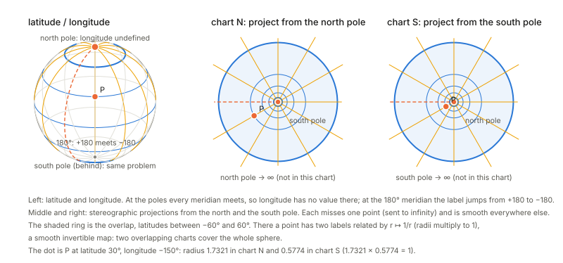
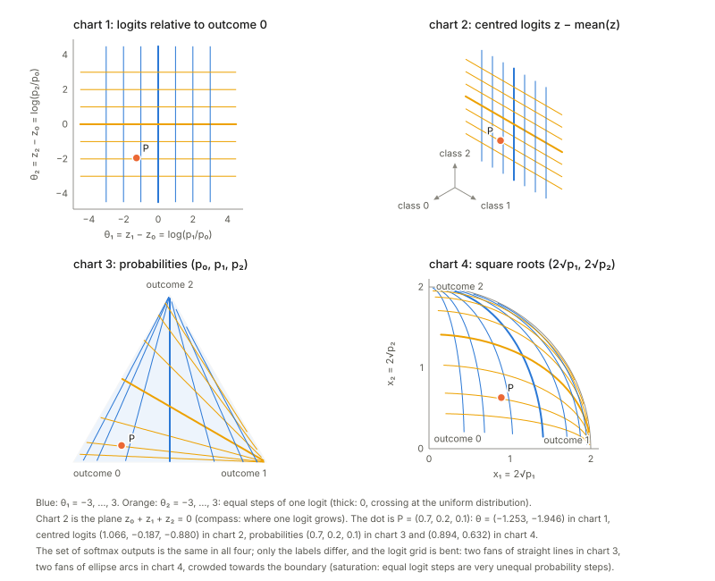
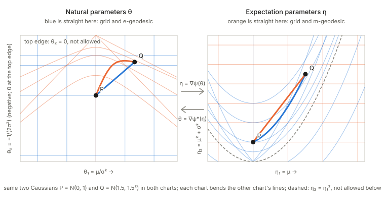

Notes for Chapter 1 of Amari, *Information Geometry and Its Applications* (Springer, 2016). The next section summarises the book's chapter in my own words. The sections after it are explorations that I asked for, one at a time, so they follow my questions and not the book's order. They keep the intuition, the figures and the derivations, and leave out numerical checks.

## What the chapter covers (a summary of the book's chapter)

The chapter builds the whole of information geometry from one idea: a **convex function** on a space of probability distributions gives that space a divergence, a metric, a second coordinate system and two kinds of straight line, and these fit together in a precise way. The sections in order:

- **§1.1 Manifolds.** A manifold is a set whose points can be labelled by $n$ numbers, with nearby points getting nearby labels. The labelling (the coordinate system, or *chart*) can be changed by any smooth invertible map, and the set does not change. Examples used throughout: probability distributions on $n+1$ outcomes (the simplex), Gaussians, positive measures, positive-definite matrices, and the weights of neural networks.
- **§1.2 Divergence between two points.** A divergence $D[P:Q]$ is a non-negative function that is zero only when $P=Q$ and that, for nearby points, looks like a positive-definite quadratic form. It need not be symmetric and need not obey the triangle inequality. That quadratic form is a Riemannian metric, so a divergence gives a manifold a geometry. Examples: the squared Euclidean distance, the KL divergence (also for positive measures), and several divergences between positive-definite matrices.
- **§1.3 Convex functions and Bregman divergence.** The gap between a convex function $\psi$ and its tangent plane is a Bregman divergence, and the metric it induces is the Hessian of $\psi$. A positive-definite Hessian is what makes the construction a genuine metric. For an exponential family the potential is the log-normaliser, its slope is the mean, its Hessian is the covariance (the Fisher information), and the Bregman divergence is the KL divergence with its arguments reversed.
- **§1.4 Legendre transformation.** Because the Hessian is positive definite, the slope map $\theta\mapsto\eta=\nabla\psi(\theta)$ is one-to-one, so slopes are a second coordinate system. The dual potential $\psi^*$ is convex, the dual metric is the inverse matrix, and the dual divergence is the original one with its arguments swapped. There is a self-dual form of the divergence that mixes $\theta$ and $\eta$.
- **§1.5 The dually flat structure.** The manifold carries two flat structures at once, one straight in $\theta$ (e-geodesics) and one straight in $\eta$ (m-geodesics), joined by one Riemannian metric. Tangent vectors have two sets of components, one for each coordinate system, which pair up without needing the metric. Parallel transport by the two rules preserves the inner product of two vectors when each is transported by a different rule. The convexity of $\psi$ is a property of an affine class of charts and not of the manifold alone.
- **§1.6 The generalised Pythagorean theorem and the projection theorem.** If the m-geodesic from $P$ to $Q$ meets the e-geodesic from $Q$ to $R$ at a right angle, then $D(R:P)=D(Q:P)+D(R:Q)$ exactly, and the dual statement holds with the roles swapped. From this follows the projection theorem: the closest point of a flat family to a given point is the foot of the perpendicular, and flatness makes it unique. For two families the two projections can be alternated, which lowers the divergence at every step (the geometric form of the em algorithm). The closing remarks explain how tensors and index notation keep the geometry independent of the chart.

## Links

- The book: Amari, *Information Geometry and Its Applications* (Springer, 2016), DOI [10.1007/978-4-431-55978-8](https://doi.org/10.1007/978-4-431-55978-8). These notes cover Chapter 1 only. Equation numbers such as (1.69) refer to the book. No text of the book is reproduced here.
- **[Interactive companion](figures/interactive.html)**: eleven widgets that go with the explorations below: the Gaussians in three charts, the KL divergence, tangent vectors and the Fisher metric, a positive-definite Hessian, the Bregman divergence, the Legendre transform, the two kinds of straight line, Pythagoras on the Gaussians and on the probability triangle, and projections.

## 1. Manifolds and coordinates (§1.1)

### Two questions about what a manifold is

**How is a manifold different from a vector space?** A vector space has algebra built in: you can add two points, scale a point, and there is an origin. One set of coordinates covers everything, and "straight line" and "distance from the origin" mean the same thing everywhere. A manifold promises only that each small neighbourhood can be labelled by $n$ numbers, with nearby points getting nearby labels. There is no addition, no origin and no global straight line, so "the midpoint of $P$ and $Q$" means nothing until you choose a rule: the arithmetic mixture, the geometric mixture or the shortest path, which in general give different points (§5 computes all three for softmax). One chart may not cover the whole set (next question), and relabelling by any smooth invertible map is allowed, because the set does not change.

This is why the softmax outputs of this chapter form a manifold and not a vector space. The probability triangle is not closed under addition (the sum of two distributions has total mass 2). In logit coordinates the same set looks like a flat plane, where straight lines are e-geodesics, while in the triangle the straight lines are m-geodesics; neither chart is "the" right one. Two caveats. Every vector space is a manifold, the simplest kind, so manifold is the more general notion. And at each point of a manifold there is a tangent space, which *is* a vector space: small steps, gradients and the Fisher metric live there, even though the whole set has no such structure.

**Why does a sphere need at least two charts?** A chart is a continuous, invertible labelling of points by numbers in a flat region, continuous in both directions. A globe cannot be flattened onto one map without cutting it or sending points to infinity. Latitude and longitude show the failure:

- at the poles longitude is undefined, because every meridian meets there (two points a hair's breadth apart near the pole can have longitudes a quarter turn apart);
- across the $180^\circ$ meridian the label jumps from $+180$ to $-180$ (two neighbouring points get longitudes almost a full turn apart).

Dropping those points leaves a chart that no longer covers the sphere. This is not a flaw of one map. The sphere is compact (closed and bounded, with no edge), while a chart has to make it look like an open piece of the plane, and a closed-up set cannot be matched to an open one without cutting: the labels would have to "run out" somewhere, and there nearby points get badly separated labels.

The fix is two overlapping charts. Project stereographically from the north pole: this covers everything except the north pole, which goes to infinity. Project from the south pole: this covers everything except the south pole. Every point is in at least one chart and most are in both. In the overlap a smooth map converts one label into the other, here $r\mapsto1/r$ (the two radii multiply to $1$). A collection of charts that cover the set and agree smoothly in the overlaps is what "manifold" means. In the picture the overlap is the ring of latitudes between $-60^\circ$ and $60^\circ$. Across the $180^\circ$ meridian, where longitude jumps, the two charts give neighbouring points neighbouring labels, with no jump.

Contrast with the examples below. The $(\mu,\sigma)$ half-plane is covered by one chart, because that set does not close up on itself; the same holds for the open probability simplex. One chart is enough for some manifolds, and the sphere is simply not one of them.

### Worked example: the Gaussians in three charts

The *points* of this manifold are Gaussian curves. A *chart* is a way of naming one such curve with two numbers. Three
namings are in common use.

- **Chart 1, $(\mu,\sigma)$**: where the bell sits and how wide it is. The only restriction is $\sigma>0$, so the chart is
  a half-plane.
- **Chart 2, moments $(m_1,m_2)=(\mu,\mu^2+\sigma^2)$**: the two averages $\mathbb E[x]$ and $\mathbb E[x^2]$. Not every
  pair is a Gaussian: $m_2-m_1^2=\sigma^2>0$ confines the chart to the region above the parabola $m_2=m_1^2$.
- **Chart 3, natural parameters $\theta=(\mu/\sigma^2,\,-1/(2\sigma^2))$**: write the density as
  $\exp\{\theta_1x+\theta_2x^2-\psi(\theta)\}$, so $\theta_1,\theta_2$ are the coefficients of $x$ and $x^2$ in the exponent
  (this is the exponential-family form of §3). The restriction is $\theta_2<0$, which is $\sigma>0$ again.

The picture is the point of the example. Nothing about the *set* of Gaussians changes between the panels; only the labels do, and the grid of chart 1 gets bent. Equal steps of $\sigma$ spread out in the moment chart but squeeze toward $\theta_2=0$ in the natural chart. So **distances read off a chart are not real distances**; a chart is only a naming. Making "distance" chart-independent is the job of the metric in §2, and it is why straightness and convexity, which *do* depend on the chart, must be fixed by choosing one on purpose.

Why chart 2 and chart 3 are called a dual pair: the normaliser of the density in chart 3 is
$\psi(\theta)=-\theta_1^2/(4\theta_2)+\tfrac12\log(-\pi/\theta_2)$, and its gradient is exactly $(m_1,m_2)$. Each chart is the slope
of a convex function of the other (the Legendre duality of §4).

The interactive companion's first widget lets you move $\mu$ and $\sigma$ and watch the same Gaussian, and the bent grid, in all three charts.

### Worked example: the softmax in four charts

The same exercise for the running example. A 3-class softmax turns three real numbers $z=(z_0,z_1,z_2)$, the logits, into probabilities $p_k=e^{z_k}/\sum_je^{z_j}$. The *points* of this manifold are the distributions $p$. The logits are one naming of them, and a redundant one: adding the same number to all three logits changes no probability, so a network can move its logits along a whole line without changing its output. The redundancy can be removed in more than one way, and the probabilities are another naming altogether. Four are worth knowing.

- **Chart 1, logits relative to outcome 0**, $\theta=(z_1-z_0,\;z_2-z_0)=\bigl(\log\tfrac{p_1}{p_0},\,\log\tfrac{p_2}{p_0}\bigr)$: pin the first logit to 0. These are the natural parameters of §3 (the distribution is $\exp\{\theta_1x_1+\theta_2x_2-\psi(\theta)\}$, with $x$ the indicator vector of the outcome), and every pair of real numbers is allowed, so the chart is the whole plane.
- **Chart 2, centred logits** $z-\bar z$, $\bar z=\tfrac13(z_0+z_1+z_2)$: remove the redundancy by subtracting the mean instead, so that no outcome is special. The three numbers add to zero, so they live in a plane, which the picture draws oriented like the probability triangle. It is a linear image of chart 1, so straight lines stay straight; what shows up is the three-fold symmetry that the choice of a reference outcome hid.
- **Chart 3, probabilities** $(p_0,p_1,p_2)$, or $\eta=(p_1,p_2)$ once $p_0=1-p_1-p_2$ is eliminated: the expectation parameters, confined to the triangle $p_k>0$.
- **Chart 4, square roots** $(x_1,x_2)=(2\sqrt{p_1},\,2\sqrt{p_2})$: with $x_0=2\sqrt{p_0}$ the point $(x_0,x_1,x_2)$ lies on the sphere of radius 2, and the chart is the octant of that sphere seen from above, a quarter disc. The Fisher metric becomes the ordinary length on the sphere, which is why §5 uses this chart for the Fisher–Rao geodesic.

The picture is the counterpart of the Gaussian one: nothing about the *set* of distributions changes between the panels, only the labels do, and the grid of chart 1 (equal steps of one logit) is bent. The bending has a concrete meaning.

**Saturation.** The lines $\theta_1=c$ (blue) are, in chart 3, straight lines through the corner of outcome 2, because $\theta_1=c$ means $p_1=e^cp_0$. Equal steps of a logit therefore crowd towards the corners: near the centre a small change of a logit is a large change of the output, near the boundary the output hardly responds. That is the saturation of the softmax. The area scale between charts 1 and 3 is $\det G=p_0p_1p_2$, so a unit square of logits covers far less probability where the softmax is saturated.

**What does not bend.** Length measured with the metric. A small step has the same squared length whichever chart computes it, each with its own metric: $G_\theta=\operatorname{diag}(\eta)-\eta\eta^\top$ in chart 1, the covariance of the logit change under $p$ in chart 2, $G^*=\operatorname{diag}(1/\eta_i)+\tfrac1{p_0}\mathbf 1\mathbf 1^\top$ in chart 3 and $I+xx^\top/x_0^2$ in chart 4. Cells of equal size in one panel are not equal lengths; the metric of §2, not the picture, says how far apart two distributions are.

**Lines that are straight in two charts.** The blue lines are straight in charts 1 and 3. In chart 4 they are great circles through the corner of outcome 2, so they are also straight lines of the sphere. As sets, these particular lines are therefore e-geodesics (straight in $\theta$), m-geodesics (straight in $\eta$: mixtures of a fixed pair of outcomes with a point mass on outcome 2) and Fisher–Rao geodesics all at once; as paths with a speed they differ. A generic e-geodesic, like the blue curve of the figure in §5, bends in chart 3. The orange lines do the same with outcome 1, and the third family, $z_1-z_2=$ const, with outcome 0; chart 2 treats the three alike.

## 2. Divergence (§1.2)

**What is asked of $D$.** Three things: $D[P{:}Q]\ge0$; $D[P{:}Q]=0$ only if $P=Q$; and for $Q=P+d\xi$ the function
is, to second order, a positive-definite quadratic form in $d\xi$:

$$
D[\xi:\xi+d\xi]=\tfrac12\,g_{ij}(\xi)\,d\xi^i d\xi^j+O(|d\xi|^3),\qquad G=(g_{ij})\succ0 .
$$

**Why the first-order term is missing.** For fixed $P$, the map $Q\mapsto D[P{:}Q]$ is $\ge0$ and equals $0$ at $Q=P$, so $P$ is a
minimum and the gradient there is zero. What is left at second order is the Hessian, which is a
quadratic form; condition (3) just says it is positive-definite rather than merely positive semi-definite. The
metric is *defined* by $ds^2=2D[\xi:\xi+d\xi]=g_{ij}d\xi^id\xi^j$, with the factor 2 chosen so that
$D=\tfrac12\|\Delta\|^2$ gives the identity matrix.

**A worked example: KL between two Gaussians.** Fix $p=N(0,1)$ and let $q=N(m,\sigma^2)$ move. Then
$\mathrm{KL}[p{:}q]=\int p\log\frac pq\,dx=\log\sigma+\frac{1+m^2}{2\sigma^2}-\frac12$, and the other order is
$\mathrm{KL}[q{:}p]=-\log\sigma+\frac{\sigma^2+m^2}{2}-\frac12$. What you can see by moving $q$ (the interactive page's second widget):

- *The integrand can be negative, the integral cannot.* The integrand $p\log(p/q)$ is positive where $q<p$ and negative where $q>p$, but the total is never negative.
- *Zero only at equality, quadratic nearby.* With equal widths a shift $e$ costs exactly $e^2/2$ in both orders. That is (1.24) with $g=1$, the Fisher information of the mean at $\sigma=1$.
- *Asymmetric as soon as the widths differ.* $\mathrm{KL}[p{:}q]$ punishes a $q$ that is too narrow where $p$ has mass; $\mathrm{KL}[q{:}p]$ punishes the reverse.

**Tangent spaces and the metric, on the Gaussian manifold.** Intuition first. A *tangent vector* at a point is a velocity: pass a smooth curve of Gaussians through $N(\mu,\sigma^2)$ and record how fast the
mean and the width are changing, $v=(\dot\mu,\dot\sigma)$. Collect all such velocities and you get the **tangent space** at that point, a flat plane attached to it. Every point has its own plane; they are
copies of $\mathbb R^2$, but a vector in one plane is not a vector in another until you say how to compare them. A **Riemannian metric** is a rule for measuring the length of the vectors in each plane,
$|v|^2=g_{ij}v^iv^j$, changing smoothly from point to point. Here it comes from the divergence, $ds^2=2D$, and for the Gaussians in the chart $(\mu,\sigma)$ it is

$$
g=\begin{bmatrix}1/\sigma^2&0\\0&2/\sigma^2\end{bmatrix},\qquad ds^2=\frac{d\mu^2+2\,d\sigma^2}{\sigma^2}.
$$

Why this shape: whether a change in the mean matters depends on how wide the bell is. A shift $d\mu$ is hard to notice when $\sigma$ is large and easy when $\sigma$ is small, so the same Euclidean step is *longer* where the Gaussian is narrow. The set of steps of unit Riemannian length (the *indicatrix*) is an ellipse that shrinks as $\sigma\to0$, which is the picture on the interactive page.

The length is what you pay in divergence: for a small step $d$, $\mathrm{KL}\approx\tfrac12 d^\top g\,d$, and the approximation gets better as the step shrinks (the next term in the expansion is cubic). Large steps, especially near small $\sigma$, are far from the quadratic regime.

The length does not depend on the chart: the same step written in natural coordinates has the same length with the metric $G_\theta=\nabla^2\psi$. That is the tensor law (1.130) at work: $g$ changes with the chart, but the *length of the same tangent vector* does not. Euclidean length is chart-dependent and misleading.

**Deriving the KL divergence between two Gaussians.** Let $p=N(\mu,\sigma^2)$ and $q=N(\mu+a,(\sigma+b)^2)$; write $\mu'=\mu+a$ and $\sigma'=\sigma+b$. KL is the average, under $p$, of the log-ratio of the densities, so start by writing the two log-densities:

$$
\log p(x)=-\ln\!\big(\sigma\sqrt{2\pi}\big)-\frac{(x-\mu)^2}{2\sigma^2},\qquad
\log q(x)=-\ln\!\big(\sigma'\sqrt{2\pi}\big)-\frac{(x-\mu')^2}{2\sigma'^2}.
$$

Subtracting, the $\sqrt{2\pi}$ cancels:

$$
\log\frac{p(x)}{q(x)}=\ln\frac{\sigma'}{\sigma}-\frac{(x-\mu)^2}{2\sigma^2}+\frac{(x-\mu')^2}{2\sigma'^2}.
$$

Now take the expectation under $p$, where $x$ has mean $\mu$ and variance $\sigma^2$. The constant $\ln(\sigma'/\sigma)$ stays. The middle term uses $\mathbb E_p[(x-\mu)^2]=\sigma^2$, giving $-\sigma^2/(2\sigma^2)=-\tfrac12$.
For the last term, split $x-\mu'=(x-\mu)+(\mu-\mu')=(x-\mu)-a$; the cross term has mean zero, so
$\mathbb E_p[(x-\mu')^2]=\sigma^2+a^2$. Putting the three pieces together,

$$
\boxed{\ \mathrm{KL}[p{:}q]=\ln\frac{\sigma'}{\sigma}+\frac{\sigma^2+a^2}{2\sigma'^2}-\frac12
=\ln\frac{\sigma+b}{\sigma}+\frac{\sigma^2+a^2}{2(\sigma+b)^2}-\frac12\ }
$$

which is the formula used in the expansion below. Swapping the roles gives the other order, $\mathrm{KL}[q{:}p]=\ln\frac{\sigma}{\sigma'}-\frac12+\frac{\sigma'^2+a^2}{2\sigma^2}$, which is in general a different number: the asymmetry.

Sanity checks on the formula. *Identical Gaussians* ($a=b=0$): $0+\tfrac12-\tfrac12=0$. *Equal widths* ($b=0$): $\mathrm{KL}=a^2/(2\sigma^2)$, half the squared shift measured in units of the width. *Equal means* ($a=0$), with $r=\sigma'/\sigma$: $\mathrm{KL}=\ln r+\frac1{2r^2}-\frac12$, which is zero only at $r=1$ and is bigger for a too-narrow $q$ ($r<1$) than for a too-wide one of the same ratio. That last point is the asymmetry that §2 describes in words: $\mathrm{KL}[p{:}q]$ punishes a $q$ that is narrower than $p$.

**Deriving $g$, $ds^2$ and the length of a tangent vector.** *Velocity.* A path of Gaussians $t\mapsto(\mu(t),\sigma(t))$ has velocity $v=(\dot\mu,\dot\sigma)$ at $t=0$, with components in the basis
$\partial/\partial\mu,\ \partial/\partial\sigma$. *Metric.* By definition $ds^2=2D[\xi{:}\xi+d\xi]$. For the step $(\mu,\sigma)\to(\mu+a,\sigma+b)$ the KL divergence has the closed form
$\mathrm{KL}=\ln\frac{\sigma+b}{\sigma}+\frac{\sigma^2+a^2}{2(\sigma+b)^2}-\frac12$. Expand each piece to second order:

$$
\ln\!\Big(1+\frac b\sigma\Big)=\frac b\sigma-\frac{b^2}{2\sigma^2}+\cdots,\qquad
\frac{\sigma^2+a^2}{2(\sigma+b)^2}=\frac12+\frac{a^2}{2\sigma^2}-\frac b\sigma+\frac{3b^2}{2\sigma^2}+\cdots
$$

(the term $a^2b$ is cubic and dropped). Adding them and subtracting $\tfrac12$, the $b/\sigma$ terms cancel:

$$
\mathrm{KL}\approx\frac{a^2}{2\sigma^2}+\frac{b^2}{\sigma^2}=\tfrac12\,\frac{a^2+2b^2}{\sigma^2}
\ \Longrightarrow\ g=\begin{bmatrix}1/\sigma^2&0\\0&2/\sigma^2\end{bmatrix},\quad ds^2=\frac{d\mu^2+2\,d\sigma^2}{\sigma^2}.
$$

The leftover terms are cubic in the step, which is why the approximation improves as the step shrinks.
*A second route.* The Fisher information is $g_{ij}=\mathbb E[s_is_j]$ with scores $s_i=\partial_i\log p$. Here $s_\mu=(x-\mu)/\sigma^2$ and $s_\sigma=((x-\mu)^2-\sigma^2)/\sigma^3$, so with
$z=(x-\mu)/\sigma$ standard normal, $\mathbb E[s_\mu^2]=1/\sigma^2$, $\mathbb E[s_\sigma^2]=\mathbb E[(z^2-1)^2]/\sigma^2=2/\sigma^2$ and $\mathbb E[s_\mu s_\sigma]=\mathbb E[z(z^2-1)]/\sigma^2=0$: the same matrix. *Length of a vector.* For $v=(\dot\mu,\dot\sigma)$ at the point $(\mu,\sigma)$,
$|v|^2=v^\top Gv=(\dot\mu^2+2\dot\sigma^2)/\sigma^2$, and the length of a curve is $\int\sqrt{(\dot\mu^2+2\dot\sigma^2)/\sigma^2}\,dt$.

**The Fisher ellipse, and why it shrinks.** The *Fisher ellipse* (indicatrix) at a point is the set of tangent vectors of fixed length $\varepsilon$:
$\dot\mu^2/(\varepsilon\sigma)^2+\dot\sigma^2/(\varepsilon\sigma/\sqrt2)^2=1$, with half-axes $\varepsilon\sigma$ along $\mu$ and $\varepsilon\sigma/\sqrt2$ along $\sigma$. Since $\mathrm{KL}\approx\tfrac12|v|^2$, every step on one ellipse
costs the same divergence $\approx\varepsilon^2/2$: it is the set of changes to the distribution that are equally detectable. It shrinks as $\sigma\to0$ for two reasons. In the mean direction a shift $a$ costs $a^2/(2\sigma^2)$: a narrow bell leaves its former self after a small shift, so a fixed cost allows only $a=\varepsilon\sigma$.
In the width direction the cost $b^2/\sigma^2$ depends only on the *relative* change $b/\sigma$, so the allowed $b$ is again proportional to $\sigma$. Said once: in relative units $(d\mu/\sigma,\,d\sigma/\sigma)$, $ds^2=(d\mu/\sigma)^2+2(d\sigma/\sigma)^2$ and the ellipse has the same half-axes $\varepsilon,\ \varepsilon/\sqrt2$
at *every* $\sigma$; the absolute sizes shrink because the unit of measurement, $\sigma$, does. This matches the statistical reading: the mean of $N$ samples is known to
$\sigma/\sqrt N$, so shifts smaller than that are invisible. (Writing $ds^2=2\big[(d\mu/\sqrt2)^2+d\sigma^2\big]/\sigma^2$ shows the half-plane is the hyperbolic plane of curvature $-\tfrac12$ in
the coordinates $(\mu/\sqrt2,\sigma)$.)

## 3. Convex functions and the Bregman divergence (§1.3)

**A picture first.** Draw a convex function $\psi$ and its tangent line at a point $\theta_0$. The curve stays above
the line. The vertical gap at another point $\theta$ is the **Bregman divergence**

$$
D_\psi[\theta:\theta_0]=\psi(\theta)-\psi(\theta_0)-\nabla\psi(\theta_0)\cdot(\theta-\theta_0).
$$

It is $\ge0$ by convexity, and it is zero only at $\theta=\theta_0$ if $\psi$ is *strictly* convex. Taylor-expanding $\psi$ about
$\theta_0$ shows $D_\psi[\theta_0+d\theta:\theta_0]=\tfrac12d\theta^\top\nabla^2\psi(\theta_0)\,d\theta+O(|d\theta|^3)$, so the metric of §2 is
the **Hessian**, $g_{ij}=\partial_i\partial_j\psi$ (1.86).

**Bregman divergence, step by step, in one dimension.** Pick a convex $\psi$ and two points $x_0$ (the base) and $x$ (the probe).

1. Draw the tangent line of $\psi$ at $x_0$: $\ell_{x_0}(x)=\psi(x_0)+\psi'(x_0)(x-x_0)$.
2. Because $\psi$ is convex it lies on or above its tangent everywhere.
3. The vertical gap at the probe is $D_\psi[x{:}x_0]=\psi(x)-\ell_{x_0}(x)$, "how far above the tangent drawn at $x_0$ is the function at $x$".

Swap the roles (draw the tangent at $x$, measure at $x_0$) and you get $D_\psi[x_0{:}x]$, a different gap unless $\psi$ is a parabola. Familiar divergences are Bregman divergences of familiar potentials: $\psi=\tfrac12x^2$ gives half the squared distance (symmetric), the log-sum-exp of a coin gives the KL divergence between two coins with its arguments reversed, $-\log x$ gives the Itakura–Saito divergence and $x\log x$ the generalised KL divergence.

Near the base the gap is a parabola with curvature $\psi''(x_0)$, and this is the squared length that defines the metric. Away from the base the shape is set by the third and higher derivatives, which is where the asymmetry lives. And if $\psi''(x_0)=0$ there is no parabola at all: the gap of $\psi=x^4$ at $0$ grows like $x^4$, so it is not a squared length. The interactive page's fourth widget draws the tangent, both gaps and the parabola for five choices of $\psi$.

**What "positive-definite Hessian" means, concretely.** Near a point, a smooth function is its tangent plane plus a quadratic bowl:
$\psi(\theta+d)\approx\psi(\theta)+\nabla\psi\cdot d+\tfrac12\,d^\top H\,d$ with $H=\nabla^2\psi(\theta)$. For a Bregman divergence the tangent plane
is subtracted off, so only the bowl is left, $D\approx\tfrac12 d^\top Hd$. The matrix $H$ is **positive-definite** when $d^\top Hd>0$ for *every*
direction $d\ne0$, that is, when the bowl curves upwards in every direction. Four equivalent ways to say it:

- *Every direction curves up.* The "curvature along the unit direction $u$" is $u^\top Hu$, and it must be positive for all $u$.
- *All eigenvalues are positive.* The eigenvectors are the directions of extreme curvature, the eigenvalues are the curvatures there, and every other direction lies in between.
- *The unit ball is an ellipse.* Define the length $|d|_H=\sqrt{d^\top Hd}$; the set $|d|_H=1$ is an ellipse whose half-axes are $1/\sqrt{\lambda_i}$ along the eigenvectors. This is why a positive-definite $H$ can serve as a **metric**: it assigns every nonzero step a positive length. Where $\lambda$ is large, steps are expensive and the ellipse is thin.
- *Sylvester's test (2×2).* $H=\left[\begin{smallmatrix}a&b\\b&c\end{smallmatrix}\right]$ is positive-definite exactly when $a>0$ and $\det H=ac-b^2>0$.

What goes wrong otherwise, with the examples the widget offers: if the smallest eigenvalue is **zero** (positive *semi*-definite) there is a flat direction, a trough, along which steps have length zero, so the Hessian is blind there and is not a metric. If an eigenvalue is **negative** the surface is a saddle or a hill in that direction, "length" would be imaginary, and $\psi$ is not convex. The Hessian of log-sum-exp is a covariance matrix, which is positive-definite. The interactive page's third widget lets you drag the three entries of a 2×2 matrix and watch the ellipse, the eigen-directions and the curvature-by-direction curve turn into a trough or a saddle.

## 4. The Legendre dual: slopes as coordinates (§1.4)

**Idea.** Because $\nabla^2\psi\succ0$, the slope map $\theta\mapsto\eta=\nabla\psi(\theta)$ is one-to-one: distinct points of the
graph have distinct tangent planes. So *the slope can serve as a coordinate*. For softmax this says that the logits
and the probabilities are two names for the same point, and the map between them (softmax) is the slope map of log-sum-exp.

**The Legendre transform, three pictures of one thing.** Take a convex $\psi$ and a slope $\eta$.

1. *Slope as a name.* Each point $\theta$ of the graph has a tangent line with slope $\eta=\psi'(\theta)$; because $\psi'$ is increasing, distinct points have distinct slopes, so
   the slope identifies the point just as well as $\theta$ does.
2. *Intercept as the dual function.* Draw the tangent line of slope $\eta$. Where it crosses the vertical axis $\theta=0$ is $\psi(\theta)-\eta\theta$, so
   $\psi^*(\eta)=\eta\theta-\psi(\theta)$ is **minus the intercept**. Tracing how the intercept changes with the slope draws the curve $\psi^*$.
3. *The best a linear function can do.* $\psi^*(\eta)=\max_{\theta'}\{\eta\theta'-\psi(\theta')\}$: the largest amount by which the line $\eta\theta'$ rises above $\psi$. The maximum is at the
   $\theta'$ where the slope of $\psi$ equals $\eta$, which is picture 1 again.

Three things to see. The slope of $\psi^*$ at $\eta$ is the original point $\theta$: the roles of point and slope are exchanged, which is (1.64). The curvatures are reciprocal, $\psi''(\theta)\,\psi^{*\prime\prime}(\eta)=1$: a steep potential has a flat dual and vice versa, which is $G^*=G^{-1}$ of (1.66). And transforming twice returns $\psi$. The interactive page's fifth widget shows the tangent, its intercept and the dual curve together for four potentials.

## 5. Two flat structures and the shortest path (§1.5)

### The dually flat structure of the Gaussian family

The family of Gaussians is the smallest example in which both flat structures can be seen at once. It has two coordinate systems that are each natural for a different reason: the natural parameters $\theta=(\mu/\sigma^2,\,-1/(2\sigma^2))$ and the expectation parameters $\eta=(\mu,\,\mu^2+\sigma^2)$. One convex potential $\psi$ links them, $\eta=\nabla\psi(\theta)$ and $\theta=\nabla\psi^*(\eta)$.

<figure>

<figcaption>The same two Gaussians in the two charts. In the $\theta$ chart the blue lines are straight (the grid and the e-geodesic) and the orange ones bend; in the $\eta$ chart it is the other way round. Each chart makes one kind of line straight and bends the other.</figcaption>
</figure>

Read the figure as one idea shown twice. A line is "straight" only relative to a chart. In the $\theta$ chart the straight line between $P$ and $Q$ is the **e-geodesic**; in the $\eta$ chart it is the **m-geodesic**; and each of them looks bent in the other chart. Both charts are flat in their own sense, and the potential and its Legendre dual convert one into the other, which is what "dually flat" means. The allowed region is also different in each chart: the variance must be positive, which excludes the top edge $\theta_2=0$ in the left panel and everything on or below the parabola $\eta_2=\eta_1^2$ in the right one.

**Where the potential $\psi$ comes from.** Write the Gaussian density in exponential-family form,

$$p(x;\theta)=\exp\{\theta_1x+\theta_2x^2-\psi(\theta)\},\qquad \theta_1=\frac{\mu}{\sigma^2},\ \theta_2=-\frac1{2\sigma^2}<0 .$$

*Step 1: normalisation defines $\psi$.* The factor $e^{-\psi(\theta)}$ does not depend on $x$, and the density must integrate to 1, so $e^{\psi(\theta)}=\int e^{\theta_1x+\theta_2x^2}dx$, that is $\psi(\theta)=\log\int e^{\theta_1x+\theta_2x^2}dx$. The potential is the log of the normalising integral (in physics, the log of the partition function).

*Step 2: complete the square in $x$.* Because $\theta_2<0$, rewrite the exponent as
$\theta_2x^2+\theta_1x=\theta_2\big(x+\tfrac{\theta_1}{2\theta_2}\big)^2-\tfrac{\theta_1^2}{4\theta_2}$.
The first part integrates to the standard Gaussian integral $\int e^{\theta_2u^2}du=\sqrt{\pi/(-\theta_2)}$, and the second part does not depend on $x$ and comes out of the integral.

*Step 3: the answer.* Taking the logarithm,

$$\psi(\theta)=-\frac{\theta_1^2}{4\theta_2}+\frac12\log\!\Big(\frac{\pi}{-\theta_2}\Big).$$

Back in $(\mu,\sigma)$ this is $\psi=\mu^2/(2\sigma^2)+\log\sigma+\tfrac12\log2\pi$: the first term is the effect of the mean and the second the effect of the width. It is a bowl over the half-plane $\theta_2<0$ that rises without limit as $\theta_2\to0^-$, which is the forbidden top edge of the left chart in the figure.

*Reading it back.* The slope of $\psi$ gives the other chart: $\partial\psi/\partial\theta_1=-\theta_1/(2\theta_2)=\mu$ and $\partial\psi/\partial\theta_2=\theta_1^2/(4\theta_2^2)-1/(2\theta_2)=\mu^2+\sigma^2$, so $\nabla\psi(\theta)=\eta$, the arrow in the figure. Its curvature $\nabla^2\psi$ is the covariance of $(x,x^2)$, the Fisher information in this chart. The dual potential is $\psi^*=\theta\cdot\eta-\psi=-\tfrac12\log(2\pi e\sigma^2)$, the negative entropy of the Gaussian, and the pair $(\psi,\psi^*)$ is what the two arrows between the charts are doing.

**Two kinds of straight.** Declare $\theta$ an affine coordinate system: a curve $\theta(t)=at+b$ is straight, an *e-geodesic*. Declare $\eta$ affine too: $\eta(t)=at+b$ is a *m-geodesic*. Because $\theta\mapsto\eta$ is not linear, the two families of lines are different. The picture below shows one pair of distributions on three outcomes joined by both, in the logit chart (left, e-geodesic straight) and the probability triangle (right, m-geodesic straight).

The e-geodesic passes through a normalised geometric mixture of the two distributions, and the m-geodesic through the ordinary mixture. Neither is the **Fisher–Rao geodesic**, the true shortest path for the metric $G$ (a great-circle arc after $p\mapsto\sqrt p$), which in this example lies between the other two. That is the pattern one expects from the standard fact, which this chapter does not prove, that the Riemannian connection is the average of the two flat ones.

**The two straight lines on the Gaussian manifold.** Take the example from §1: a point is $N(\mu,\sigma^2)$, with two affine charts, the natural parameters $\theta=(\mu/\sigma^2,\,-1/(2\sigma^2))$ and the moments $\eta=(\mu,\ \mu^2+\sigma^2)$. Join $P=N(0,1^2)$ and $Q=N(1.5,1.5^2)$.

*The e-geodesic: straight in $\theta$.* Put $\theta(s)=(1-s)\theta_P+s\,\theta_Q$. Translating back to $(\mu,\sigma)$ with $\theta_2=-1/(2\sigma^2)$ and $\theta_1=\mu/\sigma^2$:

$$
\frac1{\sigma_s^2}=\frac{1-s}{\sigma_P^2}+\frac{s}{\sigma_Q^2},\qquad
\frac{\mu_s}{\sigma_s^2}=(1-s)\frac{\mu_P}{\sigma_P^2}+s\,\frac{\mu_Q}{\sigma_Q^2}.
$$

In words: the **precisions** $1/\sigma^2$ average linearly, and the mean is the **precision-weighted** average, $\mu_s=\sigma_s^2\big[(1-s)\mu_P/\sigma_P^2+s\,\mu_Q/\sigma_Q^2\big]$. Equivalently, the density is a normalised geometric mixture,
$\log p_s=(1-s)\log p+s\log q+\text{const}$, which for Gaussians is again a Gaussian.

*The m-geodesic: straight in $\eta$.* Put $\eta(s)=(1-s)\eta_P+s\,\eta_Q$. The first moment is linear, $\mu_s=(1-s)\mu_P+s\mu_Q$, and the second moment is linear, so the variance is

$$
\sigma_s^2=(1-s)\sigma_P^2+s\,\sigma_Q^2+s(1-s)(\mu_P-\mu_Q)^2 .
$$

This is the variance of the *mixture* $(1-s)p+s\,q$: the mixture's two moments are averaged, and the extra $s(1-s)(\mu_P-\mu_Q)^2$ is the spread between the two component means.

**A subtlety.** The mixture itself is *not* a Gaussian, so it is not a point of the Gaussian manifold. The point of the m-geodesic is the Gaussian with the *same mean and variance as the mixture*. Within the manifold, "straight in $\eta$" means exactly this moment-matched curve.

*The third curve.* The Fisher–Rao geodesic, the true shortest path for the metric $G$, is neither. In the coordinates $(x,y)=(\mu/\sqrt2,\sigma)$ the metric is $ds^2=2(dx^2+dy^2)/y^2$, a hyperbolic half-plane, whose geodesics are semicircles centred on $y=0$; that gives the third curve below.

The e-curve stays *narrower* than the m-curve: the e-path averages precisions (small $\sigma$ dominates), the m-path averages variances and adds the mean-spread term. The Fisher–Rao curve lies between them, and it is the shortest in the metric. They are also *different paths*, not different speeds on the same path: the KL divergences from the two ends differ along each.

Which is "straight" depends on which coordinates you count as affine, and the chapter's choice of $\psi$ makes $\theta$ affine for one structure and $\eta$ for the other. For the exponential family $\theta$-lines are the *natural* interpolations (average the exponent: geometric mixtures),
and $\eta$-lines are the moment interpolations (average what you can measure: mixtures). Interpolating two trained Gaussian models, say, by averaging logits and averaging probabilities are the same dichotomy.

**The Fisher–Rao geodesic.** The e- and m-geodesics are "straight" in a chart. The Fisher–Rao geodesic is something else: the path that is **shortest for the metric $G$**, locally. Intuition first: a path through the manifold has a length, add up the Riemannian length of each little step, and a *geodesic* is a path
you cannot shorten by wiggling it with the endpoints held fixed. Formally

$$
L[\gamma]=\int_0^1\sqrt{g_{ij}(\gamma)\,\dot\gamma^i\dot\gamma^j}\;dt ,
$$

and a geodesic is a critical point of $L$; it satisfies $\ddot\gamma^k+\Gamma^k_{ij}\dot\gamma^i\dot\gamma^j=0$, where the symbols $\Gamma$ are built from $g$ and its derivatives (the Levi-Civita connection; the book develops it in Part II, and I use it here only through its answer). Parametrised at constant speed, a geodesic does no "sideways steering".
It differs from the e- and m-lines because the metric is not constant in $\theta$ or in $\eta$: in a chart where $g$ varies, a straight line in the chart is not the shortest path.

*On the Gaussians it can be written down.* With $x=\mu/\sqrt2$ and $y=\sigma$ the metric is $ds^2=2(dx^2+dy^2)/y^2$: twice the hyperbolic metric of the upper half-plane. Its geodesics are the **vertical half-lines** and the **semicircles centred on the axis $y=0$**. Why, in three steps:
(i) a vertical line is the fixed set of the reflection $x\mapsto 2x_0-x$, which is an isometry, so a shortest path cannot leave it; (ii) inversion in a circle centred on $y=0$ is an isometry and maps vertical lines to semicircles; (iii) a semicircle $x=c+r\cos\varphi,\ y=r\sin\varphi$ has
$ds=\sqrt2\,d\varphi/\sin\varphi$, so moving uniformly in $\ln\tan(\varphi/2)$ is moving at constant speed.

*The distance.* Two Gaussians $(\mu_1,\sigma_1)$ and $(\mu_2,\sigma_2)$ are at Fisher–Rao distance

$$
d=\sqrt2\;\operatorname{arccosh}\!\Big(1+\frac{(\Delta\mu)^2/2+(\Delta\sigma)^2}{2\sigma_1\sigma_2}\Big).
$$

The semicircle is shorter than the straight chord in the $(\mu,\sigma)$ plane, shorter than the e-geodesic and shorter than the m-geodesic, and every perturbation of it with the endpoints fixed lengthens it.

*Relation to KL.* For nearby points $d^2\approx2\,\mathrm{KL}$ in either order, because both share the quadratic part (§2). As the points move apart the three spread: the true distance lies between the two KL-based numbers. So KL is not a distance, and its two orders over- and under-estimate the shortest-path distance by different amounts. The Fisher–Rao distance, unlike KL, is symmetric, satisfies the triangle inequality and does not depend on the chart.

*Three curves, three meanings.* The e-geodesic is straight in the natural coordinates and the m-geodesic straight in the moment coordinates: they depend on the *flat structures* built from $\psi$. The Fisher–Rao geodesic depends only on the *metric*, so it is the same for every divergence that induces this $g$
(§2: all of them agree to second order). It is the Riemannian geodesic of the dually flat manifold; that it lies "between" the e- and m-geodesics is what one expects from the standard fact that the Riemannian connection is the average of the two flat ones, which this chapter does not prove.

## 6. The Pythagorean theorem and projections (§1.6)

Let $P,Q,R$ be three points. Suppose the **m-geodesic** from $P$ to $Q$ is orthogonal, at $Q$, to the **e-geodesic** from $Q$ to $R$. Then $D_\psi(R{:}P)=D_\psi(Q{:}P)+D_\psi(R{:}Q)$ (Theorem 1.2).

### Pythagoras, a picture to hold on to

*Start from the one you know.* In the plane, take $\psi=\tfrac12\|x\|^2$, so that $D=\tfrac12\times$ squared distance. For a right triangle $P,Q,R$ the squared sides add up (the 3-4-5 triangle, every side squared and halved). The right angle is the statement $(Q-P)\cdot(R-Q)=0$. Two things played a role, and both get generalised.

| In the plane | In a dually flat manifold |
|---|---|
| squared length $\tfrac12\|x-y\|^2$ | the divergence $D_\psi$ |
| the right angle $(Q-P)\cdot(R-Q)=0$ | the pairing $(\eta_Q-\eta_P)\cdot(\theta_R-\theta_Q)=0$ |
| a straight line (one kind) | an $\eta$-straight line for one leg, a $\theta$-straight line for the other |
| $\theta=\eta$ | $\theta\ne\eta$: the two charts differ, so "perpendicular" must pair a difference of one with a difference of the other |

The pairing is the whole trick. When $\psi=\tfrac12\|x\|^2$ the charts coincide ($\eta=\theta$) and the pairing is the ordinary dot product; in general the leg $P\to Q$ is naturally described by the *difference of $\eta$*, the leg $Q\to R$ by the *difference of $\theta$*, and orthogonality
is the vanishing of their pairing.

*The same statement for Gaussians.* The m-geodesic from $P$ to $Q$ is a straight line in $\eta$ (a path of mixtures of moments, drawn as a curve in the $(\mu,\sigma)$ plane). Leave $Q$ along the $\theta$-straight line in the direction orthogonal to it and stop at $R$. Since $D_\psi[\theta_X{:}\theta_Y]=\mathrm{KL}[Y{:}X]$, the theorem reads $\mathrm{KL}[P{:}R]=\mathrm{KL}[P{:}Q]+\mathrm{KL}[Q{:}R]$, and the two sides agree exactly whether $R$ is narrower or wider than $Q$: the leg $Q\to R$ may go either way along the $\theta$-line.

*Tilting away from the right angle.* Rotate the second leg a little away from orthogonal and the sum no longer equals the direct divergence. The leftover is not an approximation error: it is exactly the pairing $(\theta_Q-\theta_R)\cdot(\eta_Q-\eta_P)$ that the right angle sets to zero. In the Euclidean case this is the law of cosines, so the theorem is the law of cosines with the cosine term switched off, and moving away from a right angle switches it on, by exactly the pairing.

*Why you cannot see the right angle in a picture.* Neither chart is orthonormal: in the $\theta$ chart the $\theta$-leg is straight and the $\eta$-leg curved, in the $\eta$ chart the opposite, and the metric $G$ that defines "perpendicular" varies from point to point. What you can check is the pairing, which is chart-free. The next
widget on the interactive page draws both legs on the Gaussians, stacks the two divergences against the direct one, and lets you tilt.

*What it buys.* Information from $P$ to $R$ *splits*: $\mathrm{KL}[P{:}R]=\mathrm{KL}[P{:}Q]+\mathrm{KL}[Q{:}R]$ says the cost of describing $R$ through $P$ is the cost of reaching $Q$ plus the cost of going on to $R$, with no cross term, exactly when
$Q$ is the foot of the perpendicular. That is why the foot is the closest point (see the projection theorem below) and why maximum-likelihood fitting decomposes into a fit term and an error term.

### The projection theorem on the Gaussians

The projection theorem answers: *given a point $P$ and a family $S$ inside the manifold, which member of $S$ is closest to $P$?* In the plane the answer is the foot of the perpendicular, and flatness of $S$ (a line) makes it unique. The same holds here, with "closest" meaning smallest divergence and "perpendicular" meaning the pairing of §6 vanishes.
A Gaussian example where every step can be seen: let $S=\{N(0,\sigma^2)\}$, the **zero-mean Gaussians**. In the $(\mu,\sigma)$ plane it is the vertical axis $\mu=0$. It is a straight line in $\theta$ ($\theta_1=\mu/\sigma^2=0$) and also in $\eta$ ($\eta_1=\mu=0$), so it is flat in both senses.
Take $P=N(1.5,1^2)$ and ask for the member of $S$ that minimises $\mathrm{KL}[P{:}R]$, the direction of model fitting.

*Find the foot by the geometry.* The foot $\hat R$ is where the m-geodesic from $P$ (straight in $\eta$) meets $S$ at a right angle. The tangent of $S$ in $\theta$ points along $\theta_2$ only (since $\theta_1$ stays $0$), so orthogonality pairs it with the second coordinate of $\eta_P-\eta_{\hat R}$, and that forces the second moment to match: **the foot keeps the second moment of $P$**, $\hat\sigma^2=\mu_P^2+\sigma_P^2$. Along the way the m-geodesic keeps $\mu^2+\sigma^2$ fixed: it is an arc of a circle in the $(\mu,\sigma)$ plane that arrives horizontally at the vertical axis. Because the metric is diagonal here, "perpendicular" is the usual perpendicular in the picture.

*Why it is the minimum, not just a critical point (Pythagoras).* For every $R$ in $S$, $\mathrm{KL}[P{:}R]=\mathrm{KL}[P{:}\hat R]+\mathrm{KL}[\hat R{:}R]$. The second term is $\ge0$ and vanishes only at $R=\hat R$: that is uniqueness (Theorem 1.5). The right panel of the figure below plots both sides, and they coincide.

*This is maximum likelihood.* Fitting a zero-mean Gaussian to data means maximising the likelihood over $\sigma$, which is minimising $\mathrm{KL}[\text{data}{:}R]$; the answer is the **second moment**, $\hat\sigma^2=\overline{x^2}$.
In the geometry: the m-projection onto an e-flat family matches the dual coordinates ($\eta_2$) that the family can express, and ignores the rest ($\eta_1$, the mean, which $S$ has no freedom to match). Matching moments *is* the m-projection.

*The other order has its own foot.* Minimise $\mathrm{KL}[R{:}P]$ over $S$ instead: the minimiser keeps $P$'s width. Its path from $P$ is the e-geodesic, which is **horizontal** ($\sigma$ fixed) and also meets $S$ at a right angle, at a different point. The theorem pairs each projection with *its* order of $\mathrm{KL}$, and using the wrong split around the wrong foot fails. Both versions work because $S$ is flat in both senses.

*Only one flat structure: the dual case.* Fix the mean instead: the family is a straight line in $\eta$ but not in $\theta$, so it is m-flat only, and only one of the two projections is guaranteed to be the unique minimiser; the circle counterexample below shows what fails for a curved family.

### Orthogonality is necessary, not sufficient

The projection theorem only says that the foot point is a *critical* point. The book notes this. A concrete case: in the Euclidean setting ($\psi=\tfrac12\|\xi\|^2$) take $S$ the unit circle and a point $P$ inside it, off centre. Two points of the circle have the segment to $P$ orthogonal to the circle: the closest point and the *farthest* one. Flatness of $S$ is what excludes this.

The interactive page lets you see the non-Euclidean version: for a curved arc and $\mathrm{KL}[R\Vert P]$, put $P$ near the centre of curvature and the divergence along the arc has two minima and a maximum.
