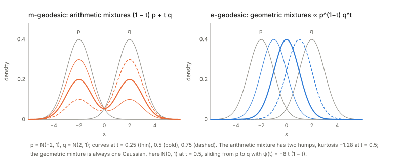
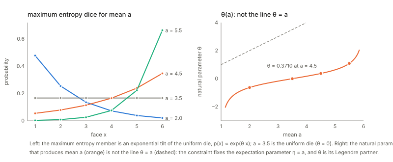
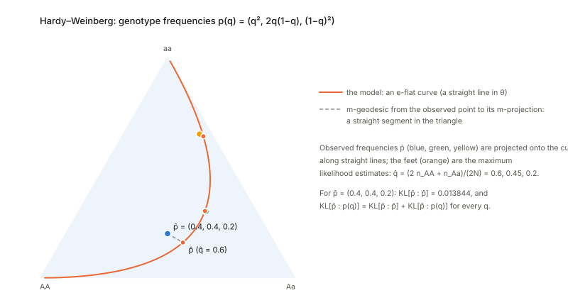

## Links

- **[Interactive companion](figures/interactive.html)**: eight widgets. (1) $\psi$ as the cumulant function: slope is the mean, curvature is the variance, for four families.
  (2) Arithmetic versus geometric mixtures of two Gaussians, with mode counts and kurtosis. (3) Maximum entropy for a die with a prescribed mean, and the Pythagorean split against a random die.
  (4) A 2×2 table, its product of marginals and the mutual information; and the geometric versus arithmetic mixture of two independent tables. (5) Hardy–Weinberg: maximum likelihood as a straight-line projection onto an e-flat curve.
  (6) The kernel exponential family with three centres. (7) The dictionary between a Bregman divergence and an exponential family, for three potentials. (8) The Pythagorean identity in function space, with a tilt.
- **[Runnable checks](https://github.com/msrepo/information_geometry_notes/tree/main/chapters/ch02-exponential-and-mixture-families/code)**:
  `code/exp_families.py` prints every number on this page and regenerates the figures with `python3 code/exp_families.py --figures`. `make verify` runs it, in about two seconds.
- The book: Amari, *Information Geometry and Its Applications* (Springer, 2016), DOI [10.1007/978-4-431-55978-8](https://doi.org/10.1007/978-4-431-55978-8). These notes cover Chapter 2 only; equation numbers such as (2.16) refer to the book.
  No text of the book is reproduced here; everything is restated and re-derived.
- Previous chapter: **[Chapter 1: the dually flat structure](../ch01-dually-flat-structure/index.html)**, which this chapter specialises: the potential $\psi$ becomes the cumulant function of a family of probability distributions, and the Bregman divergence becomes KL.
  Background on the annotations site: **[The Fisher information matrix](https://msrepo.github.io/theory_inclined_papers_with_annotations/fisher-information/)** and **[EM and Gaussian mixtures](https://msrepo.github.io/theory_inclined_papers_with_annotations/expectation-maximization/)**.

## In one paragraph

Chapter 1 built a geometry from any convex function. Chapter 2 says **there is a family of probability distributions behind it**, the exponential family, whose cumulant function is $\psi$. For that family the abstract objects are statistical ones:
$\theta$ is the natural parameter, $\eta=\nabla\psi(\theta)=\mathbb E[x]$ is the **mean of the sufficient statistics**, the dual potential is the (relative) negative entropy, the Bregman divergence is KL with its arguments reversed, and the Riemannian metric
$\nabla^2\psi$ is the **Fisher information**, because it is a covariance matrix. The *other* flat structure belongs to the **mixture family**: distributions of the form $\sum\eta_iq_i$ are straight lines in $\eta$ (ordinary mixing), while the exponential family's straight lines in $\theta$ are *geometric* mixing
($\log p_t=(1-t)\log p+t\log q-\psi(t)$). The discrete distributions on $n+1$ outcomes are both at once, which is why the chapter's examples live there. The payoff is three classical statistical facts read as one theorem: **the maximum entropy distribution under moment constraints** is an e-projection of the uniform,
**mutual information** is the KL distance to the independent distributions (an m-projection), and **maximum likelihood** is an m-projection of the observed point. In all three the generalised Pythagorean theorem of Chapter 1 splits the divergence into an explained part and a leftover part.

## The spine of the argument

1. An **exponential family** is $p(x;\theta)=\exp\{\theta\cdot x-\psi(\theta)\}$ with respect to a reference measure; absorb $k(x)$ into the measure and take the sufficient statistics as the new variable $x$ (§1).
2. Differentiating the normalisation shows $\nabla\psi=\mathbb E[x]=\eta$ and $\nabla^2\psi=\operatorname{Cov}[x]$, so the Chapter-1 metric **is** the Fisher information (Theorem 2.1) and $D_\psi$ is KL (§1).
3. Gaussians and the discrete distributions $S_n$ are exponential families (§2). $S_n$ is also a **mixture family**; a general mixture family has the potential $\varphi(\eta)=\int p\log p$, convex in $\eta$ (§3).
4. Straight lines: **e-geodesics** interpolate log-densities (geometric mixing, a one-parameter exponential family); **m-geodesics** interpolate expectations (arithmetic mixing for $S_n$, the moment-matched member in general) (§4).
5. The space of all densities is formally both kinds of family at once, with the pairing of (2.71) as the Pythagorean obstruction; rigorously it is delicate (§5). The **kernel exponential family** is a better-behaved infinite-dimensional version (§6).
6. **Every regular Bregman divergence is the KL of some exponential family**, so exponential families are a universal model of dually flat manifolds (§7).
7. Three applications of the Pythagorean theorem: maximum entropy, mutual information, maximum likelihood (§8).

## Setup and notation

| Symbol | Meaning | In the examples |
|---|---|---|
| $x=(x_1,\dots,x_n)$ | the sufficient statistics $x_i=h_i(x)$, treated as the random variable | indicator, $(x,x^2)$, $(\log x,x)$ |
| $\mu$ | the reference (dominating) measure, $d\mu=e^{k(x)}dx$ | counting/$x!$, Lebesgue, $dx/x$ |
| $\theta$ | natural (canonical) parameter, the e-affine coordinates | logits, $-\text{rate}$, $(\mu/\sigma^2,-1/2\sigma^2)$ |
| $\psi(\theta)$ | $\log\int e^{\theta\cdot x}d\mu$: cumulant function, free energy | log-sum-exp, $e^\theta$, $-\log(-\theta)$ |
| $\eta=\nabla\psi$ | expectation parameter $\mathbb E[x]$, the m-affine coordinates | probabilities, $\lambda$, mean |
| $\varphi(\eta)$ | $\theta\cdot\eta-\psi=\mathbb E[\log p]$, negative entropy *relative to $\mu$* | $\sum p\log p$ for $S_n$ |
| $g_{ij}=\partial_i\partial_j\psi$ | Fisher information $=\operatorname{Cov}[x]$; $g^{ij}=\partial^i\partial^j\varphi$ is its inverse | |

Index convention (2.19): a **lower** index differentiates in $\theta$, $\partial_i=\partial/\partial\theta_i$; an **upper** index differentiates in $\eta$, $\partial^i=\partial/\partial\eta_i$. A mixture family is $p=\sum\eta_iq_i$ with $\sum\eta_i=1$.

## 1. The exponential family (§2.1)

**The form.** Any family $p(x;\theta)=\exp\{\sum\theta_ih_i(x)+k(x)-\psi(\theta)\}$ can be rewritten with the vector $x=(h_1(x),\dots,h_n(x))$ as the variable and $d\mu=e^{k}dx$ as the measure, giving the clean form $p=\exp\{\theta\cdot x-\psi(\theta)\}$.
The statistics $h_i$ must be *linearly* independent (not independent: $x$ and $x^2$ are dependent but linearly independent, so a Gaussian is a 2-parameter family). Then $\psi(\theta)=\log\int e^{\theta\cdot x}d\mu$, and by Chapter 1 it is convex.

*One-dimensional examples* (checked in `code/exp_families.py`; the interactive page's first widget lets you slide $\theta$ and watch the slope and curvature of $\psi$ turn into the mean and the variance):

| family | $\theta$ | $\psi$ | $\eta=\psi'$ | $\psi''$ | at | result |
|---|---|---|---|---|---|---|
| Bernoulli | $\log\frac p{1-p}$ | $\log(1+e^\theta)$ | $p$ | $p(1-p)$ | $\theta=0.7$ | $\eta=0.6682$, $\psi''=0.2217$ |
| Poisson | $\log\lambda$ | $e^\theta$ | $\lambda$ | $\lambda$ | $\lambda=3$ | $\eta=3.0000$ |
| exponential | $-\text{rate}$ | $-\log(-\theta)$ | mean $=-1/\theta$ | $\eta^2$ | rate 2 | $\eta=0.5000$, $\psi''=0.25$ |
| Gaussian | $(\mu/\sigma^2,\,-1/2\sigma^2)$ | $-\theta_1^2/4\theta_2+\frac12\log(-\pi/\theta_2)$ | $(\mu,\mu^2+\sigma^2)$ | covariance of $(x,x^2)$ | $(1,2)$ | $\eta=(1,5)$ |

*A less familiar example, the Gamma family.* Take statistics $(\log x,\,x)$ and the measure $dx/x$: then $\theta=(\text{shape},\,-1/\text{scale})$ and $\psi=\log\Gamma(\theta_1)-\theta_1\log(-\theta_2)$.
At shape $3$, scale $2$: $\theta=(3,-0.5)$, $\psi=2.7726$, $\eta=\nabla\psi=(1.6159,\,6)$, which is $(\operatorname{digamma}(3)+\log2,\ 6)$; quadrature gives the same $(\mathbb E\log x,\ \mathbb E x)=(1.6159,6)$.
The Hessian is $\left[\begin{smallmatrix}0.3949&2\\2&12\end{smallmatrix}\right]=\left[\begin{smallmatrix}\operatorname{trigamma}(3)&-1/\theta_2\\-1/\theta_2&\theta_1/\theta_2^2\end{smallmatrix}\right]$, and the covariance of $(\log x,x)$ by quadrature is the same matrix.

**"Negative entropy" is relative to the measure.** The dual potential is $\varphi=\theta\cdot\eta-\psi=\mathbb E[\log p]$, where $p$ is the density *with respect to $\mu$*. It is the Shannon negative entropy only when $\mu$ is Lebesgue or counting measure with $k=0$.
For the Poisson family at $\lambda=3$: $\theta\eta-\psi=0.2958$, while the true Shannon negative entropy $\sum p\log p$ is $-1.9315$; the difference, $-2.2273$, is exactly $-\mathbb E[\log x!]$, the contribution of the reference measure $1/x!$. For the exponential distribution ($\mu$ = Lebesgue) the two agree, $-0.3069$ vs the quadrature $-0.3068$,
and for the Gaussian $\theta\cdot\eta-\psi=-2.1121=-\tfrac12\log(2\pi e\sigma^2)$ at $\sigma=2$.

**Divergence and metric.** The Bregman divergence of $\psi$ is the KL divergence with its arguments reversed, $D_\psi[\theta{:}\theta']=\mathrm{KL}[p_{\theta'}\Vert p_\theta]$ (2.16): this is the two-line calculation of Chapter 1, so $\mathrm{KL}$ is the *dual* divergence of the canonical one.
The metric is $g_{ij}=\partial_i\partial_j\psi$ in $\theta$ and $g^{ij}=\partial^i\partial^j\varphi$ in $\eta$, inverse to each other.

**Theorem 2.1 (the metric is the Fisher information).** The score of the model is $\partial_i\log p(x;\theta)=x_i-\partial_i\psi=x_i-\eta_i$, since $\log p=\theta\cdot x-\psi$. So

$$
g_{ij}=\mathbb E\big[\partial_i\log p\;\partial_j\log p\big]=\mathbb E\big[(x_i-\eta_i)(x_j-\eta_j)\big]=\operatorname{Cov}[x]_{ij}=\partial_i\partial_j\psi,
$$

the last equality being (1.56) of Chapter 1. Check on the Gamma family: the second moment of the score, by quadrature, is $\left[\begin{smallmatrix}0.3949&2\\2&12\end{smallmatrix}\right]$, equal to the finite-difference Hessian of $\psi$.
Everything on the geometric side (Fisher metric, e-flatness) is therefore *already* a statement about covariances of the statistics.

## 2. The two examples: Gaussians and discrete distributions (§2.2)

**Gaussian.** With statistics $(x,x^2)$ the natural parameters are $\theta=(\mu/\sigma^2,\,-1/2\sigma^2)$ and the dual ones $\eta=(\mu,\mu^2+\sigma^2)$, as in Chapter 1 (§1 and §5 there). A technical point the book spells out: $x_1=x$ and $x_2=x^2$ are tied by $x_2=x_1^2$, so the dominating measure on the $(x_1,x_2)$-plane lives on the parabola, $d\mu=\delta(x_2-x_1^2)\,dx$.
The family is still two-dimensional because the two statistics are linearly independent.

**Discrete distributions $S_n$.** For outcomes $\{0,\dots,n\}$ write $\log p(x)=\sum_{i\ge1}\log\frac{p_i}{p_0}\,\delta_i(x)+\log p_0$, using $\delta_0=1-\sum_{i\ge1}\delta_i$. Thus the statistics are the indicators $x_i=\delta_i$, the natural parameters are the log-odds relative to outcome $0$, $\theta_i=\log(p_i/p_0)$,
and $\psi=-\log p_0=\log(1+\sum e^{\theta_i})$ (log-sum-exp with one logit pinned to 0). The expectation parameters are the probabilities themselves, $\eta_i=p_i$, and $\varphi(\eta)=\sum_{i\ge0}p_i\log p_i$ is the negative entropy; $\nabla\varphi$ returns $\theta_i=\log\frac{\eta_i}{1-\sum\eta}$ in terms of $p_0$.
This is the softmax example of Chapter 1.

## 3. Mixture families (§2.3)

Given $n+1$ linearly independent distributions $q_0,\dots,q_n$, the **mixture family** is $p(x;\eta)=\sum\eta_iq_i(x)$ with $\eta_i>0$, $\sum\eta_i=1$. Its m-affine coordinates are the weights $\eta$, and $S_n$ is the special case where $q_i=\delta_i$: **$S_n$ is an exponential family and a mixture family at once**,
and in that case the $\eta$ of the exponential family *is* the mixing weight vector. In general a mixture family is *not* an exponential family, but it still has a dually flat structure: its negative entropy $\varphi(\eta)=\int p\log p$ is convex in $\eta$, so take it as the potential, make $\eta$ the (m-) affine coordinates and $\theta=\nabla\varphi$ the (e-) coordinates.
The divergence of $\varphi$ is again KL, now in the *natural* order, $D_\varphi[\eta{:}\eta']=\mathrm{KL}[p_\eta\Vert p_{\eta'}]$ (2.48).

*A two-component example.* $q_0=N(0,1)$, $q_1=N(3,1)$, $p(x;\eta)=(1-\eta)q_0+\eta q_1$. Then (all by quadrature on a fine grid):

| $\eta$ | $\varphi(\eta)$ | $\theta=\varphi'(\eta)$ | $\varphi''(\eta)$ |
|---|---|---|---|
| 0.2 | −1.7920 | −1.0967 | 4.8003 |
| 0.5 | −1.9457 | 0.0000 | 3.2110 |
| 0.8 | −1.7920 | +1.0967 | 4.8003 |

The second derivative has the closed form $\varphi''=\int(q_1-q_0)^2/p$, positive (so $\varphi$ is convex), and it matches finite differences. The first derivative is $\theta=\int(q_1-q_0)\log p$: *the e-coordinate of a mixture is a difference of average log-densities*, $\mathbb E_{q_1}[\log p]-\mathbb E_{q_0}[\log p]$.
KL is the Bregman divergence of $\varphi$: $\mathrm{KL}[p_{0.2}\Vert p_{0.7}]=0.4260$ and $\varphi(\eta)-\varphi(\eta')-\varphi'(\eta')(\eta-\eta')=0.4260$. This $\theta$ ranges from $-2.214$ at $\eta=0.05$ to $+2.214$ at $\eta=0.95$, and it is not the natural parameter of any exponential family: the geometry is dually flat, but the family is not exponential.

## 4. e-flat and m-flat (§2.4)

**e-geodesic.** The straight line in $\theta$ between $p_1=p(\cdot;\theta_1)$ and $p_2$ is $\theta(t)=(1-t)\theta_1+t\theta_2$, that is

$$
\log p(x;t)=(1-t)\log p_1(x)+t\log p_2(x)-\psi(t),\qquad p(x;t)=\exp\{t\,(\theta_2-\theta_1)\cdot x+\theta_1\cdot x-\psi(t)\},
$$

a **geometric (log-linear) mixture**, and itself a one-parameter exponential family with natural parameter $t$. A submanifold defined by *linear constraints in $\theta$* is **e-flat**.

**m-geodesic.** The straight line in $\eta$, $\eta(t)=(1-t)\eta_1+t\eta_2$, linearly interpolates the expectation of $x$. For $S_n$ it is the ordinary **mixture** $(1-t)p_1+tp_2$. For a general exponential family the arithmetic mixture is *not* a member of the family, but the member with $\eta=(1-t)\eta_1+t\eta_2$ is: it is the member
that has the same expected statistics as the mixture (moment matching). A submanifold defined by *linear constraints in $\eta$* is **m-flat**.

*Concrete.* Take $p=N(-2,1)$ and $q=N(2,1)$ and $t=0.5$.

The **geometric mixture** is $N(0,1)$ (one mode at $0$, peak $0.3989$), and its normaliser is $\int\sqrt{pq}=e^{-(\mu_1-\mu_2)^2/8}=0.1353$, so $\psi(0.5)=-2.0000$; in general $\psi(t)=-t(1-t)(\mu_1-\mu_2)^2/2$, which at $t=0.3$ is $-1.6800$ (checked: $\log p(x;t)$ minus the linear interpolation is constant to $10^{-16}$).
The **arithmetic mixture** has *two modes*, at $\pm2$, density $0.0540$ at the midpoint, variance $5.0000=1+4$ and excess kurtosis $-1.2800$. For *unequal widths* the roles are different: with equal means and widths 1 and 2, the arithmetic mixture has variance $2.5000$ and excess kurtosis $+1.0800$ (heavy tails),
while the geometric mixture is $N(0,\,1.6000)$ ($\sigma=1.2649$, precisions averaged: $0.6250$), Gaussian, no excess. The geometric mixture concentrates where both densities are large; the arithmetic mixture is a union. Which is the right "average of two models" depends on the use, and the interactive page's second widget lets you vary the distance and the width ratio.

This fits Chapter 1's softmax picture ($e$-path: average logits, $m$-path: average probabilities) and its Gaussian picture (precisions average on the e-path, variances plus a spread term on the m-path).

## 5. The space of all densities (§2.5)

The set $F$ of all positive densities is, formally, **both** a mixture family (generated by the point masses $\delta(x-s)$, with mixing weights $p(s)$) **and** an exponential family (with $\theta(s)=\log p(s)+\psi$ and $\eta(s)=p(s)$, so the dual coordinate *is* the density). The e-geodesic from $p$ to $q$ is the geometric mixture $\propto p^{1-t}q^t$ and the
m-geodesic the arithmetic mixture $(1-t)p+tq$; their velocities are $\log q-\log p$ and $q-p$ (2.67–2.68). The normaliser of the geometric mixture is always finite since $\int p^{1-t}q^t\le1$ (Hölder), so the e-geodesic stays in $F$.

**The Pythagorean theorem, derived directly.** For three densities, expand:

$$
\mathrm{KL}[p{:}r]-\mathrm{KL}[p{:}q]-\mathrm{KL}[q{:}r]=\int(p-q)\,(\log q-\log r)\,dx .
$$

So $\mathrm{KL}[p{:}r]=\mathrm{KL}[p{:}q]+\mathrm{KL}[q{:}r]$ **exactly when** $\int(p-q)(\log r-\log q)=0$: the mixture direction $p-q$ is orthogonal to the exponential direction $\log r-\log q$ (2.70–2.71). Discretised on 8 points with random $p,q,r$ the identity gives $-1.883155$ on both sides.
Choosing $r=q\,e^{tv}/Z$ with $\sum(p-q)v=0$ makes the pairing vanish: the pairing is $+3.5\times10^{-17}$ at $t=0.5$ and $+3.9\times10^{-16}$ at $t=2$, and the split holds ($1.020902=1.020902$ and $1.691517=1.691517$). The widget on the interactive page tilts $v$ away from perpendicular and the gap equals the pairing.

**The local metric.** $\mathrm{KL}[p{:}p+\delta]\approx\tfrac12\int\delta^2/p$, so $ds^2=\int(\delta p)^2/p\,dx$ is the Fisher information. In the discretised check the ratio of the true KL to $\tfrac12\sum\delta^2/p$ is $0.9168,\ 0.9875,\ 0.9987$ for $\delta=1,\,0.1,\,0.01$ times a fixed direction.
In $\theta$ coordinates the metric is diagonal, $g(s,t)=p(s)\delta(s-t)$, with inverse $\delta(s-t)/p(s)$ in $\eta$ (2.74–2.75): different outcomes do not interact.

**Why this is only formal.** The book is candid that this is not rigorous: the topology of $F$ is delicate ($L^1$ and $L^2$ differ, and the topology from $p$ differs from the one from $\log p$), KL-neighbourhoods fail the axioms of a topology base (Csiszár), and the entropy functional is not continuous on $F$ though it is on $S_n$.
A concrete illustration of the last point: $p_n=(1-\tfrac1n)N(0,1)+\tfrac1n\,\mathrm{Uniform}[10,\,10+e^{n^2}]$ stays within $L^1$ distance about $2/n$ of $N(0,1)$, yet its negative entropy is $-3.403,\ -4.582,\ -5.627,\ -6.636,\ -7.633$ for $n=2,\dots,6$ (against $-1.419$ for $N(0,1)$): it falls without bound while the density converges. Pistone and co-workers' Orlicz-space construction is the rigorous route.

## 6. The kernel exponential family (§2.6)

To get an infinite-dimensional exponential family that behaves better than the formal one, replace the finitely many statistics by one per point $y$: $p(x)=\exp\{\int\theta(y)k(x,y)\,dy-\psi[\theta]\}$ with respect to a measure $\mu$ (say $d\mu=e^{-x^2/2\tau^2}dx$), for a positive kernel $k$ such as the Gaussian kernel. The natural parameter is the *function* $\theta(y)$ and the dual parameter is the
**mean embedding** $\eta(y)=\mathbb E[k(x,y)]$. The delta kernel gives back the formal picture of §5. A kernel exponential family does not contain all densities, but it is a legitimate manifold.

*A finite example, to see it.* Three centres $y=(-1,0.5,2)$, Gaussian kernel of width $0.5$, $\tau=2$, weights $\alpha=(1.5,-1,2)$ (so $\theta(y)=\sum\alpha_j\delta(y-y_j)$). Then $\psi=2.1394$, and $\eta_j=\mathbb E[k(x,y_j)]=(0.2406,\,0.0869,\,0.2305)$ by quadrature, equal to the finite-difference gradient $\partial\psi/\partial\alpha_j$.
The Hessian is the covariance of the three kernel values, with eigenvalues $0.01946,\ 0.05331,\ 0.15256$: all positive, so $\psi$ is convex in $\alpha$. The positivity condition (2.78) holds: the Gram matrix of the Gaussian kernel on six points has smallest eigenvalue $0.4046$. The density is bimodal (modes at $-0.96$ and $1.94$): positive weights add bumps, and the negative weight digs a hole.

## 7. Bregman divergences and exponential families (§2.7)

Conversely, given a convex $\psi$, is there an exponential family behind it? Pick a point $\eta'=x$ of the dual coordinates and let $\theta'$ be its natural coordinates. Then the divergence from $\theta$ to the point of $x$ is $\psi(\theta)+\varphi(x)-\theta\cdot x$, so
$p(x;\theta)=\exp\{-D_\psi[\theta{:}\theta'(x)]+\varphi(x)\}=\exp\{\theta\cdot x-\psi(\theta)\}$ **is** an exponential family, provided there is a measure $\mu$ with $e^{\psi(\theta)}=\int e^{\theta\cdot x}d\mu(x)$, that is, $e^{\psi}$ is the Laplace transform of a measure (2.85). Banerjee et al. prove a bijection between regular exponential families
and regular Bregman divergences (Theorem 2.2): **every regular Bregman divergence is the KL divergence of an exponential family**, which makes exponential families a universal model of dually flat manifolds. Three examples, with the measure and the numbers (the interactive page's seventh widget):

| $\psi$ | measure $\mu$ | family | $D_\psi[\theta{:}\theta']$ | direct $\mathrm{KL}[p_{\theta'}\Vert p_\theta]$ |
|---|---|---|---|---|
| $\theta^2/2$ | $N(0,1)$: $\int e^{1.3x}dN=2.3280=e^{1.3^2/2}$ | Gaussian $N(\theta,1)$ | $\tfrac12(\theta-\theta')^2=1.1250$ at $(2,0.5)$ | $1.1250$ |
| $e^\theta$ | counting$/x!$: $\sum e^{0.4x}/x!=4.4452=\exp(e^{0.4})$ | Poisson$(e^\theta)$ | $0.9014$ at $\lambda=3,\ \lambda'=1$ | $0.9014$ |
| $-\log(-\theta)$ | Lebesgue on $x>0$ | exponential, mean $-1/\theta$ | $0.6363$ at means $2$ and $0.5$ | $0.6364$ |

So the **Itakura–Saito divergence** of Chapter 1 is the KL between exponential distributions, the **generalised KL** is the KL between Poisson distributions, and squared Euclidean distance is the KL between unit-variance Gaussians.
*A caveat the book states:* a mixture family has a dually flat structure with the potential $\varphi$, but Theorem 2.2 does not make it an exponential family; the exponential family built from that $\varphi$ is a different one.

## 8. Applications of the Pythagorean theorem (§2.8)

### 8.1 Maximum entropy

Let $c_1(x),\dots,c_k(x)$ be statistics and prescribe their expectations, $\mathbb E[c_i]=a_i$. The distributions satisfying this form $M(a)$, which is **m-flat** (it is defined by linear constraints in $\eta$, and mixtures of its members stay inside).
The entropy maximiser is the point of $M(a)$ closest to the uniform distribution $P_0$ in the sense $\mathrm{KL}[P{:}P_0]=\log(n+1)-H(P)$: it is the **e-projection** of $P_0$ onto $M(a)$, and the Pythagorean relation $\mathrm{KL}[P{:}P_0]=\mathrm{KL}[P{:}\hat P]+\mathrm{KL}[\hat P{:}P_0]$ holds for every $P\in M(a)$ (2.89): the entropy lost relative to the uniform splits into the entropy lost *to reach $M(a)$*
and the extra loss from $\hat P$ to $P$. Sweeping $a$, the maximisers form the exponential family $\hat p(x;\theta)=\exp\{\theta\cdot c(x)-\psi(\theta)\}$: **maximum entropy distributions are exponential tilts of the uniform**.

*A die.* Outcomes $1,\dots,6$, constraint $\mathbb E[x]=a$. The maximiser is $p(x)\propto e^{\theta x}$ with $\theta$ solving the mean condition:

| $a$ | $\theta$ | entropy | $\mathrm{KL}[\hat P{:}P_0]=\log6-H$ |
|---|---|---|---|
| 2.0 | −0.6296 | 1.3675 | 0.4243 |
| 3.5 | 0.0000 | 1.7918 | 0.0000 (uniform) |
| 4.5 | +0.3710 | 1.6136 | 0.1782 |
| 5.5 | +1.0870 | 0.9534 | 0.8384 |

At $a=4.5$ the maximiser is $(0.0544,\,0.0788,\,0.1142,\,0.1654,\,0.2398,\,0.3475)$. Among 2000 random dice with mean $4.5$ the largest entropy found is $1.6086<1.6136$, and the Pythagorean split holds for all 2000 with largest gap $6.7\times10^{-16}$;
the orthogonality is the pairing $\theta\,(\mathbb E_P[x]-a)=8.2\times10^{-16}$: the e-geodesic from $P_0$ to $\hat P$ is the line $\theta x$, and it is orthogonal to the whole constraint set because every $P\in M(a)$ has the same mean.

**A slip in the printed text.** The book says the maximisers form a $k$-dimensional exponential family "where the natural coordinates are specified by $\theta=a$" (below (2.89)). The constraint $\mathbb E[c]=a$ fixes the *expectation* parameter: $\eta=a$. The natural parameter $\theta(a)$ is a different number, as the table shows ($0.3710$ at $a=4.5$, not $4.5$), and the right panel of the figure plots it against the line $\theta=a$.

### 8.2 Mutual information

For two variables, the independent distributions $p_X(x)p_Y(y)$ form $M_I$. It is **e-flat**: the geometric mixture of two products is again a product. Numerically: with $a\otimes b$, $a=(0.7,0.3)$, $b=(0.2,0.8)$ and $c\otimes d$, $c=(0.4,0.6)$, $d=(0.9,0.1)$, both have odds ratio $1.0000$; their *geometric* midpoint has odds ratio $1.000000$ (independent),
while their *arithmetic* midpoint has odds ratio $0.4167$ and mutual information $0.0228$ (not independent). So independence is e-flat but not m-flat. Given a dependent $p(x,y)$, the closest independent distribution in $\mathrm{KL}[p{:}q]$ is the **m-projection**, the product of the marginals, and the divergence is the **mutual information** $I(X;Y)=\mathrm{KL}[p(x,y)\Vert p_X(x)p_Y(y)]$.

*Worked.* $P=\left[\begin{smallmatrix}0.4&0.1\\0.2&0.3\end{smallmatrix}\right]$ has marginals $(0.5,0.5)$ and $(0.6,0.4)$, odds ratio $6$, product of marginals $\left[\begin{smallmatrix}0.3&0.2\\0.3&0.2\end{smallmatrix}\right]$, and $I=0.086305$. For any independent $Q$, $\mathrm{KL}[P{:}Q]=I+\mathrm{KL}[\hat P{:}Q]$: with $Q$ uniform$\times$uniform, $0.106440=0.086305+0.020136$.
For Gaussians the mutual information has the closed form $-\tfrac12\log(1-\rho^2)$: at $\rho=0.8$, $0.5108$, and two-dimensional quadrature gives $0.5108$.
The *reverse problem* the book mentions: among joint distributions with the same marginals as $\hat P$ (an m-flat line, here parametrised by $s=P_{00}\in(0.1,0.5)$), $I$ is $0$ at the independent point $s=0.3$ and largest at the ends, $0.4217$ near $s=0.1$ and near $s=0.5$, where a cell empties.

### 8.3 Repeated observations and maximum likelihood

**$N$ observations.** For $N$ independent draws the joint density is $\exp\{N[\theta\cdot\bar x-\psi(\theta)]\}$, depending on the data only through the average $\bar x$: it has the same form with $\psi\to N\psi$. So the divergence and the Fisher information both scale by $N$ and the dual structure (the charts $\theta$ and $\eta$) does not change.
Check with coins ($N=10$): $\mathrm{KL}$ between the two binomial laws is $0.8228=10\times\mathrm{KL}[\mathrm{Ber}(0.7)\Vert\mathrm{Ber}(0.5)]$, and the variance of the count is $2.1000=Np(1-p)$ at $p=0.7$.

**The observed point.** The data define a point of the *whole* exponential family $M$ by its m-coordinates, $\bar\eta=\bar x$ (the histogram for $S_n$): 7 heads in 10 gives $\bar\eta=0.7$ and, unrestricted, $\hat\theta=\operatorname{logit}(0.7)=0.8473$. If the statistical model $S\subset M$ is a submanifold, $\theta=\theta(u)$, then maximising the log-likelihood
$\sum\log p(x_i;u)$ is minimising $\mathrm{KL}[\bar p{:}p(\cdot;u)]$ (the two differ by the constant $\sum\bar p\log\bar p$): **the maximum likelihood estimator is the m-projection of the observed point onto the model**.

*Hardy–Weinberg.* Genotypes $(AA,Aa,aa)$ occur with probabilities $(q^2,\,2q(1-q),\,(1-q)^2)$ if allele $A$ has frequency $q$. This is a 1-parameter model inside $S_2$. In natural coordinates $\theta=(\log2+L,\ 2L)$ with $L=\log\frac{1-q}q$, a *straight line* $\theta_2=2\theta_1-2\log2$ (residuals $\lesssim4\times10^{-16}$ at $q=0.1,\dots,0.9$): the model is **e-flat**.
With counts $(40,40,20)$, so $\bar p=(0.4,0.4,0.2)$, brute-force maximum likelihood gives $\hat q=0.6000=(2n_{AA}+n_{Aa})/2N$, $\hat p=(0.36,\,0.48,\,0.16)$ and $\mathrm{KL}[\bar p\Vert\hat p]=0.013844$. Because the model is e-flat the projection is unique and the Pythagorean split holds for all $q$:
$\mathrm{KL}[\bar p\Vert p(q)]=\mathrm{KL}[\bar p\Vert\hat p]+\mathrm{KL}[\hat p\Vert p(q)]$, largest gap over 500 values of $q$ equal to $8.9\times10^{-16}$; and the orthogonality $(\bar\eta-\hat\eta)\cdot\partial\theta/\partial q=-2.2\times10^{-12}$ is just the score equation. Other counts: $(20,50,30)\to\hat q=0.4500$, $\mathrm{KL}=0.000051$ (nearly Hardy–Weinberg already), and $(5,30,65)\to\hat q=0.2000$, $\mathrm{KL}=0.001873$.

The m-geodesic from the observed point to its projection is a **straight segment** in the probability triangle (the picture above). The interactive page's fifth widget lets you set the counts and watch the foot move along the curve.

**Remarks the chapter ends on.** Exponential families are the ideal setting; $S_n$ being exponential means any model of a *discrete* variable is a submanifold of one. For continuous variables many models are *curved* exponential families (submanifolds), or not exponential at all, and then one uses a local approximation by a larger exponential family. Generalised linear models are dually flat without being exponential (Vos), and mixture models have their own geometry (Marriott, Critchley et al.).

## Checks of the book's statements

| Where | Statement | What I found |
|---|---|---|
| (2.13)–(2.14) | the dual potential $\varphi$ is the negative entropy | true relative to the reference measure only: Poisson $\theta\eta-\psi=0.2958$ vs Shannon $-1.9315$, differing by $-\mathbb E[\log x!]=-2.2273$ |
| (2.16) | $D_\psi[\theta'{:}\theta]$ is the KL | consistent with Chapter 1: $D_\psi[\theta{:}\theta']=\mathrm{KL}[p_{\theta'}\Vert p_\theta]$ (argument order reversed); verified for Gaussian, Poisson, exponential |
| Theorem 2.1 | metric = Fisher information | verified; score $=x-\eta$, second moment $=$ Hessian $=$ covariance (Gamma family, quadrature) |
| (2.48) | KL is the Bregman divergence of $\varphi$ on a mixture family | verified numerically: $0.4260$ both ways |
| (2.51), (2.53) | e-geodesic is log-linear; m-geodesic interpolates $\mathbb E[x]$ | verified; for a general exponential family the m-geodesic is the moment-matched member, not the arithmetic mixture |
| (2.61) | $p(x)=\exp\{\int\theta(s)\delta(s-x)\,dx-\psi\}$ | the integration variable should be $s$, not $x$ (otherwise nothing depends on $x$) |
| (2.70)–(2.71) | Pythagoras in $F$ iff $\int(p-q)(\log r-\log q)=0$ | verified: the gap is exactly $\int(p-q)(\log q-\log r)$ |
| (2.80) | kernel exponential family $\exp\{\int\theta(y)k(x,y)\,dx-\psi\}$ | integrates over $x$ where it should integrate over $y$ (checked on the page image) |
| (2.89) | $\hat P$ is the e-projection of $P_0$, Pythagoras holds | verified for 2000 dice, largest gap $6.7\times10^{-16}$ |
| (2.90) | "natural coordinates are specified by $\theta=a$" | should be $\eta=a$; $\theta(a)$ is a different number ($0.3710$ at $a=4.5$) |
| §2.8.2 | independent family is e-flat | verified: geometric midpoint has odds ratio $1.000000$; the arithmetic midpoint $0.4167$ |
| §2.8.3 | MLE is the m-projection | verified; for Hardy–Weinberg (an e-flat model) the split and orthogonality hold to $10^{-12}$ |

## Questions and doubts

- **Which "negative entropy"?** The book writes $\varphi=\int p\log p$ throughout, but the dual potential is $\mathbb E[\log p]$ with $p$ a density *with respect to the reference measure $\mu$*. They are the same only for $k\equiv0$. The Poisson numbers show how large the discrepancy can be.
  For maximum entropy (§8.1) the uniform measure is the reference, which is why that section is clean; for other families, "entropy" depends on the base measure, and so does what a maximum entropy principle means.
- **The Laplace condition.** Theorem 2.2 needs a measure $\mu$ with $e^{\psi}=\int e^{\theta\cdot x}d\mu$. For a given regular Bregman divergence it is not obvious to me that this always exists (it is a statement that $e^{\psi}$ is a Laplace transform of a positive measure). I have only verified it for three cases where the measure is known; the conditions behind "regular" in Banerjee et al. would settle it.
- **The formal function-space picture.** It is useful and its algebra is exact (the identity behind (2.70) is a one-line expansion), but the topology issues are real: the entropy functional is discontinuous (the example above falls to $-7.633$ at $n=6$ while the density converges in $L^1$) and KL-balls do not generate a topology. Which of the chapter's statements about $F$ survive in Pistone's Orlicz framework, and which need extra integrability? I would want that stated before using $F$ as more than a source of intuition.
- **Where is the m-geodesic?** For $S_n$ it is the ordinary mixture, which is a probability distribution. For a general exponential family the "m-geodesic" the book uses is the moment-matched member, not the mixture. The word hides a projection: mixing and then projecting back to the family. Is there a clean statement of which geometric property the moment-matched curve has that the mixture curve loses (the mixture leaves the manifold)?
- **Maximum likelihood on a curved model.** When $S$ is e-flat (Hardy–Weinberg) the m-projection is unique and a Pythagorean split holds. For a *curved* submanifold of an exponential family there can be several critical points, and the orthogonality condition is the score equation without a global guarantee. The chapter notes this but defers it to the asymptotic theory of Part III.
- **Why the baseline for $S_n$?** Using $n$ logits with one pinned to $0$ makes $S_n$ a *minimal* exponential family. The redundant $n+1$ logits give a singular Hessian (the softmax covariance has the all-ones direction as a null vector). The function-space formulas of §5, with $g(s,t)=p(s)\delta(s-t)$, silently use the redundant version; it is fine as a formal object but it is not the metric on the simplex.

## Takeaways

- **An exponential family is a cumulant function in disguise.** $\psi=\log\int e^{\theta\cdot x}d\mu$; its gradient is the mean of the statistics, its Hessian the covariance (= Fisher), its Legendre dual the relative negative entropy, its Bregman divergence the KL with arguments reversed.
- **Two kinds of mixing, two kinds of straight line.** Geometric (log-linear, e-geodesic, an exponential family) versus arithmetic (m-geodesic, a mixture or its moment-matched projection). Geometric mixing concentrates, arithmetic mixing unions: two humps versus one for $N(\pm2,1)$.
- **$S_n$ is both** an exponential and a mixture family, which is why the dual coordinate systems (logits and probabilities) look so symmetrical there.
- **Every Bregman divergence is a KL.** Squared distance is KL between unit Gaussians, generalised KL between Poissons, Itakura–Saito between exponentials.
- **Three classical results are projections.** Maximum entropy = e-projection of the uniform onto an m-flat constraint set (exponential tilts); mutual information = KL to the independent family, which is e-flat, via the m-projection (product of marginals); maximum likelihood = m-projection of the observed point onto the model. Each splits a divergence into two exactly.
- **Check the pairing, not the picture.** In every projection, orthogonality is the vanishing of a pairing ($\theta(\mathbb E_P[x]-a)$ for the die, the score equation for the likelihood); that is what the numbers above test.

| Term | One line |
|---|---|
| exponential family | $p=\exp\{\theta\cdot x-\psi(\theta)\}$ w.r.t. $\mu$; $\nabla\psi=\mathbb E[x]$, $\nabla^2\psi=\operatorname{Cov}[x]=$ Fisher |
| $\varphi(\eta)$ | $\theta\cdot\eta-\psi=\mathbb E[\log p]$, negative entropy relative to $\mu$ |
| e-geodesic | $\log p_t=(1-t)\log p_1+t\log p_2-\psi(t)$; straight in $\theta$ |
| m-geodesic | $\eta_t=(1-t)\eta_1+t\eta_2$; arithmetic mixture for $S_n$, moment-matched member otherwise |
| mixture family | $p=\sum\eta_iq_i$; potential $\varphi=\int p\log p$, convex in $\eta$; KL $=D_\varphi$ |
| Pythagoras in $F$ | $\mathrm{KL}[p{:}r]-\mathrm{KL}[p{:}q]-\mathrm{KL}[q{:}r]=\int(p-q)(\log q-\log r)$ |
| Bregman $\leftrightarrow$ exponential family | $D_\psi[\theta{:}\theta']=\mathrm{KL}[p_{\theta'}\Vert p_\theta]$; needs $e^\psi$ to be a Laplace transform |
| max entropy | e-projection of the uniform onto $M(a)$: $p\propto e^{\theta\cdot c(x)}$, $\eta=a$ (not $\theta=a$) |
| mutual information | $I=\mathrm{KL}[p\Vert p_Xp_Y]$, m-projection onto the e-flat independent family |
| MLE | m-projection of $\bar p$ onto the model; unique and Pythagorean when the model is e-flat |
