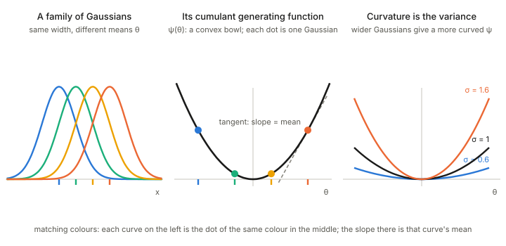
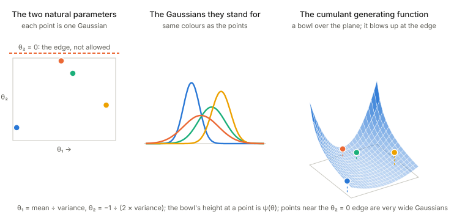
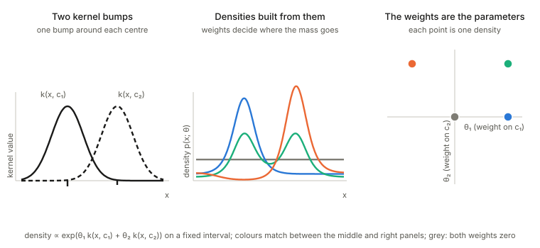
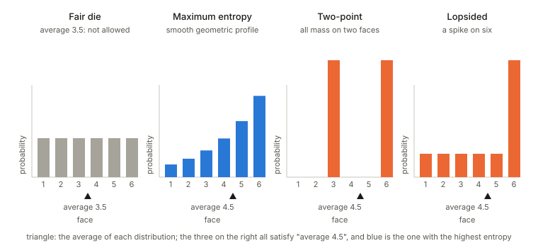
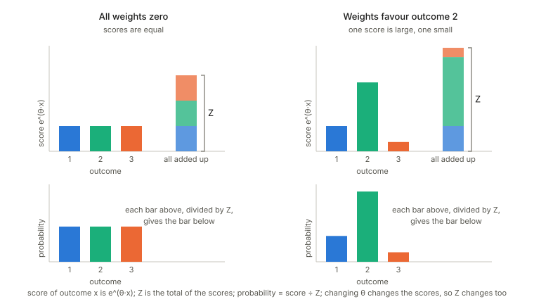

Notes for Chapter 2 of Amari, *Information Geometry and Its Applications* (Springer, 2016), DOI [10.1007/978-4-431-55978-8](https://doi.org/10.1007/978-4-431-55978-8). No text of the book is reproduced here. The next section summarises the book's chapter in my own words, in the book's order. The sections after it are explorations that I asked for, one at a time, so they follow my questions and not the book's order.

Previous chapter: [Chapter 1: the dually flat structure](../ch01-dually-flat-structure/index.html).

## What the chapter covers (a summary of the book's chapter)

The chapter studies the **exponential family** of probability distributions. It contains many familiar families (discrete distributions, Gaussians, multinomials, gammas), and it comes with a convex function, the cumulant generating function (the "free energy" of physics). Applying Chapter 1 to that function gives a dually flat structure whose divergence is the KL divergence, whose metric is the Fisher information, and whose two affine coordinate systems are the natural parameters and the expectation parameters of statistics. The **mixture family** is its dual. The chapter ends with applications of the Pythagorean theorem. The sections in order:

- **§2.1 The exponential family.** The standard form is $p(x;\theta)=\exp\{\theta\cdot x-\psi(\theta)\}$ with respect to a base measure, where the statistics $x_i=h_i(x)$ must be linearly independent. The normalisation defines $\psi(\theta)=\log\int e^{\theta\cdot x}d\mu$, which is convex by Chapter 1. The natural parameter $\theta$ is one affine coordinate system. Its dual, from the Legendre transformation, is the expectation parameter $\eta=\nabla\psi(\theta)=\mathbb E[x]$, and the dual potential $\varphi(\eta)$ is the negative entropy. The Bregman divergence of $\psi$ turns out to be the KL divergence with its arguments reversed, and the metric $\partial_i\partial_j\psi$ is the Fisher information (Theorem 2.1).
- **§2.2 Two examples.** The *Gaussian*, with statistics $(x,x^2)$, natural parameters $(\mu/\sigma^2,\,-1/(2\sigma^2))$ and expectation parameters $(\mu,\,\mu^2+\sigma^2)$. The *discrete distributions* on $\{0,\dots,n\}$, with the indicator functions as statistics, the log-odds against outcome 0 as natural parameters, $\psi=\log(1+\sum e^{\theta_i})$, and the probabilities themselves as expectation parameters.
- **§2.3 The mixture family.** A family $p=\sum\eta_iq_i(x)$ of mixtures of fixed distributions. The discrete simplex is both an exponential and a mixture family. For a general mixture family the negative entropy is still convex in $\eta$, so it also has a dually flat structure, but its other coordinates are not the natural parameters of an exponential family.
- **§2.4 e-flat and m-flat.** A straight line in $\theta$ is an **e-geodesic**: it interpolates the *logarithms* of the two densities and is itself a one-dimensional exponential family. A straight line in $\eta$ is an **m-geodesic**: it interpolates the expectations, which for discrete distributions is the ordinary mixture. Submanifolds defined by linear constraints in $\theta$ are e-flat, and in $\eta$ are m-flat.
- **§2.5 The infinite-dimensional manifold.** The space of all densities is treated, in a naive way, as an exponential and a mixture family at once, using delta functions as the generating distributions: $\theta(s)=\log p(s)+\psi$ and $\eta(s)=p(s)$. The e- and m-geodesics, the KL divergence, the Pythagorean theorem and the Fisher metric all carry over formally. The book warns that this is not mathematically justified: KL neighbourhoods fail to define a topology and the entropy is not continuous there.
- **§2.6 The kernel exponential family.** A model with a *function* $\theta(y)$ as natural parameter, built from a positive-definite kernel $k(x,y)$, with dual parameter $\eta(y)=\mathbb E[k(x,y)]$. It does not cover all densities, and §2.5 is the special case of a delta-function kernel.
- **§2.7 Bregman divergences and exponential families.** The converse of §2.1: given a Bregman divergence one can build an exponential family whose KL divergence it is (finding the base measure is an inverse Laplace transform). Theorem 2.2: regular exponential families and regular Bregman divergences are in one-to-one correspondence. A mixture family is dually flat but is not thereby an exponential family.
- **§2.8 Applications of the Pythagorean theorem.** (§2.8.1) *Maximum entropy*: among all distributions with prescribed averages, the max-entropy one is the e-projection of the uniform distribution onto an m-flat sheet, and the family of such answers is an exponential family. (§2.8.2) *Mutual information*: the independent distributions form an e-flat family, the m-projection of a joint distribution onto it is the product of its marginals, and the KL divergence to the product is the mutual information. (§2.8.3) *Repeated observations and maximum likelihood*: with $N$ independent observations, the potential, the KL divergence and the metric are multiplied by $N$ and the dual affine structure is unchanged; the maximum likelihood estimator in a submodel is the m-projection of the observed point (the histogram) onto it.
- **Closing remarks.** Exponential families are the natural setting for studying dual flatness and statistical inference, and every discrete model sits inside one. For continuous variables many models are only curved subfamilies of exponential families, and non-exponential models can be approximated locally by a larger exponential family.

## A Gaussian family and its cumulant generating function

The chapter's opening line says that an exponential family is *associated with* a convex function, the cumulant generating function $\psi$ (the "free energy"). Two pictures show what that means for Gaussians.

**One parameter: only the mean moves.** Fix the width and slide the mean. Each member of the family is a bell curve, and each is one point on the curve of $\psi$.

<figure>

<figcaption>Left: a one-parameter Gaussian family. Middle: its cumulant generating function $\psi(\theta)$; each dot is the bell curve of the same colour, and the slope at a dot is that curve's mean. Right: the same function for three widths: the wider the Gaussian, the more curved the bowl.</figcaption>
</figure>

The function does the bookkeeping for the whole family. Its **slope** at a point is the mean of the distribution there, and its **curvature** is the variance. So a single convex function holds both the average and the spread of every member, and this is the reason the Hessian of $\psi$ is the Fisher information (the Fisher information).

**Where $\psi$ comes from, for the one-parameter family.** Fix the width $\sigma$ and start from one reference density, the zero-mean Gaussian $h(x)=\frac{1}{\sqrt{2\pi\sigma^2}}e^{-x^2/(2\sigma^2)}$. The family is a *tilt* of $h$ by $e^{\theta x}$, renormalised:

$$p(x;\theta)=h(x)\,e^{\theta x-\psi(\theta)} .$$

*Step 1: normalisation defines $\psi$.* The tilted function $h\,e^{\theta x}$ is generally not a probability density, so we divide it by a constant that depends on $\theta$ but not on $x$; writing that constant as $e^{\psi(\theta)}$ is just naming the normaliser on a log scale. Requiring $\int p\,dx=1$ and pulling the $x$-independent factor $e^{-\psi(\theta)}$ out of the integral gives
$e^{\psi(\theta)}=\int h(x)\,e^{\theta x}dx$, that is

$$\psi(\theta)=\log\mathbb E_h\!\left[e^{\theta x}\right].$$

This is the log of the moment generating function of $h$, hence the name *cumulant generating function* (in physics, the log of the partition function, the "free energy"). Nothing here is Gaussian yet: the form $h\,e^{\theta x-\psi}$ is the *definition* of an exponential family, and $\psi$ is forced by normalisation.

*Step 2: complete the square.* The Gaussian enters only through $h$. Combine the exponents:
$\theta x-\frac{x^2}{2\sigma^2}=-\frac{(x-\sigma^2\theta)^2}{2\sigma^2}+\frac{\sigma^2\theta^2}{2}$.
So $\int h\,e^{\theta x}dx=e^{\sigma^2\theta^2/2}\times\big(\text{a full Gaussian density with mean }\sigma^2\theta\big)$, and the density integrates to 1.

*Step 3: the answer.*

$$\psi(\theta)=\tfrac12\,\sigma^2\theta^2 .$$

For unit width this is the parabola $\theta^2/2$ in the middle panel of the figure. Reading it back:

- **The members are Gaussians.** Tilting a zero-mean Gaussian by $e^{\theta x}$ only shifts it: $p(x;\theta)=\mathcal N(\sigma^2\theta,\ \sigma^2)$.
- **Slope is the mean:** $\psi'(\theta)=\sigma^2\theta=\mu$, so $\theta=\mu/\sigma^2$, the first natural parameter of the full family below.
- **Curvature is the variance:** $\psi''(\theta)=\sigma^2$, a constant, so the Fisher information is the same everywhere along this family, and wider Gaussians give a more curved bowl (right panel).
- **Why the bowl is an exact parabola.** The Taylor coefficients of a cumulant generating function are the cumulants. A Gaussian has only a mean and a variance, and every higher cumulant vanishes, so the series stops at the quadratic term. A non-Gaussian family has higher-order terms and a bowl that is not exactly a parabola.

**Two parameters: the full Gaussian family.** Let the mean and the width both vary. The natural parameters are $\theta_1=\mu/\sigma^2$ and $\theta_2=-1/(2\sigma^2)$, so the allowed region is only the half-plane $\theta_2<0$.

<figure>

<figcaption>Left: the parameter plane; each point is one Gaussian, and the edge $\theta_2=0$ is not allowed. Middle: the Gaussians those points stand for. Right: the cumulant generating function as a bowl over the plane; each Gaussian is a coloured point on it.</figcaption>
</figure>

Three things to see. First, the function is a bowl over a **half-plane**, not the whole plane: the parameters are only meaningful while the variance is positive. Second, the bowl climbs without limit as a point approaches the forbidden edge, which is where the Gaussian becomes infinitely wide. Third, the same recipe works as before: the slope of the bowl (now a two-component gradient) gives the expectation parameters $(\mu,\ \mu^2+\sigma^2)$, and its curvature (now a matrix) gives the covariance of $(x,x^2)$, the Fisher matrix.

## A kernel exponential family, the simplest case

An ordinary exponential family multiplies a few fixed functions of $x$ (such as $x$ and $x^2$) by weights $\theta_i$, adds them up in the exponent and normalises. The book's **kernel exponential family** (§2.6, due to Fukumizu) does the same with *bumps* $k(x,y)$, one around every point $y$, and a whole function $\theta(y)$ of weights, one for each point $y$:

$$p(x;\theta)=\exp\Big\{\int\theta(y)\,k(x,y)\,dy-\psi[\theta]\Big\}\quad\text{with respect to a base measure }d\mu(x).$$

Here $k$ is a positive-definite kernel, for example the Gaussian kernel $k_\sigma(x,y)\propto e^{-(x-y)^2/(2\sigma^2)}$ with width $\sigma$, and the base measure is a suitable fixed one, for instance $d\mu(x)=e^{-x^2/(2\tau^2)}dx$. The natural parameter is the function $\theta(y)$ (instead of a list $\theta_i$), the dual parameter is the function $\eta(y)=\mathbb E[k(x,y)]$, the average of the bump at $y$, and $\psi[\theta]$ is a convex functional of $\theta$. The book stresses that this family does **not** cover every density: there are many such models, one for each choice of $k$ and $d\mu$. The "naive treatment" of the space of all densities in §2.5 is the special case where the kernel is a delta function, $k(x,y)=\delta(x-y)$.

**The simplest picture: two centres.** Replace the continuum of points $y$ by just two centres $c_1,c_2$, so the weight function is concentrated on them, $\theta(y)=\theta_1\delta(y-c_1)+\theta_2\delta(y-c_2)$. The integral becomes a sum and the family is

$$p(x;\theta)\;\propto\;\exp\{\theta_1k(x,c_1)+\theta_2k(x,c_2)\}\quad(\text{times the base measure}),$$

an ordinary two-parameter exponential family whose two "statistics" are the two bumps. The figure draws it with a uniform base measure on a fixed interval, to keep it simple; the book's example base measure is the Gaussian-weighted one above.

<figure>

<figcaption>Left: two kernel bumps. Middle: densities built from them; each curve is one choice of weights. Right: the two weights are the parameters, and each coloured point is the density of the same colour in the middle panel.</figcaption>
</figure>

Read the picture from left to right. The two bumps are fixed once and for all. A choice of the two weights, one point in the right panel, gives one density in the middle panel. Zero weights give the flat grey density. A positive weight on a bump piles probability near its centre (blue, left bump), positive weights on both give two peaks (green), and a negative weight on one bump pushes probability away from its centre (orange has a dip at the left centre). So the weights are the natural parameters, the dual parameters are the averages $\eta_i=\mathbb E[k(x,c_i)]$ of the two bumps, and everything said about exponential families applies: $\psi$ is convex, its slope gives the averages of the bumps and its curvature gives how they co-vary. With many centres the same construction becomes the function-valued $\theta(y)$ of the book.

## The maximum entropy principle (§2.8.1)

**The question.** You do not know a distribution on the outcomes, but you do know the average of some quantities of the outcome, for instance the average face value of a die. Many distributions agree with what you know. Which one should you pick? The **maximum entropy principle** says: with nothing else to go on, pick the one with the largest entropy, the one that assumes the least beyond what you know.

In the book's notation there are $k$ functions $c_1(x),\dots,c_k(x)$ of the outcome, and the known averages are $\mathbb E[c_i(x)]=a_i$.

<figure>

<figcaption>Left: all distributions on three outcomes. The orange line holds those that satisfy the prescribed average; the grey contours are lines of equal entropy around the uniform distribution $P_0$. The orange line touches the highest reachable contour at $\hat P$. Right: along the orange line the entropy has one peak, at $\hat P$.</figcaption>
</figure>

**Step 1: the constraints cut out a flat sheet.** All distributions with the prescribed averages form a sheet $M(a)$ inside the set of all distributions, of dimension $n-k$ when there are $n+1$ outcomes and $k$ constraints. It is **m-flat** (straight in the probabilities, the orange line in the picture), because a mixture of two distributions that both have the prescribed averages has them too.

**Step 2: entropy is a distance to the uniform distribution.** The uniform distribution $P_0$ has the largest entropy of all, and its natural parameters are zero, $\theta_0=0$. The book shows that the divergence $D_{\mathrm{KL}}[P:P_0]$ is the negative entropy of $P$ plus a constant. So maximising entropy is the same as getting as close as possible to the uniform distribution in KL divergence: in the picture, reaching the highest entropy contour that the sheet can touch.

**Step 3: Pythagoras picks the point.** Let $\hat P$ be the point of $M(a)$ with the largest entropy. For every other $P$ in the sheet,

$$D_{\mathrm{KL}}[P:P_0]=D_{\mathrm{KL}}[P:\hat P]+D_{\mathrm{KL}}[\hat P:P_0].$$

This is the generalised Pythagorean theorem of Chapter 1. The second term is the same for every $P$, and the first is positive unless $P=\hat P$, so $\hat P$ is the closest point to the uniform distribution. Geometrically, $\hat P$ is the **e-projection of $P_0$ onto $M(a)$**: the e-geodesic from $P_0$ to $\hat P$ meets the m-flat sheet at a right angle.

**Step 4: the answer is an exponential family.** Change the prescribed averages and the sheet moves, and so does its maximum-entropy point. All these points $\hat P(a)$ together form a $k$-dimensional family, the blue curve, and it is an exponential family:

$$\hat p(x;\theta)=\exp\{\theta\cdot c(x)-\psi(\theta)\}.$$

In words: the maximum-entropy distribution for given averages is the uniform distribution tilted by an exponential of the quantities you constrained. The tilts $\theta$ are the Lagrange multipliers of the constraints. The book's variational derivation (maximising entropy under the constraints) gives the same result.

### A concrete example: a die with average 4.5

You have a six-sided die and the only thing you know is that its long-run average roll is $4.5$, not the fair $3.5$. Which probabilities should you assign to the faces? Many distributions fit: all the probability on faces 3 and 6 in equal parts, or a spike on face 6 over a flat floor, and so on. The maximum entropy principle picks the one that assumes the least beyond "the average is $4.5$".

<figure>

<figcaption>The fair die (grey) is not allowed, because its average is $3.5$. The three distributions on the right all have average $4.5$. The maximum entropy one (blue) is the smooth geometric profile, the others are lumpy.</figcaption>
</figure>

In the notation above the outcomes are the six faces, the constraint function is the face value $c(x)=x$, the prescribed average is $a=4.5$, the sheet $M(a)$ is the set of all distributions with that average, and the centre $P_0$ is the fair die.

- **The answer is the uniform distribution tilted by $e^{\theta x}$.** The maximum entropy distribution is $\hat p(x)\propto e^{\theta x}$ for $x=1,\dots,6$: each face is a fixed multiple of the one before, so the probabilities rise geometrically. Only $\theta$ has to be found, so that the average comes out right; it is about $0.37$, which makes each face roughly $1.45$ times as likely as the previous one.
- **The other candidates have less entropy.** The two-point and the lopsided distributions both satisfy the constraint, but each puts probability in lumps, and each has lower entropy than the geometric profile. The fair die has the largest entropy of all, but it is not on the sheet.
- **Pythagoras holds.** For any other distribution $P$ with average $4.5$, $D_{\mathrm{KL}}[P:P_0]=D_{\mathrm{KL}}[P:\hat P]+D_{\mathrm{KL}}[\hat P:P_0]$, so no distribution on the sheet is closer to the fair die than $\hat P$.
- **$\theta$ is a multiplier.** It is the Lagrange multiplier of the constraint "average $=4.5$": the price, in log-probability, of one extra point of face value. Move the average back to $3.5$ and $\theta=0$, the fair die. Move it toward $6$ and the geometric profile steepens and piles more and more mass on face 6. A constraint on the variance too would add $x^2$ to the exponent.

### Deriving the maximum entropy die

The geometric shape is not a guess: it is forced by the constraint. Choose $p_1,\dots,p_6$ to maximise the entropy $H(p)=-\sum_x p_x\log p_x$ subject to $\sum_xp_x=1$ and $\sum_x x\,p_x=4.5$.

*Step 1: Lagrange multipliers.* Fold the constraints into one function, with a multiplier for each,

$$L=-\sum_{y}p_y\log p_y-\lambda_0\Big(\sum_yp_y-1\Big)-\lambda_1\Big(\sum_yy\,p_y-4.5\Big),$$

and require the derivative with respect to every $p_x$ to vanish. (The summation index is called $y$ so that $x$ can mean the one face being differentiated.) Every sum has one term per face, and $\partial/\partial p_x$ only touches the term with $y=x$, so all the other terms differentiate to zero:

- *the entropy term:* by the product rule, $\frac{\partial}{\partial p_x}(p_x\log p_x)=\log p_x+p_x\cdot\frac1{p_x}=\log p_x+1$, so the term contributes $-\log p_x-1$;
- *the normalisation term:* $p_x$ appears once with coefficient 1, so it contributes $-\lambda_0$;
- *the mean term:* $p_x$ appears as $x\,p_x$, where the face value $x$ is a constant, so it contributes $-\lambda_1x$.

Together,

$$\frac{\partial L}{\partial p_x}=-\log p_x-1-\lambda_0-\lambda_1x=0 .$$

The surprising "$-1$" comes from the product rule on $p\log p$; it does not matter in the end, because it is absorbed into the normaliser.

*Step 2: read off the shape.* Solving for $p_x$ gives $p_x=e^{-1-\lambda_0}\,e^{-\lambda_1x}$. The first factor does not depend on $x$, so write $\theta=-\lambda_1$ and call that constant $1/Z$:

$$p_x=\frac{e^{\theta x}}{Z},\qquad Z=\sum_{x=1}^6e^{\theta x}.$$

The ratio of neighbouring faces is $p_{x+1}/p_x=e^{\theta}$ for every $x$: each face is the same multiple of the previous one. That constant ratio is what "geometric" means, and it is exactly the exponential-family form with the face value as the statistic.

*Step 3: fix $\theta$ with the average.* Only one number is left. The mean constraint reads $\sum_xx\,e^{\theta x}/Z=4.5$, that is $\frac{d\log Z}{d\theta}=4.5$. The left side is the average under the tilted distribution and it increases steadily with $\theta$ (it is $3.5$ at $\theta=0$, the fair die, and tends to $6$ as $\theta\to\infty$), so exactly one $\theta$ gives $4.5$. There is no tidy closed form for it; it is found numerically, for instance by bisection.

*Why it is the maximum.* The entropy is concave and the constraints are linear, so a point satisfying these conditions is the global maximum. A direct argument needs no calculus. Take any other distribution $q$ with average $4.5$. By Gibbs' inequality (a KL divergence is never negative), $-\sum_xq_x\log q_x\le-\sum_xq_x\log\hat p_x$. Insert $\log\hat p_x=\theta x-\log Z$: the right side becomes $-\theta\cdot4.5+\log Z$, because $q$ and $\hat p$ have the same average, and that is the entropy of $\hat p$. So $H(q)\le H(\hat p)$ with equality only for $q=\hat p$, and the gap is $D_{\mathrm{KL}}[q:\hat p]$, which is the Pythagorean statement above.

**Entropy rewards spreading probability out, and the constraint only touches the average, which is linear in the face value. The one structure the answer is allowed to keep is therefore a log-probability that is linear in the face value: a geometric profile, tilted just enough to hit $4.5$.**

**A note on the book's wording.** The text says the natural coordinates of this family are "specified by $\theta=a$". As I read it, the constraints fix the *expectation* parameters, $\eta=a$, and $\theta$ is the dual coordinate that goes with them, so I take the printed sentence to be a slip.

## The partition function

For an exponential family $p(x;\theta)=\exp\{\theta\cdot x-\psi(\theta)\}$ with respect to a base measure $\mu$, the **partition function** is the normalising constant

$$Z(\theta)=\int e^{\theta\cdot x}\,d\mu(x)=e^{\psi(\theta)},$$

so the potential $\psi$ of the earlier sections is its logarithm, $\psi=\log Z$.

**Intuition.** Start with the unnormalised *score* $e^{\theta\cdot x}$ that the family gives to each outcome $x$. It says how favoured $x$ is, but the scores do not add up to 1. To turn scores into probabilities, divide each by their total, and that total is $Z(\theta)$: probability = score ÷ $Z$. The name comes from statistical physics, where the states of a system carry weights and $Z$ sums the weights over all states.

<figure>

<figcaption>Top: the scores $e^{\theta\cdot x}$ and their total $Z$ (the stacked bar). Bottom: each score divided by $Z$ is a probability. Changing $\theta$ changes the scores, and so changes $Z$ as well.</figcaption>
</figure>

**Why it is more than a bookkeeping constant.** $Z$ depends on $\theta$, and that dependence holds everything about the family:

- **Slope gives the mean:** $\nabla\log Z=\mathbb E_\theta[x]$.
- **Curvature gives the covariance:** $\nabla^2\log Z=\operatorname{Cov}_\theta[x]$, which is the Fisher information, so $\log Z$ is convex.
- **It is a Laplace transform** of the base measure, which is why the inverse problem of recovering the measure from $\psi$ (the book's Theorem 2.2) is an inverse Laplace transform.
- **It must be finite.** The family exists only for the $\theta$ where the integral converges: for the Gaussian this is $\theta_2<0$.

**Where it appeared above.** For a coin or a softmax with one logit fixed at zero, $Z=1+e^{\theta_1}+e^{\theta_2}$, so $\log Z$ is log-sum-exp and dividing by $Z$ is the softmax. For the fixed-width Gaussian, completing the square gives $Z=\sqrt{2\pi\sigma^2}\,e^{\sigma^2\theta^2/2}$. And in the maximum entropy principle, $Z$ is the normaliser that the Lagrange multipliers produce.

**Names differ between texts.** Amari's $\psi$ is the *logarithm* of the partition function. Machine-learning texts often say "partition function" for $Z$ itself and "log-partition function" for $\psi$, and "free energy" for $-\log Z$ in some conventions.
