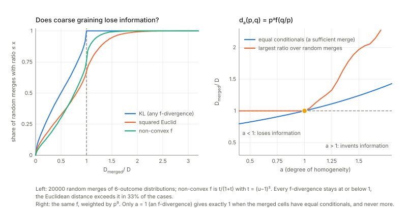
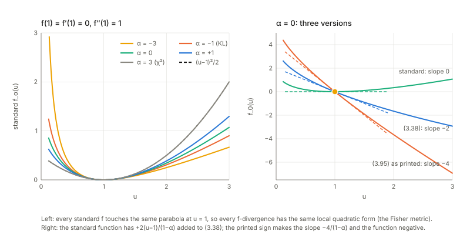
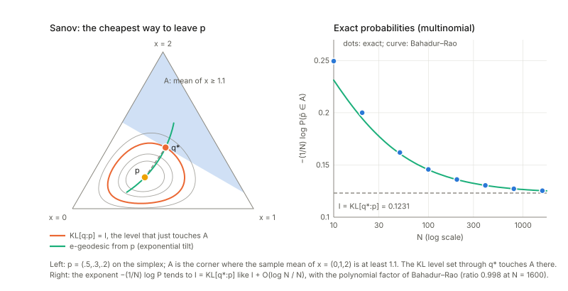
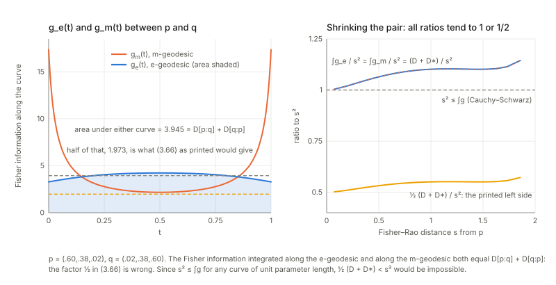
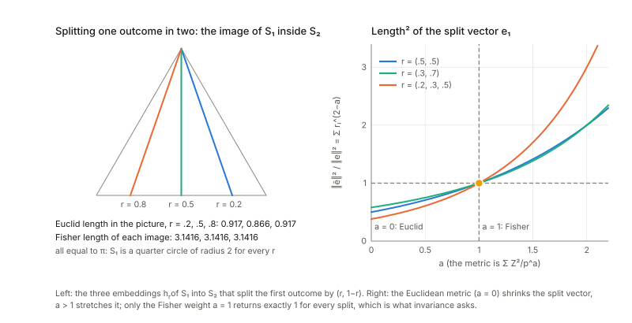
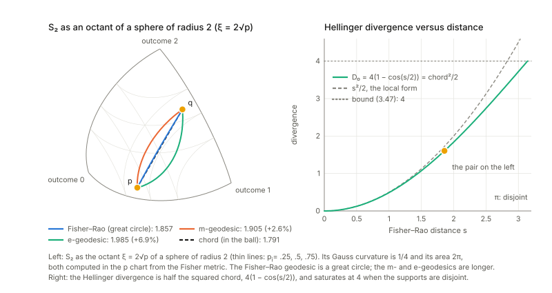

Notes for Chapter 3 of Amari, *Information Geometry and Its Applications* (Springer, 2016). The next section summarises the book's chapter in my own words. The sections after it are explorations that I asked for, one at a time, so they follow my questions and not the book's order. They keep the intuition, the figures and the derivations, and leave out numerical checks.

## What the chapter covers (a summary of the book's chapter)

Chapters 1 and 2 got a geometry out of one convex function. This chapter asks why distributions should be given *that* geometry, and answers with a requirement that has nothing to do with convexity: **invariance**. If the same experiment is described in two ways, how far apart two hypotheses are should not change. Rewriting the outcome in an invertible way must change nothing, and summarising the outcome can only lose information, so a divergence may go down and may not go up. This also covers models that have no convex function behind them. The sections in order:

- **§3.1 Invariance criterion.** Takes any model (discrete, continuous or vector valued) and any map from the outcome to a summary, usually many-to-one, so the summary has its own induced distributions. Postulates that a divergence cannot grow under such a map ("information monotonicity", a simplified form of Chentsov's idea due to Csiszar). It stays exactly equal when nothing is lost, which is when the summary is *sufficient*: the distribution of the data factors into a part that depends on the parameter only through the summary and a part that does not depend on the parameter at all. The criterion says a geometry is invariant exactly when it obeys this rule with equality only for sufficient summaries. The section announces two results to come: the invariant divergences are the $f$-divergences (when written as sums over outcomes) and the invariant metric is Fisher's.
- **§3.2 Information monotonicity under coarse graining.** Works in the finite simplex, where coarse graining means partitioning the outcomes into groups and adding up probabilities inside each group. Considers *decomposable* divergences, a sum of one cost per outcome. **Theorem 3.1:** an $f$-divergence (cost $p\,f(q/p)$ with $f$ convex and $f(1)=0$) is invariant and decomposable, and conversely a decomposable invariant divergence is an $f$-divergence. The easy direction is Jensen's inequality, because merging two outcomes replaces their two ratios by a weighted average. The converse uses the case of equality: when the two distributions have the same conditional spread inside the group, merging must lose nothing, and this forces the cost to be linear in $p$. Two remarks limit the claim: the converse fails for the smallest simplex (two outcomes), where other invariant divergences exist, and if decomposability is dropped there are invariant divergences that are not $f$-divergences (for example a function of one, or a nonlinear mix of two). The book adds that any invariant divergence gives the same $\alpha$-geometry, to be shown in Part II. Finally it fixes the freedom in $f$: adding a multiple of $(u-1)$ changes nothing, so one may take $f'(1)=0$, and a positive factor only rescales, so one takes $f''(1)=1$ (a *standard* $f$). Swapping the two arguments of the divergence corresponds to another standard $f$, the dual.
- **§3.3 Examples of $f$-divergence in $S_n$.** Shows that KL in one order comes from $-\log u$ and in the other order from $u\log u$, the latter being the divergence that comes from the cumulant generating function of Chapter 2. Also the Pearson chi-square, and the one-parameter $\alpha$-family, whose dual is the family with $-\alpha$, whose middle member $\alpha=0$ is the squared Hellinger distance, and whose limits $\alpha=\pm1$ are the two KLs. The variation distance (half the sum of absolute differences) is of this type but its $f$ is not differentiable, so the book does not call it a divergence. The squared Euclidean distance is a divergence but not an $f$-divergence and not invariant.
- **§3.4 General properties of $f$-divergence and KL-divergence.** Lists properties of $f$-divergences: convex in each argument, bounded above in some cases, and for the $\alpha$-divergences with $\alpha$ at least 1 (resp. at most $-1$) infinite when one distribution has zero probability where the other has not, in one direction (resp. the other). This yields *zero forcing* and *zero avoidance* when approximating a distribution inside a smaller family. For KL it then gives large-sample facts: Sanov's lemma (the chance of seeing an empirical distribution decays exponentially with rate KL, proof omitted), the Gaussian central limit behaviour with covariance given by the Fisher matrix over $N$, and the large deviation theorem (the chance of landing in a region decays at the rate of the closest point, found by e-projection). **Theorem 3.2** (proof omitted): half the symmetrised KL equals the integral of the squared speed measured by Fisher information along the e-geodesic, and also along the m-geodesic.
- **§3.5 Fisher information: the unique invariant metric.** A short expansion shows that every standard $f$-divergence is, for nearby points, half the squared Fisher length, so all share the Fisher metric. **Theorem 3.3 (Chentsov):** up to a constant factor this is the only invariant metric on the simplex. The book gives Campbell's proof, not Chentsov's category-theoretic one. Invariance is restated through embeddings of a small simplex into a bigger one by splitting each outcome using fixed conditional probabilities, with the metric required to agree on both sides. The proof uses symmetry at the centre of the simplex, then embeds simplices with rational points into it, which pins the metric down at rational points, and continuity gives the rest. A remark says the cubic tensor of third moments of the score is also unique in the same way, which Part II uses to show the uniqueness of the $\alpha$-connection.
- **§3.6 $f$-divergence in the manifold of positive measures.** Repeats the story with free total mass: invariant and decomposable still means $f$-divergence, but now $f$ must be standard for the criteria of a divergence to hold. **Theorem 3.4:** the induced metric is diagonal with entries one over $m_i$, and the coordinates $2\sqrt{m_i}$ make it Euclidean, so the simplex of distributions, defined by fixed total mass, is a sphere (radius 2) in a flat space and hence curved. It also extends the $\alpha$-divergence to positive measures, with extra terms that vanish when both measures have total mass one.
- **Remarks.** A short history: Rao's Fisher metric, Jeffreys' invariant prior (the volume element), Hotelling's unpublished 1929 talk (including constant negative curvature of location-scale models), Chentsov's invariance and connections, Efron's statistical curvature, Dawid's suggestion of e- and m-connections, and the dually flat theory of Nagaoka and Amari, along with the story of its rejections. It closes by noting that making the construction rigorous for function spaces of densities is hard (the topology of $p$ differs from that of $\log p$), listing approaches by Pistone and coworkers, Newton (a Hilbert space), Jost and coworkers, and Fukumizu (kernel exponential family).

## Links

- **[Interactive companion](figures/interactive.html)**: eight widgets, all exact sums (no sampling). (1) Merge two outcomes of a three-outcome distribution and read a divergence before and after, for eight divergences; a button makes the merged outcomes' conditionals equal.
  (2) The $\alpha$ family: the standard function, the book's (3.38) and the printed (3.95), their slopes at $u=1$, the dual function and $D_\alpha$ on positive measures. (3) $D_f[p\Vert p+\varepsilon d]/\varepsilon^2$ against $\varepsilon$: it tends to $\tfrac12 f''(1)\sum d_i^2/p_i$; the variation distance and $(u-1)^4$ do not.
  (4) Zero forcing and zero avoiding: the best Gaussian for a two-humped $p$ as $\alpha$ moves. (5) Large deviations: the exact multinomial probability against the exponent $\mathrm{KL}[q^*\Vert p]$ and the e-projection $q^*$. (6) Theorem 3.2: the Fisher information along the e- and m-geodesics and the two areas.
  (7) Chentsov: the length of a split vector under the weight $p^{-a}$. (8) The simplex as a sphere of radius 2: three curves between two points, the chord, and the effect of the total mass.
- The book: Amari, *Information Geometry and Its Applications* (Springer, 2016), DOI [10.1007/978-4-431-55978-8](https://doi.org/10.1007/978-4-431-55978-8). These notes cover Chapter 3 only; equation numbers such as (3.66) refer to the book.
  No text of the book is reproduced here; everything is restated and re-derived.
- Neighbouring chapters: **[Chapter 2: exponential and mixture families](../ch02-exponential-and-mixture-families/index.html)** (where KL appeared as a Bregman divergence) and **[Chapter 1: the dually flat structure](../ch01-dually-flat-structure/index.html)**; ahead, **[Chapter 4: $\alpha$-geometry](../ch04-alpha-geometry/index.html)** takes up the $\alpha$-divergences of §3.3 and the question of which invariant divergences are also flat, and **[Chapter 6: dual connections](../ch06-dual-connections/index.html)** the connections that the cubic tensor of §3.5 defines. **[Chapter 5](../ch05-elements-of-differential-geometry/index.html)** supplies the curvature routine I reuse for the sphere.
  Background on the annotations site: **[The Fisher information matrix](https://msrepo.github.io/theory_inclined_papers_with_annotations/fisher-information/)**.

## In one paragraph

Chapters 1 and 2 built a whole geometry out of one convex function: its gap above a tangent is a divergence, its slope is a second coordinate system, its curvature is a metric. For distributions the function was the log-partition function and the divergence was KL. That raises a fair question: why *that* function and why that divergence? Chapter 3 answers with a requirement that has nothing to do with convexity, **invariance**. Describe the same experiment differently and nothing about how far apart two hypotheses are should change. Relabelling the outcomes changes nothing; summarising them (merging outcomes, "coarse graining") can only throw information away, so a divergence may only go **down**, and it should stay exactly the same when the summary throws away nothing the parameter cares about (a **sufficient statistic**).
Among divergences that are sums over outcomes, this requirement leaves one family, the **$f$-divergences** $\sum_ip_if(q_i/p_i)$ with $f$ convex (Theorem 3.1): KL in both orders, $\chi^2$, Hellinger, the $\alpha$-divergences and the variation distance are members, the squared Euclidean distance is not. Every standard $f$-divergence looks, for nearby distributions, like half the **Fisher information**, and Chentsov's theorem says Fisher information is the *only* Riemannian metric that is invariant. On the way the chapter lists the properties that make KL the workhorse of statistics (it governs large deviations, and its symmetrisation is an integral of the Fisher information), and shows that in the coordinates $2\sqrt{p_i}$ the simplex of distributions is a piece of a sphere of radius 2.
I re-checked all of it on small explicit examples. The main results hold. I found five printed formulas that are wrong: (3.48) (the two arguments exchanged), (3.56) ($\sqrt N$ written as $1/\sqrt N$), (3.95) (the sign of a linear term) and, by a factor $2$, (3.45) and (3.66); several missing hypotheses (strict convexity, $f''(1)>0$, normalisation); and a gap in the proof of Chentsov's theorem (it does not establish uniqueness on positive measures).

## The spine of the argument

1. A geometry of distributions should not depend on how the experiment is described. A merge $y=k(x)$ must not increase the divergence, $\bar D\le D$ (3.4), with equality exactly when $y$ is sufficient: this is the **invariance criterion** (§3.1).
2. A divergence that is a sum over outcomes, $\sum_id(p_i,q_i)$, can satisfy the criterion only if $d(p,q)=pf(q/p)$ with $f$ convex, and every such $f$-divergence does (Theorem 3.1; the forward direction is Jensen's inequality). Adding $c(u-1)$ to $f$ changes nothing on normalised distributions; one normalises to $f(1)=f'(1)=0$, $f''(1)=1$ ("standard"); the dual $f^*(u)=uf(1/u)$ swaps the arguments (§3.2).
3. Examples: KL and its dual, $\chi^2$, the $\alpha$-divergences (Hellinger at $\alpha=0$), the variation distance; the squared Euclidean distance fails (§3.3).
4. Properties: convex in both arguments, bounded above except for some $\alpha$, infinite when supports mismatch (hence zero forcing and zero avoiding approximations). For KL: Sanov's lemma, the central limit theorem, the large deviation theorem (rare events happen along the e-projection), and Theorem 3.2 (§3.4).
5. Locally every standard $f$-divergence is $\tfrac12$ the Fisher quadratic form, and Chentsov's theorem (Campbell's proof, via Markov embeddings of $S_m$ in $S_n$) says Fisher information is the unique invariant metric (§3.5).
6. On positive measures $\mathbb R^n_+$ the same classification works with *standard* $f$; the metric is $\mathrm{diag}(1/m_i)$, flat in the chart $\xi=2\sqrt m$, and $S_n$ is the sphere $\sum\xi_i^2=4$ (§3.6).

## Setup and notation

| Symbol | Meaning | In the examples |
|---|---|---|
| $S_n$ | distributions $p=(p_0,\dots,p_n)$, all $p_i>0$, on the outcomes $\{0,\dots,n\}$ | a few outcomes |
| $y=k(x)$, $\bar p$ | a coarse graining (outcomes merged into cells $X_a$) and the induced distribution $\bar p_a=\sum_{i\in X_a}p_i$ (3.8) | merging two outcomes |
| $D[p:q]$, $\bar D$ | a divergence and its value after coarse graining (3.4) | |
| sufficient | $p(x\mid y)$ does not depend on the parameter (3.12)–(3.13) | the sum of two Bernoulli trials |
| $D_f[p:q]=\sum_ip_if(q_i/p_i)$ | $f$-divergence (3.14); I write $u_i=q_i/p_i$ | |
| standard $f$ | convex, $f(1)=f'(1)=0$, $f''(1)=1$ (3.28), (3.30) | $-\log u+u-1$ |
| $f^*(u)=uf(1/u)$ | dual function: $D_{f^*}[p:q]=D_f[q:p]$ (3.31)–(3.32) | |
| $D_\alpha$ | $\alpha$-divergence from $f_\alpha(u)=\frac4{1-\alpha^2}(1-u^{(1+\alpha)/2})$ (3.38): $\alpha=-1$ is $\mathrm{KL}[p\Vert q]$, $\alpha=0$ Hellinger, $\alpha=3$ $\chi^2$ | |
| Markov embedding $h$ | $q\mapsto p=rq$ with $r_{ij}=\mathrm{Prob}(x=i\mid y=j)$ living on the cell $A_j$ (3.71)–(3.72) | splitting an outcome in two |
| $g_{ij}$, $T_{ijk}$ | Fisher information (3.68) and cubic tensor (3.88) | |
| $\mathbb R^n_+$ | positive measures $m,n$ with free total mass (the book also calls the number of outcomes $n$; I use the pair $m,n$ only for positive measures) | |
| $\xi=2\sqrt m$ | the chart in which $\mathbb R^n_+$ is Euclidean (3.92) | |

**Running examples.** (i) Small distributions on a few outcomes, on which every coarse graining can be listed by hand. (ii) Two Bernoulli trials, where the sum is sufficient. (iii) Gaussians, where $x\mapsto x^2$ is sufficient on one line of the family and on nothing larger. (iv) A table with all its mass on the diagonal, for zero forcing. (v) $S_2$, the triangle of three outcomes, for Theorem 3.2 and the sphere. Outcomes are numbered from $0$ as in the book.

## 1. The invariance criterion (§3.1)

**In plain words.** If you describe the same experiment in two ways, the geometry should not notice. There are two kinds of re-description. A *one-to-one* relabelling of the outcomes changes nothing, so the divergence must be unchanged. A *many-to-one* summary $y=k(x)$ (you only learn which cell $x$ fell in) generally loses information about which distribution is true, so the divergence between the two summarised distributions should be **at most** the original, $\bar D\le D$ (3.4), the book's *information monotonicity*. When the summary is *sufficient*, it keeps everything the data say about the parameter, and then nothing should be lost: equality. Sufficient means that, given the summary, the remaining detail $x$ is distributed the same way whichever hypothesis is true (3.12)–(3.13), or in factorised form $p(x,\xi)=\bar p(s,\xi)r(x)$ (3.6). The **invariance criterion** is: a geometric structure is invariant if it satisfies (3.4) with equality exactly for sufficient $y$.

*A small case.* Take two distributions on four outcomes and merge the first two outcomes and the last two. In general the divergence between the merged pair is smaller than before: information is lost. Now choose $q$ so that $q_i/p_i$ is constant inside each cell (so $q$ puts its cell mass in the same proportions as $p$). The divergence is the same before and after. Inside each cell $p$ and $q$ now distribute their mass identically, so only the cell totals can tell them apart, and the cell totals survive.

**Checks.**

- *Sufficient for a pair or for a model?* Take two Bernoulli trials $x=(x_1,x_2)$ with the same success probability $\theta$ and the sum $s=x_1+x_2$. Given the sum, the conditional law of $x$ is the same for every $\theta$ (if $s=1$, the success is equally likely to be in either trial), so the sum is sufficient *for this model*, and the KL divergence of the four outcomes equals that of the binomial distribution of $s$. The same map on the full simplex $S_3$ (arbitrary pairs of distributions on the four outcomes) generally loses information, because the conditional $p_1/(p_1+p_2)$ is free. In fact for the full simplex only a bijection is sufficient, so the criterion's demand of equality exactly for sufficient statistics has to be read **for the two distributions being compared**, as (3.13) does (the conditionals of $p$ and $q$ agree), or for the model one works in; read model-wide on $S_n$ it would constrain nothing.
- *Continuous variables.* For Gaussians, an invertible change of variable (such as $y=3x+1$ or $y=e^x$) leaves the KL divergence unchanged. The non-invertible $x\mapsto x^2$ is sufficient for the scale family $\{N(0,s^2)\}$ and for nothing larger: if the two means differ, $x^2$ forgets the sign of the mean and the divergence drops. The same map gives two different verdicts, depending on which model one has in mind.
- *A notational point.* In (3.6) the factor called $\bar p(s,\xi)$ is the induced marginal only if $r$ sums to one on each fibre; the factorisation can always be normalised that way, so nothing depends on it.

## 2. Information monotonicity under coarse graining (§3.2)

### 2.1 $f$-divergences are monotone (Theorem 3.1, first half)

**In plain words.** Suppose the divergence is a sum over outcomes of a pointwise cost, $D=\sum_id(p_i,q_i)$ (3.9) ("decomposable"). Merging two outcomes replaces $d(p_1,q_1)+d(p_2,q_2)$ by $d(p_1+p_2,q_1+q_2)$. An **$f$-divergence** uses the cost $d(p,q)=p\,f(q/p)$ with $f$ convex and $f(1)=0$ (3.14)–(3.15): $q/p=u$ says how much $q$ inflates the outcome compared with $p$, and the cost is the weighted $f(u)$. Merging replaces $u_1,u_2$ by their weighted average $\bar u=(p_1u_1+p_2u_2)/(p_1+p_2)=(q_1+q_2)/(p_1+p_2)$ (3.17), and *Jensen's inequality* (a convex function lies below its chords, so the average of $f$ is at least $f$ of the average) gives
$$(p_1+p_2)f(\bar u)\le p_1f(u_1)+p_2f(u_2)\qquad(3.16),(3.19).$$
The book proves it for one merge; for a general cell the same weights $p_i/P_a$ do it.

*A worked case, in words.* Merge two outcomes of a three-outcome distribution. For every divergence of this family (KL in both orders, $\chi^2$, Hellinger, Jensen-Shannon, the variation distance) the value after merging is smaller. The first widget lets you read all of them before and after, and a button makes $u_1=u_2$, which shows the loss disappear.

**Checks.**

- *Random coarse grainings.* The inequality $\bar D\le D$ holds for every $f$-divergence I tried and every merge. The loss is strictly positive for the smooth ones; for the variation distance it can be zero even when the partition is not sufficient (see 2.2).
- *Equality for equal conditionals.* When $q_i/p_i$ is constant on every cell, $D=\bar D$ for all of them.
- *Noisy summaries.* Any Markov kernel is an embedding (a randomisation that does not depend on the parameter, which loses nothing) followed by a merge, so it is monotone too. For the book's embeddings (3.71)–(3.72) equality holds exactly.

### 2.2 What the proof leaves out

- **Strict convexity.** The invariance criterion asks for equality *only* for sufficient $y$. Jensen gives equality when $u_1=u_2$, but for an $f$ that is linear on a stretch it also gives equality when $u_1\ne u_2$ lie in that stretch. The variation distance is the obvious case (excluded by the book as non-differentiable), but a perfectly smooth $f$ does it too: take $f=\tfrac12(u-1)^2$ for $u\le2$ and $u-\tfrac32$ beyond (convex, $C^1$, $f(1)=f'(1)=0$, $f''(1)=1$). If two outcomes have *different* conditionals but both have $u\ge2$, merging them leaves this $f$-divergence unchanged, and the variation distance too. So the claim that every $f$-divergence is invariant needs **strictly** convex $f$.
- **$f''(1)>0$.** The remark in §3.2.2 that the divergence criteria follow by a Taylor expansion needs the second derivative at 1 to be positive. $f\equiv0$ and $f=(u-1)^4$ are convex with $f(1)=0$, but $D_f[p\Vert p+\varepsilon d]/\varepsilon^2$ then tends to $0$: there is no quadratic form, hence no metric (compare $\tfrac12\sum d^2/p$ for $f=\tfrac12(u-1)^2$).

### 2.3 The converse: decomposable and invariant means $f$-divergence

**In plain words.** Suppose $D=\sum d(p_i,q_i)$ satisfies the criterion. Merge two outcomes with $q_1/p_1=q_2/p_2=u$: nothing is lost, so $d(p_1,up_1)+d(p_2,up_2)=d(p_1+p_2,u(p_1+p_2))$ (3.20). Writing $k(p,u)=d(p,up)$ this says $k(p_1,u)+k(p_2,u)=k(p_1+p_2,u)$ (3.22): $k$ is additive in $p$, hence (with some regularity) linear, $k(p,u)=pf(u)$ (3.23), so $d(p,q)=pf(q/p)$ (3.24). In other words the criterion forces the cost to be **homogeneous of degree one** in $(p,q)$. Convexity of $f$ is then forced by (3.16), since (3.16) *is* convexity.

*Checks, in words.* Take a cost of degree $a$, $d_a(p,q)=p^af(q/p)$.

- Additivity (3.22) fails unless $a=1$: the residual $k(p_1,u)+k(p_2,u)-k(p_1+p_2,u)$ has one sign for $a<1$ and the opposite sign for $a>1$.
- The consequences: for $a>1$ merging can *increase* the divergence (it invents information) and at equal conditionals the merged value is not equal to the original; for $a<1$ merging never increases it but at equal conditionals the merged value is too small (it loses information a sufficient statistic should keep). Only $a=1$ gives equality exactly.
- The other candidates. The squared Euclidean distance (3.46) can go up after merging two outcomes with equal conditionals, so it is not invariant. **Itakura-Saito**, a decomposable Bregman divergence other than KL, is monotone but at equal conditionals it still drops: it is not invariant. A non-convex $f$ such as $t/(1+t)$ with $t=(u-1)^2$ is a perfectly good-looking positive divergence with a metric, but is not monotone.

*Two caveats the book does not spell out.* The step from additive to linear needs a regularity assumption (Cauchy's functional equation has wild solutions), which is harmless for the smooth divergences of Chapter 1. And the book's **Remark 1** (the case $n=1$): on $S_1$ the only coarse graining sends everything to one point, so (3.4) says nothing there. Any decomposable $D$ passes; for instance $D=(p-q)^2+((1-p)-(1-q))^2=2(p-q)^2$ has a constant metric, whereas an $f$-divergence on $S_1$ has $f''(1)/(p(1-p))$, which varies with $p$. This is consistent with the book's remark; I did not look at the cited classification.
**Remark 2** is also right: $D+D^2$ is invariant (monotone, equality exactly when $D$'s is) but not decomposable (its mixed second derivative between the two arguments of different outcomes is not zero, as it would be for a sum over outcomes), and since $D^2=O(\varepsilon^4)$ it has the same metric and cubic tensor as $D$.

### 2.4 The freedom $f\to f+c(u-1)$, scale, standard form, duality

On normalised distributions $\sum_i p_i(q_i/p_i-1)=\sum(q_i-p_i)=0$, so adding $c(u-1)$ to $f$ changes nothing (3.26)–(3.27). **It is false on positive measures**: when the total masses of $m$ and $n$ differ, the difference is $c(\sum n-\sum m)$, not zero. The statement (3.27) holds on $S_n$ only, which matters in §6. The condition $f(1)=0$ (3.15) is just what makes $D_f[p:p]=0$ (otherwise a distribution would have a nonzero divergence from itself, $D_f[p:p]=f(1)$), and by Jensen it also gives $D_f\ge0$ on $S_n$. Scaling $f$ by $c>0$ scales $D_f$ (3.29); the normalisation $f''(1)=1$ (3.30) fixes the scale so that the local quadratic form is exactly $\tfrac12$ Fisher information (§5).
The **dual** $f^*(u)=uf(1/u)$ satisfies $D_{f^*}[p:q]=D_f[q:p]$ (3.32); $f^*$ is convex with $f^*(1)=0$, $f^{*\prime}(1)=-f'(1)$ and $f^{*\prime\prime}(1)=f''(1)$, so standardness is preserved.

## 3. Examples of $f$-divergence in $S_n$ (§3.3)

**In plain words.** KL is $f=-\log u$: the cost $p\log(p/q)$. Its dual $f^*=u\log u$ gives $\mathrm{KL}[q\Vert p]$, which by Chapter 2 is the Bregman divergence of the cumulant function. $f=\tfrac12(u-1)^2$ gives $\tfrac12\sum(p-q)^2/p$ (3.37). The **$\alpha$-family** $f_\alpha(u)=\frac4{1-\alpha^2}(1-u^{(1+\alpha)/2})$ gives
$$D_\alpha[p:q]=\frac4{1-\alpha^2}\Big(1-\sum_ip_i^{\frac{1-\alpha}2}q_i^{\frac{1+\alpha}2}\Big)\qquad(3.39),$$
with $D_\alpha[p:q]=D_{-\alpha}[q:p]$ (3.40), the Hellinger divergence $2\sum(\sqrt{p_i}-\sqrt{q_i})^2$ at $\alpha=0$ (3.41), and KL, in one order or the other, at $\alpha=\mp1$ (3.43). All of these agree with the direct formula $\sum p\,f(q/p)$.

- **$\chi^2$ is the member $\alpha=3$** (the standard $f_3$ is $\tfrac12(u-1)^2$), and its dual $\tfrac12\sum(p_i-q_i)^2/q_i$ is $\alpha=-3$; the book lists $\chi^2$ separately.
- **(3.40) and (3.42) hold only up to the linear term (3.26).** The dual of the function (3.38) is not the function (3.38) of $-\alpha$: they differ by a multiple of $(u-1)$, namely $4(u-1)/(1-\alpha^2)$. The divergences agree on $S_n$, and the *standard* functions agree exactly. Likewise the limit $\alpha\to1$ (3.42) exists for the divergence (it tends to $\mathrm{KL}[q\Vert p]$) but not for the function: $f_\alpha(2)$ diverges like $-2/(1-\alpha)$, while the standard function converges to $u\log u-(u-1)$.
- **Variation distance, a factor 2.** $f=\lvert1-u\rvert$ (3.44) gives $\sum\lvert p_i-q_i\rvert$, not the printed (3.45) $\tfrac12\sum\lvert p_i-q_i\rvert$ (which belongs to $f=\tfrac12\lvert1-u\rvert$). Its supremum is 2. It is not a divergence in the book's sense: $D_f[p\Vert p+\varepsilon d]$ is linear in $\varepsilon$, so there is no quadratic form.
- **Squared Euclidean distance** (3.46): not an $f$-divergence, not invariant (§2.3).
- *An addition of mine:* Jensen–Shannon, $D=\tfrac12\mathrm{KL}[p\Vert m]+\tfrac12\mathrm{KL}[q\Vert m]$ with $m=(p+q)/2$, is an $f$-divergence with $f(u)=\tfrac12[u\log u-(1+u)\log\tfrac{1+u}2]$, $f^*=f$ and $f''(1)=\tfrac14$; it is bounded by $\log2$ and is the example I use for a symmetric, bounded divergence.

**Which $f$-divergences are Bregman divergences?** The book remarks (§3.2.2) that an $f$-divergence is in general not a Bregman divergence. A divergence is Bregman in a chart $x$ iff $\partial^2D[x:y]/\partial x_i\partial y_j$ does not depend on $x$ (it is minus the Hessian of the potential at $y$). Applying that test on $S_2$, only KL, in the mixture chart $\eta$, and its dual, in the exponential chart $\theta$, pass; the others fail in both charts. This does not exclude another chart; the book's Theorem 4.1 says none works (for decomposable invariant divergences on $S_n$, $n>1$), and I have not checked its proof here. Chapter 4 returns to it.

## 4. General properties of $f$-divergence and KL (§3.4)

### 4.1 Properties of $f$-divergences

**(1) Convexity.** $D_f[p:q]$ is jointly convex because $(p,q)\mapsto pf(q/p)$ is (the perspective of a convex function).

**(2) Upper bounds.** The maximum of a jointly convex function over $S_n\times S_n$ sits at extreme points, that is at two distinct vertices, where it equals $f(0)+\lim_{u\to0}uf(1/u)$: this is (3.47). It gives a finite bound for Hellinger, the other $\alpha$ with $|\alpha|<1$, Jensen-Shannon and the variation distance (the maximum is reached at disjoint supports); for KL and $\chi^2$ there is no bound, since the value grows without limit as the supports approach disjointness.
**The second bound (3.48) is wrong as printed.** It claims $D_f[p:q]\le\sum_i(p_i-q_i)f'(p_i/q_i)$. It fails already for $\chi^2$ on two outcomes with $p$ concentrated where $q$ is spread out, and for random pairs it fails for several of the divergences. What is true is the same inequality with the roles exchanged: from $f(1)\ge f(u)+f'(u)(1-u)$ and $f(1)=0$ one gets $f(u)\le f'(u)(u-1)$, hence
$$D_f[p:q]\le\sum_i(q_i-p_i)f'(q_i/p_i),$$
The printed right-hand side, with $p_i/q_i$, is exactly the correct bound for $D_f[q:p]$, not for $D_f[p:q]$.

**(3), (4) Infinite values.** $D_\alpha[p:q]=\infty$ if $\alpha\ge1$ and $p(x)=0<q(x)$ somewhere, and if $\alpha\le-1$ and $p(x)>0=q(x)$. For $\alpha$ strictly between $-1$ and $1$ the divergence is always finite, and the two orders of the arguments are mirror images under $\alpha\to-\alpha$.

**(5), (6) Zero forcing and zero avoiding.** If you approximate $p$ by the best $q$ in a family $S$ using $D_\alpha[p:q]$, then for $\alpha\ge1$ no mass may sit where $p$ has none (**zero forcing**: $\hat q=0$ wherever $p=0$), and for $\alpha\le-1$ $q$ must cover everything $p$ covers (**zero avoiding**). Two examples.

- A perfectly dependent $3\times3$ table (all mass on the diagonal) approximated by independent tables $r\otimes s$. For negative $\alpha$ the best independent table has full support, covering every diagonal cell (at $\alpha=-1$ it is $p_X\otimes p_Y$, and $D=I(X;Y)=H(X)$); but from about $\alpha=0$ upward the best independent table is the **point mass on the biggest diagonal cell**.
- A smooth version: $p$ a mixture of two well-separated Gaussian humps, approximated by the best single discretised Gaussian. For negative $\alpha$ it is wide and covers both humps. For larger $\alpha$ it hides in the broader hump and ignores the other.

Both follow the book. But the switch is **not at $\pm1$**: it happens between $\alpha=0$ and $\tfrac12$ in the smooth example and already at $\alpha=0$ in the table (for $\alpha\in(-1,1)$ all divergences are finite, so the infinities of (3.49)–(3.50) cannot be the reason). The book's statement is a sufficient condition for the forcing, not the location of the transition. The fourth widget lets you slide through it.

### 4.2 KL: Sanov, the central limit theorem, large deviations

**In plain words.** Draw $N$ values from $p$ and let $\hat p$ be the empirical distribution (the proportions of each outcome). How likely is it to look like some other distribution $q$? **Sanov's lemma** (3.55): $\mathrm{Prob}(\hat p)\approx e^{-N\,\mathrm{KL}[\hat p\Vert p]}$, so the exponent is the KL divergence *from the observed to the true* distribution. Expanding KL near $p$ gives the quadratic form of the Fisher information, i.e. the Gaussian of the **central limit theorem** (3.57). And if you ask for the probability that $\hat p$ lands in a whole region $A$, the sum is dominated by the cheapest point: **large deviation theorem** (3.58)–(3.59), $\mathrm{Prob}(\hat p\in A)\approx e^{-N\,\mathrm{KL}[p_A^*\Vert p]}$ with $p_A^*=\arg\min_{q\in A}\mathrm{KL}[q\Vert p]$. That minimiser is where the e-geodesic from $p$ meets $A$ orthogonally: the **e-projection**. Rare events happen in the cheapest way.

**Checks, in words.**

- *Sanov, exactly.* The exact multinomial probability, rescaled as $-\frac1N\log P$, decreases to $\mathrm{KL}[\hat p\Vert p]$ as $N$ grows. The "$\approx$" hides a polynomial prefactor (from Stirling's formula) which tends to 1, while $e^{-N\,\mathrm{KL}}/P$ itself grows like $N$.
- *The central limit theorem, and (3.56).* The book sets $\varepsilon=\frac1{\sqrt N}(\hat p-p)$ before expanding $N\,\mathrm{KL}[\hat p\Vert p]$. That is a slip: $\hat p-p$ is of order $1/\sqrt N$, so the quantity that is of order one is $\varepsilon=\sqrt N(\hat p-p)$ (and (3.57) has covariance $g_{ij}/N$, i.e. $\sqrt N(\hat p-p)$ has covariance $g_{ij}$). With the printed $\varepsilon$ the quadratic form would be of order $1/N^2$, not of order one.
- *The covariance (3.57).* The exact covariance of $\hat p$ is $(\mathrm{diag}(p)-pp^{\mathsf T})/N$. That is "$g_{ij}$" in the book's convention (lower index: the metric of the natural parameters $\theta$, the covariance of the statistic); the **Fisher matrix of the chart $p$ is its inverse** $\mathrm{diag}(1/p_i)+1/p_0$. So (3.57) is right only with that reading.
- *Large deviations, three routes to the exponent.* For a region such as "the sample mean of $x$ is at least $a$", the e-projection of $p$ is an exponential tilt $q^*_i\propto p_ie^{\lambda x_i}$. The exponent $\mathrm{KL}[q^*\Vert p]$ equals Cramér's transform $\sup_\lambda(a\lambda-\log\mathbb Ee^{\lambda x})$, and equals the brute-force minimum of $\mathrm{KL}[q\Vert p]$ over the region. The boundary direction is orthogonal to the e-geodesic's velocity at $q^*$ in the Fisher inner product (though not in the Euclidean picture of the triangle: orthogonality is a statement about the Fisher metric), and the Pythagorean inequality $\mathrm{KL}[q\Vert p]\ge\mathrm{KL}[q\Vert q^*]+\mathrm{KL}[q^*\Vert p]$ holds for every $q$ in the region.
- *The exact probability.* The exact value of $-\frac1N\log P(\hat p\in A)$ approaches the exponent like $\log N/N$. The polynomial factor is the Bahadur–Rao one, $e^{-NI}/((1-e^{-\lambda})\sqrt{2\pi N\sigma^2})$ with $\sigma^2$ the variance of $x$ under $q^*$, and the ratio of the exact probability to it tends to 1. I considered only a convex $A$; for a non-convex region there can be several local e-projections and the theorem as stated (for a closed region with a boundary) would need the cheapest.

### 4.3 Theorem 3.2: the symmetrised KL is an integrated Fisher information

**In plain words.** Join $p$ and $q$ by the e-geodesic $p_t\propto p^{1-t}q^t$ and by the m-geodesic $(1-t)p+tq$, and measure at each $t$ the Fisher information $g(t)$ of the moving point in the direction it is moving. The theorem says the area under $g_e$ and the area under $g_m$ are the same number, a symmetrised KL. The book omits the proof as technical; it takes two lines. Along the e-geodesic $\partial_t\log p_t=\log(q/p)-\text{const}$, so $g_e(t)=\mathrm{Var}_{p_t}[\log(q/p)]=\psi''(t)$ for $\psi(t)=\log\sum p^{1-t}q^t$, and $\int_0^1\psi''=\psi'(1)-\psi'(0)=\mathbb E_q\log\frac qp-\mathbb E_p\log\frac qp=\mathrm{KL}[q\Vert p]+\mathrm{KL}[p\Vert q]$. Along the m-geodesic $g_m(t)=\sum(q_i-p_i)^2/p_{t,i}$ and $\int_0^1\frac{(q-p)^2}{(1-t)p+tq}dt=(q-p)\log\frac qp$ term by term, the same sum.
**The factor $\tfrac12$ in (3.66) is wrong.** The sum, not half the sum, equals both integrals. A local sanity check shows why half cannot be right: near $p$, $\mathrm{KL}\approx\tfrac12s^2$ each (with $s$ the Fisher–Rao distance), so the sum is $s^2$ and half the sum is $s^2/2$, while $s^2\le\int g$ for any curve of unit parameter length (Cauchy–Schwarz). So the integrals and the symmetrised divergence all sit just above $s^2$ for close points, while half the symmetrised divergence would sit near $s^2/2$, which is too small. The theorem also holds for densities (for wider Gaussian pairs the m-geodesic's $g_m$ blows up at the ends, still with a finite integral).

## 5. Fisher information: the unique invariant metric (§3.5)

### 5.1 Every standard $f$-divergence gives the Fisher metric

**In plain words.** For nearby distributions, $D_f[p:p+dp]=\sum p_i f(1+dp_i/p_i)=\sum p_i\{f'(1)\tfrac{dp_i}{p_i}+\tfrac12f''(1)\tfrac{dp_i^2}{p_i^2}+\dots\}$. The first term is $f'(1)\sum dp_i=0$ and the second is $\tfrac12f''(1)\sum dp_i^2/p_i$: **half $f''(1)$ times the Fisher information** of the displacement (3.67)–(3.68). So all $f$-divergences have the same local geometry up to the scalar $f''(1)$, which the standard normalisation sets to 1; they differ only in higher-order terms.
*Checks, in words.* The Hessian of $D_f[p:p']$ in $p'$ at $p'=p$ matches $f''(1)(\mathrm{diag}(1/p_i)+1/p_0)$ for every smooth $f$ I tried, with $f''(1)=1$ except Jensen–Shannon ($\tfrac14$). The same holds for Gaussians, with the continuous case done by quadrature: KL, Hellinger and the other standard members give the Fisher matrix $\mathrm{diag}(1/\sigma^2,2/\sigma^2)$, and Jensen–Shannon a quarter of it. (3.67) also contains a typo: its right argument is printed $p(x:\xi+d\xi)$, a colon for a comma.

### 5.2 Chentsov's theorem

**In plain words.** The Fisher metric is not just *one* invariant metric; it is the only one (up to a constant). Invariance for metrics means: take a distribution $q$ on $m$ outcomes, *split* each outcome $j$ into several sub-outcomes in fixed proportions $r_{ij}$ (this adds randomness that does not depend on which $q$ is true, so loses nothing; it is a **Markov embedding** $h:q\mapsto p=rq$, (3.71)–(3.73)), and demand that lengths of tangent vectors are unchanged, $\langle h_*Z,h_*W\rangle_{hq}=\langle Z,W\rangle_q$. The book follows Campbell's proof, which uses only splittings into equal parts: put $q=(k_1,\dots,k_m)/n$ ($k_j$ integers) and split outcome $j$ into $k_j$ equal sub-outcomes; then $q$ goes to the uniform distribution on $n$ outcomes, whose metric by symmetry is $A(n)\delta_{ij}+B(n)$ (3.75)–(3.77); the $B$ part is invisible on tangent vectors (their components sum to zero) (3.78)–(3.80); the pushed-forward basis vector is $\tilde e_1=\frac1{k_1}(e_1+\dots+e_{k_1})$ (3.84) and its length gives $g_{11}(q)=A(n)/k_1$, the same as $c/q_1$ if $A(n)=cn$ (3.85)–(3.87); continuity extends from rational to all $q$.

*A small case.* $q=(.3,.7)$, split the first outcome into $(.3,.7)$ of it. The vector $e_1$ (all the change in the first outcome) has the same squared Fisher length before and after the split, whereas its Euclidean squared length changes. Splitting does not alter how distinguishable the hypotheses are, and only the Fisher weight $1/p_i$ respects that.

**Checks, in words.**

- *Fisher is invariant, others are not.* Under random embeddings of $S_2$ and random tangent vectors $Z$ ($\sum Z=0$), the ratio $\langle hZ,hZ\rangle/\langle Z,Z\rangle$ is exactly 1 for $\sum Z_i^2/p_i$ and not 1 for the Euclidean $\sum Z_i^2$, nor for the weights $p^{-1/2}$, $p^{-3/2}$ and $p^{-2}$ (the Hessian of the Burg entropy $-\sum\log p_i$). Adding a term $B(\sum Z_i)^2$ to the Fisher form also leaves it invariant, for arbitrary $Z$ (see the second gap below).
- *Monotone and invariant are separate demands.* Coarse graining a vector (merging cells) gives $\lVert f_*Z\rVert^2\le\lVert Z\rVert^2$ for Fisher, with equality for "horizontal" $Z$ ($Z_i/p_i$ constant on cells). For the weight $p^{-a}$ with $a<1$ the ratio can exceed $1$ (not monotone), and with $a>1$ it stays below $1$ but drops at horizontal vectors: the same pattern as for the costs $p^af(q/p)$ in §2.3.
- *The proof's own computation.* Splitting into equal parts takes $q=(k_1,\dots,k_m)/n$ to the uniform distribution, and the pushed-forward basis vectors have Fisher lengths squared $n/k_j=1/q_j$ with zero cross terms, so for $e_1-e_2$ the squared length is $1/q_1+1/q_2$.
- *Splitting changes length by $\sum_ir_i^{2-a}$.* For the weight $p^{-a}$ the squared length of the split vector $\tilde e$ is multiplied by $\sum_ir_i^{2-a}$, which equals 1 for every split only at $a=1$. The picture: the image of $S_1$ under the splitting by $(r,1-r)$ is a segment of $S_2$ whose Euclidean length in the picture of the triangle depends on $r$ while its Fisher length is $\pi$ for every $r$ ($S_1$ is a quarter circle of radius 2, §6).
- *The cubic tensor (3.88).* $T_b(p;Z)=\sum Z_i^3/p_i^b$ under the same embeddings: $b=2$ (the expectation of the cube of the score, the cubic tensor) is invariant; $b=1,1.5,2.5,3$ fail. This shows invariance of $T$ and the failure of the obvious competitors, not the uniqueness claimed in the remark.

**Two gaps in the proof.**

1. *$A(n)=nc$ is not argued.* (3.85) gives $g_{11}(q)=A(n)/k_1$ for *every* $n$ for which $nq$ is an integer vector; (3.86) writes it as $nc/k_1$ for an unexplained constant $c$. The constant is the same for all $n$ because the same rational $q$ is reached from many $n$ (for $q=(\tfrac13,\tfrac23)$ from $n=3,6,9,\dots$, for $(\tfrac12,\tfrac12)$ from $n=2,4,6,\dots$, and any $n,n'\ge2$ are linked through $nn'$), so $A(n)/n$ cannot depend on $n$. Easy to repair, but it is the heart of the argument and the text does not say it.
2. *$B(n)=0$ is justified only for tangent vectors.* The book works on $\mathbb R^n_+$ and puts $B(n)=0$ because tangent vectors of $S_{n-1}$ have components summing to zero, but (3.84)–(3.85) use $e_1^m\in\mathbb R^m_+$, which is **not tangent** to the simplex. The step is correct if one uses tangent vectors such as $e_1-e_2$ (then $B$ drops out and the proof goes through for $S_n$), but on **positive measures** the metrics $c\,\mathrm{diag}(1/m_i)+B\,\mathbf 1\mathbf 1^{\mathsf T}$ are *all* invariant under the embeddings, and the squared-length ratio of the split vector is exactly $1$ at $a=1$ for every $B$. So uniqueness is a theorem about $S_n$; on $\mathbb R^n_+$ the proof does not give it, and the metric $\mathrm{diag}(1/m)$ of Theorem 3.4 comes from $f$-divergences, not from invariance alone (the constant $B$ may even depend on the total mass, which embeddings preserve).

## 6. $f$-divergence in the manifold of positive measures (§3.6)

### 6.1 Standard $f$ is needed; the sign in (3.95)

**In plain words.** A positive measure is a distribution whose total mass is free ($m=(m_0,\dots,m_n)$, $m_i>0$): a histogram of counts, an image. The same classification works (the proof of Theorem 3.1 goes through unchanged; the book refers to Theorem 4.1 for this, which must be a misprint for Theorem 3.1, since Theorem 4.1 is about flat divergences), but now the choice of $f$ matters, because (3.27) fails: the linear term no longer cancels. **A divergence must be non-negative, so $f$ must be standard.** Example: with $m$ of total mass 1 and $n$ of total mass one half, $f=u\log u$ gives a *negative* value $\sum n\log(n/m)<0$, while the standard $u\log u-(u-1)$ gives a positive one. Over random pairs of positive measures the non-standard $f$ (including the book's (3.38)) go negative, and the standard ones do not.

**(3.95) has the wrong sign.** The standard $\alpha$ function is $\frac4{1-\alpha^2}(1-u^{(1+\alpha)/2})+\frac2{1-\alpha}(u-1)$ ($f'(1)=0$); the printed (3.95) has $-\frac2{1-\alpha}(u-1)$, which has slope $-\frac4{1-\alpha}$ at $u=1$, so it is not standard. Its divergence goes negative for some positive measures and differs from (3.96); the corrected one agrees with (3.96), with the lines for $\alpha=\pm1$ printed in the same equation (they are standard), and with the duality $D_\alpha[m:n]=D_{-\alpha}[n:m]$ through the functions. (3.96) itself is right, and its $\alpha\to1$ limit is the KL divergence of positive measures.
The right panel of the $\alpha$-function figure above shows the three versions at $\alpha=0$, and the second widget lets you change the mass of $n$ and watch only the standard one stay non-negative.

### 6.2 Theorem 3.4 and the sphere

**In plain words.** For a standard $f$, $D_f[m:m+dm]=\tfrac12\sum dm_i^2/m_i$ (3.91), so the metric of $\mathbb R^n_+$ is $\mathrm{diag}(1/m_i)$. In the chart $\xi_i=2\sqrt{m_i}$ we have $d\xi_i=dm_i/\sqrt{m_i}$, so $ds^2=\sum dm_i^2/m_i=\sum d\xi_i^2$: the metric becomes the ordinary Euclidean one (3.92)–(3.93). Normalisation $\sum m_i=1$ becomes $\sum\xi_i^2=4$: **the simplex $S_n$ is the positive part of a sphere of radius 2** (3.94), curved even though the ambient space is flat.
*Checks, in words.* $D_f[m:m+\varepsilon d]/\varepsilon^2$ tends to $\tfrac12\sum d^2/m$ for every standard $f$ (exactly, for $\chi^2$); the Jacobian of $m\mapsto2\sqrt m$ pulls $\mathrm{diag}(1/m)$ back to the identity, and $\sum\xi^2=4\sum m$. The Gauss curvature of the Fisher metric on $S_2$ in the $p$ chart (Christoffel symbols and Riemann tensor by the routine of Chapter 5) is the constant $\tfrac14$, which is that of a sphere of radius 2; $\sqrt{\det G}=1/\sqrt{p_0p_1p_2}$, and with $p=(s_1^2,s_2^2,1-s_1^2-s_2^2)$ the volume element becomes $4\sin t\,dt\,d\phi$, so the total volume is $2\pi=4\pi\cdot2^2/8$, an octant, matching the Dirichlet integral $\Gamma(\tfrac12)^3/\Gamma(\tfrac32)$.

*Distances.* The Fisher–Rao distance between $p$ and $q$ is the great-circle arc, $s=2\arccos\sum\sqrt{p_iq_i}$. Of the three "straight lines" between two distributions (the great circle, the m-geodesic straight in $p$, and the e-geodesic), only the Fisher–Rao geodesic is shortest; the m-geodesic is a little longer and the e-geodesic longer still. The chord through the ball is the shortest of all and **the Hellinger divergence is half its square**: $D_0[p:q]=\text{chord}^2/2=4(1-\cos(s/2))$. That is also why $D_0$ is bounded by $4$, the bound (3.47), reached at the largest distance $s=\pi$ (disjoint supports).

*Scale.* Write $m=Mp$ with $M$ the total mass. Then $\sum dm_i^2/m_i=dM^2/M+M\sum dp_i^2/p_i$, so the geometry of $\mathbb R^n_+$ is a cone over the simplex: the Fisher metric of the normalised distribution is multiplied by $M$, the radius of the sphere grows like $2\sqrt M$, distances between $Mp$ and $Mq$ like $\sqrt M$, and $D_f[Mp:Mq]=M\,D_f[p:q]$. The eighth widget turns the octant and changes $M$. On $\mathbb R^3_+$ the Bregman picture is richer than on $S_2$ (Theorem 4.2): KL is Bregman in the $m$ chart, the $\alpha$-divergence in the chart $m^{(1-\alpha)/2}$ and Hellinger in the chart $\sqrt m$ (I ran the mixed-derivative test; the theorem is Chapter 4's).

## Remarks at the end of the chapter

The closing pages are a history (Rao 1945 and the metric; Jeffreys' prior as the Riemannian volume; Hotelling's unpublished 1929 paper; Chentsov's invariance and his $\alpha$-connections; Efron's statistical curvature and Dawid's remark; the dually flat theory, and the fate of its first submission) and a paragraph on function spaces (Pistone and Sempi's Orlicz charts, Newton's Hilbert chart $\Phi[p]=p+\log p$ with $\mathbb E[p^2]$ and $\mathbb E[\log^2p]$ finite, Fukumizu's kernel exponential family). I only restate the substance and have checked none of the history or the function-space claims. One mathematical sentence is checkable: Hotelling's remark that a location-scale model has constant negative curvature.

**Check, in words.** For a location-scale family $\frac1sq(\frac{x-m}s)$ the Fisher matrix is $\left[\begin{smallmatrix}a&b\\b&c\end{smallmatrix}\right]/s^2$ with $a=\mathbb E[q'/q]^2$, $b=\mathbb E[\tfrac{q'}q(1+z\tfrac{q'}q)]$, $c=\mathbb E[(1+z\tfrac{q'}q)^2]$ (all in the standardised variable $z$), and the metric $(a\,dm^2+2b\,dm\,ds+c\,ds^2)/s^2$ is a hyperbolic plane of curvature $-a/(ac-b^2)$ (shear $m$ by $\tfrac bas$ to remove $b$). Evaluating this for the Gaussian, Laplace, logistic, Cauchy, Student $t$ and Gumbel families, and also the curvature directly by finite differences at several points, gives a constant negative value in each case, and the two agree. So the remark holds, with a value that depends on the family (the Gaussian's $-\tfrac12$ is Chapter 5's number).

## Checks of the book's statements

The book's statements held up in the main. The ones that did not, or that need a qualification:

- **(3.4), (3.11)–(3.13)**: information monotonicity of $f$-divergences is right. "Equality iff sufficient" has to be read for the pair or the model, not for $S_n$.
- **Thm 3.1 and p. 54**: equality only for sufficient merges needs *strictly* convex $f$; a convex $f$ with $f(1)=0$ gives a divergence only if $f''(1)>0$. The converse needs a regularity assumption, and $n=1$ is vacuous.
- **(3.26)–(3.27)**: adding $c(u-1)$ to $f$ changes nothing on $S_n$, but **does** change the divergence on $\mathbb R^n_+$.
- **(3.40), (3.42)**: the duality and the limit $\alpha\to\pm1$ hold for the divergences, but for the functions only up to the linear term (3.26).
- **(3.44)–(3.45)**: **factor 2** in the variation distance.
- **(3.48)**: **false as printed**; the version with $p$ and $q$ exchanged holds.
- **(3.52)–(3.53)**: zero forcing and zero avoiding are right at $\alpha\ge1$ and $\le-1$, but the switch happens earlier, near $\alpha=0$ in my examples.
- **(3.56)**: **should be $\sqrt N(\hat p-p)$**, not $\frac1{\sqrt N}(\hat p-p)$.
- **(3.57)**: right, with $g_{ij}$ read as the covariance, whose inverse is the Fisher matrix of the $p$ chart.
- **(3.66)**: **factor 2**: both integrals equal $D+D^*$, not $\tfrac12\{D+D^*\}$.
- **(3.67)**: colon typo in the right argument.
- **(3.73)**: $f\circ h=\mathrm{Id}$ needs $r$ supported on the cells (my reading).
- **Thm 3.3, (3.74)–(3.87)**: Fisher is the invariant metric, but **$A(n)=nc$ is unargued, $B(n)=0$ is justified only on tangent vectors, and uniqueness fails to follow on $\mathbb R^n_+$**.
- **(3.88)**: invariance of the cubic tensor is right; uniqueness I did not check.
- **(3.95)**: **sign of the linear term is wrong**; (3.96) is right.
- **§3.6, first lines**: "the proof of Theorem 4.1" should be Theorem 3.1.
- **Everything else** (the Bregman divergence of dual KL, $\chi^2$ as $\alpha=3$, Hellinger as half the squared chord, Sanov, large deviations, the sphere of radius 2, Hotelling's remark on location-scale models) held as stated.

## Questions and doubts

- **What is "sufficient" in the invariance criterion?** On the full simplex $S_n$ only bijections are sufficient, so "equality iff sufficient" can only be meant for the pair of distributions being compared (conditionals agree, (3.13)) or for a model inside $S_n$. The book moves between the two readings. Settling it would mean stating the criterion for a model $M\subset S_n$ and for pairs, and seeing which of Theorems 3.1 and 3.3 use which.
- **Hypotheses of Theorem 3.1.** Strict convexity (so that equality forces equal conditionals), $f''(1)>0$ (so that there is a metric), regularity of $d$ in the converse (Cauchy's equation), and the domain $p_1+p_2\le1$. I added the first two with explicit counterexamples; I did not examine how little regularity the converse needs, nor the classification the book cites for $n=1$ (Jiao et al.), which I have not read.
- **Chentsov on positive measures.** The proof sets $B(n)=0$ on non-tangent vectors and the family $c\,\mathrm{diag}(1/m)+B\mathbf 1\mathbf 1^{\mathsf T}$ is invariant on $\mathbb R^n_+$, so as written the proof yields uniqueness only on $S_n$; and the constant $c$ could in principle depend on the total mass. What the extension to $\mathbb R^n_+$ needs (extra hypotheses such as scale covariance?) I did not work out, and I did not consult the literature.
- **Uniqueness of the cubic tensor (3.88).** The book says the same argument works; I verified only that $T=\sum Z^3/p^2$ is invariant and that sibling powers are not. The uniqueness of the $\alpha$-connections in Part II rests on it, so a proof along (3.74)–(3.87) with $T$ in place of $g$ would be worth writing out (what plays the role of $A(n)\delta_{ij}+B(n)$ for a symmetric 3-tensor at the uniform point?).
- **The location of the zero-forcing transition.** (3.52)–(3.53) are stated for $\alpha\ge1$ and $\le-1$ because the divergence is then infinite on the wrong support. In both of my examples the best approximation already switches from covering to hiding in $[0,0.5]$, with finite divergences. Is there a general statement (for exponential families $S$ and $p$ with several modes) about where, and does it depend on $p$? I have only examples.
- **Large deviations for non-convex $A$.** The theorem is stated for a closed region $A$, with the minimiser obtained by e-projecting $p$ onto its boundary; for a non-convex $A$ the minimiser of $\mathrm{KL}[q\Vert p]$ is the best of several local projections and need not be unique. I tested a half-plane only.
- **Continuous variables and the function-space remarks.** (3.3) obtains the induced density by integration and (3.67) integrates over $x$; the measure-theoretic statements (what $p(x\mid y)$ means for non-discrete $y$, when KL is finite, what $\Phi[p]=p+\log p$ in (3.98)–(3.99) buys) are asserted, and I checked only Gaussian and discrete cases. Whether a Hilbert-space chart really makes the two flat structures and (3.4) available simultaneously is, as the closing paragraph says, open.
- **Two small notational points.** The letter $f$ is a convex function in §3.2–3.4 and a coarse-graining map in (3.70), (3.73); and $n$ counts outcomes in $S_n$ but names a positive measure in (3.89).

## Takeaways

- **Invariance singles out $f$-divergences.** Information may only be lost by merging outcomes ($\bar D\le D$) and not at all by a sufficient merge; for sums over outcomes this forces $D=\sum p\,f(q/p)$ with $f$ convex, and Jensen's inequality does the rest. The squared Euclidean distance is not monotone, nor is a non-convex $f$, and a cost of the wrong degree $p^af(q/p)$ with $a\ne1$ fails.
- **Read the hypotheses.** "Invariant" needs $f$ *strictly* convex (variation distance, Huber-type $f$ keep $D$ equal for non-sufficient merges), "divergence" needs $f''(1)>0$, and "equality iff sufficient" is about the pair or the model, never about $S_n$ itself.
- **Locally all $f$-divergences are the Fisher metric**, scaled by $f''(1)$ ($1$ for the standard ones, $\tfrac14$ for Jensen–Shannon); Chentsov's theorem says the Fisher metric is also the only invariant one on $S_n$. The proof is a clean uniform-splitting argument with two unstated steps; on positive measures an extra term $B(\sum Z)^2$ is invariant too.
- **KL is special.** It is the only one of these that is Bregman in the mixture chart (its dual in the exponential chart), the exponent of Sanov and of large deviations (rare events follow the e-projection; exact probabilities approach $e^{-NI}$ with the Bahadur–Rao prefactor), and $\mathrm{KL}[p\Vert q]+\mathrm{KL}[q\Vert p]$ is the integral of the Fisher information along **either** geodesic, with no factor $\tfrac12$.
- **The simplex is a sphere of radius 2** in the coordinates $2\sqrt p$: Gauss curvature $\tfrac14$, area $2\pi$ for three outcomes, Fisher–Rao distance $2\arccos\sum\sqrt{pq}$, Hellinger divergence half the squared chord; the e- and m-geodesics are longer than the great circle. On positive measures it becomes a cone: radius $2\sqrt M$.
- **Printed slips to know about:** (3.48) (arguments exchanged), (3.66) (factor 2), (3.56) ($\sqrt N$ vs $1/\sqrt N$), (3.95) (sign of the linear term), (3.45) (factor 2), the cross-reference to "Theorem 4.1" in §3.6, and the colon in (3.67).

| Term | One line |
|---|---|
| coarse graining | merge outcomes into cells, $\bar p_a=\sum_{i\in X_a}p_i$; may only lower a divergence |
| sufficient | the detail inside the cells has the same conditional law for both distributions; no loss |
| $f$-divergence | $D_f[p:q]=\sum p_if(q_i/p_i)$, $f$ strictly convex, standard: $f(1)=f'(1)=0$, $f''(1)=1$ |
| dual | $f^*(u)=uf(1/u)$, $D_{f^*}[p:q]=D_f[q:p]$ |
| $\alpha$-family | $f_\alpha=\frac4{1-\alpha^2}(1-u^{(1+\alpha)/2})+\frac2{1-\alpha}(u-1)$ (standard); $\alpha=-1$ KL, $0$ Hellinger, $3$ $\chi^2$ |
| local form | $D_f[p:p+dp]=\tfrac12f''(1)\sum dp_i^2/p_i$: Fisher |
| zero forcing / avoiding | $\alpha\ge1$: $\hat q=0$ where $p=0$; $\alpha\le-1$: $\hat q>0$ where $p>0$ (transition earlier in my examples) |
| Sanov, large deviation | $P(\hat p)\approx e^{-N\mathrm{KL}[\hat p\Vert p]}$; $P(\hat p\in A)\approx e^{-N\min_A\mathrm{KL}[q\Vert p]}$, minimiser = e-projection = exponential tilt |
| Theorem 3.2 | $\int_0^1g_e=\int_0^1g_m=\mathrm{KL}[p\Vert q]+\mathrm{KL}[q\Vert p]$ |
| Markov embedding | split outcomes in fixed proportions; invariant metrics keep lengths; only $\sum Z^2/p$ does |
| positive measures | metric $\mathrm{diag}(1/m)$, chart $\xi=2\sqrt m$ Euclidean, $S_n$ a sphere of radius 2, $D_f[Mp:Mq]=MD_f[p:q]$ |

---

*Notes written 2026-10-02.*
