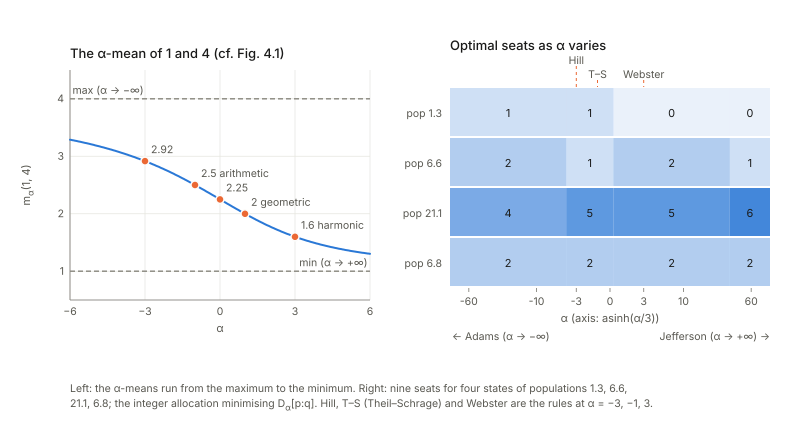

## Links

- **[Interactive companion](figures/interactive.html)**: eight widgets. (1) The normalised α-geodesic of the three-outcome simplex (drag $p$ and $q$), the mass that the un-normalised curve loses, and its affine parameter. (2) Kurose's Pythagorean identity with its correction term, for any $\alpha$ and step. (3) The α-mean and the scale-free test of Theorem 4.7. (4) Dividing seats: the $D_\alpha$-optimal allocation against brute force and against the classical divisor rules. (5) α-integration of three distributions and the table of excess risks. (6) The Tsallis escort metric: a numerical Hessian of $\psi_q$ divided by the Fisher metric. (7) The $(u,v)$-divergence by quadrature against its closed forms, with the metric (4.130) and the $\beta$-divergence (4.140) as printed next to their corrections. (8) Positive-definite matrices before and after a change of basis.
- **[Runnable checks](https://github.com/msrepo/information_geometry_notes/tree/main/chapters/ch04-alpha-geometry/code)**: `python3 code/alpha_geometry.py` prints every number on this page in about eight seconds (`make verify` runs it; numpy only, fixed seeds), and `python3 code/alpha_geometry.py --figures` regenerates the figures.
- The book: Amari, *Information Geometry and Its Applications* (Springer, 2016), DOI [10.1007/978-4-431-55978-8](https://doi.org/10.1007/978-4-431-55978-8). These notes cover Chapter 4 only; equation numbers such as (4.29) refer to the book, and so do the few numbers (3.xx) and (6.xx) borrowed from Chapters 3 and 6.
  No text of the book is reproduced here; everything is restated and re-derived.
- Neighbouring chapters: **[Chapter 3: invariant geometry](../ch03-invariant-geometry/index.html)** (the $f$-divergences, the Fisher metric as the only invariant one, the $\alpha$-divergence (3.96) used throughout), **[Chapter 1: dually flat structure](../ch01-dually-flat-structure/index.html)** (Bregman divergences, Pythagoras, projection), **[Chapter 5: elements of differential geometry](../ch05-elements-of-differential-geometry/index.html)** (curvature, the formula (5.66) used below) and **[Chapter 6: dual connections](../ch06-dual-connections/index.html)** (the metric and connections a divergence induces, (6.22)–(6.24), which this chapter takes for granted).
  Background on the annotations site: **[The Fisher information matrix](https://msrepo.github.io/theory_inclined_papers_with_annotations/fisher-information/)**.

## In one paragraph

Chapter 1 gave a recipe for geometry from a convex function (a **Bregman divergence**, "flat": it has two dual straight-line structures, a Pythagorean theorem and clean projections). Chapter 3 gave a criterion for a *reasonable* divergence on probabilities (**invariance**: merging or relabelling outcomes must not change it, which singles out the $f$-divergences and the Fisher metric). The two do not agree in general, and this chapter asks how far they do. On the probability simplex only the KL divergence and its dual are both (Theorem 4.1). On the cone of **positive measures** (vectors of positive numbers, not required to add to 1) the whole **α-divergence** family is both (Theorem 4.2), and the simplex then inherits a curved geometry of constant curvature $(1-\alpha^2)/4$ in which Pythagoras survives with a correction term (Kurose). The same *representation* $m\mapsto m^{(1-\alpha)/2}$ yields the α-mean, the optimal way to merge distributions, and (a nice surprise) the divisor rules used to apportion parliamentary seats.
Tsallis $q$-entropy is the α-geometry with $\alpha=2q-1$, and its "escort distribution" gives a second, *flat* but non-invariant structure on the same simplex whose metric is the Fisher metric up to a scalar factor. The chapter then replaces power functions by general pairs $(u,v)$ (flat divergences on positive measures), carries the construction to **positive-definite matrices** (where the flat divergence that is invariant under every change of basis is the Gaussian KL; the book's formula for it is in fact twice the KL) and ends with a catalogue of other divergences.
I checked every statement that can be checked numerically, by routes the book does not use (rank tests, brute-force enumeration, exact curvature, quadrature, finite-difference connections). More than two dozen printed formulas turn out wrong in a sign, a factor or a variable; a few of the book's claims become sharper (the α-geodesic's parameter is not affine; the log-det divergences differ only through $\alpha-\beta$; the "(α,β)-divergence" of Zhang is the $\alpha\beta$-geometry); and every theorem I could test stands.

## The spine of the argument

1. **Uniqueness.** On the simplex only KL and its dual are decomposable, invariant and flat (Theorem 4.1); on positive measures $\mathbb R^n_+$ exactly the α-divergences are (Theorem 4.2). The reason: flatness of a decomposable divergence forces a power representation, and the simplex $\sum m_i=1$ is flat inside it only for $\alpha=\pm1$ (§4.1).
2. **Geometry of $\mathbb R^n_+$.** α-geodesics are straight in $\theta=m^{(1-\alpha)/2}$, $-\alpha$-geodesics straight in $\eta=m^{(1+\alpha)/2}$; the Pythagorean and projection theorems of Chapter 1 hold unchanged (§4.2.1).
3. **Geometry of $S_n$.** Normalising the α-geodesic gives the geodesic of the induced connection; the Pythagorean identity acquires the term $-\tfrac{1-\alpha^2}4D[p:q]D[q:r]$ (Kurose), because the simplex has constant curvature $(1-\alpha^2)/4$ (§4.2.2–4.2.3).
4. **Representation as a tool.** The α-mean (the only scale-free quasi-arithmetic means), the α-integration (the optimal merge under the α-risk), and apportionment (the divisor rules minimise $D_\alpha$) (§4.2.4–4.2.8).
5. **Tsallis.** $\log_q$ is the α-representation with $\alpha=2q-1$; a second potential $\psi_q=-\log_q p_0$ on the same simplex is flat, not invariant, and conformal to Fisher by the factor $q/h_q$ (the book prints $1/h_q$); this conformality is special to power deformations (Theorem 4.14) (§4.3).
6. **$(u,v)$-divergences.** Any increasing pair $u,v$ defines a decomposable dually flat divergence on $\mathbb R^n_+$ with $\theta=u(m)$, $\eta=v(m)$ (§4.4).
7. **Matrices.** The KL divergence $\operatorname{tr}(PQ^{-1})-\log\det(PQ^{-1})-n$ is flat and invariant under all of $Gl(n)$; $(u,v)$ gives rotation-invariant flat divergences; the $(\alpha,\beta)$-log-det family is $Gl(n)$-invariant, shares one metric, and its connections depend only on $\alpha-\beta$ (§4.5).
8. **Catalogue.** γ-, Zhang's, Jensen–Shannon, Burbea–Rao, $(F,G,H)$: properties, and several misprints (§4.6).

## Setup and notation

| Symbol | Meaning | In the running examples |
|---|---|---|
| $S_n$, $\mathbb R^n_+$ | distributions on $n+1$ outcomes; positive vectors $m=(m_i)$ | $S_2$: $p=(0.6,0.3,0.1)$, $q=(0.1,0.3,0.6)$; $\mathbb R^3_+$ |
| $D_\alpha[m:n]$ | $\frac4{1-\alpha^2}\sum\{\frac{1-\alpha}2m_i+\frac{1+\alpha}2n_i-m_i^{(1-\alpha)/2}n_i^{(1+\alpha)/2}\}$ (3.96); $\alpha=-1$ is $\mathrm{KL}[m:n]$, $\alpha=1$ its dual; $D_\alpha[m:n]=D_{-\alpha}[n:m]$ | $\alpha=3$ is $\chi^2$ |
| $h_\alpha(m)$ | α-representation $m^{(1-\alpha)/2}$ ($\log m$ at $\alpha=1$) | |
| $\theta,\eta$ | $\theta=\frac2{1-\alpha}m^{(1-\alpha)/2}$, $\eta=\frac2{1+\alpha}m^{(1+\alpha)/2}$ (with the constants of (4.137)) | $\chi^2$: $\theta=-1/m$, $\eta=m^2/2$ |
| $\Gamma^{(\alpha)}$, $T$, $K$ | α-connection $\Gamma^{(0)}-\frac\alpha2T$ (6.38); cubic tensor $T_{ijk}=\mathbb E[\partial_i l\,\partial_jl\,\partial_kl]$; curvature $R_{ijkl}=K(g_{jk}g_{il}-g_{ik}g_{jl})$ in the convention of Chapter 5 | $K=(1-\alpha^2)/4$ |
| $\log_q$, $\exp_q$, $h_q$ | $\log_q u=\frac{u^{1-q}-1}{1-q}$; $h_q(p)=\sum p_i^q$; escort $\tilde p_i=p_i^q/h_q$ | $q=0.6$, $p=(0.4,0.3,0.2,0.1)$ |
| $\psi_q$, $\varphi_q$, $\tilde D_q$ | $q$-free energy $-\log_qp_0$ in $\theta^i=\frac{p_i^{1-q}-p_0^{1-q}}{1-q}$; its Legendre dual; the Bregman divergence (4.95) | |
| $\chi$, $u$, $v$ | $u=\log_\chi=\int_1^s dt/\chi$, $v=\exp_\chi=u^{-1}$ (4.102)–(4.105) | $\chi=s^q$, $\kappa$-exponential, $s+s^2$ |
| $D_{u,v}$ | $\sum[\int_0^{m_i}vu'+\int_0^{m'_i}uv'-u(m_i)v(m'_i)]$ (4.127) | $(\alpha,\beta)$, α, β, $U$ |
| $P,Q$, $\Lambda$ | positive-definite matrices; $\Lambda=\operatorname{diag}(\lambda_i)$, $\lambda_i$ the eigenvalues of $PQ^{-1}$ | two $2\times2$ examples, below |
| $Gl(n)$, $O(n)$ | congruences $P\mapsto L^{\mathsf T}PL$; rotations | one $L$, below |

**Conventions from Chapter 6 that the chapter uses without saying so.** A divergence $D[\xi:\xi']$ induces a metric $g_{ij}=-\partial_i\partial'_jD$ and two connections with $\Gamma_{ijk}=-\partial_i\partial_j\partial'_kD$, $\Gamma^*_{ijk}=-\partial'_i\partial'_j\partial_kD$ at the diagonal (6.22)–(6.24); the difference is the cubic tensor. For an $f$-divergence it is $g=$ Fisher and $\Gamma^*-\Gamma=\alpha T$ with $\alpha=2f'''(1)+3$ (6.36), and the α-connection is flat in the α-representation (e-flat at $\alpha=1$, m-flat at $\alpha=-1$).
**Running examples.** The simplex $S_2$ of three outcomes in the chart $\xi=(p_1,p_2)$ (where the mixture connection is flat) for §1–§2 and §6; three positive numbers for the Bregman statements; a toy population $(1.3,6.6,21.1,6.8)$ sharing nine seats; a four-outcome distribution for the escort geometry; and for §5 the $2\times2$ matrices $P=\left[\begin{smallmatrix}1.4&0.3\\0.3&0.9\end{smallmatrix}\right]$, $Q=\left[\begin{smallmatrix}0.8&-0.2\\-0.2&1.3\end{smallmatrix}\right]$ with the change of basis $L=\left[\begin{smallmatrix}2&0.5\\-0.3&1.5\end{smallmatrix}\right]$.

## 1. Invariant and flat divergence (§4.1)

**In plain words.** A divergence measures how far apart two distributions are. Two properties are wanted. *Invariance*: the divergence must not change when information is merely repackaged (relabel the outcomes, or split one outcome into two sub-outcomes in the same ratio in both distributions). For a decomposable divergence (a sum over outcomes) that criterion of Chapter 3 forces $D$ to be an **$f$-divergence** $\sum m_if(n_i/m_i)$ and the metric to be Fisher's. *Flatness*: $D$ must be a **Bregman divergence**, "a convex function minus its tangent", so that coordinates $\theta$ (in which straight lines are one kind of geodesic) and $\eta=\nabla\psi(\theta)$ (the other kind) exist and Pythagoras and projection work. KL has both. The question is whether anything else does. The answer is no on the simplex and yes on positive measures, where the winners are the α-divergences.
*A first feel for the numbers.* For $p=(0.6,0.3,0.1)$ and $q=(0.1,0.3,0.6)$ the α-divergence is $D_\alpha[p:q]=1.45833,\,0.89588,\,0.84041,\,0.89588,\,1.45833$ for $\alpha=-3,-1,0,1,3$ ($q$ is $p$ reversed, so the values are symmetric in $\alpha$); $\alpha=-1$ is $\mathrm{KL}[p:q]$ and $\alpha=3$ is Pearson's $\chi^2$.

### 1.1 The α-divergence is Bregman on $\mathbb R^n_+$ (Theorem 4.2, "if")

**In plain words.** Re-express each positive number $m$ in two ways, $\theta=u(m)$ and $\eta=v(m)$, with $u(m)=\frac2{1-\alpha}m^{(1-\alpha)/2}$ and $v(m)=\frac2{1+\alpha}m^{(1+\alpha)/2}$; then $D_\alpha$ is exactly "$\psi(\theta)$ plus its Legendre dual minus $\theta\eta$" for the convex function $\psi(\theta)=\frac2{1+\alpha}m$ written in the variable $\theta$ (and $\varphi(\eta)=\frac2{1-\alpha}m$). *Example:* $\alpha=3$: $\theta=-1/m$, $\eta=m^2/2$, $\psi=m/2$ and $D_3[m:n]=\sum(n_i-m_i)^2/(2m_i)$, the $\chi^2$ divergence (checked on random vectors: $1.352769462686$ both ways).
**Formally.** $\psi''(\theta)=v'(m)/u'(m)=m^\alpha>0$ for *every* real $\alpha$ (4.123), so the potential is convex whatever $\alpha$ is.
*Checks and two slips.* (i) The book writes the representation without the constants, $\theta=m^{(1-\alpha)/2}$ (4.1), and claims that the Bregman divergence (4.6) *is* $D_\alpha$. It is $\tfrac{1-\alpha^2}4D_\alpha$: ratios $-2.000000,\,0.1875,\,0.25,\,0.1875,\,-0.3125,\,-2.000000$ for $\alpha=-3,-0.5,0,0.5,1.5,3$ against $(1-\alpha^2)/4$; for $\lvert\alpha\rvert>1$ the printed "divergence" is negative. The constants of (4.137) repair this. (ii) (4.3) says $\psi_\alpha$ is convex "for $\alpha>-1$"; with the printed (unscaled) $\psi_\alpha(\theta)=\frac{1-\alpha}2\theta^{2/(1-\alpha)}$ the second derivative at $\theta=0.7$ is $+0.4228,\,+1.0000,\,+1.4700$ for $\alpha=-0.5,0,0.5$ but $-42.4993$ and $-5.8309$ for $\alpha=1.5,3$ (and $-0.5363,-0.3068$ for $\alpha=-2,-1.5$): convex only for $-1<\alpha<1$. (iii) The standard $f$ of (4.17) has $f(1)=f'(1)=0$, $f''(1)=1.000000$.

### 1.2 The converse: why only powers (Theorem 4.2, "only if")

**In plain words.** If $D[m:n]=\sum m_if(n_i/m_i)$ is Bregman, with dual coordinates $\theta(m)$ and $\eta(n)$, then the *cross term* $-\theta(m)\eta(n)$ is a product of a function of $m$ and a function of $n$; the other two terms depend on only one argument. Differentiate once in $m$ and once in $n$ and everything but the product disappears: $\partial_m\partial_n D=-\theta'(m)\eta'(n)$, a **rank-one kernel**. For $D=mf(n/m)$ the kernel is $-(n/m^2)f''(n/m)$, and it is rank one exactly when $f''$ is a power, which gives $f\propto u^{(1+\alpha)/2}$ plus a linear function (and $-\log u$, $u\log u$ at the ends).
*Check (by a route the book does not take).* I evaluated $-(n/m^2)f''(n/m)$ on a $25\times25$ grid and took singular values. The ratio $s_2/s_1$ is $1.05\times10^{-16}$ for $\alpha=0$, $7.27\times10^{-17}$ for $\alpha=3$ ($\chi^2$), $1.70\times10^{-16}$ for KL and $6.27\times10^{-17}$ for dual KL: rank one. For the **Jensen–Shannon** divergence (an $f$-divergence, hence invariant) it is $8.80\times10^{-2}$ and for the triangular discrimination $(u-1)^2/(u+1)$ it is $2.28\times10^{-1}$: not Bregman in any coordinates.
*A gap in the printed proof.* It equates $mf(n/m)$ with a product $k(m)k^*(n)$ (4.10). That holds for the *non-standard* $f=-u^{(1+\alpha)/2}$ (the kernel $-\sqrt{mn}$ at $\alpha=0$ has $s_2/s_1=8.3\times10^{-17}$) but not for the standard $f$ of (4.17): $4(\frac m2+\frac n2-\sqrt{mn})$ has $s_2/s_1=8.07\times10^{-1}$, because standardising adds terms in $m$ alone and in $n$ alone. The argument has to be run on the mixed derivative, as above, which also removes the need for the unstated assumption that those one-variable terms vanish; the conclusion (a power) is right. Also (4.13), $h=\log f'$, needs $f'>0$, but $f=-u^{(1+\alpha)/2}$ has $f'<0$ for $\alpha>-1$ ($\log\lvert f'\rvert$ is meant). And (4.8) assumes the affine coordinates are componentwise functions of $m_i$, which is a real restriction I could not test.

### 1.3 Why the simplex is different (Theorem 4.1)

**In plain words.** The simplex $\sum m_i=1$ sits inside the cone $\mathbb R^{n+1}_+$. A Bregman divergence restricted to a subset is certainly a flat (Bregman) divergence there when the subset is an affine subspace in the affine coordinates. In $\theta=m^{(1-\alpha)/2}$ the simplex is $\sum\theta_i^{2/(1-\alpha)}=1$: a plane for $\alpha=-1$, the round sphere $\sum\theta_i^2=1$ for $\alpha=0$; in $\eta$ it is linear for $\alpha=+1$ (and (4.20) sums to $m$ where $n$ is meant). The α-geodesic (4.22) of the cone between $p$ and $q$ leaves the simplex: its total mass at $t=\tfrac12$ is $1.000000,\,0.894949,\,0.789898,\,0.642857$ for $\alpha=-1,0,1,3$.
**This is not yet a proof**: a curved hypersurface of a flat space may have a flat induced geometry (Chapter 5's cylinder). So I computed the curvature of the α-connection of $S_2$ exactly, from (5.66), at three points. In every case $R_{ijkl}=K(g_{jk}g_{il}-g_{ik}g_{jl})$ with
$$K=\frac{1-\alpha^2}4:\qquad 0,\ 0.1875,\ 0.25,\ 0.1875,\ 0,\ -0.75,\ -2$$
for $\alpha=-1,-0.5,0,0.5,1,2,3$ (tensor residual $\le1.9\times10^{-12}$): a **constant**, zero exactly at $\alpha=\pm1$, negative for $\lvert\alpha\rvert>1$; at $\alpha=0$ the simplex is the octant of the sphere of radius 2 (Fisher metric = $4\times$ the round metric of $\sqrt p$).
*The induced connection.* In the mixture chart $\xi=(p_1,p_2)$, $g_{ij}=\sum_x\partial_ip_x\partial_jp_x/p_x$ and $T_{ijk}=\sum_x\partial_ip_x\partial_jp_x\partial_kp_x/p_x^2$, and differentiating $p^{(1-\alpha)/2}q^{(1+\alpha)/2}$ gives exactly $\partial_i\partial_j\partial'_kD_\alpha=\frac{1+\alpha}2T_{ijk}$, so $\Gamma_{ijk}=-\frac{1+\alpha}2T_{ijk}=\Gamma^{(0)}_{ijk}-\frac\alpha2T_{ijk}$ (with $\Gamma^{(0)}=-\frac12T$ in this chart, because the mixture connection $\Gamma^{(-1)}$ vanishes there): $D_\alpha$ induces the α-connection, and $\Gamma^*-\Gamma=\alpha T$. Nested five-point finite differences of $D_\alpha$ confirm it at $\xi=(0.3,0.25)$ to between $7.0\times10^{-8}$ and $2.1\times10^{-6}$ of $\max\lvert T\rvert$ for $\alpha=-0.5,0,0.5,2$.
*A different proof of Theorem 4.1 (not in the book).* If $D$ were Bregman in *any* coordinates, $\partial_{\xi_i}\partial_{\xi'_j}D=-\sum_k\theta^k_{,i}(x)\eta_{k,j}(y)$ would have rank $\le n$ as a kernel. Stacking this kernel over $14\times14$ points of $S_2$ and taking singular values: the ratio $s_3/s_1$ is $1.29\times10^{-16}$ at $\alpha=-1$ and $8.31\times10^{-17}$ at $\alpha=+1$ (rank 2) but $4.02\times10^{-2},\,3.15\times10^{-2},\,3.28\times10^{-2},\,4.67\times10^{-2}$ at $\alpha=-3,-1.5,-0.5,0$ (and the same by symmetry): rank 3. So no $\alpha\neq\pm1$ gives a Bregman divergence of $S_2$, with no appeal to decomposability. On $S_1$ the same test gives $s_2/s_1=1.0\times10^{-16}$ at $\alpha=-1$ and $1.6\times10^{-17}$ at $+1$ against $4.7\times10^{-1}$ ($\alpha=\pm3$), $7.9\times10^{-2}$ ($\pm0.5$), $1.1\times10^{-1}$ ($0$): the Remark's "an invariant Bregman divergence is KL for any $n$" holds for $n=1$ too (what is special at $n=1$ is only the characterisation of invariant *decomposable* divergences by $f$).

## 2. α-geometry in $S_n$ and $\mathbb R^n_+$ (§4.2)

### 2.1 Geodesics, Pythagoras and projection in $\mathbb R^n_+$ (Theorems 4.3, 4.4)

**In plain words.** Chapter 1's theory applies verbatim once $\theta$ and $\eta$ are the two representations: the **α-geodesic** between $m_1,m_2$ is the curve whose α-representation is the straight line, $m_i(t)^{(1-\alpha)/2}=(1-t)m_{1i}^{(1-\alpha)/2}+tm_{2i}^{(1-\alpha)/2}$ (4.22), the $-\alpha$-geodesic is straight in $\eta$ (4.24). When the α-geodesic $m\to n$ meets the $-\alpha$-geodesic $n\to k$ at a right angle (in terms of coordinates: $(\theta_n-\theta_m)\cdot(\eta_n-\eta_k)=0$) then $D_\alpha[m:k]=D_\alpha[m:n]+D_\alpha[n:k]$, and the minimiser of $D_\alpha[m:\cdot]$ over a $(-\alpha)$-flat submanifold is the α-projection.
*Checks.* 400 random triples of positive 3-vectors for each of $\alpha=-3,-1,-0.5,0,0.5,1,3$, built so that $(\theta_n-\theta_m)\cdot(\eta_n-\eta_k)=0$: the largest relative error of the Pythagorean identity is $\le6.6\times10^{-14}$. That identity is algebraic ($(\theta_n-\theta_m)\cdot(\eta_n-\eta_k)=D[m:n]+D[n:k]-D[m:k]$ for any Bregman divergence), so by itself it only confirms the constants. The independent route is orthogonality in the Riemannian sense: with the metric $\operatorname{diag}(1/m_i)$ of $\mathbb R^n_+$ and the tangents at $n$ of the explicit curves (4.22) and (4.24), 400 further triples per $\alpha$ with $w$ chosen $g$-orthogonal to $u$ give (4.25) to $\le1.7\times10^{-14}$ (cosine of the angle $\le5.7\times10^{-15}$). Projection of $m=(1.2,0.7,2.1)$ for $\alpha=0.5$ onto a plane of $\eta$-coordinates: minimiser $(s,t)=(1.555743,0.990426)$, $D=0.40497923$; the α-geodesic from $m$ to it is orthogonal to the plane ($4.9\times10^{-11}$, $5.7\times10^{-11}$) and 20 random Newton starts all find the same point, as the uniqueness statement asks.

### 2.2 The α-geodesic of $S_n$, and what its parameter is (4.27)

**In plain words.** On the simplex the straight line in $\theta$ is not allowed (it leaves the simplex), so the book rescales each point of it radially to total mass 1 (4.27) and calls the result the α-geodesic of $S_n$. Is that really the geodesic of the connection that $D_\alpha$ induces on the simplex? As a *set*, yes; as a parametrised curve, no.
**Why.** Lowering the geodesic equation of $\Gamma^{(\alpha)}$ with $L=p^{(1-\alpha)/2}$ gives $\sum_xp_x^\alpha\,\partial_lL\,\ddot L=0$ for all $l$, that is: the acceleration $\ddot L$ is parallel to $L$ itself. A curve in the plane through the origin spanned by $L(p)$ and $L(q)$ can be reparametrised to have this property, and the normalised line is such a curve: the geodesic's *affine* parameter is $\tau(s)=\int_0^sc^2\big/\int_0^1c^2$, with $c(s)$ the normalising constant, not the $s$ of (4.27) (the two agree for $\alpha=\pm1$, where $c\equiv1$ or the normalisation is a mere shift of $\log p$; for every other $\alpha$ the constant $c$ varies along the curve and they differ).
*Check.* I integrated the geodesic equation numerically (Runge–Kutta) from $p=(0.6,0.3,0.1)$ with the initial velocity of the normalised path: it reaches $q=(0.1,0.3,0.6)$ to $\le7.6\times10^{-8}$, stays in the plane of $L(p),L(q)$ ($\lvert\det\rvert\le1.5\times10^{-10}$), and passes the path point $s=\tfrac14$ after the fraction $0.2433$ (ODE) of its affine time against $0.2430$ predicted by $\int c^2$ for $\alpha=0$ (at $\alpha=3$: $0.3000$ against $0.2997$; the ODE time step is $1/1500$). The largest $\lvert\tau(s)-s\rvert$ is $0.0050,\,0.0071,\,0.0056,\,0.0542$ for $\alpha=-0.5,0,0.5,3$ and $0$ for $\alpha=\pm1$. Theorems 4.5 and 4.6 only use the set, so nothing breaks, but "the α-geodesic with parameter $t$" is not a geodesic in the affine sense. The first widget shows $\tau(s)$ against $s$.

### 2.3 Kurose's Pythagorean theorem and the projection theorem (Theorems 4.5, 4.6)

**In plain words.** On a sphere, a right spherical triangle satisfies $\cos c=\cos a\cos b$; with $D=1-\cos$ for each side this reads $D_c=D_a+D_b-D_aD_b$. The simplex *is* a sphere at $\alpha=0$ (radius 2), and the α-version for general $\alpha$ replaces the factor 1 by the curvature $K=\frac{1-\alpha^2}4$ (in the normalisation of $D_\alpha$):
$$D_\alpha[p:r]=D_\alpha[p:q]+D_\alpha[q:r]-\frac{1-\alpha^2}4\,D_\alpha[p:q]\,D_\alpha[q:r]\qquad(4.29),$$
when the α-geodesic $p\to q$ is orthogonal to the $-\alpha$-geodesic $q\to r$. The book states it without proof (it is due to Kurose and holds for any dual manifold of constant curvature).
*Checks.* For each of $\alpha=-3,-1,-0.5,0,0.5,1,2,3$ I drew 200 random triples, built $r$ on the $-\alpha$-geodesic from $q$ whose tangent is Fisher-orthogonal to the α-geodesic $p\to q$ at $q$ (tangents computed exactly), and compared. $\max\lvert D[p:r]-(4.29)\rvert\le7.11\times10^{-15}$ in every case; without the correction the identity misses by up to $2.02\times10^{-2}$ ($\alpha=-3$), $8.87\times10^{-2}$ ($\alpha=3$), i.e. $3.6$ to $3.7$ percent of $D[p:r]$, and is exact at $\alpha=\pm1$ ($\le7.9\times10^{-16}$). A single triple ($p=(0.6,0.3,0.1)$, $q=(0.1,0.3,0.6)$, $r$ at $s=0.6$):

| $\alpha$ | $D[p:q]$ | $D[q:r]$ | $D[p:r]$ | plain sum | $\frac{1-\alpha^2}4D[p:q]D[q:r]$ | plain sum minus that |
|---|---|---|---|---|---|---|
| −3 | 1.458333 | 0.006651 | 1.484382 | 1.464984 | −0.019398 | 1.484382 |
| 0 | 0.840408 | 0.007291 | 0.846167 | 0.847699 | +0.001532 | 0.846167 |
| 0.5 | 0.854004 | 0.008040 | 0.860756 | 0.862044 | +0.001287 | 0.860756 |
| 1 | 0.895880 | 0.009135 | 0.905015 | 0.905015 | 0 | 0.905015 |
| 3 | 1.458333 | 0.013846 | 1.512562 | 1.472179 | −0.040383 | 1.512562 |

(The subtracted term has the sign of the curvature: it shortens $D[p:r]$ for $\lvert\alpha\rvert<1$, where the simplex curves like a sphere, and lengthens it beyond, like a saddle.) The spherical law itself, for a random pair $p,q$ (Dirichlet, fixed seed) at $\alpha=0$: $D_0[p:q]=0.3762797334=4(1-\cos\varphi)$ with $\varphi$ the angle between $2\sqrt p$ and $2\sqrt q$ on the sphere of radius 2.
*Theorem 4.6 (projection).* For $p=(0.5,0.3,0.2)$ and the segment $M$ through $(0.25,0.35,0.4)$ with direction $(0.4,-0.3,-0.1)$, the minimiser of $D_{0.5}[p:\cdot]$ over $M$ is at $t=0.462341$ and the tangent of $M$ there has Fisher cosine $-4.8\times10^{-11}$ with the tangent of the α-geodesic from $p$: it is the α-projection. The book's closing Remark says this is special to α-families; for the (symmetric, α=0 geometry) Jensen–Shannon divergence the minimiser over the same segment is at $t=0.453996$ and the cosine with the Levi-Civita geodesic is $-0.0004$: small but not zero. A sharper example is in §5.3.

### 2.4 Apportionment (§4.2.4)

**In plain words.** A country must hand out $n$ seats to states of different populations; the shares $n_i/n$ have to be fractions with denominator $n$, so they cannot equal the population shares $p_i$. Choose the integers $n_i$ so that $q_i=n_i/n$ is closest to $p$ in $D_\alpha[p:q]$. The book says (without detail) that most known methods are minimisers of some $D_\alpha$ and differ only in $\alpha$. Here is the working.
**Derivation.** $D_\alpha[p:q]$ is a sum over states of a function of $n_i$ alone and that function is convex in $n_i$, so an optimal allocation is built by giving each next seat to the state with the cheapest marginal cost. In terms of $a=\frac{1-\alpha}2$, $b=\frac{1+\alpha}2$ that is "next seat to the state maximising $p_i/d_\alpha(n_i)$" with the **divisor**
$$d_\alpha(k)=\big\lvert(k+1)^b-k^b\big\rvert^{-1/a}.$$
For $\alpha=3$ this is $d=2k+1$ (Webster / Sainte-Laguë, $d\propto k+\frac12$), for $\alpha=-3$ it is $\sqrt{k(k+1)}$ (Hill–Huntington), for $\alpha=-1$ ($\mathrm{KL}[p:q]$) the logarithmic mean $1/\log(1+1/k)$ (Theil–Schrage), and $d_\alpha\to k+1$ (Jefferson) as $\alpha\to+\infty$, $d_\alpha\to k$ (Adams) as $\alpha\to-\infty$ (numbers: $d_{60}(k)/(k+1)=1.023775,\,1.048109,\,1.076307$ at $k=1,3,8$; $d_{-60}(k)/k=1,\,0.964627,\,0.935058$). For $\alpha\le-1$ the divisor vanishes at $k=0$: every state gets a seat. (What I derived is the divisor; the rule names are the usual ones as I remember them, and I did not check the name "Theil–Schrage" for the logarithmic-mean rule against a source.)
*Checks.* Numerically $d_3(k)/2-(k+\tfrac12)$, $d_{-3}(k)-\sqrt{k(k+1)}$ and $d_{-1}(k)-1/\log(1+1/k)$ are all $\le1.8\times10^{-15}$ for $k=0,\dots,5$ (the last for $k\ge1$). Greedy allocation with $d_\alpha$ against brute-force enumeration of all 220 allocations of nine seats among four states: they agree in 1500 of 1500 random populations $\times$ $\alpha\in\{-3,-1,0,1,3\}$. On the toy population $(1.3,6.6,21.1,6.8)$ with nine seats:

| rule | its α | seats |
|---|---|---|
| Adams | $-\infty$ | (1, 2, 4, 2) |
| Hill–Huntington | $-3$ | (1, 1, 5, 2) |
| Theil–Schrage ($\mathrm{KL}[p:q]$) | $-1$ | (1, 1, 5, 2) |
| Hellinger | $0$ | (1, 1, 5, 2) |
| $\mathrm{KL}[q:p]$ | $1$ | (0, 2, 5, 2) |
| Webster ($\chi^2$) | $3$ | (0, 2, 5, 2) |
| Jefferson | $+\infty$ | (0, 1, 6, 2) |

The five classical rules, run from their own divisor sequences with no divergence involved, give exactly these seats: Jefferson (0, 1, 6, 2), Webster (0, 2, 5, 2), Hill (1, 1, 5, 2), Theil–Schrage (1, 1, 5, 2), Adams (1, 2, 4, 2). As $\alpha$ runs from $-98$ to $98$ the optimum changes at $\alpha=-4.2354,\ 0.2669,\ 34.2630$ only. Dean's rule (harmonic mean of $k,k+1$) gives (1, 2, 4, 2) here and is not of the form $d_\alpha$: "most", not "all", is right.

### 2.5 The α-mean (§4.2.5)

**In plain words.** To average two positive numbers $x,y$: re-express them as $x^{(1-\alpha)/2},y^{(1-\alpha)/2}$, average arithmetically, undo. That is the **α-mean** $m_\alpha(x,y)=\{\frac12(x^{(1-\alpha)/2}+y^{(1-\alpha)/2})\}^{2/(1-\alpha)}$ (4.33). It contains the arithmetic mean ($\alpha=-1$), the geometric mean ($\alpha=1$, as a limit), the harmonic mean ($\alpha=3$), the maximum ($-\infty$) and the minimum ($+\infty$), and it decreases with $\alpha$ (4.47). *Example* ($x=1,y=4$, the numbers behind the book's Fig. 4.1): $4,\ 2.9155,\ 2.5,\ 2.25,\ 2,\ 1.6,\ 1.1660,\ 1$ for $\alpha=-\infty,-3,-1,0,1,3,10,+\infty$; at $\alpha=0$, $\frac14(1+2)^2=2.25=\frac12(\frac{x+y}2+\sqrt{xy})$.
**Theorem 4.7** says these are the only *scale-free* means $m(cx,cy)=c\,m(x,y)$ among quasi-arithmetic means $h^{-1}\{\frac12(h(x)+h(y))\}$. I followed the proof (4.36)–(4.46) line by line and it is correct: differentiating $h(cm)=\frac12(h(cx)+h(cy))$ in $x$ forces $h'(cx)/h'(x)$ to depend on $c$ only, hence $h'$ is a power.
*Checks.* $m_\alpha(cx,cy)-c\,m_\alpha(x,y)$ for $c=3.7$ is $0,\,0,\,1.8\times10^{-15},\,0$ for $\alpha=-3,0,0.5,3$, while the quasi-arithmetic mean built from $h(x)=x+x^2$ misses by $0.1588$; $m_\alpha(1,4)$ is strictly decreasing on a grid of 241 values of $\alpha\in[-6,6]$ (from $3.2886$ to $1.3034$). *A small slip of hypotheses*: the text before (4.34) asks $h$ to be increasing with $h(0)=0$, which excludes $\alpha\ge1$ ($\log$ has $h(0)=-\infty$ and the powers with $\alpha>1$ are decreasing); the proof uses neither.

### 2.6 α-families, α-integration and experts (§4.2.6–4.2.8)

**In plain words.** The α-mean of two numbers extends to an **α-mixture** of distributions: average $p_i(x)^{(1-\alpha)/2}$ with weights $w_i$, undo, renormalise (4.51), (4.55). At $\alpha=-1$ it is the ordinary mixture $\sum w_ip_i$, at $\alpha=+1$ the normalised geometric mean (an exponential family in $w$), at $\alpha\to-\infty$ the pointwise maximum ("optimistic"), at $+\infty$ the minimum ("pessimistic"). Theorem 4.8 ($S_n$ is an α-family for every $\alpha$) is a one-line fact because the point-mass indicators $\delta_i(x)$ have disjoint supports. **Theorem 4.9**: this α-integration is the distribution $q$ that minimises the weighted risk $R_\alpha[q]=\sum w_iD_\alpha[p_i:q]$.
*Example.* Three distributions on four outcomes, $p_1=(0.10,0.25,0.10,0.55)$, $p_2=(0.35,0.15,0.45,0.05)$, $p_3=(0.05,0.45,0.20,0.30)$, weights $(0.5,0.3,0.2)$: the $\alpha=0$ integration is $q=(0.1614,0.2794,0.2248,0.3344)$ with $R_0[q]=0.213485$; $\alpha=-1$ gives the mixture $(0.165,0.26,0.225,0.35)$ and $\alpha=+1$ the geometric mean $(0.1614,0.307,0.2296,0.302)$.
*Checks.* Rows $\alpha$ (risk used), columns $\alpha'$ (integration plugged in), entries $R_\alpha[q_{\alpha'}]-R_\alpha[q_\alpha]$:

| | $\alpha'=-3$ | $-1$ | $0$ | $1$ | $3$ |
|---|---|---|---|---|---|
| $\alpha=-3$ | 0 | 0.00175 | 0.00559 | 0.01682 | 0.09023 |
| $-1$ | 0.00131 | 0 | 0.00108 | 0.00751 | 0.05353 |
| $0$ | 0.00404 | 0.00103 | 0 | 0.00285 | 0.03698 |
| $1$ | 0.01267 | 0.00751 | 0.00301 | 0 | 0.02002 |
| $3$ | 0.10841 | 0.09541 | 0.07217 | 0.03727 | 0 |

Every off-diagonal entry is positive and none of 2000 random perturbations of $q_\alpha$ lowers the risk, for any $\alpha$ tried. The proof is a stationarity argument; it is complete because $q\mapsto D_\alpha[p:q]$ is convex for every $\alpha$ (its second derivative is $p^{(1-\alpha)/2}q^{(\alpha-3)/2}>0$; numerical second differences $0.7200,\,1.0561,\,1.3635,\,1.5492,\,1.7602,\,2.2724,\,3.3333$ at $\alpha=-3,-1.5,-0.5,0,0.5,1.5,3$ equal it), which the book does not say.
*Two slips.* (i) In (4.65) the variation of $D_\alpha[p_i:q]$ is printed with $q^{-(1+\alpha)/2}$; the derivative is $\frac2{1-\alpha}(1-(p/q)^{(1-\alpha)/2})$, whose $q$-dependence is $q^{-(1-\alpha)/2}$, which is what (4.66) uses (numerical derivative $0.424358$ against $0.424358$ at $\alpha=-0.5$; the printed exponent gives $0.690591$; they agree only at $\alpha=0$). (ii) After Theorem 4.10 the text says the $\alpha=1$ machine is the *mixture* of experts and the $\alpha=-1$ machine the *product* of experts. By (4.56)–(4.57) it is the other way round: $\alpha=-1$ is $\sum w_ip_i$ (difference to the α-integration $0$) and $\alpha=+1$ the normalised product $\prod p_i^{w_i}$ (difference $2.8\times10^{-17}$).

## 3. Geometry of Tsallis $q$-entropy (§4.3)

### 3.1 The $q$-logarithm and the sign of (4.77)

**In plain words.** Replace $\log$ by $\log_q u=\frac{u^{1-q}-1}{1-q}$ (and $\exp$ by its inverse). That is the α-representation $u^{(1-\alpha)/2}$ with $\alpha=2q-1$, up to a scale and a constant, so everything in §2 is the $q$-geometry. The Tsallis entropy $H_q(p)=\sum p_i\log_q(1/p_i)=\frac{\sum p_i^q-1}{1-q}$ is concave for **every** $q>0$ (the largest eigenvalue of its Hessian on $\{\sum dp=0\}$ is negative at 200 random points: $-1.089,\,-1.940,\,-2.184,\,-0.273$ for $q=0.3,0.8,1.5,2.5$); the book says $0<q\le1$, which is true but not the whole range. Checked $\exp_q(\log_qu)=u$ to $7.1\times10^{-15}$.
**Slip in (4.77).** The $q$-divergence is written $D_q[p:r]=\mathbb E_p[\log_q(r/p)]=\frac1{1-q}(1-\sum p_i^qr_i^{1-q})$. The expectation of a log-ratio is *minus* a divergence: for a random pair $p,r$ on four outcomes (fixed seed), $\mathbb E_p[\log_q(r/p)]=-0.085281,\,-0.142249,\,-0.230139,\,-0.464131$ for $q=0.3,0.5,0.8,1.5$ while the right-hand side is $+0.085281,\dots$ (so $D_q=-\mathbb E_p[\log_q(r/p)]$). And "the same as the α-divergence with $\alpha=2q-1$" is true only after exchanging the two arguments and including a factor: $D_q[p:r]=q\,D_{2q-1}[r:p]=q\,D_{1-2q}[p:r]$ (e.g. $q=0.3$: $0.085281=0.3\times0.284271$, while $D_{2q-1}[p:r]=0.286230$). The limit cases $q=0,1$ are unaffected.

### 3.2 $S_n$ as a $q$-family, and the $q$-Gaussian (Theorem 4.11, (4.81))

**In plain words.** A $q$-exponential family replaces $p=\exp(\theta\cdot x-\psi)$ by $p=\exp_q(\theta\cdot x-\psi_q)$. The simplex is one for every $q$: write $\theta^i=\frac{p_i^{1-q}-p_0^{1-q}}{1-q}$ and $\psi_q=-\log_qp_0$. *Check* at $q=0.6$, $p=(0.4,0.3,0.2,0.1)$: $\theta=(-0.18836,-0.419598,-0.737594)$, $\psi_q=0.76713789$ (both ways), $p$ recovered from $\theta$ to $5.6\times10^{-17}$ and $\log_qp_x-\theta\cdot x+\psi_q=0$ for the four outcomes.
**The $q$-Gaussian (4.81)–(4.82)** is $\exp_q$ of a quadratic. Two things the text leaves out. (i) The displayed $\log_qp=-(x-\mu)^2/(2\sigma^2)$ is not normalised, even at $q=1$ (there it lacks $\log\sqrt{2\pi}\sigma$): the $\psi_q(\theta)$ that satisfies (4.80) (for $\mu=0.3$, $\sigma=1$) is $0.567912,\,0.963939,\,2.335059$ at $q=0.5,1,1.5$, against $\mu^2/(2\sigma^2)=0.045$ in the printed middle expression (a hand check at $q=\frac12$: $\exp_{1/2}(u)=(1+u/2)^2$, so $p=(A-y^2/4)^2$ with $\frac{32}{15}A^{5/2}=1$, $A=(15/32)^{2/5}=0.738544$, $c=2(1-A)=0.522912$ as found numerically). (ii) The values of $x$ are confined to a finite range only for $q<1$ (support $\lvert x-\mu\rvert<1.7188$ at $q=0.5$); for $q>1$, the case of Tsallis physics, the tails are power laws (density at $x=20$: $1.02\times10^{-4}$ at $q=1.5$ against $2.1\times10^{-85}$ for the Gaussian).

### 3.3 The escort geometry (§4.3.3)

**In plain words.** The simplex carries a *second* flat structure. Use the same coordinates $\theta^i=\frac{p_i^{1-q}-p_0^{1-q}}{1-q}$ but the potential $\psi_q(\theta)=-\log_qp_0$, which is convex (Lemma 4.1). Its gradient is the **escort distribution**, $\eta_i=\partial_i\psi_q=p_i^q/h_q(p)$ with $h_q=\sum p_i^q$: raise to the power $q$ and renormalise, which for $q<1$ pulls $p$ towards the uniform distribution ($p=(0.4,0.3,0.2,0.1)\mapsto(0.340542,0.286555,0.224674,0.14823)$ at $q=0.6$, $h_q=1.694593$). The dual potential is $\varphi_q=\frac1{1-q}(\frac1{h_q}-1)$ (exactly, $-1.02471930$ at the example, no extra scale or constant as "except for a scale and constant" suggests), and the Bregman divergence is $\tilde D_q[p:r]=\frac1{(1-q)h_q[r]}(1-\sum p_i^{1-q}r_i^q)$ (4.95), which equals $q\,D_{2q-1}[p:r]/h_q[r]$ (for $r=(0.15,0.35,0.25,0.25)$: $0.06806532$ three ways: the Bregman form with a numerically differentiated $\psi_q$, (4.95), and the α-divergence).
**The metric and a slip.** The Hessian of $\psi_q$ is the $q$-metric (4.92). The book says it equals the Fisher metric times $\sigma=1/h_q$ (4.116)–(4.117). With (4.91) as printed the factor is $q/h_q$: I differentiated $\psi_q$ numerically and divided entrywise by the Fisher metric in the same $\theta$-chart; all nine entries are $0.354067$, which is $q/h_q=0.354067$, not $1/h_q=0.590112$. Conformal means angles are kept (cosine of two random tangent vectors: $-0.94052299$ for both metrics) and squared lengths scale by $q/h_q$.
**Not invariant.** The escort divergence cannot be invariant (Theorem 4.1) and is not: merging two outcomes of $S_3$ can *increase* it. The largest $D[Tp:Tr]-D[p:r]$ over 20000 random pairs is $+0.2737$ ($q=0.5$) and $+0.2311$ ($q=0.8$), against at most $-1.4\times10^{-9}$ (never positive) for the α-divergence with $\alpha=2q-1$ and for (4.77) (for $q=1.5$ the escort divergence gave $-0.0003$, no violation in this sample, which proves nothing). An explicit pair at $q=0.5$: $p=(0.02,0.02,0.1,0.86)$, $r=(0.49,0.49,0.01,0.01)$ has $\tilde D=0.8471$; merging the first two outcomes gives $p'=(0.04,0.1,0.86)$, $r'=(0.98,0.01,0.01)$ and $\tilde D=1.1390$. The Pythagorean theorem for $\tilde D$ (a $\theta$-geodesic orthogonal to an $\eta$-geodesic) holds to $6.1\times10^{-16}$ on 100 random triples, as for any Bregman divergence.
**The $q$-max-entropy theorem (4.12).** The maximiser of $H_q$ under constraints on *escort* expectations $\tilde{\mathbb E}_q[c_i]=a_i$ is a $q$-exponential family $\log_qp=\theta^ic_i-\psi$, and lies on the $q$-geodesic from the uniform distribution. *Check* ($q=0.7$, five outcomes, two random variables, $a=(1.512636,0.724716)$): solving for $\theta=(-0.218592,0.016679)$, $\psi=0.905415$ gives $p=(0.35571,0.253866,0.184442,0.121731,0.084252)$ with the right escort expectations and $H_q=1.934203$ (uniform: $2.068855$); 1490 random feasible perturbations never have a larger $H_q$ (a sample, not a proof: the constraint set is not convex for $q<1$), and $\log_qp_x-\log_qp_0=\theta\cdot(c_x-c_0)$ exactly.

### 3.4 Deformed families and conformal uniqueness (§4.3.4–4.3.5)

**In plain words.** Replace the power $s^q$ by any positive non-decreasing $\chi$ (Theorem 4.13: $S_n$ is a $\chi$-exponential family for every such $\chi$): $u=\log_\chi=\int_1^s\frac{dt}{\chi(t)}$, $v=\exp_\chi=u^{-1}$, $p=\exp_\chi(\theta\cdot x-\psi_\chi)$, $\psi_\chi=-u(p_0)$, $\theta^i=u(p_i)-u(p_0)$. Everything of §3.3 carries over with $\chi(p_i)/h_\chi$ for the escort ($h_\chi=\sum\chi(p_i)$), $\varphi_\chi=\frac1{h_\chi}\sum\frac{u(p_i)}{u'(p_i)}$ and
$$D_\chi[p:q]=\frac1{h_\chi(q)}\sum_i\frac{u(q_i)-u(p_i)}{u'(q_i)}.$$
*Checks* for $\chi=s^{0.6}$, the Kaniadakis $\kappa$-logarithm ($\kappa=0.5$, $\chi=2s/(s^\kappa+s^{-\kappa})$) and $\chi=s+s^2$, on $p=(0.4,0.3,0.2,0.1)$, $r=(0.15,0.35,0.25,0.25)$: $p$ is recovered to $\le2.2\times10^{-16}$, the gradient of $\psi_\chi$ is $\chi(p_i)/h_\chi$, the Hessian is positive definite, $\varphi_\chi=-1.02471930,\,-1.33562790,\,-0.82009087$ (both ways), and $D_\chi[p:r]=0.06806532,\,0.31703514,\,0.17567857$ (Bregman form against the formula).
**Printed slips.** (i) (4.107) gives $\theta^i=u(p_i)-\psi_\chi$; with (4.108) $\psi_\chi=-u(p_0)$ this is $u(p_i)+u(p_0)$; it should be $u(p_i)+\psi_\chi=u(p_i)-u(p_0)$, as in (4.84). (ii) In (4.109)–(4.113) the letters $u$ and $v$ are interchanged relative to (4.103), (4.105): read with $u=\exp_\chi$ and $v=\log_\chi$ (so $\chi(p)=u'(\cdot)$, $1/v'(p)=\chi(p)$, $\varphi_\chi=\frac1{h_\chi}\sum v/v'$) they are right; as printed (4.109) would have $u''<0$ and a negative-definite "Hessian", and (4.113) would give $2.59649,\,4.91886,\,1.08913$ for the three $\chi$ instead of $\varphi_\chi$. (iii) (4.114) has the arguments exchanged: it is $D_\chi[q:p]$ ($0.07049673$, $0.34666154$, $0.20247623$), not $D_\chi[p:q]$, if the printed $v'$ is read as $u'$.
**Theorem 4.14** says only the power $\chi$ gives a metric conformal to Fisher's; the book states it without proof. *My derivation.* In the $\theta$-chart both $g_F$ and $\operatorname{Hess}\psi_\chi$ have the shape $M[w]_{jk}=w_j\delta_{jk}-w_j\eta_k-\eta_jw_k+\eta_j\eta_k\sum_{x=0}^nw_x$ with $\eta_j=\chi(p_j)/h_\chi$, the weights being $w_x=\chi(p_x)^2/p_x$ for $g_F$ and $w_x=\chi'(p_x)\chi(p_x)/h_\chi$ for the Hessian (both formulas hold at the example point, for the three $\chi$'s above, to relative residuals $\le2.0\times10^{-7}$ for the Hessian and $\le6.5\times10^{-10}$ for $g_F$). For four or more outcomes the map $w\mapsto M[w]$ is injective (the off-diagonal entries force $w_j/\eta_j+w_k/\eta_k=\sum w$ for all $j\ne k$, hence $w_j/\eta_j$ is the same for all $j$, and then the diagonal entries force $\sum w=0$ and so $w=0$). So $\operatorname{Hess}\psi_\chi=\sigma\,g_F$ at a point means that $p_x\chi'(p_x)/\chi(p_x)$ is the same number for every outcome $x$; letting two coordinates of the point vary independently shows that $p\chi'(p)/\chi(p)=vv''/v'^2$ is constant, i.e. $\chi$ is a power. *Check:* the eigenvalues of $g_F^{-1}\operatorname{Hess}\psi_\chi$ are $0.35407,0.35407,0.35407$ for the power; $1.51403,1.59978,1.70107$ for the $\kappa$-exponential and $0.84909,0.91304,0.96718$ for $\chi=s+s^2$; over 25 random points the largest relative spread is $1.0\times10^{-6}$ (finite-difference noise) for the power and $0.172$ for the $\kappa$-exponential.

## 4. The $(u,v)$-divergence (§4.4)

**In plain words.** Take any two increasing functions $u,v$ and re-express each positive number as $\theta=u(m)$ and $\eta=v(m)$. Integrating $v\,du$ gives a convex function of $\theta$ (its derivative is $v$, its second derivative is $v'/u'>0$), integrating $u\,dv$ gives its Legendre dual, and the Bregman divergence of the pair is the **$(u,v)$-divergence**
$$D_{u,v}[m:m']=\sum_i\Big[\int_0^{m_i}v\,u'\,dm+\int_0^{m'_i}u\,v'\,dm-u(m_i)\,v(m'_i)\Big]\qquad(4.127).$$
The conversion between $\theta$ and $\eta$ is componentwise (a real convenience), and for any decomposable pair the dually flat structure exists automatically (Theorem 4.15 is the converse: a decomposable, dually flat divergence that is symmetric under permutations of the indices is of this form); for a non-decomposable pair it exists iff $\eta=v(u^{-1}(\theta))$ is a gradient, i.e. its Jacobian is symmetric (4.145) (for $u(m)=m$, $v(m)=(m_1+\frac12m_2^2,m_2)$ the Jacobian $\left[\begin{smallmatrix}1&m_2\\0&1\end{smallmatrix}\right]$ is not).
*Checks.* At $m=1.7$, $m'=0.6$: for $u=m^\alpha/\alpha$, $v=m^\beta/\beta$, quadrature of (4.127) and the closed form (4.133) agree to ten digits ($0.6050000000$ at $(1,1)$, $0.5073210656$ at $(0.5,2)$, $0.8316657782$ at $(2,0.5)$, $0.5499967465$ at $(0.3,0.3)$); with the constants of (4.137), (4.127) reproduces $D_\alpha$ of (3.96) ($0.6116727886,0.5601980247,0.5149816560,0.4086041540$ at $\alpha=-0.5,0,0.5,2$; the printed (4.138) has its exponents misplaced, the second term carrying $(1-\alpha)/2$ without the prime and the cross term showing $m_i^{\alpha}$ for $m_i^{(1-\alpha)/2}$, and I read it as (3.96)). The Legendre identity (4.124) needs $u(0)v(0)=0$; for (4.172), $u=m$, $v=-1/m$, the integral $\int_0^mvu'$ diverges ($\int_\varepsilon^{1.7}(-1/s)ds=-7.4384,-14.3461,-21.2539$ at $\varepsilon=10^{-3},10^{-6},10^{-9}$): the potentials are fixed up to constants by duality (this is the Stein divergence $\lambda-\log\lambda-1$).
**Slip: the metric (4.130)–(4.131).** The text gives $g_{ij}(m)=\frac{v'(m_i)}{u'(m_i)}\delta_{ij}$ and the Euclidean coordinate $r=\int\sqrt{v'/u'}\,dm$. That is the Hessian of $\psi$ in the $\theta$-chart (4.123). In the chart $m$ (where the book writes $g_{ij}(m)$) it is $u'(m_i)v'(m_i)\delta_{ij}$: the second derivative of $D[m:m']$ in $m'$ at $m'=m=1.7$ is $1.303840$ for $(\alpha,\beta)=(0.5,2)$, equal to $u'v'$, against $v'/u'=2.216529$; for the α-divergence it is $1/m=0.588235$ at every $\alpha$ (Theorem 3.4), while $v'/u'=m^\alpha$ would give $1,\,1.303840,\,4.913$ at $\alpha=0,0.5,3$. The Euclidean coordinate is $r=\int\sqrt{u'v'}\,dm$ ($=2\sqrt m$ for α, the $\xi=2\sqrt m$ of (3.92)).
**Slip: the β-divergence (4.139)–(4.140), (4.180).** With $u=m$, (4.127) and $v=m^\beta/\beta$ give the standard $\frac1{\beta(\beta+1)}[m^{\beta+1}+\beta m'^{\beta+1}-(\beta+1)mm'^\beta]$ ($0.631582$, $0.605000$, $0.584833$ at $\beta=0.5,1,2$ for $m=1.7$, $m'=0.6$). The printed $v=m^{1+\beta}/\beta$ gives $1.768928,\,1.169667,\,0.909012$ instead, and the printed (4.140), $\frac1{\beta(\beta+1)}[m^{\beta+1}+(\beta+1)m'-m'^{\beta+1}-(\beta+1)mm'^\beta]$, gives $0.902066,\,0.845000,\,0.776833$ and is **negative on the diagonal** ($-1.0331,-1.1900,-1.6065$ at $m'=m=1.7$): not a divergence (the same bracket is printed for matrices in (4.180)).
**Flat but not invariant.** The β-divergence has $u$ linear, so $\sum m_i=1$ is linear in $\theta=m$ and it *is* flat on $S_n$ (a Bregman divergence restricted to an affine subspace); by Theorem 4.1 it cannot be invariant. It is not: merging two outcomes of $S_3$ raises it by up to $+0.2257$ ($\beta=0.5$), $+0.1985$ ($\beta=2$), $+0.1974$ for the Euclidean divergence ($\beta=1$), against $-4.3\times10^{-9}$ for $D_{0.5}$. This is the cleanest picture of the chapter's theme: **flat and invariant are different properties, and on the simplex only KL has both.**

## 5. Positive-definite matrices (§4.5)

**In plain words.** A positive-definite matrix is a covariance, i.e. an ellipsoid; it generalises a positive number (a $1\times1$ matrix) and a positive vector (a diagonal matrix). The probability analogue of changing coordinates is a **congruence** $P\mapsto L^{\mathsf T}PL$ ($x\mapsto L^{\mathsf T}x$ for a Gaussian $x$ with covariance $P$; the book writes $x\mapsto Lx$, which gives $LPL^{\mathsf T}$, harmless because the group is closed under transposition). A divergence is *invariant* if it ignores congruences, and then it can only depend on the eigenvalues $\lambda_i$ of $PQ^{-1}$ (the principal "size ratios" of the two ellipsoids, themselves congruence-invariant (4.181)).

### 5.1 The Gaussian KL is flat and $Gl(n)$-invariant (Theorem 4.16)

The zero-mean Gaussian with covariance $P$ is $p(x;P)=\exp\{-\tfrac12x^{\mathsf T}P^{-1}x-\log\sqrt{(2\pi)^n\det P}\}$ (the printed (4.150) has $+\frac12x^{\mathsf T}P^{-1}x$, which is not integrable: $\int_{-L}^{L}e^{x^2/2}dx=1.12\times10^{5},\,1.05\times10^{21},\,7.24\times10^{85}$ for $L=5,10,20$). Its natural parameter is $P^{-1}$ and its divergence (4.151) is $D[P:Q]=\operatorname{tr}(PQ^{-1})-\log\det(PQ^{-1})-n$.
*Checks.* For $P=\left[\begin{smallmatrix}1.4&0.3\\0.3&0.9\end{smallmatrix}\right]$, $Q=\left[\begin{smallmatrix}0.8&-0.2\\-0.2&1.3\end{smallmatrix}\right]$: $D[P:Q]=0.502996251190$, while the KL divergence $\mathrm{KL}[N(0,P)\Vert N(0,Q)]$ computed by tensor Gauss–Hermite quadrature of $\log(p/q)$ (no formula) is $0.251498125595$: **(4.151) is twice the KL**, not the KL ($D[Q:P]=0.430508022314=2\,\mathrm{KL}[N(0,Q)\Vert N(0,P)]$). It is also the Bregman divergence of $\psi=-\log\det$ in the $m$-coordinate $P$ ($0.502996251190$), and the potential (4.152) in the $e$-coordinate $\Theta=P^{-1}$ gives it with the *arguments reversed* ($D_\psi[\Theta_Q:\Theta_P]=0.502996251190$, $D_\psi[\Theta_P:\Theta_Q]=0.430508022314$), as for any exponential family (Chapter 1).
**Invariance, with numbers.** Ratio $D[L^{\mathsf T}PL:L^{\mathsf T}QL]/D[P:Q]$ for a random invertible $3\times3$ $L$, and for a rotation $O$, and $D[cP:cQ]/D[P:Q]$ at $c=3$:

| divergence | congruence $L$ | rotation $O$ | scaling $c=3$ |
|---|---|---|---|
| KL / Stein (4.151) | 1.000000 | 1.0000000000 | 1.000000 |
| Frobenius (4.163) | 20.712802 | 1.0000000000 | 9.000000 |
| von Neumann (4.166) | 3.987339 | 1.0000000000 | 3.000000 |
| $\alpha=0$ (4.179) | 3.522445 | 1.0000000000 | 3.000000 |
| $(\alpha,\beta)=(1.3,0.7)$ (4.176) | 22.233209 | 1.0000000000 | 9.000000 |
| log-det $(0.5,1.5)$ (4.182) | 1.000000 | 1.0000000000 | 1.000000 |

and for the $2\times2$ matrices above with $L=\left[\begin{smallmatrix}2&0.5\\-0.3&1.5\end{smallmatrix}\right]$ (the default state of the eighth widget) $D[P:Q]\to D[L^{\mathsf T}PL:L^{\mathsf T}QL]$ is $0.502996\to0.502996$ (KL), $0.510000\to6.417873$ (Frobenius), $0.497732\to1.748429$ (von Neumann), $0.473470\to1.623722$ ($\alpha=0$), $0.477691\to6.157651$ ($(1.3,0.7)$), $0.467557\to0.467557$ (log-det): only functions of the eigenvalues $0.5561137,\,2.1038863$ of $PQ^{-1}$ survive. Theorem 4.16 is true and cannot be extended to the other (u,v)-divergences.

### 5.2 Rotation-invariant flat divergences (Theorems 4.17 and 4.18, $(u,v)$ for matrices)

**In plain words.** Restrict to invariance under rotations only: the potential is then a symmetric function of the eigenvalues, $\psi_f(P)=\operatorname{tr}f(P)$ for a convex $f$, and the Bregman divergence is $D_f[P:Q]=\operatorname{tr}[f(P)-f(Q)-(P-Q)f'(Q)]$ (4.161). The dual coordinate is the *matrix function* $f'(P)$ (Lemma (4.158)). Examples: $f=\frac12\lambda^2$ is half the squared Frobenius distance (4.163), $f=-\log\lambda$ is (4.151), $f=\lambda\log\lambda-\lambda$ is the von Neumann (quantum relative entropy) divergence (4.166). With a pair $(u,v)$ applied to $P$ as matrix functions, $D_{u,v}[P:Q]=\operatorname{tr}[\tilde\psi(u(P))+\tilde\varphi(v(Q))-u(P)v(Q)]$ (4.170): a Bregman divergence in the affine matrix $\Theta=u(P)$, not in $P$ itself. Theorem 4.18 says that these are *all* the dually flat, invariant, decomposable divergences of matrices (I read "invariant" as rotation-invariant, since the $(u,v)$ divergences are not invariant under all congruences); I only tested the "if" direction (below), not the classification.
*Checks.* The numerical gradient of $\operatorname{tr}f(P)$ for $f=\lambda^3/3+\log\lambda$ (symmetric perturbations) differs from $f'(P)$ by $2.1\times10^{-10}$. The three examples agree with their closed forms ($2.0649872913$ for von Neumann, $1.8728761753$ for $\frac12\lVert P-Q\rVert^2$). $D_{0.4}[P:Q]$ (4.179) over 600 random pairs of $3\times3$ matrices has smallest value $0.0637$ (positive) and $D[P:P]=7.9\times10^{-15}$; the Pythagorean theorem (a $\Theta$-direction from $P$ to $Q$ orthogonal in the trace pairing to an $H$-direction from $Q$ to $R$) holds to $6.6\times10^{-14}$ on 100 random triples.
*Two slips.* (i) After (4.158), $g$ is normalised by $g(0)=0$ and "$f(0)=0$". For $f=\lambda\log\lambda-\lambda$ we have $f'=\log$, so $g'=\exp$ and $g(0)=0$ gives $g=e^u-1$; then (4.161) equals $-0.935013$, which is (4.166) minus $n=3$. The dual potential must be fixed by Legendre duality, $g(f'(\lambda))=\lambda f'(\lambda)-f(\lambda)$, i.e. $g=e^u$ here (the two normalisations conflict whenever $f'(0)=-\infty$). (ii) The matrix $(\alpha,\beta)$-divergence (4.176) is $\alpha\beta$ times the trace of the scalar one (4.133): on diagonal matrices with $(\alpha,\beta)=(0.7,1.3)$ it is $0.26690834$ against $0.29330587$, ratio $0.9100=\alpha\beta$ (it uses $\Theta=P^\alpha$, $H=P^\beta$ without the $1/\alpha,1/\beta$ of (4.132)).

### 5.3 The $(\alpha,\beta)$-log-det divergences (§4.5.3)

**In plain words.** Any function of the eigenvalues $\lambda_i$ of $PQ^{-1}$ is congruence invariant. The $(\alpha,\beta)$-log-det divergence (4.182) is $\frac1{\alpha\beta}\sum_i\log\frac{\alpha\lambda_i^\beta+\beta\lambda_i^{-\alpha}}{\alpha+\beta}$, with limits (4.184), (4.185); $(\alpha,\beta)=(1,0)$ is the Stein divergence of (4.151) with its two arguments exchanged ($D_{(1,0)}[P:Q]=D[Q:P]$), $(0,0)$ is $\frac12\sum(\log\lambda_i)^2$, half the squared Rao (affine-invariant) distance. The book claims they all induce the same Riemannian metric (Theorem 4.19) while the connections depend on $\alpha,\beta$.
*Checks.* The eigenvalues of $PQ^{-1}$ are $0.5561137,\,2.1038863$ before and after the congruence; $D_{(0.5,1.5)}=0.4675567376$ before and after. The limits agree ($D_{(1,0)}=0.43050802$, the value at $(1,10^{-5})$ is $0.43050774$; $D_{(0,0)}=0.44876585$ both ways), and $D_{(\alpha,\beta)}[P:Q]=D_{(\beta,\alpha)}[Q:P]$ ($0.4675567376$ both ways at $(0.5,1.5)$; $(1,1)$ is symmetric: $0.4174302762$).
*The induced structure* (nested finite differences of the divergences in the chart of the three entries of $P$, through (6.22)–(6.25)): the metric is $g(dP,dP)=\operatorname{tr}(P^{-1}dP\,P^{-1}dP)$ for every pair tried, to $\le1.3\times10^{-7}$. **That is twice the printed (4.186)**, $\frac12\operatorname{tr}(\dots)$, in the convention $g=-\partial_i\partial'_jD$ of Chapter 1 and (6.22) (the printed value is the Fisher metric of $N(0,P)$; $D_{(0,0)}=\frac12\sum(\log\lambda_i)^2$ is half a squared distance in the metric $\operatorname{tr}(\dots)$, which fixes the factor). And the cubic tensor $T=\Gamma^*-\Gamma$ is $(\alpha-\beta)$ times that of $(1,0)$:

| $(\alpha,\beta)$ | (1,0) | (0,1) | (0,0) | (0.5,0.5) | (1,1) | (2,1) | (0.5,1.5) | (0.3,0.8) |
|---|---|---|---|---|---|---|---|---|
| $k$ in $T=kT^{(1,0)}$ | +1.000000 | −1.000000 | 0 | 0 | 0 | +1.000001 | −1.000001 | −0.500000 |

so the dual connections depend on $\alpha,\beta$ **only through $\kappa=\alpha-\beta$** (visible in the expansion $\frac1{\alpha\beta}\log\frac{\alpha e^{\beta t}+\beta e^{-\alpha t}}{\alpha+\beta}=\frac{t^2}2+\frac{\beta-\alpha}6t^3+O(t^4)$ in $t=\log\lambda$: the cubic coefficient is the only third-order datum). In the chart of the entries of $P$: for $(1,0)$ the connection $\Gamma^*$ vanishes ($3.1\times10^{-10}$, against $3.43$ for $\Gamma$), for $(0,1)$ $\Gamma$ vanishes, and for $(2,1)$ $\lvert\Gamma^*\rvert=6.1\times10^{-7}$: the same flat Gaussian pair as $(1,0)$; for $(0,0)$ $\Gamma=\Gamma^*$ (Levi-Civita of the affine-invariant metric). In general $\Gamma^{(\kappa)}=(1+\kappa)\Gamma^{\rm LC}$ in this chart ($6.7\times10^{-8}$ at $(0.3,0.8)$) and its curvature is $(1-\kappa^2)$ times the Levi-Civita curvature (max $\lvert R\rvert=0.71590,\,0.53693,\,0$ at $\kappa=0,\pm0.5,\pm1$ — the same value for $\pm\kappa$ — and the ratio to $\lvert1-\kappa^2\rvert\max\lvert R^{\rm LC}\rvert$ is $1.000000$ at $\kappa=-0.5,0,0.5,2$): **flat exactly when $\lvert\alpha-\beta\rvert=1$**, the law $4s(1-s)$ of Chapter 5 with $s=(1-\kappa)/2$. The Levi-Civita sectional curvature at $P=I$ is $0$ in the plane of the commuting directions $E_{11},E_{22}$ and $-0.5$ in the plane of $E_{11}-E_{22}$, $E_{12}+E_{21}$.
*Same geometry, different divergence.* $D_{(2,1)}$ induces the flat Gaussian structure but is not a Bregman divergence in $P$ (its per-eigenvalue function $\frac12\log\frac{2\lambda+\lambda^{-2}}3$ has second derivative $+5.6800,\,+1.0000,\,-0.0436,\,-0.0050$ at $\lambda=0.5,1,3,10$: concave for large $\lambda$). Consequently the projection theorem fails for it: minimising $D_{(\alpha,\beta)}[P:Q(t)]$ over a segment $Q(t)=Q+tE$ ($E=\left[\begin{smallmatrix}0.3&0.2\\0.2&-0.4\end{smallmatrix}\right]$), the cosine between the segment and the straight geodesic of the shared flat structure from $P$ to the minimiser is $-1.5\times10^{-11}$ for $(1,0)$ but $+1.6\times10^{-3},\,+4.2\times10^{-3},\,+1.2\times10^{-2}$ for $(1.5,0.5),(2,1),(3,2)$: the closing Remark of the chapter, in a sharper form.

## 6. Miscellaneous divergences (§4.6)

### 6.1 The γ-divergence (§4.6.1)

**In plain words.** $D_\gamma[p:q]=\frac1{\gamma(\gamma-1)}\log\frac{\sum p_i^\gamma(\sum q_i^\gamma)^{\gamma-1}}{(\sum p_iq_i^{\gamma-1})^\gamma}$ (4.187) is a log-ratio of three power sums; scaling $p$ or $q$ by a positive constant cancels (**projective invariance**, (4.188)), so it compares *shapes* and ignores total mass, which is what makes it robust to outliers.
*Checks.* $D_\gamma[2.5p:0.3q]-D_\gamma[p:q]$ and $D_\gamma[p:p]$ are both at most $10^{-15}$ in absolute value for $\gamma=0.5,1.5,2,3$; $D_\gamma\to\mathrm{KL}$ as $\gamma\to1$ ($0.51263092,\,0.51258482$ at $\gamma=1.001,1.0001$ against $\mathrm{KL}[p:q]=0.51257969$).
**Slip in the matrix version (4.189).** The printed $\operatorname{tr}P^\gamma\{(\operatorname{tr}Q)^\gamma\}^{\gamma-1}/\{\operatorname{tr}PQ^{\gamma-1}\}^\gamma$ uses $(\operatorname{tr}Q)^\gamma$ where the analogue of $\sum q_i^\gamma$ is $\operatorname{tr}(Q^\gamma)$; as printed $D_\gamma[P:P]=+0.281698,\,+0.389538,\,+0.456432$ for $\gamma=1.5,2,3$ (random $3\times3$ $P$), not zero. With $\operatorname{tr}(Q^\gamma)$ it is $\le1.7\times10^{-16}$ and $D[P:Q]=0.684295,0.619721,0.456226$ is unchanged by $(P,Q)\mapsto(1.7P,0.4Q)$.
**Robustness (an illustration, not a proof).** $n=4000$ draws from $0.9\,N(0,1)+0.1\,N(m_{\rm out},1)$. The $\gamma$-estimator ($\gamma=1.5$) of a Gaussian's mean and standard deviation solves $\mu=\sum wx/\sum w$, $s^2=\gamma\sum w(x-\mu)^2/\sum w$ with weights $w_i=f(x_i;\mu,s)^{\gamma-1}$, which I iterated from the median and the MAD. Outliers at $m_{\rm out}=4,8,16,32$: the sample mean goes to $+0.3792,\,+0.7647,\,+1.4998,\,+2.9955$ (and the standard deviation to $1.5320,2.5358,4.7857,9.3140$), the $\gamma$-estimate stays at $+0.0540,\,+0.0107,\,-0.0010,\,+0.0201$ with $s=1.0532,0.9872,1.0103,1.0161$: the bias of the MLE grows like $0.1\,m_{\rm out}$, that of the $\gamma$-estimate does not. I made no efficiency comparison.

### 6.2 Zhang's divergences and Furuichi's (§4.6.2)

**In plain words.** Two more two-parameter families. Zhang's is built as a *Jensen gap*: the arithmetic average of $p$ and $q$ minus a power average of the same two numbers; for $\lvert\alpha\rvert<1$ and $\beta>-1$ it is non-negative, because a power average of order below 1 never exceeds the arithmetic one. Furuichi's is the slope of a chord of the curve $t\mapsto\sum p_i^tq_i^{1-t}$. The book claims the first induces the α-geometry and presents the second as a divergence; both claims need care.

**Zhang's $(\alpha,\beta)$-divergence (4.190)**, $\frac4{1-\alpha^2}\frac2{1+\beta}\sum\{\frac{1-\alpha}2p_i+\frac{1+\alpha}2q_i-(\frac{1-\alpha}2p_i^{(1-\beta)/2}+\frac{1+\alpha}2q_i^{(1-\beta)/2})^{2/(1-\beta)}\}$, is a "Jensen gap" between the arithmetic mean of $p,q$ with weights $\frac{1\mp\alpha}2$ and their $\rho$-mean with $\rho(x)=x^{(1-\beta)/2}$ (at $\beta=1$ read as the limit, the weighted geometric mean). The book says the geometry it induces is "exactly the same as the α-geometry". *Check* on $S_2$ at $\xi=(0.3,0.25)$, with the prefactor as printed: the induced metric is the Fisher metric ($\le2.8\times10^{-6}$ for seven parameter pairs, $\le1.6\times10^{-7}$ away from $\beta=1$), but the cubic tensor is $T^D=k\,T$ with $k=\alpha\beta$: $k=+0.35000,\,-0.25000,\,-0.06000,\,+0.64000,\,0,\,0$ for $(\alpha,\beta)=(0.5,0.7),(0.5,-0.5),(-0.3,0.2),(0.8,0.8),(0.5,0),(0,0.5)$ (and $0.49993$ against $\alpha\beta=0.50000$ at $\beta=0.999999$). So (4.190) induces the **$\alpha\beta$-connection**, an α-geometry with $\alpha_{\rm eff}=\alpha\beta$; it is the α-geometry of the same $\alpha$ only at $\beta=1$, where (4.190) turns into (3.96).
**Furuichi's (4.192)** $\frac1{\alpha-\beta}\sum(p_i^\alpha q_i^{1-\alpha}-p_i^\beta q_i^{1-\beta})$ is not a divergence for general $\alpha,\beta$: with $c(t)=\sum p_i^tq_i^{1-t}$ (log-convex, $c(0)=c(1)=1$, below 1 in between) it is the difference quotient $(c(\alpha)-c(\beta))/(\alpha-\beta)$ (symmetric in the two parameters; take $\alpha>\beta$): non-negative when $\alpha\ge1$ and $\beta\ge0$, non-positive when $\alpha\le0$ or $\beta=0<\alpha<1$, and of both signs when $0<\beta<\alpha<1$. The fraction of 2000 random pairs on four outcomes with $D<0$ is $0.496$ ($(0.8,0.2)$, most negative $-0.4406$), $0.481$ ($(0.9,0.1)$), $1.000$ ($(0.5,0)$ and $(0.3,-0.5)$, the latter reaching $-36.9205$) and $0.000$ for $(1,0.5)$ and $(2,1)$ ($\chi^2$).

### 6.3 Burbea–Rao and Jensen–Shannon (§4.6.3)

**In plain words.** For a convex function $F$ the average of $F(p)$ and $F(q)$ is at least $F$ of the midpoint (Jensen's inequality), and the size of that gap is a symmetric divergence. With $F$ equal to minus the entropy it measures how much entropy the mixture gains over its two parts, which is the Jensen–Shannon divergence; unlike KL it is always finite.

For a convex $F$, $D_F[p:q]=\frac12\{F(p)+F(q)\}-F(\frac{p+q}2)$ (4.193); with $F=-H$ it is the **Jensen–Shannon divergence** $D_{JS}=H(\frac{p+q}2)-\frac12\{H(p)+H(q)\}=\frac12\{\mathrm{KL}[p:\frac{p+q}2]+\mathrm{KL}[q:\frac{p+q}2]\}$ (4.194)–(4.195): $0.275952212927$ both ways for random $p,q$ on five outcomes, symmetric, bounded by $\log2=0.693147$. It is an $f$-divergence with $f(u)=\frac12[\log\frac2{1+u}+u\log\frac{2u}{1+u}]$ but *not standard*: $f''(1)=0.25000$, so on $S_2$ it induces $\frac14\times$ Fisher (entrywise ratios $0.25$) and a vanishing cubic tensor ($0.0$): self-dual, the Levi-Civita geometry of $\frac14$ Fisher. (The relation $\alpha=2f'''(1)+3$ of (6.36) needs $f''(1)=1$; here $2f'''+3f''=-1.4\times10^{-6}\approx0$.) It is invariant but not flat (§1.2).
The skew version (4.196), $D^w_F[p:q]=wF(p)+(1-w)F(q)-F(wp+(1-w)q)$ (the weight $w\in(0,1)$ reuses the letter α of the book, which is a clash with $\alpha\in\mathbb R$ elsewhere), is asymmetric, and $D^w_F/(1-w)\to B_F[q:p]$ as $w\to1$ (for $F=\sum p\log p$: $0.55190,\,1.00900,\,1.16892,\,1.18849$ at $w=0.5,0.9,0.99,0.999$ against the Bregman divergence $1.19073$) and $D^w_F/w\to B_F[p:q]$ as $w\to0$ ($1.71279$ at $w=0.001$ against $1.71986$): the Bregman divergence is the limit of the Jensen gap.

### 6.4 The $(\rho,\tau)$ and $(F,G,H)$ structures (§4.6.4)

**In plain words.** Choose a "representation" of a probability, a function $F(p)$ for one connection and another, $H(p)$, for the dual one, and weight the inner product by a function $G(p)$; Theorem 4.20 says the two connections are dual when $F'H'=G/p$. The α-structure is the special case $G=1$, $F\propto p^{(1-\alpha)/2}$, $H\propto p^{(1+\alpha)/2}$.

The $G$-metric $g^G_{ij}=\int\partial_il\,\partial_jl\,p\,G(p)\,dx$ and the $(F,G)$-connection (4.201) are defined through an inner product of "$F$-representations". The component formula (4.202) is printed as $\int[\partial_j\partial_jl+\{1+F''(p)/F'(p)\}\partial_il\partial_jl]\partial_klG(p)p\,dx$; the index of the first term must be $i$ ($\partial_i\partial_jl$), and the coefficient must carry a factor $p$: $1+pF''(p)/F'(p)$ (for $F=p^{(1-\alpha)/2}$ this is the constant $\frac{1-\alpha}2$ that makes $G=1$ give the α-connection; $F''/F'$ alone is $(s-1)/p$, not constant). *Checks* on $S_2$ with $G=u^{0.3}$, $F=u^{0.4}$ and $H$ with $F'H'=G/u$: Theorem 4.20's duality $\partial_kg^G_{ij}=\Gamma^F_{kij}+\Gamma^H_{kji}$ holds with the corrected coefficient to $8.07\times10^{-9}$ and fails by $18.8$ with the printed one; for $G=1$, $F=p^{(1-\alpha)/2}$ the corrected formula reproduces the α-connection to $8.9\times10^{-16}$ ($\alpha=0.5$) and $6.7\times10^{-16}$ ($\alpha=-0.5$), the printed one is off by $31.47$ and $10.49$. The $(\rho,\tau)$ divergence (4.204) and the claimed equivalence of $(F,G,H)$ and $(\rho,\tau)$ I did not test.

## Checks of the book's statements

| Where | Statement | What I found |
|---|---|---|
| (4.1)–(4.6) | the α-divergence is the Bregman divergence of $\psi_\alpha$ | **scale**: (4.6) is $\frac{1-\alpha^2}4D_\alpha$ exactly (ratios $-2$, $0.1875$, $0.25$, $-0.3125$ at $\alpha=\pm3,\pm0.5,0,1.5$); the constants of (4.137) are needed |
| (4.3) | $\psi_\alpha$ convex for $\alpha>-1$ | **only for $-1<\alpha<1$**: $\psi''(0.7)=-42.4993,-5.8309$ at $\alpha=1.5,3$; with constants $\psi''=m^\alpha>0$ always |
| Theorem 4.2, (4.7)–(4.17) | α-divergences are the only decomposable flat invariant divergences of $\mathbb R^n_+$ | verified by a rank-one test of $\partial_m\partial_nD$: $s_2/s_1\le1.7\times10^{-16}$ for the α-family, $0.088$ for Jensen–Shannon, $0.228$ for $(u-1)^2/(u+1)$; **(4.10) does not hold for the standard $f$** ($s_2/s_1=0.807$; the argument must use the mixed derivative) and (4.13) needs $\log\lvert f'\rvert$ |
| Theorem 4.1, (4.19)–(4.20) | on $S_n$ only KL is invariant, flat, decomposable | verified three ways: $K=(1-\alpha^2)/4$ exactly ($\le1.9\times10^{-12}$), $\Gamma_D=\Gamma^{(\alpha)}$, rank test $s_3/s_1=1.3\times10^{-16}$ at $\pm1$ against $0.0402$ to $0.0467$; (4.20) sums to $m$ for $n$; the "nonlinear constraint" argument alone is insufficient |
| (4.21)–(4.26), Theorems 4.3, 4.4 | Pythagorean and projection theorems in $\mathbb R^n_+$ | verified two ways: dual-coordinate orthogonality ($\le6.6\times10^{-14}$, algebraic) and Riemannian orthogonality with explicit tangents ($\le1.7\times10^{-14}$); projection residual $4.9\times10^{-11}$, unique over 20 starts |
| (4.27)–(4.28) | the normalised curve is the α-geodesic of $S_n$ | verified **as a set** (ODE, plane test $\le1.5\times10^{-10}$); **its parameter is not affine**: $\max\lvert\tau(s)-s\rvert=0.0542$ at $\alpha=3$ |
| Theorem 4.5, (4.29) | Kurose's identity | verified: $\le7.11\times10^{-15}$ on 1600 triples; the plain identity misses by up to $0.0887$; spherical law at $\alpha=0$ |
| Theorem 4.6 | the α-projection minimises $D_\alpha$ | verified (cosine $-4.8\times10^{-11}$); not so for Jensen–Shannon ($-4\times10^{-4}$) |
| §4.2.4 | most apportionment methods are $D_\alpha$ minimisers | verified, with the exact map $d_\alpha(k)=\lvert(k+1)^b-k^b\rvert^{-1/a}$: Webster $\alpha=3$, Hill $-3$, Theil–Schrage $-1$, Jefferson $+\infty$, Adams $-\infty$ (1500/1500 against brute force); Dean's rule is not one |
| (4.33)–(4.35), Theorem 4.7 | the α-means are the only scale-free quasi-arithmetic means | verified; proof correct; **the hypothesis "increasing, $h(0)=0$" excludes $\alpha\ge1$**; $h=x+x^2$ misses by $0.1588$ |
| (4.47) | $m_\alpha$ decreases in $\alpha$ | verified on 241 values of $\alpha$; Fig. 4.1 numbers $4,2.9155,2.5,2.25,2,1.6,1.1660,1$ |
| Theorem 4.8 | $S_n$ is an α-family | trivial (disjoint supports), consistent |
| Theorem 4.9, (4.65)–(4.67) | α-integration minimises the α-risk | verified (matrix of excess risks, 2000 perturbations); **(4.65) has $q^{-(1+\alpha)/2}$, should be $q^{-(1-\alpha)/2}$** ($0.690591$ vs $0.424358$); $D_\alpha[p:q]$ is convex in $q$ (second derivative $p^{(1-\alpha)/2}q^{(\alpha-3)/2}$) |
| after Theorem 4.10 | α = 1 is the mixture of experts, α = −1 the product | **swapped**: by (4.56)–(4.57) α = −1 is the mixture, α = +1 the product |
| (4.74)–(4.76) | $H_q$ concave for $0<q\le1$ | true for every $q>0$ (largest Hessian eigenvalue $-1.089$ to $-0.273$) |
| (4.77) | $D_q=\mathbb E[\log_q(r/p)]=\frac1{1-q}(1-\sum p^qr^{1-q})$, "the same as $D_\alpha$, $\alpha=2q-1$" | **sign**: $\mathbb E_p[\log_q(r/p)]=-0.085281$ against $+0.085281$ at $q=0.3$; **arguments**: $D_q[p:r]=q\,D_{2q-1}[r:p]$ |
| Theorem 4.11, (4.83)–(4.85) | $S_n$ is a $q$-family, $\psi_q=-\log_qp_0$ | verified ($5.6\times10^{-17}$, $\psi_q=0.76713789$ both ways) |
| (4.81)–(4.82) | the $q$-Gaussian | **not normalised** ($\psi_q=0.567912$ vs $0.045$ at $q=0.5$); **compact support only for $q<1$** |
| Lemma 4.1, (4.86)–(4.94) | $\psi_q$ convex; $\eta_i=p_i^q/h_q$; $\varphi_q$ | verified; $\varphi_q=\frac1{1-q}(\frac1{h_q}-1)$ exactly ($-1.02471930$) |
| (4.95) | $\tilde D_q$ is the Bregman divergence of $\psi_q$ | verified: $0.06806532$ three ways |
| (4.116)–(4.117) | $\tilde g=\sigma g$ with $\sigma=1/h_q$ | **$\sigma=q/h_q$** ($0.354067$ against $0.590112$); conformal (angles kept: $-0.94052299$) |
| §4.3.3 | the escort divergence is not invariant | verified: $+0.2737$ ($q=0.5$), $+0.2311$ ($0.8$); explicit pair $0.8471\to1.1390$; Pythagoras $6.1\times10^{-16}$ |
| Theorem 4.12 | $q$-max-entropy | consistent: 1490 random feasible points, none higher; $\log_qp_x-\log_qp_0=\theta\cdot(c_x-c_0)$ |
| Theorem 4.13, (4.106)–(4.108) | $S_n$ is a $\chi$-exponential family, $\psi_\chi=-u(p_0)$ | verified for three $\chi$ ($p$ recovered from $\theta$ to $\le2.2\times10^{-16}$, Hessian positive definite) |
| (4.107) | $\theta^i=u(p_i)-\psi_\chi$ | **sign**: $u(p_i)+\psi_\chi=u(p_i)-u(p_0)$ |
| (4.109)–(4.113) | metric, $\eta$, $\varphi_\chi$ of the $\chi$-family | **$u$ and $v$ interchanged** relative to (4.103), (4.105) ($u''<0$ as printed; (4.113) gives $2.59649$ instead of $\varphi_\chi$) |
| (4.114) | $D_\chi[p:q]$ | **arguments exchanged**: it is $D_\chi[q:p]$ ($0.07049673$ vs $0.06806532$) |
| Theorem 4.14 | only the $q$-escort is conformal to Fisher | consistent, and derived for four or more outcomes (no proof in the book): eigenvalue spread $1.0\times10^{-6}$ (power), $0.172$ ($\kappa$-exponential) |
| (4.124), (4.172) | Legendre identity of the $(u,v)$ potentials | needs $u(0)v(0)=0$; for $v=-1/m$ the integral diverges ($-21.2539$ at $\varepsilon=10^{-9}$) |
| (4.127)–(4.138) | $(\alpha,\beta)$- and α-divergences as $(u,v)$ | verified to ten digits; **the printed (4.138) has misplaced exponents** (typo) |
| (4.130)–(4.131) | metric $v'/u'$, Euclidean coordinate $\int\sqrt{v'/u'}$ | **in the $m$ chart it is $u'v'$** ($1.303840$ vs $2.216529$), $r=\int\sqrt{u'v'}$ |
| (4.139)–(4.140), (4.180) | β-divergence | **printed formula negative on the diagonal** ($-1.0331$ to $-1.6065$); $v=m^\beta/\beta$ and bracket $m^{\beta+1}+\beta m'^{\beta+1}-(\beta+1)mm'^\beta$ |
| §4.4 | β-divergence is flat even on $S_n$ | true, and not invariant ($+0.2257$ at $\beta=0.5$) |
| (4.145), Theorem 4.15 | integrability criterion; a decomposable, dually flat, permutation-symmetric divergence is a $(u,v)$-divergence | criterion consistent (non-symmetric Jacobian example); the converse is the construction read backwards, not tested separately |
| (4.150) | Gaussian density | **sign** of the exponent |
| (4.151)–(4.152) | the flat structure of $N(0,P)$ is the KL | **twice** the KL ($0.502996251190$ vs $0.251498125595$); (4.152) is for the reversed arguments |
| (4.154) | $\tilde x=Lx$ for $\tilde P=L^{\mathsf T}PL$ | $\tilde x=L^{\mathsf T}x$ (harmless) |
| Theorem 4.16 | KL is flat and $Gl(n)$-invariant | verified (ratio $1.000000$ against $20.7$, $4.0$, $3.5$, $22.2$ for the others) |
| (4.156)–(4.161), Theorem 4.17 | $\nabla\operatorname{tr}f(P)=f'(P)$, $D_f$ | verified ($2.1\times10^{-10}$); **"$f(0)=0$ and $g(0)=0$"** give $-n$ for $\lambda\log\lambda-\lambda$; fix $g$ by Legendre duality, $g(f'(\lambda))=\lambda f'(\lambda)-f(\lambda)$ |
| Theorem 4.18, (4.170) | dually flat, invariant (rotations), decomposable matrix divergences are $(u,v)$-divergences | "if" direction only: $D_{0.4}\ge0.0637$ on 600 pairs, Pythagoras $6.6\times10^{-14}$, rotation ratio $1.0000000000$; the classification itself untested |
| (4.176) | matrix $(\alpha,\beta)$-divergence | **$\alpha\beta$ times** the trace of (4.133) (ratio $0.9100$) |
| (4.181)–(4.185) | log-det divergences | verified: invariance, limits, duality |
| Theorem 4.19, (4.186) | one metric $\frac12\operatorname{tr}(\dots)$ for all $(\alpha,\beta)$ | metric independent of $(\alpha,\beta)$ ✓; **its value is $\operatorname{tr}(\dots)$** in the book's convention; **the connections depend only on $\alpha-\beta$**; flat iff $\lvert\alpha-\beta\rvert=1$ |
| (4.187)–(4.188) | γ-divergence, projective invariance | verified; limit $\gamma\to1$ is KL; robust in the experiment |
| (4.189) | matrix γ-divergence | **not zero at $P=Q$** ($+0.281698$ to $+0.456432$); $\operatorname{tr}(Q^\gamma)$ is meant |
| (4.190) | Zhang's divergence induces "exactly the α-geometry" | **the $\alpha\beta$-geometry** ($k=\alpha\beta$ at seven pairs) |
| (4.192) | Furuichi's divergence | **not non-negative** in general (fraction negative up to $1.000$, minimum $-36.9205$) |
| (4.193)–(4.196) | Burbea–Rao, Jensen–Shannon | verified; JS has $f''(1)=0.25$, metric $\frac14$ Fisher, $T=0$; Bregman limit of the skew version |
| (4.202)–(4.203), Theorem 4.20 | $(F,G)$-connection and duality | **(4.202) misses a factor $p$ and has $\partial_j\partial_j l$**; with it duality holds to $8.07\times10^{-9}$ (printed: fails by $18.8$) |
| closing Remarks | only for α-families is the minimiser the geodesic projection | verified: α-family $-4.8\times10^{-11}$; Jensen–Shannon $-4\times10^{-4}$; log-det $(2,1)$ $+4.2\times10^{-3}$ against $-1.5\times10^{-11}$ for $(1,0)$ |

## Questions and doubts

- **How general is the uniqueness?** Theorem 4.1 assumes *decomposable* and, in the proof, that the affine coordinates are componentwise functions of $m_i$ (4.8). My rank test shows that no α-divergence other than $\pm1$ is Bregman on $S_2$ and that Jensen–Shannon and the triangular discrimination are not Bregman on $\mathbb R_+$; it says nothing about arbitrary non-decomposable invariant divergences (nonlinear functions of two $f$-divergences) on $S_n$. The book defers to Jiao et al. (2015); I did not check that paper.
- **Kurose's theorem is only tested for $n=2$, and not derived.** The identity (4.29) held to $7\times10^{-15}$ on $S_2$ for eight values of $\alpha$, but I did not test $n\ge3$, where the orthogonal complement of the geodesic at $q$ is larger, and I have no proof: the book omits it and cites Kurose (1994). What I confirmed is the statement and the curvature constant, not why the correction is exactly $K\,D\,D$.
- **What does "the α-geodesic of $S_n$" refer to?** As a set my ODE test confirms (4.27); as a curve with parameter $t$ it is not affine (differences of up to $0.054$ in the fraction of the way). Theorems 4.5 and 4.6 only need the set, so nothing in the chapter breaks; whether the parameter matters anywhere later in the book I did not look at.
- **The χ-deformed section is not self-consistent as printed.** I corrected (4.107), (4.109)–(4.114) by derivation and verified the corrected statements for three $\chi$'s; I cannot say which printed version the sources the book cites (Naudts 2011; Amari–Ohara 2011) have, so I treated the whole block as a set of misprints rather than as a different convention. The original papers would settle it.
- **The normalisation of the metric in Theorem 4.19.** I got $\operatorname{tr}(P^{-1}dP\,P^{-1}dP)$ from $g_{ij}=-\partial_i\partial'_jD$ of (6.22); the printed $\frac12\operatorname{tr}(\dots)$ is the Fisher metric of the zero-mean Gaussian. If Cichocki et al. (2015) normalise $D^{\text{log-det}}_{\alpha,\beta}$ differently (a factor $\frac12$) the printed value would be right; with (4.182)–(4.185) as printed it is not.
- **Zhang's divergence.** (4.190) as printed induces the $\alpha\beta$-geometry; maybe the intended parametrisation (in Zhang's paper) differs, e.g. with the weights depending on $\beta$ as well. I only tested the formula as printed.
- **Apportionment: how complete is the dictionary?** I derived the divisor $d_\alpha$ myself and checked it against brute force and against the textbook rules, but the book gives no formulas (it cites Ichimori and Wada). The correspondence is with the *divisor* methods; largest-remainder (Hamilton) is not a separable-convex optimisation and I did not look at it. Whether the "nine seats, four states" behaviour (only three changes of the optimum between $\alpha=-98$ and $98$) holds in general I do not know.
- **The γ-estimator.** The "super-robust" claim is about bias independent of the outlier distribution in a contamination model; my experiment (one contamination rate, a Gaussian model) is an illustration. A theorem about influence functions or the bias bound would be the thing to check.
- **Untested sections.** The $(\rho,\tau)$ divergence (4.204) and the claim that $(F,G,H)$ and $(\rho,\tau)$ are equivalent; the "only if" parts of Theorems 4.15 and 4.18 (classifications); the Hermitian/quantum case; and the continuous-$x$ parts of §4.2–4.3 (everything here is discrete).

## Takeaways

- **Flat and invariant are different properties, and only KL has both on the simplex.** The proof is a rank statement: a Bregman divergence has a mixed derivative of rank $n$; the α-divergence of $S_n$ has rank $n+1$ unless $\alpha=\pm1$ (verified: $s_3/s_1\approx10^{-16}$ at $\pm1$, $\ge0.03$ elsewhere).
- **The cone of positive measures is where α lives.** $D_\alpha$ is Bregman for every $\alpha$ with $\theta=\frac2{1-\alpha}m^{(1-\alpha)/2}$, $\eta=\frac2{1+\alpha}m^{(1+\alpha)/2}$; the printed (4.6) loses the factor $(1-\alpha^2)/4$ and (4.3) is convex only for $\lvert\alpha\rvert<1$.
- **Restricting to the simplex costs curvature, exactly $K=(1-\alpha^2)/4$.** That one constant explains Kurose's correction $-\frac{1-\alpha^2}4D[p:q]D[q:r]$ (verified to $7\times10^{-15}$), why $\alpha=0$ is a sphere, and why only $\alpha=\pm1$ is flat. The normalised α-geodesic is a geodesic *as a set*; its parameter is not affine.
- **A representation is a tool.** The same map $x\mapsto x^{(1-\alpha)/2}$ gives the α-mean (only power means are scale-free), the optimal α-integration of distributions, and the divisor rules of apportionment: Webster $=\chi^2$ ($\alpha=3$), Hill $=\alpha=-3$, Theil–Schrage $=\mathrm{KL}[p:q]$, Jefferson and Adams the limits.
- **Tsallis $=$ α with $\alpha=2q-1$, plus a conformal flat structure.** The escort potential $\psi_q$ gives a flat, non-invariant structure with metric $\frac q{h_q}\times$ Fisher (not $\frac1{h_q}$); it is conformal only for power deformations.
- **On matrices only the Gaussian KL is flat and congruence-invariant; the log-det family shares one metric and depends on $\alpha-\beta$.** $\operatorname{tr}(PQ^{-1})-\log\det(PQ^{-1})-n$ is *twice* the KL; the other $(u,v)$ matrix divergences are rotation-invariant only; $(\alpha,\beta)$-log-det is flat exactly when $\lvert\alpha-\beta\rvert=1$.
- **Printed slips to know about** (all numerically confirmed): the scale of (4.6); (4.65)'s exponent; the experts sentence; the sign and argument order in (4.77); the factor $q$ in (4.117); the $u/v$ block (4.107)–(4.114); (4.130)–(4.131); (4.139)–(4.140), (4.180); the sign in (4.150) and the factor 2 in (4.151); $\operatorname{tr}Q^\gamma$ in (4.189); $\alpha\beta$ in (4.190) and (4.176); (4.192); the factor $p$ in (4.202).

| Term | One line |
|---|---|
| α-divergence | $\frac4{1-\alpha^2}\sum\{\frac{1-\alpha}2m+\frac{1+\alpha}2n-m^{(1-\alpha)/2}n^{(1+\alpha)/2}\}$; $\alpha=-1$ is $\mathrm{KL}[m:n]$, $\alpha=3$ is $\chi^2$; Bregman on $\mathbb R^n_+$ with $\theta=\frac2{1-\alpha}m^{(1-\alpha)/2}$ |
| invariant + flat | on $S_n$ only KL and its dual (Theorem 4.1); on $\mathbb R^n_+$ the α-family (Theorem 4.2); test: $\partial_x\partial_{x'}D$ has rank $n$ |
| curvature of $S_n$ | $R_{ijkl}=\frac{1-\alpha^2}4(g_{jk}g_{il}-g_{ik}g_{jl})$; $\Gamma^{(\alpha)}=\Gamma^{(0)}-\frac\alpha2T$ |
| α-geodesic of $S_n$ | normalised straight line in $p^{(1-\alpha)/2}$ (a set; affine time $\tau=\int c^2$) |
| Kurose | $D[p:r]=D[p:q]+D[q:r]-\frac{1-\alpha^2}4D[p:q]D[q:r]$ for orthogonal $\alpha$/$-\alpha$ geodesics |
| α-mean, integration | $\{\frac12(x^a+y^a)\}^{1/a}$ with $a=\frac{1-\alpha}2$; $q=\text{normalised }h_\alpha^{-1}\{\sum w_ih_\alpha(p_i)\}$ minimises $\sum w_iD_\alpha[p_i:q]$ |
| apportionment | divisor $d_\alpha(k)=\lvert(k+1)^b-k^b\rvert^{-1/a}$: $\alpha=3$ Webster, $-3$ Hill, $-1$ Theil–Schrage, $\pm\infty$ Jefferson/Adams |
| Tsallis | $\log_qu=\frac{u^{1-q}-1}{1-q}$, $\alpha=2q-1$; escort $p^q/h_q$; $\psi_q=-\log_qp_0$; $\operatorname{Hess}\psi_q=\frac q{h_q}g_F$ in the $\theta$-chart |
| $\chi$-deformation | $u=\int_1^s\frac{dt}{\chi}$, $v=u^{-1}$; $D_\chi[p:q]=\frac1{h_\chi(q)}\sum\frac{u(q_i)-u(p_i)}{u'(q_i)}$; conformal to Fisher iff $\chi$ is a power |
| $(u,v)$-divergence | $\sum[\int_0^mvu'+\int_0^{m'}uv'-u(m)v(m')]$; metric $u'v'$ in the $m$ chart; $(\alpha,\beta)$, α, β, $U$ are special cases |
| matrix KL | $\operatorname{tr}(PQ^{-1})-\log\det(PQ^{-1})-n=2\,\mathrm{KL}[N(0,P)\Vert N(0,Q)]$; flat and $Gl(n)$-invariant |
| rotation-invariant flat | $\operatorname{tr}[f(P)-f(Q)-(P-Q)f'(Q)]$; $(u,v)$ with matrix functions |
| log-det family | functions of the eigenvalues of $PQ^{-1}$; metric $\operatorname{tr}(P^{-1}dPP^{-1}dP)$; connections $\Gamma^{(\kappa)}$, $\kappa=\alpha-\beta$, flat iff $\lvert\kappa\rvert=1$ |
| γ, Zhang, JS | γ is projectively invariant (robust); Zhang's induces the $\alpha\beta$-geometry; JS is $f$-divergence with $f''(1)=\frac14$, self-dual, not flat |

---

*Notes written 2026-10-02.*
