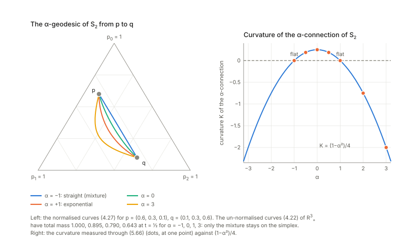
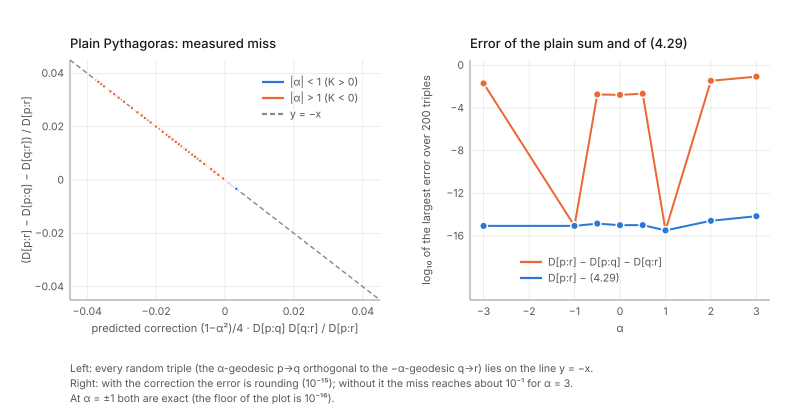
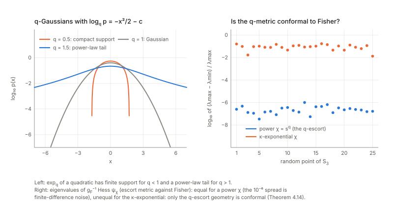

Notes for Chapter 4 of Amari, *Information Geometry and Its Applications* (Springer, 2016). The next section summarises the book's chapter in my own words. The sections after it are explorations that I asked for, one at a time, so they follow my questions and not the book's order. They keep the intuition, the figures and the derivations, and leave out numerical checks.

## What the chapter covers (a summary of the book's chapter)

The chapter asks how far two good properties can be had together. **Invariance** (from Chapter 3: merging or relabelling outcomes must not change the divergence) and **flatness** (from Chapter 1: the divergence is of Bregman type, so there are two dual straight-line structures, a Pythagorean theorem and clean projections) do not coincide in general. On the simplex of probabilities only KL has both; on the larger space of positive measures a whole family, the α-divergences, has both. The rest of the chapter explores that family and then generalises it. The sections in order:

- **§4.1 Invariant and flat divergence.** *§4.1.1* Theorem 4.1: on the simplex the KL divergence and its dual are the only decomposable (sum over outcomes) divergences that are both invariant and flat, except in the degenerate case of a single free parameter ($n=1$, where the simplex is just a curve and cannot be curved). The book proves it as a corollary of the next theorem, and remarks that later (Part II, and work of Jiao and co-authors) the decomposability assumption can be dropped. *§4.1.2* Theorem 4.2 (Amari 2009): on positive measures the decomposable, invariant, flat divergences are exactly the α-divergences. One direction: each α-divergence is a Bregman divergence once every positive number is re-expressed as a power of itself (the α-representation, which gives the straight coordinates) and as the dual power (the $-\alpha$-representation, the dual coordinates). The other direction: if an invariant (f-divergence) form is to be Bregman with coordinates acting entry by entry, the functional equation that results can only be solved by a power function. The case $\alpha=\pm1$ is the limit where the power becomes a logarithm. The simplex result then follows because "total mass 1" is a straight constraint only for $\alpha=\pm1$ and a curved one otherwise.
- **§4.2 α-geometry in $S_n$ and $\mathbb R^n_+$.** The geometry of this family and what it is good for.
  - *§4.2.1* On positive measures an α-geodesic is the curve that is straight in the α-representation, and a $-\alpha$-geodesic is straight in the dual one (Theorems 4.3 and 4.4): the Pythagorean and projection theorems of Chapter 1 hold unchanged, with the α-divergence in place of KL (which is the case $\alpha=-1$ in the book's convention).
  - *§4.2.2* On the simplex such a straight line leaves the simplex (the total mass drifts away from 1), so each point of it is rescaled to total mass 1; the resulting curve is called the α-geodesic of the simplex, and α-projection onto a submanifold of the simplex is defined with it.
  - *§4.2.3* Because the simplex sits inside a flat space as a curved submanifold, the Pythagorean theorem needs a correction term, a product of the two legs scaled by a factor that vanishes at $\alpha=\pm1$ (Theorem 4.5, due to Kurose; the book omits the proof and says it generalises a statement from spherical geometry, and that it holds for dual manifolds of constant curvature). From it follows Theorem 4.6: the point of a submanifold nearest to $p$ in α-divergence is found by the α-geodesic projection of $p$. The book points to independent component analysis as a use.
  - *§4.2.4* Apportionment: giving integer numbers of seats to states in proportion to population. One looks for a rational share vector (seats divided by total seats) closest to the population shares in α-divergence. The book reports that most existing allocation methods turn out to be minimisers of some α-divergence, differing only in the value of $\alpha$.
  - *§4.2.5* The α-mean of positive numbers: average in the α-representation and map back. Theorem 4.7 (Hardy and others, with Amari's proof): among all means built this way from an increasing function, the α-means are exactly the scale-free ones (scaling both numbers scales the mean by the same factor). The family contains the arithmetic mean ($\alpha=-1$), the geometric mean ($\alpha=1$), the harmonic mean ($\alpha=3$), the minimum and maximum (the limits $\alpha\to\pm\infty$, which the book links to fuzzy logic), and the mean decreases as $\alpha$ grows, so large $\alpha$ is "pessimistic" (leans on the smaller number) and small $\alpha$ "optimistic". A weighted version leads on to the next item.
  - *§4.2.6* α-families of distributions: mix several distributions with weights in the α-representation, then renormalise. This contains the ordinary mixture ($\alpha=-1$), the normalised weighted geometric mean, which is an exponential family ($\alpha=1$), and the max and min of the densities at the extremes. The weights serve as coordinates. Theorem 4.8: the whole simplex is such a family for every $\alpha$, since a probability vector is a mixture of the point masses; an α-geodesic of the simplex is a one-dimensional α-family.
  - *§4.2.7* Optimality of α-integration (Theorem 4.9): the weighted α-mixture of several distributions is exactly the distribution that minimises the weighted average α-divergence from them (the "centre of the cluster"). For positive measures no normalisation is needed.
  - *§4.2.8* An application to combining experts that each output a distribution of the answer for a given input (Theorem 4.10): the α-integration with input-dependent reliability weights is optimal for the α-risk; the book names the mixture of experts and the product of experts as the two ends of the scale (note that its text pairs them with $\alpha=1$ and $\alpha=-1$ the other way round from its own formulas, where $\alpha=-1$ is the ordinary linear mixture). Weights can be set from a teacher signal by a soft-max of minus the divergence from the teacher.
- **§4.3 Geometry of Tsallis $q$-entropy.** Physicists replace the logarithm and exponential by deformed versions with a parameter $q$, to describe systems with heavier tails than Boltzmann–Gibbs. The chapter's point is that this is the α-geometry in other clothing, and that it also leads to a second, escort-based flat structure.
  - *§4.3.1* The $q$-logarithm and $q$-exponential, the Tsallis entropy built from them (concave for $0<q\le1$, Shannon at $q=1$, close to Rényi), and the $q$-divergence, which equals the α-divergence with $\alpha=2q-1$. Being an f-divergence it is invariant with the Fisher metric, and not flat except at $q=0$ and $q=1$.
  - *§4.3.2* The $q$-exponential family (log replaced by $\log_q$ in the exponential-family formula) is nothing but the α-family with $\alpha=2q-1$. Examples: the $q$-Gaussian, which lives on a bounded range, and the simplex itself (Theorem 4.11, a restatement of Theorem 4.8).
  - *§4.3.3* The $q$-escort geometry. Lemma 4.1: the $q$-free energy is convex, so it can serve as a potential for a new dually flat structure on the simplex, with its own metric (not Fisher's) and Bregman divergence. The new dual coordinate is the escort distribution (raise to the power $q$ and renormalise; it pulls the distribution toward uniform when $q$ drops below 1). It is flat but not invariant. A $q$-Pythagorean theorem holds, and Theorem 4.12 (the $q$-max-entropy theorem) says that the distribution of maximal $q$-entropy under fixed escort expectations is the projection of the uniform distribution onto that constraint set, and these maximisers form a $q$-exponential family.
  - *§4.3.4* The same construction with a general deformation function in place of a power (the χ-logarithm, after Naudts): Theorem 4.13, the simplex is a χ-exponential family for every χ; there is a χ-escort distribution, a χ-divergence and a Pythagorean theorem. A remark mentions a related convex-function-based family of Vigelis and Cavalcante.
  - *§4.3.5* The $q$-escort metric is the Fisher metric multiplied by a positive factor that depends on the point (not a constant), which is a conformal change: lengths scale but angles, and so orthogonality, are kept. Theorem 4.14 (stated without proof): among all χ-escort geometries only the power ($q$) case has this conformal property, which singles out the Tsallis case. The book notes conformal changes also appear in asymptotic statistics and in improving kernels (Chapter 11).
- **§4.4 The $(u,v)$-divergence.** The idea: a choice of representation defines a geometry.
  - *§4.4.1* Any pair of increasing functions $u,v$ gives a decomposable dually flat divergence on positive measures, with $u$ and $v$ of the entries as the two dual coordinates; converting between them is done entry by entry, which is the practical appeal. The metric is diagonal and in suitable new coordinates simply Euclidean. Theorem 4.15: a decomposable dually flat divergence that is symmetric under permuting the entries is of this form. Examples: the $(\alpha,\beta)$-divergence (powers), the α-divergence as a special case, the β-divergence (flat even on the simplex because $u$ is linear), and the $U$-divergence.
  - *§4.4.2* The non-decomposable version: take an arbitrary invertible coordinate change $u$ and any convex potential; a pair $(u,v)$ gives a flat structure exactly when $v$ composed with the inverse of $u$ is the gradient of a convex function. For entry-by-entry pairs this always holds; in general the metric is not Euclidean.
- **§4.5 Invariant flat divergence in the manifold of positive-definite matrices.** A positive-definite matrix is viewed as a generalisation of a positive measure (its eigenvalues play the role of the entries), and the natural change of coordinates is a congruence $P\mapsto L^{\mathsf T}PL$. Zero-mean Gaussians correspond one-to-one to such matrices (quantum, Hermitian matrices are not treated).
  - *§4.5.1* The KL divergence between such Gaussians is a Bregman divergence in the matrix, and it is invariant under every change of basis (Theorem 4.16). The book states that it is flat and invariant, and does not prove uniqueness here.
  - *§4.5.2* If one asks only for invariance under rotations, the potential must be a function of the eigenvalues; with an entry-by-entry (additive) form this gives Theorem 4.17 and the examples of the Frobenius (Euclidean), log-det (the Gaussian KL) and von Neumann divergences. Theorem 4.18 then extends the $(u,v)$ construction to matrices, with the $(\alpha,\beta)$, α and β matrix divergences as special cases.
  - *§4.5.3* Divergences invariant under every change of basis but not flat: functions of the eigenvalues of $PQ^{-1}$, in particular the $(\alpha,\beta)$-log-det family (with limits at $\alpha$ or $\beta$ zero, and symmetric when $\alpha=\beta$). Theorem 4.19 (proof omitted): all of them induce the same Riemannian metric, although their dual connections differ.
- **§4.6 Miscellaneous divergences.** A short catalogue of divergences that are mostly neither invariant nor flat.
  - *§4.6.1* The γ-divergence: unchanged when either distribution is rescaled by a positive constant, extremely robust to outliers in estimation, and also defined for matrices.
  - *§4.6.2* Other two-parameter divergences of Zhang (whose geometry is exactly the α-geometry) and of Furuichi, and Zhang's α-divergence built from a general convex function.
  - *§4.6.3* The Burbea–Rao divergence (the gap in Jensen's inequality for a convex function) and its special case the Jensen–Shannon divergence (written with KL divergences to the midpoint); an asymmetric α-version also exists. Not flat in general.
  - *§4.6.4* The $(\rho,\tau)$-structure of Zhang (two free representations; the same as the $(u,v)$-structure) and the $(F,G,H)$-structure of Harsha and Moosath, shown by Zhang to be equivalent to it. Theorem 4.20 (proof omitted) says when two connections built from representations $F$ and $H$ and a weight function $G$ are dual. The associated $\alpha$-$(\rho,\tau)$ divergence is neither Bregman nor invariant in general but covers many divergences on the simplex.
- **Closing remarks.** The book stresses that in an α-family the Pythagorean and projection theorems hold although the space is not dually flat, which is unusual for a general divergence, and that the Tsallis geometry coinciding with the α-geometry is a happy coincidence. It ends with guidance on choosing a divergence: an invariant one gives efficient estimators but is not robust, robust ones such as γ exist, and decomposable ones are popular because converting between the two coordinate systems is easy.

## Links

- **[Interactive companion](figures/interactive.html)**: eight widgets. (1) The normalised α-geodesic of the three-outcome simplex (drag $p$ and $q$), the mass that the un-normalised curve loses, and its affine parameter. (2) Kurose's Pythagorean identity with its correction term, for any $\alpha$ and step. (3) The α-mean and the scale-free test of Theorem 4.7. (4) Dividing seats: the $D_\alpha$-optimal allocation and the classical divisor rules. (5) α-integration of three distributions and the table of excess risks. (6) The Tsallis escort metric compared with the Fisher metric. (7) The $(u,v)$-divergence, with the metric (4.130) and the $\beta$-divergence (4.140) as printed next to their corrections. (8) Positive-definite matrices before and after a change of basis.
- The book: Amari, *Information Geometry and Its Applications* (Springer, 2016), DOI [10.1007/978-4-431-55978-8](https://doi.org/10.1007/978-4-431-55978-8). These notes cover Chapter 4 only; equation numbers such as (4.29) refer to the book, and so do the few numbers (3.xx) and (6.xx) borrowed from Chapters 3 and 6.
  No text of the book is reproduced here; everything is restated and re-derived.
- Neighbouring chapters: **[Chapter 3: invariant geometry](../ch03-invariant-geometry/index.html)** (the $f$-divergences, the Fisher metric as the only invariant one, the $\alpha$-divergence (3.96) used throughout), **[Chapter 1: dually flat structure](../ch01-dually-flat-structure/index.html)** (Bregman divergences, Pythagoras, projection), **[Chapter 5: elements of differential geometry](../ch05-elements-of-differential-geometry/index.html)** (curvature, the formula (5.66) used below) and **[Chapter 6: dual connections](../ch06-dual-connections/index.html)** (the metric and connections a divergence induces, (6.22)–(6.24), which this chapter takes for granted).
  Background on the annotations site: **[The Fisher information matrix](https://msrepo.github.io/theory_inclined_papers_with_annotations/fisher-information/)**.

## In one paragraph

Chapter 1 gave a recipe for geometry from a convex function (a **Bregman divergence**, "flat": it has two dual straight-line structures, a Pythagorean theorem and clean projections). Chapter 3 gave a criterion for a *reasonable* divergence on probabilities (**invariance**: merging or relabelling outcomes must not change it, which singles out the $f$-divergences and the Fisher metric). The two do not agree in general, and this chapter asks how far they do. On the probability simplex only the KL divergence and its dual are both (Theorem 4.1). On the cone of **positive measures** (vectors of positive numbers, not required to add to 1) the whole **α-divergence** family is both (Theorem 4.2), and the simplex then inherits a curved geometry of constant curvature $(1-\alpha^2)/4$ in which Pythagoras survives with a correction term (Kurose). The same *representation* $m\mapsto m^{(1-\alpha)/2}$ yields the α-mean, the optimal way to merge distributions, and (a nice surprise) the divisor rules used to apportion parliamentary seats.
Tsallis $q$-entropy is the α-geometry with $\alpha=2q-1$, and its "escort distribution" gives a second, *flat* but non-invariant structure on the same simplex whose metric is the Fisher metric up to a scalar factor. The chapter then replaces power functions by general pairs $(u,v)$ (flat divergences on positive measures), carries the construction to **positive-definite matrices** (where the flat divergence that is invariant under every change of basis is the Gaussian KL; the book's formula for it is in fact twice the KL) and ends with a catalogue of other divergences.
Re-deriving the statements by routes the book does not use (rank arguments, exact curvature, direct computation of the induced connections), many printed formulas turn out to be wrong in a sign, a factor or a variable; a few of the book's claims become sharper (the α-geodesic's parameter is not affine; the log-det divergences differ only through $\alpha-\beta$; the "(α,β)-divergence" of Zhang is the $\alpha\beta$-geometry); and every theorem I could test stands.

## The spine of the argument

1. **Uniqueness.** On the simplex only KL and its dual are decomposable, invariant and flat (Theorem 4.1); on positive measures $\mathbb R^n_+$ exactly the α-divergences are (Theorem 4.2). The reason: flatness of a decomposable divergence forces a power representation, and the simplex $\sum m_i=1$ is flat inside it only for $\alpha=\pm1$ (§4.1).
2. **Geometry of $\mathbb R^n_+$.** α-geodesics are straight in $\theta=m^{(1-\alpha)/2}$, $-\alpha$-geodesics straight in $\eta=m^{(1+\alpha)/2}$; the Pythagorean and projection theorems of Chapter 1 hold unchanged (§4.2.1).
3. **Geometry of $S_n$.** Normalising the α-geodesic gives the geodesic of the induced connection; the Pythagorean identity acquires the term $-\tfrac{1-\alpha^2}4D[p:q]D[q:r]$ (Kurose), because the simplex has constant curvature $(1-\alpha^2)/4$ (§4.2.2–4.2.3).
4. **Representation as a tool.** The α-mean (the only scale-free quasi-arithmetic means), the α-integration (the optimal merge under the α-risk), and apportionment (the divisor rules minimise $D_\alpha$) (§4.2.4–4.2.8).
5. **Tsallis.** $\log_q$ is the α-representation with $\alpha=2q-1$; a second potential $\psi_q=-\log_q p_0$ on the same simplex is flat, not invariant, and conformal to Fisher by the factor $q/h_q$ (the book prints $1/h_q$); this conformality is special to power deformations (Theorem 4.14) (§4.3).
6. **$(u,v)$-divergences.** Any increasing pair $u,v$ defines a decomposable dually flat divergence on $\mathbb R^n_+$ with $\theta=u(m)$, $\eta=v(m)$ (§4.4).
7. **Matrices.** The KL divergence $\operatorname{tr}(PQ^{-1})-\log\det(PQ^{-1})-n$ is flat and invariant under all of $Gl(n)$; $(u,v)$ gives rotation-invariant flat divergences; the $(\alpha,\beta)$-log-det family is $Gl(n)$-invariant, shares one metric, and its connections depend only on $\alpha-\beta$ (§4.5).
8. **Catalogue.** γ-, Zhang's, Jensen–Shannon, Burbea–Rao, $(F,G,H)$: properties, and several misprints (§4.6).

## Setup and notation

| Symbol | Meaning | In the running examples |
|---|---|---|
| $S_n$, $\mathbb R^n_+$ | distributions on $n+1$ outcomes; positive vectors $m=(m_i)$ | $S_2$ is the three-outcome simplex; $\mathbb R^3_+$ |
| $D_\alpha[m:n]$ | $\frac4{1-\alpha^2}\sum\{\frac{1-\alpha}2m_i+\frac{1+\alpha}2n_i-m_i^{(1-\alpha)/2}n_i^{(1+\alpha)/2}\}$ (3.96); $\alpha=-1$ is $\mathrm{KL}[m:n]$, $\alpha=1$ its dual; $D_\alpha[m:n]=D_{-\alpha}[n:m]$ | $\alpha=3$ is $\chi^2$ |
| $h_\alpha(m)$ | α-representation $m^{(1-\alpha)/2}$ ($\log m$ at $\alpha=1$) | |
| $\theta,\eta$ | $\theta=\frac2{1-\alpha}m^{(1-\alpha)/2}$, $\eta=\frac2{1+\alpha}m^{(1+\alpha)/2}$ (with the constants of (4.137)) | $\chi^2$: $\theta=-1/m$, $\eta=m^2/2$ |
| $\Gamma^{(\alpha)}$, $T$, $K$ | α-connection $\Gamma^{(0)}-\frac\alpha2T$ (6.38); cubic tensor $T_{ijk}=\mathbb E[\partial_i l\,\partial_jl\,\partial_kl]$; curvature $R_{ijkl}=K(g_{jk}g_{il}-g_{ik}g_{jl})$ in the convention of Chapter 5 | $K=(1-\alpha^2)/4$ |
| $\log_q$, $\exp_q$, $h_q$ | $\log_q u=\frac{u^{1-q}-1}{1-q}$; $h_q(p)=\sum p_i^q$; escort $\tilde p_i=p_i^q/h_q$ | |
| $\psi_q$, $\varphi_q$, $\tilde D_q$ | $q$-free energy $-\log_qp_0$ in $\theta^i=\frac{p_i^{1-q}-p_0^{1-q}}{1-q}$; its Legendre dual; the Bregman divergence (4.95) | |
| $\chi$, $u$, $v$ | $u=\log_\chi=\int_1^s dt/\chi$, $v=\exp_\chi=u^{-1}$ (4.102)–(4.105) | $\chi=s^q$, $\kappa$-exponential, $s+s^2$ |
| $D_{u,v}$ | $\sum[\int_0^{m_i}vu'+\int_0^{m'_i}uv'-u(m_i)v(m'_i)]$ (4.127) | $(\alpha,\beta)$, α, β, $U$ |
| $P,Q$, $\Lambda$ | positive-definite matrices; $\Lambda=\operatorname{diag}(\lambda_i)$, $\lambda_i$ the eigenvalues of $PQ^{-1}$ | |
| $Gl(n)$, $O(n)$ | congruences $P\mapsto L^{\mathsf T}PL$; rotations | |

**Conventions from Chapter 6 that the chapter uses without saying so.** A divergence $D[\xi:\xi']$ induces a metric $g_{ij}=-\partial_i\partial'_jD$ and two connections with $\Gamma_{ijk}=-\partial_i\partial_j\partial'_kD$, $\Gamma^*_{ijk}=-\partial'_i\partial'_j\partial_kD$ at the diagonal (6.22)–(6.24); the difference is the cubic tensor. For an $f$-divergence it is $g=$ Fisher and $\Gamma^*-\Gamma=\alpha T$ with $\alpha=2f'''(1)+3$ (6.36), and the α-connection is flat in the α-representation (e-flat at $\alpha=1$, m-flat at $\alpha=-1$).
**Running examples.** The simplex $S_2$ of three outcomes in the chart $\xi=(p_1,p_2)$ (where the mixture connection is flat) for §1–§2 and §6; three positive numbers for the Bregman statements; a toy population sharing a few seats among four states; a four-outcome distribution for the escort geometry; and for §5 pairs of $2\times2$ positive-definite matrices with a change of basis.

## 1. Invariant and flat divergence (§4.1)

**In plain words.** A divergence measures how far apart two distributions are. Two properties are wanted. *Invariance*: the divergence must not change when information is merely repackaged (relabel the outcomes, or split one outcome into two sub-outcomes in the same ratio in both distributions). For a decomposable divergence (a sum over outcomes) that criterion of Chapter 3 forces $D$ to be an **$f$-divergence** $\sum m_if(n_i/m_i)$ and the metric to be Fisher's. *Flatness*: $D$ must be a **Bregman divergence**, "a convex function minus its tangent", so that coordinates $\theta$ (in which straight lines are one kind of geodesic) and $\eta=\nabla\psi(\theta)$ (the other kind) exist and Pythagoras and projection work. KL has both. The question is whether anything else does. The answer is no on the simplex and yes on positive measures, where the winners are the α-divergences.

### 1.1 The α-divergence is Bregman on $\mathbb R^n_+$ (Theorem 4.2, "if")

**In plain words.** Re-express each positive number $m$ in two ways, $\theta=u(m)$ and $\eta=v(m)$, with $u(m)=\frac2{1-\alpha}m^{(1-\alpha)/2}$ and $v(m)=\frac2{1+\alpha}m^{(1+\alpha)/2}$; then $D_\alpha$ is exactly "$\psi(\theta)$ plus its Legendre dual minus $\theta\eta$" for the convex function $\psi(\theta)=\frac2{1+\alpha}m$ written in the variable $\theta$ (and $\varphi(\eta)=\frac2{1-\alpha}m$). *Example:* $\alpha=3$: $\theta=-1/m$, $\eta=m^2/2$, $\psi=m/2$ and $D_3[m:n]=\sum(n_i-m_i)^2/(2m_i)$, the $\chi^2$ divergence.
**Formally.** $\psi''(\theta)=v'(m)/u'(m)=m^\alpha>0$ for *every* real $\alpha$ (4.123), so the potential is convex whatever $\alpha$ is.
*Two slips.* (i) The book writes the representation without the constants, $\theta=m^{(1-\alpha)/2}$ (4.1), and claims that the Bregman divergence (4.6) *is* $D_\alpha$. It is $\tfrac{1-\alpha^2}4D_\alpha$, so for $\lvert\alpha\rvert>1$ the printed "divergence" is negative. The constants of (4.137) repair this. (ii) (4.3) says $\psi_\alpha$ is convex "for $\alpha>-1$"; with the printed (unscaled) $\psi_\alpha(\theta)=\frac{1-\alpha}2\theta^{2/(1-\alpha)}$ the second derivative is $\frac{1+\alpha}{1-\alpha}\theta^{2/(1-\alpha)-2}$, which is positive only for $-1<\alpha<1$. (iii) The standard $f$ of (4.17) has $f(1)=f'(1)=0$ and $f''(1)=1$.

### 1.2 The converse: why only powers (Theorem 4.2, "only if")

**In plain words.** If $D[m:n]=\sum m_if(n_i/m_i)$ is Bregman, with dual coordinates $\theta(m)$ and $\eta(n)$, then the *cross term* $-\theta(m)\eta(n)$ is a product of a function of $m$ and a function of $n$; the other two terms depend on only one argument. Differentiate once in $m$ and once in $n$ and everything but the product disappears: $\partial_m\partial_n D=-\theta'(m)\eta'(n)$, a **rank-one kernel**. For $D=mf(n/m)$ the kernel is $-(n/m^2)f''(n/m)$, and it is rank one exactly when $f''$ is a power, which gives $f\propto u^{(1+\alpha)/2}$ plus a linear function (and $-\log u$, $u\log u$ at the ends).
*Check (by a route the book does not take).* Evaluate $-(n/m^2)f''(n/m)$ on a grid and ask whether it is a rank-one kernel. It is for $\alpha=0$, for $\chi^2$, for KL and for dual KL. For the **Jensen–Shannon** divergence (an $f$-divergence, hence invariant) and for the triangular discrimination $(u-1)^2/(u+1)$ it is not, so they are not Bregman in any coordinates.
*A gap in the printed proof.* It equates $mf(n/m)$ with a product $k(m)k^*(n)$ (4.10). That holds for the *non-standard* $f=-u^{(1+\alpha)/2}$ (at $\alpha=0$ the kernel is $-\sqrt{mn}$, a product) but not for the standard $f$ of (4.17): $4(\frac m2+\frac n2-\sqrt{mn})$ is not a product of a function of $m$ and a function of $n$, because standardising adds terms in $m$ alone and in $n$ alone. The argument has to be run on the mixed derivative, as above, which also removes the need for the unstated assumption that those one-variable terms vanish; the conclusion (a power) is right. Also (4.13), $h=\log f'$, needs $f'>0$, but $f=-u^{(1+\alpha)/2}$ has $f'<0$ for $\alpha>-1$ ($\log\lvert f'\rvert$ is meant). And (4.8) assumes the affine coordinates are componentwise functions of $m_i$, which is a real restriction I could not test.

### 1.3 Why the simplex is different (Theorem 4.1)

**In plain words.** The simplex $\sum m_i=1$ sits inside the cone $\mathbb R^{n+1}_+$. A Bregman divergence restricted to a subset is certainly a flat (Bregman) divergence there when the subset is an affine subspace in the affine coordinates. In $\theta=m^{(1-\alpha)/2}$ the simplex is $\sum\theta_i^{2/(1-\alpha)}=1$: a plane for $\alpha=-1$, the round sphere $\sum\theta_i^2=1$ for $\alpha=0$; in $\eta$ it is linear for $\alpha=+1$ (and (4.20) sums to $m$ where $n$ is meant). The α-geodesic (4.22) of the cone between $p$ and $q$ leaves the simplex: its total mass is not 1 along the path, except for $\alpha=-1$ where the curve is a straight mixture.
**This is not yet a proof**: a curved hypersurface of a flat space may have a flat induced geometry (Chapter 5's cylinder). So I computed the curvature of the α-connection of $S_2$ exactly, from (5.66). It always has the form $R_{ijkl}=K(g_{jk}g_{il}-g_{ik}g_{jl})$ with
$$K=\frac{1-\alpha^2}4,$$
a **constant**, zero exactly at $\alpha=\pm1$, positive for $\lvert\alpha\rvert<1$ and negative for $\lvert\alpha\rvert>1$; at $\alpha=0$ the simplex is the octant of the sphere of radius 2 (Fisher metric = $4\times$ the round metric of $\sqrt p$).
*The induced connection.* In the mixture chart $\xi=(p_1,p_2)$, $g_{ij}=\sum_x\partial_ip_x\partial_jp_x/p_x$ and $T_{ijk}=\sum_x\partial_ip_x\partial_jp_x\partial_kp_x/p_x^2$, and differentiating $p^{(1-\alpha)/2}q^{(1+\alpha)/2}$ gives exactly $\partial_i\partial_j\partial'_kD_\alpha=\frac{1+\alpha}2T_{ijk}$, so $\Gamma_{ijk}=-\frac{1+\alpha}2T_{ijk}=\Gamma^{(0)}_{ijk}-\frac\alpha2T_{ijk}$ (with $\Gamma^{(0)}=-\frac12T$ in this chart, because the mixture connection $\Gamma^{(-1)}$ vanishes there): $D_\alpha$ induces the α-connection, and $\Gamma^*-\Gamma=\alpha T$.
*A different proof of Theorem 4.1 (not in the book).* If $D$ were Bregman in *any* coordinates, $\partial_{\xi_i}\partial_{\xi'_j}D=-\sum_k\theta^k_{,i}(x)\eta_{k,j}(y)$ would have rank $\le n$ as a kernel. Stacking this kernel over many points of $S_2$ and looking at its singular values: for $\alpha=\pm1$ the rank is 2, as it must be for a Bregman divergence of a two-dimensional manifold, but for every other $\alpha$ tried it is 3. So no $\alpha\neq\pm1$ gives a Bregman divergence of $S_2$, with no appeal to decomposability. On $S_1$ the same test separates $\alpha=\pm1$ from the rest, so the Remark's "an invariant Bregman divergence is KL for any $n$" holds for $n=1$ too (what is special at $n=1$ is only the characterisation of invariant *decomposable* divergences by $f$).

## 2. α-geometry in $S_n$ and $\mathbb R^n_+$ (§4.2)

### 2.1 Geodesics, Pythagoras and projection in $\mathbb R^n_+$ (Theorems 4.3, 4.4)

**In plain words.** Chapter 1's theory applies verbatim once $\theta$ and $\eta$ are the two representations: the **α-geodesic** between $m_1,m_2$ is the curve whose α-representation is the straight line, $m_i(t)^{(1-\alpha)/2}=(1-t)m_{1i}^{(1-\alpha)/2}+tm_{2i}^{(1-\alpha)/2}$ (4.22), the $-\alpha$-geodesic is straight in $\eta$ (4.24). When the α-geodesic $m\to n$ meets the $-\alpha$-geodesic $n\to k$ at a right angle (in terms of coordinates: $(\theta_n-\theta_m)\cdot(\eta_n-\eta_k)=0$) then $D_\alpha[m:k]=D_\alpha[m:n]+D_\alpha[n:k]$, and the minimiser of $D_\alpha[m:\cdot]$ over a $(-\alpha)$-flat submanifold is the α-projection.
*Checks.* The Pythagorean identity is algebraic: $(\theta_n-\theta_m)\cdot(\eta_n-\eta_k)=D[m:n]+D[n:k]-D[m:k]$ for any Bregman divergence, so by itself it only confirms the constants. The independent route is orthogonality in the Riemannian sense: with the metric $\operatorname{diag}(1/m_i)$ of $\mathbb R^n_+$ and the tangents at $n$ of the explicit curves (4.22) and (4.24), the two curves are $g$-orthogonal exactly when the dual-coordinate product vanishes, which is (4.25). For the projection, the minimiser of $D_\alpha[m:\cdot]$ over a flat submanifold is the point where the α-geodesic from $m$ meets it orthogonally, and it is unique, as the theorem asks, because of convexity.

### 2.2 The α-geodesic of $S_n$, and what its parameter is (4.27)

**In plain words.** On the simplex the straight line in $\theta$ is not allowed (it leaves the simplex), so the book rescales each point of it radially to total mass 1 (4.27) and calls the result the α-geodesic of $S_n$. Is that really the geodesic of the connection that $D_\alpha$ induces on the simplex? As a *set*, yes; as a parametrised curve, no.
**Why.** Lowering the geodesic equation of $\Gamma^{(\alpha)}$ with $L=p^{(1-\alpha)/2}$ gives $\sum_xp_x^\alpha\,\partial_lL\,\ddot L=0$ for all $l$, that is: the acceleration $\ddot L$ is parallel to $L$ itself. A curve in the plane through the origin spanned by $L(p)$ and $L(q)$ can be reparametrised to have this property, and the normalised line is such a curve: the geodesic's *affine* parameter is $\tau(s)=\int_0^sc^2\big/\int_0^1c^2$, with $c(s)$ the normalising constant, not the $s$ of (4.27) (the two agree for $\alpha=\pm1$, where $c\equiv1$ or the normalisation is a mere shift of $\log p$; for every other $\alpha$ the constant $c$ varies along the curve and they differ).
*Check.* Integrating the geodesic equation numerically from $p$ with the initial velocity of the normalised path reaches $q$ and stays in the plane of $L(p),L(q)$, so the path is the right *set*; but a point of the path at parameter $s$ is reached at affine time $\tau(s)$, not $s$. The difference $\tau(s)-s$ is zero for $\alpha=\pm1$ and small but nonzero otherwise. Theorems 4.5 and 4.6 only use the set, so nothing breaks, but "the α-geodesic with parameter $t$" is not a geodesic in the affine sense. The first widget shows $\tau(s)$ against $s$.

### 2.3 Kurose's Pythagorean theorem and the projection theorem (Theorems 4.5, 4.6)

**In plain words.** On a sphere, a right spherical triangle satisfies $\cos c=\cos a\cos b$; with $D=1-\cos$ for each side this reads $D_c=D_a+D_b-D_aD_b$. The simplex *is* a sphere at $\alpha=0$ (radius 2), and the α-version for general $\alpha$ replaces the factor 1 by the curvature $K=\frac{1-\alpha^2}4$ (in the normalisation of $D_\alpha$):
$$D_\alpha[p:r]=D_\alpha[p:q]+D_\alpha[q:r]-\frac{1-\alpha^2}4\,D_\alpha[p:q]\,D_\alpha[q:r]\qquad(4.29),$$
when the α-geodesic $p\to q$ is orthogonal to the $-\alpha$-geodesic $q\to r$. The book states it without proof (it is due to Kurose and holds for any dual manifold of constant curvature).
*Reading the correction.* The subtracted term has the sign of the curvature: it shortens $D[p:r]$ for $\lvert\alpha\rvert<1$, where the simplex curves like a sphere, and lengthens it beyond, like a saddle; at $\alpha=\pm1$ the simplex is flat and the plain Pythagorean identity of Chapter 1 is exact. At $\alpha=0$ it is the spherical law of cosines for a right triangle on the sphere of radius 2, with $D_0=4(1-\cos\varphi)$ and $\varphi$ the angle between $2\sqrt p$ and $2\sqrt q$. Orthogonality here means Fisher-orthogonality at $q$ of the tangents of the α-geodesic $p\to q$ and the $-\alpha$-geodesic $q\to r$.
*Theorem 4.6 (projection).* The α-projection of $p$ onto a submanifold (the foot of the α-geodesic orthogonal to it) minimises $D_\alpha[p:\cdot]$, as I confirmed on a straight segment of the simplex. The book's closing Remark says this is special to α-families: for the (symmetric, α=0 geometry) Jensen–Shannon divergence the minimiser over the same segment is close to, but not exactly, the foot of the Levi-Civita perpendicular. A sharper example is in §5.3.

### 2.4 Apportionment (§4.2.4)

**In plain words.** A country must hand out $n$ seats to states of different populations; the shares $n_i/n$ have to be fractions with denominator $n$, so they cannot equal the population shares $p_i$. Choose the integers $n_i$ so that $q_i=n_i/n$ is closest to $p$ in $D_\alpha[p:q]$. The book says (without detail) that most known methods are minimisers of some $D_\alpha$ and differ only in $\alpha$. Here is the working.
**Derivation.** $D_\alpha[p:q]$ is a sum over states of a function of $n_i$ alone and that function is convex in $n_i$, so an optimal allocation is built by giving each next seat to the state with the cheapest marginal cost. In terms of $a=\frac{1-\alpha}2$, $b=\frac{1+\alpha}2$ that is "next seat to the state maximising $p_i/d_\alpha(n_i)$" with the **divisor**
$$d_\alpha(k)=\big\lvert(k+1)^b-k^b\big\rvert^{-1/a}.$$
For $\alpha=3$ this is $d=2k+1$ (Webster / Sainte-Laguë, $d\propto k+\frac12$), for $\alpha=-3$ it is $\sqrt{k(k+1)}$ (Hill–Huntington), for $\alpha=-1$ ($\mathrm{KL}[p:q]$) the logarithmic mean $1/\log(1+1/k)$ (Theil–Schrage), and $d_\alpha\to k+1$ (Jefferson) as $\alpha\to+\infty$, $d_\alpha\to k$ (Adams) as $\alpha\to-\infty$. For $\alpha\le-1$ the divisor vanishes at $k=0$: every state gets a seat. (What I derived is the divisor; the rule names are the usual ones as I remember them, and I did not check the name "Theil–Schrage" for the logarithmic-mean rule against a source.)
*Checks.* The closed forms $d_3(k)=2k+1$, $d_{-3}(k)=\sqrt{k(k+1)}$ and $d_{-1}(k)=1/\log(1+1/k)$ agree with the general formula (up to the constant factors that do not matter). Greedy allocation with $d_\alpha$ agrees with brute-force enumeration of all allocations of a small number of seats among a few states, for random populations and several $\alpha$. On a toy population of four states sharing nine seats, the optimal allocation changes only a few times as $\alpha$ runs over the whole real line, and the five classical rules, run from their own divisor sequences with no divergence involved, give exactly the allocations of the matching $\alpha$ (Adams at $-\infty$, Hill at $-3$, Theil–Schrage at $-1$, Webster at $3$, Jefferson at $+\infty$). Dean's rule (harmonic mean of $k,k+1$) is not of the form $d_\alpha$: "most", not "all", is right.

### 2.5 The α-mean (§4.2.5)

**In plain words.** To average two positive numbers $x,y$: re-express them as $x^{(1-\alpha)/2},y^{(1-\alpha)/2}$, average arithmetically, undo. That is the **α-mean** $m_\alpha(x,y)=\{\frac12(x^{(1-\alpha)/2}+y^{(1-\alpha)/2})\}^{2/(1-\alpha)}$ (4.33). It contains the arithmetic mean ($\alpha=-1$), the geometric mean ($\alpha=1$, as a limit), the harmonic mean ($\alpha=3$), the maximum ($-\infty$) and the minimum ($+\infty$), and it decreases with $\alpha$ (4.47). At $\alpha=0$ it is $\frac14(\sqrt x+\sqrt y)^2=\frac12(\frac{x+y}2+\sqrt{xy})$, halfway between the arithmetic and geometric means. The book's Fig. 4.1 plots the means of two numbers against $\alpha$.
**Theorem 4.7** says these are the only *scale-free* means $m(cx,cy)=c\,m(x,y)$ among quasi-arithmetic means $h^{-1}\{\frac12(h(x)+h(y))\}$. I followed the proof (4.36)–(4.46) line by line and it is correct: differentiating $h(cm)=\frac12(h(cx)+h(cy))$ in $x$ forces $h'(cx)/h'(x)$ to depend on $c$ only, hence $h'$ is a power.
*Checks.* The α-mean is scale-free, $m_\alpha(cx,cy)=c\,m_\alpha(x,y)$, while a quasi-arithmetic mean built from a non-power $h$ such as $h(x)=x+x^2$ is not, and $m_\alpha(x,y)$ is strictly decreasing in $\alpha$. *A small slip of hypotheses*: the text before (4.34) asks $h$ to be increasing with $h(0)=0$, which excludes $\alpha\ge1$ ($\log$ has $h(0)=-\infty$ and the powers with $\alpha>1$ are decreasing); the proof uses neither.

### 2.6 α-families, α-integration and experts (§4.2.6–4.2.8)

**In plain words.** The α-mean of two numbers extends to an **α-mixture** of distributions: average $p_i(x)^{(1-\alpha)/2}$ with weights $w_i$, undo, renormalise (4.51), (4.55). At $\alpha=-1$ it is the ordinary mixture $\sum w_ip_i$, at $\alpha=+1$ the normalised geometric mean (an exponential family in $w$), at $\alpha\to-\infty$ the pointwise maximum ("optimistic"), at $+\infty$ the minimum ("pessimistic"). Theorem 4.8 ($S_n$ is an α-family for every $\alpha$) is a one-line fact because the point-mass indicators $\delta_i(x)$ have disjoint supports. **Theorem 4.9**: this α-integration is the distribution $q$ that minimises the weighted risk $R_\alpha[q]=\sum w_iD_\alpha[p_i:q]$.
*Example.* Take several distributions on the same outcomes with weights. With $\alpha=-1$ the integration is the ordinary weighted mixture $\sum w_ip_i$, with $\alpha=+1$ the normalised weighted geometric mean, and $\alpha=0$ lies between them (it averages the square roots and renormalises the square).
*Checks.* Plugging the $\alpha'$-integration into the $\alpha$-risk always gives a risk at least as large as plugging in the $\alpha$-integration (so every entry of the table of excess risks in the fifth widget is non-negative and the diagonal is zero), and random perturbations of $q_\alpha$ never lower the risk. The proof is a stationarity argument; it is complete because $q\mapsto D_\alpha[p:q]$ is convex for every $\alpha$ (its second derivative is $p^{(1-\alpha)/2}q^{(\alpha-3)/2}>0$), which the book does not say.
*Two slips.* (i) In (4.65) the variation of $D_\alpha[p_i:q]$ is printed with $q^{-(1+\alpha)/2}$; the derivative is $\frac2{1-\alpha}(1-(p/q)^{(1-\alpha)/2})$, whose $q$-dependence is $q^{-(1-\alpha)/2}$, which is what (4.66) uses (a numerical derivative agrees with the corrected exponent; the printed exponent agrees with it only at $\alpha=0$). (ii) After Theorem 4.10 the text says the $\alpha=1$ machine is the *mixture* of experts and the $\alpha=-1$ machine the *product* of experts. By (4.56)–(4.57) it is the other way round: $\alpha=-1$ is $\sum w_ip_i$ and $\alpha=+1$ the normalised product $\prod p_i^{w_i}$.

## 3. Geometry of Tsallis $q$-entropy (§4.3)

### 3.1 The $q$-logarithm and the sign of (4.77)

**In plain words.** Replace $\log$ by $\log_q u=\frac{u^{1-q}-1}{1-q}$ (and $\exp$ by its inverse). That is the α-representation $u^{(1-\alpha)/2}$ with $\alpha=2q-1$, up to a scale and a constant, so everything in §2 is the $q$-geometry. The Tsallis entropy $H_q(p)=\sum p_i\log_q(1/p_i)=\frac{\sum p_i^q-1}{1-q}$ is concave for **every** $q>0$; the book says $0<q\le1$, which is true but not the whole range.
**Slip in (4.77).** The $q$-divergence is written $D_q[p:r]=\mathbb E_p[\log_q(r/p)]=\frac1{1-q}(1-\sum p_i^qr_i^{1-q})$. The expectation of a log-ratio is *minus* a divergence (at $q=1$ it is $-\mathrm{KL}[p:r]\le0$), so the right-hand side has the opposite sign: $D_q=-\mathbb E_p[\log_q(r/p)]$. And "the same as the α-divergence with $\alpha=2q-1$" is true only after exchanging the two arguments and including a factor: $D_q[p:r]=q\,D_{2q-1}[r:p]=q\,D_{1-2q}[p:r]$. The limit cases $q=0,1$ are unaffected.

### 3.2 $S_n$ as a $q$-family, and the $q$-Gaussian (Theorem 4.11, (4.81))

**In plain words.** A $q$-exponential family replaces $p=\exp(\theta\cdot x-\psi)$ by $p=\exp_q(\theta\cdot x-\psi_q)$. The simplex is one for every $q$: write $\theta^i=\frac{p_i^{1-q}-p_0^{1-q}}{1-q}$ and $\psi_q=-\log_qp_0$. Indeed $\log_qp_x=\theta\cdot x-\psi_q$ for every outcome $x$, and $p$ is recovered from $\theta$.
**The $q$-Gaussian (4.81)–(4.82)** is $\exp_q$ of a quadratic. Two things the text leaves out. (i) The displayed $\log_qp=-(x-\mu)^2/(2\sigma^2)$ is not normalised, even at $q=1$ (there it lacks $\log\sqrt{2\pi}\sigma$): the $\psi_q(\theta)$ that satisfies (4.80) is not the simple $\mu^2/(2\sigma^2)$ of the printed middle expression but a normalising constant that depends on $q$. (ii) The values of $x$ are confined to a finite range only for $q<1$ (compact support); for $q>1$, the case of Tsallis physics, the tails are power laws, far heavier than the Gaussian's.

### 3.3 The escort geometry (§4.3.3)

**In plain words.** The simplex carries a *second* flat structure. Use the same coordinates $\theta^i=\frac{p_i^{1-q}-p_0^{1-q}}{1-q}$ but the potential $\psi_q(\theta)=-\log_qp_0$, which is convex (Lemma 4.1). Its gradient is the **escort distribution**, $\eta_i=\partial_i\psi_q=p_i^q/h_q(p)$ with $h_q=\sum p_i^q$: raise to the power $q$ and renormalise, which for $q<1$ pulls $p$ towards the uniform distribution. The dual potential is $\varphi_q=\frac1{1-q}(\frac1{h_q}-1)$ (exactly, with no extra scale or constant as "except for a scale and constant" suggests), and the Bregman divergence is $\tilde D_q[p:r]=\frac1{(1-q)h_q[r]}(1-\sum p_i^{1-q}r_i^q)$ (4.95), which equals $q\,D_{2q-1}[p:r]/h_q[r]$.
**The metric and a slip.** The Hessian of $\psi_q$ is the $q$-metric (4.92). The book says it equals the Fisher metric times $\sigma=1/h_q$ (4.116)–(4.117). With (4.91) as printed the factor is $q/h_q$: differentiating $\psi_q$ and dividing entrywise by the Fisher metric in the same $\theta$-chart gives the same constant in every entry, and that constant is $q/h_q$, not $1/h_q$. Conformal means angles are kept and squared lengths scale by $q/h_q$.
**Not invariant.** The escort divergence cannot be invariant (Theorem 4.1) and is not: merging two outcomes of $S_3$ can *increase* it, which an invariant divergence never does (the α-divergence with $\alpha=2q-1$ and (4.77) never increase). It is nonetheless a Bregman divergence, so the Pythagorean theorem for $\tilde D$ (a $\theta$-geodesic orthogonal to an $\eta$-geodesic) holds as for any Bregman divergence.
**The $q$-max-entropy theorem (4.12).** The maximiser of $H_q$ under constraints on *escort* expectations $\tilde{\mathbb E}_q[c_i]=a_i$ is a $q$-exponential family $\log_qp=\theta^ic_i-\psi$, and lies on the $q$-geodesic from the uniform distribution. (For $q<1$ the constraint set is not convex, so this is a stationarity statement and not a proof of a global maximum.)

### 3.4 Deformed families and conformal uniqueness (§4.3.4–4.3.5)

**In plain words.** Replace the power $s^q$ by any positive non-decreasing $\chi$ (Theorem 4.13: $S_n$ is a $\chi$-exponential family for every such $\chi$): $u=\log_\chi=\int_1^s\frac{dt}{\chi(t)}$, $v=\exp_\chi=u^{-1}$, $p=\exp_\chi(\theta\cdot x-\psi_\chi)$, $\psi_\chi=-u(p_0)$, $\theta^i=u(p_i)-u(p_0)$. Everything of §3.3 carries over with $\chi(p_i)/h_\chi$ for the escort ($h_\chi=\sum\chi(p_i)$), $\varphi_\chi=\frac1{h_\chi}\sum\frac{u(p_i)}{u'(p_i)}$ and
$$D_\chi[p:q]=\frac1{h_\chi(q)}\sum_i\frac{u(q_i)-u(p_i)}{u'(q_i)}.$$
*Examples.* The power $\chi=s^q$ gives back the Tsallis case; the Kaniadakis $\kappa$-logarithm ($\chi=2s/(s^\kappa+s^{-\kappa})$) and $\chi=s+s^2$ are other choices. For each, $p$ is recovered from $\theta$, the gradient of $\psi_\chi$ is the escort $\chi(p_i)/h_\chi$, the Hessian is positive definite, and the Bregman form agrees with the formula for $D_\chi$.
**Printed slips.** (i) (4.107) gives $\theta^i=u(p_i)-\psi_\chi$; with (4.108) $\psi_\chi=-u(p_0)$ this is $u(p_i)+u(p_0)$; it should be $u(p_i)+\psi_\chi=u(p_i)-u(p_0)$, as in (4.84). (ii) In (4.109)–(4.113) the letters $u$ and $v$ are interchanged relative to (4.103), (4.105): read with $u=\exp_\chi$ and $v=\log_\chi$ (so $\chi(p)=u'(\cdot)$, $1/v'(p)=\chi(p)$, $\varphi_\chi=\frac1{h_\chi}\sum v/v'$) they are right; as printed (4.109) would have $u''<0$ and a negative-definite "Hessian", and (4.113) would not give $\varphi_\chi$. (iii) (4.114) has the arguments exchanged: it is $D_\chi[q:p]$, not $D_\chi[p:q]$, if the printed $v'$ is read as $u'$.
**Theorem 4.14** says only the power $\chi$ gives a metric conformal to Fisher's; the book states it without proof. *My derivation.* In the $\theta$-chart both $g_F$ and $\operatorname{Hess}\psi_\chi$ have the shape $M[w]_{jk}=w_j\delta_{jk}-w_j\eta_k-\eta_jw_k+\eta_j\eta_k\sum_{x=0}^nw_x$ with $\eta_j=\chi(p_j)/h_\chi$, the weights being $w_x=\chi(p_x)^2/p_x$ for $g_F$ and $w_x=\chi'(p_x)\chi(p_x)/h_\chi$ for the Hessian. For four or more outcomes the map $w\mapsto M[w]$ is injective (the off-diagonal entries force $w_j/\eta_j+w_k/\eta_k=\sum w$ for all $j\ne k$, hence $w_j/\eta_j$ is the same for all $j$, and then the diagonal entries force $\sum w=0$ and so $w=0$). So $\operatorname{Hess}\psi_\chi=\sigma\,g_F$ at a point means that $p_x\chi'(p_x)/\chi(p_x)$ is the same number for every outcome $x$; letting two coordinates of the point vary independently shows that $p\chi'(p)/\chi(p)=vv''/v'^2$ is constant, i.e. $\chi$ is a power. *Check:* the three eigenvalues of $g_F^{-1}\operatorname{Hess}\psi_\chi$ coincide at every point for the power, and are unequal for the $\kappa$-exponential and for $\chi=s+s^2$.

## 4. The $(u,v)$-divergence (§4.4)

**In plain words.** Take any two increasing functions $u,v$ and re-express each positive number as $\theta=u(m)$ and $\eta=v(m)$. Integrating $v\,du$ gives a convex function of $\theta$ (its derivative is $v$, its second derivative is $v'/u'>0$), integrating $u\,dv$ gives its Legendre dual, and the Bregman divergence of the pair is the **$(u,v)$-divergence**
$$D_{u,v}[m:m']=\sum_i\Big[\int_0^{m_i}v\,u'\,dm+\int_0^{m'_i}u\,v'\,dm-u(m_i)\,v(m'_i)\Big]\qquad(4.127).$$
The conversion between $\theta$ and $\eta$ is componentwise (a real convenience), and for any decomposable pair the dually flat structure exists automatically (Theorem 4.15 is the converse: a decomposable, dually flat divergence that is symmetric under permutations of the indices is of this form); for a non-decomposable pair it exists iff $\eta=v(u^{-1}(\theta))$ is a gradient, i.e. its Jacobian is symmetric (4.145) (for $u(m)=m$, $v(m)=(m_1+\frac12m_2^2,m_2)$ the Jacobian $\left[\begin{smallmatrix}1&m_2\\0&1\end{smallmatrix}\right]$ is not).
*Checks.* For $u=m^\alpha/\alpha$, $v=m^\beta/\beta$, the integral (4.127) and the closed form (4.133) agree; with the constants of (4.137), (4.127) reproduces $D_\alpha$ of (3.96) (the printed (4.138) has its exponents misplaced, the second term carrying $(1-\alpha)/2$ without the prime and the cross term showing $m_i^{\alpha}$ for $m_i^{(1-\alpha)/2}$, and I read it as (3.96)). The Legendre identity (4.124) needs $u(0)v(0)=0$; for (4.172), $u=m$, $v=-1/m$, the integral $\int_0^mvu'$ diverges at $0$: the potentials are fixed up to constants by duality (this is the Stein divergence $\lambda-\log\lambda-1$).
**Slip: the metric (4.130)–(4.131).** The text gives $g_{ij}(m)=\frac{v'(m_i)}{u'(m_i)}\delta_{ij}$ and the Euclidean coordinate $r=\int\sqrt{v'/u'}\,dm$. That is the Hessian of $\psi$ in the $\theta$-chart (4.123). In the chart $m$ (where the book writes $g_{ij}(m)$) it is $u'(m_i)v'(m_i)\delta_{ij}$: the second derivative of $D[m:m']$ in $m'$ at $m'=m$ equals $u'v'$, and for the α-divergence this is $1/m$ for every $\alpha$ (Theorem 3.4), whereas $v'/u'=m^\alpha$ would depend on $\alpha$. The Euclidean coordinate is $r=\int\sqrt{u'v'}\,dm$ ($=2\sqrt m$ for α, the $\xi=2\sqrt m$ of (3.92)).
**Slip: the β-divergence (4.139)–(4.140), (4.180).** With $u=m$, (4.127) and $v=m^\beta/\beta$ give the standard $\frac1{\beta(\beta+1)}[m^{\beta+1}+\beta m'^{\beta+1}-(\beta+1)mm'^\beta]$. The printed $v=m^{1+\beta}/\beta$ gives something else, and the printed (4.140), $\frac1{\beta(\beta+1)}[m^{\beta+1}+(\beta+1)m'-m'^{\beta+1}-(\beta+1)mm'^\beta]$, equals $(m-m^{\beta+1})/\beta$ on the diagonal $m'=m$, which is not zero (it is negative for $m>1$): not a divergence (the same bracket is printed for matrices in (4.180)).
**Flat but not invariant.** The β-divergence has $u$ linear, so $\sum m_i=1$ is linear in $\theta=m$ and it *is* flat on $S_n$ (a Bregman divergence restricted to an affine subspace); by Theorem 4.1 it cannot be invariant. It is not: merging two outcomes of $S_3$ can raise it (as it can for the Euclidean divergence, the case $\beta=1$), whereas the α-divergence never rises. This is the cleanest picture of the chapter's theme: **flat and invariant are different properties, and on the simplex only KL has both.**

## 5. Positive-definite matrices (§4.5)

**In plain words.** A positive-definite matrix is a covariance, i.e. an ellipsoid; it generalises a positive number (a $1\times1$ matrix) and a positive vector (a diagonal matrix). The probability analogue of changing coordinates is a **congruence** $P\mapsto L^{\mathsf T}PL$ ($x\mapsto L^{\mathsf T}x$ for a Gaussian $x$ with covariance $P$; the book writes $x\mapsto Lx$, which gives $LPL^{\mathsf T}$, harmless because the group is closed under transposition). A divergence is *invariant* if it ignores congruences, and then it can only depend on the eigenvalues $\lambda_i$ of $PQ^{-1}$ (the principal "size ratios" of the two ellipsoids, themselves congruence-invariant (4.181)).

### 5.1 The Gaussian KL is flat and $Gl(n)$-invariant (Theorem 4.16)

The zero-mean Gaussian with covariance $P$ is $p(x;P)=\exp\{-\tfrac12x^{\mathsf T}P^{-1}x-\log\sqrt{(2\pi)^n\det P}\}$ (the printed (4.150) has $+\frac12x^{\mathsf T}P^{-1}x$, which is not integrable: $e^{x^2/2}$ grows without bound). Its natural parameter is $P^{-1}$ and its divergence (4.151) is $D[P:Q]=\operatorname{tr}(PQ^{-1})-\log\det(PQ^{-1})-n$.
*Check.* The KL divergence between zero-mean Gaussians is $\mathrm{KL}[N(0,P)\Vert N(0,Q)]=\frac12\{\operatorname{tr}(PQ^{-1})-\log\det(PQ^{-1})-n\}$, so **(4.151) is twice the KL**, not the KL. It is also the Bregman divergence of $\psi=-\log\det$ in the $m$-coordinate $P$, and the potential (4.152) in the $e$-coordinate $\Theta=P^{-1}$ gives it with the *arguments reversed*, as for any exponential family (Chapter 1).
**Invariance.** A congruence $P\mapsto L^{\mathsf T}PL$ leaves the eigenvalues of $PQ^{-1}$ unchanged, so the KL / Stein divergence (4.151), which is a function of them, is unchanged by every congruence: it is $Gl(n)$-invariant. The Frobenius (4.163), von Neumann (4.166), $\alpha=0$ (4.179) and $(\alpha,\beta)$ (4.176) divergences are unchanged by rotations but change under a general congruence, and they also change under the scaling $P,Q\mapsto cP,cQ$ (the KL and the log-det divergence (4.182) do not). Only functions of the eigenvalues of $PQ^{-1}$ survive a general change of basis. Theorem 4.16 is true and cannot be extended to the other $(u,v)$-divergences. The eighth widget shows this on a $2\times2$ pair: change the basis and watch which divergences stay put.

### 5.2 Rotation-invariant flat divergences (Theorems 4.17 and 4.18, $(u,v)$ for matrices)

**In plain words.** Restrict to invariance under rotations only: the potential is then a symmetric function of the eigenvalues, $\psi_f(P)=\operatorname{tr}f(P)$ for a convex $f$, and the Bregman divergence is $D_f[P:Q]=\operatorname{tr}[f(P)-f(Q)-(P-Q)f'(Q)]$ (4.161). The dual coordinate is the *matrix function* $f'(P)$ (Lemma (4.158)). Examples: $f=\frac12\lambda^2$ is half the squared Frobenius distance (4.163), $f=-\log\lambda$ is (4.151), $f=\lambda\log\lambda-\lambda$ is the von Neumann (quantum relative entropy) divergence (4.166). With a pair $(u,v)$ applied to $P$ as matrix functions, $D_{u,v}[P:Q]=\operatorname{tr}[\tilde\psi(u(P))+\tilde\varphi(v(Q))-u(P)v(Q)]$ (4.170): a Bregman divergence in the affine matrix $\Theta=u(P)$, not in $P$ itself. Theorem 4.18 says that these are *all* the dually flat, invariant, decomposable divergences of matrices (I read "invariant" as rotation-invariant, since the $(u,v)$ divergences are not invariant under all congruences); I only tested the "if" direction (below), not the classification.
*Checks.* The gradient of $\operatorname{tr}f(P)$ is $f'(P)$ for symmetric perturbations, the three examples agree with their closed forms, the divergence (4.179) is positive for $P\neq Q$ and zero at $P=Q$, and the Pythagorean theorem (a $\Theta$-direction from $P$ to $Q$ orthogonal in the trace pairing to an $H$-direction from $Q$ to $R$) holds, as it should for a Bregman divergence in $\Theta$.
*Two slips.* (i) After (4.158), $g$ is normalised by $g(0)=0$ and "$f(0)=0$". For $f=\lambda\log\lambda-\lambda$ we have $f'=\log$, so $g'=\exp$ and $g(0)=0$ gives $g=e^u-1$; then (4.161) equals (4.166) minus $n$. The dual potential must be fixed by Legendre duality, $g(f'(\lambda))=\lambda f'(\lambda)-f(\lambda)$, i.e. $g=e^u$ here (the two normalisations conflict whenever $f'(0)=-\infty$). (ii) The matrix $(\alpha,\beta)$-divergence (4.176) is $\alpha\beta$ times the trace of the scalar one (4.133): on diagonal matrices the two differ by exactly that factor (it uses $\Theta=P^\alpha$, $H=P^\beta$ without the $1/\alpha,1/\beta$ of (4.132)).

### 5.3 The $(\alpha,\beta)$-log-det divergences (§4.5.3)

**In plain words.** Any function of the eigenvalues $\lambda_i$ of $PQ^{-1}$ is congruence invariant. The $(\alpha,\beta)$-log-det divergence (4.182) is $\frac1{\alpha\beta}\sum_i\log\frac{\alpha\lambda_i^\beta+\beta\lambda_i^{-\alpha}}{\alpha+\beta}$, with limits (4.184), (4.185); $(\alpha,\beta)=(1,0)$ is the Stein divergence of (4.151) with its two arguments exchanged ($D_{(1,0)}[P:Q]=D[Q:P]$), $(0,0)$ is $\frac12\sum(\log\lambda_i)^2$, half the squared Rao (affine-invariant) distance. The book claims they all induce the same Riemannian metric (Theorem 4.19) while the connections depend on $\alpha,\beta$.
*Checks.* The eigenvalues of $PQ^{-1}$ are the same before and after a congruence, and so is $D_{(\alpha,\beta)}$. The limits (4.184), (4.185) agree with the general formula, and $D_{(\alpha,\beta)}[P:Q]=D_{(\beta,\alpha)}[Q:P]$, so $(1,1)$ is symmetric.
*The induced structure* (nested finite differences of the divergences in the chart of the three entries of $P$, through (6.22)–(6.25)): the metric is $g(dP,dP)=\operatorname{tr}(P^{-1}dP\,P^{-1}dP)$ for every pair tried. **That is twice the printed (4.186)**, $\frac12\operatorname{tr}(\dots)$, in the convention $g=-\partial_i\partial'_jD$ of Chapter 1 and (6.22) (the printed value is the Fisher metric of $N(0,P)$; $D_{(0,0)}=\frac12\sum(\log\lambda_i)^2$ is half a squared distance in the metric $\operatorname{tr}(\dots)$, which fixes the factor). And the cubic tensor $T=\Gamma^*-\Gamma$ is $(\alpha-\beta)$ times that of $(1,0)$ (the negative of it for $(0,1)$, zero for $(0,0)$ and $(1,1)$),
so the dual connections depend on $\alpha,\beta$ **only through $\kappa=\alpha-\beta$** (visible in the expansion $\frac1{\alpha\beta}\log\frac{\alpha e^{\beta t}+\beta e^{-\alpha t}}{\alpha+\beta}=\frac{t^2}2+\frac{\beta-\alpha}6t^3+O(t^4)$ in $t=\log\lambda$: the cubic coefficient is the only third-order datum). In the chart of the entries of $P$: for $(1,0)$ the connection $\Gamma^*$ vanishes, for $(0,1)$ $\Gamma$ vanishes, and for $(2,1)$ $\Gamma^*$ vanishes too: the same flat Gaussian pair as $(1,0)$; for $(0,0)$ $\Gamma=\Gamma^*$ (Levi-Civita of the affine-invariant metric). In general $\Gamma^{(\kappa)}=(1+\kappa)\Gamma^{\rm LC}$ in this chart and its curvature is $(1-\kappa^2)$ times the Levi-Civita curvature: **flat exactly when $\lvert\alpha-\beta\rvert=1$**, the law $4s(1-s)$ of Chapter 5 with $s=(1-\kappa)/2$.
*Same geometry, different divergence.* $D_{(2,1)}$ induces the flat Gaussian structure but is not a Bregman divergence in $P$ (its per-eigenvalue function $\frac12\log\frac{2\lambda+\lambda^{-2}}3$ is convex for small $\lambda$ and concave for large $\lambda$). Consequently the projection theorem fails for it: minimising $D_{(\alpha,\beta)}[P:Q(t)]$ over a segment $Q(t)=Q+tE$, the minimiser is the foot of the perpendicular (for the straight geodesics of the shared flat structure) for $(1,0)$ but only approximately so for $(1.5,0.5)$, $(2,1)$ and $(3,2)$: the closing Remark of the chapter, in a sharper form.

## 6. Miscellaneous divergences (§4.6)

### 6.1 The γ-divergence (§4.6.1)

**In plain words.** $D_\gamma[p:q]=\frac1{\gamma(\gamma-1)}\log\frac{\sum p_i^\gamma(\sum q_i^\gamma)^{\gamma-1}}{(\sum p_iq_i^{\gamma-1})^\gamma}$ (4.187) is a log-ratio of three power sums; scaling $p$ or $q$ by a positive constant cancels (**projective invariance**, (4.188)), so it compares *shapes* and ignores total mass, which is what makes it robust to outliers.
*Checks.* $D_\gamma[2.5p:0.3q]=D_\gamma[p:q]$ and $D_\gamma[p:p]=0$ for the values of $\gamma$ tried, and $D_\gamma\to\mathrm{KL}$ as $\gamma\to1$.
**Slip in the matrix version (4.189).** The printed $\operatorname{tr}P^\gamma\{(\operatorname{tr}Q)^\gamma\}^{\gamma-1}/\{\operatorname{tr}PQ^{\gamma-1}\}^\gamma$ uses $(\operatorname{tr}Q)^\gamma$ where the analogue of $\sum q_i^\gamma$ is $\operatorname{tr}(Q^\gamma)$; as printed $D_\gamma[P:P]$ is not zero. With $\operatorname{tr}(Q^\gamma)$ it is zero and $D[P:Q]$ is unchanged by $(P,Q)\mapsto(cP,c'Q)$.
**Robustness (an illustration, not a proof).** The $\gamma$-estimator of a Gaussian's mean and standard deviation solves $\mu=\sum wx/\sum w$, $s^2=\gamma\sum w(x-\mu)^2/\sum w$ with weights $w_i=f(x_i;\mu,s)^{\gamma-1}$. A far-away outlier has a tiny density, hence a tiny weight, while the sample mean gives it full weight; so the bias of the MLE grows in proportion to the outlier distance and that of the $\gamma$-estimate does not. (A contaminated-Gaussian experiment I ran behaves this way; I made no efficiency comparison.)

### 6.2 Zhang's divergences and Furuichi's (§4.6.2)

**In plain words.** Two more two-parameter families. Zhang's is built as a *Jensen gap*: the arithmetic average of $p$ and $q$ minus a power average of the same two numbers; for $\lvert\alpha\rvert<1$ and $\beta>-1$ it is non-negative, because a power average of order below 1 never exceeds the arithmetic one. Furuichi's is the slope of a chord of the curve $t\mapsto\sum p_i^tq_i^{1-t}$. The book claims the first induces the α-geometry and presents the second as a divergence; both claims need care.

**Zhang's $(\alpha,\beta)$-divergence (4.190)**, $\frac4{1-\alpha^2}\frac2{1+\beta}\sum\{\frac{1-\alpha}2p_i+\frac{1+\alpha}2q_i-(\frac{1-\alpha}2p_i^{(1-\beta)/2}+\frac{1+\alpha}2q_i^{(1-\beta)/2})^{2/(1-\beta)}\}$, is a "Jensen gap" between the arithmetic mean of $p,q$ with weights $\frac{1\mp\alpha}2$ and their $\rho$-mean with $\rho(x)=x^{(1-\beta)/2}$ (at $\beta=1$ read as the limit, the weighted geometric mean). The book says the geometry it induces is "exactly the same as the α-geometry". *Check* on $S_2$, with the prefactor as printed: the induced metric is the Fisher metric, but the cubic tensor is $T^D=k\,T$ with $k=\alpha\beta$ (for every pair of parameters tried, including negative $\beta$). So (4.190) induces the **$\alpha\beta$-connection**, an α-geometry with $\alpha_{\rm eff}=\alpha\beta$; it is the α-geometry of the same $\alpha$ only at $\beta=1$, where (4.190) turns into (3.96).
**Furuichi's (4.192)** $\frac1{\alpha-\beta}\sum(p_i^\alpha q_i^{1-\alpha}-p_i^\beta q_i^{1-\beta})$ is not a divergence for general $\alpha,\beta$: with $c(t)=\sum p_i^tq_i^{1-t}$ (log-convex, $c(0)=c(1)=1$, below 1 in between) it is the difference quotient $(c(\alpha)-c(\beta))/(\alpha-\beta)$ (symmetric in the two parameters; take $\alpha>\beta$): non-negative when $\alpha\ge1$ and $\beta\ge0$, non-positive when $\alpha\le0$ or $\beta=0<\alpha<1$, and of both signs when $0<\beta<\alpha<1$. Sampling random pairs on four outcomes confirms negative values in the cases where the sign analysis allows them, and none for $(1,0.5)$ and $(2,1)$ ($\chi^2$).

### 6.3 Burbea–Rao and Jensen–Shannon (§4.6.3)

**In plain words.** For a convex function $F$ the average of $F(p)$ and $F(q)$ is at least $F$ of the midpoint (Jensen's inequality), and the size of that gap is a symmetric divergence. With $F$ equal to minus the entropy it measures how much entropy the mixture gains over its two parts, which is the Jensen–Shannon divergence; unlike KL it is always finite.

For a convex $F$, $D_F[p:q]=\frac12\{F(p)+F(q)\}-F(\frac{p+q}2)$ (4.193); with $F=-H$ it is the **Jensen–Shannon divergence** $D_{JS}=H(\frac{p+q}2)-\frac12\{H(p)+H(q)\}=\frac12\{\mathrm{KL}[p:\frac{p+q}2]+\mathrm{KL}[q:\frac{p+q}2]\}$ (4.194)–(4.195): it is symmetric and bounded by $\log2$. It is an $f$-divergence with $f(u)=\frac12[\log\frac2{1+u}+u\log\frac{2u}{1+u}]$ but *not standard*: $f''(1)=\frac14$, so on $S_2$ it induces $\frac14\times$ Fisher and a vanishing cubic tensor: self-dual, the Levi-Civita geometry of $\frac14$ Fisher. (The relation $\alpha=2f'''(1)+3$ of (6.36) needs $f''(1)=1$; here $2f'''(1)+3f''(1)=0$.) It is invariant but not flat (§1.2).
The skew version (4.196), $D^w_F[p:q]=wF(p)+(1-w)F(q)-F(wp+(1-w)q)$ (the weight $w\in(0,1)$ reuses the letter α of the book, which is a clash with $\alpha\in\mathbb R$ elsewhere), is asymmetric, and $D^w_F/(1-w)\to B_F[q:p]$ as $w\to1$ and $D^w_F/w\to B_F[p:q]$ as $w\to0$: the Bregman divergence is the limit of the Jensen gap.

### 6.4 The $(\rho,\tau)$ and $(F,G,H)$ structures (§4.6.4)

**In plain words.** Choose a "representation" of a probability, a function $F(p)$ for one connection and another, $H(p)$, for the dual one, and weight the inner product by a function $G(p)$; Theorem 4.20 says the two connections are dual when $F'H'=G/p$. The α-structure is the special case $G=1$, $F\propto p^{(1-\alpha)/2}$, $H\propto p^{(1+\alpha)/2}$.

The $G$-metric $g^G_{ij}=\int\partial_il\,\partial_jl\,p\,G(p)\,dx$ and the $(F,G)$-connection (4.201) are defined through an inner product of "$F$-representations". The component formula (4.202) is printed as $\int[\partial_j\partial_jl+\{1+F''(p)/F'(p)\}\partial_il\partial_jl]\partial_klG(p)p\,dx$; the index of the first term must be $i$ ($\partial_i\partial_jl$), and the coefficient must carry a factor $p$: $1+pF''(p)/F'(p)$ (for $F=p^{(1-\alpha)/2}$ this is the constant $\frac{1-\alpha}2$ that makes $G=1$ give the α-connection; $F''/F'$ alone is $(s-1)/p$, not constant). *Checks* on $S_2$ with a power $G$, a power $F$ and $H$ with $F'H'=G/u$: Theorem 4.20's duality $\partial_kg^G_{ij}=\Gamma^F_{kij}+\Gamma^H_{kji}$ holds with the corrected coefficient and fails with the printed one; for $G=1$, $F=p^{(1-\alpha)/2}$ the corrected formula reproduces the α-connection and the printed one does not. The $(\rho,\tau)$ divergence (4.204) and the claimed equivalence of $(F,G,H)$ and $(\rho,\tau)$ I did not test.

## Checks of the book's statements

Statements that I re-derived and found to stand (the uniqueness theorems, Kurose's identity, the α-mean theorem, the optimality of α-integration, the escort geometry, Theorem 4.16) are not listed. These are the places where the printed text needs a correction or a qualification.

| Where | Statement | What I found |
|---|---|---|
| (4.1)–(4.6) | the α-divergence is the Bregman divergence of $\psi_\alpha$ | **scale**: (4.6) is $\frac{1-\alpha^2}4D_\alpha$ exactly; the constants of (4.137) are needed |
| (4.3) | $\psi_\alpha$ convex for $\alpha>-1$ | **only for $-1<\alpha<1$**; with the constants $\psi''=m^\alpha>0$ always |
| Theorem 4.2, (4.7)–(4.17) | proof of uniqueness | **(4.10) does not hold for the standard $f$** (the argument must use the mixed derivative) and (4.13) needs $\log\lvert f'\rvert$ |
| Theorem 4.1, (4.19)–(4.20) | on $S_n$ only KL is invariant, flat, decomposable | (4.20) sums to $m$ where $n$ is meant; the "nonlinear constraint" argument alone is insufficient (curvature or a rank test is needed) |
| (4.27)–(4.28) | the normalised curve is the α-geodesic of $S_n$ | true **as a set**; **its parameter is not affine** |
| Theorem 4.7, (4.33)–(4.35) | α-means are the only scale-free quasi-arithmetic means | proof correct; **the hypothesis "increasing, $h(0)=0$" excludes $\alpha\ge1$** |
| Theorem 4.9, (4.65)–(4.67) | α-integration minimises the α-risk | **(4.65) has $q^{-(1+\alpha)/2}$, should be $q^{-(1-\alpha)/2}$**; $D_\alpha[p:q]$ is convex in $q$ (not stated) |
| after Theorem 4.10 | α = 1 is the mixture of experts, α = −1 the product | **swapped**: by (4.56)–(4.57) α = −1 is the mixture, α = +1 the product |
| (4.74)–(4.76) | $H_q$ concave for $0<q\le1$ | true for every $q>0$ |
| (4.77) | $D_q=\mathbb E[\log_q(r/p)]=\frac1{1-q}(1-\sum p^qr^{1-q})$, "the same as $D_\alpha$, $\alpha=2q-1$" | **sign** (it is minus the expectation) and **arguments**: $D_q[p:r]=q\,D_{2q-1}[r:p]$ |
| (4.81)–(4.82) | the $q$-Gaussian | **not normalised**; **compact support only for $q<1$** |
| (4.116)–(4.117) | $\tilde g=\sigma g$ with $\sigma=1/h_q$ | **$\sigma=q/h_q$**; conformal (angles kept) |
| (4.107) | $\theta^i=u(p_i)-\psi_\chi$ | **sign**: $u(p_i)+\psi_\chi=u(p_i)-u(p_0)$ |
| (4.109)–(4.113) | metric, $\eta$, $\varphi_\chi$ of the $\chi$-family | **$u$ and $v$ interchanged** relative to (4.103), (4.105) |
| (4.114) | $D_\chi[p:q]$ | **arguments exchanged**: it is $D_\chi[q:p]$ |
| Theorem 4.14 | only the $q$-escort is conformal to Fisher | no proof in the book; I derived it for four or more outcomes |
| (4.124), (4.172) | Legendre identity of the $(u,v)$ potentials | needs $u(0)v(0)=0$; for $v=-1/m$ the integral diverges |
| (4.138) | the α-divergence as a $(u,v)$-divergence | **misplaced exponents** (typo) |
| (4.130)–(4.131) | metric $v'/u'$, Euclidean coordinate $\int\sqrt{v'/u'}$ | **in the $m$ chart it is $u'v'$**, $r=\int\sqrt{u'v'}$ |
| (4.139)–(4.140), (4.180) | β-divergence | **printed formula is not zero on the diagonal**; $v=m^\beta/\beta$ and bracket $m^{\beta+1}+\beta m'^{\beta+1}-(\beta+1)mm'^\beta$ |
| (4.150) | Gaussian density | **sign** of the exponent |
| (4.151)–(4.152) | the flat structure of $N(0,P)$ is the KL | **twice** the KL; (4.152) is for the reversed arguments |
| (4.154) | $\tilde x=Lx$ for $\tilde P=L^{\mathsf T}PL$ | $\tilde x=L^{\mathsf T}x$ (harmless) |
| (4.156)–(4.161), Theorem 4.17 | $\nabla\operatorname{tr}f(P)=f'(P)$, $D_f$ | **"$f(0)=0$ and $g(0)=0$"** conflict for $\lambda\log\lambda-\lambda$; fix $g$ by Legendre duality, $g(f'(\lambda))=\lambda f'(\lambda)-f(\lambda)$ |
| Theorem 4.18, (4.170) | classification of rotation-invariant flat matrix divergences | only the "if" direction examined; the classification itself untested |
| (4.176) | matrix $(\alpha,\beta)$-divergence | **$\alpha\beta$ times** the trace of (4.133) |
| Theorem 4.19, (4.186) | one metric $\frac12\operatorname{tr}(\dots)$ for all $(\alpha,\beta)$ | metric independent of $(\alpha,\beta)$ ✓; **its value is $\operatorname{tr}(\dots)$** in the book's convention; **the connections depend only on $\alpha-\beta$**; flat iff $\lvert\alpha-\beta\rvert=1$ |
| (4.189) | matrix γ-divergence | **not zero at $P=Q$**; $\operatorname{tr}(Q^\gamma)$ is meant |
| (4.190) | Zhang's divergence induces "exactly the α-geometry" | **the $\alpha\beta$-geometry** |
| (4.192) | Furuichi's divergence | **not non-negative** in general |
| (4.193)–(4.196) | Burbea–Rao, Jensen–Shannon | JS has $f''(1)=\frac14$, metric $\frac14$ Fisher, $T=0$ (not standard, self-dual, not flat) |
| (4.202)–(4.203), Theorem 4.20 | $(F,G)$-connection and duality | **(4.202) misses a factor $p$ and has $\partial_j\partial_j l$**; with the correction duality holds |
| closing Remarks | only for α-families is the minimiser the geodesic projection | consistent with the examples: Jensen–Shannon and the log-det $(2,1)$ divergence do not have it |

## Questions and doubts

- **How general is the uniqueness?** Theorem 4.1 assumes *decomposable* and, in the proof, that the affine coordinates are componentwise functions of $m_i$ (4.8). My rank test shows that no α-divergence other than $\pm1$ is Bregman on $S_2$ and that Jensen–Shannon and the triangular discrimination are not Bregman on $\mathbb R_+$; it says nothing about arbitrary non-decomposable invariant divergences (nonlinear functions of two $f$-divergences) on $S_n$. The book defers to Jiao et al. (2015); I did not check that paper.
- **Kurose's theorem is only tested for $n=2$, and not derived.** The identity (4.29) held on $S_2$ for every value of $\alpha$ I tried, but I did not test $n\ge3$, where the orthogonal complement of the geodesic at $q$ is larger, and I have no proof: the book omits it and cites Kurose (1994). What I confirmed is the statement and the curvature constant, not why the correction is exactly $K\,D\,D$.
- **What does "the α-geodesic of $S_n$" refer to?** As a set my ODE test confirms (4.27); as a curve with parameter $t$ it is not affine. Theorems 4.5 and 4.6 only need the set, so nothing in the chapter breaks; whether the parameter matters anywhere later in the book I did not look at.
- **The χ-deformed section is not self-consistent as printed.** I corrected (4.107), (4.109)–(4.114) by derivation and verified the corrected statements for three $\chi$'s; I cannot say which printed version the sources the book cites (Naudts 2011; Amari–Ohara 2011) have, so I treated the whole block as a set of misprints rather than as a different convention. The original papers would settle it.
- **The normalisation of the metric in Theorem 4.19.** I got $\operatorname{tr}(P^{-1}dP\,P^{-1}dP)$ from $g_{ij}=-\partial_i\partial'_jD$ of (6.22); the printed $\frac12\operatorname{tr}(\dots)$ is the Fisher metric of the zero-mean Gaussian. If Cichocki et al. (2015) normalise $D^{\text{log-det}}_{\alpha,\beta}$ differently (a factor $\frac12$) the printed value would be right; with (4.182)–(4.185) as printed it is not.
- **Zhang's divergence.** (4.190) as printed induces the $\alpha\beta$-geometry; maybe the intended parametrisation (in Zhang's paper) differs, e.g. with the weights depending on $\beta$ as well. I only tested the formula as printed.
- **Apportionment: how complete is the dictionary?** I derived the divisor $d_\alpha$ myself and checked it against brute force and against the textbook rules, but the book gives no formulas (it cites Ichimori and Wada). The correspondence is with the *divisor* methods; largest-remainder (Hamilton) is not a separable-convex optimisation and I did not look at it. Whether the "nine seats, four states" behaviour (only a few changes of the optimum as $\alpha$ runs over the whole line) holds in general I do not know.
- **The γ-estimator.** The "super-robust" claim is about bias independent of the outlier distribution in a contamination model; my experiment (one contamination rate, a Gaussian model) is an illustration. A theorem about influence functions or the bias bound would be the thing to check.
- **Untested sections.** The $(\rho,\tau)$ divergence (4.204) and the claim that $(F,G,H)$ and $(\rho,\tau)$ are equivalent; the "only if" parts of Theorems 4.15 and 4.18 (classifications); the Hermitian/quantum case; and the continuous-$x$ parts of §4.2–4.3 (everything here is discrete).

## Takeaways

- **Flat and invariant are different properties, and only KL has both on the simplex.** The proof is a rank statement: a Bregman divergence has a mixed derivative of rank $n$; the α-divergence of $S_n$ has rank $n+1$ unless $\alpha=\pm1$.
- **The cone of positive measures is where α lives.** $D_\alpha$ is Bregman for every $\alpha$ with $\theta=\frac2{1-\alpha}m^{(1-\alpha)/2}$, $\eta=\frac2{1+\alpha}m^{(1+\alpha)/2}$; the printed (4.6) loses the factor $(1-\alpha^2)/4$ and (4.3) is convex only for $\lvert\alpha\rvert<1$.
- **Restricting to the simplex costs curvature, exactly $K=(1-\alpha^2)/4$.** That one constant explains Kurose's correction $-\frac{1-\alpha^2}4D[p:q]D[q:r]$, why $\alpha=0$ is a sphere, and why only $\alpha=\pm1$ is flat. The normalised α-geodesic is a geodesic *as a set*; its parameter is not affine.
- **A representation is a tool.** The same map $x\mapsto x^{(1-\alpha)/2}$ gives the α-mean (only power means are scale-free), the optimal α-integration of distributions, and the divisor rules of apportionment: Webster $=\chi^2$ ($\alpha=3$), Hill $=\alpha=-3$, Theil–Schrage $=\mathrm{KL}[p:q]$, Jefferson and Adams the limits.
- **Tsallis $=$ α with $\alpha=2q-1$, plus a conformal flat structure.** The escort potential $\psi_q$ gives a flat, non-invariant structure with metric $\frac q{h_q}\times$ Fisher (not $\frac1{h_q}$); it is conformal only for power deformations.
- **On matrices only the Gaussian KL is flat and congruence-invariant; the log-det family shares one metric and depends on $\alpha-\beta$.** $\operatorname{tr}(PQ^{-1})-\log\det(PQ^{-1})-n$ is *twice* the KL; the other $(u,v)$ matrix divergences are rotation-invariant only; $(\alpha,\beta)$-log-det is flat exactly when $\lvert\alpha-\beta\rvert=1$.
- **Printed slips to know about** (all confirmed by re-derivation): the scale of (4.6); (4.65)'s exponent; the experts sentence; the sign and argument order in (4.77); the factor $q$ in (4.117); the $u/v$ block (4.107)–(4.114); (4.130)–(4.131); (4.139)–(4.140), (4.180); the sign in (4.150) and the factor 2 in (4.151); $\operatorname{tr}Q^\gamma$ in (4.189); $\alpha\beta$ in (4.190) and (4.176); (4.192); the factor $p$ in (4.202).

| Term | One line |
|---|---|
| α-divergence | $\frac4{1-\alpha^2}\sum\{\frac{1-\alpha}2m+\frac{1+\alpha}2n-m^{(1-\alpha)/2}n^{(1+\alpha)/2}\}$; $\alpha=-1$ is $\mathrm{KL}[m:n]$, $\alpha=3$ is $\chi^2$; Bregman on $\mathbb R^n_+$ with $\theta=\frac2{1-\alpha}m^{(1-\alpha)/2}$ |
| invariant + flat | on $S_n$ only KL and its dual (Theorem 4.1); on $\mathbb R^n_+$ the α-family (Theorem 4.2); test: $\partial_x\partial_{x'}D$ has rank $n$ |
| curvature of $S_n$ | $R_{ijkl}=\frac{1-\alpha^2}4(g_{jk}g_{il}-g_{ik}g_{jl})$; $\Gamma^{(\alpha)}=\Gamma^{(0)}-\frac\alpha2T$ |
| α-geodesic of $S_n$ | normalised straight line in $p^{(1-\alpha)/2}$ (a set; affine time $\tau=\int c^2$) |
| Kurose | $D[p:r]=D[p:q]+D[q:r]-\frac{1-\alpha^2}4D[p:q]D[q:r]$ for orthogonal $\alpha$/$-\alpha$ geodesics |
| α-mean, integration | $\{\frac12(x^a+y^a)\}^{1/a}$ with $a=\frac{1-\alpha}2$; $q=\text{normalised }h_\alpha^{-1}\{\sum w_ih_\alpha(p_i)\}$ minimises $\sum w_iD_\alpha[p_i:q]$ |
| apportionment | divisor $d_\alpha(k)=\lvert(k+1)^b-k^b\rvert^{-1/a}$: $\alpha=3$ Webster, $-3$ Hill, $-1$ Theil–Schrage, $\pm\infty$ Jefferson/Adams |
| Tsallis | $\log_qu=\frac{u^{1-q}-1}{1-q}$, $\alpha=2q-1$; escort $p^q/h_q$; $\psi_q=-\log_qp_0$; $\operatorname{Hess}\psi_q=\frac q{h_q}g_F$ in the $\theta$-chart |
| $\chi$-deformation | $u=\int_1^s\frac{dt}{\chi}$, $v=u^{-1}$; $D_\chi[p:q]=\frac1{h_\chi(q)}\sum\frac{u(q_i)-u(p_i)}{u'(q_i)}$; conformal to Fisher iff $\chi$ is a power |
| $(u,v)$-divergence | $\sum[\int_0^mvu'+\int_0^{m'}uv'-u(m)v(m')]$; metric $u'v'$ in the $m$ chart; $(\alpha,\beta)$, α, β, $U$ are special cases |
| matrix KL | $\operatorname{tr}(PQ^{-1})-\log\det(PQ^{-1})-n=2\,\mathrm{KL}[N(0,P)\Vert N(0,Q)]$; flat and $Gl(n)$-invariant |
| rotation-invariant flat | $\operatorname{tr}[f(P)-f(Q)-(P-Q)f'(Q)]$; $(u,v)$ with matrix functions |
| log-det family | functions of the eigenvalues of $PQ^{-1}$; metric $\operatorname{tr}(P^{-1}dPP^{-1}dP)$; connections $\Gamma^{(\kappa)}$, $\kappa=\alpha-\beta$, flat iff $\lvert\kappa\rvert=1$ |
| γ, Zhang, JS | γ is projectively invariant (robust); Zhang's induces the $\alpha\beta$-geometry; JS is $f$-divergence with $f''(1)=\frac14$, self-dual, not flat |

---

*Notes written 2026-10-02.*
