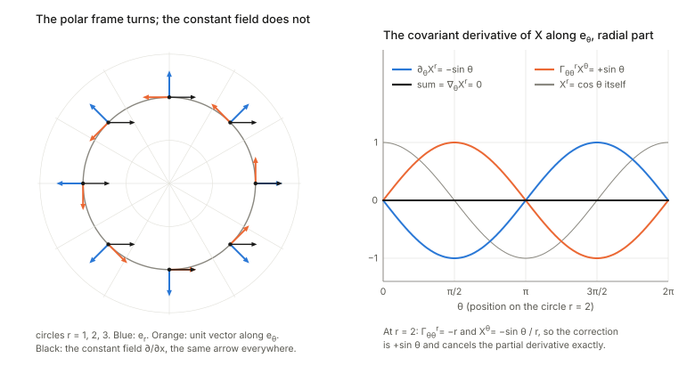
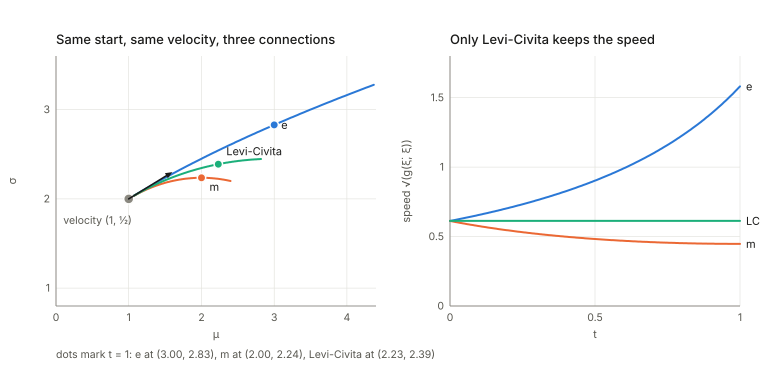
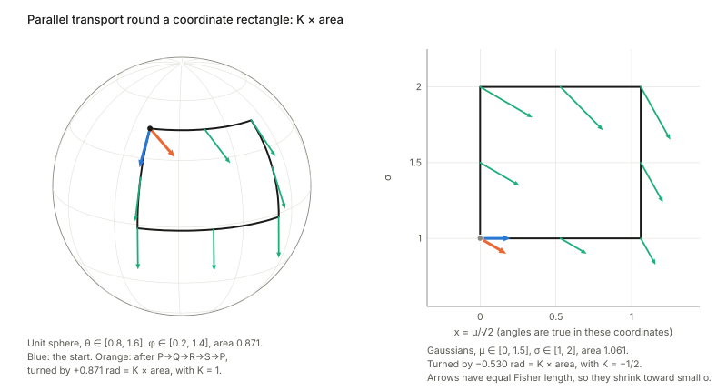
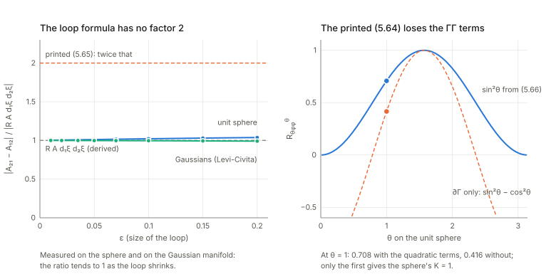
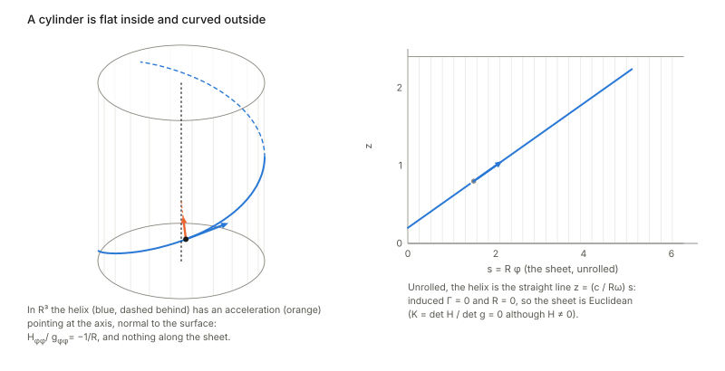

Notes for Chapter 5 of Amari, *Information Geometry and Its Applications* (Springer, 2016). The next section summarises the book's chapter in my own words. The sections after it are explorations that I asked for, one at a time, so they follow my questions and not the book's order. They keep the intuition, the figures and the derivations, and leave out numerical checks.

## What the chapter covers (a summary of the book's chapter)

This is a short, intuition-first introduction to Riemannian geometry. The book says outright that the derivations matter less than the ideas, which can be grasped without tears, and it is the first chapter of Part II. It supplies the vocabulary that Chapter 6 needs: how to measure length and angle, how to compare vectors at nearby points of a curved space, what "straight" means, and what curvature is. The sections in order:

- **§5.1 Manifold and tangent space.** At each point of a manifold the tangent space is the flat space that best approximates it nearby, spanned by the directions of the coordinate curves, so a tiny step between two nearby points is a tangent vector. Mathematicians identify a tangent vector with the operator that differentiates a function in that direction, which makes the transformation rules between charts automatic. For a family of distributions there is a second picture: the basis vectors are the scores of the log-likelihood, which are random variables. The point is that a tangent vector is one geometric object with several representations.
- **§5.2 Riemannian metric.** A metric gives every tangent space an inner product, so that lengths and angles make sense. In coordinates it is a positive-definite matrix that changes between charts by a fixed rule (it is a tensor). On a statistical manifold it is the Fisher information matrix, defined through the scores and invariant under change of parametrisation. A manifold is Euclidean when some chart makes the metric the identity, and curved from the metric point of view when no such chart exists; the chapter defers the exact test to the curvature tensor.
- **§5.3 Affine connection.** Vectors at nearby points live in different tangent spaces, so comparing them needs a rule that matches the two spaces up, approaching the identity as the points merge. That rule is an affine connection, recorded by the Christoffel symbols, which say how the basis vectors turn as one moves. The chapter motivates it with a surface in ordinary space, where the nearby tangent plane is slid over and projected. It then names the two ways to fix the coefficients: from the metric (the Levi-Civita connection of §5.9), or from a divergence, which gives the dually coupled pair of connections of Chapter 6.
- **§5.4 Tensors.** A tensor is a quantity attached to the tangent space whose components change with the chart so that equations between tensors look the same in every chart. The chapter explains the dual basis, upper (contravariant) and lower (covariant) indices, and raising and lowering with the metric. Examples are the gradient of a function (covariant), the Fisher metric, and a symmetric three-index statistical "cubic tensor" built from third moments of the score; the metric and this cubic tensor are announced as the two basic tensors of a statistical manifold. Not every indexed quantity is a tensor: the second derivative of a function is not (except at a critical point), and neither are the Christoffel symbols. They can vanish in one chart without vanishing in another, as in Cartesian versus polar coordinates of the plane, so they describe the chart as much as the space. The section ends with Einstein's reason for writing physical laws in tensor form.
- **§5.5 Covariant derivative.** To measure how a vector field really changes, the vector at the nearby point is first carried back to the original tangent space by the connection and then subtracted. The result is the ordinary derivative of the components plus a Christoffel correction, and unlike the ordinary derivative of components it is a tensor. The chapter also defines the derivative along another vector field, notes that it extends to tensors, and notes that for a plain scalar function the ordinary derivative is already right.
- **§5.6 Geodesic.** A geodesic is a curve whose direction does not change as measured by the connection, the straight line of that connection, with a second-order equation in the coordinates. The chapter stresses that, although "shortest" is the textbook definition, straightness and minimal length can differ in general; they agree for the Levi-Civita connection (Theorem 5.2 in §5.9), while a divergence gives more general connections. It also remarks that allowing the speed to vary does not add anything new, since a change of parameter reduces it to the same equation.
- **§5.7 Parallel transport.** Carrying a vector along a curve while keeping its covariant derivative along the curve zero, so that it stays "intrinsically the same". Transport between distant points follows from many tiny steps, and in general the result depends on the path taken.
- **§5.8 Riemann-Christoffel curvature.** The chapter says this section may be skipped, because the curvature tensor is not used in the applications of the book. In three parts. *§5.8.1* shows that carrying a vector around a tiny quadrilateral and back changes it, and the size of that change, per unit of enclosed area, defines the curvature tensor; for a bigger loop one adds up over any membrane spanning it. *§5.8.2* shows the same tensor is the failure of two covariant derivatives to commute (partial derivatives always commute), and mentions the compact textbook definition, which hides the meaning. *§5.8.3* shows that a manifold with zero curvature is flat: transport is path independent, one can build a net of geodesics with parallel directions, and these are affine coordinates in which all connection coefficients vanish.
- **§5.9 Levi-Civita connection.** Metric and connection have so far been separate. Asking that parallel transport keep lengths, equivalently inner products, ties them together. Theorem 5.1 says there is exactly one such connection with the symmetry condition, written in terms of the derivatives of the metric. Theorem 5.2 says the shortest curve between two points is a geodesic of it, where length is the usual integral of the speed measured by the metric. The book notes that most textbooks study only this connection, and that both results follow from minimising length.
- **§5.10 Submanifold and embedding curvature.** *§5.10.1:* a submanifold inside a larger manifold has tangent vectors that are also tangent vectors of the ambient space, and it inherits lengths and angles from it, hence an induced metric. *§5.10.2:* the connection is inherited as well, by carrying a vector in the ambient space and keeping only the part tangent to the submanifold. The discarded orthogonal part measures how the submanifold bends inside the ambient space, the embedding curvature (the Euler-Schouten tensor). It differs from the intrinsic curvature of §5.8: the chapter's example is a cylinder in ordinary space, which is bent from outside but has Euclidean geometry for creatures living on it.

The chapter closes with remarks. Differential geometry studies local structure; global topology and its link to curvature is left out, since most applications need only the local part. After a rigorous theory exists, one may use intuition for applications, which is the stated aim of Part II. A short history follows (non-Euclidean geometry, Riemann's conjecture that real space may be Riemannian, borne out by relativity). The torsion tensor, with two antisymmetric indices, is mentioned (Einstein's failed unification, dislocations in continua, Kron's electromechanical systems and non-holonomic constraints in robotics) but not used. Information geometry needs, beyond the textbook theory, a pair of connections dual with respect to the metric, which is the subject of Chapter 6.

## Links

- **[Interactive companion](figures/interactive.html)**: six widgets. (1) A tangent vector as an arrow, a derivative operator and a random variable (the score), on the Gaussian manifold with its unit Fisher circle.
  (2) What a Christoffel symbol measures: the polar frame at two nearby points, the exact change of the frame against the first-order prediction. (3) One start and one velocity under the e-, m- and Levi-Civita connections and a dial between e and m, with speeds and lengths against the Fisher–Rao distance.
  (4) Parallel transport round a coordinate rectangle on the sphere, in the plane with polar coordinates and on the Gaussian manifold, with the e-to-m dial. (5) The loop formula for curvature, measured against the derived and the printed right-hand sides. (6) Bending a flat sheet into a cylinder: intrinsic curvature stays $0$ while embedding curvature grows.
- The book: Amari, *Information Geometry and Its Applications* (Springer, 2016), DOI [10.1007/978-4-431-55978-8](https://doi.org/10.1007/978-4-431-55978-8). These notes cover Chapter 5 only; equation numbers such as (5.54) refer to the book.
  No text of the book is reproduced here; everything is restated and re-derived.
- Neighbouring chapters: **[Chapter 2: exponential and mixture families](../ch02-exponential-and-mixture-families/index.html)** comes before it. This chapter uses nothing from **[Chapter 3](../ch03-invariant-geometry/index.html)** or **[Chapter 4](../ch04-alpha-geometry/index.html)** beyond the Gaussian example of Chapters 1–2, and **[Chapter 6: dual connections](../ch06-dual-connections/index.html)** builds directly on it; the notes on Chapter 6 check that what is said here about the e-, m- and $\alpha$-connections agrees with what is computed there.
  Background on the annotations site: **[The Fisher information matrix](https://msrepo.github.io/theory_inclined_papers_with_annotations/fisher-information/)**.

## In one paragraph

Calculus tells you how a *function* changes. To say how a *vector* changes you need more, because a vector at one point of a curved space lives in a different space from a vector at the next point, so "the same vector" has no meaning until a rule is chosen. The same trouble appears on a perfectly flat plane the moment you use polar coordinates: the basis vectors $e_r,e_\vartheta$ themselves turn from place to place.
The rule is an **affine connection**, written in coordinates as an array $\Gamma_{ij}{}^k$ (the Christoffel symbols). Everything else in the chapter hangs on it: the **covariant derivative** (the change of a vector field with the turning of the frame subtracted), **geodesics** (curves whose velocity does not change, the straight lines of that connection), **parallel transport** (carrying a vector without changing it) and **curvature** (the failure of parallel transport to be path independent). A **metric** is a different, independent structure: lengths and angles in every tangent space. The two meet in the **Levi-Civita connection**, the one symmetric connection that preserves lengths, and for it straight lines are also shortest lines.
A **submanifold** inherits a metric and a connection but has one more kind of curvature, how it bends inside the bigger space, which its own inhabitants cannot see (a cylinder is flat inside).
What matters for information geometry is the point the book ends on: the Fisher metric selects Levi-Civita, but a manifold of distributions carries other natural connections that are *not* metric. On the Gaussian manifold the e-connection and the m-connection are both **flat**, Levi-Civita has constant curvature $-\tfrac12$, and from one point with one velocity the three give three different straight lines. Chapter 6 turns this into a theory by coupling two connections through the metric.

## The spine of the argument

1. Tangent vectors are derivative operators $\partial_i$; for a family of distributions they are scores $\partial_i\log p$. Basis vectors change with the Jacobian, components with its inverse (§1).
2. A metric is an inner product $g_{ij}=\langle e_i,e_j\rangle$ on each tangent space; on a statistical manifold it is the Fisher information (§2).
3. To differentiate a vector field, nearby tangent spaces must be identified. An affine connection does this to first order: $de_i=\Gamma_{ki}{}^j\,d\xi^k\,e_j$. It is **not a tensor** (§3, §4).
4. Covariant derivative $\nabla_iX^k=\partial_iX^k+\Gamma_{ij}{}^kX^j$; geodesics $\nabla_{\dot\xi}\dot\xi=0$, i.e. $\ddot\xi^k+\Gamma_{ij}{}^k\dot\xi^i\dot\xi^j=0$; parallel transport $\nabla_{\dot\xi}A=0$ (§5–§7).
5. Carrying a vector round a tiny loop changes it by the curvature tensor $R_{ijk}{}^l$; $R=0$ exactly when there are affine coordinates with $\Gamma=0$ (§8).
6. Metric compatibility plus symmetry pins $\Gamma$ down uniquely (Levi-Civita), and then geodesics are also the shortest curves (§9).
7. A submanifold has an induced metric, an induced connection and an **embedding curvature** $H$; intrinsic and embedding curvature are different (§10).

## Setup and notation

| Symbol | Meaning | In the examples |
|---|---|---|
| $\xi=(\xi^1,\dots,\xi^n)$ | a chart (coordinates) | $(\mu,\sigma)$, $(r,\vartheta)$, $(\theta,\varphi)$ |
| $e_i=\partial_i$ | basis of the tangent space $T_\xi$ along the coordinate curve $\xi^i$ | $\partial_\mu,\partial_\sigma$ |
| $A=A^ie_i$ | a tangent vector (upper index: contravariant components) | the velocity $\dot\xi^i$ of a curve |
| $g_{ij}=\langle e_i,e_j\rangle$ | the metric; $g^{ij}$ is the inverse matrix | Fisher information |
| $\Gamma_{ij}{}^k$ | connection coefficients, $\nabla_{e_i}e_j=\Gamma_{ij}{}^ke_k$; **the first index is the direction of differentiation** | |
| $\Gamma_{ijk}=\Gamma_{ij}{}^mg_{mk}$ | lowered form, $\langle\nabla_{e_i}e_j,e_k\rangle$ (5.21)–(5.22) | |
| $T_{ijk}=\mathbb E[\partial_il\,\partial_jl\,\partial_kl]$ | the cubic tensor, $l=\log p$ (5.33) | |
| $\nabla_iX^k$ | covariant derivative (5.48) | |
| $R_{ijk}{}^l$ | curvature: $R(e_i,e_j)e_k=R_{ijk}{}^le_l$ (5.66) | |
| $K$ | Gauss curvature of a surface, $K=R_{122}{}^mg_{m1}/\det g$ | |
| $J_\kappa{}^i=\partial\xi^i/\partial\zeta^\kappa$ | Jacobian of a change of chart $\xi\to\zeta$ (the convention of (5.7)) | |
| $B_a{}^i=\partial\xi^i/\partial u^a$, $H_{ab}{}^\kappa$ | embedding of a submanifold with coordinates $u^a$; its embedding curvature (5.90), (5.101) | |

Index convention. The book puts the *direction* index first, $\Gamma_{ij}{}^k$ with $\nabla_{e_i}e_j=\Gamma_{ij}{}^ke_k$; many textbooks put it last. 

**Three running examples.** Every claim below is illustrated on at least one of them.

| Space | Chart | Metric | Non-zero $\Gamma_{ij}{}^k$ | Curvature |
|---|---|---|---|---|
| plane, polar | $(r,\vartheta)$ | $\operatorname{diag}(1,r^2)$ | $\Gamma_{\vartheta\vartheta}{}^r=-r$, $\Gamma_{r\vartheta}{}^\vartheta=\Gamma_{\vartheta r}{}^\vartheta=1/r$ | $0$ |
| unit sphere | $(\theta,\varphi)$ | $\operatorname{diag}(1,\sin^2\theta)$ | $\Gamma_{\varphi\varphi}{}^\theta=-\sin\theta\cos\theta$, $\Gamma_{\theta\varphi}{}^\varphi=\Gamma_{\varphi\theta}{}^\varphi=\cot\theta$ | $K=+1$ |
| Gaussians, Levi-Civita | $(\mu,\sigma)$ | $\operatorname{diag}(1/\sigma^2,\,2/\sigma^2)$ | $\Gamma_{\mu\sigma}{}^\mu=\Gamma_{\sigma\mu}{}^\mu=-1/\sigma$, $\Gamma_{\mu\mu}{}^\sigma=1/(2\sigma)$, $\Gamma_{\sigma\sigma}{}^\sigma=-1/\sigma$ | $K=-\tfrac12$ |
| Gaussians, e-connection | $(\mu,\sigma)$ | same | $\Gamma_{\mu\sigma}{}^\mu=\Gamma_{\sigma\mu}{}^\mu=-2/\sigma$, $\Gamma_{\sigma\sigma}{}^\sigma=-3/\sigma$ | $0$ (flat) |
| Gaussians, m-connection | $(\mu,\sigma)$ | same | $\Gamma_{\mu\mu}{}^\sigma=1/\sigma$, $\Gamma_{\sigma\sigma}{}^\sigma=1/\sigma$ | $0$ (flat) |

The Gaussian rows are explained in §3: the e-connection is the one for which $\theta=(\mu/\sigma^2,-1/2\sigma^2)$ is an affine chart, the m-connection the one for which $\eta=(\mu,\mu^2+\sigma^2)$ is, and Levi-Civita is the one tied to the Fisher metric. At the point $(\mu,\sigma)=(1,2)$ used throughout, Levi-Civita is exactly the average of the e- and m-symbols, as §3 shows.

## 1. Tangent vectors (§5.1)

**In plain words.** At a point of a surface, the tangent space is the flat plane that best fits the surface there, and a tangent vector is a possible velocity of a curve through the point. In a chart $\xi$ the velocity of a curve $\xi(t)$ has components $\dot\xi^i$, and the basis vector $e_i$ is the velocity of the coordinate curve along which only $\xi^i$ moves.
The mathematicians' version replaces the arrow by the thing an arrow does: it differentiates functions. The vector $A=A^i\partial_i$ is the operator $f\mapsto A^i\partial_if$, the rate of change of $f$ along $A$ (5.2)–(5.5). The reason to prefer the operator is that the chain rule makes it chart independent, which forces the transformation laws.

**The laws.** If $\zeta^\kappa=\zeta^\kappa(\xi)$ is a new chart then $\partial_i=\frac{\partial\zeta^\kappa}{\partial\xi^i}\partial_\kappa$ and $\partial_\kappa=\frac{\partial\xi^i}{\partial\zeta^\kappa}\partial_i=J_\kappa{}^i\partial_i$ (5.6)–(5.9).
Since $A=A^i\partial_i=A^\kappa\partial_\kappa$ must not depend on the chart, the components go the other way, $A^\kappa=\frac{\partial\zeta^\kappa}{\partial\xi^i}A^i$ (5.28): basis vectors transform with $J$, components with the inverse of $J$, and "contravariant" is just the name for this opposite behaviour.

**For distributions: a tangent vector is a random variable.** Take a curve of distributions $p(x;\xi(t))$. How fast does $\log p(x;\xi(t))$ change at a fixed outcome $x$? By the chain rule, $\dot\xi^i\,\partial_i\log p(x;\xi)$: the velocity of the curve, read as a function of $x$. So the basis vector $e_i$ is identified with the **score** $\partial_i\log p$, and a tangent vector $A$ with $f(x)=A^i\partial_i\log p(x;\xi)$ (5.10). Scores have mean zero (the density integrates to $1$), so tangent vectors are zero-mean random variables, and the inner product of two of them will be their covariance (§2).

*The Gaussian as an example.* The scores are $\partial_\mu\log p=(x-\mu)/\sigma^2$ and $\partial_\sigma\log p=((x-\mu)^2-\sigma^2)/\sigma^3$. Changing to the natural parameters $\theta$ turns these, through the basis law, into combinations of $x-\eta_1$ and $x^2-\eta_2$, which are exactly the $\theta$-scores of an exponential family. An arrow given in $(\mu,\sigma)$ components and the same arrow given in $\theta$ components produce the same random variable $f(x)=A^i\partial_i\log p$, whichever way it is computed. The second moment of $f$ is the squared length of $A$, which returns in §2.
The interactive page's first widget lets you move the arrow and watch the two routes to $f(x)$ coincide.

## 2. The Riemannian metric (§5.2)

**In plain words.** A metric says how long a tangent vector is and what angle two of them make. In components, $g_{ij}=\langle e_i,e_j\rangle$ is a positive definite matrix at every point, and $\langle A,B\rangle=g_{ij}A^iB^j$ (5.11), (5.14). Because $\langle A,A\rangle$ cannot depend on the chart, the matrix must transform with two copies of the Jacobian, $g_{\kappa\lambda}=J_\kappa{}^iJ_\lambda{}^jg_{ij}$ (5.12). That law is the definition of a **tensor** (§4).

**For distributions** the inner product is the covariance of the scores, $\langle e_i,e_j\rangle=\mathbb E[\partial_il\,\partial_jl]$ (5.13): the Fisher information. It is invariant because scores are.

*On the Gaussian.* The Fisher matrix in $(\mu,\sigma)$ is $\operatorname{diag}(1/\sigma^2,2/\sigma^2)$. The law (5.12) moves it to the natural parameters, where it becomes the covariance matrix of $(x,x^2)$, which is also the Hessian of the cumulant function $\psi$ of Chapter 2. The length of an arrow comes out the same in either chart. For the plane in polar coordinates the same law gives $J^{\mathsf T}J=\operatorname{diag}(1,r^2)$.

**Euclidean means: some chart has $g=\delta$** (5.15). The plane is, via Cartesian coordinates. The Gaussian manifold is not, for a reason that only shows up with curvature (§8): its Gauss curvature is $-\tfrac12$.

## 3. The affine connection and Christoffel symbols (§5.3)

**The problem, in plain words.** To say how a vector field $X$ changes from $\xi$ to $\xi+d\xi$ you must compare $X(\xi)\in T_\xi$ with $X(\xi+d\xi)\in T_{\xi+d\xi}$, two different spaces. Equal components do not mean equal vectors, because the basis moved. The plane in polar coordinates shows it at once: the field $e_r$ has constant components $(1,0)$ and yet points in a different direction at every $\vartheta$.
A **connection** is a rule that carries $T_{\xi+d\xi}$ back to $T_\xi$, close to the identity when $d\xi$ is small, hence to first order a linear rule. The book's picture is a surface in ordinary space: slide the nearby tangent plane back, then project it onto the first. Formally, the transported frame differs from the original by

$$de_i=\Gamma_{ki}{}^j\,d\xi^k\,e_j\qquad(5.19\text{–}5.20),$$

so $\Gamma_{ki}{}^j$ says: *moving in direction $k$, the $i$-th basis vector picks up a component $\Gamma_{ki}{}^j$ along the $j$-th.* The lowered form $\Gamma_{kim}=\langle de_i/d\xi^k,e_m\rangle$ is (5.21)–(5.22); the metric is used only for that.

**Reading $\Gamma$ off the polar plane.** Moving by $d\vartheta$ rotates the radial unit vector by the angle $d\vartheta$ towards $\hat e_\vartheta$. The coordinate vector $e_\vartheta=r\hat e_\vartheta$ has length $r$, so $de_r=d\vartheta\,\hat e_\vartheta=\frac{d\vartheta}{r}e_\vartheta$, i.e. $\Gamma_{\vartheta r}{}^\vartheta=1/r$.
For $e_\vartheta=r\hat e_\vartheta$: $de_\vartheta=dr\,\hat e_\vartheta-r\,d\vartheta\,\hat e_r=\frac{dr}{r}e_\vartheta-r\,d\vartheta\,e_r$, i.e. $\Gamma_{r\vartheta}{}^\vartheta=1/r$ and $\Gamma_{\vartheta\vartheta}{}^r=-r$.
The exact change of the frame between two nearby points agrees with this first-order prediction up to terms of second order in $d\xi$, which is all (5.20) claims. The second widget shows the two frames and the difference between them.

**Where connections come from.** The book names two sources. (a) The metric: Levi-Civita (§9). (b) A divergence, giving a pair of connections coupled through the metric ([Chapter 6](../ch06-dual-connections/index.html)). A third, which the Gaussian examples below need, is to declare a chart affine: *define* the connection by $\Gamma=0$ in some chart $a$. Then in any other chart $\xi$ the transformation law (5.37) leaves only its inhomogeneous term,
$$\Gamma_{ij}{}^m=\frac{\partial^2a^A}{\partial\xi^i\partial\xi^j}\frac{\partial\xi^m}{\partial a^A}.$$
On the Gaussian manifold this gives two flat connections. For the e-connection $a=\theta$; for the m-connection $a=\eta=(\mu,\mu^2+\sigma^2)$. Two instances: $\partial^2\theta_1/\partial\mu\partial\sigma=-2/\sigma^3$ and $\partial\mu/\partial\theta_1=\sigma^2$ give $\Gamma^e_{\mu\sigma}{}^\mu=-2/\sigma$; $\partial^2\theta_2/\partial\sigma^2=-3/\sigma^4$ and $\partial\sigma/\partial\theta_2=\sigma^3$ give $\Gamma^e_{\sigma\sigma}{}^\sigma=-3/\sigma$. Likewise $\partial^2\eta_2/\partial\mu^2=2$ and $\partial\sigma/\partial\eta_2=1/(2\sigma)$ give $\Gamma^m_{\mu\mu}{}^\sigma=1/\sigma$. The Levi-Civita symbol of the Fisher metric, computed from (5.85) below, is $(-1/\sigma,\ 1/(2\sigma),\ -1/\sigma)$, and it is exactly the **average** of the two: $\Gamma^{LC}=\tfrac12(\Gamma^e+\Gamma^m)$.
(The book defines these connections in Chapter 6 as the $\alpha=\pm1$ members of a family, which the [notes on Chapter 6](../ch06-dual-connections/index.html) confirm; here I use only the characterisation by affine charts.) All three are symmetric in the two lower indices. The unit sphere's induced connection (5.100) from its embedding in $\mathbb R^3$ equals the Levi-Civita symbol of its induced metric, $\Gamma_{\varphi\varphi}{}^\theta=-\sin\theta\cos\theta$ and $\Gamma_{\theta\varphi}{}^\varphi=\cot\theta$.

## 4. Tensors, and why $\Gamma$ is not one (§5.4)

**In plain words.** A tensor is a bunch of numbers attached to a point that transforms with one Jacobian per index, so that an equation between tensors holds in every chart or in none. Vectors have one upper index; the metric two lower; a mixed quantity like $K^{ij}{}_{klm}$ any number of each (5.27)–(5.30). Raising and lowering uses the metric: with the dual basis $e^i=g^{ij}e_j$ (5.24) a vector has covariant components $A_i=g_{ij}A^j$ (5.26). The gradient of a function, $(\partial_if)$, is covariant (5.31)–(5.32).

**Not every array with indices is a tensor.**

- *The Hessian of a function* is not (5.34)–(5.35): $f_{\kappa\lambda}=J_\kappa{}^iJ_\lambda{}^jf_{ij}+(\partial_\kappa J_\lambda{}^j)\partial_jf$, the extra term involving the slope. It is a tensor where the slope vanishes. So at a point where $f$ is not critical, the honest second derivatives in a new chart differ from what the tensor law predicts by exactly that extra term; at a critical point the extra term vanishes and the two agree.
- *The connection coefficients* $\Gamma$ are not (5.36)–(5.37): $\Gamma_{\kappa\lambda\mu}=J_\kappa{}^iJ_\lambda{}^jJ_\mu{}^k\Gamma_{ijk}+(\partial_\kappa J_\lambda{}^j)J_\mu{}^kg_{jk}$. The second term is what turns the Cartesian $\Gamma=0$ into the polar $\Gamma_{\vartheta\vartheta}{}^r=-r$. Moving the Gaussian Levi-Civita symbol from $(\mu,\sigma)$ to $\theta$, the full law agrees with computing the symbol directly from the metric by (5.85) in the new chart, while the tensor-like first term alone does not.
  So "$\Gamma=0$ in one chart" is a statement about the chart, not about the geometry (5.38)–(5.41).

**The cubic tensor is a tensor** (5.33). $T_{ijk}=\mathbb E[\partial_il\,\partial_jl\,\partial_kl]$ is symmetric and transforms with three Jacobians, because the scores do. On the Gaussians the only non-zero entries in $(\mu,\sigma)$ are $T_{\mu\mu\sigma}=2/\sigma^3$ and $T_{\sigma\sigma\sigma}=8/\sigma^3$. Transformed to $\theta$ it becomes the array of third derivatives $\partial_i\partial_j\partial_k\psi$, which are also the third central moments of $(x,x^2)$. So for an exponential family $T=\nabla^3\psi$, the next derivative after the metric $\nabla^2\psi$.

**A fact that the book uses without saying so in this chapter: the difference of two connections is a tensor.** The inhomogeneous term in (5.37) involves only the chart and the metric, not $\Gamma$, so it cancels in $\Gamma'-\Gamma$. On the Gaussians $\Gamma^m_{ijk}-\Gamma^e_{ijk}=T_{ijk}$, and in the chart $\theta$, where $\Gamma^e=0$, the m-symbol is $\partial_i\partial_j\partial_k\psi$ and the Levi-Civita symbol is half of it, $\Gamma^{LC}_{ijk}=\tfrac12\partial_i\partial_j\partial_k\psi$ (the standard identity for a Hessian metric). The theory of [Chapter 6](../ch06-dual-connections/index.html) is largely about that tensor $T$.

## 5. The covariant derivative (§5.5)

**In plain words.** The ordinary derivative $\partial_iX^k$ of a vector field's components mixes two things: the field really changing, and the frame turning. The covariant derivative keeps only the first. Compare $X(\xi+d\xi)$ mapped back to $T_\xi$ with $X(\xi)$: the components of the mapped vector are $X^k+\partial_iX^k\,d\xi^i+\Gamma_{ij}{}^kX^j\,d\xi^i$, so

$$\nabla_iX^k=\partial_iX^k+\Gamma_{ij}{}^kX^j\qquad(5.48),$$

and along a field $Y$: $\nabla_YX=Y^i\nabla_iX^k\,e_k$ (5.49). Unlike $\partial_iX^k$, $\nabla_iX^k$ is a tensor. For a scalar, $\nabla$ is just $\partial$ (5.51).

*The cleanest test.* In polar coordinates the constant field $X=\partial/\partial x$ has components $(X^r,X^\vartheta)=(\cos\vartheta,\,-\sin\vartheta/r)$. Its partial derivatives $\partial_iX^k$ are not zero, yet $\nabla_iX^k=0$ in every entry: the field does not change. The radial entry shows how, $\nabla_\vartheta X^r=\partial_\vartheta X^r+\Gamma_{\vartheta\vartheta}{}^rX^\vartheta=-\sin\vartheta+(-r)(-\sin\vartheta/r)=0$ (the picture above, right).
The reverse also happens: the field $e_r$ has constant components $(1,0)$, all partial derivatives vanish, and yet $\nabla_\vartheta e_r=\Gamma_{\vartheta r}{}^\vartheta e_\vartheta=\tfrac1r e_\vartheta\neq0$.
The covariant derivative of any field computed in polar coordinates agrees with the tensor law applied to the Cartesian $\nabla Y=\partial Y$, while the bare partial derivatives do not.

## 6. Geodesics (§5.6)

**In plain words.** A straight line does not change direction. On a manifold: a curve is a **geodesic** of the connection if its velocity is parallel to itself, $\nabla_{\dot\xi}\dot\xi=0$ (5.53), in components

$$\ddot\xi^k+\Gamma_{ij}{}^k\,\dot\xi^i\dot\xi^j=0\qquad(5.54).$$

The first term is the acceleration in the chart; the second subtracts the part of it that is only the frame turning. The book's alternative $\nabla_{\dot\xi}\dot\xi=c(t)\dot\xi$ (5.55) is the same curve run at a different pace: if $\xi(t)=\gamma(t^3)$ with $\gamma$ a geodesic, then $\ddot\xi+\Gamma\dot\xi\dot\xi=(2/t)\dot\xi$; the left side is then $c\,\dot\xi$ with $c=2/t$.

*Examples.* In polar coordinates, (5.54) started from any point with any velocity traces the Cartesian straight line, although both $r(t)$ and $\vartheta(t)$ are curved functions of $t$. On the unit sphere the solutions are great circles, with constant speed.

**Straight is not shortest.** The book stresses (§5.6) that the geodesic of a connection and the shortest curve are different notions. Two ways to see it.
(i) On the sphere, a great circle run for three quarters of its length is a geodesic, but its endpoint is a quarter circle away the other way round, which is three times shorter. A geodesic is only locally shortest.
(ii) **One start, one velocity, three connections.** On the Gaussian manifold start at a point with a given velocity. The e-geodesic is a straight line in $\theta$, the m-geodesic is a straight line in $\eta$, and the Levi-Civita geodesic is neither. The three end at three different places. Same manifold, same data, three answers.

*Speed.* Only Levi-Civita keeps the speed $\sqrt{g(\dot\xi,\dot\xi)}$ constant. Along the e-geodesic it grows, along the m-geodesic it falls (picture, right). This is the metric-compatibility of §9 in action: $\tfrac{d}{dt}g(\dot\xi,\dot\xi)=2g(\nabla_{\dot\xi}\dot\xi,\dot\xi)$ vanishes along a geodesic only if $\nabla$ preserves $g$.
*Length.* Between two Gaussians the Fisher–Rao distance has the closed form of Chapter 1. The e-geodesic between them is longer than that distance, the m-geodesic is longer, and so is the straight line in $(\mu,\sigma)$. Only the Levi-Civita geodesic achieves the distance (§9). The third widget lets you move the start, the velocity and a dial $s$ between e ($s=0$) and m ($s=1$) and prints the length-to-distance ratio of each.

## 7. Parallel transport (§5.7)

**In plain words.** Carry a vector along a curve while asking the connection to keep it "the same": its covariant derivative along the curve is zero, $\nabla_{\dot\xi}A=0$ (5.57), i.e.

$$\dot A^i+\Gamma_{jk}{}^i\,\dot\xi^j A^k=0\qquad(5.58).$$

A geodesic is a curve that carries its own velocity. The transported vector generally depends on the path (5.59), and that dependence is curvature (§8).

*Sphere.* Take a coordinate rectangle in $(\theta,\varphi)$ and go once round its four sides, starting with a vector along $e_\theta$. The vector comes back turned, counter-clockwise, by exactly $K\times\text{area}$ with $K=1$, its length unchanged. The two routes from one corner to the opposite one arrive with different vectors: the transported vector depends on the path.
Round a circle of latitude the same thing happens. Relative to the moving frame the vector turns by $-2\pi\cos\theta$ in total, which is the same rotation as $2\pi(1-\cos\theta)$ (the area of the cap the circle encloses) once whole turns are discarded.

*Plane in polar coordinates.* Round a circle $r=\text{const}$ the *polar components* of a transported vector change continuously (halfway round, a vector that started as $(1,0)$ has components $(-1,0)$), but the Cartesian arrow is the same at the start, halfway and the end, with no net rotation. Components are not vectors.

*Gaussians.* Take a coordinate rectangle in $(\mu,\sigma)$ and measure its area with the Fisher metric. The three connections behave differently:

| Connection | Vector after the loop | Length of $A$ along the loop |
|---|---|---|
| Levi-Civita | rotated by $K\times\text{area}$ with $K=-\tfrac12$ | constant |
| e | exactly back where it started | changes along the way, returns |
| m | exactly back where it started | changes along the way, returns |

The sign of the rotation is opposite to the sphere's, because $K<0$. The e- and m-connections return the vector exactly (they are flat) but do not preserve its length along the way (they are not metric). In the flat case parallel transport is path independent: for the e-connection the two routes between opposite corners give the same vector, and its $\theta$-components stay constant.

## 8. Riemann–Christoffel curvature (§5.8)

### 8.1 The round-the-world derivation

**In plain words.** Because transport depends on the path, the amount of dependence over an infinitesimal loop measures the curvature. Take a small parallelogram $P,Q,R,S$ with sides $d_1\xi$ ($P\to Q$, $S\to R$) and $d_2\xi$ ($Q\to R$, $P\to S$).
Carry $A$ along $P\to Q\to R$. On the first leg, $d_1A^i=-\Gamma_{jk}{}^iA^kd_1\xi^j$. On the second leg the symbol must be evaluated at $Q$, i.e. expanded to first order, and the vector is already $A+d_1A$, giving the extra change
$$\delta_{12}A^i=-\Gamma_{jk}{}^iA^k\,d_2\xi^j-\partial_l\Gamma_{jk}{}^i\,A^k\,d_1\xi^ld_2\xi^j+\Gamma_{jk}{}^i\Gamma_{lm}{}^kA^m\,d_1\xi^ld_2\xi^j\qquad(5.63).$$
The other route $P\to S\to R$ is the same with $d_1\xi\leftrightarrow d_2\xi$, **in every term**. The first-order terms of the two routes are equal and cancel in the difference; what is left is, writing $X_{ab}{}^i{}_k=\partial_a\Gamma_{bk}{}^i+\Gamma_{am}{}^i\Gamma_{bk}{}^m$,
$$A_{21}-A_{12}=X_{ab}{}^i{}_k\,A^k\,(d_1\xi^ad_2\xi^b-d_2\xi^ad_1\xi^b)=(X_{ab}{}^i{}_k-X_{ba}{}^i{}_k)\,A^k\,d_1\xi^ad_2\xi^b=R_{abk}{}^i\,A^k\,d_1\xi^a\,d_2\xi^b,$$
with $R_{ijk}{}^l=\partial_i\Gamma_{jk}{}^l-\partial_j\Gamma_{ik}{}^l+\Gamma_{im}{}^l\Gamma_{jk}{}^m-\Gamma_{jm}{}^l\Gamma_{ik}{}^m$, which is (5.66). $R$ is a tensor, with two antisymmetric directions $i,j$ and a "vector slot" $k$.

**Two slips in the printed version** (I checked the page images).

1. *(5.64) is not obtained by exchanging $d_1\xi$ and $d_2\xi$ in (5.63).* The first two terms are exchanged but the last, $\Gamma_{jk}{}^i\Gamma_{lm}{}^kA^m\,d_2\xi^jd_1\xi^l$, is printed unchanged. If it were right, the $\Gamma\Gamma$ terms would cancel in the difference and (5.65) would produce only $\partial_i\Gamma_{jk}{}^l-\partial_j\Gamma_{ik}{}^l$, not (5.66). On the sphere that would give $R_{\theta\varphi\varphi}{}^\theta=\sin^2\theta-\cos^2\theta$ instead of the correct $\sin^2\theta$ (the right-hand panel below).
2. *(5.65), (5.69) and (5.70) are a factor $2$ too large.* They write $A_{21}-A_{12}=R_{jkl}{}^iA^l(d_1\xi^jd_2\xi^k-d_1\xi^kd_2\xi^j)$, and the bracket equals $d_1\xi^jd_2\xi^k$ doubled once $R$'s antisymmetry is used: $R_{jkl}{}^i(d_1^jd_2^k-d_1^kd_2^j)=2R_{jkl}{}^id_1^jd_2^k$. The truth is $A_{21}-A_{12}=R_{jkl}{}^iA^ld_1\xi^jd_2\xi^k=\tfrac12R_{jkl}{}^iA^ldf^{jk}$ if $df^{jk}$ is the printed (5.67). The same $\tfrac12$ belongs in the surface integral (5.70) (or $df^{jk}$ should be read as half of (5.67)).
 *Orientation.* $A_{21}-A_{12}$ is the arrival difference of the two routes. Going round the loop $P\to Q\to R\to S\to P$ changes $A$ by $A_{12}-A_{21}$, the **negative** (the sphere's rotation above is $+K\,\text{area}$ for that loop, as $-R(d_1\xi,d_2\xi)A$ requires).

*Testing the factor.* Shrinking a small loop towards zero size and comparing the difference of the two transports with $R_{jkl}{}^iA^ld_1^jd_2^k$ (not the printed bracket) gives a ratio that tends to $1$, not to $2$ (left panel below), for the sphere and for the Gaussian Levi-Civita connection; for the flat e-connection the difference is zero. The change of $A$ round the whole loop, divided by $-RAd_1d_2$, also tends to $1$. The fifth widget lets you shrink the loop and see the measured vector land on the black arrow, not the red one.

### 8.2 Curvature as non-commuting derivatives, and the abstract form

Partial derivatives commute, covariant derivatives do not (5.71)–(5.72): $(\nabla_{e_i}\nabla_{e_j}-\nabla_{e_j}\nabla_{e_i})X=R_{ijk}{}^lX^ke_l$ (5.74). The modern definition is $R(X,Y)Z=\nabla_X\nabla_YZ-\nabla_Y\nabla_XZ-\nabla_{[X,Y]}Z$ (5.75), where $[X,Y]=XY-YX$ is the commutator of the vector fields (5.76); for coordinate fields $[e_i,e_j]=0$ and the last term disappears, which gives (5.66) back: $R(e_i,e_j)e_k=\nabla_{e_i}(\Gamma_{jk}{}^me_m)-\nabla_{e_j}(\Gamma_{ik}{}^me_m)=\left(\partial_i\Gamma_{jk}{}^l-\partial_j\Gamma_{ik}{}^l+\Gamma_{jk}{}^m\Gamma_{im}{}^l-\Gamma_{ik}{}^m\Gamma_{jm}{}^l\right)e_l=R_{ijk}{}^le_l$.
### 8.3 Flat manifolds, and curvature of the examples

$R=0$ means parallel transport does not depend on the path. Transport a basis of one tangent space everywhere; the resulting parallel vector fields have $\nabla e_j=0$, and the coordinate lines tangent to them are geodesics, giving a chart with $\Gamma=0$ everywhere, an **affine chart** (5.77)–(5.78). Conversely $\Gamma=0$ in some chart makes $R=0$ by (5.66).

In short: the plane in polar coordinates is flat (affine chart: Cartesian); the unit sphere has $K=+1$ everywhere and no affine chart; the Gaussians with Levi-Civita have $K=-\tfrac12$ everywhere and no affine chart; the Gaussians with the e-connection are flat with affine chart $\theta$; with the m-connection they are flat with affine chart $\eta$.

For the e-connection a frame carried from one point to another along two different routes comes out the same, and equals the $\theta$-coordinate frame there; for m it equals the $\eta$-coordinate frame. For Levi-Civita the same vector arrives differently depending on the route, so there is no parallel frame at all. Geodesics of the e-connection are straight lines in $\theta$.
In two dimensions $R$ is determined by one number: $R_{ijkl}=K(g_{jk}g_{il}-g_{ik}g_{jl})$, and for a metric connection $R_{ijkl}$ is also antisymmetric in $(k,l)$. And $R$ really is a tensor: computing it from its own $\Gamma$ in another chart of the sphere agrees with the tensor law applied to $R$ in the first chart.

**Between e and m.** Any average $(1-s)\Gamma^e+s\Gamma^m$ is again a connection. Its curvature is $4s(1-s)$ times the Levi-Civita curvature, flat at the two ends and equal to Levi-Civita's at $s=\tfrac12$; and its failure of the metric condition (5.82) is $\lvert1-2s\rvert$ times that of e, zero only at $s=\tfrac12$. **So on this manifold no connection is both flat and metric**: the metric one is unique (§9) and has $K=-\tfrac12$. The fourth widget has this dial.

## 9. The Levi-Civita connection (§5.9)

**In plain words.** Ask transport to preserve lengths. The book notes that "lengths are preserved" and "inner products are preserved" are equivalent (5.79)–(5.80), and that for the frame it reads (5.81)

$$\partial_kg_{ij}=\Gamma_{kij}+\Gamma_{kji}\qquad(5.82),$$

i.e. $Z\langle X,Y\rangle=\langle\nabla_ZX,Y\rangle+\langle X,\nabla_ZY\rangle$ for all fields (5.83); such a connection is called *metric*.

**Theorem 5.1: a metric connection with $\Gamma_{ijk}=\Gamma_{jik}$ is unique and given by**
$$\Gamma_{ijk}=\tfrac12\left(\partial_ig_{jk}+\partial_jg_{ik}-\partial_kg_{ij}\right)\qquad(5.85).$$
*Proof* (the book leaves it as an exercise). Write (5.82) three times with the indices permuted and combine: $\partial_kg_{ij}+\partial_ig_{jk}-\partial_jg_{ki}=(\Gamma_{kij}+\Gamma_{kji})+(\Gamma_{ijk}+\Gamma_{ikj})-(\Gamma_{jki}+\Gamma_{jik})$. Using the symmetry in the first two indices, $\Gamma_{kij}=\Gamma_{ikj}$, $\Gamma_{kji}=\Gamma_{jki}$, $\Gamma_{ijk}=\Gamma_{jik}$, six terms cancel in pairs and $2\Gamma_{ikj}$ remains. Rename the indices.
*Counting.* In $n=2$ there are 6 unknowns $\Gamma_{ijk}$ (with the symmetry) and 6 equations (5.82), which are independent, so the solution is unique, and (5.85) satisfies them. Without the symmetry there are 8 unknowns and still only 6 independent equations, so a **2-parameter family** of metric connections remains; in general $n^2(n-1)/2$ free parameters, which is exactly the number of components of an antisymmetric-in-two-indices tensor, the torsion that the book mentions in its closing remarks.

**Theorem 5.2: a shortest curve is a geodesic of Levi-Civita.** *Derivation.* Minimise the energy $\tfrac12\int g_{ij}\dot\xi^i\dot\xi^j\,dt$ (same minimisers as the length (5.86) once the curve is run at constant speed). Euler–Lagrange gives $\frac{d}{dt}(g_{ij}\dot\xi^j)-\tfrac12\partial_ig_{jk}\dot\xi^j\dot\xi^k=0$, i.e. $g_{il}\ddot\xi^l+(\partial_jg_{ik}-\tfrac12\partial_ig_{jk})\dot\xi^j\dot\xi^k=0$. Symmetrising in $(j,k)$, the bracket is $\tfrac12(\partial_jg_{ik}+\partial_kg_{ij}-\partial_ig_{jk})=\Gamma_{jki}$, and raising $i$ gives $\ddot\xi^l+\Gamma_{jk}{}^l\dot\xi^j\dot\xi^k=0$: equation (5.54) with the Levi-Civita symbol (5.85).
Between two Gaussians one can also minimise the length directly, without using this conclusion, and the minimiser matches the Levi-Civita geodesic with the closed-form Fisher–Rao distance as its length, while the e- and m-geodesics and the straight line between the same endpoints are all longer (§6).
The converse of the theorem is false (the three-quarter great circle on the sphere is a geodesic but not minimal, §6); Theorem 5.2 says minimal $\Rightarrow$ geodesic.

## 10. Submanifolds and embedding curvature (§5.10)

**In plain words.** A surface in space, a curve on a surface, a model inside a bigger model. Let the submanifold have coordinates $u^a$ ($m$ of them) inside an $n$-dimensional manifold with coordinates $\xi^i$, so $\xi=\xi(u)$. Its tangent vectors are $e_a=B_a{}^ie_i$ with $B_a{}^i=\partial\xi^i/\partial u^a$ (5.89)–(5.91), and the ambient metric restricts to
$$g_{ab}=B_a{}^iB_b{}^jg_{ij}\qquad(5.94).$$

**Induced connection and embedding curvature.** Differentiate the submanifold's basis with the ambient connection: $\nabla_{e_a}e_b=\Gamma_{ab}{}^ke_k$ with $\Gamma_{ab}{}^k=B_a{}^i\partial_iB_b{}^k+B_a{}^iB_b{}^j\Gamma_{ij}{}^k$ (5.97). This vector need not be tangent to the submanifold. Split it orthogonally, with respect to the metric, into a tangential part, which defines the **induced connection** $\Gamma_{abc}=B_a{}^iB_b{}^jB_c{}^k\Gamma_{ijk}+B_c{}^j\,\partial_aB_b{}^i\,g_{ij}$ (5.100), and a normal part,
$$H_{ab}{}^\kappa e_\kappa=(\nabla_{e_a}e_b)^\perp,\qquad H_{ab\kappa}=\langle\nabla_{e_a}e_b,e_\kappa\rangle\qquad(5.101\text{–}5.102),$$
the **embedding (Euler–Schouten) curvature**: how the submanifold bends within the ambient manifold. It is the extrinsic curvature; the Riemann–Christoffel curvature of the induced connection is the intrinsic one.

*The cylinder.* Radius $R=2$, coordinates $(\varphi,z)$, $x=(R\cos\varphi,R\sin\varphi,z)$ in Cartesian $\mathbb R^3$ where the ambient $\Gamma=0$. Then $g=\operatorname{diag}(4,1)$ and the induced connection (5.100) is zero, so its Riemann–Christoffel curvature is $0$: inside, Euclidean geometry holds. But with the outward normal $n$, $H_{ab}=\langle\partial_a\partial_bx,n\rangle=\operatorname{diag}(-R,0)$, i.e. normal curvature $H_{\varphi\varphi}/g_{\varphi\varphi}=-1/R$ in the $\varphi$ direction and $0$ along $z$: **intrinsically flat, extrinsically curved**, as the book says. A geodesic of the sheet is a helix; in space its acceleration is purely normal (it points at the axis) and has length $R\omega^2$ for angular speed $\omega$; unrolled it is the straight line $z=(c/R\omega)\,s$.
*The sphere,* by contrast, of radius $\rho$: $H_{ab}=-g_{ab}/\rho$, and the intrinsic $K=1/\rho^2$.
*How the two curvatures are related* (not in the book): for a surface in Euclidean space $K=\det H/\det g$ (Gauss's equation). Cylinder: $\det H=0$, so $K=0$ although $H\neq0$. Sphere: $\det H/\det g=1/\rho^2=K$. A flat sheet can be bent into a cylinder because one principal curvature is $0$; it cannot be bent into a sphere. The sixth widget bends the sheet.
*The induced connection is Levi-Civita:* for the sphere and the cylinder the connection (5.100) induced from Cartesian $\mathbb R^3$ equals the Levi-Civita symbol (5.85) of the induced metric (5.94). That is the standard fact that projecting the ambient derivative is the same as the Riemannian connection of the induced metric, when the ambient connection is metric.

**Embedding curvature depends on the ambient connection.** A curve of Gaussians is a one-dimensional submanifold; its embedding curvature is the normal part of $\nabla_{\dot c}\dot c$. Take three curves through a point of the Gaussian manifold: the $\theta$-line (an e-geodesic), the $\eta$-line (an m-geodesic) and the Fisher–Rao geodesic. Measure each against each of the three ambient connections:

| Curve \\ ambient connection | e | m | Levi-Civita |
|---|---|---|---|
| $\theta$-line (e-geodesic) | zero | non-zero | non-zero |
| $\eta$-line (m-geodesic) | non-zero | zero | non-zero |
| Fisher–Rao geodesic | non-zero | non-zero | zero |

A curve has zero embedding curvature exactly for the connection that defines it as straight. The book returns to this in Part III ([Chapter 7](../ch07-asymptotic-theory-of-inference/index.html)), where the flat submanifolds that matter statistically are those with zero embedding curvature for e (e-flat) or for m (m-flat); this table is the one-dimensional version. (The two non-zero off-diagonal entries for the $\theta$-line and $\eta$-line are equal, and the entries for the Fisher–Rao geodesic are half as large.)

## The remarks the chapter ends on

Differential geometry is local here: curvature and geodesics, not the global topology. A **torsion** tensor, antisymmetric in two indices, is a further structure on a Riemannian manifold (Einstein's attempted unification; dislocations in continua; non-holonomic constraints in electromechanics and robotics); it is exactly the freedom counted in §9 and the book does not use it. What information geometry needs and textbook Riemannian geometry does not provide is a **pair of connections dual with respect to the metric**, which is [Chapter 6](../ch06-dual-connections/index.html); the e/m pair above is the example, $\partial_kg_{ij}=\Gamma^e_{kij}+\Gamma^m_{kji}$, the two-connection analogue of (5.82), which is why the e- and m-connections, neither metric on its own, can be flat while the metric one is not.

## Questions and doubts

- **A slip in (5.64).** The last term printed there is not obtained by exchanging $d_1\xi$ and $d_2\xi$ in (5.63); used as printed, the $\Gamma\Gamma$ terms of the curvature would be lost (see §8.1).
- **Which "flat"?** Section 5.2 says a manifold is locally flat "when and only when" the Riemann–Christoffel tensor vanishes, and links it to the existence of a chart with $g=\delta$. That is true for the Levi-Civita connection. The Gaussian manifold is flat for e and for m ($R=0$, affine charts $\theta$ and $\eta$) but not Euclidean: Levi-Civita has $K=-\tfrac12$ and no chart makes the Fisher metric $\delta$. So "flat" needs the connection named, and the whole of the book's Part I rests on flatness for a connection that is *not* the metric one.
- **The factor 2 and the loop orientation.** I derived $A_{21}-A_{12}=R_{jkl}{}^iA^ld_1^jd_2^k$ and the loop picture agrees with it, so I am confident, but I would like to know whether the book's $df^{jk}$ in (5.67) was meant with a $\tfrac12$ that was dropped in typesetting, since (5.70) as printed would then be right. The sign convention matters later: which sign of $K$ and which orientation of the loop the book intends is not stated.
- **Is $R=0$ enough for affine coordinates?** The sketch in §5.8.3 builds the chart from parallel frames and geodesics. For the coordinate lines to close up into a chart the parallel vector fields must commute, $[e_i,e_j]=\nabla_{e_i}e_j-\nabla_{e_j}e_i=0$, and that is the torsion-free condition. So the statement needs $R=0$ **and** symmetry of $\Gamma$ (a connection with torsion can have parallel frames and still no chart with $\Gamma=0$). All connections used in the book are symmetric, so nothing is lost there, but the chapter does not say it.
- **How is "one-to-one map between $T_\xi$ and $T_{\xi'}$" meant?** (§5.3) A connection fixes the map only along a path; different paths give different maps (holonomy). The wording suggests a single map for each pair of nearby points, which is only true to first order.
- **Embedding curvature for non-metric ambient connections.** The orthogonal decomposition (5.98) uses the metric, but for the e- or m-connection the ambient transport is not metric, and the induced connection (5.100) need not be the one a submanifold would get from its own structure. The table in §10 uses the same projection for all three. [Chapter 7](../ch07-asymptotic-theory-of-inference/index.html) uses e- and m-embedding curvatures in this sense (its notes confirm the reading), and the table is consistent with e-flat meaning $H^{(e)}=0$; but the general statement, for every submanifold, is not proved in [Chapter 6](../ch06-dual-connections/index.html) either, and I have not checked it.
- **What $\nabla\nabla X$ means in (5.74).** The printed $(\nabla_{e_i}\nabla_{e_j}-\nabla_{e_j}\nabla_{e_i})X$ can be read as the iterated directional derivative or as the second covariant derivative tensor. For coordinate vector fields and a symmetric connection they give the same antisymmetrised result, which is what I computed; for a connection with torsion they would differ by a torsion term.
- **Which parameter?** (5.54) holds for a special "affine" parameter $t$ (§6, the $c(t)$ remark). For the e- and m-connections that parameter is the one in which the curve is a straight line in $\theta$ or $\eta$ at constant speed in those charts; it is not Fisher arc length, and the two coincide only for Levi-Civita (the speed changes along e and m curves, §6).

## Takeaways

- **A connection is extra data, and one manifold can carry many.** Same Gaussian manifold, same point, same velocity: three connections, three different straight lines. Geodesic means "straight for $\nabla$"; shortest is a statement about the metric.
- **$\Gamma$ is a property of the chart as much as of the geometry.** It is not a tensor; it is $0$ in Cartesian and $-r,1/r$ in polar coordinates for the same flat plane. Differences of connections *are* tensors, and on a statistical manifold the difference of the m- and e-connections is the cubic tensor $T=\nabla^3\psi$.
- **Components are not vectors.** The Cartesian-constant field has non-zero partial derivatives in polar coordinates and zero covariant derivative; $e_r$ has zero partials and non-zero covariant derivative.
- **Curvature is path dependence**, quantitatively: rotation $=K\times$area (sphere $K=1$, Gaussians $K=-\tfrac12$, opposite senses), with $A_{21}-A_{12}=R_{jkl}{}^iA^l\,d_1\xi^jd_2\xi^k$ and no factor 2.
- **Flat and metric are different.** e and m are flat and not metric; Levi-Civita is metric and not flat; no connection is both on the Gaussian manifold, and between e and m the curvature is $4s(1-s)$ times Levi-Civita's.
- **Intrinsic is not extrinsic.** A cylinder is flat inside and has $H\neq0$; $K=\det H/\det g$ for surfaces in Euclidean space. For a curve in a manifold with several connections, the embedding curvature depends on which connection you use.
- **Two printed slips to know about:** the last term of (5.64), and the factor 2 in (5.65), (5.69), (5.70).

| Term | One line |
|---|---|
| tangent vector | $A=A^i\partial_i$, a derivative operator; for distributions the score $A^i\partial_i\log p$ |
| metric | $g_{ij}=\langle e_i,e_j\rangle$; Fisher: $\mathbb E[\partial_il\,\partial_jl]$; $g_{\kappa\lambda}=J_\kappa^iJ_\lambda^jg_{ij}$ |
| connection | $de_i=\Gamma_{ki}{}^je_jd\xi^k$; not a tensor: $\Gamma'=JJJ\Gamma+(\partial J)Jg$ |
| covariant derivative | $\nabla_iX^k=\partial_iX^k+\Gamma_{ij}{}^kX^j$ |
| geodesic | $\ddot\xi^k+\Gamma_{ij}{}^k\dot\xi^i\dot\xi^j=0$ (straight, not necessarily shortest) |
| parallel transport | $\dot A^i+\Gamma_{jk}{}^i\dot\xi^jA^k=0$ |
| curvature | $R_{ijk}{}^l=\partial_i\Gamma_{jk}{}^l-\partial_j\Gamma_{ik}{}^l+\Gamma_{im}{}^l\Gamma_{jk}{}^m-\Gamma_{jm}{}^l\Gamma_{ik}{}^m$; $A_{21}-A_{12}=R_{jkl}{}^iA^ld_1\xi^jd_2\xi^k$ |
| flat | $R=0\iff$ affine chart with $\Gamma=0$; parallel transport is path independent |
| Levi-Civita | $\Gamma_{ijk}=\tfrac12(\partial_ig_{jk}+\partial_jg_{ik}-\partial_kg_{ij})$: metric, symmetric, unique; geodesics are shortest |
| induced geometry | $g_{ab}=B_a^iB_b^jg_{ij}$; $H_{ab}{}^\kappa$ = normal part of $\nabla_{e_a}e_b$ |
| Gauss's equation | surface in Euclidean space: $K=\det H/\det g$ |

---

*Notes written 2026-10-02.*
