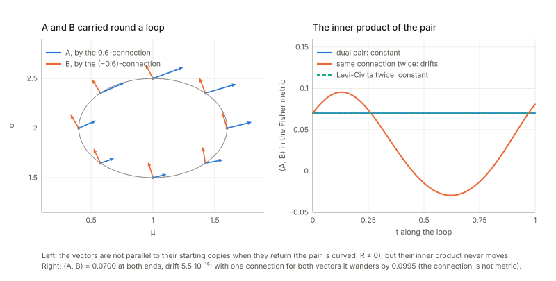
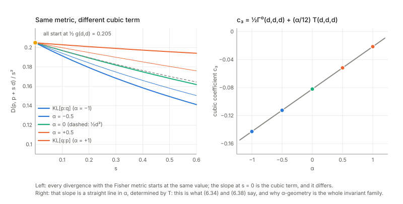
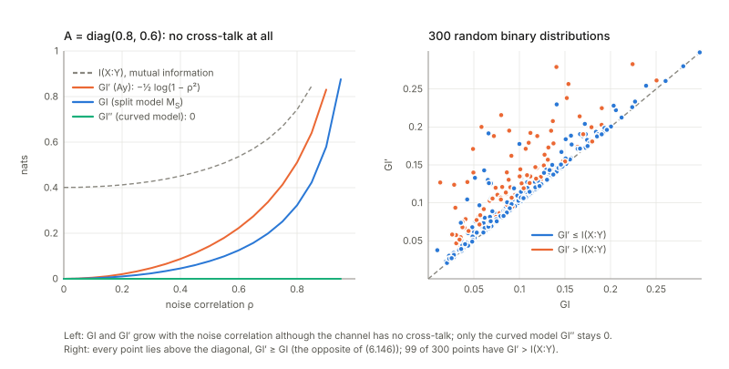

## Links

- **[Interactive companion](figures/interactive.html)**: seven widgets, run in the browser with the same mathematics as the script. (1) A loop on the Gaussian manifold: carry $A$ by $\nabla^{(\alpha)}$ and $B$ by $\nabla^{(-\alpha)}$ and watch $\langle A,B\rangle$ stay put, then use one connection for both. (2) Eguchi's construction: pick a divergence, get $g$, $\Gamma$, $\Gamma^*$, $T$ by finite differences and compare with the closed forms; add a cubic or a quartic term. (3) The $\alpha$-geodesics of the probability triangle and the curvature coefficient $(1-\alpha^2)/4$. (4) The canonical divergence (6.80) of a dual pair by geodesic shooting, next to the $\alpha$-divergences, and the angle of the projection condition (6.81). (5) Two binary neurons: the Fisher metric in mixed coordinates against the covariance chart, and the decomposition of $\mathrm{KL}$ through $r$ and $r'$. (6) A Gaussian channel: mutual information, $GI$, $GI'$, $GI''$ and the projected gain matrix. (7) A $3\times3$ input–output table under RAS scaling: margins, interactions and the decomposition.
- **[Runnable checks](https://github.com/msrepo/information_geometry_notes/tree/main/chapters/ch06-dual-connections/code)**: `code/dual_connections.py` prints every number on this page and regenerates the figures with `python3 code/dual_connections.py --figures`; `make verify` runs it in about six seconds, deterministically (finite differences, RK4 geodesics, Newton; the only random numbers are seeded).
- The book: Amari, *Information Geometry and Its Applications* (Springer, 2016), DOI [10.1007/978-4-431-55978-8](https://doi.org/10.1007/978-4-431-55978-8). These notes cover Chapter 6 only; equation numbers such as (6.80) refer to the book. No text of the book is reproduced here; everything is restated and re-derived.
- Neighbouring chapters: **[Chapter 5: elements of differential geometry](../ch05-elements-of-differential-geometry/index.html)** (connections, curvature, embedding curvature: the toolbox used here), **[Chapter 7: asymptotic theory of inference](../ch07-asymptotic-theory-of-inference/index.html)** (uses the e-/m-connections and their embedding curvatures; §"What Chapters 5 and 7 use" below checks that the three chapters agree), **[Chapters 1](../ch01-dually-flat-structure/index.html) and [2](../ch02-exponential-and-mixture-families/index.html)** (the dually flat structure from a convex function, now derived from connections), **[Chapter 3](../ch03-invariant-geometry/index.html) and [Chapter 4](../ch04-alpha-geometry/index.html)** (the invariant $\alpha$-geometry), [Chapter 8](../ch08-hidden-variables/index.html) (hidden variables) and [Chapter 11](../ch11-machine-learning/index.html) (graphical models).
  Background on the annotations site: **[The Fisher information matrix](https://msrepo.github.io/theory_inclined_papers_with_annotations/fisher-information/)**.

## In one paragraph

Chapter 5 gave one way to compare vectors at nearby points (one affine connection) and showed that the Fisher metric picks out one of them, Levi-Civita, which keeps lengths. This chapter lets **two connections share the work**: carry one vector with $\nabla$ and the other with $\nabla^*$, and demand only that their inner product never changes. Given the metric $g$, a connection has exactly one such partner, and the pair (with both connections symmetric, the book's standing assumption) is described by the metric together with one more object, a symmetric three-index array $T$, the **cubic tensor**: $\Gamma=\Gamma^0-\tfrac12T$, $\Gamma^*=\Gamma^0+\tfrac12T$, and the average of the two is Levi-Civita. A **divergence** produces such a triple $(g,\Gamma,\Gamma^*)$ from its behaviour near the diagonal (second order: $g$; third order: $T$), and every statistical manifold carries a one-parameter family, the **$\alpha$-connections**, of which $\alpha=+1$ is the e-connection and $\alpha=-1$ the m-connection. When one of the two connections is flat so is the other, and then there are two affine coordinate systems, $\theta$ for $\nabla$ and $\eta$ for $\nabla^*$, locked together by a convex potential $\psi$ and its Legendre dual: this is the dually flat structure of Chapter 1, now derived instead of postulated, and its canonical divergence is the Bregman divergence. Fixing some coordinates in $\eta$ and the others in $\theta$ gives **mixed coordinates** that split a manifold into two orthogonal foliations; the chapter's two applications use them to separate firing rates from interactions of neurons, to define a geometric measure of integrated information, and to separate gross output from interaction in an input–output table.

## The spine of the argument

1. Two connections $\nabla,\nabla^*$ are **dual** for the metric if parallel transport keeps $\langle A,B\rangle$ when $A$ goes by $\nabla$ and $B$ by $\nabla^*$: $\partial_kg_{ij}=\Gamma_{kij}+\Gamma^*_{kji}$ (6.6). The average is the Levi-Civita connection; the difference is a symmetric tensor $T$ with $\nabla g=T$, $\nabla^*g=-T$ (§6.1).
2. A **divergence** $D[\xi:\xi']$ induces $g^D=-D_{i;j}$, $\Gamma^D_{ijk}=-D_{ij;k}$, $\Gamma^{D*}_{ijk}=-D_{k;ij}$, and these are dual (Eguchi, §6.2). A convex function induces the dually flat pair with $T=\nabla^3\psi$.
3. The **invariant** divergences ($f$-divergences) give $g$ and $\alpha T$; so $\alpha$-geometry, with $\Gamma^{(\alpha)}=\Gamma^0-\tfrac\alpha2T$, is the invariant family (§6.3–6.4).
4. If $R=0$ for $\nabla$ then $R^*=0$ (the holonomy argument): a **dually flat** manifold has coordinates $\theta$ with $\Gamma=0$ and $\eta$ with $\Gamma^*=0$, biorthogonal, $g=\partial\eta/\partial\theta$, and a pair of potentials $\psi,\varphi$ (§6.5).
5. In a dually flat manifold the **canonical divergence** is the Bregman divergence $\psi(\theta)+\varphi(\eta')-\theta\cdot\eta'$, unique up to the choice of affine charts and linear terms; for exponential families it is the KL divergence with its arguments reversed (§6.6).
6. For a general dual pair one can still define a canonical divergence from geodesics: $D=\tfrac12(\tilde D+\tilde D^*)$ with $\tilde D=\int_0^1 t\,g(\dot\xi,\dot\xi)\,dt$; it returns the original $(g,T)$, the Bregman divergence in the flat case and half the squared distance when $T=0$ (§6.7).
7. Mixed coordinates $(\eta_1..\eta_k;\theta^{k+1}..\theta^n)$ have an orthogonal metric and cut the manifold into an m-flat and an e-flat foliation; the divergence splits into a "first part" and a "second part" (§6.8).
8. Applications: the log-linear model of binary neurons (rates against interactions), the geometric integrated information $GI$ as a KL distance to a split model, and input–output tables (§6.8–6.10).

## Setup and notation

| Symbol | Meaning | In the running examples |
|---|---|---|
| $\nabla,\Gamma_{ij}{}^k$ | connection, $\nabla_{e_i}e_j=\Gamma_{ij}{}^ke_k$; first index = direction of differentiation (as in Chapter 5) | |
| $\Gamma_{ijk}$ | lowered, $\Gamma_{ij}{}^mg_{mk}=\langle\nabla_{e_i}e_j,e_k\rangle$ | |
| $\nabla^*,\Gamma^*$ | the dual connection, (6.6) | |
| $\Gamma^0=\tfrac12(\Gamma+\Gamma^*)$ | the average, Levi-Civita when both are symmetric (6.9) | |
| $T_{ijk}=\Gamma^*_{ijk}-\Gamma_{ijk}$ | the cubic tensor (6.11); for distributions $T=\mathbb E[\partial_il\,\partial_jl\,\partial_kl]$ | Gaussians at $(1,2)$: $T_{\mu\mu\sigma}=0.25$, $T_{\sigma\sigma\sigma}=1.0$ |
| $\Gamma^{(\alpha)}$ | $\alpha$-connection $\Gamma^0-\tfrac\alpha2T$ (6.38); $+1$ is the e-connection (flat in $\theta$), $-1$ the m-connection (flat in $\eta$) | e: $\Gamma_{\mu\sigma}{}^\mu=-1.0$, $\Gamma_{\sigma\sigma}{}^\sigma=-1.5$; m: $\Gamma_{\mu\mu}{}^\sigma=\Gamma_{\sigma\sigma}{}^\sigma=0.5$ |
| $D[\xi:\xi']$, $D_{i;j}$, $D_{ij;k}$ | divergence and its derivatives on the diagonal, unprimed index = first argument (6.19)–(6.21) | |
| $\psi(\theta),\varphi(\eta)$ | potential and its Legendre dual, $\psi+\varphi-\theta\cdot\eta=0$ (6.55) | |
| $\partial_i,\ \partial^i$ | derivative in $\theta$, in $\eta$; $e_i=\partial_i$, $e^i=\partial^i$, $\langle e_i,e^j\rangle=\delta_i^j$ (6.48) | |
| $D_\psi[\theta:\theta']$ | Bregman divergence $\psi(\theta)+\varphi(\eta')-\theta\cdot\eta'$ (6.68) $=\mathrm{KL}[p_{\theta'}\Vert p_\theta]$ | |
| $\xi=(\eta_1..\eta_k;\theta^{k+1}..\theta^n)$ | mixed coordinates; $M^*(c)$ (fix the $\eta$ part, m-flat), $M(d)$ (fix the $\theta$ part, e-flat) | |
| $GI,GI'$ | geometric integrated information, KL distance to the split models $M_S\supset M_S'$ | |

**Running examples.**

| Space | Chart | Used for |
|---|---|---|
| Gaussian manifold | $(\mu,\sigma)$, $g=\operatorname{diag}(1/\sigma^2,2/\sigma^2)$ | closed-form e-, m-, Levi-Civita and $\alpha$-connections (Chapter 5); every divergence computation |
| probability simplex $S_2$ (three outcomes) | m-chart $(p_1,p_2)$, $g=\operatorname{diag}(1/p_i)+1/p_3$, $\Gamma^{(\alpha)}_{ijk}=-\tfrac{1+\alpha}2T_{ijk}$ | curvature of $\alpha$-geometry, the sphere, the projection condition |
| a random metric with a random symmetric connection on $\mathbb R^2$ | $x\in\mathbb R^2$ | identities that should hold with no special structure; counterexample hunts |
| two and three binary neurons; $2\times2$ binary and Gaussian channels; a $3\times3$ table | log-linear coordinates | §6.8–6.10 |

Everything is computed twice where possible: a closed form against finite differences or integration, or an identity against a counterexample hunt. The convention for $D$ is the book's: $D[\xi:\xi']$ with the first argument the point at which the derivatives $\partial_i$ act, so $D_\psi[\theta:\theta']=\mathrm{KL}[p_{\theta'}\Vert p_\theta]$ is **reversed** relative to the usual $\mathrm{KL}[p\Vert q]$ (as in Chapter 1's notes).

## 1. Dual connections (§6.1)

**In plain words.** A metric says how long vectors are at one point. A connection says what "the same vector" means at the next point. For the Levi-Civita connection "the same" preserves lengths and angles, so carrying both vectors with it keeps $\langle A,B\rangle$. The new idea is to carry the two vectors with *different* connections and still keep $\langle A,B\rangle$. That asks a lot of the pair, but for every connection $\nabla$ and every metric a partner $\nabla^*$ exists (symmetric too under a condition checked below), and in statistics it is the pair that matters: the e-connection and the m-connection are not metric on their own, yet they are partners.

**Example with ordinary numbers.** On the Gaussians at $(\mu,\sigma)=(1,2)$ the e-connection has $\Gamma_{\mu\sigma}{}^\mu=-1.0$, $\Gamma_{\sigma\sigma}{}^\sigma=-1.5$ and the m-connection has $\Gamma_{\mu\mu}{}^\sigma=\Gamma_{\sigma\sigma}{}^\sigma=0.5$ (Chapter 5). Neither preserves the metric, but the Fisher metric changes along $e_k$ by exactly what the pair accounts for.

**The statement.** Transport a basis vector from $\xi+d\xi$ back to $\xi$ with $\nabla$ and another with $\nabla^*$, require the inner product to be unchanged and expand to first order (6.2)–(6.5):
$$\partial_kg_{ij}=\Gamma_{kij}+\Gamma^*_{kji}\qquad(6.6),\qquad Z\langle X,Y\rangle=\langle\nabla_ZX,Y\rangle+\langle X,\nabla^*_ZY\rangle\quad(6.7).$$
So $\Gamma^*_{ijk}=\partial_ig_{jk}-\Gamma_{ikj}$ determines $\nabla^*$ from $(g,\nabla)$, and $(\nabla^*)^*=\nabla$ is automatic. The average $\Gamma^0=\tfrac12(\Gamma+\Gamma^*)$ satisfies the metric condition (6.9)–(6.10).

*Checks.* On the Gaussians $\max\lvert\partial_kg_{ij}-\Gamma^e_{kij}-\Gamma^m_{kji}\rvert=2.8\times10^{-11}$; the dual of the e-connection built from $g$ by (6.6) is the m-connection ($5.7\times10^{-11}$) and $(e^*)^*=e$ exactly; $\Gamma^m-\Gamma^e$ is the expectation $\mathbb E[\partial_il\partial_jl\partial_kl]$ ($2\times10^{-16}$). On the simplex the dual of the $\alpha$-connection is the $(-\alpha)$-connection for $\alpha=-1,0,0.5,1$ ($4.5\times10^{-9}$), and $(\Gamma^{(0.5)}+\Gamma^{(-0.5)})/2$ is the Levi-Civita symbol (5.85) of $g$ ($1.2\times10^{-8}$; $1.4\times10^{-11}$ on the Gaussians).

**Parallel transport tells the same story** (equation (6.1), the picture below). Round the ellipse $\mu=1+0.6\cos2\pi t$, $\sigma=2+0.5\sin2\pi t$, carry $A=(1,0.3)$ by the $0.6$-connection and $B=(-0.2,0.8)$ by the $(-0.6)$-connection: $\langle A,B\rangle=0.070000$ at the start and at the end, largest drift $5.5\times10^{-15}$, although neither vector returns to itself ($\lvert A_{\rm end}-A_0\rvert=0.0742$, $\lvert B_{\rm end}-B_0\rvert=0.1222$) because the pair is curved. With the same $0.6$-connection for both the inner product wanders by $0.0995$; with Levi-Civita for both it is constant ($8.8\times10^{-15}$); with the flat pair e/m it is constant ($1.4\times10^{-14}$) and both vectors come back exactly. The holonomy matrices of the pair satisfy $H^{\mathsf T}gH^*=g$ ($8.6\times10^{-14}$): the dual holonomy is the $g$-adjoint inverse of the primal one, which is the entire proof of Theorem 6.5 below.

**The cubic tensor (Theorem 6.1).** Put $T_{ijk}=\Gamma^*_{ijk}-\Gamma_{ijk}$ (6.11); then $\Gamma=\Gamma^0-\tfrac12T$, $\Gamma^*=\Gamma^0+\tfrac12T$ (6.12), and $\nabla_ig_{jk}=T_{ijk}$ (6.13), $\nabla^*_ig_{jk}=-T_{ijk}$. Check: both to $2.8\times10^{-11}$. The Riemannian case is $T=0$. Three remarks.

- **Hypothesis: both connections symmetric.** The book assumes it from the start. But the dual of a symmetric connection is symmetric only if $\nabla g$ is a symmetric (Codazzi) tensor: $(\nabla_ig)_{jk}=(\nabla_jg)_{ik}$. On a random metric with a random symmetric connection on $\mathbb R^2$ the dual has torsion $0.7828$, equal to the Codazzi defect to $4.4\times10^{-16}$; the average of the pair is metric ($2.8\times10^{-16}$) but has torsion $0.3914$, so it is *not* Levi-Civita; and $T=\Gamma^*-\Gamma$ is symmetric in its last two indices ($4.4\times10^{-16}$, a consequence of (6.6) and the symmetry of $g$) but not in its first two ($1.2156$). The proof's step from (6.17) to (6.18) is therefore compressed: the symmetry of $T$ in $(j,k)$ must be derived from (6.6) first, and the symmetry in $(i,j)$ is the hypothesis.
- **The sign in (6.14).** (6.14) is printed as $\nabla^{*i}g^{jk}=-T^{ijk}$, all indices up. For the inverse metric *tensor* the sign is $+$: $\nabla^*_ig^{jk}=+T_i{}^{jk}$ (two routes, $2.6\times10^{-11}$; with the minus the discrepancy is $8.0000$). The printed minus is right if $g^{jk}$ means the components of the metric in the dual chart $\eta$ (numerically the inverse matrix), because then it is just (6.13) for $\nabla^*$ written in a chart where $\nabla^*=\partial$: $\partial^i\partial^j\partial^k\varphi=-T^{ijk}$. That is the sign that (6.32) and (6.58) lack (§2).
- **Submanifolds** (not in this chapter, but Chapter 7 runs on them). If $S$ is a submanifold, the tangential parts of $\nabla_{e_a}e_b$ and $\nabla^*_{e_a}e_b$ are again a dual pair for the induced metric: for the curve $N(u,u^2)$ at $u=1$ ($g_{uu}=3$) the induced m-coefficient is $\Gamma^{(m)u}{}_{uu}=\eta''\!\cdot\theta'/g_{uu}=4/3$ (computed from the $(\mu,\sigma)$ connection coefficients: $1.333333$), the induced e-coefficient is $\theta''\!\cdot\eta'/g_{uu}=-10/3$, and their sum is $-2=g_{uu}'/g_{uu}$, equation (6.6) on $S$. The normal part of $\theta''$ has squared Fisher length $2/3$ and gives Efron's $\gamma^2=2/27=0.074074$. For a two-dimensional surface in the simplex $S_3$, $\alpha=0.4$, the induced $\alpha$- and $(-\alpha)$-connections satisfy (6.6) with the induced metric to $5.0\times10^{-11}$. These ($4/3$, $2/27$ and the duality on $S$) are the quantities Chapter 7 uses.

## 2. Metric and cubic tensor derived from a divergence (§6.2)

**In plain words.** A divergence $D[\xi:\xi']$ is a stand-in for squared distance: zero on the diagonal, positive nearby. Look at what happens close to the diagonal. The first derivatives vanish, so $D$ starts with a quadratic term, and the quadratic form is a metric. The next term, cubic, is new: it knows which of the two arguments is "from" and which is "to", and it is exactly the extra information a pair of connections carries.

**The statement.** With $D_i=\partial_iD|_{\xi'=\xi}$, $D_{;i}=\partial'_iD|_{\xi'=\xi}$ and so on (6.19)–(6.21), define $g^D_{ij}=-D_{i;j}$, $\Gamma^D_{ijk}=-D_{ij;k}$, $\Gamma^{D*}_{ijk}=-D_{k;ij}$ (6.22)–(6.24). Theorem 6.2 (Eguchi): they are dual for $g^D$; the proof is the one line $\partial_kg^D_{ij}=-D_{ki;j}-D_{i;jk}$ (6.27). I derive the pair directly from the Taylor expansion $D[\xi:\xi+\delta]=\tfrac12g_{ij}\delta^i\delta^j+\tfrac16C_{ijk}\delta^i\delta^j\delta^k+O(\delta^4)$ with $C$ symmetric:
$$\Gamma^D_{ijk}=\partial_ig_{jk}+\partial_jg_{ik}-C_{ijk},\qquad\Gamma^{D*}_{ijk}=C_{ijk}-\partial_kg_{ij},\qquad T^D_{ijk}=2C_{ijk}-(\partial_ig_{jk}+\partial_jg_{ik}+\partial_kg_{ij}).$$

*Checks.* Computed by finite differences of $D$ alone ($h=0.01$, Richardson) at $(\mu,\sigma)=(1,2)$, against the closed forms of Chapter 5:

| Divergence | $g$ error | $\Gamma^D$ against | $\Gamma^{D*}$ against | $T^D-\alpha T$ |
|---|---|---|---|---|
| $\mathrm{KL}[p{:}q]$ | $2.3\times10^{-10}$ | $\Gamma^{(-1)}$, the m-connection: $4.7\times10^{-10}$ | $\Gamma^{(+1)}$, e: $4.2\times10^{-9}$ | $4.7\times10^{-9}$ ($\alpha=-1$) |
| $\mathrm{KL}[q{:}p]$ | $2.3\times10^{-10}$ | $\Gamma^{(+1)}$: $4.2\times10^{-9}$ | $\Gamma^{(-1)}$: $4.7\times10^{-10}$ | $4.7\times10^{-9}$ ($\alpha=+1$) |
| $D_\alpha$, $\alpha=0$ | $4.4\times10^{-11}$ | $2.5\times10^{-9}$ | $2.5\times10^{-9}$ | $0$ |
| $D_\alpha$, $\alpha=0.5$ | $3.9\times10^{-11}$ | $2.1\times10^{-9}$ | $1.5\times10^{-9}$ | $6.6\times10^{-10}$ |
| $D_\alpha$, $\alpha=-0.7$ | $2.1\times10^{-11}$ | $6.6\times10^{-9}$ | $4.3\times10^{-9}$ | $2.3\times10^{-9}$ |

($D_\alpha[p{:}q]=\tfrac4{1-\alpha^2}(1-\int p^{(1-\alpha)/2}q^{(1+\alpha)/2})$, whose Gaussian closed form I checked against quadrature to $10^{-10}$.) So $\mathrm{KL}[p{:}q]$, with the *first* argument the true distribution, gives $\Gamma^D=$ m-connection and $T^D=-T$, i.e. $\alpha=-1$; this is the orientation that Chapter 1's notes found and that the $\alpha$-labelling of (6.36) requires. The three expressions of the metric in (6.22) agree ($2.5\times10^{-11}$, $3.9\times10^{-9}$).

**A divergence that is neither Bregman nor an $f$-divergence.** To test the construction where no theory of the book applies, take $D=\tfrac12\delta\cdot M(\xi)\delta+\tfrac16C(\xi)[\delta,\delta,\delta]+$ quartic, with $M$ positive definite and $C$ symmetric, both varying with $\xi$ (random but fixed). The three formulas above hold to $2.4\times10^{-9}$ ($\Gamma^D$) and $1.4\times10^{-10}$ ($\Gamma^{D*}$), duality (6.27) to $2.2\times10^{-9}$, and $T^D$ is symmetric in all three indices to $2.2\times10^{-9}$ (Theorem 6.1 at work). **Half the squared Fisher–Rao distance** (a Riemannian divergence) gives $\Gamma^D=\Gamma^{D*}=$ the Levi-Civita symbol ($5.8\times10^{-10}$, $T^D=1.6\times10^{-14}$).

**Which divergences give the same geometry** (6.51)–(6.54). Only derivatives up to third order at the diagonal enter. Adding $3\lvert\delta\rvert^4+0.7\delta_1^2\delta_2^2+\tfrac12D^2$ changes $g$ by $8.0\times10^{-9}$, $\Gamma$ by $2.7\times10^{-7}$ and $\Gamma^*$ by $2.8\times10^{-8}$: nothing. Adding the cubic term $\tfrac12\delta_1^3$ changes $\Gamma$ and $\Gamma^*$ by $3.0000$, as the formulas predict ($\mp6\cdot\tfrac12$).

**One metric, a line of cubic terms** (picture). Along a ray $D[p:p+sd]=\tfrac12g(d,d)s^2+c_3s^3+\dots$ with $c_3=\tfrac12\Gamma^0(d,d,d)+\tfrac\alpha{12}T(d,d,d)$. At $(1,2)$, $d=(0.6,0.8)$ ($\tfrac12g(d,d)=0.205000$, $\Gamma^0(d,d,d)=-0.164000$, $T(d,d,d)=0.728000$) the six divergences give $c_3=-0.142666$ for $\mathrm{KL}[p{:}q]$ ($\alpha=-1$), $-0.112333$ ($\alpha=-0.5$), $-0.082000$ for $D_0$ and for half the squared distance ($\alpha=0$, which differ only at fourth order), $-0.051667$ ($\alpha=+0.5$) and $-0.021333$ for $\mathrm{KL}[q{:}p]$, against the prediction to $10^{-6}$ or better.

**Transformation law.** The book omits the check that $\Gamma^D$ transforms as a connection. Computed directly in the natural parameters $\theta$ it agrees with law (5.37) applied to the $(\mu,\sigma)$ result to a relative $8.9\times10^{-6}$ (the entries are of order $10^2$; the tensor part alone is off by $640$), and in the chart $(\mu,\log\sigma)$ to $1.3\times10^{-8}$ (tensor part alone off by $2.000$). In $\theta$, $\Gamma^{D*}=0$ and $\Gamma^D=\partial^3\psi=(0,32,128,896)$ for the entries $111,112,122,222$.

**The Bregman case** (6.28)–(6.32). On the simplex with $\psi=\log(1+e^{\theta_1}+e^{\theta_2})$: $D_\psi[\theta:\theta']=0.0790542059=\mathrm{KL}[p_{\theta'}\Vert p_\theta]$ (arguments reversed). In $\theta$: $g=\psi''$ ($1.9\times10^{-12}$), $\Gamma=0$ ($5.8\times10^{-10}$), $\Gamma^*=\psi'''$ ($8.7\times10^{-10}$). In $\eta$: $g=\varphi''$, $\Gamma^*=0$, $\Gamma=\varphi'''$. **A sign.** The cubic tensor's components in the $\eta$ chart, $T(\partial^i,\partial^j,\partial^k)=\Gamma^*-\Gamma$, equal $-\partial^i\partial^j\partial^k\varphi$: at $p=(0.4260,0.2584,0.3156)$, $T(\partial^1,\partial^1,\partial^1)=-4.529913$ and $\varphi'''_{111}=+4.529913$. The book prints $T^{ijk}=\partial^i\partial^j\partial^k\varphi$ in (6.32) and (6.58). That is the cubic tensor of the *dual* structure $(g,-T)$, or a sign slip; it contradicts the book's own (6.14) read in the $\eta$ chart.

## 3. Invariant metric and cubic tensor (§6.3)

**In plain words.** A divergence between distributions should not care how you encode the outcomes (merging or splitting outcomes in a way that loses nothing). The $f$-divergences $D_f[p:q]=\int p\,f(q/p)$ are the invariant ones. Theorem 6.3 says that the two tensors they induce are the Fisher metric and a multiple of $T=\mathbb E[\partial_il\,\partial_jl\,\partial_kl]$, with the multiple fixed by two derivatives of $f$.

**The statement.** For $f(1)=0$, $f''(1)=1$: $g^f=g$, $T^f=\alpha T$ with $\alpha=2f'''(1)+3$ (6.33)–(6.36). Without the normalisation, the finite-difference computation says $g^f=f''(1)\,g$ and $T^f=(2f'''(1)+3f''(1))\,T$. On the simplex at $p=(0.3,0.25,0.45)$:

| $f$ | $f''(1)$ | $f'''(1)$ | $g^f/g$ | $T^f/T$ | $2f'''+3f''$ |
|---|---|---|---|---|---|
| $-\log u+u-1$ ($\mathrm{KL}[p{:}q]$) | 1 | $-2$ | 1.000000 | $-1.000000$ | $-1$ |
| $u\log u-u+1$ ($\mathrm{KL}[q{:}p]$) | 1 | $-1$ | 1.000000 | $1.000000$ | $1$ |
| $\alpha=0$ (Hellinger) | 1 | $-1.5$ | 1.000000 | $0.000000$ | $0$ |
| $\alpha=0.5$ | 1 | $-1.25$ | 1.000000 | $0.500000$ | $0.5$ |
| $\alpha=-0.7$ | 1 | $-1.85$ | 1.000000 | $-0.700000$ | $-0.7$ |
| Pearson $(u-1)^2/2$ | 1 | $0$ | 1.000000 | $2.999999$ | $3$ |
| Neyman $(u-1)^2/(2u)$ | 1 | $-3$ | 1.000000 | $-2.999999$ | $-3$ |
| Jensen–Shannon | $\tfrac12$ | $-0.75$ | 0.500000 | $0.000000$ | $0$ (and $2f'''+3=1.5$ would be wrong) |

So the book's $\alpha$ is right for the standard normalisation, covers values outside $[-1,1]$ ($\chi^2$ is $\alpha=3$), and a symmetric divergence such as Jensen–Shannon has $T=0$, as it must. The remark that $g$ and $\alpha T$ are the *only* invariant tensors is Chentsov's theorem, which I did not test (it quantifies over all possible tensors).

## 4. α-geometry (§6.4)

**In plain words.** Multiplying $T$ by a real number $\alpha$ leaves it a symmetric tensor, so $(g,\alpha T)$ defines a dual pair, $\Gamma^{(\alpha)}=\Gamma^0-\tfrac\alpha2T$ and its partner $\Gamma^{(-\alpha)}$ (6.38). $\alpha=0$ is Levi-Civita, $\alpha=1$ the e-connection, $\alpha=-1$ the m-connection. On an exponential family $\alpha=\pm1$ are flat; in between the manifold is curved.

**Checks.** (i) $\Gamma^{(\alpha)}_{ijk}=\Gamma^0_{ijk}-\tfrac\alpha2T_{ijk}$ equals the expectation $\mathbb E[(\partial_i\partial_jl+\tfrac{1-\alpha}2\partial_il\,\partial_jl)\partial_kl]$ and the mixture $\tfrac{1+\alpha}2\Gamma^e+\tfrac{1-\alpha}2\Gamma^m$ to $3.9\times10^{-16}$ ($\alpha=-1,-0.5,0,0.5,1$ on the Gaussians), and $\alpha=1$ gives the e-connection of Chapter 5 ($-1.0$, $-1.5$ at $(1,2)$). (ii) **Curvature.** Chapter 5 found that the average $(1-s)\Gamma^e+s\Gamma^m$ has curvature $4s(1-s)$ times Levi-Civita's; with $s=\tfrac{1-\alpha}2$ that is $1-\alpha^2$. Using $K=g_{1m}R_{122}{}^m/\det g$: on the Gaussians $K^{(0)}=-0.500000$ and $K^{(\alpha)}=-0.455000,-0.375000,-0.180000$ at $\alpha=-0.3,0.5,0.8$; on the simplex $K^{(0)}=+0.250000$ (a sphere of radius 2) and $K^{(\alpha)}=0.227500,0.187500,0.090000$; both exactly $(1-\alpha^2)K^{(0)}$ (the tensors agree to $10^{-9}$), and $0$ at $\alpha=\pm1$. So for these two families the book's remark that $\alpha$-geometry is generally not dually flat becomes precise: flat only at $\pm1$.

(iii) **The Jensen-type divergence** (6.39) for the cumulant function of the simplex at $\theta=(0.3,-0.2)$: $g=\psi''$ to $10^{-10}$, $T^D=\alpha T$ and $\Gamma^D=\tfrac{1-\alpha}2T=\Gamma^{(\alpha)}$ for $\alpha=0,\pm0.5,0.9,2,-3$ (errors below $1.4\times10^{-8}$), and $D\ge0$ also for $\lvert\alpha\rvert>1$ (when one weight is negative the prefactor $4/(1-\alpha^2)$ is too, which is why it still works). At $\alpha=\pm0.9999$ it equals the Bregman divergences ($0.079054$ against $D_\psi[\theta:\theta']=0.079054$; $0.073837$ against $D_\psi[\theta':\theta]=0.073836$). Likewise $D_\alpha$ of the Gaussians tends to $\mathrm{KL}[q{:}p]$ ($0.187036$ against $0.187033$) at $\alpha\to1$ and to $\mathrm{KL}[p{:}q]$ ($0.359137$ against $0.359158$) at $\alpha\to-1$.

## 5. Dually flat manifold (§6.5)

**In plain words.** Flatness of a connection means that parallel transport does not depend on the path. If it holds for $\nabla$ it holds for its partner, because the holonomy of $\nabla^*$ is the $g$-adjoint inverse of the holonomy of $\nabla$ (the identity $H^{\mathsf T}gH^*=g$ above): if one is the identity, so is the other. Then there are two straight coordinate systems.

**The statement.** Theorem 6.5: $R=0\iff R^*=0$. The curvature tensors in fact satisfy a stronger identity, the standard consequence of applying (6.7) twice and commuting the covariant derivatives: $R_{ijkl}+R^*_{ijlk}=0$ with $R_{ijkl}=R_{ijk}{}^mg_{ml}$ (I checked it numerically rather than re-deriving it). It holds on four examples, flat or not: the random pair ($\max\lvert R\rvert=1.0041$, $\max\lvert R^*\rvert=1.1268$, identity to $5.5\times10^{-8}$), the Gaussians at $\alpha=0.5$ ($0.1875$ each, $1.4\times10^{-12}$), the simplex at $\alpha=0.5$ ($1.1667$ each, $2.0\times10^{-8}$) and the e-connection ($0$, $0$). In a dually flat manifold there are charts $\theta$ ($\Gamma(\theta)=0$, each coordinate line a geodesic) and $\eta$ ($\Gamma^*(\eta)=0$) with $g_{ij}=\partial\eta_i/\partial\theta^j$, $g^{ij}=\partial\theta^i/\partial\eta_j$ (6.46) and $\langle e_i,e^j\rangle=\delta_i^j$ (Theorem 6.6). On the Gaussians at $(1,2)$: $\partial\eta/\partial\theta=g(\theta)=\left[\begin{smallmatrix}4&8\\8&48\end{smallmatrix}\right]=\operatorname{Cov}[(x,x^2)]$ ($5.4\times10^{-9}$), $\partial\theta/\partial\eta=g^{-1}$ ($2.0\times10^{-11}$), the pairing is the identity ($1.1\times10^{-10}$), and the $\theta$-frame carried by the e-connection and the $\eta$-frame carried by the m-connection from $(1,2)$ to $(2.50,1.44)$ stay biorthogonal ($1.1\times10^{-10}$) and coincide with the coordinate frames there ($4.7\times10^{-10}$, $2.5\times10^{-10}$), equation (6.50).

**The symmetric hypothesis again.** The book's remark that flatness for one connection already makes a manifold dually flat needs the dual to be symmetric as well. Counterexample: $\nabla$ flat ($\Gamma=0$ in the chart $x$) and $g=\operatorname{diag}(1,e^{x_1})$. Then $\Gamma^*_{12}{}^2=1.0000$ and $\Gamma^*_{21}{}^2=0$: the dual has torsion $1.0000$, and $R^*=0$ exactly, as Theorem 6.5 says, but no coordinate system makes $\Gamma^*$ vanish (a torsion cannot be removed by a change of chart). This metric is not a Hessian: $\partial_1g_{22}\ne\partial_2g_{12}$. So the book's conclusion holds exactly under its standing assumption that both connections are symmetric, and the assumption is equivalent to $g$ being a Hessian in the flat chart (Lemma 6.1).

## 6. Canonical divergence in a dually flat manifold (§6.6)

**In plain words.** Many divergences give the same $(g,\Gamma,\Gamma^*)$ (they differ at fourth order and beyond). A dually flat manifold has a *distinguished* one: reconstruct the potential $\psi$ from the metric and form the Bregman divergence. No arbitrary choice is left.

**The statement.** *Lemma 6.1:* in the flat chart $\theta$ the dual connection's symmetry says $\partial_ig_{jk}=\partial_kg_{ji}$ (6.60), which is the integrability condition for a function $\psi$ with $g_{ij}=\partial_i\partial_j\psi$ (6.62)–(6.66) (the Poincaré lemma; locally, on a simply connected chart); then $T_{ijk}=\partial_i\partial_j\partial_k\psi$ and $\eta_i=\partial_i\psi$ is the dual chart. *Theorem 6.7:* the canonical divergence $D[\theta:\theta']=\psi(\theta)+\varphi(\eta')-\theta\cdot\eta'$ (6.68) is independent of the choices (6.69)–(6.71). *Theorem 6.8:* for an exponential family it is the KL divergence.

*Checks.* For a convex potential that is not a cumulant function ($\log(1+e^{\theta_1}+e^{\theta_2})$ plus a positive quadratic): (6.60) holds ($8.3\times10^{-12}$); integrating $g$ along rays recovers $\psi$ up to the affine function $\psi(0)+\nabla\psi(0)\cdot\theta$ at six points ($4.4\times10^{-16}$); and $\eta=\nabla\psi$ is indeed the affine chart of $\nabla^*$ — the connection that makes $\eta$ straight has $\Gamma_{ij}{}^m=(\partial^2\eta_a/\partial\theta^i\partial\theta^j)(\partial\theta^m/\partial\eta_a)$, which equals $\Gamma^*_{ij}{}^m=g^{mk}\partial_ig_{jk}$ to $5.0\times10^{-9}$. The reconstruction uses nothing but $g$ and the symmetry.

**A slip in (6.69).** Under $\tilde\theta=A\theta+b$ the dual coordinates must transform with the inverse **transpose**, $\tilde\eta=A^{-\mathsf T}\eta+c$, so that $\tilde\eta\cdot d\tilde\theta=\eta\cdot d\theta$ and $\tilde\eta=\nabla\tilde\psi$. The printed $A^{-1}\eta+c$ is correct only for symmetric $A$: for $A=\left[\begin{smallmatrix}1.3&0.4\\-0.6&0.9\end{smallmatrix}\right]$, $\nabla\tilde\psi$ differs from $A^{-\mathsf T}\eta+a$ by $0$ and from the printed formula by $0.6564$; for a symmetric $A$ ($0.4$ in the corner) they agree ($5.6\times10^{-17}$). With the correct transformation (and the added linear term and constant of (6.70)) the canonical divergence is unchanged: $0.681028332478$ in both charts.

**Orientation.** The identity behind every Pythagorean statement in this chapter is, for the divergence (6.68),
$$D[P{:}R]+D[R{:}Q]-D[P{:}Q]=(\theta_R-\theta_P)\cdot(\eta_R-\eta_Q)$$
($0.5713821353$ on both sides in the example). It vanishes when the $\theta$-straight segment $PR$ is orthogonal to the $\eta$-straight segment $RQ$: the "primal" geodesic comes first. Remember also that $D_\psi[\theta:\theta']=\mathrm{KL}[p_{\theta'}\Vert p_\theta]$; this matters in §8.

## 7. Canonical divergence in a general manifold of dual connections (§6.7)

**In plain words.** Away from the dually flat case there is no potential, but the geodesics still exist, and a divergence can be built from them: how much "kinetic energy" must you spend going from $p$ to $q$ along the geodesic, weighting late parts of the path more ($\tilde D$) or earlier parts more ($\tilde D^*$, along the *dual* geodesic), and average. The result reproduces the structure it was built from.

**The definition.** $\tilde D[p{:}q]=\int_0^1t\,g(\dot\xi,\dot\xi)\,dt$ along the $\nabla$-geodesic from $p$ to $q$, $\tilde D^*[p{:}q]=\int_0^1(1-t)\,g(\dot\xi^*,\dot\xi^*)\,dt$ along the $\nabla^*$-geodesic, $D=\tfrac12(\tilde D+\tilde D^*)$ (6.77)–(6.80). I solve the boundary-value problem for the geodesics by Newton shooting with RK4 (64 steps; closed-form accelerations agree with the tensor code to $10^{-16}$).

**Theorem 6.9, three claims.**

| Pair | $p\to q$ | $\tilde D$ | $\tilde D^*$ | $D$ | reference |
|---|---|---|---|---|---|
| e/m on the Gaussians | $(1,2)\to(1.8,2.7)$ | 0.191145409 | 0.191145409 | 0.191145409 | Bregman $\mathrm{KL}[q{:}p]=0.191145408$ |
| Levi-Civita on the Gaussians | same | 0.148161619 | 0.148161619 | 0.148161619 | half the squared distance $0.148161619$ |
| $\alpha=0.5$ pair on the Gaussians | same | 0.167623498 | 0.167623622 | 0.167623560 | $D_{0.5}[p{:}q]=0.162355277$, $D_{-0.5}=0.128799764$, $\tfrac12d^2=0.148161619$ |
| $\alpha=0$ on the simplex ($S_2$ is a sphere) | $(0.3,0.25)\to(0.4,0.3)$ | 0.049321669 | 0.049321669 | 0.049321669 | $2\arccos^2(\mathrm{BC})=0.049321669$; $4(1-\mathrm{BC})=0.049220393$ |

So the flat case gives the Bregman divergence and the Riemannian case half the squared distance (the weights $t$ and $1-t$ integrate a constant-speed geodesic to $\tfrac12d^2$). The $\alpha$-divergence is **not** this divergence away from $\alpha=\pm1$: for two coins $p=0.2$, $q=0.8$ (the Bhattacharyya coefficient is $0.8000$), $4(1-\mathrm{BC})=0.800000$ but half the squared Fisher–Rao distance is $0.828187$. The sentence in §6.7 saying that the $\alpha$-divergence is a canonical divergence of $S_n$ in Kurose's sense cannot refer to (6.80); it refers to Kurose's geometrical divergence, which I did not test.

**The first claim, that the geometry of $D$ is the original one,** reduces to the cubic Taylor coefficient. Expanding the geodesic $\xi(t)=p+tX-\tfrac12t^2\Gamma(X,X)$, $X=\delta+\tfrac12\Gamma(\delta,\delta)$, and integrating $t$ and $t^2$ gives
$$\tilde D=\tfrac12g\delta\delta+\left[-\tfrac16\Gamma_{(ijk)}+\tfrac13\partial_{(i}g_{jk)}\right]\delta^i\delta^j\delta^k+\dots,\qquad\tilde D^*=\tfrac12g\delta\delta+\tfrac16\left[\Gamma^*_{(ijk)}+\partial_{(i}g_{jk)}\right]\delta\delta\delta+\dots$$
($(\cdot)$ = full symmetrisation), and since $\partial_{(i}g_{jk)}=\Gamma_{(ijk)}+\Gamma^*_{(ijk)}$ by (6.6), **both pieces have the same cubic tensor** $C=\Gamma_{(ijk)}+2\Gamma^*_{(ijk)}$. By the formulas of §2, $T^D=2C-3\partial_{(i}g_{jk)}=\Gamma^*_{(ijk)}-\Gamma_{(ijk)}=T$ and $\Gamma^D=\Gamma$. Numerically, at $(1,2)$ with the $0.5$-pair, fitted from geodesics at 6 directions and 3 scales: $C_{111},C_{112},C_{122},C_{222}=0,-0.0625,0,-0.499998$ for **both** $\tilde D$ and $\tilde D^*$ against the prediction $0,-0.0625,0,-0.5$ ($1.7\times10^{-6}$); the structure of $D$ is $T^D=\alpha T$ to $3.4\times10^{-6}$ and $\Gamma^D=\Gamma^{(\alpha)}$ to $1.7\times10^{-6}$. So the averaging is not needed for this claim; what it buys is **self-duality**: the canonical divergence of the dual structure $(\nabla^*,\nabla)$ is $D$ with the arguments exchanged ($0.131947826151$ against $0.131947826150$), because reversing a geodesic exchanges the weights $t$ and $1-t$. $\tilde D$ and $\tilde D^*$ themselves differ beyond third order ($1.2\times10^{-7}$ here).

**Theorem 6.10, the projection condition.** The book says the geodesic projection theorem holds when $X(\xi_q,\xi_p)\propto-g^{-1}\partial'D[\xi_p{:}\xi_q]$ (6.81): the normal of the divergence ball at $q$ must point along the geodesic from $q$ to $p$. The book adds that it holds in the dually flat case and for the $\alpha$-divergence. I measure the angle between the two (five-point stencil in $q$), in degrees:

| Divergence, with the matching connection | Points | Largest angle |
|---|---|---|
| Bregman, $\alpha=\pm1$, Gaussians | $q=(1.8,2.7),(0.2,1.4),(1.4,1.5)$ | $1.8\times10^{-7}$ |
| $D_\alpha$, $\alpha=0.5$, **simplex** $S_2$ (also $0,-0.5,0.8$) | $q=(0.4,0.3),(0.2,0.45),(0.55,0.15)$ | $3.4\times10^{-7}$ ($8.9\times10^{-7}$ over all four $\alpha$) |
| $D_\alpha$, $\alpha=0,0.5,-0.5$, **Gaussians** | the three points above | $0.913,0.759,0.626$ at the first point; largest $1.271$ ($\alpha=0$) |
| canonical $D$ (6.80), $\alpha=0.5$ pair, Gaussians | $q=(1.8,2.7),(1.4,1.5)$ | $0.0113$, $0.0026$ |
| canonical $D$ (6.80), $\alpha=0.5$ pair, simplex | $q=(0.4,0.3),(0.2,0.45)$ | $7.3\times10^{-4}$, $2.2\times10^{-3}$ |

For the Bregman divergence of (6.68) the condition holds with the *primal* geodesic: minimising $D_\psi[\theta_p:\theta_q]=\mathrm{KL}[p_{\theta_q}\Vert p_{\theta_p}]$ over $q$ is the e-projection and its geodesic is the e-geodesic (both pairings $\alpha=\pm1$ agree to $1.8\times10^{-7}$ degrees), which is the consistent pairing that Chapter 1's notes found the printed Theorem 1.4 to have reversed. So the remark is true on the simplex, where the $\alpha$-divergence satisfies (6.81) to numerical precision, but **false on the Gaussian manifold** with its induced $\alpha$-connection (up to $1.3^\circ$, even for $\alpha=0$, where the divergence $4(1-\mathrm{BC})$ is not a function of the geodesic distance alone). The divergence (6.80) itself nearly satisfies the condition, and does not satisfy it exactly in these examples ($0.0113^\circ$ is far above the numerical error: the gradient $\partial'\tilde D$ differs from $g\dot\xi(1)$, which would be exact for Bregman and Riemannian divergences, by a relative $1.97\times10^{-4}$ at 64 and at 128 integration steps).

**The remark on constant curvature** (the generalised Pythagorean theorem of Chapter 4, cited at the start of §6.7). On $S_2$, if the $\alpha$-geodesic from $Q$ to $P$ is orthogonal at $Q$ to the $(-\alpha)$-geodesic from $Q$ to $R$, then $D_\alpha[P{:}R]=D_\alpha[P{:}Q]+D_\alpha[Q{:}R]-\tfrac{1-\alpha^2}4D_\alpha[P{:}Q]D_\alpha[Q{:}R]$, the coefficient being the curvature $K^{(\alpha)}$ of §4. For $P=(0.08,0.15)$, $Q=(0.5,0.3)$ and an orthogonal step of length $0.5$: $\alpha=0$: $D[P{:}Q]=0.781759$, $D[Q{:}R]=0.124350$, $D[P{:}R]=0.881806$, plain sum $0.906109$, corrected $0.881806$ (difference $4.7\times10^{-11}$); $\alpha=0.5$: $0.925167$ against $0.946205$ and $0.925167$; $\alpha=0.8$: $0.972212$ against $0.983509$ and $0.972212$; $\alpha=-0.5$: $0.873448$ against $0.890097$ and $0.873448$. The correction is exactly the curvature, and it disappears at $\alpha=\pm1$.

## 8. Dual foliations of a flat manifold and mixed coordinates (§6.8)

**In plain words.** Take an exponential family and swap *some* of the natural coordinates for their expectation partners. The new chart $(\eta_1,\dots,\eta_k;\theta^{k+1},\dots,\theta^n)$ is neither e-affine nor m-affine, but its two groups of coordinate directions are orthogonal. Fix the first group to get a leaf $M^*(c)$ (m-flat: it is cut out by linear equations in $\eta$); fix the second group to get a leaf $M(d)$ (e-flat). The two families of leaves foliate the manifold and cross at right angles, so a divergence between two points splits into "the part from the first group" and "the part from the second".

**Example with ordinary numbers.** Two binary neurons, $p(00,01,10,11)=(0.35,0.15,0.20,0.30)$. Firing rates $\eta_1=0.500$, $\eta_2=0.450$, joint rate $\eta_{12}=0.300$; natural parameters $\theta=(-0.5596,-0.8473,1.2528)$ with $\theta^{12}=\log\frac{p_{11}p_{00}}{p_{10}p_{01}}=1.2528$ (the log odds ratio: zero iff the neurons are independent). Mixed coordinates $(\eta_1,\eta_2;\theta^{12})$ separate the rates from the interaction.

**Orthogonality, and a notational slip.** In the mixed chart the Fisher metric is block diagonal (off-diagonal block $1.8\times10^{-11}$), (6.89)–(6.90). But the diagonal blocks are not what (6.90) prints. A coordinate vector $\partial/\partial\eta_i$ of the mixed chart holds the *other mixed coordinates* fixed, so it is not the coordinate vector $e^i$ of the pure $\eta$ chart. The $\eta$ block is $(G_{11})^{-1}=\left[\begin{smallmatrix}4.4000&-1.3333\\-1.3333&4.4444\end{smallmatrix}\right]$ (error $1.1\times10^{-9}$), the inverse of the $2\times2$ block of $G(\theta)$, and the $\theta^{12}$ entry is the Schur complement $0.0560$ (error $7.3\times10^{-13}$), whereas the $(\eta_1,\eta_2)$ entries of $G^{-1}$ would be $\left[\begin{smallmatrix}7.8571&2.8571\\2.8571&9.5238\end{smallmatrix}\right]$ and the $\theta^{12}$ entry of $G$ is $0.2100$. The two readings coincide only if $G_{12}=0$ (the same trap as in Chapter 7's (7.58): a block of the inverse is not the inverse of the block). The covariance $v=\eta_{12}-\eta_1\eta_2=0.0750$ as third coordinate does not orthogonalise: in $(\eta_1,\eta_2,v)$ the cosines between $\partial_v$ and $\partial_{\eta_1},\partial_{\eta_2}$ are $0.0201$ and $-0.0667$ (the book's claim after (6.103)).

**Theorem 6.12 and its orientation.** Let $r$ have the rates of $p$ and the interaction of $q$ (the book's $R_{PQ}$ and its $r$ in (6.104)). Then $\mathrm{KL}[p{:}q]=0.3175050582=\mathrm{KL}[p{:}r]+\mathrm{KL}[r{:}q]$ ($0.276651$ from the interaction plus $0.040854$ from the rates), exactly. With $r'$ (rates of $q$, interaction of $p$) the same sum is $0.2886616955$, but $\mathrm{KL}[q{:}p]=0.2788337079=\mathrm{KL}[q{:}r']+\mathrm{KL}[r'{:}p]$. In fourteen random pairs the first sum equals $\mathrm{KL}[p{:}q]$ to $4.4\times10^{-16}$ while the second misses by $-0.2725$ to $0.1879$. **The statement (6.96) is printed with the canonical divergence $D[P:Q]$ of (6.68)**, and for that orientation $D[P{:}Q]=\mathrm{KL}[Q\Vert P]$; then $D[P{:}Q]=0.2788337079$ against $D[P{:}R_{PQ}]+D[R_{PQ}{:}Q]=0.3083295755$: it fails, and holds with $R_{QP}$. By the identity of §6, the Pythagorean statement needs the primal ($\theta$-straight, here e-flat $M(\theta)$) segment second, which is what the book's text describes (an m-geodesic from $P$ to $R_{PQ}$ meeting the e-geodesic from $R_{PQ}$ to $Q$ at a right angle) and which is the KL orientation $\mathrm{KL}[P\Vert Q]$, not (6.68)'s. When $q$ is independent ($\theta^{12}=0$), $r=p_1\otimes p_2$ and $\mathrm{KL}[p{:}r]=0.046201$ is the mutual information.

**Three neurons and every cut.** (6.115): $\theta^{123}=\log\frac{p_{111}p_{100}p_{010}p_{001}}{p_{110}p_{101}p_{011}p_{000}}=0.8634876974$ equals the log-linear coefficient, and (6.116) $\theta^{12}=-1.2009442449$ likewise (for a random $p$). For the cuts $k=1,\dots,6$ of the seven natural coordinates (ordered neuron, pair, triple) the largest off-diagonal entry of the Fisher metric in the mixed chart is at most $9.5\times10^{-11}$ (Theorem 6.11), and $\mathrm{KL}[p{:}q]=0.1325834533$ equals $\mathrm{KL}[p{:}r_k]+\mathrm{KL}[r_k{:}q]$ at every cut. In the plain $\theta$ chart $G(\theta^{12},\theta^{123})=0.1008\ne0$: the $\theta$'s are not orthogonal to each other, only the mixed charts split cleanly.

## 9. System complexity and integrated information (§6.9)

**In plain words.** A system with $n$ inputs and $n$ outputs is "simple" if output $i$ depends only on input $i$ (no information is integrated); the more it needs cross-links $x_i\to y_j$, the more integrated it is. Geometrically: take the family of simple ("split") models, an e-flat submanifold inside the family of all joint distributions, and measure the KL distance from the observed $p$ to it. The nearest point is the m-projection, and in mixed coordinates it just keeps the $\eta$ of the allowed terms and sets the $\theta$ of the forbidden ones to zero (6.126)–(6.129).

**The models.** The full model of $(x_1,x_2,y_1,y_2)$ has $15$ log-linear coefficients. The split model $M_S$ of (6.118) has the terms $x_i,y_i,x_1x_2,y_1y_2,x_iy_i$: **eight** parameters. The book says "ten degrees of freedom"; ten is the number of coordinates listed in (6.126), the dimension of the pairwise model (and of the Gaussian full model, a $4\times4$ covariance), and (6.126) lists only those ten of the fifteen. Ay's smaller $M_S'$ (no $y_1y_2$ term) has seven, and $M_S'\subset M_S$. $GI=\mathrm{KL}[p:M_S]$, $GI'=\mathrm{KL}[p:M_S']$ (6.122)–(6.123).

**Checks on a random $p(x,y)$** (16 states; $GI=0.06193382$, $GI'=0.06834809$, $I(X{:}Y)=0.10178292$):

- (6.137)–(6.141): $GI=H[\hat q]-H[p]=0.06193382$ and $H(\hat Y\vert X)-H(Y\vert X)=0.06193382$; likewise $GI'$. True.
- (6.130)–(6.134): $\hat q_X=p_X$, $\hat q_Y=p_Y$, $\hat q(y_1\vert x_1)=p(y_1\vert x_1)$ to $10^{-16}$; for $M_S'$: $\hat q'_X=p_X$, $\hat q'(y_1)=p(y_1)$, $\hat q'(y_1\vert x_1)=p(y_1\vert x_1)$, but $\hat q'_Y\ne p_Y$ (up to $0.0277$). **(6.132) prints $\hat q'_X(x)=p_Y(x)$**: the right-hand side should be $p_X(x)$.
- (6.143): $\sum_iH(Y_i\vert X_i)-H(Y\vert X)=0.06834809=GI'$. True.
- **(6.142) is not true in general.** The printed right-hand side is $0.06237876$, not $GI=0.06193382$ (difference $4.45\times10^{-4}$). It replaces $H(\hat Y_i\vert X)$ by $H(Y_i\vert X_i)$, but in $M_S$ the output $y_1$ is not independent of $x_2$ given $x_1$ (the path $y_1\!-\!y_2\!-\!x_2$ is open), so $H(\hat Y_i\vert X)<H(Y_i\vert X_i)$. The correct identity is $GI=\sum_iH(Y_i\vert X_i)-H(Y\vert X)-I(\hat Y_1{:}\hat Y_2\vert X)-[I(\hat Y_1{:}X_2\vert X_1)+I(\hat Y_2{:}X_1\vert X_2)]$, where the last bracket is $0.00044494$ here. Over 300 random distributions (6.142) is off by more than $10^{-9}$ in all 300 (largest error $0.0310$) and the corrected identity holds to $2.1\times10^{-15}$. (6.143), for $M_S'$, where the extra terms vanish, is exact.
- **(6.144), (6.146), (6.147) are reversed.** Since $M_S'\subset M_S$, projecting onto the larger model gives the smaller divergence: $GI\le GI'$. Indeed $GI'-GI=0.00641426=\mathrm{KL}[\hat q{:}\hat q']=H(\hat Y'\vert X)-H(\hat Y\vert X)$ (the last is (6.145), correct as printed), so $GI'=GI+\mathrm{KL}[\hat q{:}\hat q']\ge GI$. The printed $GI=GI'+\mathrm{KL}[\hat q{:}\hat q']$ would contradict (6.140), (6.141) and (6.145) together. In 300 of 300 random distributions $GI>GI'$ never occurs.
- Theorem 6.15: $GI\le I(X{:}Y)$ in 300 of 300, $GI'\le I(X{:}Y)$ in only 201: **99 of 300 random distributions violate the postulate $GI'\le I$.** The book's example (6.152): $X$ independent of $Y$ with $p_Y=\left[\begin{smallmatrix}0.4&0.1\\0.1&0.4\end{smallmatrix}\right]$: $I(X{:}Y)=0$, $GI=5.6\times10^{-17}$, $GI'=0.192745=I(Y_1{:}Y_2)>0$.

**The Gaussian channel** $y=Ax+\varepsilon$, $x\sim N(0,I)$ (Example 1), by Gaussian covariance selection (the m-projection onto the family whose precision matrix is zero at the missing edges):

| Channel | $I(X{:}Y)$ | $GI$ | $GI'$ | $GI''$ |
|---|---|---|---|---|
| $A=\operatorname{diag}(0.8,0.6)$, noise correlation $0.6$: **no cross-talk** | 0.5362 | 0.1251 | 0.2231 | 0.0000 |
| $A=\left[\begin{smallmatrix}0.8&0.5\\0.3&0.6\end{smallmatrix}\right]$, noise correlation $0.4$ | 0.3966 | 0.0301 | 0.2418 | 0.1529 |
| $A=0$, noise correlation $0.6$: $X$ independent of $Y$ | 0.0000 | 0.0000 | 0.2231 | 0.0000 |

This confirms the problem the book points out after (6.157): for the first channel, whose gain matrix is diagonal, the projection $\hat A$ onto $M_S$ is *not* diagonal (off-diagonal entries $0.1870$ and $0.2431$) and $GI=0.1251>0$ although no output listens to the wrong input; $GI'=-\tfrac12\log(1-\rho^2)$ ($0.2231$ at $\rho=0.6$) for every $\rho$ when $A$ is diagonal (checked at $20$ values of $\rho$ to $2.2\times10^{-16}$ and for three other diagonal $A$ to $2.7\times10^{-15}$). The curved model $M_S''$ of (6.159) ($\hat A$ diagonal, noise covariance free) gives $GI''=0$ here, as intended. Over 100 random Gaussian channels $GI'\ge GI$ in all, $GI''\le GI'$ in all (as $M_S'\subset M_S''$), $GI\le I$ and $GI''\le I$ (6.162) in all, and $GI'\le I$ in only 73. The book leaves the geometry of $M_S''$ (neither e- nor m-flat) for later; I computed $GI''$ only for Gaussians, where it is a two-parameter minimisation over the diagonal gains (a coarse grid, then Newton). It is not convex: for $A=\left[\begin{smallmatrix}0.8&0.9\\-0.9&0.6\end{smallmatrix}\right]$ with noise correlation $0.95$ the criterion at the true gain $(0.8,0.6)$ is $1.5962$ with an indefinite Hessian (eigenvalues $-0.439$, $0.763$), and the minimum is $GI''=0.4864$ at the diagonal gain $(1.6825,-0.2825)$, far from it (there $I=1.9402$, $GI=1.6955$, $GI'=1.7573$).

**The binary channel of Example 2** (uniform input; $y_i$ takes $x_i$ with probability $1-\varepsilon$ and $x_j$ with $\varepsilon$, then a symmetric channel with error $\nu$; mixed with probability $\delta$ with a channel that sends $y=(z,z)$ regardless of $x$):

| $\varepsilon,\nu,\delta$ | $I$ | $GI$ | $GI'$ | $I(X_2{:}Y_1\vert X_1)+I(X_1{:}Y_2\vert X_2)$ |
|---|---|---|---|---|
| 0, 0.1, 0 | 0.736128 | 0 | 0 | $4.4\times10^{-16}$ |
| 0, 0.1, 0.3 | 0.394194 | 0.056557 | 0.107416 | 0 |
| 0.2, 0.1, 0 | 0.467034 | 0.019165 | 0.044647 | 0.045 |
| 0.2, 0.1, 0.3 | 0.232095 | 0.019642 | 0.125860 | 0.016 |
| 0, 0.1, 0.999 | 0.000368 | 0.000368 | 0.689214 | $2.2\times10^{-16}$ |

The book describes the split model $M_S$ as the set of channels with $\varepsilon=0$ and any $\nu$, and says that $\nu$ plays the role that correlated noise plays in the Gaussian case. That does not hold for the exponential family $M_S$: with $\varepsilon=0$, $\nu=0.1$, $\delta=0.3$ the log-linear coefficients of $x_1y_2$ and $x_2y_1$ are $-0.983$ and there are nonzero higher-order terms, so $p\notin M_S$ and $GI=0.056557>0$ although nothing crosses between terminals. What *is* true is that every $\varepsilon=0$ channel satisfies the two conditional independences of (6.161) (last column $0$), i.e. it lies in the curved model $M_S''$; the role of correlated noise is played by $\delta$, not $\nu$ (with $\delta=0$ and $\varepsilon=0$ the channel lies in $M_S'$, $GI=GI'=0$). For $\delta\to1$ the channel ignores $x$ and $I\to0$ while $GI'\to\ln2=0.693147$ ($0.689214$ at $\delta=0.999$).

## 10. Input–output analysis in economics (§6.10)

**In plain words.** A table $A_{ij}$ records what industry $i$ sells to industry $j$. Its row sums are gross products, its column sums gross consumption. The interesting question is the *structure* of the table net of the sizes of the industries. Positive tables form an exponential-family-like manifold with the e-coordinates $L_{ij}=\log A_{ij}$ and the m-coordinates $A_{ij}$ (potential $\psi=\sum e^{L_{ij}}$, dual $\varphi=\sum A\log A-A$), whose canonical divergence is the generalised KL divergence $D[A{:}B]=\sum B\log\frac BA-B+A$ (6.172). Replace the last row and column of $A$ by the sums and the dual coordinates become the margins and the interactions $\tilde L_{ij}=\log\frac{A_{ij}A_{nn}}{A_{in}A_{nj}}$: orthogonal mixed coordinates.

**A small economy.** $A=\left[\begin{smallmatrix}20&12&6\\10&30&14\\5&18&25\end{smallmatrix}\right]$ (made up): gross products $(38,54,48)$, gross consumption $(35,60,45)$, total $140$; $\tilde L_{11},\tilde L_{12},\tilde L_{21},\tilde L_{22}=2.8134,1.0217,1.2730,1.0906$.

*Checks.*

- (6.171)–(6.172): $\psi(L)+\varphi(B)-L\cdot B$ and $\sum B\log\frac BA-B+A$ are the same number, $3.26050724$ (for $B=\left[\begin{smallmatrix}22&9&8\\14&26&11\\4&20&32\end{smallmatrix}\right]$).
- (6.173)–(6.175): the pairing is invariant, $\sum A_{ij}L_{ij}=\sum\tilde A_{ij}\tilde L_{ij}=403.03843390$. In the mixed chart (margins, $\tilde L$) the metric $\operatorname{diag}(A_{ij})$ is block diagonal (off-diagonal block $8.7\times10^{-9}$, finite differences); directly, the pairing of an e-direction $dL_{ij}=a_i+b_j$ along a RAS orbit with an m-direction of zero margins is $1.4\times10^{-16}$. The RAS orbits are the e-flat leaves, the tables with given margins the m-flat leaves.
- **(6.178)–(6.180) are loose.** $A_{ij}\to\mu_i\lambda_jA_{ij}$ keeps $\tilde L$ unchanged ($2.2\times10^{-16}$), but it does *not* multiply the gross products by $\mu_i$ and the gross consumptions by $\lambda_j$. With $\mu=(1.1,0.9,1.0)$ and $\lambda=(1.2,1.0,0.8)$ the row sums change by $(1.1811,0.8867,0.9167)$ and the column sums by $(1.2343,0.9700,0.7858)$, because $\bar A_{i\cdot}=\mu_i\sum_j\lambda_jA_{ij}$. Realising prescribed margins requires solving for $(\mu,\lambda)$ by iterating: that is the RAS (iterative proportional fitting) algorithm.
- (6.177), $S_{ij}=\log\frac{A_{ij}}{A_{i\cdot}A_{\cdot j}}$, is **not** RAS invariant: it changes by up to $0.1175$ under the same scaling, whereas $\tilde L$ does not. (It also differs from the augmented-table interaction by $\log A_{\cdot\cdot}$, a constant.)
- (6.176): averaging (6.174) over the deleted industry $k$ is well defined if the terms with $k=i$ or $k=j$ (which vanish identically) are kept; the result is RAS invariant ($2.2\times10^{-16}$), equivariant under relabelling, and equals the double-centred log table up to the constant $\operatorname{mean}(\operatorname{diag}L)-\operatorname{mean}(L)=0.6126$.
- **Decomposition and its orientation.** With $B$ rescaled to the total of $A$: $D[A{:}B]=3.00495057$. Through $R=(\text{margins of }B,\ \text{interaction of }A)$, the RAS fit of $A$ to the margins of $B$: $D[A{:}R]+D[R{:}B]=3.00495057$. Through $R'=(\text{margins of }A,\ \text{interaction of }B)$: $2.94623319$. For the reversed divergence $D[B{:}A]=3.04717498=D[B{:}R']+D[R'{:}A]$. This is the same orientation lesson as in §8: for (6.172) the intermediate table takes the margins of the *second* argument and the interaction of the first.
- **RAS is a projection.** For 2000 random tables $X$ with the margins of $B$, $D[A{:}X]\ge D[A{:}\mathrm{RAS}]+0.0031$ and $D[A{:}X]=D[A{:}\mathrm{RAS}]+D[\mathrm{RAS}{:}X]$ to $2.0\times10^{-14}$: the Pythagorean theorem of the dually flat structure, with the RAS fit as the foot of the perpendicular.
- The interpolation procedure of the closing paragraph (take the e-geodesic of the interaction part between two known years, impose the annual margins): the RAS table with the halfway $\tilde L$ has $\tilde L$ halfway between the two years ($1.8\times10^{-15}$) and the averaged margins exactly. This confirms the mechanics, not the economics: whether the Japanese tables follow an e-geodesic is an empirical question I cannot test here.

## What Chapters 5 and 7 use from this chapter

- **e, m, $\alpha$.** Chapter 5 says the book defines the e- and m-connections in Chapter 6 as the members $\alpha=\pm1$; (6.38) does that. With the book's convention $T=\Gamma^*-\Gamma$ the pair is $(\Gamma,\Gamma^*)=(\text{e},\text{m})$, i.e. $\Gamma^m-\Gamma^e=T$ ((6.11): $T_{\mu\mu\sigma}=0.25$, $T_{\sigma\sigma\sigma}=1.0$ at $(1,2)$, $2\times10^{-16}$) and $\partial_kg_{ij}=\Gamma^e_{kij}+\Gamma^m_{kji}$, which is (6.6) ($2.8\times10^{-11}$). Chapter 5's claims (Levi-Civita is the average; curvature of the mixtures is $4s(1-s)$ times Levi-Civita's; e and m flat in $\theta$ and $\eta$) all agree with what is computed here.
- **Chapter 7's "What I use from Chapter 6".** The duality pairing and the rule "$\eta$-chart components $a_i$ against $\theta$-chart components $b^i$ give $a\cdot b$" is (6.48). The m-connection coefficient of the chart $u$ on $S$ is $\eta''\!\cdot\theta'/g_{uu}$ ($4/3$ for $N(u,u^2)$ at $u=1$), the e-embedding curvature is the normal part of $\theta''$ (squared length $2/3$, $\gamma^2=2/27$), and the induced e- and m-connections are again dual ($-10/3+4/3=-2=g_{uu}'/g_{uu}$): all verified in §1. **One imprecision in Chapter 7's notes:** they say $H^{(e)}$, $H^{(m)}$ and $\Gamma^{(m)}$ "are defined in Chapter 6". Chapter 6 defines the dual connections but not embedding curvatures; the book names the e- and m-embedding curvatures in Chapter 7 without defining them, and the natural definition (the normal part of $\nabla^{(e)}_{e_a}e_b$, $\nabla^{(m)}_{e_a}e_b$ in the sense of (5.101)–(5.102)) is what Chapter 7's numbers confirm. That e-flat means $H^{(e)}=0$ for submanifolds, which Chapter 5's notes expected, is not in Chapter 6 either; I only verified the duality of the tangential parts.

## Checks of the book's statements

| Where | Statement | What I found |
|---|---|---|
| (6.1)–(6.8) | dual transports keep $\langle A,B\rangle$; $\partial_kg_{ij}=\Gamma_{kij}+\Gamma^*_{kji}$ | verified: e/m on the Gaussians $2.8\times10^{-11}$; $\alpha=\pm0.6$ pair round a loop, drift $5.5\times10^{-15}$ while $A,B$ do not return ($0.0742$, $0.1222$); same connection twice drifts $0.0995$ |
| (6.9)–(6.10) | the average of a dual pair is Levi-Civita | verified for symmetric pairs ($1.4\times10^{-11}$ Gaussians, $1.2\times10^{-8}$ simplex); **needs both connections symmetric**: the dual of a symmetric connection has torsion $0.7828$ on a random pair (= Codazzi defect to $4.4\times10^{-16}$), the average then has torsion $0.3914$ |
| Theorem 6.1, (6.13) | $\nabla g=T$, symmetric tensor | verified ($2.8\times10^{-11}$); symmetry in $(j,k)$ follows from (6.6) and symmetry of $g$, in $(i,j)$ only from the hypothesis (random pair: $4.4\times10^{-16}$ against $1.2156$); the proof step (6.17)→(6.18) is compressed |
| (6.14) | $\nabla^{*i}g^{jk}=-T^{ijk}$ | **true only if $g^{jk}$ means the dual-chart components of the metric; for the inverse metric tensor the sign is $+$** ($2.6\times10^{-11}$ against $8.0$) |
| (6.19)–(6.25), Theorem 6.2 | $g^D,\Gamma^D,\Gamma^{D*}$ from a divergence; dual | verified by finite differences for KL (both orders), $D_\alpha$ ($\alpha=0,0.5,-0.7$), a generic non-Bregman $D$, half the squared distance: errors $\le7\times10^{-9}$; $T^D$ symmetric ($2.2\times10^{-9}$); transformation law (5.37) holds ($8.9\times10^{-6}$ relative in $\theta$, $1.3\times10^{-8}$ in $(\mu,\log\sigma)$) |
| (6.28)–(6.32) | Bregman: $g=\psi''$, $\Gamma(\theta)=\Gamma^*(\eta)=0$, $T=\nabla^3\psi$ | verified; $D_\psi=\mathrm{KL}$ reversed ($0.0790542059$ both); **(6.32), (6.58): $T(\partial^i,\partial^j,\partial^k)=-\partial^i\partial^j\partial^k\varphi$** ($-4.529913$ against $+4.529913$): a sign, or the tensor of the dual pair |
| (6.51)–(6.54) | adding $d$ with vanishing derivatives to third order keeps the geometry | verified ($2.7\times10^{-7}$); counter: adding $\tfrac12\delta_1^3$ changes $\Gamma,\Gamma^*$ by $3.0000$ |
| Theorem 6.3, (6.33)–(6.36) | $g^f=g$, $T^f=\alpha T$, $\alpha=2f'''(1)+3$ | verified for eight $f$; general $f$: $g^f=f''(1)g$, $T^f=(2f'''(1)+3f''(1))T$ (Jensen–Shannon: $T^f=0$); Chentsov uniqueness not tested |
| (6.38), Theorem 6.4 | $\Gamma^{(\alpha)}$, $\Gamma^{(-\alpha)}$ dual; $\alpha=0$ Levi-Civita | verified; equals $\mathbb E[(\partial_i\partial_jl+\tfrac{1-\alpha}2\partial_il\,\partial_jl)\partial_kl]$ to $4\times10^{-16}$ |
| §6.4 | $\alpha$-geometry not dually flat in general | $R^{(\alpha)}=(1-\alpha^2)R^{(0)}$ exactly on the Gaussians ($K^{(0)}=-\tfrac12$) and the simplex ($K^{(0)}=\tfrac14$); flat only at $\alpha=\pm1$ |
| (6.39) | Jensen-type divergence induces $\alpha$-geometry | verified: $g=\psi''$, $T^D=\alpha T$, $\Gamma^D=\Gamma^{(\alpha)}$ for $\alpha=0,\pm0.5,0.9,2,-3$; $D\ge0$ also for $\lvert\alpha\rvert>1$; limits are the Bregman divergences |
| Theorem 6.5 | $R=0\Rightarrow R^*=0$ | verified; stronger: $R_{ijkl}+R^*_{ijlk}=0$ ($5.5\times10^{-8}$ random pair, $1.4\times10^{-12}$, $2.0\times10^{-8}$); holonomy $H^{\mathsf T}gH^*=g$ ($8.6\times10^{-14}$) |
| §6.5 text | flat for one connection implies dually flat | **needs the dual symmetric**: flat $\nabla$ with $g=\operatorname{diag}(1,e^{x_1})$ has dual torsion $1.0000$, $R^*=0$, and no affine chart |
| (6.44)–(6.50), Theorem 6.6 | biorthogonal $\theta,\eta$; $g=\partial\eta/\partial\theta$ | verified on the Gaussians: $5.4\times10^{-9}$, $2.0\times10^{-11}$, pairing $1.1\times10^{-10}$; transported frames $4.7\times10^{-10}$ |
| Lemma 6.1 | $\psi$ from $g$; $\eta=\nabla\psi$ | verified: $\psi$ recovered to $4.4\times10^{-16}$; $\eta$ is $\nabla^*$-affine ($5.0\times10^{-9}$) |
| **(6.69)** | $\tilde\eta=A^{-1}\eta+c$ | **should be $A^{-\mathsf T}\eta+c$**: printed formula off by $0.6564$ for a non-symmetric $A$; $D$ unchanged ($0.681028332478$) with the right one |
| Theorems 6.7, 6.8 | canonical divergence unique; KL for exponential families | verified; KL with the arguments reversed |
| Theorem 6.9, (6.77)–(6.80) | structure of $D$ is the original; Bregman if flat; $\tfrac12d^2$ if $T=0$ | verified: $0.191145409$ vs $0.191145408$; $0.148161619$ both; $T^D=\alpha T$ to $3.4\times10^{-6}$; **$\tilde D$ and $\tilde D^*$ have the same cubic tensor $\Gamma_{(ijk)}+2\Gamma^*_{(ijk)}$**, the average gives self-duality ($D^*[p{:}q]=D[q{:}p]$) |
| §6.7 text | the $\alpha$-divergence is a canonical divergence of $S_n$ (Kurose's sense) | not (6.80): $D=0.167623560$ against $D_{0.5}=0.162355277$ on the Gaussians; two coins: $4(1-\mathrm{BC})=0.800000$, $\tfrac12d^2=0.828187$ |
| Theorem 6.10, remark | (6.81) holds for the $\alpha$-divergence | holds on $S_2$ ($\le9\times10^{-7}$ degrees), **fails on the Gaussians ($0.18^\circ$–$1.27^\circ$)**; (6.80) itself nearly but not exactly: $0.0113^\circ$, $0.0026^\circ$ (Gaussians), $7.3\times10^{-4}$ degrees (simplex) |
| §6.7 text | constant curvature: generalised Pythagorean theorem | verified on $S_2$: $D[P{:}R]=D[P{:}Q]+D[Q{:}R]-\tfrac{1-\alpha^2}4D[P{:}Q]D[Q{:}R]$ to $5\times10^{-11}$ |
| (6.89)–(6.90) | mixed metric block diagonal, blocks $g^{ij}$, $g_{lm}$ | orthogonality verified ($1.8\times10^{-11}$); **blocks are $(G_{11})^{-1}$ and the Schur complement** ($4.4000$, $0.0560$), not $G^{-1}$'s and $G$'s ($7.8571$, $0.2100$) |
| after (6.103) | $v=\operatorname{Cov}$ is not orthogonal to the rates | verified: cosines $0.0201$, $-0.0667$ |
| Theorems 6.11, 6.12, (6.104) | orthogonal foliations; $D[P{:}Q]=D[P{:}R_{PQ}]+D[R_{PQ}{:}Q]$ | foliations verified for $k=1..6$ ($\le9.5\times10^{-11}$); decomposition exact for $\mathrm{KL}[P\Vert Q]$ ($0.3175050582$); **with $D$ of (6.68), $D[P{:}Q]=\mathrm{KL}[Q\Vert P]$, it fails ($0.2788337079$ vs $0.3083295755$)** and needs $R_{QP}$ |
| (6.115), (6.116) | $\theta^{123}$, $\theta^{12}$ in terms of $p$ | verified ($0.8634876974$, $-1.2009442449$) |
| (6.118) | the dimension of $M_S$ is stated as ten | **eight** ($M_S'$ seven, $M_F$ fifteen); (6.126) lists ten of fifteen coordinates |
| (6.130)–(6.134) | marginals and conditionals of $\hat q,\hat q'$ | verified; **(6.132) prints $p_Y(x)$, should be $p_X(x)$** |
| (6.137)–(6.143) | $GI=H[\hat q]-H[p]$, $H(\hat Y\vert X)-H(Y\vert X)$, (6.143) | verified ($0.06193382$, $0.06834809$) |
| Theorem 6.14, **(6.142)** | $GI=\sum H[Y_i\vert X_i]-H[Y\vert X]-I[\hat Y_1{:}\hat Y_2\vert X]$ | **false in general** (off by $4.45\times10^{-4}$ here, $0.0310$ at worst; 300 of 300 random $p$); missing $-[I(\hat Y_1{:}X_2\vert X_1)+I(\hat Y_2{:}X_1\vert X_2)]$ |
| **(6.144), (6.146), (6.147)** | $GI=GI'+\mathrm{KL}[\hat q{:}\hat q']\ge GI'$ | **reversed**: $GI'=GI+\mathrm{KL}[\hat q{:}\hat q']\ge GI$ ($0.00641426$; $M_S'\subset M_S$); (6.145) correct |
| Theorem 6.15, (6.150)–(6.152) | $GI\le I$; $GI'$ can exceed $I$ | verified: $GI\le I$ in 300 of 300, $GI'>I$ in 99 of 300; $X\perp Y$: $GI'=0.192745>0=I$ |
| (6.157)–(6.162) | $\hat A$ not diagonal; curved $M_S''$ repairs it | verified: $\hat A$ off-diagonals $(0.1870,0.2431)$ for diagonal $A$, $GI=0.1251$, $GI''=0$; $GI''\le GI'$, $GI''\le I$ in 100 of 100 random Gaussian channels; geometry of $M_S''$ not studied |
| Example 2 | $M_S$ is the set of channels with $\varepsilon=0$, with $\nu$ as the correlated noise | **no**: $(\varepsilon,\nu,\delta)=(0,0.1,0.3)$ is outside $M_S$ ($\theta_{x_1y_2}=-0.983$, $GI=0.056557$) but inside the curved $M_S''$ (conditional independences $0$); correlated noise is $\delta$ |
| (6.171)–(6.175) | generalised KL; coordinates $\tilde A,\tilde L$ | verified: $3.26050724$ both ways; pairing $403.03843390$; metric orthogonal in the mixed chart |
| (6.178)–(6.180) | RAS: $\bar A_{i\cdot}=\mu_iA_{i\cdot}$, $\bar A_{\cdot j}=\lambda_jA_{\cdot j}$ | **loose**: $\tilde L$ invariant ($2.2\times10^{-16}$) but row sums change by $(1.1811,0.8867,0.9167)$, not by $\mu=(1.1,0.9,1.0)$ |
| (6.177) | $S_{ij}=\log\frac{A_{ij}}{A_{i\cdot}A_{\cdot j}}$ as the interaction | not RAS invariant (changes by $0.1175$); $\tilde L$ and (6.176) are |
| §6.10 | decomposition by margins and interaction; RAS | verified with orientation caveat: $3.00495057$ through $R=(\text{margins of }B,\text{interaction of }A)$, $2.94623319$ through $R'$; RAS is the projection (Pythagoras $2.0\times10^{-14}$) |

## Questions and doubts

- **Where exactly is symmetry of the dual used?** The book states once that both connections are symmetric and then calls a manifold dually flat when it is flat for one. My counterexample (flat $\nabla$, dual with torsion $1.0000$ and $R^*=0$) shows the dual affine chart does not exist without symmetry, and a dual of a symmetric connection is symmetric iff $\nabla g$ is Codazzi, i.e. $g$ is Hessian in the flat chart. The notes assume this throughout; it would be good to see whether the book's later applications ever leave it (curved exponential families, hidden variables).
- **Which orientation of $D$ is meant, and where?** (6.68) defines the canonical divergence as the Bregman divergence in the order that equals $\mathrm{KL}[p_{\theta'}\Vert p_\theta]$, §6.8 and (6.104) use $\mathrm{KL}[p{:}q]$ with the text's geodesic roles, and (6.172) is again the (6.68) orientation. With (6.68) as written, Theorem 6.12 needs $R_{QP}$, not $R_{PQ}$. Is the printed theorem a convention slip, or is the intended $D$ the reverse of (6.68)? Settling it needs only a global convention; I used KL$[P\Vert Q]$ for §8 and flagged the rest.
- **What does it mean to be the canonical divergence of the $\alpha$-geometry?** (6.80) is *a* canonical divergence of any dual structure, but it is not the $\alpha$-divergence ($0.167623560$ against $0.162355277$ on the Gaussians), and it does not satisfy (6.81) exactly while $D_\alpha$ does on the simplex (not on the Gaussians). I did not test Kurose's geometrical divergence or Henmi–Kobayashi, which the book cites. Which property singles out the canonical divergence: self-duality, the Pythagorean theorem for constant curvature, or (6.81)?
- **Is the averaging in (6.80) forced?** Both $\tilde D$ and $\tilde D^*$ already have the right cubic tensor and differ at fourth order. The average is self-dual, but $\tilde D$ alone is also canonical in the flat and Riemannian cases. Why the arithmetic mean, rather than $\tilde D$ alone or another combination? I computed only to third order and did not find a distinguishing property.
- **Is (6.81) exactly true for (6.80) in some class?** Numerically it is nearly true ($0.0113^\circ$, $1.97\times10^{-4}$ relative in the gradient) but not exact on the Gaussians or the simplex at $\alpha=0.5$. A proof, or a class of examples where it is exact (the dually flat and Riemannian ones are), would settle how far the "projection theorem" extends.
- **Which integrated information?** The book's $GI$ is a new measure and repairs the postulate $GI\le I$; $GI$ and $GI''$ are not ordered in general ($GI=0.1251>GI''=0$ for the first Gaussian channel above, $GI=0.0301<GI''=0.1529$ for the second), and $GI$ is positive for a channel with no cross-talk (diagonal $A$, noise correlation $0.6$). The curved $M_S''$ gives $0$ there but is neither e- nor m-flat, so the m-projection theorem is unavailable; the binary version of $GI''$ I did not compute (it needs a constrained minimisation over eleven parameters). Which measure is to be preferred is left open in the book and in my checks.
- **Embedding curvature for a dual pair.** Chapters 5 and 7 need $H^{(e)}$, $H^{(m)}$ for submanifolds; Chapter 6 supplies only the tangential, induced connections (I verified they are dual, $5.0\times10^{-11}$ on a surface in $S_3$). That e-flat means $H^{(e)}=0$ for *every* submanifold, and the exact relation between the normal parts for $\nabla$ and $\nabla^*$ (a duality of shape operators), are unverified here.
- **Untested citations.** Chentsov's uniqueness of $g$ and $\alpha T$ (§6.3), Matumoto's existence of a divergence for any dual structure (partly supported: (6.80) builds one locally), Banerjee et al. and Lê (every dually flat or dual manifold is realisable as an exponential family or inside a simplex), Kurose's 1-conformally flat divergence, and Amari–Armstrong's statement that every 2-dimensional Riemannian manifold is flattenable but not every higher-dimensional one: all quantify over classes I cannot enumerate; I verified none.
- **Local versus global.** The potential $\psi$ and the affine charts come from the Poincaré lemma (a simply connected chart), the exponential map is defined near $\xi_p$, and the shooting method fails for far points (from the straight-line guess Newton does not find the m-geodesic from $(1,2)$ to $(3,1)$ nor the e-geodesic from $(3,1)$ to $(1,2)$, although both exist in closed form). The chapter's closing remark on global topology is not testable by these computations.

## Takeaways

- **A dual pair is a metric plus a symmetric cubic tensor.** $\Gamma^{(\alpha)}=\Gamma^0-\tfrac\alpha2T$, the average is Levi-Civita, and "dual" means that transport by $\nabla$ and $\nabla^*$ together keeps $\langle A,B\rangle$ (drift $5.5\times10^{-15}$ round a curved loop). The symmetry of both connections is a hypothesis, not a consequence.
- **A divergence is a recipe for the pair.** Second order gives $g$, third order gives $T$ (Eguchi), and the cubic coefficient along a ray is $\tfrac12\Gamma^0(d,d,d)+\tfrac\alpha{12}T(d,d,d)$, a straight line in $\alpha$. Divergences that agree to third order give the same geometry; $\mathrm{KL}[p{:}q]$ is $\alpha=-1$, $\mathrm{KL}[q{:}p]$ is $\alpha=+1$.
- **The invariant geometry is the $\alpha$-family**, with curvature $(1-\alpha^2)$ times Levi-Civita's: flat only at the e- and m-connections.
- **Flat for one means flat for both** ($R_{ijkl}+R^*_{ijlk}=0$ identically), and then a convex potential, a Legendre dual and the Bregman divergence appear; the canonical divergence is unique and is KL with the arguments reversed.
- **For a general pair, build $D$ from geodesics**: both halves have cubic tensor $\Gamma_{(ijk)}+2\Gamma^*_{(ijk)}$, the average is self-dual, and (6.81) is nearly but not exactly satisfied on curved examples.
- **Mixed coordinates split a manifold orthogonally** (blocks $(G_{11})^{-1}$ and a Schur complement, not blocks of $G^{-1}$ and $G$), and the Pythagorean decomposition holds in one orientation of $D$ only.
- **Printed slips to know about:** the sign in (6.32), (6.58) (or in (6.14), read with the inverse metric); $A^{-1}$ should be $A^{-\mathsf T}$ in (6.69); the blocks of (6.90); the orientation of (6.96); "ten" should be eight in §6.9; (6.132) $p_Y$ for $p_X$; (6.142) is false and (6.144), (6.146), (6.147) are reversed; Example 2's $M_S$; (6.178)–(6.180) are loose.

| Term | One line |
|---|---|
| dual connections | $\partial_kg_{ij}=\Gamma_{kij}+\Gamma^*_{kji}$; transport by $\nabla$ and $\nabla^*$ keeps $\langle A,B\rangle$; $(\nabla^*)^*=\nabla$ |
| cubic tensor | $T=\Gamma^*-\Gamma$ (symmetric if both connections are); $\nabla g=T$, $\nabla^*g=-T$; $\Gamma^{\pm}=\Gamma^0\mp\tfrac12T$ |
| Eguchi | $g=-D_{i;j}$, $\Gamma=-D_{ij;k}$, $\Gamma^*=-D_{k;ij}$; from $D=\tfrac12g\delta\delta+\tfrac16C\delta^3$: $\Gamma=\partial g+\partial g-C$, $\Gamma^*=C-\partial g$ |
| $f$-divergence | $g^f=f''(1)g$, $T^f=(2f'''(1)+3f''(1))T$; $\alpha=2f'''(1)+3$ for $f''(1)=1$ |
| $\alpha$-connection | $\Gamma^0-\tfrac\alpha2T$; $+1$ e (flat in $\theta$), $-1$ m (flat in $\eta$), $0$ Levi-Civita; curvature $(1-\alpha^2)R^{(0)}$ on the Gaussians and the simplex |
| dually flat | $R=0\iff R^*=0$ (needs symmetric dual for charts); $\theta,\eta$ with $g=\partial\eta/\partial\theta$, $\langle e_i,e^j\rangle=\delta_i^j$ |
| canonical divergence (flat) | $D[\theta:\theta']=\psi(\theta)+\varphi(\eta')-\theta\cdot\eta'=\mathrm{KL}[p_{\theta'}\Vert p_\theta]$; Pythagoras: $D[P{:}R]+D[R{:}Q]-D[P{:}Q]=(\theta_R-\theta_P)\cdot(\eta_R-\eta_Q)$ |
| canonical divergence (general) | $\tfrac12(\int t\,\lvert\dot\xi\rvert^2+\int(1-t)\lvert\dot\xi^*\rvert^2)$; same $(g,T)$; Bregman if flat, $\tfrac12d^2$ if $T=0$; $D^*[p{:}q]=D[q{:}p]$ |
| mixed coordinates | $(\eta_1..\eta_k;\theta^{k+1}..\theta^n)$; metric block diagonal $\operatorname{diag}((G_{11})^{-1},\text{Schur})$; $M^*(c)$ m-flat $\perp$ $M(d)$ e-flat |
| $GI,GI'$ | KL distance to the split models, $GI=\mathrm{KL}[p:M_S]\le GI'=\mathrm{KL}[p:M_S']$; $GI\le I(X{:}Y)$ but $GI'$ may exceed it; $\dim M_S=8$ |
| input–output | $L=\log A$ (e), $A$ (m); margins $\perp$ interactions $\tilde L$; RAS keeps $\tilde L$ and is the KL projection onto given margins |

---

*Notes written 2026-10-02.*
