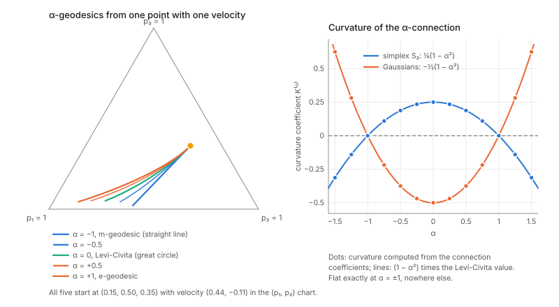

Notes for Chapter 6 of Amari, *Information Geometry and Its Applications* (Springer, 2016). The next section summarises the book's chapter in my own words. The sections after it are explorations that I asked for, one at a time, so they follow my questions and not the book's order. They keep the intuition, the figures and the derivations, and leave out numerical checks.

## What the chapter covers (a summary of the book's chapter)

Chapter 5 worked with one connection, the Levi-Civita one, which is the only torsion-free connection that keeps the metric unchanged under parallel transport. This chapter shows there is a second way to keep the metric safe, by letting two connections share the job, and that this is exactly the structure statistical models carry: a metric plus one extra symmetric three-index object, which a divergence produces automatically. The special case where the structure is flat behaves like a Euclidean space, with a Pythagorean theorem and a projection theorem, and it is the case that matters most in applications. The sections in order:

- **§6.1 Dual connections.** Two connections are dual when carrying one vector with the first and another with the second keeps their inner product unchanged. When the two coincide this is the usual metric connection. The average of a dual pair is the Levi-Civita connection, and the difference between them is a three-index array that turns out to be a fully symmetric tensor (Theorem 6.1), the cubic tensor, which measures how much the metric changes when it is differentiated with each connection. The book comments on the name (the skewness tensor, or the Amari-Chentsov tensor) and says the metric together with the cubic tensor determines the pair. If the cubic tensor vanishes the pair collapses to Levi-Civita.
- **§6.2 Metric and cubic tensor derived from a divergence.** Looking at a divergence near the diagonal, its second derivative gives the metric and its mixed third derivatives give two connections, which are dual to each other (Theorem 6.2, due to Eguchi). The Bregman divergence of a convex function gives a pair that is flat in both the $\theta$ coordinates and the dual $\eta$ coordinates, with the metric and cubic tensor read off as second and third derivatives of the potential. This justifies, with differential geometry, the dually flat structure that Part I introduced without it.
- **§6.3 Invariant metric and cubic tensor.** For the space of probability distributions, every $f$-divergence gives the Fisher metric and a fixed multiple of one standard cubic tensor (Theorem 6.3), the multiple being set by how the generating function $f$ behaves at 1. Chentsov's theorem says these are the only invariant second and third order symmetric tensors, which is why this geometry is the invariant one.
- **§6.4 $\alpha$-geometry.** Scaling the cubic tensor by a real number $\alpha$ still gives a dual pair, the $\alpha$-connection and the $-\alpha$-connection (Theorem 6.4). $\alpha=0$ is Levi-Civita. The $f$-divergence geometry is exactly this family, the $\alpha$-divergence generates it, and it is not dually flat in general. At $\alpha=\pm1$ it is the KL divergence and the structure is dually flat. For any convex function there is also a Jensen-type $\alpha$-divergence built from it (Zhang).
- **§6.5 Dually flat manifold.** If the curvature of one connection vanishes, so does the curvature of its dual (Theorem 6.5), because the two transports together preserve inner products. The reason is simple: flatness means transport around a loop changes nothing. A flat pair then has two straight coordinate systems, $\theta$ for one connection and $\eta$ for the other, whose coordinate curves are geodesics of the respective connection. The metric is the Jacobian between them, and their tangent bases are reciprocal to each other, which is the orthogonality statement of Theorem 6.6.
- **§6.6 Canonical divergence in a dually flat manifold.** Many divergences give the same metric and connections, since only their behaviour for very close points matters, so a divergence is not determined by the geometry. In the dually flat case one is singled out. Lemma 6.1 shows that the metric is the second derivative of a convex potential, with a Legendre dual potential in the other coordinates, and Theorem 6.7 says the Bregman divergence of this pair is the canonical divergence, unique up to the choice of affine coordinates and giving the original structure back. Theorem 6.8 says the KL divergence is the canonical divergence of an invariant, dually flat exponential family, so KL is an outcome of dual flatness and not an assumption (the book adds a remark that decomposability is not needed). The potential can change by a linear term and the coordinates by affine maps, but the divergence itself does not change.
- **§6.7 Canonical divergence in a general manifold of dual connections.** Every dual structure comes from some divergence (Matsumoto), but there is no canonical one in general. The book recalls Kurose's geometrical divergence for 1-conformally flat manifolds and then presents an ongoing proposal of Ay and Amari. It uses the geodesic joining two points for one weighted energy integral, the dual geodesic for another, and averages the two. Theorem 6.9 says it reproduces the original structure, is the Bregman type in the dually flat case and is half the squared Riemannian distance when the cubic tensor is zero. The projection theorem holds in the dually flat case but not in general. Theorem 6.10 gives a condition on the divergence under which it still holds, proved by a divergence ball touching a submanifold, and the $\alpha$-divergence satisfies it, so it is the canonical divergence of $\alpha$-geometry.
- **§6.8 Dual foliations of a flat manifold and mixed coordinates.** A dually flat manifold can be sliced in two ways, by e-flat leaves and by m-flat leaves, which cross at right angles. This is useful for separating two kinds of quantity, and it suits hierarchical systems.
  - **§6.8.1 k-cut of the dual coordinates.** Taking the first $k$ coordinates from $\eta$ and the rest from $\theta$ gives mixed coordinates, whose two groups of directions are orthogonal, so the metric is block diagonal. Fixing the $\eta$ part gives m-flat leaves that partition the manifold, and fixing the $\theta$ part gives e-flat leaves. Theorem 6.11 says this works for every $k$.
  - **§6.8.2 Decomposition of the canonical divergence.** Projecting each point onto the other's leaves gives right triangles, so the divergence between two points splits into a part from the first group of coordinates and a part from the second (Theorem 6.12).
  - **§6.8.3 Neural firing (two neurons).** The model is all joint distributions of two binary neurons. The $\eta$ coordinates are the firing rates and the joint firing rate, and $\theta_{12}$ is the interaction, which is zero exactly for independence. Using the two rates with $\theta_{12}$ separates rates from interaction at right angles, whereas the covariance is not orthogonal to the rates. The KL divergence between two distributions splits through an intermediate distribution that has the first one's rates and the second one's interaction (and the reverse way round).
  - **§6.8.4 Higher-order interactions of spikes.** For $n$ neurons the log-linear model has $\theta$ coordinates grouped by interaction order and $\eta$ coordinates that are joint firing rates of groups of neurons. The $k$-th mixed coordinates keep the rates up to order $k$ and the interactions above order $k$, which are orthogonal to those rates. A three-neuron example gives the pure third-order interaction. The book remarks that Markov chains of various orders and AR/MA time series are hierarchical in the same way.
- **§6.9 System complexity and integrated information.** An input-output channel is "split" if each output terminal depends only on its own input terminal. The distance (KL) from the observed joint distribution to a split family, reached by an m-projection, measures how integrated the system is, with motivation from integrated information theory. The book treats a two-terminal system, binary or Gaussian, and compares two split families. One forbids any direct dependence between the two outputs, the other (Ay's) allows noise that is correlated across outputs. This gives two measures. Mixed coordinates show that the projection keeps the marginals and the single-terminal conditionals, and that each measure can be written as a difference of conditional entropies (Theorems 6.13 and 6.14), with the first at least as large as the second. A natural requirement (Oizumi and others) is that the measure lies between 0 and the mutual information between input and output. Theorem 6.15 says the first measure meets it and the second does not, since correlated output noise alone can make it positive when input and output are independent. A Gaussian channel example shows the first family's projection can still let each output depend on both inputs. A third, curved, family built from Markov conditions fixes this and is left for future work. A binary channel example, built from a noisy copy channel mixed with a channel that ignores its input, illustrates the families. Remarks extend this to hierarchies of partitions of the terminals and to Markov chains.
- **§6.10 Input-output analysis in economics.** A table of how much each industry sells to each other is a point in a positive-measure manifold. The entries are the m-coordinates and their logarithms are the e-coordinates, with the sum of entries as potential, so the canonical divergence is the generalised KL divergence. Replacing the last row and column by the row sums (gross product) and column sums (gross consumption) gives mixed coordinates in which the remaining e-part measures how industries interact, and the divergence between two tables splits into a margins part and an interaction part. Because singling out one industry is not symmetric, the book averages over choices, or appends the totals as an extra row and column. The RAS transformation, which rescales rows and columns, changes the margins freely and leaves the interactions fixed. Full tables are only published every few years, so the interaction part for the missing years can be interpolated along an e-geodesic. The book mentions the study of Japan's postwar change in industrial structure by Morioka and Tsuda.
- **End-of-chapter remarks.** These give the history (Amari, Nagaoka, Chentsov, and the earlier appearance of dual connections in affine differential geometry), and list open problems: which Riemannian manifolds can be made dually flat by adding a cubic tensor (always in dimension two, not beyond), the results that every dually flat manifold is an exponential family (Banerjee and others) and every dual manifold sits in a large enough probability simplex (Le), the lack of a rigorous continuous version of Chentsov's invariance theorem, and the link between curvature and global topology.

## Links

- **[Interactive companion](figures/interactive.html)**: seven widgets that run in the browser. (1) A loop on the Gaussian manifold: carry $A$ by $\nabla^{(\alpha)}$ and $B$ by $\nabla^{(-\alpha)}$ and watch $\langle A,B\rangle$ stay put, then use one connection for both. (2) Eguchi's construction: pick a divergence, get $g$, $\Gamma$, $\Gamma^*$, $T$ by finite differences and compare with the closed forms; add a cubic or a quartic term. (3) The $\alpha$-geodesics of the probability triangle and the curvature coefficient $(1-\alpha^2)/4$. (4) The canonical divergence (6.80) of a dual pair by geodesic shooting, next to the $\alpha$-divergences, and the angle of the projection condition (6.81). (5) Two binary neurons: the Fisher metric in mixed coordinates against the covariance chart, and the decomposition of $\mathrm{KL}$ through $r$ and $r'$. (6) A Gaussian channel: mutual information, $GI$, $GI'$, $GI''$ and the projected gain matrix. (7) A $3\times3$ input–output table under RAS scaling: margins, interactions and the decomposition.
- The book: Amari, *Information Geometry and Its Applications* (Springer, 2016), DOI [10.1007/978-4-431-55978-8](https://doi.org/10.1007/978-4-431-55978-8). These notes cover Chapter 6 only; equation numbers such as (6.80) refer to the book. No text of the book is reproduced here; everything is restated and re-derived.
- Neighbouring chapters: **[Chapter 5: elements of differential geometry](../ch05-elements-of-differential-geometry/index.html)** (connections, curvature, embedding curvature: the toolbox used here), **[Chapter 7: asymptotic theory of inference](../ch07-asymptotic-theory-of-inference/index.html)** (uses the e-/m-connections and their embedding curvatures; §"What Chapters 5 and 7 use" below checks that the three chapters agree), **[Chapters 1](../ch01-dually-flat-structure/index.html) and [2](../ch02-exponential-and-mixture-families/index.html)** (the dually flat structure from a convex function, now derived from connections), **[Chapter 3](../ch03-invariant-geometry/index.html) and [Chapter 4](../ch04-alpha-geometry/index.html)** (the invariant $\alpha$-geometry), [Chapter 8](../ch08-hidden-variables/index.html) (hidden variables) and [Chapter 11](../ch11-machine-learning/index.html) (graphical models).
  Background on the annotations site: **[The Fisher information matrix](https://msrepo.github.io/theory_inclined_papers_with_annotations/fisher-information/)**.

## In one paragraph

Chapter 5 gave one way to compare vectors at nearby points (one affine connection) and showed that the Fisher metric picks out one of them, Levi-Civita, which keeps lengths. This chapter lets **two connections share the work**: carry one vector with $\nabla$ and the other with $\nabla^*$, and demand only that their inner product never changes. Given the metric $g$, a connection has exactly one such partner, and the pair (with both connections symmetric, the book's standing assumption) is described by the metric together with one more object, a symmetric three-index array $T$, the **cubic tensor**: $\Gamma=\Gamma^0-\tfrac12T$, $\Gamma^*=\Gamma^0+\tfrac12T$, and the average of the two is Levi-Civita. A **divergence** produces such a triple $(g,\Gamma,\Gamma^*)$ from its behaviour near the diagonal (second order: $g$; third order: $T$), and every statistical manifold carries a one-parameter family, the **$\alpha$-connections**, of which $\alpha=+1$ is the e-connection and $\alpha=-1$ the m-connection. When one of the two connections is flat so is the other, and then there are two affine coordinate systems, $\theta$ for $\nabla$ and $\eta$ for $\nabla^*$, locked together by a convex potential $\psi$ and its Legendre dual: this is the dually flat structure of Chapter 1, now derived instead of postulated, and its canonical divergence is the Bregman divergence. Fixing some coordinates in $\eta$ and the others in $\theta$ gives **mixed coordinates** that split a manifold into two orthogonal foliations; the chapter's two applications use them to separate firing rates from interactions of neurons, to define a geometric measure of integrated information, and to separate gross output from interaction in an input–output table.

## The spine of the argument

1. Two connections $\nabla,\nabla^*$ are **dual** for the metric if parallel transport keeps $\langle A,B\rangle$ when $A$ goes by $\nabla$ and $B$ by $\nabla^*$: $\partial_kg_{ij}=\Gamma_{kij}+\Gamma^*_{kji}$ (6.6). The average is the Levi-Civita connection; the difference is a symmetric tensor $T$ with $\nabla g=T$, $\nabla^*g=-T$ (§6.1).
2. A **divergence** $D[\xi:\xi']$ induces $g^D=-D_{i;j}$, $\Gamma^D_{ijk}=-D_{ij;k}$, $\Gamma^{D*}_{ijk}=-D_{k;ij}$, and these are dual (Eguchi, §6.2). A convex function induces the dually flat pair with $T=\nabla^3\psi$.
3. The **invariant** divergences ($f$-divergences) give $g$ and $\alpha T$; so $\alpha$-geometry, with $\Gamma^{(\alpha)}=\Gamma^0-\tfrac\alpha2T$, is the invariant family (§6.3–6.4).
4. If $R=0$ for $\nabla$ then $R^*=0$ (the holonomy argument): a **dually flat** manifold has coordinates $\theta$ with $\Gamma=0$ and $\eta$ with $\Gamma^*=0$, biorthogonal, $g=\partial\eta/\partial\theta$, and a pair of potentials $\psi,\varphi$ (§6.5).
5. In a dually flat manifold the **canonical divergence** is the Bregman divergence $\psi(\theta)+\varphi(\eta')-\theta\cdot\eta'$, unique up to the choice of affine charts and linear terms; for exponential families it is the KL divergence with its arguments reversed (§6.6).
6. For a general dual pair one can still define a canonical divergence from geodesics: $D=\tfrac12(\tilde D+\tilde D^*)$ with $\tilde D=\int_0^1 t\,g(\dot\xi,\dot\xi)\,dt$; it returns the original $(g,T)$, the Bregman divergence in the flat case and half the squared distance when $T=0$ (§6.7).
7. Mixed coordinates $(\eta_1..\eta_k;\theta^{k+1}..\theta^n)$ have an orthogonal metric and cut the manifold into an m-flat and an e-flat foliation; the divergence splits into a "first part" and a "second part" (§6.8).
8. Applications: the log-linear model of binary neurons (rates against interactions), the geometric integrated information $GI$ as a KL distance to a split model, and input–output tables (§6.8–6.10).

## Setup and notation

| Symbol | Meaning | In the running examples |
|---|---|---|
| $\nabla,\Gamma_{ij}{}^k$ | connection, $\nabla_{e_i}e_j=\Gamma_{ij}{}^ke_k$; first index = direction of differentiation (as in Chapter 5) | |
| $\Gamma_{ijk}$ | lowered, $\Gamma_{ij}{}^mg_{mk}=\langle\nabla_{e_i}e_j,e_k\rangle$ | |
| $\nabla^*,\Gamma^*$ | the dual connection, (6.6) | |
| $\Gamma^0=\tfrac12(\Gamma+\Gamma^*)$ | the average, Levi-Civita when both are symmetric (6.9) | |
| $T_{ijk}=\Gamma^*_{ijk}-\Gamma_{ijk}$ | the cubic tensor (6.11); for distributions $T=\mathbb E[\partial_il\,\partial_jl\,\partial_kl]$ | |
| $\Gamma^{(\alpha)}$ | $\alpha$-connection $\Gamma^0-\tfrac\alpha2T$ (6.38); $+1$ is the e-connection (flat in $\theta$), $-1$ the m-connection (flat in $\eta$) | |
| $D[\xi:\xi']$, $D_{i;j}$, $D_{ij;k}$ | divergence and its derivatives on the diagonal, unprimed index = first argument (6.19)–(6.21) | |
| $\psi(\theta),\varphi(\eta)$ | potential and its Legendre dual, $\psi+\varphi-\theta\cdot\eta=0$ (6.55) | |
| $\partial_i,\ \partial^i$ | derivative in $\theta$, in $\eta$; $e_i=\partial_i$, $e^i=\partial^i$, $\langle e_i,e^j\rangle=\delta_i^j$ (6.48) | |
| $D_\psi[\theta:\theta']$ | Bregman divergence $\psi(\theta)+\varphi(\eta')-\theta\cdot\eta'$ (6.68) $=\mathrm{KL}[p_{\theta'}\Vert p_\theta]$ | |
| $\xi=(\eta_1..\eta_k;\theta^{k+1}..\theta^n)$ | mixed coordinates; $M^*(c)$ (fix the $\eta$ part, m-flat), $M(d)$ (fix the $\theta$ part, e-flat) | |
| $GI,GI'$ | geometric integrated information, KL distance to the split models $M_S\supset M_S'$ | |

**Running examples.**

| Space | Chart | Used for |
|---|---|---|
| Gaussian manifold | $(\mu,\sigma)$, $g=\operatorname{diag}(1/\sigma^2,2/\sigma^2)$ | closed-form e-, m-, Levi-Civita and $\alpha$-connections (Chapter 5); every divergence computation |
| probability simplex $S_2$ (three outcomes) | m-chart $(p_1,p_2)$, $g=\operatorname{diag}(1/p_i)+1/p_3$, $\Gamma^{(\alpha)}_{ijk}=-\tfrac{1+\alpha}2T_{ijk}$ | curvature of $\alpha$-geometry, the sphere, the projection condition |
| a metric with a symmetric connection on $\mathbb R^2$ with no special structure | $x\in\mathbb R^2$ | identities that should hold in general; counterexample hunts |
| two and three binary neurons; $2\times2$ binary and Gaussian channels; a $3\times3$ table | log-linear coordinates | §6.8–6.10 |

The convention for $D$ is the book's: $D[\xi:\xi']$ with the first argument the point at which the derivatives $\partial_i$ act, so $D_\psi[\theta:\theta']=\mathrm{KL}[p_{\theta'}\Vert p_\theta]$ is **reversed** relative to the usual $\mathrm{KL}[p\Vert q]$ (as in Chapter 1's notes).

## 1. Dual connections (§6.1)

**In plain words.** A metric says how long vectors are at one point. A connection says what "the same vector" means at the next point. For the Levi-Civita connection "the same" preserves lengths and angles, so carrying both vectors with it keeps $\langle A,B\rangle$. The new idea is to carry the two vectors with *different* connections and still keep $\langle A,B\rangle$. That asks a lot of the pair, but for every connection $\nabla$ and every metric a partner $\nabla^*$ exists (symmetric too under a condition checked below), and in statistics it is the pair that matters: the e-connection and the m-connection are not metric on their own, yet they are partners.

**Example.** On the Gaussians the e-connection and the m-connection (Chapter 5 has their coefficients) are not metric on their own, but the Fisher metric changes along $e_k$ by exactly what the pair accounts for.

**The statement.** Transport a basis vector from $\xi+d\xi$ back to $\xi$ with $\nabla$ and another with $\nabla^*$, require the inner product to be unchanged and expand to first order (6.2)–(6.5):
$$\partial_kg_{ij}=\Gamma_{kij}+\Gamma^*_{kji}\qquad(6.6),\qquad Z\langle X,Y\rangle=\langle\nabla_ZX,Y\rangle+\langle X,\nabla^*_ZY\rangle\quad(6.7).$$
So $\Gamma^*_{ijk}=\partial_ig_{jk}-\Gamma_{ikj}$ determines $\nabla^*$ from $(g,\nabla)$, and $(\nabla^*)^*=\nabla$ is automatic. The average $\Gamma^0=\tfrac12(\Gamma+\Gamma^*)$ satisfies the metric condition (6.9)–(6.10).

**Parallel transport tells the same story** (equation (6.1), the picture below). Take a closed loop on the Gaussian manifold and carry one vector $A$ by the $\alpha$-connection and another vector $B$ by the $(-\alpha)$-connection. The inner product $\langle A,B\rangle$ stays put all the way round, although neither vector comes back to itself, because the pair is curved. If the same non-metric connection carries both vectors, the inner product wanders. With Levi-Civita for both it is constant, and with the flat pair e/m it is constant and both vectors come back exactly. The holonomy matrices of the pair satisfy $H^{\mathsf T}gH^*=g$: the dual holonomy is the $g$-adjoint inverse of the primal one, which is the entire proof of Theorem 6.5 below.

**The cubic tensor (Theorem 6.1).** Put $T_{ijk}=\Gamma^*_{ijk}-\Gamma_{ijk}$ (6.11); then $\Gamma=\Gamma^0-\tfrac12T$, $\Gamma^*=\Gamma^0+\tfrac12T$ (6.12), and $\nabla_ig_{jk}=T_{ijk}$ (6.13), $\nabla^*_ig_{jk}=-T_{ijk}$. The Riemannian case is $T=0$. Three remarks.

- **Hypothesis: both connections symmetric.** The book assumes it from the start. But the dual of a symmetric connection is symmetric only if $\nabla g$ is a symmetric (Codazzi) tensor: $(\nabla_ig)_{jk}=(\nabla_jg)_{ik}$. For a generic metric with a generic symmetric connection the dual has torsion, and the torsion is exactly this Codazzi defect; the average of the pair is still metric but then has torsion too, so it is *not* Levi-Civita; and $T=\Gamma^*-\Gamma$ is symmetric in its last two indices (a consequence of (6.6) and the symmetry of $g$) but not in its first two. The proof's step from (6.17) to (6.18) is therefore compressed: the symmetry of $T$ in $(j,k)$ must be derived from (6.6) first, and the symmetry in $(i,j)$ is the hypothesis.
- **The sign in (6.14).** (6.14) is printed as $\nabla^{*i}g^{jk}=-T^{ijk}$, all indices up. For the inverse metric *tensor* the sign is $+$: $\nabla^*_ig^{jk}=+T_i{}^{jk}$ (two routes to it agree). The printed minus is right if $g^{jk}$ means the components of the metric in the dual chart $\eta$ (the inverse matrix), because then it is just (6.13) for $\nabla^*$ written in a chart where $\nabla^*=\partial$: $\partial^i\partial^j\partial^k\varphi=-T^{ijk}$. That is the sign that (6.32) and (6.58) lack (§2).
- **Submanifolds** (not in this chapter, but Chapter 7 runs on them). If $S$ is a submanifold, the tangential parts of $\nabla_{e_a}e_b$ and $\nabla^*_{e_a}e_b$ are again a dual pair for the induced metric. For a curve with coordinate $u$, the induced m-coefficient is $\eta''\!\cdot\theta'/g_{uu}$ and the induced e-coefficient is $\theta''\!\cdot\eta'/g_{uu}$, and their sum is $g_{uu}'/g_{uu}$, equation (6.6) on $S$. The normal part of $\theta''$ gives Efron's statistical curvature $\gamma^2$. These are the quantities Chapter 7 uses.

## 2. Metric and cubic tensor derived from a divergence (§6.2)

**In plain words.** A divergence $D[\xi:\xi']$ is a stand-in for squared distance: zero on the diagonal, positive nearby. Look at what happens close to the diagonal. The first derivatives vanish, so $D$ starts with a quadratic term, and the quadratic form is a metric. The next term, cubic, is new: it knows which of the two arguments is "from" and which is "to", and it is exactly the extra information a pair of connections carries.

**The statement.** With $D_i=\partial_iD|_{\xi'=\xi}$, $D_{;i}=\partial'_iD|_{\xi'=\xi}$ and so on (6.19)–(6.21), define $g^D_{ij}=-D_{i;j}$, $\Gamma^D_{ijk}=-D_{ij;k}$, $\Gamma^{D*}_{ijk}=-D_{k;ij}$ (6.22)–(6.24). Theorem 6.2 (Eguchi): they are dual for $g^D$; the proof is the one line $\partial_kg^D_{ij}=-D_{ki;j}-D_{i;jk}$ (6.27). I derive the pair directly from the Taylor expansion $D[\xi:\xi+\delta]=\tfrac12g_{ij}\delta^i\delta^j+\tfrac16C_{ijk}\delta^i\delta^j\delta^k+O(\delta^4)$ with $C$ symmetric:
$$\Gamma^D_{ijk}=\partial_ig_{jk}+\partial_jg_{ik}-C_{ijk},\qquad\Gamma^{D*}_{ijk}=C_{ijk}-\partial_kg_{ij},\qquad T^D_{ijk}=2C_{ijk}-(\partial_ig_{jk}+\partial_jg_{ik}+\partial_kg_{ij}).$$

The pair of connections obtained this way from the KL divergence is the m/e pair: $\mathrm{KL}[p{:}q]$, with the *first* argument the true distribution, gives $\Gamma^D=$ m-connection and $T^D=-T$, i.e. $\alpha=-1$, and $\mathrm{KL}[q{:}p]$ gives $\alpha=+1$; the $\alpha$-divergences $D_\alpha[p{:}q]=\tfrac4{1-\alpha^2}(1-\int p^{(1-\alpha)/2}q^{(1+\alpha)/2})$ give the matching $\alpha$-connection. This is the orientation that Chapter 1's notes found and that the $\alpha$-labelling of (6.36) requires. The three expressions of the metric in (6.22) agree.

**A divergence that is neither Bregman nor an $f$-divergence.** The construction needs no special structure. Take $D=\tfrac12\delta\cdot M(\xi)\delta+\tfrac16C(\xi)[\delta,\delta,\delta]+$ quartic, with $M$ positive definite and $C$ symmetric, both varying with $\xi$. The three formulas above hold, duality (6.27) holds, and $T^D$ is symmetric in all three indices (Theorem 6.1 at work). **Half the squared Fisher-Rao distance** (a Riemannian divergence) gives $\Gamma^D=\Gamma^{D*}=$ the Levi-Civita symbol and $T^D=0$.

**Which divergences give the same geometry** (6.51)-(6.54). Only derivatives up to third order at the diagonal enter. Adding any term whose derivatives up to third order vanish on the diagonal (a quartic term, or the square of $D$) changes nothing in $g$, $\Gamma$, $\Gamma^*$. Adding a cubic term changes $\Gamma$ and $\Gamma^*$ by amounts the formulas above predict.

**One metric, a line of cubic terms** (picture). Along a ray $D[p:p+sd]=\tfrac12g(d,d)s^2+c_3s^3+\dots$ with $c_3=\tfrac12\Gamma^0(d,d,d)+\tfrac\alpha{12}T(d,d,d)$. All the divergences share the quadratic term, and their cubic coefficients lie on a straight line in $\alpha$: $\mathrm{KL}[p{:}q]$ at $\alpha=-1$, $\mathrm{KL}[q{:}p]$ at $\alpha=+1$, and the Hellinger-type divergence and half the squared distance both at $\alpha=0$ (they differ only at fourth order).

**Transformation law.** The book omits the check that $\Gamma^D$ transforms as a connection. It does: computed in the natural parameters $\theta$ it agrees with law (5.37) applied to the $(\mu,\sigma)$ result, and likewise in the chart $(\mu,\log\sigma)$; the tensor part alone would not agree, so the inhomogeneous term of (5.37) is really there. In $\theta$, $\Gamma^{D*}=0$ and $\Gamma^D=\partial^3\psi$.

**The Bregman case** (6.28)-(6.32). On the simplex with $\psi=\log(1+e^{\theta_1}+e^{\theta_2})$, $D_\psi[\theta:\theta']=\mathrm{KL}[p_{\theta'}\Vert p_\theta]$ (arguments reversed). In $\theta$: $g=\psi''$, $\Gamma=0$, $\Gamma^*=\psi'''$. In $\eta$: $g=\varphi''$, $\Gamma^*=0$, $\Gamma=\varphi'''$. **A sign.** The cubic tensor's components in the $\eta$ chart, $T(\partial^i,\partial^j,\partial^k)=\Gamma^*-\Gamma$, equal $-\partial^i\partial^j\partial^k\varphi$. The book prints $T^{ijk}=\partial^i\partial^j\partial^k\varphi$ in (6.32) and (6.58). That is the cubic tensor of the *dual* structure $(g,-T)$, or a sign slip; it contradicts the book's own (6.14) read in the $\eta$ chart.

## 3. Invariant metric and cubic tensor (§6.3)

**In plain words.** A divergence between distributions should not care how you encode the outcomes (merging or splitting outcomes in a way that loses nothing). The $f$-divergences $D_f[p:q]=\int p\,f(q/p)$ are the invariant ones. Theorem 6.3 says that the two tensors they induce are the Fisher metric and a multiple of $T=\mathbb E[\partial_il\,\partial_jl\,\partial_kl]$, with the multiple fixed by two derivatives of $f$.

**The statement.** For $f(1)=0$, $f''(1)=1$: $g^f=g$, $T^f=\alpha T$ with $\alpha=2f'''(1)+3$ (6.33)-(6.36). Without the normalisation, the same computation gives $g^f=f''(1)\,g$ and $T^f=(2f'''(1)+3f''(1))\,T$. Reading $\alpha$ off $f'''(1)$ gives the familiar cases: $-\log u+u-1$ is $\mathrm{KL}[p{:}q]$ ($\alpha=-1$), $u\log u-u+1$ is $\mathrm{KL}[q{:}p]$ ($\alpha=+1$), the Hellinger case is $\alpha=0$, Pearson's $(u-1)^2/2$ is $\alpha=3$ and Neyman's $(u-1)^2/(2u)$ is $\alpha=-3$. A divergence not normalised by $f''(1)=1$, such as Jensen-Shannon, needs the general formula, and being symmetric it has $T=0$, as it must.

So the book's $\alpha$ is right for the standard normalisation and covers values outside $[-1,1]$. The remark that $g$ and $\alpha T$ are the *only* invariant tensors is Chentsov's theorem, which I did not examine.

## 4. α-geometry (§6.4)

**In plain words.** Multiplying $T$ by a real number $\alpha$ leaves it a symmetric tensor, so $(g,\alpha T)$ defines a dual pair, $\Gamma^{(\alpha)}=\Gamma^0-\tfrac\alpha2T$ and its partner $\Gamma^{(-\alpha)}$ (6.38). $\alpha=0$ is Levi-Civita, $\alpha=1$ the e-connection, $\alpha=-1$ the m-connection. On an exponential family $\alpha=\pm1$ are flat; in between the manifold is curved.

**Why $\alpha$ interpolates.** (i) $\Gamma^{(\alpha)}_{ijk}=\Gamma^0_{ijk}-\tfrac\alpha2T_{ijk}$ equals the expectation $\mathbb E[(\partial_i\partial_jl+\tfrac{1-\alpha}2\partial_il\,\partial_jl)\partial_kl]$ and also the mixture $\tfrac{1+\alpha}2\Gamma^e+\tfrac{1-\alpha}2\Gamma^m$ of the e- and m-connections, and $\alpha=1$ gives the e-connection of Chapter 5. (ii) **Curvature.** Chapter 5 found that the average $(1-s)\Gamma^e+s\Gamma^m$ has curvature $4s(1-s)$ times Levi-Civita's; with $s=\tfrac{1-\alpha}2$ that is $1-\alpha^2$. So the curvature of $\Gamma^{(\alpha)}$ is $(1-\alpha^2)$ times the Riemannian curvature, on the Gaussians (negative curvature, like the hyperbolic plane) and on the simplex (positive, a sphere); it vanishes only at $\alpha=\pm1$. For these two families the book's remark that $\alpha$-geometry is generally not dually flat becomes precise: flat only at $\pm1$.

(iii) **The Jensen-type divergence** (6.39) for the cumulant function of the simplex: it has $g=\psi''$, $T^D=\alpha T$ and $\Gamma^D=\tfrac{1-\alpha}2T=\Gamma^{(\alpha)}$ for every $\alpha$ including $\lvert\alpha\rvert>1$, and it stays non-negative there (when one weight is negative the prefactor $4/(1-\alpha^2)$ is too, which is why it still works). As $\alpha\to\pm1$ it tends to the two Bregman divergences, and likewise $D_\alpha$ of the Gaussians tends to $\mathrm{KL}[q{:}p]$ at $\alpha\to1$ and to $\mathrm{KL}[p{:}q]$ at $\alpha\to-1$.

## 5. Dually flat manifold (§6.5)

**In plain words.** Flatness of a connection means that parallel transport does not depend on the path. If it holds for $\nabla$ it holds for its partner, because the holonomy of $\nabla^*$ is the $g$-adjoint inverse of the holonomy of $\nabla$ (the identity $H^{\mathsf T}gH^*=g$ above): if one is the identity, so is the other. Then there are two straight coordinate systems.

**The statement.** Theorem 6.5: $R=0\iff R^*=0$. The curvature tensors in fact satisfy a stronger identity, the standard consequence of applying (6.7) twice and commuting the covariant derivatives: $R_{ijkl}+R^*_{ijlk}=0$ with $R_{ijkl}=R_{ijk}{}^mg_{ml}$. It holds whether or not the pair is flat. In a dually flat manifold there are charts $\theta$ ($\Gamma(\theta)=0$, each coordinate line a geodesic) and $\eta$ ($\Gamma^*(\eta)=0$) with $g_{ij}=\partial\eta_i/\partial\theta^j$, $g^{ij}=\partial\theta^i/\partial\eta_j$ (6.46) and $\langle e_i,e^j\rangle=\delta_i^j$ (Theorem 6.6). On the Gaussians the Jacobian $\partial\eta/\partial\theta$ is the covariance matrix of $(x,x^2)$, i.e. the Fisher metric in the $\theta$ chart, and the $\theta$-frame carried by the e-connection and the $\eta$-frame carried by the m-connection stay biorthogonal and coincide with the coordinate frames at the new point, equation (6.50).

**The symmetric hypothesis again.** The book's remark that flatness for one connection already makes a manifold dually flat needs the dual to be symmetric as well. Counterexample: $\nabla$ flat ($\Gamma=0$ in the chart $x$) and $g=\operatorname{diag}(1,e^{x_1})$. Then the dual connection has torsion, and $R^*=0$ exactly, as Theorem 6.5 says, but no coordinate system makes $\Gamma^*$ vanish (a torsion cannot be removed by a change of chart). This metric is not a Hessian: $\partial_1g_{22}\ne\partial_2g_{12}$. So the book's conclusion holds exactly under its standing assumption that both connections are symmetric, and the assumption is equivalent to $g$ being a Hessian in the flat chart (Lemma 6.1).

## 6. Canonical divergence in a dually flat manifold (§6.6)

**In plain words.** Many divergences give the same $(g,\Gamma,\Gamma^*)$ (they differ at fourth order and beyond). A dually flat manifold has a *distinguished* one: reconstruct the potential $\psi$ from the metric and form the Bregman divergence. No arbitrary choice is left.

**The statement.** *Lemma 6.1:* in the flat chart $\theta$ the dual connection's symmetry says $\partial_ig_{jk}=\partial_kg_{ji}$ (6.60), which is the integrability condition for a function $\psi$ with $g_{ij}=\partial_i\partial_j\psi$ (6.62)–(6.66) (the Poincaré lemma; locally, on a simply connected chart); then $T_{ijk}=\partial_i\partial_j\partial_k\psi$ and $\eta_i=\partial_i\psi$ is the dual chart. *Theorem 6.7:* the canonical divergence $D[\theta:\theta']=\psi(\theta)+\varphi(\eta')-\theta\cdot\eta'$ (6.68) is independent of the choices (6.69)–(6.71). *Theorem 6.8:* for an exponential family it is the KL divergence.

**Why $\eta=\nabla\psi$ is the dual chart.** The connection that makes $\eta$ straight has $\Gamma_{ij}{}^m=(\partial^2\eta_a/\partial\theta^i\partial\theta^j)(\partial\theta^m/\partial\eta_a)$, which equals $\Gamma^*_{ij}{}^m=g^{mk}\partial_ig_{jk}$ when $g=\nabla\nabla\psi$. The reconstruction of $\psi$ uses nothing but $g$ and the symmetry (6.60), up to an affine function.

**A slip in (6.69).** Under $\tilde\theta=A\theta+b$ the dual coordinates must transform with the inverse **transpose**, $\tilde\eta=A^{-\mathsf T}\eta+c$, so that $\tilde\eta\cdot d\tilde\theta=\eta\cdot d\theta$ and $\tilde\eta=\nabla\tilde\psi$. The printed $A^{-1}\eta+c$ is correct only for symmetric $A$. With the correct transformation (and the added linear term and constant of (6.70)) the canonical divergence is unchanged.

**Orientation.** The identity behind every Pythagorean statement in this chapter is, for the divergence (6.68),
$$D[P{:}R]+D[R{:}Q]-D[P{:}Q]=(\theta_R-\theta_P)\cdot(\eta_R-\eta_Q)$$
It vanishes when the $\theta$-straight segment $PR$ is orthogonal to the $\eta$-straight segment $RQ$: the "primal" geodesic comes first. Remember also that $D_\psi[\theta:\theta']=\mathrm{KL}[p_{\theta'}\Vert p_\theta]$; this matters in §8.

## 7. Canonical divergence in a general manifold of dual connections (§6.7)

**In plain words.** Away from the dually flat case there is no potential, but the geodesics still exist, and a divergence can be built from them: how much "kinetic energy" must you spend going from $p$ to $q$ along the geodesic, weighting late parts of the path more ($\tilde D$) or earlier parts more ($\tilde D^*$, along the *dual* geodesic), and average. The result reproduces the structure it was built from.

**The definition.** $\tilde D[p{:}q]=\int_0^1t\,g(\dot\xi,\dot\xi)\,dt$ along the $\nabla$-geodesic from $p$ to $q$, $\tilde D^*[p{:}q]=\int_0^1(1-t)\,g(\dot\xi^*,\dot\xi^*)\,dt$ along the $\nabla^*$-geodesic, $D=\tfrac12(\tilde D+\tilde D^*)$ (6.77)-(6.80).

**Theorem 6.9, three claims.**

For a flat pair the weights make $D$ the Bregman divergence, and for the Riemannian case ($T=0$) the weights $t$ and $1-t$ integrate a constant-speed geodesic to half the squared distance. In between the three versions ($\tilde D$, $\tilde D^*$ and their mean) are close but not the same. The $\alpha$-divergence is **not** this divergence away from $\alpha=\pm1$: already for two coins, $4(1-\mathrm{BC})$ with $\mathrm{BC}$ the Bhattacharyya coefficient differs from half the squared Fisher-Rao distance. The sentence in §6.7 saying that the $\alpha$-divergence is a canonical divergence of $S_n$ in Kurose's sense therefore cannot refer to (6.80); it refers to Kurose's geometrical divergence, which I did not examine.

**The first claim, that the geometry of $D$ is the original one,** reduces to the cubic Taylor coefficient. Expanding the geodesic $\xi(t)=p+tX-\tfrac12t^2\Gamma(X,X)$, $X=\delta+\tfrac12\Gamma(\delta,\delta)$, and integrating $t$ and $t^2$ gives
$$\tilde D=\tfrac12g\delta\delta+\left[-\tfrac16\Gamma_{(ijk)}+\tfrac13\partial_{(i}g_{jk)}\right]\delta^i\delta^j\delta^k+\dots,\qquad\tilde D^*=\tfrac12g\delta\delta+\tfrac16\left[\Gamma^*_{(ijk)}+\partial_{(i}g_{jk)}\right]\delta\delta\delta+\dots$$
($(\cdot)$ = full symmetrisation), and since $\partial_{(i}g_{jk)}=\Gamma_{(ijk)}+\Gamma^*_{(ijk)}$ by (6.6), **both pieces have the same cubic tensor** $C=\Gamma_{(ijk)}+2\Gamma^*_{(ijk)}$. By the formulas of §2, $T^D=2C-3\partial_{(i}g_{jk)}=\Gamma^*_{(ijk)}-\Gamma_{(ijk)}=T$ and $\Gamma^D=\Gamma$. So the averaging is not needed for this claim; what it buys is **self-duality**: the canonical divergence of the dual structure $(\nabla^*,\nabla)$ is $D$ with the arguments exchanged, because reversing a geodesic exchanges the weights $t$ and $1-t$. $\tilde D$ and $\tilde D^*$ themselves differ beyond third order.

**Theorem 6.10, the projection condition.** The book says the geodesic projection theorem holds when $X(\xi_q,\xi_p)\propto-g^{-1}\partial'D[\xi_p{:}\xi_q]$ (6.81): the normal of the divergence ball at $q$ must point along the geodesic from $q$ to $p$. The book adds that it holds in the dually flat case and for the $\alpha$-divergence. The condition can be read as an angle between the two directions, and the picture below compares it across cases.

For the Bregman divergence of (6.68) the condition holds with the *primal* geodesic: minimising $D_\psi[\theta_p:\theta_q]=\mathrm{KL}[p_{\theta_q}\Vert p_{\theta_p}]$ over $q$ is the e-projection and its geodesic is the e-geodesic, which is the consistent pairing that Chapter 1's notes found the printed Theorem 1.4 to have reversed. The remark is also true on the simplex, where the $\alpha$-divergence satisfies (6.81), but it is **false on the Gaussian manifold** with its induced $\alpha$-connection, even for $\alpha=0$, where the divergence $4(1-\mathrm{BC})$ is not a function of the geodesic distance alone. The divergence (6.80) itself nearly satisfies the condition and does not satisfy it exactly in these examples: its gradient $\partial'\tilde D$ differs slightly from $g\dot\xi(1)$, which would be exact for Bregman and Riemannian divergences.

**The remark on constant curvature** (the generalised Pythagorean theorem of Chapter 4, cited at the start of §6.7). On $S_2$, if the $\alpha$-geodesic from $Q$ to $P$ is orthogonal at $Q$ to the $(-\alpha)$-geodesic from $Q$ to $R$, then $D_\alpha[P{:}R]=D_\alpha[P{:}Q]+D_\alpha[Q{:}R]-\tfrac{1-\alpha^2}4D_\alpha[P{:}Q]D_\alpha[Q{:}R]$, the coefficient being the curvature $K^{(\alpha)}$ of §4. The plain sum is corrected by exactly the curvature term, and the correction disappears at $\alpha=\pm1$, where the theorem reverts to the flat Pythagorean theorem.

## 8. Dual foliations of a flat manifold and mixed coordinates (§6.8)

**In plain words.** Take an exponential family and swap *some* of the natural coordinates for their expectation partners. The new chart $(\eta_1,\dots,\eta_k;\theta^{k+1},\dots,\theta^n)$ is neither e-affine nor m-affine, but its two groups of coordinate directions are orthogonal. Fix the first group to get a leaf $M^*(c)$ (m-flat: it is cut out by linear equations in $\eta$); fix the second group to get a leaf $M(d)$ (e-flat). The two families of leaves foliate the manifold and cross at right angles, so a divergence between two points splits into "the part from the first group" and "the part from the second".

**Example.** Two binary neurons, with the four outcomes $00,01,10,11$. The firing rates $\eta_1,\eta_2$ and the joint rate $\eta_{12}$ are the expectation coordinates; the natural parameters include $\theta^{12}=\log\frac{p_{11}p_{00}}{p_{10}p_{01}}$, the log odds ratio, which is zero iff the neurons are independent. Mixed coordinates $(\eta_1,\eta_2;\theta^{12})$ separate the rates from the interaction.

**Orthogonality, and a notational slip.** In the mixed chart the Fisher metric is block diagonal, (6.89)-(6.90). But the diagonal blocks are not what (6.90) prints. A coordinate vector $\partial/\partial\eta_i$ of the mixed chart holds the *other mixed coordinates* fixed, so it is not the coordinate vector $e^i$ of the pure $\eta$ chart. The $\eta$ block is $(G_{11})^{-1}$, the inverse of the corresponding block of $G(\theta)$, and the $\theta^{12}$ entry is the Schur complement, whereas the corresponding entries of $G^{-1}$ and $G$ would be different numbers. The two readings coincide only if the off-diagonal block $G_{12}$ vanishes (the same trap as in Chapter 7's (7.58): a block of the inverse is not the inverse of the block). The covariance $v=\eta_{12}-\eta_1\eta_2$ as third coordinate does not orthogonalise: in $(\eta_1,\eta_2,v)$ the direction $\partial_v$ is not perpendicular to $\partial_{\eta_1},\partial_{\eta_2}$ (the book's claim after (6.103)).

**Theorem 6.12 and its orientation.** Let $r$ have the rates of $p$ and the interaction of $q$ (the book's $R_{PQ}$ and its $r$ in (6.104)). Then $\mathrm{KL}[p{:}q]=\mathrm{KL}[p{:}r]+\mathrm{KL}[r{:}q]$ exactly, a part from the interaction and a part from the rates. With $r'$ (rates of $q$, interaction of $p$) the same sum does not give $\mathrm{KL}[p{:}q]$, but it does give the reversed divergence: $\mathrm{KL}[q{:}p]=\mathrm{KL}[q{:}r']+\mathrm{KL}[r'{:}p]$. **The statement (6.96) is printed with the canonical divergence $D[P:Q]$ of (6.68)**, and for that orientation $D[P{:}Q]=\mathrm{KL}[Q\Vert P]$; then the decomposition through $R_{PQ}$ fails and holds with $R_{QP}$. By the identity of §6, the Pythagorean statement needs the primal ($\theta$-straight, here e-flat $M(\theta)$) segment second, which is what the book's text describes (an m-geodesic from $P$ to $R_{PQ}$ meeting the e-geodesic from $R_{PQ}$ to $Q$ at a right angle) and which is the KL orientation $\mathrm{KL}[P\Vert Q]$, not (6.68)'s. When $q$ is independent ($\theta^{12}=0$), $r=p_1\otimes p_2$ and $\mathrm{KL}[p{:}r]$ is the mutual information.

**Three neurons and every cut.** The same works for three neurons: (6.115) $\theta^{123}=\log\frac{p_{111}p_{100}p_{010}p_{001}}{p_{110}p_{101}p_{011}p_{000}}$ is the log-linear coefficient, and (6.116) gives $\theta^{12}$ likewise. For every cut of the seven natural coordinates (ordered neuron, pair, triple) the Fisher metric in the mixed chart is block diagonal (Theorem 6.11), and $\mathrm{KL}[p{:}q]$ splits through the intermediate distribution $r_k$ at every cut. In the plain $\theta$ chart the coordinates $\theta^{12}$ and $\theta^{123}$ are not orthogonal to each other: only the mixed charts split cleanly.

## 9. System complexity and integrated information (§6.9)

**In plain words.** A system with $n$ inputs and $n$ outputs is "simple" if output $i$ depends only on input $i$ (no information is integrated); the more it needs cross-links $x_i\to y_j$, the more integrated it is. Geometrically: take the family of simple ("split") models, an e-flat submanifold inside the family of all joint distributions, and measure the KL distance from the observed $p$ to it. The nearest point is the m-projection, and in mixed coordinates it just keeps the $\eta$ of the allowed terms and sets the $\theta$ of the forbidden ones to zero (6.126)–(6.129).

**The models.** The full model of $(x_1,x_2,y_1,y_2)$ has $15$ log-linear coefficients. The split model $M_S$ of (6.118) has the terms $x_i,y_i,x_1x_2,y_1y_2,x_iy_i$: **eight** parameters. The book says "ten degrees of freedom"; ten is the number of coordinates listed in (6.126), the dimension of the pairwise model (and of the Gaussian full model, a $4\times4$ covariance), and (6.126) lists only those ten of the fifteen. Ay's smaller $M_S'$ (no $y_1y_2$ term) has seven, and $M_S'\subset M_S$. $GI=\mathrm{KL}[p:M_S]$, $GI'=\mathrm{KL}[p:M_S']$ (6.122)–(6.123).

**Statements of the section, checked.**

- (6.137)-(6.141): $GI=H[\hat q]-H[p]$ and $GI=H(\hat Y\vert X)-H(Y\vert X)$; likewise $GI'$. True.
- (6.130)-(6.134): the projection $\hat q$ keeps the marginals $p_X$, $p_Y$ and the conditional $p(y_1\vert x_1)$; for $M_S'$ the projection keeps $p_X$, the marginal of $y_1$ and $p(y_1\vert x_1)$, but not $p_Y$. **(6.132) prints $\hat q'_X(x)=p_Y(x)$**: the right-hand side should be $p_X(x)$.
- (6.143): $\sum_iH(Y_i\vert X_i)-H(Y\vert X)=GI'$. True.
- **(6.142) is not true in general.** It replaces $H(\hat Y_i\vert X)$ by $H(Y_i\vert X_i)$, but in $M_S$ the output $y_1$ is not independent of $x_2$ given $x_1$ (the path $y_1\!-\!y_2\!-\!x_2$ is open), so $H(\hat Y_i\vert X)<H(Y_i\vert X_i)$. The correct identity is $GI=\sum_iH(Y_i\vert X_i)-H(Y\vert X)-I(\hat Y_1{:}\hat Y_2\vert X)-[I(\hat Y_1{:}X_2\vert X_1)+I(\hat Y_2{:}X_1\vert X_2)]$, with an extra non-negative bracket. (6.143), for $M_S'$, where the extra terms vanish, is exact.
- **(6.144), (6.146), (6.147) are reversed.** Since $M_S'\subset M_S$, projecting onto the larger model gives the smaller divergence: $GI\le GI'$. Indeed $GI'-GI=\mathrm{KL}[\hat q{:}\hat q']=H(\hat Y'\vert X)-H(\hat Y\vert X)$ (the last is (6.145), correct as printed), so $GI'=GI+\mathrm{KL}[\hat q{:}\hat q']\ge GI$. The printed $GI=GI'+\mathrm{KL}[\hat q{:}\hat q']$ would contradict (6.140), (6.141) and (6.145) together.
- Theorem 6.15: $GI\le I(X{:}Y)$ always, but $GI'\le I(X{:}Y)$ can fail, so the postulate $GI'\le I$ is violated by some distributions. The book's example (6.152): $X$ independent of $Y$ with $Y$ having correlated components gives $I(X{:}Y)=0$, $GI=0$, and $GI'=I(Y_1{:}Y_2)>0$.

**The Gaussian channel** $y=Ax+\varepsilon$, $x\sim N(0,I)$ (Example 1), by Gaussian covariance selection (the m-projection onto the family whose precision matrix is zero at the missing edges). Three kinds of channel are worth keeping in mind: one with no cross-talk (diagonal $A$) but correlated noise, one with some cross-talk, and one with $A=0$ so that $X$ is independent of $Y$.

This confirms the problem the book points out after (6.157): for a channel with diagonal gain matrix, the projection $\hat A$ onto $M_S$ is *not* diagonal, and $GI>0$ although no output listens to the wrong input. For such a channel $GI'=-\tfrac12\log(1-\rho^2)$ depends only on the noise correlation $\rho$ and not on $A$, which also shows that $GI'$ can exceed the mutual information (for $A=0$ it is positive while $I=0$). The curved model $M_S''$ of (6.159) ($\hat A$ diagonal, noise covariance free) gives $GI''=0$ for the no-cross-talk channel, as intended. The orderings $GI'\ge GI$ and $GI''\le GI'$ hold (as $M_S'\subset M_S''$), $GI\le I$ and $GI''\le I$ hold (6.162), and $GI'\le I$ fails for some channels. The book leaves the geometry of $M_S''$ (neither e- nor m-flat) for later. It is not convex as a minimisation problem over the diagonal gains: for strong cross-talk and strongly correlated noise the criterion has an indefinite Hessian at the true gain, and the minimum sits at a diagonal gain far from it.

**The binary channel of Example 2** (uniform input; $y_i$ takes $x_i$ with probability $1-\varepsilon$ and $x_j$ with $\varepsilon$, then a symmetric channel with error $\nu$; mixed with probability $\delta$ with a channel that sends $y=(z,z)$ regardless of $x$). The book describes the split model $M_S$ as the set of channels with $\varepsilon=0$ and any $\nu$, and says that $\nu$ plays the role that correlated noise plays in the Gaussian case. That does not hold for the exponential family $M_S$: with $\varepsilon=0$ and a mixture weight $\delta>0$ the log-linear coefficients of $x_1y_2$ and $x_2y_1$ are non-zero and there are non-zero higher-order terms, so $p\notin M_S$ and $GI>0$ although nothing crosses between terminals. What *is* true is that every $\varepsilon=0$ channel satisfies the two conditional independences of (6.161), i.e. it lies in the curved model $M_S''$; the role of correlated noise is played by $\delta$, not $\nu$ (with $\delta=0$ and $\varepsilon=0$ the channel lies in $M_S'$, $GI=GI'=0$). For $\delta\to1$ the channel ignores $x$, so $I\to0$ while $GI'\to\ln2$.

## 10. Input–output analysis in economics (§6.10)

**In plain words.** A table $A_{ij}$ records what industry $i$ sells to industry $j$. Its row sums are gross products, its column sums gross consumption. The interesting question is the *structure* of the table net of the sizes of the industries. Positive tables form an exponential-family-like manifold with the e-coordinates $L_{ij}=\log A_{ij}$ and the m-coordinates $A_{ij}$ (potential $\psi=\sum e^{L_{ij}}$, dual $\varphi=\sum A\log A-A$), whose canonical divergence is the generalised KL divergence $D[A{:}B]=\sum B\log\frac BA-B+A$ (6.172). Replace the last row and column of $A$ by the sums and the dual coordinates become the margins and the interactions $\tilde L_{ij}=\log\frac{A_{ij}A_{nn}}{A_{in}A_{nj}}$: orthogonal mixed coordinates.

**A small economy.** Take any positive $3\times3$ table $A$; its row sums are the gross products and its column sums the gross consumption, and $\tilde L_{ij}$ below are the interaction coordinates.

**Statements of the section, checked.**

- (6.171)-(6.172): $\psi(L)+\varphi(B)-L\cdot B$ and $\sum B\log\frac BA-B+A$ are the same quantity, so the generalised KL divergence is the canonical Bregman divergence.
- (6.173)-(6.175): the pairing is invariant, $\sum A_{ij}L_{ij}=\sum\tilde A_{ij}\tilde L_{ij}$. In the mixed chart (margins, $\tilde L$) the metric $\operatorname{diag}(A_{ij})$ is block diagonal; directly, the pairing of an e-direction $dL_{ij}=a_i+b_j$ along a RAS orbit with an m-direction of zero margins is zero. The RAS orbits are the e-flat leaves, the tables with given margins the m-flat leaves.
- **(6.178)-(6.180) are loose.** $A_{ij}\to\mu_i\lambda_jA_{ij}$ keeps $\tilde L$ unchanged, but it does *not* multiply the gross products by $\mu_i$ and the gross consumptions by $\lambda_j$, because $\bar A_{i\cdot}=\mu_i\sum_j\lambda_jA_{ij}$. Realising prescribed margins requires solving for $(\mu,\lambda)$ by iterating: that is the RAS (iterative proportional fitting) algorithm.
- (6.177), $S_{ij}=\log\frac{A_{ij}}{A_{i\cdot}A_{\cdot j}}$, is **not** RAS invariant, whereas $\tilde L$ is. (It also differs from the augmented-table interaction by $\log A_{\cdot\cdot}$, a constant.)
- (6.176): averaging (6.174) over the deleted industry $k$ is well defined if the terms with $k=i$ or $k=j$ (which vanish identically) are kept; the result is RAS invariant, equivariant under relabelling, and equals the double-centred log table up to a constant.
- **Decomposition and its orientation.** With $B$ rescaled to the total of $A$, let $R$ have the margins of $B$ and the interaction of $A$ (the RAS fit of $A$ to the margins of $B$). Then $D[A{:}B]=D[A{:}R]+D[R{:}B]$ exactly. The intermediate table $R'$ with the margins of $A$ and the interaction of $B$ does not give this sum, but it does for the reversed divergence $D[B{:}A]$. This is the same orientation lesson as in §8: for (6.172) the intermediate table takes the margins of the *second* argument and the interaction of the first.
- **RAS is a projection.** Among all tables $X$ with the margins of $B$, the RAS fit is the one minimising $D[A{:}X]$, and $D[A{:}X]=D[A{:}\mathrm{RAS}]+D[\mathrm{RAS}{:}X]$: the Pythagorean theorem of the dually flat structure, with the RAS fit as the foot of the perpendicular.
- The interpolation procedure of the closing paragraph (take the e-geodesic of the interaction part between two known years, impose the annual margins) does what it says: the RAS table with the halfway $\tilde L$ has $\tilde L$ halfway between the two years and the averaged margins. This confirms the mechanics, not the economics: whether the Japanese tables follow an e-geodesic is an empirical question I cannot settle here.

## What Chapters 5 and 7 use from this chapter

- **e, m, $\alpha$.** Chapter 5 says the book defines the e- and m-connections in Chapter 6 as the members $\alpha=\pm1$; (6.38) does that. With the book's convention $T=\Gamma^*-\Gamma$ the pair is $(\Gamma,\Gamma^*)=(\text{e},\text{m})$, i.e. $\Gamma^m-\Gamma^e=T$ (6.11) and $\partial_kg_{ij}=\Gamma^e_{kij}+\Gamma^m_{kji}$, which is (6.6). Chapter 5's claims (Levi-Civita is the average; curvature of the mixtures is $4s(1-s)$ times Levi-Civita's; e and m flat in $\theta$ and $\eta$) all agree with what is derived here.
- **Chapter 7's "What I use from Chapter 6".** The duality pairing and the rule "$\eta$-chart components $a_i$ against $\theta$-chart components $b^i$ give $a\cdot b$" is (6.48). The m-connection coefficient of the chart $u$ on $S$ is $\eta''\!\cdot\theta'/g_{uu}$, the e-embedding curvature is the normal part of $\theta''$, and the induced e- and m-connections are again dual: see §1. **One imprecision in Chapter 7's notes:** they say $H^{(e)}$, $H^{(m)}$ and $\Gamma^{(m)}$ "are defined in Chapter 6". Chapter 6 defines the dual connections but not embedding curvatures. The embedding curvature of a submanifold for a general connection is §5.10 of Chapter 5, (5.101)-(5.102), and Chapter 7 applies it to the e- and m-connections without writing the formulas out. That e-flat means $H^{(e)}=0$ for submanifolds, which Chapter 5's notes expected, is not in Chapter 6 either; only the duality of the tangential parts is derived here.

## Checks of the book's statements

Only the qualitative findings are kept here.

- **(6.14)** is true only if $g^{jk}$ means the dual-chart components of the metric; for the inverse metric tensor the sign is $+$.
- **(6.9)-(6.10) and Theorem 6.1** need both connections symmetric: the dual of a symmetric connection is symmetric only when $\nabla g$ is Codazzi, and the proof step (6.17) to (6.18) is compressed.
- **(6.32), (6.58)**: $T(\partial^i,\partial^j,\partial^k)=-\partial^i\partial^j\partial^k\varphi$, a sign, or the tensor of the dual pair.
- **§6.5 text**: flat for one connection implies dually flat only if the dual is symmetric as well.
- **(6.69)** should read $\tilde\eta=A^{-\mathsf T}\eta+c$.
- **§6.7 text**: the $\alpha$-divergence is not the divergence (6.80); (6.81) holds for the $\alpha$-divergence on the simplex but fails on the Gaussians, and holds for (6.80) only approximately in curved examples.
- **(6.89)-(6.90)**: the blocks are $(G_{11})^{-1}$ and a Schur complement, not blocks of $G^{-1}$ and $G$.
- **Theorem 6.12, (6.96)**: with the canonical divergence of (6.68) the decomposition needs $R_{QP}$; it holds as printed for $\mathrm{KL}[P\Vert Q]$.
- **(6.118)**: the split model $M_S$ has eight parameters, not ten.
- **(6.132)** prints $p_Y(x)$ where $p_X(x)$ is meant; **(6.142)** is false in general (a bracket of conditional mutual informations is missing); **(6.144), (6.146), (6.147)** are reversed ($GI\le GI'$).
- **Example 2**: $M_S$ is not the set of channels with $\varepsilon=0$; correlated noise is played by $\delta$, not $\nu$.
- **(6.178)-(6.180)** are loose, and (6.177) is not RAS invariant.
- Verified without correction: the transport statements (6.1)-(6.8), Eguchi's construction (Theorem 6.2), the Bregman case, Theorem 6.3 and $\alpha=2f'''(1)+3$, the $\alpha$-curvature $(1-\alpha^2)R^{(0)}$, the Jensen-type divergence (6.39), Theorems 6.5 to 6.8, the self-duality and cubic tensor of (6.80), the constant-curvature Pythagoras, Theorem 6.11, (6.115)-(6.116), (6.137)-(6.143), Theorem 6.15, (6.157)-(6.162) and the decomposition of §6.10.

## Questions and doubts

- **Where exactly is symmetry of the dual used?** The book states once that both connections are symmetric and then calls a manifold dually flat when it is flat for one. The counterexample above (flat $\nabla$, a dual with torsion and $R^*=0$) shows the dual affine chart does not exist without symmetry, and a dual of a symmetric connection is symmetric iff $\nabla g$ is Codazzi, i.e. $g$ is Hessian in the flat chart. The notes assume this throughout; it would be good to see whether the book's later applications ever leave it (curved exponential families, hidden variables).
- **Which orientation of $D$ is meant, and where?** (6.68) defines the canonical divergence as the Bregman divergence in the order that equals $\mathrm{KL}[p_{\theta'}\Vert p_\theta]$, §6.8 and (6.104) use $\mathrm{KL}[p{:}q]$ with the text's geodesic roles, and (6.172) is again the (6.68) orientation. With (6.68) as written, Theorem 6.12 needs $R_{QP}$, not $R_{PQ}$. Is the printed theorem a convention slip, or is the intended $D$ the reverse of (6.68)? Settling it needs only a global convention; I used $\mathrm{KL}[P\Vert Q]$ for §8 and flagged the rest.
- **What does it mean to be the canonical divergence of the $\alpha$-geometry?** (6.80) is *a* canonical divergence of any dual structure, but it is not the $\alpha$-divergence, and it does not satisfy (6.81) exactly while $D_\alpha$ does on the simplex (not on the Gaussians). I did not look at Kurose's geometrical divergence or Henmi-Kobayashi, which the book cites. Which property singles out the canonical divergence: self-duality, the Pythagorean theorem for constant curvature, or (6.81)?
- **Is the averaging in (6.80) forced?** Both $\tilde D$ and $\tilde D^*$ already have the right cubic tensor and differ at fourth order. The average is self-dual, but $\tilde D$ alone is also canonical in the flat and Riemannian cases. Why the arithmetic mean, rather than $\tilde D$ alone or another combination? I only compared them to third order and did not find a distinguishing property.
- **Is (6.81) exactly true for (6.80) in some class?** It is nearly true on the curved examples but not exact. A proof, or a class of examples where it is exact (the dually flat and Riemannian ones are), would settle how far the "projection theorem" extends.
- **Which integrated information?** The book's $GI$ is a new measure and repairs the postulate $GI\le I$; $GI$ and $GI''$ are not ordered in general, and $GI$ is positive for a channel with no cross-talk (diagonal $A$ with correlated noise). The curved $M_S''$ gives $0$ there but is neither e- nor m-flat, so the m-projection theorem is unavailable. Which measure is to be preferred is left open in the book and here.
- **Embedding curvature for a dual pair.** Chapters 5 and 7 need $H^{(e)}$, $H^{(m)}$ for submanifolds; Chapter 6 supplies only the tangential, induced connections (which are dual). That e-flat means $H^{(e)}=0$ for *every* submanifold, and the exact relation between the normal parts for $\nabla$ and $\nabla^*$ (a duality of shape operators), are not derived here.
- **Untested citations.** Chentsov's uniqueness of $g$ and $\alpha T$ (§6.3), Matumoto's existence of a divergence for any dual structure (partly supported: (6.80) builds one locally), Banerjee et al. and Le (every dually flat or dual manifold is realisable as an exponential family or inside a simplex), Kurose's 1-conformally flat divergence, and Amari-Armstrong's statement that every 2-dimensional Riemannian manifold is flattenable but not every higher-dimensional one: I took none of these further.
- **Local versus global.** The potential $\psi$ and the affine charts come from the Poincare lemma (a simply connected chart), the exponential map is defined near $\xi_p$, and boundary-value geodesics between far-apart points need not be found by simple shooting even when they exist. The chapter's closing remark on global topology is outside what these notes cover.

## Takeaways

- **A dual pair is a metric plus a symmetric cubic tensor.** $\Gamma^{(\alpha)}=\Gamma^0-\tfrac\alpha2T$, the average is Levi-Civita, and "dual" means that transport by $\nabla$ and $\nabla^*$ together keeps $\langle A,B\rangle$, even round a curved loop. The symmetry of both connections is a hypothesis, not a consequence.
- **A divergence is a recipe for the pair.** Second order gives $g$, third order gives $T$ (Eguchi), and the cubic coefficient along a ray is $\tfrac12\Gamma^0(d,d,d)+\tfrac\alpha{12}T(d,d,d)$, a straight line in $\alpha$. Divergences that agree to third order give the same geometry; $\mathrm{KL}[p{:}q]$ is $\alpha=-1$, $\mathrm{KL}[q{:}p]$ is $\alpha=+1$.
- **The invariant geometry is the $\alpha$-family**, with curvature $(1-\alpha^2)$ times Levi-Civita's: flat only at the e- and m-connections.
- **Flat for one means flat for both** ($R_{ijkl}+R^*_{ijlk}=0$ identically), and then a convex potential, a Legendre dual and the Bregman divergence appear; the canonical divergence is unique and is KL with the arguments reversed.
- **For a general pair, build $D$ from geodesics**: both halves have cubic tensor $\Gamma_{(ijk)}+2\Gamma^*_{(ijk)}$, the average is self-dual, and (6.81) is nearly but not exactly satisfied on curved examples.
- **Mixed coordinates split a manifold orthogonally** (blocks $(G_{11})^{-1}$ and a Schur complement, not blocks of $G^{-1}$ and $G$), and the Pythagorean decomposition holds in one orientation of $D$ only.
- **Printed slips to know about:** the sign in (6.32), (6.58) (or in (6.14), read with the inverse metric); $A^{-1}$ should be $A^{-\mathsf T}$ in (6.69); the blocks of (6.90); the orientation of (6.96); "ten" should be eight in §6.9; (6.132) $p_Y$ for $p_X$; (6.142) is false and (6.144), (6.146), (6.147) are reversed; Example 2's $M_S$; (6.178)–(6.180) are loose.

| Term | One line |
|---|---|
| dual connections | $\partial_kg_{ij}=\Gamma_{kij}+\Gamma^*_{kji}$; transport by $\nabla$ and $\nabla^*$ keeps $\langle A,B\rangle$; $(\nabla^*)^*=\nabla$ |
| cubic tensor | $T=\Gamma^*-\Gamma$ (symmetric if both connections are); $\nabla g=T$, $\nabla^*g=-T$; $\Gamma^{\pm}=\Gamma^0\mp\tfrac12T$ |
| Eguchi | $g=-D_{i;j}$, $\Gamma=-D_{ij;k}$, $\Gamma^*=-D_{k;ij}$; from $D=\tfrac12g\delta\delta+\tfrac16C\delta^3$: $\Gamma=\partial g+\partial g-C$, $\Gamma^*=C-\partial g$ |
| $f$-divergence | $g^f=f''(1)g$, $T^f=(2f'''(1)+3f''(1))T$; $\alpha=2f'''(1)+3$ for $f''(1)=1$ |
| $\alpha$-connection | $\Gamma^0-\tfrac\alpha2T$; $+1$ e (flat in $\theta$), $-1$ m (flat in $\eta$), $0$ Levi-Civita; curvature $(1-\alpha^2)R^{(0)}$ on the Gaussians and the simplex |
| dually flat | $R=0\iff R^*=0$ (needs symmetric dual for charts); $\theta,\eta$ with $g=\partial\eta/\partial\theta$, $\langle e_i,e^j\rangle=\delta_i^j$ |
| canonical divergence (flat) | $D[\theta:\theta']=\psi(\theta)+\varphi(\eta')-\theta\cdot\eta'=\mathrm{KL}[p_{\theta'}\Vert p_\theta]$; Pythagoras: $D[P{:}R]+D[R{:}Q]-D[P{:}Q]=(\theta_R-\theta_P)\cdot(\eta_R-\eta_Q)$ |
| canonical divergence (general) | $\tfrac12(\int t\,\lvert\dot\xi\rvert^2+\int(1-t)\lvert\dot\xi^*\rvert^2)$; same $(g,T)$; Bregman if flat, $\tfrac12d^2$ if $T=0$; $D^*[p{:}q]=D[q{:}p]$ |
| mixed coordinates | $(\eta_1..\eta_k;\theta^{k+1}..\theta^n)$; metric block diagonal $\operatorname{diag}((G_{11})^{-1},\text{Schur})$; $M^*(c)$ m-flat $\perp$ $M(d)$ e-flat |
| $GI,GI'$ | KL distance to the split models, $GI=\mathrm{KL}[p:M_S]\le GI'=\mathrm{KL}[p:M_S']$; $GI\le I(X{:}Y)$ but $GI'$ may exceed it; $\dim M_S=8$ |
| input–output | $L=\log A$ (e), $A$ (m); margins $\perp$ interactions $\tilde L$; RAS keeps $\tilde L$ and is the KL projection onto given margins |

---

*Notes written 2026-10-02.*
