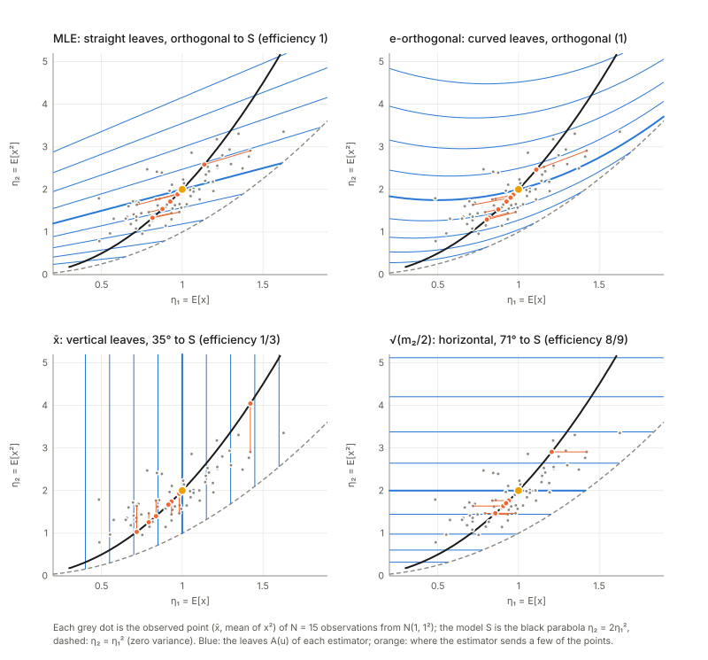
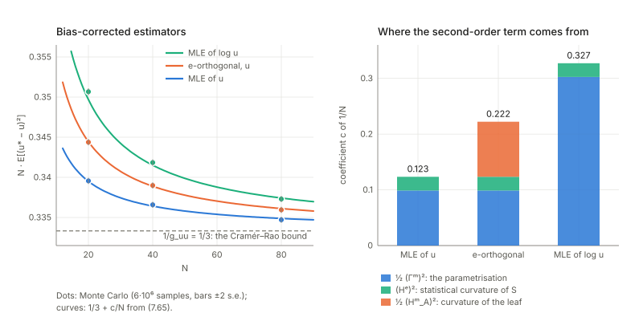
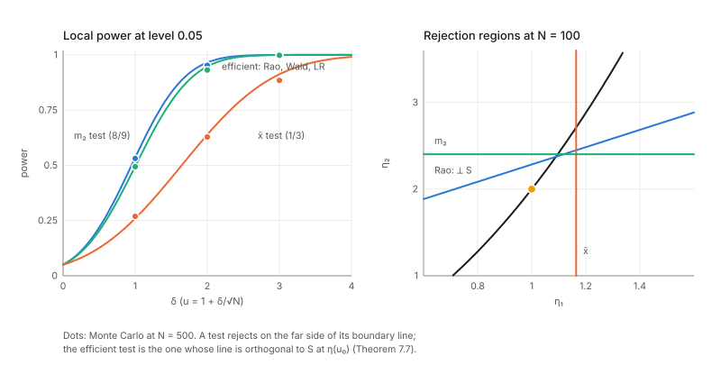
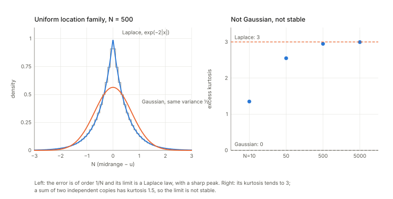

## Links

- **[Interactive companion](figures/interactive.html)**: seven widgets, all on the curved Gaussian family $N(u,u^2)$ and simulated exactly. (1) The Cramér–Rao bound for an exponential distribution, and Hodges' superefficient estimator. (2) The observed point as a random point near the model, with its Fisher ellipse and its skewness. (3) Estimators as foliations: leaves, the sampling law of $\sqrt N(\hat u-u)$, efficiency as an angle.
  (4) The bias of the MLE in five charts against $-\tfrac1{2N}g^{\beta\gamma}\Gamma^{(m)\alpha}_{\beta\gamma}$. (5) The three second-order terms of Theorem 7.5, with a simulation. (6) A hypothesis test: turn the boundary of the rejection region and watch its local power. (7) The uniform location family, where the Fisher information is infinite.
- **[Runnable checks](https://github.com/msrepo/information_geometry_notes/tree/main/chapters/ch07-asymptotic-theory-of-inference/code)**:
  `code/asymptotics.py` prints every number on this page and regenerates the figures with `python3 code/asymptotics.py --figures`; `make verify` runs it in about seven seconds. The sufficient statistics of $N$ Gaussian observations are sampled from their exact law (no samples are generated), with a fixed seed.
- The book: Amari, *Information Geometry and Its Applications* (Springer, 2016), DOI [10.1007/978-4-431-55978-8](https://doi.org/10.1007/978-4-431-55978-8). These notes cover Chapter 7 only; equation numbers such as (7.65) refer to the book.
  No text of the book is reproduced here; everything is restated and re-derived.
- Previous chapters written up: **[Chapter 5: elements of differential geometry](../ch05-elements-of-differential-geometry/index.html)** (the m-connection, its non-tensorial coefficients and embedding curvature are what this chapter runs on) and **[Chapter 2: exponential and mixture families](../ch02-exponential-and-mixture-families/index.html)**. **[Chapter 6: dual connections](../ch06-dual-connections/index.html)** is written up as well; the little of it that is used here is restated in §3, and the notes on Chapter 6 check the duality of the induced connections on a submanifold that §3 relies on.
  Background on the annotations site: **[The Fisher information matrix](https://msrepo.github.io/theory_inclined_papers_with_annotations/fisher-information/)**.

## In one paragraph

Statistics asks: from $N$ observations of a distribution in a model, how well can the unknown parameter be recovered, and how do you test a claim about it? Asymptotic theory answers for large $N$. The classical answer at first order is the **Cramér–Rao bound**: the error covariance of a good estimator cannot beat $G^{-1}/N$, the inverse Fisher information over $N$, and the maximum likelihood estimator (MLE) reaches it.
The chapter's geometric contribution is to say *why*, and what happens at the next order. For an **exponential family** the data enter only through the sample mean of the sufficient statistics, one point in the $\eta$-coordinates of the manifold, the **observed point** $\bar\eta$; the MLE is that point itself and is exactly unbiased with exactly covariance $G^{-1}/N$ (in the $\eta$ chart!).
Most models are smaller than an exponential family: a curve or surface $S$ sitting inside one, a **curved exponential family**. Then $\bar\eta$ is generally off $S$ and an **estimator is a map from the big manifold to the model**, which sorts the whole manifold into **leaves**, the sets of observed points that get the same estimate. Everything about the estimator is read off the leaves. At first order: the estimator is **consistent** if each leaf passes through the true point, and **efficient** if the leaf meets $S$ at a right angle in the Fisher metric; the MLE is the m-projection, with straight and orthogonal leaves.
At second order the variance of a bias-corrected efficient estimator exceeds $G^{-1}/N$ by $\tfrac1{2N^2}$ times a sum of **three non-negative squares**: how curved the model is (Efron's statistical curvature, the e-embedding curvature of $S$), how the parameter was chosen (the m-connection of the chart $u$), and how curved the leaves are (the m-embedding curvature of $A(u)$). Only the last depends on the estimator and the MLE makes it zero.
A **test** is a leaf of the same kind, the boundary of the rejection region, and again efficient means orthogonal. The chapter ends with models where this smooth picture fails.

## The spine of the argument

1. An estimator, its bias and error covariance; the Cramér–Rao bound; the MLE attains it to first order (§7.1).
2. In an exponential family the MLE is the observed point $\bar\eta$ in the $\eta$ chart: unbiased and exactly efficient there, but not in other charts, because bias and covariance are not tensors (§7.2).
3. In a curved family $S\subset M$ an estimator is a map $f:M\to S$; its inverse images $A(u)$ (the ancillary submanifolds) foliate $M$, and $w=(u,v)$ is a chart adapted to the leaves (§7.3).
4. The error $\tilde e=\sqrt N(\bar\eta-\eta)$ has moments $0$, $g_{ij}$, $T_{ijk}/\sqrt N$; expanding in the chart $w$ gives the bias (7.54) and the asymptotic law of $\hat u$ with precision $\bar g_{ab}=g_{ab}-g_{a\kappa}g_{b\lambda}g^{\kappa\lambda}\le g_{ab}$. Consistent iff the leaf passes through $(u,0)$; efficient iff it is orthogonal to $S$ (§7.4).
5. After removing the $1/N$ bias, the $1/N^2$ term of the covariance is $\tfrac12\{(\Gamma^m_S)^2+2(H^e_S)^2+(H^m_A)^2\}$; the bias-corrected MLE is second-order efficient (not third) (§7.5).
6. A test is efficient at first order iff the boundary of its rejection region is orthogonal to $S$; the tests differ at second order by curvature and angle (§7.6).
7. Outside the regular case: the uniform location family (closing remarks).

## Setup and notation

| Symbol | Meaning | In the running example |
|---|---|---|
| $D=\{x_1,\dots,x_N\}$ | $N$ independent observations from $p(x;\xi)$ | |
| $\hat\xi=f(D)$ | an estimator; $e=\hat\xi-\xi$ its error | |
| $b(\xi)=\mathbb E\hat\xi-\xi$ | bias (7.3); *asymptotically unbiased* if $b\to0$ (7.4) | |
| $V_{ij}=\mathbb E[e^ie^j]$ | error covariance (7.6) | |
| consistent | $\hat\xi\to\xi$ as $N\to\infty$ (7.5) | |
| $G=(g_{ij})$ | Fisher information matrix; $G^{-1}=(g^{ij})$ | |
| $M$, $S$ | the ambient exponential family ($n$-dimensional, coordinates $\theta$ or $\eta$) and the model, a submanifold ($m$-dimensional, coordinates $u$) | $M$ = all Gaussians with statistics $(x,x^2)$; $S=\{N(u,u^2)\}$ |
| $\bar\eta=\bar x$ | the observed point: the sample mean of the sufficient statistics (7.13)–(7.16) | $(\bar x,\overline{x^2})$ |
| $f:M\to S$, $A(u)=f^{-1}(u)$ | an estimator and its leaves (ancillary submanifolds), of dimension $n-m$ (7.20)–(7.23) | |
| $w=(u,v)$ | a chart of $M$ adapted to the leaves; $v$ runs inside a leaf, $v=0$ on $S$ (7.28) | |
| $B^i_\alpha=\partial\theta^i/\partial w^\alpha$, $B_{\alpha i}=\partial\eta_i/\partial w^\alpha$ | Jacobians (7.32)–(7.33) | |
| $g_{\alpha\beta}=B^i_\alpha g_{ij}B^j_\beta$ | Fisher information in the chart $w$, in blocks $g_{ab},g_{a\kappa},g_{\kappa\lambda}$ (7.36)–(7.37) | |
| $\tilde e=\sqrt N(\bar\eta-\eta)$, $\tilde w=\sqrt N(\bar w-w)$ | the normalised errors (7.42), (7.48) | |
| $\bar g_{ab}$ | Schur complement $g_{ab}-g_{a\kappa}g_{b\lambda}g^{\kappa\lambda}$ (7.58) | |
| $\hat u^*=\hat u-b(\hat u)$ | the bias-corrected estimator (7.62) | |

**The running example.** $S=\{N(u,u^2)\}$, a Gaussian whose standard deviation equals its mean, $u>0$. It lives in the two-parameter Gaussian exponential family with statistics $(x,x^2)$: $\theta(u)=(1/u,-1/2u^2)$ and $\eta(u)=(u,2u^2)$. In the plane of the observed point $\bar\eta=(\bar x,\overline{x^2})$, $S$ is the parabola $\eta_2=2\eta_1^2$ (the dashed parabola $\eta_2=\eta_1^2$ is zero variance, and nothing lies below it). At $u=1$:
$G=\left[\begin{smallmatrix}1&2\\2&6\end{smallmatrix}\right]=\operatorname{Cov}[(x,x^2)]$, $\theta'=(-1,1)$, $\eta'=G\theta'=(1,4)$, $\eta''=(0,4)$, and the Fisher information of $S$ is $g_{uu}=\theta'\cdot\eta'=3/u^2$.
Everything scales with $u$ (a scale family), so all second-order coefficients below carry a factor $u^2$; I quote them at $u=1$. The family is the standard textbook example of a curved exponential family, and it has the useful property that every estimator I need has a closed form, which makes exact simulation cheap.

**What I use from Chapter 6.** Two connections on $M$: the **e-connection**, for which the natural parameters $\theta$ are affine, and the **m-connection**, for which $\eta$ is (both flat; Chapter 5 §3 computed them on the Gaussians). They are dual with respect to the Fisher metric through the pairing $\langle\partial_i,\partial^j\rangle=\delta_i^j$ of the two bases, so a vector with $\eta$-chart components $a_i$ and one with $\theta$-chart components $b^i$ have inner product $a\cdot b$. For a curve $\theta(u)$ in $M$: its **e-embedding curvature** is the part of the acceleration $\theta''$ orthogonal to the curve, in the Fisher metric (in the $\theta$ chart the e-connection is the plain derivative); its **m-connection coefficient** in the chart $u$ is $\Gamma^{(m)u}_{uu}=\eta''\cdot\theta'/g_{uu}$ (the tangential part of the m-acceleration $\eta''$); the **m-embedding curvature** of a leaf with coordinate $v$ is the normal part of $\eta_{vv}$, whose component along $S$ is $H^{(m)u}_{vv}=\eta_{vv}\cdot\theta'/g_{uu}$. That is how I read (7.66)–(7.68) in the case $n=2$, $m=1$, and the simulations below confirm the reading. (The [notes on Chapter 6](../ch06-dual-connections/index.html) verify the duality of the induced e- and m-connections on a submanifold, with the same numbers: $4/3$, $-10/3$ and $\gamma^2=2/27$ for the curve $N(u,u^2)$.)

## 1. Estimation and the Cramér–Rao bound (§7.1)

**In plain words.** An *estimator* is any recipe turning the data into a guess of the parameter. You judge a recipe by three things: where its guesses are centred (**bias**: average guess minus truth), how spread out they are (**error covariance** $V$), and whether the guess homes in on the truth as the data grow (**consistency**). Both bias and spread usually shrink, the spread like $1/N$.
How small can the spread be? **Cramér–Rao** (Theorem 7.1): $V\ge G^{-1}/N$, in the sense that $V-G^{-1}/N$ is positive semidefinite. $G$ is the Fisher information of one observation; the bound says that a distribution whose likelihood is sharply peaked in a parameter direction is informative about it, and no estimator can extract more than that. The MLE (7.9) gets there at first order, $V_{\rm MLE}=G^{-1}/N+O(1/N^2)$ (7.10); an estimator that does is called *Fisher* or *first-order efficient*.

*A case computed in full: the exponential distribution.* Take rate $\lambda$, mean $\eta=1/\lambda$. For the mean, $\bar x$ is unbiased with variance exactly $\eta^2/N$, the bound (the Fisher information of $\eta$ is $1/\eta^2$): nothing is lost. For the rate (the same model in another chart) the MLE is $\hat\lambda=1/\bar x$, and since $\bar x\sim\mathrm{Gamma}(N)$ one gets exactly $\mathbb E\hat\lambda=N\lambda/(N-1)$ and $\mathrm{Var}\,\hat\lambda=N^2\lambda^2/((N-1)^2(N-2))$:

| $N$ | 5 | 10 | 20 | 50 | 200 | 1000 |
|---|---|---|---|---|---|---|
| $N\cdot\text{bias}/\lambda$ | 1.2500 | 1.1111 | 1.0526 | 1.0204 | 1.0050 | 1.0010 |
| $\mathrm{Var}/(\lambda^2/N)$, MLE | 2.6042 | 1.5432 | 1.2311 | 1.0846 | 1.0203 | 1.0040 |
| $\mathrm{Var}/(\lambda^2/N)$, unbiased $\tfrac{N-1}{N\bar x}$ | 1.6667 | 1.2500 | 1.1111 | 1.0417 | 1.0101 | 1.0020 |
| $N(\text{MLE ratio}-1)$ | 8.02 | 5.43 | 4.62 | 4.23 | 4.06 | 4.01 |

So (7.10) holds, and the $O(1/N^2)$ coefficient is $4\lambda^2$ (the ratio is $1+4/N+11/N^2+\dots$), a number that depends on the chart. No estimator of the rate attains the bound at any finite $N$, not even the unbiased one (it loses $N/(N-2)$); only the estimator of the expectation parameter does. That asymmetry is the subject of §7.2.

**A counterexample to the theorem as printed.** Theorem 7.1 is stated for asymptotically unbiased estimators, $b\to0$ at every $\xi$ (7.4). That is not enough. *Hodges' estimator* of the mean $u$ of $N(u,1)$ returns $\bar x$ unless $\lvert\bar x\rvert<N^{-1/4}$, in which case it returns $0$. For any fixed $u\neq0$ the event $\lvert\bar x\rvert<N^{-1/4}$ becomes impossible as $N$ grows, so it behaves like $\bar x$: consistent, asymptotically unbiased, $N\cdot\mathrm{Var}\to1=G^{-1}$. At $u=0$ it returns $0$ almost always, so its mean squared error is almost $0$: exactly computed, $N\cdot\mathrm{MSE}(0)=0.0186$ at $N=100$ and $0.0000$ at $N=10^4$, far below the "bound" $1$.
The price is paid nearby: for $u$ of the order $N^{-1/4}$ the estimator is stuck at $0$ half the time, and the worst case over $u$ is $N\cdot\mathrm{MSE}=5.58$ ($N=100$), $68.9$ ($N=10^4$), $858$ ($N=10^6$). So the bound holds for exactly unbiased estimators (finite $N$), and asymptotically only with a uniformity requirement on the convergence over $u$; "good at one point, bad nearby" is also what the chapter's remark on Rao's bias correction in §7.5 is after (right panel above).

## 2. Estimation in an exponential family (§7.2)

**In plain words.** The probability of the whole data set in an exponential family is $p(D;\theta)=\exp\{N(\theta\cdot\bar x-\psi(\theta))\}$ (7.12): the data enter *only* through the sample mean $\bar x$ of the sufficient statistics (this is what sufficient means). So a whole data set is summarised by one point of the manifold, the **observed point**: the member of the family whose expectation parameter is $\eta=\bar x$ (7.16). Maximising (7.12) in $\theta$ gives $\nabla\psi(\hat\theta)=\bar x$, that is

$$\hat\eta_{\rm MLE}=\bar x=\bar\eta\qquad(7.14\text{–}7.15):$$

the MLE *is* the observed point, in the $\eta$ chart.

**Theorem 7.2.** $\mathbb E\hat\eta=\eta$ and $V=G^{-1}/N$, exactly, for every $N$, with $G$ the Fisher information in the $\eta$ chart. (The book argues by the central limit theorem; the two identities need only that $\bar\eta$ is an average of independent copies, so $\mathbb E\bar\eta=\eta$ and $\operatorname{Cov}\bar\eta=\operatorname{Cov}[x]/N$. The CLT adds that the *law* is asymptotically Gaussian.) Check on $N(1,2^2)$, $N=10$, $4\times10^6$ simulated samples: $\mathbb E(\bar x,\overline{x^2})=(1.0002,5.0003)$ for $\eta=(1,5)$, and $N\operatorname{Cov}=\left[\begin{smallmatrix}3.998&7.992\\7.992&47.97\end{smallmatrix}\right]$ against $\operatorname{Cov}[(x,x^2)]=\left[\begin{smallmatrix}4&8\\8&48\end{smallmatrix}\right]$.

**The remark: other charts are not so lucky.** The MLE of any other parameter $w(\eta)$ is $w(\bar\eta)$ (plug in the observed point), and it is only asymptotically unbiased and efficient "because bias and covariance are not tensors". Make this precise. Expanding $w(\bar\eta)$ to second order around $\eta$, the bias is $\tfrac12\,\partial^2w/\partial\eta\partial\eta\cdot\operatorname{Cov}(\bar\eta)$, and the book's (7.54) (next section) rewrites it as
$$b^\alpha=-\frac1{2N}\,g^{\beta\gamma}\,\Gamma^{(m)\alpha}_{\beta\gamma},\qquad \Gamma^{(m)\alpha}_{\beta\gamma}=\frac{\partial w^\alpha}{\partial\eta_i}\frac{\partial^2\eta_i}{\partial w^\beta\partial w^\gamma}.$$
The coefficient $C_{\beta\gamma}{}^\alpha$ the book writes in (7.53) **is the coefficient of the m-connection in the chart $w$** (the connection that vanishes in $\eta$), contracted with the inverse Fisher metric. The book does not say so, but it is exactly Chapter 5's lesson: the connection coefficients are not a tensor, they are zero in the affine chart $\eta$ and not elsewhere, and neither is the bias.

*Check at $(\mu,\sigma)=(1,2)$* in three charts of the Gaussian family, with the m-connection symbols of Chapter 5 ($\Gamma^m_{\mu\mu}{}^\sigma=\Gamma^m_{\sigma\sigma}{}^\sigma=1/\sigma$ in $(\mu,\sigma)$; in $\theta$, $\Gamma^m_{\beta\gamma}{}^\alpha=g^{\alpha i}T_{i\beta\gamma}$): the formula predicts $N\cdot$bias $=0$ in $\eta$, $(0,-3\sigma/4)=(0,-1.5)$ in $(\mu,\sigma)$, and $(0.75,-0.375)$ in $\theta$. Exact finite-$N$ values (using $N\hat\sigma^2/\sigma^2\sim\chi^2_{N-1}$):

| $N$ | $N(\mathbb E\hat\sigma-\sigma)$ | $N(\mathbb E\hat\theta_1-\theta_1)$ | $N(\mathbb E\hat\theta_2-\theta_2)$ |
|---|---|---|---|
| 10 | −1.5451 | 1.0714 | −0.5357 |
| 40 | −1.5110 | 0.8108 | −0.4054 |
| 160 | −1.5027 | 0.7643 | −0.3822 |
| 1000 | −1.5004 | 0.7523 | −0.3761 |

They converge to $-1.5$, $0.75$, $-0.375$. The fourth widget of the interactive page does the same for five charts at any point and sample size, with a simulation next to the formula.

## 3. Estimation in a curved exponential family (§7.3)

**In plain words.** Many models are *smaller* than an exponential family. $S=\{N(u,u^2)\}$ is a curve in the two-parameter family $M$. Data from $S$ still give an observed point $\bar\eta$ in the big plane, but it almost never lies on the curve, so the estimator has to *map* it onto the curve: $\hat u=f(\bar\eta)$, $f:M\to S$ (7.19)–(7.21). Consistency (the observed point converges to the true point $\eta(u)\in S$ by the law of large numbers) needs $f(\eta(u))=u$ (7.22).

**Leaves.** The set of observed points that $f$ sends to the same $u$ is its **inverse image** $A(u)=f^{-1}(u)$ (7.23), an $(n-m)$-dimensional submanifold through $\eta(u)$ when the estimator is consistent: an **ancillary submanifold**. Different $u$ give disjoint leaves covering a neighbourhood of $S$ (7.24)–(7.25), a *foliation*. Pick a coordinate $v$ inside each leaf with $v=0$ on $S$; then $w=(u,v)$ is a chart of $M$ adapted to the estimator (7.28), $S=\{v=0\}$ (7.31), and the estimator is just "read off the first coordinates of the observed point": $\hat u=\bar u$ where $\bar\eta=\eta(\bar u,\bar v)$ (7.38)–(7.39). The Fisher information in this chart is $g_{\alpha\beta}=B^i_\alpha g_{ij}B^j_\beta$ with blocks $g_{ab}$ (the model), $g_{a\kappa}$ (leaf against model), $g_{\kappa\lambda}$ (7.36)–(7.37).

**Five estimators of $u$ for $N(u,u^2)$, as five foliations of the plane.** With $(a,b)=(\bar x,\overline{x^2})$ the observed point:

| Estimator | Formula | Leaf through $\eta(u)$ | Angle to $S$ at $u=1$ |
|---|---|---|---|
| MLE | $\tfrac12(\sqrt{a^2+4b}-a)$, root of $u^2+au-b=0$ | straight line $\eta_2=u\eta_1+u^2$ | $90^\circ$ |
| e-orthogonal | $\tfrac14(a+\sqrt{8b-7a^2})$ | parabola $\eta_2=\eta_1^2-u\eta_1+2u^2$, a straight line in $\theta$ | $90^\circ$ |
| sample mean | $a$ | vertical line $\eta_1=u$ | $35.26^\circ$ |
| second moment | $\sqrt{b/2}$ | horizontal line $\eta_2=2u^2$ | $70.53^\circ$ |
| $1.1\,\bar x$ | $1.1a$ | vertical line $\eta_1=u/1.1$, which misses $\eta(u)$ | – |

The MLE's leaf: the likelihood equation $\theta'(\hat u)\cdot(\bar\eta-\eta(\hat u))=0$ rearranges to $b=\hat u\,a+\hat u^2$. Two leaves $u_1,u_2$ meet at $\eta_1=-(u_1+u_2)<0$, so for $\eta_1>0$ they never cross and the foliation is clean; their envelope $\eta_2=-\eta_1^2/4$ lies outside the allowed region.
The e-orthogonal estimator is my construction for the second-order test of §5: its leaves are the lines through $\theta(u)$ in the $\theta$ plane orthogonal to $S$ in the Fisher metric; solving $(\bar\theta-\theta(u))\cdot\eta'(u)=0$ gives a quadratic with the closed form above.

**The MLE is the m-projection.** The observed point corresponds to a Gaussian $p_{\bar\eta}$ with expectation $\bar\eta$; maximising the likelihood of the data is minimising $\mathrm{KL}[p_{\bar\eta}\Vert p_u]$ over $u$, the **m-projection** of Chapter 1: along an m-geodesic (a straight line in $\eta$) to the foot, orthogonal to $S$. Check: for 1500 observed points ($N=20$, $u=1$) the minimiser of the KL over a grid of spacing $10^{-4}$ agrees with the closed form to $4.9\times10^{-5}$, and the orthogonality residual $(\bar\eta-\eta(\hat u))\cdot\theta'(\hat u)$ is $1.3\times10^{-15}$. So its leaves are m-flat and orthogonal to $S$.

## 4. First-order asymptotic theory (§7.4)

**The error of the observed point (Theorem 7.3).** Let $e=\bar\eta-\eta$ and $\tilde e=\sqrt N e$ (7.41)–(7.42). Then $\mathbb E\tilde e_i=0$, $\mathbb E\tilde e_i\tilde e_j=g_{ij}$ and $\mathbb E\tilde e_i\tilde e_j\tilde e_k=T_{ijk}/\sqrt N$ with $g_{ij}=\partial_i\partial_j\psi$ and $T_{ijk}=\partial_i\partial_j\partial_k\psi$ (7.43)–(7.47): the covariance is the Fisher matrix and the third moment is the **cubic tensor** of Chapter 5, and it dies like $1/\sqrt N$ (the skewness of an average). These are *exact* for every $N$ in an exponential family (cumulants of a mean). Exact enumeration on a binomial, $p=0.3$, $N=10$: $\mathbb E\tilde e=4\times10^{-17}$, $\mathbb E\tilde e^2=0.210000=p(1-p)$, $\mathbb E\tilde e^3=0.026563=T/\sqrt N$ with $T=p(1-p)(1-2p)$. In the plane of the observed point the cloud of observed points is an ellipse with covariance $G/N$, visibly skewed at small $N$ (second widget).

**Expanding in the adapted chart.** Write the observed point's $w$-coordinates as $w+\tilde w/\sqrt N$; then $\bar x=\eta(w+\tilde w/\sqrt N)=\eta+\tfrac1{\sqrt N}B\tilde w+\tfrac1{2N}B_2\tilde w\tilde w+\dots$ with $B_{\alpha i}=\partial\eta_i/\partial w^\alpha$ and $B_{\alpha\beta i}=\partial^2\eta_i/\partial w^\alpha\partial w^\beta$ (7.49)–(7.51). Invert (the $n\times n$ matrix $B$ is invertible):
$$\tilde w^\alpha=g^{\alpha\beta}B_\beta{}^i\tilde e_i-\frac1{2\sqrt N}C_{\beta\gamma}{}^\alpha\tilde w^\beta\tilde w^\gamma+\dots\qquad(7.52),\quad C_{\beta\gamma}{}^\alpha=B^{\alpha i}B_{\beta\gamma i}\ (7.53).$$
The linear term has mean zero, so $\mathbb E\tilde w^\alpha=-\frac1{2\sqrt N}C_{\beta\gamma}{}^\alpha g^{\beta\gamma}$ and $\mathbb E\tilde w^\alpha\tilde w^\beta=g^{\alpha\beta}$ (7.54)–(7.55), with $g^{\alpha\beta}$ the full inverse of $g_{\alpha\beta}$. Section 2 identified $C$ with the m-connection coefficient. Since $\tilde e$ is asymptotically Gaussian, so is $\tilde w$, with precision $g_{\alpha\beta}$ (7.56); integrating out the leaf coordinate $\tilde v$ leaves a Gaussian for $\tilde u$ with precision
$$\bar g_{ab}=g_{ab}-g_{a\kappa}g_{b\lambda}g^{\kappa\lambda}\qquad(7.58).$$

*A notational point.* For this to be the precision of the marginal, $g^{\kappa\lambda}$ must mean the **inverse of the $\kappa\lambda$ block** of $g_{\alpha\beta}$ (a Schur complement). It cannot be the $\kappa\lambda$ block of the full inverse $g^{\alpha\beta}$ of (7.55), the other natural reading, which differs unless $g_{a\kappa}=0$: for the sample mean in the running example $g=\left[\begin{smallmatrix}3&1\\1&0.5\end{smallmatrix}\right]$, the first reading gives $\bar g=3-1^2/0.5=1$ (the precision of $\sqrt N\bar x$, whose variance is $u^2=1$), the second gives $3-1^2\cdot6=-3$, a negative "precision".

**Efficiency is orthogonality.** $\bar g_{ab}=g_{ab}-g_{a\kappa}g_{b\lambda}g^{\kappa\lambda}\le g_{ab}$ (7.61), because the subtracted matrix is positive semidefinite (checked on 2000 random $3\times3$ metrics: smallest eigenvalue of the difference $1.9\times10^{-4}\ge0$), with equality iff $g_{a\kappa}=0$, i.e. iff the leaf is orthogonal to $S$ (7.59). The covariance of $\tilde u$ is $(\bar g)^{-1}\ge(g_{ab})^{-1}$, the Cramér–Rao bound of the model $S$.

**Theorem 7.4.** (1) An estimator is consistent iff its leaf through $\eta(u)$ is labelled $u$ [the leaf passes through $(u,0)$]. (2) A consistent estimator is efficient iff its leaves are orthogonal to $S$. The MLE is the m-projection, hence orthogonal, hence efficient. For one-dimensional $S$ and leaf the efficiency is $\bar g/g_{uu}=\sin^2$ of the angle between the leaf and $S$.
*Numbers at $u=1$* ($g_{uu}=3$, so the bound is $1/3$):

| Estimator | $g_{uv}$ | $g_{vv}$ | $\bar g$ | $1/\bar g$ | angle | efficiency | $N\,\mathbb E(\hat u-u)^2$ at $N=4000$ |
|---|---|---|---|---|---|---|---|
| MLE | 0 | 1.5 | 3.0000 | 0.3333 | 90° | 1 | 0.3335 ± 0.0002 |
| e-orthogonal | 0 | 1.5 | 3.0000 | 0.3333 | 90° | 1 | 0.3335 ± 0.0002 |
| sample mean | 1 | 0.5 | 1.0000 | 1.0000 | 35.26° | 1/3 | 0.9997 ± 0.0007 |
| $\sqrt{m_2/2}$ | −1 | 3 | 2.6667 | 0.3750 | 70.53° | 8/9 | 0.3751 ± 0.0003 |

(Monte Carlo with $4\times10^6$ samples; $\pm$ is one standard error.) The sample mean is consistent but uses a third of the information: you need three times the data to match the MLE. The inconsistent $1.1\,\bar x$ has mean $1.1000$ at $N=4000$, not $1$: its leaf misses the true point. The first-order theory is *linear*, a statement about the tangent space at $\eta$, which is why it holds for every regular model (the book's remark).

## 5. Higher-order asymptotic theory (§7.5)

### 5.1 Bias correction

**In plain words.** Two first-order efficient estimators have the same variance $G^{-1}/N$ to leading order. To compare them one looks at the next term, $1/N^2$, and that term is polluted by bias: an estimator that is biased by $b_1/N$ has mean squared error larger by $b_1^2/N^2$ for that reason alone, and a *cheat* (the book's example is the constant guess $\hat u=u_0$, which has zero variance and is perfect at one point) could game any variance comparison. So the comparison is made after removing the $O(1/N)$ bias: $\hat u^*=\hat u-b(\hat u)$ (7.62), whose bias is $O(1/N^2)$ (7.63).
The asymptotic bias is (7.54), i.e. $-\tfrac1{2N}(g^{ab}\Gamma^{(m)u}_{ab}+g^{\kappa\lambda}\Gamma^{(m)u}_{\kappa\lambda})$ for orthogonal leaves: **a part from how $u$ sits in $S$, and a part from the m-curvature of the leaf**. Checks at $u=1$ ($N\times$ bias):

| Estimator | formula (7.54) (S part, leaf part) | delta method | Monte Carlo $N=40$ | $N=160$ |
|---|---|---|---|---|
| MLE | −0.2222 (−0.2222, 0) | −0.2222 | −0.2208 ± 0.0015 | −0.2291 ± 0.0030 |
| e-orthogonal | −0.4444 (−0.2222, −0.2222) | −0.4444 | −0.4443 ± 0.0015 | −0.4517 ± 0.0030 |
| sample mean | 0 | 0 | +0.0028 ± 0.0026 | −0.0091 ± 0.0052 |
| $\sqrt{m_2/2}$ | −0.1875 (−0.1875, 0) | −0.1875 | −0.1860 ± 0.0016 | −0.1950 ± 0.0032 |

Exactly: $-2u/9$ (MLE), $-4u/9$ (curved leaves double it), $0$, $-3u/16$. The delta method (the second-order Taylor expansion of the estimator as a function of $\bar\eta$) and (7.54) agree to the digits shown; they are the same computation, which is the content of (7.52).

**The correction must be a function of the estimate.** $b(\hat u)$ is the bias function evaluated at the *estimate*, here $-2\hat u/9$, not at the true $u$ (unknown). The difference matters at precisely the order of Theorem 7.5, because $b'(\hat u)(\hat u-u)/N$ is a $1/N^{3/2}$ perturbation whose covariance with $\hat u$ is of order $1/N^2$. Simulation at $N=20$: the bias-corrected MLE with the function has $N\,\mathbb E(\hat u^*-u)^2=0.33956$, while subtracting the constant $2/(9N)$ (an oracle that uses the true $u$) gives $0.33214$, below $1/3+c/N$ and with the coefficient $c$ replaced by $c+2b_1'g^{uu}=\tfrac{10}{81}-\tfrac4{27}=-\tfrac2{81}$ (prediction $0.33210$; at $N=40$ $0.33287$ against $0.33272$).

### 5.2 Theorem 7.5: three non-negative squares

The covariance of a bias-corrected efficient estimator is
$$\mathbb E[\tilde u^{*a}\tilde u^{*b}]=g^{ab}+\frac1{2N}\Big\{(\Gamma^{m2}_S)^{ab}+2(H^{e2}_S)^{ab}+(H^{m2}_A)^{ab}\Big\}+O(N^{-2})\qquad(7.65),$$
with $(\Gamma^{m2}_S)^{ab}=\Gamma^{(m)a}_{cd}\Gamma^{(m)b}_{ef}g^{ce}g^{df}$ (7.68), $(H^{e2}_S)^{ab}=H^{(e)\kappa}_{ec}H^{(e)\lambda}_{fd}g^{cd}g_{\kappa\lambda}g^{ae}g^{fb}$ (7.66), $(H^{m2}_A)^{ab}=H^{(m)a}_{\kappa\lambda}H^{(m)b}_{\mu\nu}g^{\kappa\mu}g^{\lambda\nu}$ (7.67). The book omits the proof ("formidably complicated"). For $n=2$, $m=1$ and orthogonal leaves, in the notation of the setup, they are
$$\Big(\frac{\Gamma^{(m)u}_{uu}}{g_{uu}}\Big)^2,\qquad \frac{\gamma^2}{g_{uu}}=\frac{\lvert\text{normal part of }\theta''\rvert^2}{g_{uu}^3},\qquad\Big(\frac{\eta_{vv}\cdot\theta'}{g_{uu}\,g_{vv}}\Big)^2,$$
where $\gamma^2=\lvert\text{normal part of }\theta''\rvert^2/g_{uu}^2$ is **Efron's statistical curvature** (it vanishes iff $S$ is an exponential family, i.e. e-flat). So the three terms measure: the **model** (how far $S$ is from an exponential family), the **parametrisation** $u$ (the m-connection of the chart, non-tensorial: change $u$ and it changes), and the **estimator** (the m-curvature of its leaves). Only the last depends on which efficient estimator you choose; **the MLE has straight leaves in $\eta$, so it is zero** (Theorem 7.6: the bias-corrected MLE is second-order efficient).

**The three terms for $N(u,u^2)$ at $u=1$.** $\Gamma^{(m)u}_{uu}=\eta''\cdot\theta'/g_{uu}=4/3$; the normal part of $\theta''=(2,-3)$ has squared Fisher length $2/3$, so $\gamma^2=\tfrac{2/3}{9}=\tfrac2{27}=0.0741$; the leaves of the MLE have $\eta_{vv}=0$ and those of the e-orthogonal estimator $\eta_{vv}=(0,2)$ with $g_{vv}=3/2$. The coefficient $c=\tfrac12\{\dots\}$ of $1/N$ in $N\,\mathbb E(\hat u^*-u)^2=g^{uu}+c/N$:

| Estimator | $(\Gamma^m)^2$ | $2(H^e)^2$ | $(H^m_A)^2$ | $c$ |
|---|---|---|---|---|
| MLE of $u$ | $16/81=0.1975$ | $4/81=0.0494$ | $0$ | $10/81=0.1235$ |
| e-orthogonal estimator of $u$ | 0.1975 | 0.0494 | $16/81=0.1975$ | $2/9=0.2222$ |
| MLE of $\log u$ | $49/81=0.6049$ | 0.0494 | 0 | $53/162=0.3272$ |

Monte Carlo of the bias-corrected estimators ($6\times10^6$ exact samples each; the corrections are $-b_1(\hat u)/N$ with $b_1=-2u/9$, $-4u/9$ and, for $\log u$, $-7/18$ and $-11/18$ from (7.54) in that chart): $N\,\mathbb E(\hat u^*-u)^2$, measured against $\tfrac13+c/N$:

| $N$ | MLE of $u$ | e-orthogonal | MLE of $\log u$ | e-orthogonal $-$ MLE (paired) |
|---|---|---|---|---|
| 20 | 0.33956 (pred. 0.33951) | 0.34438 (0.34444) | 0.35067 (0.34969) | 0.00482 (0.00494) |
| 40 | 0.33658 (0.33642) | 0.33899 (0.33889) | 0.34184 (0.34151) | 0.00241 (0.00247) |
| 80 | 0.33471 (0.33488) | 0.33595 (0.33611) | 0.33730 (0.33742) | 0.00123 (0.00123) |

Standard errors are $0.0002$, except $0.00004$ or less for the paired difference (the same data for both estimators). The prediction $8/(81N)$ for what the curved leaves add is reproduced to within 3 percent at all three sample sizes (paired difference $0.975$, $0.978$, $1.000$ of the prediction). The MLE and e-orthogonal columns are within about one standard error of the prediction; the $\log u$ column is within two standard errors at $N=40$ and $80$ but $0.0010$ high at $N=20$, which is 6 percent of its second-order term and which I take to be the $O(N^{-2})$ remainder. And **reparametrising by $\log u$ makes the first term much larger**, as the formula says: the MLE of $\log u$ has coefficient $0.3272$ against $0.1235$. In the picture, left: dots measured, curves $\tfrac13+c/N$; right: where $c$ comes from.

### 5.3 Isolating one term at a time

The three terms can be separated by choices that kill the others.

- **The m-affine parameter.** The parameter $\tau$ for which $\Gamma^{(m)}=0$ along $S$ solves $d^2u/d\tau^2=-\Gamma^u_{uu}(du/d\tau)^2$ with $\Gamma^u_{uu}=4/(3u)$, giving $\tau=u^{7/3}$. In it the first-order bias of the MLE vanishes ($b_1=\tfrac73(-\tfrac29)+\tfrac12\cdot\tfrac{28}9\cdot\tfrac13=0$) and the only second-order term left is $(H^e)^2$: $N\,\mathbb E(\hat\tau-\tau)^2=g^{\tau\tau}+c/N$ with $g^{\tau\tau}=49/27=1.8148$ and $c=98/729=0.1344$. Simulation of the plain MLE $\hat u^{7/3}$ ($8\times10^6$ samples): $N=10$: $1.82962\pm0.00116$ against $1.82826$ (fraction of the predicted second-order term $1.10\pm0.09$); $N=15$: $1.82413$ against $1.82378$ ($1.04\pm0.12$); $N=20$: $1.82314$ against $1.82154$ ($1.24\pm0.15$); the first-order bias is $0$ to within noise. Had the e-curvature term only half the weight $2$ of (7.65), these data would sit at about twice the predicted second-order term, which they do not. In this parameter the *relative* second-order loss is $c/g^{\tau\tau}=\tfrac{98/729}{49/27}=\tfrac2{27}=\gamma^2$: Efron's statistical curvature, exactly.
- **Exactly solvable cases, no simulation.** $\{N(0,s)\}$ with sufficient statistic $x^2$ is a one-dimensional exponential family ($n=m=1$: no leaves, no e-curvature), so only $c=\tfrac12(\Gamma^{(m)u}_{uu}/g_{uu})^2$ remains. The exact variances of the exactly unbiased estimators give $N^2(\mathrm{Var}-g^{uu}/N)$, which tends to $c$:

| parameter | $\theta'$ | $\eta'$ | $\eta''$ | $g$ | $\Gamma^m$ | $c$ | exact, $N=10,100,1000$ |
|---|---|---|---|---|---|---|---|
| $s=\sigma^2$ | 0.5 | 1 | 0 | 0.5 | 0 | 0 | 0, 0, 0 |
| $\sigma$ | 1 | 2 | 2 | 2 | 1 | 1/8 | 0.1185, 0.1244, 0.1249 |
| $\log\sigma$ | 1 | 2 | 4 | 2 | 2 | 1/2 | 0.5331, 0.5033, 0.5003 |

  (Variance of $m_2$ itself, $2s^2/N$; of $\hat\sigma/c_N$ with $c_N=\sqrt{2/N}\,\Gamma(\tfrac{N+1}2)/\Gamma(\tfrac N2)$; and of $\tfrac12\log m_2$ minus its bias, $\tfrac14\psi'(N/2)$.) The exact second-order coefficients $0,\tfrac18,\tfrac12$ are the m-connection term, and *it depends on how the unknown is parametrised.* When $S$ is e-flat and the parameter m-affine nothing is left: $S=\{N(u,1)\}$ has $\theta=(u,-\tfrac12)$, a straight line in $\theta$, $\Gamma^m=0$ and $\bar x$ has variance $1/N$ exactly.

### 5.4 Theorem 7.6, and what it does not say

An efficient estimator is *second-order efficient* when its leaves have zero m-embedding curvature at $S$; then $(H^m_A)^2=0$ and its second-order coefficient is the smallest possible, since the other two terms are the same for every estimator. In the example, the bias-corrected MLE beats the e-orthogonal estimator by exactly $8/(81N)$ and there is nothing to be gained over it. The book closes the section with Kano's result (1997, 1998): the MLE is *not* third-order efficient, "Fisher's dream" fails at the next order. That remark concerns the $1/N^3$ term and I have not checked it.

## 6. Asymptotic theory of hypothesis testing (§7.6)

**In plain words.** Test $H_0:u=u_0$ against $u>u_0$. A test is a rule that, from the observed point $\bar\eta$, decides to reject; equivalently a **rejection region** $R$ in $M$ whose boundary $B$ is a hypersurface (a curve when $n=2$). Under $H_0$ the observed point converges to $\eta(u_0)$, so the boundary must pass close to $\eta(u_0)$ and shrink onto it as $N\to\infty$. A family of such boundaries labelled by $u_0$ is exactly an ancillary family $A_N(u)$ with $N$ in the name, so the geometry of §3–§5 applies verbatim.
**Theorem 7.7:** a test is first-order efficient iff its boundary $A_N(u)$ is orthogonal to $S$ and passes through a point $u_N\to u_0$.

*Why, and with numbers.* Reject when $n\cdot(\bar\eta-\eta(u_0))$ is large (a straight boundary with normal $n$). For local alternatives $u=u_0+\delta/\sqrt N$ the statistic shifts by $\delta\,n\cdot\eta'/\sqrt N$ while its standard deviation under $H_0$ is $\sqrt{n^{\mathsf T}Gn/N}$, so the power is $\Phi(\delta\,s(n)-z_\alpha)$ with the shift factor $s(n)=n\cdot\eta'/\sqrt{n^{\mathsf T}Gn}$. By Cauchy–Schwarz ($\eta'=G\theta'$) $s(n)\le\sqrt{g_{uu}}$, with equality iff $n\propto\theta'(u_0)$, which is the boundary orthogonal to $S$: that is the **Rao score test** (the score of $N$ observations is $N\theta'\cdot(\bar\eta-\eta)$). At $u_0=1$:

| Test | normal $n$ | shift $s$ | efficiency $s^2/g_{uu}$ |
|---|---|---|---|
| score / MLE-based | $\theta'=(-1,1)$ | $1.7321=\sqrt3$ | 1 |
| sample mean | $(1,0)$ | 1.0000 | 1/3 |
| second moment | $(0,1)$ | 1.6330 | 8/9 |

the **same three numbers** as the efficiencies of the estimators with the same leaf directions: a test loses what its angle costs. Simulation (exact sampling, $2\times10^6$ samples per cell, critical values calibrated to level $0.05$ under $H_0$; Wald means any monotone function of $\hat u$, which all share one boundary):

| $N$ | $\delta$ | Rao | Wald | LR | $\bar x$ | $m_2$ | asymptotic: efficient / $\bar x$ / $m_2$ |
|---|---|---|---|---|---|---|---|
| 50 | 1 | 0.5195 | 0.5196 | 0.5199 | 0.2864 | 0.4858 | 0.5347 / 0.2595 / 0.4953 |
| 50 | 2 | 0.9195 | 0.9199 | 0.9198 | 0.6098 | 0.8938 | 0.9656 / 0.6388 / 0.9475 |
| 500 | 1 | 0.5311 | 0.5310 | 0.5312 | 0.2689 | 0.4937 | |
| 500 | 2 | 0.9527 | 0.9527 | 0.9527 | 0.6284 | 0.9317 | |
| 5000 | 1 | 0.5338 | 0.5337 | 0.5337 | 0.2622 | 0.4950 | |
| 5000 | 2 | 0.9617 | 0.9618 | 0.9617 | 0.6339 | 0.9425 | |

The efficient tests converge to $0.5347$ and $0.9656$, the sample-mean test to $0.2595$ and $0.6388$, the second-moment test to $0.4953$ and $0.9475$, as the formula says. **Rao, Wald and the likelihood-ratio test agree to within $0.0005$ at every $N$**: the book says they differ at second order, in the m-embedding curvature and the asymptotic angle of $A_N(u)$ (and that no test is uniformly most powerful at that order unless $S$ is exponential), but in this model I could not make any difference visible, so I have no numerical check of that statement.

## Remarks and the non-regular case

The chapter's closing remarks are historical and I restate only the substance: first-order theory is Cramér–Rao and Neyman–Pearson; second-order theory was developed around 1975–1985 (Efron's statistical curvature in 1975, then the differential-geometric treatment of estimation and tests); and the results extend beyond curved exponential families to general regular models by attaching a "local exponential family" (higher derivatives of the score) to $S$. I have not checked the extension.

**A non-regular model: the uniform location family.** $x\sim U[u-\tfrac12,u+\tfrac12]$ has infinite Fisher information, the Riemannian picture breaks (the book says a Finsler one is needed) and the estimator is not asymptotically Gaussian. The midrange $(x_{\max}+x_{\min})/2$ has error of order $1/N$: exactly $N^2\operatorname{Var}=N^2/(2(N+1)(N+2))\to\tfrac12$ (simulated $0.3786,\,0.4718,\,0.4965,\,0.5009$ against $0.3788,\,0.4713,\,0.4970,\,0.4997$ at $N=10,50,500,5000$). The error is $(E_2-E_1)/(2N)$ with $E_1,E_2$ the (asymptotically exponential) gaps between the sample extremes and the ends of the interval, so $N(\text{midrange}-u)\to$ a **Laplace law** with density $e^{-2\lvert x\rvert}$: variance $\tfrac12$ and excess kurtosis $3$ (simulated $1.351,\,2.550,\,2.949,\,2.996$).
The book says the limit is a **stable** distribution. A Laplace law is not stable: if it were, a sum of two independent copies would have the same shape, hence the same kurtosis; the simulated sum of two copies has excess kurtosis $1.48\approx3/2$. The limit is non-Gaussian, with a $1/N$ rather than $1/\sqrt N$ scale, which is what the passage needs, but "stable" is not the right word.

## Checks of the book's statements

| Where | Statement | What I found |
|---|---|---|
| Theorem 7.1, (7.4) | $V\ge G^{-1}/N$ for asymptotically unbiased estimators | **needs uniformity**: Hodges' estimator is consistent with $b\to0$ at every $u$ and has $N\,\mathrm{MSE}(0)=0.0186$ at $N=100$, $\to0$; worst case $5.58$, $68.9$, $858$ at $N=10^2,10^4,10^6$. For exactly unbiased estimators the bound holds (exponential rate: unbiased variance $N/(N-2)$ times the bound) |
| (7.10) | $V_{\rm MLE}=G^{-1}/N+O(N^{-2})$ | verified on the exponential rate: ratio $1+4/N+11/N^2$ ($1.0040$ at $N=1000$); the $O(N^{-2})$ coefficient is chart dependent |
| Theorem 7.2 | MLE unbiased, $V=G^{-1}/N$ in $\eta$ | verified (Gaussian, $N=10$); exact for every $N$ without the CLT. The remark about other charts: verified, exact biases of $\hat\sigma,\hat\theta$ converge to $(−1.5,0.75,−0.375)$ |
| (7.53)–(7.54) | $\mathbb E\tilde w=-\tfrac1{2\sqrt N}C_{\beta\gamma}{}^\alpha g^{\beta\gamma}$ | verified for four estimators ($N\,b=-2/9,-4/9,0,-3/16$) against the delta method and Monte Carlo; **$C$ is the m-connection coefficient of the chart $w$**, which explains why the bias is not a tensor (not stated in the book) |
| Theorem 7.3 | moments of $\tilde e$ | exact on the binomial: $\mathbb E\tilde e^3=0.026563=T/\sqrt N$ |
| (7.56)–(7.58) | asymptotic law of $\hat u$, precision $\bar g$ | verified: $N\,\mathrm{Var}=0.3335,\,0.3335,\,0.9997,\,0.3751$ for MLE, e-orth, $\bar x$, $\sqrt{m_2/2}$ against $1/\bar g=0.3333,\,0.3333,\,1,\,0.375$. **Notation:** $g^{\kappa\lambda}$ must be the inverse of the $\kappa\lambda$ block, not the block of the full inverse (which would give $\bar g=-3$ for $\bar x$) |
| (7.61) | $\bar g\le g$ | verified on 2000 random metrics; equality iff $g_{a\kappa}=0$ |
| Theorem 7.4 | consistent iff the leaf passes through $(u,0)$; efficient iff orthogonal | verified: $1.1\bar x$ has mean $1.1000$; angles $90^\circ$, $35.26^\circ$, $70.53^\circ$ give efficiencies $1$, $1/3$, $8/9$; MLE leaf $\eta_2=u\eta_1+u^2$ is m-geodesic and orthogonal (residual $10^{-15}$) |
| (7.62)–(7.63) | bias-corrected $\hat u^*=\hat u-b(\hat u)$ | verified; **$b$ must be evaluated at the estimate**: subtracting $b(u)$ at the true $u$ changes the second-order coefficient from $10/81$ to $-2/81$ (measured $0.33214$ at $N=20$ against $0.33210$) |
| Theorem 7.5, (7.65)–(7.68) | $c=\tfrac12\{(\Gamma^m)^2+2(H^e)^2+(H^m_A)^2\}$ | verified for $n=2$, $m=1$: MLE $10/81$ (0.33956 vs 0.33951 at $N=20$); e-orthogonal adds $8/81$ (paired difference within 3 percent at $N=20,40,80$); $\log u$: $53/162$; m-affine $\tau$: $(H^e)^2=98/729$ alone; exact $N(0,\sigma^2)$ in $s,\sigma,\log\sigma$: $0,\tfrac18,\tfrac12$ |
| Theorem 7.6 | the bias-corrected MLE is second-order efficient | consistent with the numbers: nothing beats it by more than the non-negative $(H^m_A)^2/2$; Kano's third-order remark not checked |
| Theorem 7.7 | efficient test iff boundary $\perp S$ | verified: power $\Phi(\delta s-z)$ with $s=\sqrt3,\,1,\,1.633$ and simulated powers converging to it ($0.5338$ vs $0.5347$ at $N=5000$, $\delta=1$) |
| §7.6 | efficient tests differ at second order | **not seen**: Rao, Wald, LR agree to within $0.0005$ at $N=50,500,5000$ |
| closing remark | uniform location: limit is a stable law | **limit is Laplace** (kurtosis $2.996$ at $N=5000$ against $3$); a sum of two copies has kurtosis $1.48\neq3$: not stable |

## Questions and doubts

- **What precisely does Theorem 7.1 assume?** As printed ($b\to0$ at each $\xi$) it is contradicted by Hodges' estimator. The natural repairs are exact unbiasedness at finite $N$ (the classical Cramér–Rao inequality), or uniformity of the convergence of bias and covariance over compact parameter sets (local asymptotic minimax). The book's own device in §7.5, comparing only bias-corrected estimators, is a form of the same restriction, but its example (7.64) $\hat u=u_0$ is not even consistent, so it does not exhibit the real difficulty.
- **Which definitions of $H^{(e)}$, $H^{(m)}$, $\Gamma^{(m)}$ does (7.66)–(7.68) use?** The book defines the embedding curvature of a submanifold in §5.10 (Chapter 5) for any connection, and the e- and m-versions are that definition for the e- and m-connections, which Chapter 6 introduces as the $\alpha=\pm1$ members of the $\alpha$-family (the [notes on Chapter 6](../ch06-dual-connections/index.html) check the duality of the induced connections on a submanifold; they find no embedding curvature in Chapter 6 itself). Chapter 7 writes no formulas for them, so I used the natural ones (the normal part of $\theta''$ for the e-curvature of a curve, the pairing $\eta''\cdot\theta'/g$ for the m-connection of the chart, the S-component of $\eta_{vv}$ for the leaf), and the simulations fix every coefficient: $10/81$, $2/9$, $53/162$, $98/729$, $0,\tfrac18,\tfrac12$ would all fail if one factor were different. I only tested $n=2$, $m=1$; the tensor contractions for higher $m$ or $n-m$ are unchecked.
- **Is "second-order efficiency" a property of the estimator or of the estimator and the parametrisation?** The bias-corrected MLE is second-order efficient in every parametrisation (the $(\Gamma^m)^2$ term is common to all estimators of the same parameter), but the *size* of the second-order variance depends on the parametrisation, by a lot. Relative to the first-order term, $c/g^{uu}$ is $0.37$ for $u$, $0.98$ for $\log u$ and $0.074=\gamma^2$ for the m-affine $u^{7/3}$. So the ranking of two estimators of one parameter is meaningful, while the absolute second-order loss of a parameter is partly a property of how it was chosen.
- **Why can I not see the second-order differences between Rao, Wald and LR?** The book attributes them to the m-curvature and angle of the boundary $A_N(u)$. In $N(u,u^2)$ the three boundaries differ by $O(N^{-1/2})$ in position and angle, and their power functions agree to $0.0005$ from $N=50$. Either the effect is genuinely smaller here (the leaves of the MLE are straight in $\eta$ and the Rao boundary is a straight line, so their m-curvatures coincide and only the angle at second order separates them), or it needs a different level or alternative. A model with a visible second-order test comparison would settle it.
- **Bias-correcting requires knowing $b$.** In practice $b$ is estimated, and the estimate is itself a function of the data; the theorem then holds only to the order the estimate is accurate. The oracle version ($b$ at the true $u$) has a different second-order coefficient, so "bias-corrected" is not a single estimator in the book's usage.
- **The theory of §7.4–§7.6 is local.** It is about the tangent space and the first few derivatives of the manifold at the truth; global issues (several local maxima of the likelihood, the foliation breaking down away from $S$) are outside it. In the example the MLE leaves do not cross for $\bar\eta_1>0$, but a data set with $\bar x<0$ lands on the other branch of the family.
- **Non-exponential models.** The extension via a "local exponential family" is only asserted. I checked nothing outside exponential families (the uniform family is far outside them, and only for the midrange).

## Takeaways

- **An estimator is a foliation.** Observed data are one point $\bar\eta$ of the ambient exponential family; an estimator sends it to the model along leaves. Consistency, efficiency, bias and second-order loss are all read off the leaves: whether they pass through the true point, how they cut $S$, how they curve.
- **The MLE is the m-projection.** Its leaves are straight in $\eta$ and orthogonal to $S$, so it is first-order efficient (angle $90^\circ$) and second-order efficient (no m-curvature). The sample mean is consistent at $35^\circ$ and uses a third of the information; the second-moment estimator, at $71^\circ$, eight ninths.
- **Efficiency is $\sin^2$ of an angle,** for estimators and for tests alike: the same three numbers $1,\tfrac13,\tfrac89$ appear for both.
- **Bias and covariance are not tensors.** The asymptotic bias of the MLE in a chart is $-\tfrac1{2N}g^{\beta\gamma}\Gamma^{(m)\alpha}_{\beta\gamma}$: the m-connection of the chart contracted with the inverse Fisher metric, zero in $\eta$, non-zero in $\theta$, $(\mu,\sigma)$, $\log\sigma$ ($0$; $(0.75,-0.375)$; $(0,-1.5)$; $(0,-1)$ at the points shown).
- **Second order is three squares.** $c=\tfrac12\{(\Gamma^m)^2+2(H^e)^2+(H^m_A)^2\}$: the parametrisation, the statistical curvature of the model (zero iff e-flat), the leaf. Verified in four independent ways (MC for $u$, paired difference for curved leaves, m-affine $\tau$ alone, exact $N(0,\sigma^2)$).
- **Fine print:** the Cramér–Rao bound needs uniformity (Hodges), the correction must be a function of the estimate, $g^{\kappa\lambda}$ in (7.58) is a block inverse, and the uniform-location limit is Laplace, not stable.

| Term | One line |
|---|---|
| bias, error covariance | $b=\mathbb E\hat\xi-\xi$, $V_{ij}=\mathbb E[e^ie^j]$; Cramér–Rao $V\ge G^{-1}/N$ (unbiased, or uniformly asymptotically) |
| observed point | $\bar\eta=\bar x$, the sample mean of the sufficient statistics; the MLE in an exponential family is $\hat\eta=\bar\eta$ |
| Theorem 7.2 | in $\eta$: exactly unbiased, $V=G^{-1}/N$; in other charts only asymptotically |
| curved family, estimator | $S\subset M$; $f:M\to S$; leaves $A(u)=f^{-1}(u)$; chart $w=(u,v)$ |
| first-order law | $\tilde e$: mean 0, covariance $g_{ij}$, third moment $T_{ijk}/\sqrt N$; $\tilde u\sim N(0,\bar g^{-1})$, $\bar g_{ab}=g_{ab}-g_{a\kappa}g_{b\lambda}(g_{\kappa\lambda})^{-1}\le g_{ab}$ |
| consistent, efficient | leaf through $\eta(u)$; leaf $\perp S$ (efficiency $\sin^2$ of the angle) |
| bias | $-\tfrac1{2N}g^{\beta\gamma}\Gamma^{(m)\alpha}_{\beta\gamma}$ (S part + leaf part) |
| Theorem 7.5 | $g^{ab}+\tfrac1{2N}\{(\Gamma^m_S)^2+2(H^e_S)^2+(H^m_A)^2\}$ for $\hat u-b(\hat u)$ |
| statistical curvature | $\gamma^2=\lvert\text{normal part of }\theta''\rvert^2/g^2$; $=2/27$ for $N(u,u^2)$ |
| MLE | m-projection: straight leaves, $(H^m_A)^2=0$: second-order efficient, not third (Kano) |
| test | boundary of the rejection region $=A_N(u_0)$; efficient iff $\perp S$ (Rao score test); local power $\Phi(\delta s-z_\alpha)$, $s=n\cdot\eta'/\sqrt{n^{\mathsf T}Gn}$ |
| uniform location | midrange error $\sim1/N$, Laplace limit (kurtosis 3), infinite Fisher information |

---

*Notes written 2026-10-02.*
