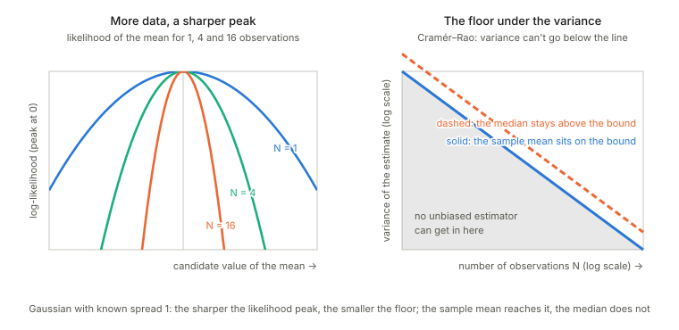

## Links

- The book: Amari, *Information Geometry and Its Applications* (Springer, 2016), DOI [10.1007/978-4-431-55978-8](https://doi.org/10.1007/978-4-431-55978-8). These notes cover Chapter 7 only; equation numbers such as (7.65) refer to the book. No text of the book is reproduced here.
- Related chapters written up: **[Chapter 5: elements of differential geometry](../ch05-elements-of-differential-geometry/index.html)**, **[Chapter 2: exponential and mixture families](../ch02-exponential-and-mixture-families/index.html)** and **[Chapter 6: dual connections](../ch06-dual-connections/index.html)**.
  Background on the annotations site: **[The Fisher information matrix](https://msrepo.github.io/theory_inclined_papers_with_annotations/fisher-information/)**.

## In one paragraph

Statistics asks: from $N$ observations of a distribution in a model, how well can the unknown parameter be recovered, and how do you test a claim about it? Asymptotic theory answers for large $N$. The classical answer at first order is the **Cramér–Rao bound**: the error covariance of a good estimator cannot beat $G^{-1}/N$, the inverse Fisher information over $N$, and the maximum likelihood estimator (MLE) reaches it.
The chapter's geometric contribution is to say *why*, and what happens at the next order. For an **exponential family** the data enter only through the sample mean of the sufficient statistics, one point in the $\eta$-coordinates of the manifold, the **observed point** $\bar\eta$; the MLE is that point itself and is exactly unbiased with exactly covariance $G^{-1}/N$ (in the $\eta$ chart!).
Most models are smaller than an exponential family: a curve or surface $S$ sitting inside one, a **curved exponential family**. Then $\bar\eta$ is generally off $S$ and an **estimator is a map from the big manifold to the model**, which sorts the whole manifold into **leaves**, the sets of observed points that get the same estimate. Everything about the estimator is read off the leaves. At first order: the estimator is **consistent** if each leaf passes through the true point, and **efficient** if the leaf meets $S$ at a right angle in the Fisher metric; the MLE is the m-projection, with straight and orthogonal leaves.
At second order the variance of a bias-corrected efficient estimator exceeds $G^{-1}/N$ by $\tfrac1{2N^2}$ times a sum of **three non-negative squares**: how curved the model is (Efron's statistical curvature, the e-embedding curvature of $S$), how the parameter was chosen (the m-connection of the chart $u$), and how curved the leaves are (the m-embedding curvature of $A(u)$). Only the last depends on the estimator and the MLE makes it zero.
A **test** is a leaf of the same kind, the boundary of the rejection region, and again efficient means orthogonal. The chapter ends with models where this smooth picture fails.

## The spine of the argument

1. An estimator, its bias and error covariance; the Cramér–Rao bound; the MLE attains it to first order (§7.1).
2. In an exponential family the MLE is the observed point $\bar\eta$ in the $\eta$ chart: unbiased and exactly efficient there, but not in other charts, because bias and covariance are not tensors (§7.2).
3. In a curved family $S\subset M$ an estimator is a map $f:M\to S$; its inverse images $A(u)$ (the ancillary submanifolds) foliate $M$, and $w=(u,v)$ is a chart adapted to the leaves (§7.3).
4. The error $\tilde e=\sqrt N(\bar\eta-\eta)$ has moments $0$, $g_{ij}$, $T_{ijk}/\sqrt N$; expanding in the chart $w$ gives the bias (7.54) and the asymptotic law of $\hat u$ with precision $\bar g_{ab}=g_{ab}-g_{a\kappa}g_{b\lambda}g^{\kappa\lambda}\le g_{ab}$. Consistent iff the leaf passes through $(u,0)$; efficient iff it is orthogonal to $S$ (§7.4).
5. After removing the $1/N$ bias, the $1/N^2$ term of the covariance is $\tfrac12\{(\Gamma^m_S)^2+2(H^e_S)^2+(H^m_A)^2\}$; the bias-corrected MLE is second-order efficient (not third) (§7.5).
6. A test is efficient at first order iff the boundary of its rejection region is orthogonal to $S$; the tests differ at second order by curvature and angle (§7.6).
7. Outside the regular case: the uniform location family (closing remarks).

## Setup and notation

| Symbol | Meaning | In the running example |
|---|---|---|
| $D=\{x_1,\dots,x_N\}$ | $N$ independent observations from $p(x;\xi)$ | |
| $\hat\xi=f(D)$ | an estimator; $e=\hat\xi-\xi$ its error | |
| $b(\xi)=\mathbb E\hat\xi-\xi$ | bias (7.3); *asymptotically unbiased* if $b\to0$ (7.4) | |
| $V_{ij}=\mathbb E[e^ie^j]$ | error covariance (7.6) | |
| consistent | $\hat\xi\to\xi$ as $N\to\infty$ (7.5) | |
| $G=(g_{ij})$ | Fisher information matrix; $G^{-1}=(g^{ij})$ | |
| $M$, $S$ | the ambient exponential family ($n$-dimensional, coordinates $\theta$ or $\eta$) and the model, a submanifold ($m$-dimensional, coordinates $u$) | $M$ = all Gaussians with statistics $(x,x^2)$; $S=\{N(u,u^2)\}$ |
| $\bar\eta=\bar x$ | the observed point: the sample mean of the sufficient statistics (7.13)–(7.16) | $(\bar x,\overline{x^2})$ |
| $f:M\to S$, $A(u)=f^{-1}(u)$ | an estimator and its leaves (ancillary submanifolds), of dimension $n-m$ (7.20)–(7.23) | |
| $w=(u,v)$ | a chart of $M$ adapted to the leaves; $v$ runs inside a leaf, $v=0$ on $S$ (7.28) | |
| $B^i_\alpha=\partial\theta^i/\partial w^\alpha$, $B_{\alpha i}=\partial\eta_i/\partial w^\alpha$ | Jacobians (7.32)–(7.33) | |
| $g_{\alpha\beta}=B^i_\alpha g_{ij}B^j_\beta$ | Fisher information in the chart $w$, in blocks $g_{ab},g_{a\kappa},g_{\kappa\lambda}$ (7.36)–(7.37) | |
| $\tilde e=\sqrt N(\bar\eta-\eta)$, $\tilde w=\sqrt N(\bar w-w)$ | the normalised errors (7.42), (7.48) | |
| $\bar g_{ab}$ | Schur complement $g_{ab}-g_{a\kappa}g_{b\lambda}g^{\kappa\lambda}$ (7.58) | |
| $\hat u^*=\hat u-b(\hat u)$ | the bias-corrected estimator (7.62) | |

**The running example.** $S=\{N(u,u^2)\}$, a Gaussian whose standard deviation equals its mean, $u>0$. It lives in the two-parameter Gaussian exponential family with statistics $(x,x^2)$: $\theta(u)=(1/u,-1/2u^2)$ and $\eta(u)=(u,2u^2)$. In the plane of the observed point $\bar\eta=(\bar x,\overline{x^2})$, $S$ is the parabola $\eta_2=2\eta_1^2$ (the dashed parabola $\eta_2=\eta_1^2$ is zero variance, and nothing lies below it). At $u=1$:
$G=\left[\begin{smallmatrix}1&2\\2&6\end{smallmatrix}\right]=\operatorname{Cov}[(x,x^2)]$, $\theta'=(-1,1)$, $\eta'=G\theta'=(1,4)$, $\eta''=(0,4)$, and the Fisher information of $S$ is $g_{uu}=\theta'\cdot\eta'=3/u^2$.
Everything scales with $u$ (a scale family), so all second-order coefficients below carry a factor $u^2$; I quote them at $u=1$. The family is the standard textbook example of a curved exponential family, and it has the useful property that every estimator I need has a closed form, which makes exact simulation cheap.

**What I use from Chapter 6.** Two connections on $M$: the **e-connection**, for which the natural parameters $\theta$ are affine, and the **m-connection**, for which $\eta$ is (both flat; Chapter 5 §3 computed them on the Gaussians). They are dual with respect to the Fisher metric through the pairing $\langle\partial_i,\partial^j\rangle=\delta_i^j$ of the two bases, so a vector with $\eta$-chart components $a_i$ and one with $\theta$-chart components $b^i$ have inner product $a\cdot b$. For a curve $\theta(u)$ in $M$: its **e-embedding curvature** is the part of the acceleration $\theta''$ orthogonal to the curve, in the Fisher metric (in the $\theta$ chart the e-connection is the plain derivative); its **m-connection coefficient** in the chart $u$ is $\Gamma^{(m)u}_{uu}=\eta''\cdot\theta'/g_{uu}$ (the tangential part of the m-acceleration $\eta''$); the **m-embedding curvature** of a leaf with coordinate $v$ is the normal part of $\eta_{vv}$, whose component along $S$ is $H^{(m)u}_{vv}=\eta_{vv}\cdot\theta'/g_{uu}$. That is how I read (7.66)–(7.68) in the case $n=2$, $m=1$, and the simulations below confirm the reading. (The [notes on Chapter 6](../ch06-dual-connections/index.html) verify the duality of the induced e- and m-connections on a submanifold, with the same numbers: $4/3$, $-10/3$ and $\gamma^2=2/27$ for the curve $N(u,u^2)$.)

## Explorations

### The Cramér–Rao bound (§7.1)

**The question.** You have $N$ observations from a model with an unknown parameter and you build an estimate from them. Estimates vary from one dataset to the next, so they have a variance. Is there a floor under that variance that no clever method can beat?

**The answer.** Yes. For an unbiased estimator, one whose average value equals the truth,

$$\text{variance}\;\ge\;\frac{1}{N\times\text{Fisher information}} .$$

**What Fisher information means here.** It measures how sharply the likelihood of the data is peaked around the true parameter. A change of the parameter that the data barely notice cannot be pinned down well, and a change they notice strongly can. That is why the bound is high when the information is low and low when it is high.

<figure>

<figcaption>Left: the likelihood of the mean for 1, 4 and 16 observations; more data, a sharper peak. Right: the variance of an estimate against $N$ (both axes logarithmic). The blue line is the Cramér–Rao floor, the sample mean sits on it, the median stays above it, and nothing unbiased can reach the grey region.</figcaption>
</figure>

**A concrete example.** Take a Gaussian with known spread $\sigma=1$ and unknown mean. One observation carries Fisher information $1/\sigma^2=1$, so $N$ observations carry $N$ and the bound is $1/N$. The sample mean has variance exactly $\sigma^2/N=1/N$, so it **attains** the bound: it is called *efficient*. The median is also a sensible estimator of the mean, but its variance is about $(\pi/2)/N$, roughly $1.57$ times larger (a standard result, not rederived here): the same $1/N$ shape, but it needs about $57\%$ more data to match the sample mean's precision.

**How it ties to the chapter.** The chapter is about estimating the parameter when $N$ tends to infinity, and Cramér–Rao is its first-order statement: the best any good estimator can do shrinks like $1/N$ with the constant set by the Fisher information. In an exponential family the sample mean of the statistics, the observed point, reaches the bound exactly. The later results of the chapter, on curved families and second-order corrections, ask what happens beyond that and when the bound can be reached.
