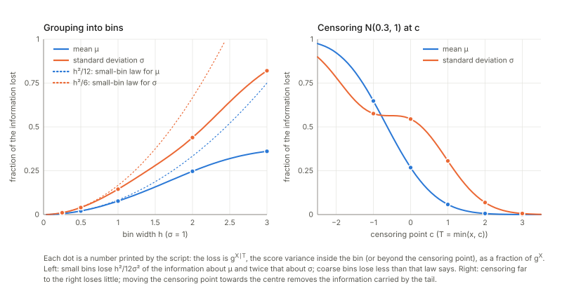

Notes for Chapter 8 of Amari, *Information Geometry and Its Applications* (Springer, 2016). The next section summarises the book's chapter in my own words. The sections after it are explorations that I asked for, one at a time, so they follow my questions and not the book's order. They keep the intuition, the figures and the derivations, and leave out numerical checks.

## What the chapter covers (a summary of the book's chapter)

The chapter is about estimating a model when part of the data is never seen. The complete model is usually simple, but the model of what is actually observed is a mixture and is awkward to fit. The geometric picture of Chapter 1 turns this into a problem about two sets of distributions and the nearest points between them, and the same picture then explains two related questions: what is lost when only a summary of the data is kept, and what happens when the model itself is wrong. The sections in order:

- **§8.1 The EM algorithm.** This section has four parts.
  - *Models with hidden variables (§8.1.1).* The variable is split as $x=(y,h)$ with only $y$ observed. The model of $(y,h)$ is simple (typically an exponential family), and the model of $y$ alone is obtained by summing or integrating out $h$, which is what makes it hard. The section places both inside the big space $S$ of all distributions of $(y,h)$.
  - *Minimising a divergence between two manifolds (§8.1.2).* A fully observed sample is one point of $S$ (the empirical distribution), and the maximum likelihood estimate is its m-projection onto the model. With $h$ missing there is no single observed point, because any conditional distribution of $h$ given $y$ could be attached to the observed $y$-values. All these candidates together form the data manifold $D$, which is m-flat. The maximum likelihood estimate is then the pair of closest points of $D$ and the model $M$ (Theorem 8.1), and for a fixed model point the best candidate in $D$ is the posterior of $h$ (an e-projection).
  - *The EM algorithm (§8.1.3).* Alternate the two projections: project the current model point onto $D$ (the E-step), then project the result back onto $M$ (the M-step). Theorem 8.2 says that the divergence cannot increase, so the likelihood cannot decrease. This is the em algorithm of Chapter 1 applied to $D$ and $M$.
  - *A Gaussian mixture and a Boltzmann machine (§8.1.4).* For a mixture of Gaussians the two steps become the familiar updates of weights and means by responsibility-weighted averages. The same picture covers a restricted Boltzmann machine with visible and hidden binary units, where the E-step is easy because the hidden units are independent given the visible ones.
- **§8.2 Loss of information by data reduction.** If only a statistic $T$ of the data is kept, the Fisher information of the whole data splits into the information carried by $T$ plus a non-negative conditional part, and that conditional part is the loss. A statistic is sufficient exactly when nothing is lost. Hidden variables are the special case where $T$ is the visible part. The section ends with a paragraph on neurons whose high-order correlations are not recorded, and says that the best estimator then minimises the divergence from the corresponding data manifold, with the size of the loss attributed to other work.
- **§8.3 Estimation based on a misspecified model.** If the model used for estimation is wrong, the maximum likelihood estimator still converges to something: the point of the wrong model closest to the truth in the KL sense, found along straight (m-flat) leaves. Theorem 8.3 gives the condition for the estimator to still be consistent, namely that the expected score of the wrong model vanishes at the true value. Theorem 8.4 gives the loss of Fisher information when it is consistent, as the angle between a leaf and the true model. A closing example with a population of neurons whose true noise is correlated but whose decoder ignores the correlation is used to argue that, asymptotically, little may be lost.

## Links

- **[Interactive companion](figures/interactive.html)**: seven widgets, most of them on the two-component Gaussian mixture. (1) EM one projection at a time on a 200-point sample: E-step and M-step as separate buttons, with the exact bookkeeping of the divergence. (2) One observation: the plane of the responsibility $a$ and the parameter $m$, the sigmoid E-step, the straight M-step, the staircase between them, and the stationary point at $m=0$.
  (3) The speed of EM against the separation of the components, and the sub-linear crawl on data from $N(0,1)$. (4) The identity (8.30) for the three-parameter mixture: $G_X$, $G_Y$, $G_{X\mid Y}$, their eigenvalues and the measured contraction. (5) Grouping and censoring of a Gaussian observation: the lost fractions, the small-bin law, covariance ellipses. (6) Misspecified models of $N(u,u^2)$: leaves, pseudo-true value, efficiency by geometry, sandwich and score correlation, and a simulation. (7) The decoder that ignores correlation: two neurons, and a ring of $n$ neurons.
- The book: Amari, *Information Geometry and Its Applications* (Springer, 2016), DOI [10.1007/978-4-431-55978-8](https://doi.org/10.1007/978-4-431-55978-8). These notes cover Chapter 8 only; equation numbers such as (8.26) refer to the book.
  No text of the book is reproduced here; everything is restated and re-derived.
- Previous chapters written up: **[Chapter 7: asymptotic theory of inference](../ch07-asymptotic-theory-of-inference/index.html)** (§8.3 reuses its leaves, angles and efficiencies, with the leaves chosen by the wrong model), **[Chapter 1: dually flat structure](../ch01-dually-flat-structure/index.html)** (the alternating projections that §8.1 turns into EM), **[Chapter 2: exponential and mixture families](../ch02-exponential-and-mixture-families/index.html)** and **[Chapter 6: dual connections](../ch06-dual-connections/index.html)** (the mixed coordinates used in §2.3). Next: **[Chapter 9](../ch09-neyman-scott-and-semiparametrics/index.html)**; natural gradients, of which EM turns out to be one (§1.3 below), are in **[Chapter 12](../ch12-natural-gradient-and-singular-regions/index.html)**.
  Background on the annotations site: **[The Fisher information matrix](https://msrepo.github.io/theory_inclined_papers_with_annotations/fisher-information/)** and **[EM and Gaussian mixtures](https://msrepo.github.io/theory_inclined_papers_with_annotations/expectation-maximization/)**.

## In one paragraph

Some of the quantities behind a data set are never recorded: which of two sources produced a reading, which units of a network were on. Such a **hidden variable** $h$ makes estimation awkward. The model of everything, $p(y,h;\xi)$, is simple (usually an exponential family), but the model of what you actually see, $p_Y(y;\xi)=\sum_hp(y,h;\xi)$, is a mixture, and maximising its likelihood directly is hard.
The chapter's first idea is geometric. A data set that shows only $y$ is not a point of the big space $S$ of distributions of $(y,h)$; it is a whole m-flat set $D$ of points, one for each way of *guessing* $h$ (a table of guesses, the "responsibilities"). The maximum-likelihood problem becomes the problem of finding the closest pair of points between $D$ and the model $M\subset S$, and the alternating projection of Chapter 1 (the **em algorithm**) solves it: the e-projection onto $D$ is the E-step, the m-projection onto $M$ is the M-step. That is the whole EM algorithm, seen from the side.
The second idea concerns **data reduction**: if only a summary $T$ of the data is kept, the Fisher information splits exactly as $g^X=g^T+g^{X\mid T}$, and the lost part is a conditional information. The third concerns a **misspecified model**: the maximum likelihood estimator of a wrong model goes to the KL-projection of the truth onto it, along the same straight leaves as in Chapter 7, and the loss of information is again the angle between a leaf and the true model.
What I add, by working through it: an exact formula for how much each EM half-step gains, a statement that the speed of EM *is* the fraction of information lost (so §8.1 and §8.2 are one subject), examples where the algorithm sits at a saddle, at a bad local maximum, or crawls, a few printed slips, and the exact condition under which the book's neural-field example loses nothing.

## The spine of the argument

1. A hidden-variable model has a big model $M=\{p(y,h;\xi)\}$ inside $S$ and a visible marginal $p_Y$. Observed $y$-data define the data manifold $D=\{\bar q_Y(y)\,q(h\mid y)\}$, which is m-flat (§8.1.1–8.1.2).
2. **Theorem 8.1**: the MLE minimises the divergence from $D$ to $M$. Behind it is a chain rule: the divergence of a table $R$ from $\xi$ is $-\ell(\xi)/N$ plus the mean divergence of the table's rows from the posteriors at $\xi$. **Lemma 8.1**: for fixed $\xi$ the best table is the posterior, the e-projection onto $D$.
3. **EM = em** (§8.1.3): the E-step is that e-projection, the M-step the m-projection onto $M$, which for an exponential family is moment matching, (8.26). **Theorem 8.2**: the divergence decreases; with $M$ e-flat both half-steps lower it by explicit KL divergences.
4. What is reached is a stationary point of the likelihood: a maximum, but possibly a saddle or a poor local maximum, and the speed is the fraction of missing information.
5. **Data reduction** (§8.2): the score of the whole data is the score of $T$ plus the score of the rest given $T$, orthogonal, so $g^X=g^T+g^{X\mid T}$ and the loss is $g^{X\mid T}$ (8.28)–(8.31). With hidden variables, $T=y$ and the loss is the missing information.
6. **Misspecified model** (§8.3): the q-MLE is the m-projection of the observed point onto $M_q$ along q-ancillary leaves; it is consistent iff $E_p[\partial\log q]=0$ (**Theorem 8.3**); the loss of information is $g_{a\kappa}g_{b\lambda}g^{\kappa\lambda}$, the angle between a leaf and $M$ (**Theorem 8.4**, which is (7.58) again).
7. The neural-field example shows how this looks for Gaussians: the decoder that ignores correlation loses nothing exactly when the tuning derivative is an eigenvector of the covariance.

## Setup and notation

| Symbol | Meaning | In the running examples |
|---|---|---|
| $x=(y,h)$ | complete data; $y$ observed, $h$ hidden | $y\in\mathbb R$, $h\in\{1,2\}$ the component |
| $p(y,h;\xi)$, $M$ | the complete model and its manifold; an exponential family in my examples, hence e-flat | $w_h\,N(y;\mu_h,1)$ |
| $p_Y(y;\xi)=\sum_hp(y,h;\xi)$ | the visible model (8.1) | the mixture $wN(\mu_1,1)+(1-w)N(\mu_2,1)$ |
| $S$ | all distributions of $(y,h)$ (8.2) | |
| $\bar q_Y$ | empirical distribution of the observed $y_i$: a spike of weight $1/N$ at each value | |
| $D$ | data manifold (8.6): all $\bar q_Y(y)q(h\mid y)$; m-flat. For a sample it is the set of $N\times k$ tables $R$ of responsibilities, rows adding to 1 | 200 points: a product of 200 intervals |
| $F(R,\xi)$ | divergence of the point $R$ of $D$ from the point $\xi$ of $M$, with the constant $c$ of (8.15) dropped: $\tfrac1N\sum_i\sum_kR_{ik}\log\frac{R_{ik}}{w_k\,N(y_i;\mu_k,1)}$ | |
| $\ell(\xi)$ | log-likelihood $\sum_i\log p_Y(y_i;\xi)$ | |
| $g^X,\ g^T,\ g^{X\mid T}$ | Fisher information of the whole data, of a statistic $T$, and conditional (8.28)–(8.30); with $T=y$ in the mixture the interactive page writes $G_X,G_Y,G_{X\mid Y}$ | |
| $M_q=\{q(x;v)\}$ | the misspecified model; $A_q(v)$ its q-ancillary family, the m-flat leaf through $q(v)$ orthogonal to $M_q$ | |
| $v^*(u)$, $f$ | pseudo-true value (limit of the q-MLE when the truth is $p(\cdot;u)$); $f(v)=u$ where the leaf $A_q(v)$ meets $M$ | $v^*=\kappa u$, $f(v)=v/\kappa$ |

The roles of $M$ and $S$ are swapped relative to Chapter 7, as in the book: here $S$ is the big family and $M$ the model (Chapter 7 called the curved model $S$ and the ambient family $M$). Index conventions as in the previous chapters: natural parameters $\theta$ (upper index), expectation parameters $\eta$ (lower index), $\mathrm{KL}[p\Vert q]$ with the *first* argument the truth. Both projections below use $\mathrm{KL}[q\Vert p]$ for $q\in D$, $p\in M$: the **e-projection** of a model point $p$ onto $D$ varies $q$ and keeps $p$ fixed; the **m-projection** of a point $q\in D$ onto $M$ varies $p$ and keeps $q$ fixed. This is the pairing I found in Chapter 1 to be the right one, and the chapter uses it consistently.

**Running examples.** (a) A mixture of two unit-variance Gaussians, $\xi=(w,\mu_1,\mu_2)$, with a sample of $N=200$ points and also the whole density. (b) Its one-parameter symmetric version $\tfrac12N(-m,1)+\tfrac12N(m,1)$. (c) A restricted Boltzmann machine with 4 visible and 2 hidden binary units. (d) Three binary neurons whose third-order correlation is discarded. (e) The curved family $N(u,u^2)$ of Chapter 7 with several wrong models $q(x;v)$. (f) Gaussian neurons with correlated truth $N(r(u),V)$ and model $N(r(u),I)$.

## 1. The EM algorithm (§8.1)

### 1.1 Hidden variables, the data manifold and the model manifold (§8.1.1–8.1.2)

**In plain words.** Take the 200 numbers of example (a). If someone told you, for every point, which of the two Gaussians produced it, estimating $w,\mu_1,\mu_2$ would be trivial: count and average. You are not told. A *guess* for point $i$ is a pair $(r_{i1},r_{i2})$ of non-negative numbers adding to 1: how responsible each component is for it. A whole data set of guesses is a table $R$ with 200 rows. Every such table is equally legitimate as a stand-in for the missing labels, and the set of all of them is the data manifold $D$ of the book (8.5)–(8.7).
It is the set of all joint distributions on $(y,h)$ whose $y$-marginal is the empirical distribution (a spike of weight $1/N$ at each observed value) and whose conditionals $q(h\mid y_i)$ are arbitrary. The model manifold $M$ is the set of joint distributions that the mixture can produce. To estimate, find the closest pair of points between the two sets: start at a point of $M$, go to the nearest point of $D$, then to the nearest point of $M$ from there, and so on. "Nearest" is measured by the KL divergence, and because it is not symmetric the two moves are different projections.

**Formal statement.** $D$ is *m-flat* (8.7): mixing two tables row by row, $q=\alpha q_1+(1-\alpha)q_2$, gives a table, because marginalising is linear and so the $y$-marginal stays the empirical one. $D$ is *not* e-flat: the normalised geometric mean of two tables has a $y$-marginal that is no longer the empirical one, so the e-geodesic leaves $D$ at once. For a sample of $N$ points with $k$ components, $D$ is the product of $N$ simplices, a convex set; $M$ is, for the mixture, the full exponential family with statistics $(\mathbf 1(h{=}1),\,y\,\mathbf 1(h{=}1),\,y\,\mathbf 1(h{=}2))$, which is e-flat in $S$.

One gloss. For continuous $y$ the empirical distribution is a sum of spikes and the divergence (8.14) from it to a density is infinite; the constant $c$ of (8.15) is that infinity. Everything below is about differences (or about $F$ with the constant dropped), which are finite, and the book's statements are right in that form.

### 1.2 Theorem 8.1 and Lemma 8.1

**In plain words.** The claim is that the closest pair of points between $D$ and $M$ sits at the maximum likelihood estimate. The reason is a bookkeeping identity that the book does not state. The divergence of a table $R$ from a model point $\xi$ splits into two non-negative pieces: *how badly the model explains the visible data* ($-\ell(\xi)/N$) plus *how far the table's guesses are from the guesses the model itself would make* (the mean KL divergence of the rows of $R$ from the posteriors $p(h\mid y_i;\xi)$). For a fixed $\xi$ the second piece vanishes when the table is the posterior, and then what is left is minus the log-likelihood.

**Formal statement.**
$$F(R,\xi)=-\frac{\ell(\xi)}N+\frac1N\sum_i\mathrm{KL}\big[R_i\Vert p(h\mid y_i;\xi)\big].$$
It is the chain rule for KL, and it is (8.15) with the constant absorbed. So $\min_{R\in D}F(R,\xi)=-\ell(\xi)/N$, and minimising over $\xi$ as well is maximum likelihood (Theorem 8.1). The minimiser over $D$ is the posterior: this is **Lemma 8.1** and (8.21), which the book obtains by a Lagrange multiplier (8.20).
The geometry is the Pythagorean theorem of Chapter 1: for *every* table $R\in D$, $F(R,\xi)=F(R^*,\xi)+\frac1N\sum_i\mathrm{KL}[R_i\Vert R^*_i]$ with $R^*$ the posterior. The e-geodesic from the model point to $R^*$ has tangent $\log(\bar q_Y/p_Y)$, a function of $y$ alone, and its pairing with every tangent vector of $D$ (which only moves mass between values of $h$ at a fixed $y$) is zero: the projection is orthogonal to $D$, as the word "e-projection" promises.

**Two slips in the derivation (page image of p. 183).** The proof differentiates $\int q(h\mid y)\log p(y,h;\xi)\,dh$ and prints (8.17) with the factor $q/p(h\mid y;\xi)$ in front of $\partial_\xi p(y,h;\xi)$; the derivative of the logarithm carries one more factor $1/p_Y(y;\xi)$. For one observed $y$ that is a harmless constant, and the text does say it works with one $y$, but the conclusion (8.22) is then used for the MLE of a sample, where the factor depends on $i$ and cannot be dropped. At the MLE the sum of $\partial\log p_Y(y_i)$ over the sample vanishes, whereas the printed form summed over the sample, $\sum_i\partial p_Y(y_i)$, is not an estimating equation at all (it is the gradient of $\sum_ip_Y(y_i)$, which is linear in $w$). Also, (8.23) writes $p(y,R,\xi_0)$ where $p(y,h,\xi_0)$ is meant.

### 1.3 EM is em (§8.1.3–8.1.4)

**In plain words.** *E-step*: freeze the model at $\xi_t$ and take the table of responsibilities that the model itself implies (the posteriors). *M-step*: freeze the table and refit the model to it, as if the guessed labels were real, weighting each point by its responsibility. For the mixture that gives (8.26): the new weight of a component is the average responsibility, its new mean the responsibility-weighted average of the data. The book obtains (8.26) by differentiating the conditional expectation. There is a better reason: $M$ is an exponential family, and the m-projection of any distribution onto an exponential family is found by **matching expectation parameters** ($\eta$); the expectation parameters of the complete model are $(w_1,\,w_1\mu_1,\,w_2\mu_2)$, which are exactly the averages in (8.26).

Because $M$ is e-flat the m-projection obeys the exact Pythagorean relation $F(R,\xi')-F(R,\xi_1)=\mathrm{KL}[p_{\xi_1}\Vert p_{\xi'}]$ (complete-data KL) for every $\xi'$: the M-step is unique and global, and the book's remark that the m-projection is unique when $M$ is e-flat is right.

**Theorem 8.2 with its proof made quantitative.** "The divergence decreases" is easy; here is how much. The M-step lowers $F$ by exactly $\mathrm{KL}[p_{\xi_{t+1}}\Vert p_{\xi_t}]$ (the KL between the two complete-data distributions, the Pythagorean relation above); the next E-step lowers it by exactly $\frac1N\sum_i\mathrm{KL}[p(h\mid y_i;\xi_t)\Vert p(h\mid y_i;\xi_{t+1})]$, the posterior divergence (the chain rule). Their sum is the gain in log-likelihood per observation, an *identity*, true at every step. Early steps gain a lot and later ones very little, and in both phases the M part and the E part are of comparable size.
So the likelihood cannot stop rising unless $\xi_{t+1}=\xi_t$ (both parts vanish together). The explicit accounting needs $M$ e-flat. For a curved complete-data model (weights fixed at $\tfrac12$, means $(0,m)$) the M-step gain is $(\text{mean responsibility})(m'-m)^2/2$ and not $\mathrm{KL}[p_{m'}\Vert p_m]=(m'-m)^2/4$: the ratio of the two is sometimes above and sometimes below 1, so not even a one-sided inequality holds. What survives is the split of the gain into the M-step's drop of $F$ plus the E part, which is all that monotonicity needs.
The interactive page's first widget lets you press the two half-steps and read these parts.

**EM is a natural-gradient step.** In the $\eta$ chart of the complete-data family the update is $\eta_{t+1}-\eta_t=\tfrac1N\,\partial\ell/\partial\theta$ (Fisher's identity: the log-likelihood gradient in $\theta$ is the posterior expectation of the statistics minus their model expectation). Since $d\eta=G_Xd\theta$, this is a natural-gradient step of unit length for the complete-data Fisher metric, taken along the m-geodesic (a straight line in $\eta$). It is why EM needs no step size, and why it is slow exactly where the visible data are less informative than the complete data (§1.5).

*The simplest picture* (left): one observation $y$ and the symmetric model. $D$ is an interval (the responsibility $a$) and $M$ a line ($m$). The M-step is the straight line $m=(2a-1)y$, the E-step the sigmoid $a=\sigma(2my)$, and EM alternates between them, a staircase that settles quickly at the minimum. The crossing at $m=0$ is also a fixed point; its slope is $y^2$, which exceeds $1$ when $\lvert y\rvert>1$, so EM leaves it from any nearby start, and for $\lvert y\rvert<1$ it would be the only one.

**The Boltzmann machine (the book's second example).** With four visible and two hidden binary units and no biases: reading (8.10) with $x=(y,h)$ and no connections inside a layer, $\tfrac12x^{\mathsf T}Wx=y^{\mathsf T}Ah$ exactly, $A$ being the visible–hidden block of the symmetric $W$. So (8.11), which prints $\tfrac12y^{\mathsf T}Wh$, agrees with (8.10) only if its $W$ means twice the block; the exponent is $-y^{\mathsf T}Ah$. The conditional (8.13) factorises over the hidden units, $p(h_j{=}1\mid y)=\sigma(-(A^{\mathsf T}y)_j)$, which is why the E-step is cheap although $p_Y$ is a mixture of $2^{n_h}$ exponential-family members (8.12). The M-step has no closed form, but it is a convex moment-matching problem that can be solved by Newton's method, and the log-likelihood rises at every step. The em algorithm with no closed form anywhere (a projection computed numerically for each E-step and each M-step) is the same as the posterior-plus-moment-matching version: EM and em are one algorithm in a discrete model as well.

### 1.4 What the algorithm converges to

**In plain words.** The divergence decreases and is bounded below, so the likelihood converges. That alone says nothing about *where*. The remark after Theorem 8.2 adds that the m-projection is not unique unless $M$ is e-flat, "hence" local minima. I tried to find out what can actually happen.

**Stationary points.** At the end of a run of EM the gradient of $\ell$ (by Fisher's identity) is zero and the Hessian is negative definite: a strict local maximum. In general the fixed points of EM are exactly the stationary points of $\ell$, as they must be.

**A stationary point that is not a maximum.** Start with equal means, both equal to the sample mean, and $w=\tfrac12$. The two components are then identical, the posteriors do not depend on which is which, and the gradient vanishes: a fixed point of EM. But the likelihood there is far below its value at the maximum, and the Hessian has a positive eigenvalue: a saddle. The Jacobian of the EM map there has an eigenvalue equal to the sample variance (relative to the model's unit variance), which exceeds $1$ when the data are more spread than a single unit-variance component, so the direction that separates the means is unstable. EM started exactly there stays: the separation of the means is exactly zero at every step, until rounding error, amplified by that factor at each step, grows and the iteration leaves for the maximum. Nudged slightly, it leaves after a handful of steps; in exactly symmetric arithmetic it would stay for ever. An "equilibrium" is a fixed point, not a maximum.

**Local maxima although every M-step is unique.** Take data from three clusters with equal spacing and unequal weights (the middle one the lightest), fitted with two unit-variance components. Starting with the two means on different pairs of clusters, EM ends at two different strict local maxima with different likelihoods. $M$ is e-flat here, so each M-step is unique and global, yet the limit depends on the start: uniqueness of the M-step is not global convergence, because the divergence is not jointly convex in $(R,\xi)$. The remark's reason (non-uniqueness of the projection) does not explain this example; what e-flatness of $M$ buys is that each *step* is well defined. (Whether a Csiszár–Tusnády-type global theorem applies when one set is m-flat and the other e-flat is something I have not checked.)

**A crawl.** Feed the symmetric model $\tfrac12N(-m,1)+\tfrac12N(m,1)$ with data from a single $N(0,1)$ (exact expectations, no sampling). The fixed point is $m=0$, the map is $m\mapsto E[Z\tanh(mZ)]=m-m^3+O(m^5)$ with slope exactly $1$, and the iteration crawls: the error shrinks like $1/\sqrt{2t+1}$, so thousands of steps are needed to get small. The rate of EM is $1$ at a point where the components are not distinguishable (§1.5).

**Unknown variances.** The chapter says the mixture with unknown covariance matrices can be treated "in a similar way". The updates are indeed similar (the M-step also averages squared deviations), but the problem is no longer the same: with free variances the likelihood is unbounded and EM, still monotone, can run into the singularity. A component started tightly on an isolated data point has its likelihood jump up in one step to above the regular maximum, and the next step sets the variance to $0$, where $\ell=+\infty$. With unit variances, as in the example, $\ell\le N\log(1/\sqrt{2\pi})$ and there is no such trap.

### 1.5 How fast: the fraction of missing information

**In plain words.** EM moves by the gradient of the visible log-likelihood, but measured in the geometry of the *complete* data (§1.3). Near the answer the visible data say less about the parameter than the complete data would, and the less they say the more slowly the algorithm moves. The rate at which the error shrinks each step is the largest fraction of the complete information that the hidden label withholds. (The matrix form is classical and goes back to Dempster, Laird and Rubin, the authors of the EM paper the chapter cites; I have not re-read their statement. The chapter does not give it, but §8.2 supplies the very quantity.)

**Formal statement.** With $I_c$ the complete-data information (the posterior expectation of the negative Hessian of the complete log-likelihood), $I_o=-\partial^2\ell$ the observed information and $I_m=I_c-I_o=\sum_i\mathrm{Cov}_{h\mid y_i}[\text{complete score}]$ the missing information (Louis' formula), the Jacobian of the EM map at a fixed point is
$$DM=I-I_c^{-1}I_o=I_c^{-1}I_m.$$
For the population version $I_c\to Ng^X$, $I_o\to Ng^Y$, $I_m\to Ng^{X\mid Y}$ and $DM=I-(g^X)^{-1}g^Y=(g^X)^{-1}g^{X\mid Y}$, *with exactly the $g^{X\mid Y}$ of (8.29)–(8.31) for $T=y$*.

**Consistency with the iteration.** The Jacobian of the EM map (finite differences of the closed form (8.26)) agrees with $I-I_c^{-1}I_o$, and Louis' formula agrees with the observed information. The observed contraction $\lVert\xi_{t+1}-\xi^*\rVert/\lVert\xi_t-\xi^*\rVert$ converges to the largest eigenvalue of this matrix. One eigenvalue is $0$, in the direction of the mixture mean $w_1\mu_1+w_2\mu_2$: after one step it equals the sample mean exactly, so the hidden label carries no missing information about that combination.
*Population.* At the true value the complete information $G_X$ is diagonal, and $G_X=G_Y+G_{X\mid Y}$ with $G_{X\mid Y}$ positive semidefinite, which is (8.30). The eigenvalues of $G_X^{-1}G_{X\mid Y}$ are the rates, and they are those of the Jacobian of the EM map run on the whole density; a sample gives a slightly different rate by sampling variation.
*One parameter.* For $\tfrac12N(-m,1)+\tfrac12N(m,1)$ the complete information is $1$ and the rate is $E[y^2\operatorname{sech}^2(my)]=1-I_o(m)$. Far apart, nothing is missing and EM is exact after a step or two; as the components merge the rate tends to $1$, and at $m=0$ it is exactly $1$, the crawl of §1.4.
*The Boltzmann machine.* Several of the eigenvalues of $G_X^{-1}G_{X\mid Y}$ are close to $1$: most of the information about those directions is missing (the visible units identify the weights only weakly), and EM is slow along them. The number of steps needed to reach a given accuracy along the slowest direction is about $\ln(\text{tolerance})/\ln(\text{rate})$.

## 2. Loss of information by data reduction (§8.2)

### 2.1 The identity (8.30)

**In plain words.** The Fisher information of a model is the variance of the *score*, the sensitivity of the log-probability of the data to the parameter. If you keep only a summary $T$ of the data, you keep the score of $T$ and lose what the data would still tell you about the parameter *given* $T$. The key fact is that these two pieces are uncorrelated: the leftover score has mean zero given $T$, so it cannot be explained by anything that depends on $T$ only. Variances of uncorrelated pieces add.
*A small example.* Take observations of $N(\mu,\sigma^2)$ and the parameter $(\mu,\sigma)$. Keep only the sample mean $T=\bar x$: it carries all the information about $\mu$ and part of that about $\sigma$, and the loss is the information about $\sigma$ in the spread that $\bar x$ forgets. Keep only the sum of squares about the mean: the roles are exchanged, and what is lost is the information about $\mu$ and the rest of that about $\sigma$. Keep both: the pair is sufficient and the conditional score is identically zero. Because $\bar x$ and the sum of squares are independent, each loses exactly the information that the other carries.

**Formal statement** (8.28)–(8.31). With $\partial_i\log p(D_X;\xi)=\partial_i\log p(T;\xi)+\partial_i\log p(D_X\mid T;\xi)$,
$$g^X_{ij}=g^T_{ij}+g^{X\mid T}_{ij},\qquad g^{X\mid T}_{ij}=E_T\big[\mathrm{Cov}(\partial_i\log p,\partial_j\log p\mid T)\big]\ \succeq0,$$
and $\Delta g^T=g^{X\mid T}$ is the loss. The book gives no derivation of the equality; the orthogonality above is the proof.

**Grouping and censoring.** Replace one observation of a Gaussian by the width-$h$ bin it falls in. The information of $T$ comes from the multinomial formula $\sum_k(\partial P_k)(\partial P_k)^{\mathsf T}/P_k$ and the lost part from the score covariance inside each bin, and the two add up to $g^X$. Small bins lose $h^2/12\sigma^2$ of the information about $\mu$ and twice that about $\sigma$ (the score is nearly uniform inside a narrow bin); coarse bins lose less than that law says. *Censoring*, $T=\min(x,c)$: the atom at $c$ carries the score $E[\text{score}\mid x\ge c]$ and the lost part is $P(x\ge c)\,\mathrm{Cov}(\text{score}\mid x\ge c)$, which is small when $c$ is far in the tail and grows as $c$ moves towards the centre.

### 2.2 Hidden variables are a data reduction

Take $X=(y,h)$ per observation and $T=y$. Then $g^{X\mid Y}=E_y\mathrm{Cov}_{h\mid y}[\text{complete score}]$, since $\partial\log p(h\mid y;\xi)$ is the complete score minus its posterior mean (Fisher's identity), and it is the *missing information* of §1.5. The book's remark that $T=y$ is not sufficient in general has a precise form: $T=y$ is sufficient iff the posterior of $h$ does not depend on $\xi$, and then $g^{X\mid Y}=0$ and EM is exact in one step. The mixture of §1.5 is the worked example: each parameter loses part of its information to the hidden label.

### 2.3 Three neurons: dropping the third-order correlation

**In plain words.** Three neurons are recorded as a table of eight firing patterns. If the experimenter keeps only the firing rates and the pairwise correlations, one number is thrown away: the tendency of all three to fire together beyond what the pairs explain. How much does that cost for a parameter that lives in that number?

**The book's paragraph.** The firing patterns of $n$ neurons form the full exponential family (8.32)–(8.33) with statistics $X=(x_i,x_ix_j,\dots,x_1\cdots x_n)$; if the high-order correlations are not recorded, the observed point is not identified and one has a data manifold $D$ instead, and the best estimator is the minimiser of $D_{KL}[D:M]$. The size of the loss is attributed to a paper and not given.

**What it comes to.** Three neurons, $p(x;\xi)=\exp(\theta\cdot X-\psi)$ with $\theta=(-1,-1,-1,0,0,0,\xi)$: independent sparse neurons with a third-order interaction $\xi$, true value $\xi=0$. An experimenter who keeps rates and pairwise correlations has the data manifold $D=\{q+s\cdot\text{parity}\}$, parity$(x)=(-1)^{x_1+x_2+x_3}$, an m-flat *line* (it has zero first and second moments exactly). In the mixed coordinates $(\eta_R,\theta^{123})$ of Chapter 6 (§6.8: the retained moments as expectation parameters, the lost interaction as a natural parameter) the Fisher metric is block diagonal, so
$$\text{loss}=\Big(\frac{d\theta^{123}}{d\xi}\Big)^2\Big(G_{LL}-G_{LR}G_{RR}^{-1}G_{RL}\Big),$$
where the bracket is the *residual variance of $x_1x_2x_3$ after regressing it on the other six statistics* (it is the Schur complement that Chapter 6 found for the $\theta^{12}$ entry of the mixed metric, and it is not the corresponding entry of $G$ or of $G^{-1}$). So the fraction of the information lost is the fraction of the variance of $x_1x_2x_3$ that the six retained statistics cannot explain, one minus the $R^2$ of that regression. Identity (8.30) is exact at every sample size $N$ when $T$ is the vector of the six retained counts; per observation the loss approaches its limit slowly, because at small $N$ the six counts almost determine the whole table.

**The optimum estimator.** The estimator that minimises $\mathrm{KL}[D:M]$ is itself an em algorithm: e-project the model point onto $D$ (one-dimensional Newton for $s$), m-project onto $M$ (moment matching for $\xi$). Its error contracts at a rate equal to the fraction of information lost by the reduction (§1.5 in a second setting). Compared with the full-data MLE its variance is larger, as it must be, and it matches $1/g^T$; *unweighted* least squares on the same retained moments does worse still. So "the optimum estimator is the minimiser of $D_{KL}[D:M]$" is right for this example and it matters: it attains the information of the reduced data while naive least squares does much worse.

## 3. Estimation based on a misspecified statistical model (§8.3)

### 3.1 The q-MLE is the KL-projection of the truth

**In plain words.** You believe the data come from a model $M_q$ but they come from something else, $p$. The maximum likelihood estimator of the wrong model still converges to *something*: the point of $M_q$ that is closest to $p$ in the sense $\mathrm{KL}[p\Vert q]$, the **m-projection** of the truth onto $M_q$. Whether this is the "right" parameter value depends on how the parameters of the two models are tied: here both are indexed by $u$, and the q-MLE is consistent only when the point it converges to carries the true label.
**Setup in the plane.** The truth is the curved family $M=\{N(u,u^2)\}$ of Chapter 7 (called $S$ there), a parabola in the plane of the observed point $\bar\eta=(\bar x,\overline{x^2})$; the wrong models are curves in the same plane. The q-MLE sends the observed point to the nearest point of $M_q$ along a straight line (an m-geodesic) orthogonal to $M_q$: the **q-ancillary leaf** $A_q(v)$. For $q=N(v,cv^2)$ (the right shape but a wrong coefficient of variation) the minimiser over $v$ of $\mathrm{KL}[p_{\bar\eta}\Vert q(v)]$ has the closed form $(-\bar x+\sqrt{\bar x^2+4c\,m_2})/2c$, and it satisfies the leaf equation $\theta_q'(\hat v)\cdot(\bar\eta-\eta_q(\hat v))=0$: the leaf through $q(v)$ is the straight line orthogonal to $\theta_q'(v)$, and it is orthogonal to $M_q$ at its foot.

### 3.2 Theorem 8.3: consistency

**Formal statement.** The q-MLE is consistent iff $E_{p(x,u)}[\partial_a\log q(x,u)]=0$ (8.37), which holds when the leaf $A_q(u)$ passes through $p(x,u)$. Because $\partial_v\log q=\theta_q'(v)\cdot(X-\eta_q(v))$, (8.37) in expectation reads $\theta_q'(v)\cdot(\eta_p-\eta_q(v))=0$, which is literally "the leaf through $q(v)$ contains $\eta_p$". So the two formulations in the theorem are one.

**A sign slip in the proof (page image of p. 188).** For $r(t)=(1-t)q+tp$ the derivative of $\log r$ at $t=0$ is $(p-q)/q$; the printed (8.39) has $\{q-p\}/q$, the negative. The consequence is in (8.41): $\langle\dot r,\dot l_q\rangle_q=\int(p-q)\partial_u\log q\,dx=+E_p[\partial_u\log q]$, so the last line should end with $+\int p\,\partial_u\log q\,dx$. The conclusion, that the pairing vanishes iff (8.37) holds, is unaffected.

**Pseudo-true values.** The limit $v^*(u)$ of the q-MLE when the data come from $N(u,u^2)$ can be found as the root of (8.37) or as the minimiser of $\mathrm{KL}[p\Vert q(v)]$, and the two agree, as they must. Only $N(v,1)$ is consistent; the others converge to $v^*=\kappa u$ with $\kappa=\sqrt2$ for $N(0,v^2)$ and $\kappa=(\sqrt{1+8c}-1)/2c$ for $N(v,cv^2)$.

**The remark after Theorem 8.4.** If $f(v)$ is the $M$-coordinate where the leaf $A_q(v)$ meets $M$ ($f(v)=v/\kappa$ here), relabelling the points of $M_q$ makes the estimator consistent. The book writes that the new parameter of $M_q$ is "$f^{-1}(u)$", which is ambiguous in direction; the labelling that works is $q_{\rm new}(x;w)=q(x;f^{-1}(w))$, i.e. estimate $w=f(\hat v)$. So *consistency can always be repaired by relabelling; efficiency cannot*.

### 3.3 Theorem 8.4: the loss of information

**Formal statement.** For a consistent q-MLE (leaf through $p$), in coordinates $(u^a,v^\kappa)$ adapted to the leaf, the loss of Fisher information is $\Delta g_{ab}=g_{a\kappa}g_{b\lambda}g^{\kappa\lambda}$ (8.42), zero iff the leaf is orthogonal to $M$. This is (7.58) with the leaves of the wrong model. As in Chapter 7, $g^{\kappa\lambda}$ must be the inverse of the $\kappa\lambda$ block, not the block of the full inverse; in the two-neuron example below the two readings give different values for the same loss. The theorem as printed does not say that the leaf must pass through $p$; it is the remark that supplies it.

**Three routes to the same number.** For each of the three models, the efficiency of the relabelled q-MLE can be found by (a) geometry: leaf direction orthogonal to $\theta_q'(v^*)$, $\Delta g=g_{uv}^2/g_{vv}$ in the Fisher metric of $S$ at the truth; (b) the sandwich $A^{-1}BA^{-1}$ with $A=-E_p[\partial_v^2\log q]$, $B=E_p[(\partial_v\log q)^2]$; (c) the squared correlation of the true score and the q-score under $p$. All three agree. With a two-dimensional $M$ the same statement holds as a matrix identity: the loss matrix from (8.42) equals $g-AB^{-1}A$ from the sandwich ($A=J^{\mathsf T}J$, $B=J^{\mathsf T}VJ$), as in the example of three neurons with two parameters inside the nine-dimensional Gaussian family; reading $g^{\kappa\lambda}$ as a block of the full inverse gives a different, wrong, loss.

The first two models are the leaf families of Chapter 7: vertical leaves are the sample mean (efficiency $\tfrac13$) and horizontal leaves are $\sqrt{m_2/2}$ ($\tfrac89$ after relabelling). In general the efficiency is the squared correlation between the true score and the model's score, because for a q-MLE with $E_p[\text{q-score}]=0$ identically in $u$ one has $A=E_p[\text{q-score}\cdot\text{true score}]$ (differentiate $E_p[\text{q-score}]=0$ in $u$, with the relabelling absorbed); in the leaf language that is $\sin^2$ of the angle. The wrong coefficient of variation costs bias ($v^*=\kappa u$) but almost no efficiency: the leaves are nearly orthogonal to $M$.
*The geometry of the misspecified likelihood.* When $M_q$ is e-flat ($N(v,1)$ and $N(0,v^2)$ are straight lines in $\theta$) the foot $q^*$ of the m-projection satisfies the exact Pythagorean relation $\mathrm{KL}[p\Vert q(v)]=\mathrm{KL}[p\Vert q^*]+\mathrm{KL}[q^*\Vert q(v)]$ for every $v$, so the expected log-likelihood is a bowl whose curvature $A$ is the Fisher information of the *model*, $A=g_q(v^*)$. For the curved $N(v,cv^2)$ the relation fails, and $A$ differs from $g_q(v^*)$ by exactly $-\theta_q''\cdot(\eta_p-\eta_q)$: the e-curvature of $M_q$ times the displacement of $p$ from its foot.

### 3.4 The neural field

**In plain words.** Neurons that share noise respond together, and a decoder that pretends they are independent throws that structure away. Does it lose anything? The book says no, asymptotically; the answer depends on how the noise correlation lines up with the way the average response changes with the stimulus.

**The book's example.** $n$ neurons respond with a Gaussian vector of mean $r(u)$ and covariance $V$ (8.35); the model ignores the covariance (8.36). The text then reports that Wu et al. showed that asymptotically nothing is lost by using the simple model, and presents this as encouraging for the brain.

**What the geometry says.** Both are Gaussian with the same mean, and $V$ does not depend on $u$. Then $E_p[\partial_u\log q]=r'\cdot(E_px-r)=0$ for every $V$: the q-MLE (least squares) is consistent. Its q-score is $r'\cdot(x-r)$, the true score $r'^{\mathsf T}V^{-1}(x-r)$, their covariance under $p$ is $\lvert r'\rvert^2$, and the variances are $r'^{\mathsf T}Vr'$ and $r'^{\mathsf T}V^{-1}r'$. So by the correlation route and by the sandwich
$$\text{efficiency}=\frac{\lvert r'\rvert^4}{(r'^{\mathsf T}Vr')(r'^{\mathsf T}V^{-1}r')}\le1,$$
with equality iff $r'$ is an eigenvector of $V$ (Cauchy–Schwarz). "No loss" is a property of the pair $(V,r')$, not of the misspecified model. *Two neurons*, $r(u)=(\cos u,\sin u)$, $V=\left[\begin{smallmatrix}1&\rho\\\rho&1\end{smallmatrix}\right]$: at $u=0$ the tuning direction $r'=(0,1)$ is along an axis, not an eigenvector of $V$ (whose eigenvectors are $(1,1)$ and $(1,-1)$), and the efficiency is $1-\rho^2$; at $u=\pi/4$ it is an eigenvector and nothing is lost. In between, the loss varies smoothly between these two extremes. Computing the loss from (8.42) in the five-dimensional Gaussian family, with $g^{\kappa\lambda}$ the inverse of the block, gives the same efficiency as the formula and as the squared correlation; taking a block of the full inverse instead gives a different value.
*A ring of $n$ neurons*, Gaussian bump tuning and correlation $(1-\rho)I+\rho K$ with $K$ the wrapped Gaussian of the ring distance with range $b$. Uniform correlation loses nothing: the tuning curves add up to nearly a constant, so $r'$ is nearly orthogonal to the all-ones vector and is nearly an eigenvector of $(1-\rho)I+\rho\mathbf 1\mathbf 1^{\mathsf T}$. Short-range correlation loses little. Correlation as wide as the tuning curve loses most of the information, and more as $n$ grows. As the correlation becomes uniform the efficiency returns towards $1$. Cosine tuning has $r'$ a single Fourier mode, an eigenvector of every translation-invariant $V$, so nothing is lost for any range.

**How to read the cited result.** I did not check the cited paper's own model; I read the conclusion of Wu, Amari and Nakahara (2002, *Neural Computation* 14), whose asymptotics are in the number of neurons for a single presentation of the stimulus, not in repeated observations. By my reading it lists uniform correlation (and a multiplicative variant) as cases where this type of decoder is asymptotically efficient, speaks of quasi-efficiency for the decoder that ignores correlation (the usual rate and a Gaussian limit, but not the Cramér–Rao bound), and says that for correlation of non-local range the estimators are non-Fisherian (the Cramér–Rao paradigm does not apply). That fits the geometry above, and means the book's one-line summary compresses several cases.

## Checks of the book's statements

Where I found something in the book to correct or tighten, in the order of the text (details in the sections above):

- **(8.14)–(8.15).** For continuous data the divergence from an empirical distribution is infinite, so the constant $c$ of (8.15) is that infinity and only differences make sense.
- **(8.17), (8.22).** A factor $1/p_Y(y;\xi)$ is missing in (8.17); harmless for one $y$ but not once summed over a sample.
- **(8.23), (8.25).** $p(y,R,\xi_0)$ should read $p(y,h,\xi_0)$, and in (8.25) $y_h$ should be $\mu_h$ (page images).
- **Theorem 8.2 and the remark after it.** The likelihood converges, but the iterates can reach a saddle, a second local maximum or crawl, and the cause of local maxima is the non-convexity of the joint divergence, not non-uniqueness of the M-step.
- **§8.1.1.** With unknown variances the likelihood is unbounded and EM can run into the singularity.
- **(8.10)–(8.11).** A factor 2: $\tfrac12x^{\mathsf T}Wx=y^{\mathsf T}Ah$, so (8.11) needs $W=2A$.
- **(8.28)–(8.31).** The identity is right; the derivation (the orthogonality of the two scores) is not given.
- **(8.33).** $N$ is written where the preceding sentence used $t$ (notation).
- **(8.35)–(8.36) and the sentence after.** The no-loss claim holds only when $Vr'\parallel r'$.
- **Theorem 8.3, (8.37).** "Iff" needs the root to be the global maximiser of the expected log-likelihood.
- **(8.39), (8.41).** A sign slip; the conclusion stands.
- **Theorem 8.4, (8.42).** $g^{\kappa\lambda}$ is the inverse of the block, and the leaf must pass through $p$, which the theorem leaves to the remark.
- **Remark after Theorem 8.4.** The direction of the relabelling by $f^{-1}$ is ambiguous.
- **Not in the chapter.** EM contracts by the fraction of missing information, $DM=I-(g^X)^{-1}g^Y$.

## Questions and doubts

- **Which conditions give convergence of the iterates, not only of the likelihood?** Theorem 8.2 concludes convergence to an equilibrium with no hypotheses. Monotonicity gives convergence of $\ell$; I saw iterates reach a saddle and a poor local maximum, and a singularity with unknown variances. What would settle it: a statement of the regularity conditions (compact level sets, isolated stationary points) under which limit points are stationary, and a reference for when they are maxima.
- **How much of the em picture survives when $M$ is not e-flat?** My exact gain identity (§1.3) used the Pythagorean relation for the m-projection onto an e-flat $M$. In one curved example (weights fixed at $\tfrac12$) the KL accounting fails while the split into the M-step's drop of $F$ and the E part still holds; uniqueness of the M-step and global statements for curved models are open for me.
- **Is there a global statement for alternating projection between an m-flat and an e-flat set?** The unit-variance mixture has $D$ convex and $M$ e-flat, and still has two strict local maxima. A Csiszár–Tusnády-type result seems to need both sets convex in the same sense; I have not looked it up, only observed that this case is not covered.
- **How much does the cited neural-field result actually claim?** I read the conclusion of Wu–Amari–Nakahara (2002) but did not reproduce its model (a continuous field, one presentation, asymptotics in the number of neurons). The exact criterion I derived ($Vr'\parallel r'$) applies to Gaussians of the book's form; matching it to the paper's conditions (local-range, uniform, multiplicative correlation) would need the paper's own formulas.
- **Is the loss formula behind the neuron paragraph the same as in the cited paper (Oizumi et al. 2011)?** The chapter gives no formula. Mine is a mixed-coordinates one (squared derivative of the lost $\theta$-coordinate times a Schur complement) and I only worked it out for one family of three neurons, for the third-order interaction only; lost second-order correlations and larger $n$ are open.
- **Is "iff" in Theorem 8.3 right without identifiability?** $E_p[\partial\log q]=0$ is a stationarity condition. A q-MLE converges to a global maximiser of the expected log-likelihood, so one needs that the stationary point is that maximiser. It can fail when the score has spurious zeros (the model $N(v^2,1)$ has score $2v(x-v^2)$, which vanishes at $v=0$ whatever the truth); I only looked at monotone examples.
- **Beyond Gaussians.** (8.42) is worked out here for Gaussian models inside the Gaussian family; the m-flat leaves and the Schur-complement structure for other exponential families (where $\theta_q''$ and the curvature term of §3.3 matter) are not covered.
- **Higher-order and finite-$N$ behaviour.** Everything in §3 is first order. The exact finite-$N$ identity (8.30) holds, but the finite-$N$ behaviour of the q-MLE (a bias of order $1/N$) is not explained by the chapter's theory.

## Takeaways

- **Hidden variables turn estimation into a distance between two sets.** $D$ (tables of guesses for $h$) is m-flat, $M$ (the complete model) is e-flat in my examples; the closest pair is the maximum likelihood estimate, by the chain rule $F=-\ell/N+\text{posterior divergence}$.
- **EM is the em algorithm and nothing else.** E-step: e-projection onto $D$ (posterior). M-step: m-projection onto $M$ (moment matching for an exponential family, the formulas (8.26)). Each half-step lowers the divergence by an explicit KL divergence, and the sum is the gain in log-likelihood.
- **EM is a unit natural-gradient step** along an m-geodesic of the complete-data family, and its speed is the largest **fraction of missing information**: close to $1$ as the components merge, close to $0$ when they separate.
- **An equilibrium is only stationary.** Saddles (EM stays on them until rounding error escapes), bad local maxima although every step is unique, a crawl where the rate is $1$, a singular likelihood when variances are unknown.
- **Data reduction: $g^X=g^T+g^{X\mid T}$**, exactly, from the orthogonality of the score of $T$ and the score of the rest. Binning loses about $h^2/12\sigma^2$ and $h^2/6\sigma^2$ for small bins; hidden variables lose the missing information; three neurons that drop their third-order moment lose a definite fraction of $g^X$ (the part of $x_1x_2x_3$ that the other statistics cannot explain), and the minimiser of $\mathrm{KL}[D:M]$ attains what is left.
- **A wrong model's MLE goes to the KL-projection of the truth** (consistent iff $E_p[\partial\log q]=0$), along straight leaves; relabelling repairs consistency, not efficiency. The loss is the angle between the leaf and $M$, the squared correlation of the true and the model score, and Chapter 7's (7.58) again.
- **"No loss" for ignoring correlation means $Vr'\parallel r'$,** not a general fact: the efficiency is $1-\rho^2$ for two neurons with tuning along an axis, falls as $n$ grows when the correlation range matches the tuning width, and is $1$ for uniform correlation or cosine tuning.
- **Fine print:** (8.17) lacks $1/p_Y(y;\xi)$ for a sample; (8.25) has $y_h$ for $\mu_h$; (8.39)/(8.41) have a sign; (8.11) a factor 2; $g^{\kappa\lambda}$ in (8.42) is a block inverse; the local-minima remark is incomplete (e-flatness of $M$ does not remove local maxima).

| Term | One line |
|---|---|
| hidden variable | $h$ in $x=(y,h)$, not observed; visible model $p_Y=\sum_hp(y,h;\xi)$ |
| data manifold $D$ | all $\bar q_Y(y)q(h\mid y)$: tables of responsibilities; m-flat |
| E-step | e-projection of $p_\xi$ onto $D$: the posterior; $F(R^*,\xi)=-\ell/N$ |
| M-step | m-projection of $R$ onto $M$: moment matching in $\eta$; (8.26) for the mixture |
| Theorem 8.2 | each EM step gains $\mathrm{KL}[p_{t+1}\Vert p_t]+\tfrac1N\sum_i\mathrm{KL}[\text{post}_t\Vert\text{post}_{t+1}]$ in $\ell/N$ ($M$ e-flat) |
| EM rate | $DM=I-(g^X)^{-1}g^Y=(g^X)^{-1}g^{X\mid Y}$: the fraction of missing information |
| $g^X=g^T+g^{X\mid T}$ | the score splits orthogonally; loss $=g^{X\mid T}=E_T\mathrm{Cov}(\text{score}\mid T)$ |
| q-MLE | m-projection of the observed point onto $M_q$ along q-ancillary leaves; limit $v^*$ with $E_p[\partial\log q(v^*)]=0$ |
| (8.42) | loss $=g_{a\kappa}g_{b\lambda}g^{\kappa\lambda}$ ($g^{\kappa\lambda}$ the block inverse) $=g_{uu}(1-\rho^2)$, $\rho$ the correlation of true and model scores |
| ignoring correlation | efficiency $\lvert r'\rvert^4/(r'^{\mathsf T}Vr'\cdot r'^{\mathsf T}V^{-1}r')$; 1 iff $r'$ is an eigenvector of $V$ |

---

*Notes written 2026-10-02.*
