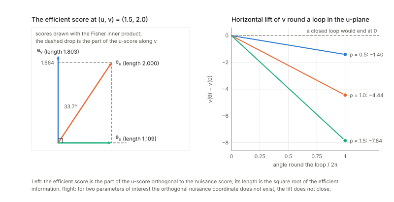
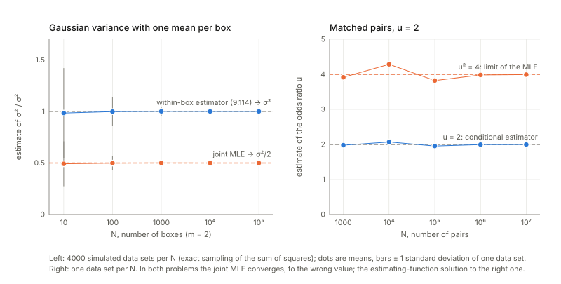
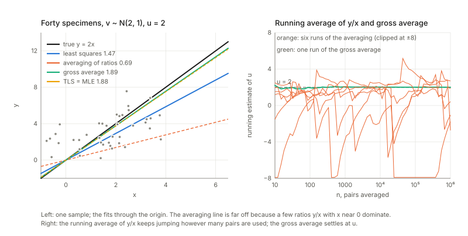
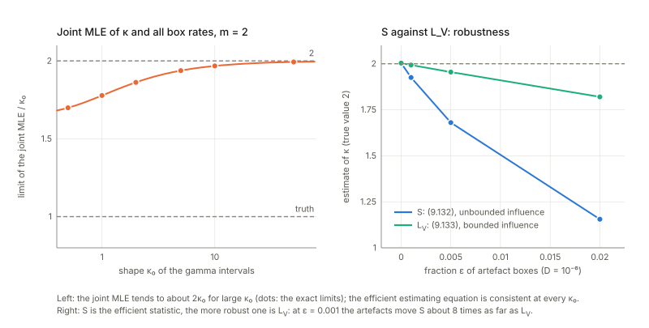

Notes for Chapter 9 of Amari, *Information Geometry and Its Applications* (Springer, 2016). The next section summarises the book's chapter in my own words. The sections after it are explorations that I asked for, one at a time, so they follow my questions and not the book's order. They keep the intuition, the figures and the derivations, and leave out numerical checks.

## What the chapter covers (a summary of the book's chapter)

The chapter asks what to do when a statistical model contains parameters you do not care about (nuisance parameters) and, worse, when there is a new one for every observation, so that the number of nuisance parameters grows in proportion to the data. This is the Neyman–Scott problem, which shocked statisticians because maximum likelihood need not be consistent or efficient there. The chapter replaces it by a geometric construction: put the unknown law of the nuisance parameter inside the model, look at the tangent space of the resulting semiparametric model, and find the estimators that are orthogonal to the nuisance directions. The author says openly that the function-space part is treated intuitively and not rigorously. The sections in order:

- **§9.1 Statistical model including nuisance parameters.** A model has a parameter of interest $u$ and a nuisance parameter $v$. Two examples set the scene: measuring a weight with a scale of unknown accuracy (either the weight or the accuracy can be the quantity of interest), and finding the ratio between two noisy quantities (volume and weight) of a specimen, the specific gravity. With one fixed nuisance value, fitting everything by maximum likelihood and discarding the nuisance estimate is fine and efficient. The Fisher matrix shows the price: knowing $v$ is worth something, and the information about $u$ when $v$ is unknown is smaller, namely what remains after removing the part that a change of $v$ could imitate. Geometrically this is the score of $u$ projected orthogonally to the nuisance scores, the efficient score, and its size is the efficient Fisher information. If the two kinds of direction are already orthogonal nothing is lost, so one would like to reparametrise $v$ to achieve that; this is always possible when $u$ is a single number and in general impossible otherwise.
- **§9.2 The Neyman–Scott problem and semiparametrics.** Here $u$ is shared by all observations but every observation has its own nuisance value. The Stonehenge stones (radius of the circle, each stone's own angle) are the romantic example; neural spikes and independent component analysis (Chapter 13) are others. The working example is the proportionality problem with known noise variance. Five estimators are compared: least squares (not even consistent), the average of per-specimen ratios (consistent but weak), the ratio of totals (consistent and good), total least squares, and joint maximum likelihood over $u$ and all $v_i$, which turns out to be identical to total least squares. The way out is to regard the nuisance values as draws from an unknown distribution $k$: the observations are then identically distributed from a mixture, and the model has an ordinary parameter $u$ plus a whole function $k$. That is a semiparametric model.
- **§9.3 Estimating functions.** An estimating function is a recipe that turns an observation and a trial value of $u$ into a number that averages to zero at the true $u$ and not elsewhere, whatever the nuisance value, with a nonzero average slope. Because the mixture is linear in $k$, the same holds for the semiparametric model for every $k$. Setting the sample average to zero gives an estimator that does not need $k$; the score is the special case that gives maximum likelihood. Theorem 9.1 says the estimator is asymptotically unbiased with error of order one over $N$, whose size is the mean square of the recipe divided by the square of its average slope. The vector case is the same with a matrix slope and a sandwich formula. The section ends by asking when estimating functions exist and which is best, to be answered geometrically.
- **§9.4 Information geometry of estimating functions.** Mean-zero random variables are tangent vectors, with the covariance as inner product. Fixing $k$ gives a curve in $u$; fixing $u$ gives an infinite-dimensional family in $k$, imagined as a fibre. At each point the tangent space splits into the direction of $u$, the nuisance tangent space spanned by all directions in which $k$ can move, and the ancillary rest, orthogonal to both (the first two need not be orthogonal to each other). Vectors at different mixing laws are compared by e-transport (subtract the mean) and m-transport (rescale by the density ratio), which are dual (Theorem 9.2). The nuisance space is carried onto itself by the m-transport (lemma and Theorem 9.4), and is spanned by transports of the elementary nuisance scores at single nuisance values. Theorem 9.3 characterises estimating functions: orthogonal to the nuisance space, unchanged by e-transport, and with a component along the direction of $u$. The efficient score is the projection of the $u$-score off the nuisance space. By Theorem 9.5 an estimating function exists exactly when the efficient score is nonzero, and every one is the efficient score at some $k_0$ plus an ancillary part. By Theorem 9.6 the efficient score is the best, with the smallest error. It depends on the unknown $k$, but using it with a wrong guess of $k$ still gives a consistent estimator. A closing remark says that in a model that is not linear in the nuisance function the nuisance space is not transport-invariant, and the right object is the information score (Amari and Kawanabe).
- **§9.5 Solutions to Neyman–Scott problems.** *§9.5.1* When the density is exponential in the nuisance parameter through a statistic $s$, the nuisance space consists of functions of $s$ and the efficient score (Theorem 9.7) is built from conditional expectations given $s$; if the derivative of $s$ in $u$ is a function of $s$, the efficient score does not depend on $k$ at all. *§9.5.2* For the proportionality problem this gives a whole family of consistent estimators indexed by a free function $h$; total least squares and the ratio of totals are two members, a simple linear choice with a tuned constant beats both, total least squares wins when the nuisance values are widely spread, and the ratio of totals when they are tight. *§9.5.3* In the scale problem with specimens of unknown weights, the efficient score is free of $k$ and gives the usual within-specimen variance estimate averaged over specimens, which is efficient and differs from maximum likelihood. With one specimen and many scales of unknown accuracy (a common mean), there is again a free function $h$, a weighted-average estimator, and the best $h$ depends on the unknown $k$ although any $h$ is consistent. *§9.5.4* For a neuron whose firing rate drifts while the regularity (gamma shape) is fixed, pairs of consecutive intervals are boxed; the efficient score is free of the rate and gives an estimating equation, which uses a geometric mean of a simple pair statistic, while a published alternative statistic uses the arithmetic mean: the first is theoretically best, the second perhaps more robust.
- **Closing remarks.** The author recalls that the problem was posed as unsolved by David Cox in 1984, that a rigorous functional-analytic theory of semiparametrics exists (Bickel and coauthors), and that the geometric version was published without full rigour because it gives a complete set of estimating functions and many working examples.

## Links

- **[Interactive companion](figures/interactive.html)**: eight widgets. (1) The two scores as arrows with the Fisher inner product, the efficient score and what an unknown nuisance parameter costs. (2) Lifting a loop of a two-dimensional parameter of interest: no orthogonal nuisance coordinate. (3) The MLE settling on the wrong value, for Gaussian variances and for matched pairs. (4) Five solutions of the proportionality problem on a simulated sample. (5) The averaging method has no law of large numbers: running averages and the Cauchy limit. (6) The class $f=(y-ux)h(x+uy)$: the corrected variance formula against the printed one, with the bound. (7) An exact finite model for the tangent-space geometry: the efficient score, the three informations, the variance of $\dot l_E+t\,a$. (8) A spike train: the efficient, $L_V$, joint-MLE and naive estimators of the gamma shape.
- The book: Amari, *Information Geometry and Its Applications* (Springer, 2016), DOI [10.1007/978-4-431-55978-8](https://doi.org/10.1007/978-4-431-55978-8). These notes cover Chapter 9 only; equation numbers such as (9.103) refer to the book. No text of the book is reproduced here; everything is restated and re-derived.
- Neighbouring chapters: **[Chapter 7: asymptotic theory of inference](../ch07-asymptotic-theory-of-inference/index.html)** (the notation for estimators, leaves and the Fisher metric used here), **[Chapter 8: hidden variables](../ch08-hidden-variables/index.html)**, **[Chapter 10: linear systems and time series](../ch10-linear-systems-and-time-series/index.html)**; the e- and m-connections come from **[Chapter 2](../ch02-exponential-and-mixture-families/index.html)** and **[Chapter 6](../ch06-dual-connections/index.html)**, and independent component analysis, which the book says is of this type, is in **[Chapter 13](../ch13-signal-processing-and-optimization/index.html)**.
  Background on the annotations site: **[The Fisher information matrix](https://msrepo.github.io/theory_inclined_papers_with_annotations/fisher-information/)**.

## In one paragraph

Many models have a parameter you want, $u$, and others you do not care about, $v$: you want the weight of a specimen but do not know how accurate the scale is. Usually you fit everything and keep the part you want. The chapter is about the case where this breaks: in a **Neyman–Scott problem** every observation brings its own nuisance parameter, so the number of nuisance parameters grows with the data and each is estimated from a single observation. Then the maximum likelihood estimate (MLE) can settle on the wrong value however much data you collect. Weigh each specimen twice and the MLE of the scale's variance is half the truth; observe matched pairs of yes/no outcomes and the MLE of the odds ratio converges to its square.
The book's cure is geometric. Treat the unknown distribution $k$ of the nuisance parameter as part of the model: the observations are then identically distributed from a *mixture* $p_K=\int p(x;u,v)k(v)\,dv$, a **semiparametric** model with a parameter $u$ and a function $k$. Random variables with mean zero are tangent vectors, the inner product is the covariance, and the directions in which $k$ can change span a subspace $T_K$ (the nuisance tangent space). An **estimating function** $f(x,u)$, a recipe whose average is zero for every value of $v$, is exactly a vector orthogonal to $T_K$; its root $\sum f(x_i,u)=0$ is a consistent estimator whatever $k$ is, with variance $\mathbb E f^2/(\mathbb E f')^2/N$. The best one is the **efficient score**, the part of the score of $u$ orthogonal to $T_K$, and all the others are that plus an ancillary part. When the data depend on $v$ through a sufficient statistic $s$ (an exponential family in $v$), everything is explicit, and several famous problems are solved, among them regression with errors in both variables, the variance of a scale, and the shape of a spike train.
My own working through the chapter confirms the structure on exact finite models and finds several things the text gets wrong: **the averaging estimator (9.24) is not consistent**, the variance formula (9.103) is misprinted (as printed it falls *below* the efficiency bound), the denominator of (9.80) is zero as printed, and the iff in (9.32) fails for the book's own main example, among smaller slips. In that example the MLE is consistent but can be inefficient by a wide margin.

## The spine of the argument

1. Information about $u$ is what is left of the score of $u$ after removing the part that mimics a change of the nuisance parameter: $\bar g_{ab}=g_{ab}-g_{a\kappa}g^{\kappa\lambda}g_{\lambda b}$ (the Schur complement), the squared length of the *efficient score* (9.10)–(9.16). A scalar $u$ always admits an orthogonal nuisance parametrisation; a vector $u$ in general does not (§9.1).
2. Neyman–Scott: $x_i\sim p(x;u,v_i)$ with a new $v_i$ each time. Joint maximum likelihood can be inconsistent; reformulate by letting $v_i\sim k$ with $k$ unknown, so that $x_i\sim p_K(x;u,k)$ is iid and the model is semiparametric (§9.2).
3. An estimating function $f(x,u)$ has $\mathbb E_{u,v}f=0$ for every $v$; the root of $\sum f(x_i,u)=0$ is asymptotically normal with variance $\mathbb E f^2/\{N(\mathbb E f')^2\}$ (Theorem 9.1, §9.3).
4. Tangent space $T=T_U\oplus T_K\oplus T_A$ (interest, nuisance, ancillary). The e- and m-transports are dual; $T_K$ is m-invariant; an estimating function is a vector orthogonal to $T_K$ that is e-invariant (Theorems 9.2–9.4, §9.4).
5. Estimating functions exist iff the efficient score $\dot l_E$ (projection of the $u$-score off $T_K$) is non-zero; all of them are $\dot l_E+a$ with $a\in T_A$, and $\dot l_E$ has the least variance, $1/(N\bar g)$ (Theorems 9.5–9.6).
6. If $p=\exp\{vs(x,u)+r(x,u)-\psi(u,v)\}$ then $T_K=\{h(s)\}$ and $\dot l_E=\mathbb E[v\mid s]\{s'-\mathbb E[s'\mid s]\}+r'-\mathbb E[r'\mid s]$; when $s'$ is a function of $s$ this does not involve $k$ (Theorem 9.7, §9.5.1).
7. Worked solutions: the coefficient of proportionality (a class indexed by a function $h$), the variance of a scale, the common mean of scales of unknown accuracy, the shape of a spike train (§9.5).
8. The function-space argument is admitted to be non-rigorous; I replace it by exact finite models and by closed forms.

## Setup and notation

| Symbol | Meaning | In the examples |
|---|---|---|
| $p(x;u,v)$ | the model; $u$ parameter of interest, $v$ nuisance parameter (9.1) | $x\sim N(v,1)$, $y\sim N(uv,1)$ |
| $e_a=\partial_a\log p$, $e_\kappa$ | scores of $u$ and of $v$ (9.13) | |
| $g_{\alpha\beta}$, blocks $g_{ab},g_{a\kappa},g_{\kappa\lambda}$ | Fisher matrix of $(u,v)$ (9.4)–(9.7) | $g_{uu}=v^2$, $g_{uv}=uv$, $g_{vv}=1+u^2$ |
| $\bar g_{ab}$, $\bar e_a$ | efficient information, efficient score (9.10), (9.14) | $\bar g=v^2/(1+u^2)$ |
| $k(v)$, $p_K=\int p\,k\,dv$, $\tilde M$ | mixing law of the nuisance parameter, the mixture, the semiparametric model (9.27)–(9.28) | |
| $f(x,u)$, $A=\mathbb E f'$ | estimating function and the expectation of its $u$-derivative (9.29)–(9.31), (9.38) | $(y-ux)\,h(x+uy)$ |
| $T_{u,k}$, $T_U$, $T_K$, $T_A$ | tangent space (mean-zero random variables with the covariance inner product), tangent line of interest, nuisance tangent space, ancillary tangent space (9.48)–(9.57) | |
| $\Pi^{e}$, $\Pi^{m}$ | e- and m-parallel transport from $k$ to $k'$ (9.60), (9.63) | |
| $s,r,\psi$ | exponential form in the nuisance parameter, $p=\exp\{vs+r-\psi\}$ (9.81) | $s=x+uy$ |
| $\dot l_E$ | efficient score of the semiparametric model (9.90) | |
| $q=1+u^2$ | abbreviation I use | |

**Running examples.** (i) *The coefficient of proportionality*: $x_i=v_i+\varepsilon_i$, $y_i=uv_i+\varepsilon_i'$ with unit Gaussian noise (the book's $\sigma^2$ is general in (9.20), unit in (9.2) and §9.5.2, which is what I use), $u$ the specific gravity and $v_i$ the volume of specimen $i$. (ii) *Boxes of measurements*: $m$ readings of a scale on each of $N$ specimens, one unknown mean per box, the variance $\sigma^2$ to estimate. (iii) *Matched pairs*: binary $(x,y)$, odds of $y$ equal to $u$ times the odds of $x$, one free log-odds $v$ per pair. Because the sample space is finite, this is where all the tangent-space geometry of §9.4 can be computed exactly: binomial pairs $x,y\in\{0,\dots,m\}$ with a small $m$ and a mixing law on a grid of nuisance values. (iv) *The spike train* of §9.5.4: gamma intervals with shape $\kappa$ and a rate that changes between boxes.

## 1. Statistical model including nuisance parameters (§9.1)

**In plain words.** Each parameter direction has a *score*, the random variable $\partial\log p$ that says how the log-likelihood moves when you push the parameter; two scores are as aligned as their covariance says. If the score of $u$ is correlated with the score of $v$ then a change of $u$ can be partly undone by a change of $v$: the data cannot tell them apart, and only the part of the $u$-score *uncorrelated* with the $v$-score is information about $u$ alone. That part is the **efficient score**, and its squared length (variance) is the **efficient information**. A picture: two arrows in a plane, with the angle between them given by the Fisher inner product; drop a perpendicular from the tip of $e_u$ onto the line of $e_v$.

**An example in words.** Take the proportionality model, $x\sim N(v,1)$, $y\sim N(uv,1)$, with one specimen volume $v$ shared by all pairs. The score of $u$ is proportional to $v(y-uv)$ and the score of $v$ is $(x-v)+u(y-uv)$. Both contain the noise in $y$, so they are correlated: a small increase of $u$ can be partly mimicked by a small decrease of the volume, and the data cannot fully tell the two apart. The efficient score removes exactly the part of the $u$-score that lies along the $v$-score; what is left is shorter than the original, by the sine of the angle between the two arrows. If you knew $v$ you would estimate $u$ from the full $u$-score, and not knowing it makes the estimate of $u$ noisier by the factor $1+u^2$ in this model.

**The statement.** Split the Fisher matrix of $\xi=(u,v)$ in blocks (9.4)–(9.7). The covariance of the joint MLE is $g^{\alpha\beta}/N$ (9.8), and its $(a,b)$ block is **not** the inverse of $g_{ab}$ but the inverse of the Schur complement $\bar g_{ab}=g_{ab}-g_{a\kappa}g^{\kappa\lambda}g_{\lambda b}$ (9.10), what is left of $g_{ab}$ after the nuisance block has been eliminated, with $\bar g\le g_{ab}$ (9.11). The efficient score $\bar e_a=e_a-g_{a\lambda}g^{\lambda\kappa}e_\kappa$ (9.14) is $e_a$ minus its projection on the span of the nuisance scores, and $\bar g_{ab}=\langle\bar e_a,\bar e_b\rangle$ (9.16).

**Check.** For this example the efficient score is $\bar e_u=\tfrac{v}{1+u^2}(y-ux)$; it is uncorrelated with the nuisance score, as it must be, and its variance is $\bar g=v^2/(1+u^2)$. The MLE is $\hat v=\bar x$, $\hat u=\bar y/\bar x$, and its error variance is $1/(N\bar g)$, which is the factor $1+u^2$ larger than what you get when $v$ is known. For a vector $u$ the same holds block by block: the $(a,b)$ block of the inverse is the inverse of the Schur complement, and $g_{ab}-\bar g_{ab}$ is positive semidefinite.
*A notational slip.* The bottom row of the inverse matrix in (9.9) is printed with lower indices ($g_{\lambda b},g_{\lambda\kappa}$, which should be upper), and the symbol $g^{\kappa\lambda}$ then means two different things: the $\kappa\lambda$ block of the full inverse in (9.9), but the *inverse of the nuisance block* in (9.10), (9.14) and (9.15). Only the second reading gives the right formulas (the same ambiguity as (7.58) in Chapter 7); with the first, $\bar g$ for this model would come out negative, which no information can be.

**Orthogonal nuisance parameters (9.17)–(9.19).** If $g_{a\kappa}=0$ nothing is lost, $\bar g=g$ (9.17), so one would like to reparametrise the nuisance parameter, $v'=v'(u,v)$, until the scores are orthogonal. The book says this is in general impossible but always possible for a scalar $u$.
*Why scalar works.* The new coordinate must be constant along curves $u\mapsto(u,v(u))$ that stay orthogonal to the nuisance direction, $dv/du=-g_{uv}/g_{vv}$: an ordinary differential equation, solvable. For the proportionality model $dv/du=-uv/(1+u^2)$ gives $v'=v\sqrt{1+u^2}$, and in the chart $(u,v')$ the metric is diagonal with $g'_{uu}=\bar g=v^2/(1+u^2)$ exactly. For the gamma density with shape $\kappa$ (interest) and scale $\theta$ (nuisance) one finds $g_{\kappa\theta}=1/\theta$ and $g_{\theta\theta}=\kappa/\theta^2$, hence $\kappa\theta$, the mean, is the orthogonal nuisance parameter: that is why the neuron model (9.125) uses the rate $v=1/\text{mean}$.
*Why a vector fails (my counterexample).* For two parameters of interest, "orthogonal to the nuisance direction" is a plane at each point, and it is the tangent plane of a family of surfaces $v'=\text{const}$ only if the plane field is integrable, which can fail. Take $x\sim N(\mu,I_3)$ with $\mu=(u_1,u_2,0)+v\,d(u)$, $d=(-u_2,u_1,1)/\sqrt{1+u_1^2+u_2^2}$ (a screw-like family of nuisance lines), so that $g_{ab}=\partial_a\mu\cdot\partial_b\mu$. Lift the circle $\lvert u\rvert=\rho$ so that $dv=-(g_{av}/g_{vv})du^a$: $v$ comes back changed by exactly $-2\pi\rho^2/\sqrt{1+\rho^2}$, which is not zero. A function $v'$ with $g_{a\lambda}=0$ would be constant along these lifts, so none exists. At $u=0$ itself $g_{av}=0$: orthogonality at one point is not obstructed, only in a neighbourhood (right panel above).

## 2. Neyman–Scott problem and semiparametrics (§9.2)

**In plain words.** Neyman and Scott asked what happens when each observation has its own nuisance parameter. Then fitting everything jointly uses up information: each box's nuisance parameter is fitted to one box's data, and the leftover bias does not average out because it is the same in every box.

**The simplest case.** A scale reads two values for one specimen. The joint MLE puts the specimen's weight at the midpoint, so both residuals are half the gap, and its variance estimate is the squared half-gap. The unbiased estimate (9.115) divides by $m-1$ instead of $m$ and so is twice as large when $m=2$: since $\mathbb E(x_1-x_2)^2=2\sigma^2$, the MLE's $(x_1-x_2)^2/4$ averages $\sigma^2/2$, whatever the number of specimens. With $N$ boxes of $m$ readings the MLE is exactly $(m-1)/m$ times the within-box estimator of the book's (9.114), so it converges to $(m-1)\sigma^2/m$: the spread shrinks as $N$ grows, the bias does not. The within-box estimator attains the bound derived in §5.3.

**Matched pairs (my second example).** For $N$ pairs the cell probabilities of $(00,01,10,11)$ depend on the mixing law of the log-odds $v$, but $p_{01}/p_{10}=u$ **for every** mixing law, since the ratio equals $u$ at each $v$. The joint MLE (concordant pairs push $v_i$ to $\pm\infty$ and carry no information; for a discordant pair the best $v_i$ gives likelihood $1/(1+\sqrt u)^2$ or $u/(1+\sqrt u)^2$) is $\hat u=(n_{01}/n_{10})^2$. So the MLE tends to $u^2$ while the ratio $n_{01}/n_{10}\to u$ is consistent. The estimating function $f=y(1-x)-ux(1-y)$ gives that consistent estimator, with asymptotic variance $u(1+u)^2/\mathbb P(\text{discordant})$ per pair.

**Stonehenge (Fig. 9.2).** The chapter opens §9.2 with this example but only draws it, so the computation is mine. Stones at distance $r$ from a known centre, each at its own unknown angle $v_i$, unit noise. The joint MLE gives each stone the direction of its observed point, so the residual is $\rho_i-r$ with $\rho_i$ the distance of the observed point from the centre, and $\hat r=\bar\rho$. The distance has a Rice law *whatever the angles are*, so $\bar\rho$ converges to the mean of that law, which exceeds $r$: the MLE overshoots by about $\sigma^2/(2r)$ for large $r$ and by a large fraction of the radius for small $r$, however many stones there are. Since $\mathbb E\rho^2=r^2+2\sigma^2$ exactly, $f=\rho^2-r^2-2\sigma^2$ is unbiased for every angle, and $\sqrt{\overline{\rho^2}-2\sigma^2}$ is a consistent estimate.

**The semiparametric formulation.** Since $v_1,\dots,v_N$ are arbitrary, imagine nature draws each $v_i$ from an unknown distribution $k$ and then $x_i\sim p(x;u,v_i)$. Each $x_i$ is then an iid draw from $p_K(x;u,k)=\int p(x;u,v)k(v)\,dv$ (9.27), and the model $\tilde M=\{p_K(x;u,k)\}$ (9.28) has the parameter $u$ and a function $k$. It is linear (a mixture) in $k$: this is what makes the geometry work. The reformulation is not innocent: an estimator that works for every $k$ also works for any fixed sequence $v_i$, but efficiency statements refer to a given $k_0$ (see *Questions*).

**The five solutions of (9.20)** (coefficient of proportionality, $v_i$ spread around a typical size, unit noise):

- *Least squares* (9.23) is inconsistent: $\sum y_ix_i/\sum x_i^2\to u\,\mathbb E v^2/(\mathbb E v^2+\sigma^2)$, which is below $u$ (the noise in $x$ inflates the denominator).
- *The gross average* (9.25), the ratio of totals, and *TLS* (9.26) are consistent, and their spread shrinks like $N^{-1/2}$ with the asymptotic variances of §3 and §5.
- ***The averaging method (9.24) is not consistent, contrary to the book.*** $\mathbb E\lvert y/x\rvert=\infty$ because $x$ has a positive density at $0$, so $y/x$ has tails like Cauchy's, and the average of $N$ ratios converges *in law* to a Cauchy distribution, centred at a principal-value mean (the mean computed after cutting out a small symmetric window around the points where $x\approx0$) which is not $u$. Its spread does not shrink with $N$, so the average never settles. The effect hides when $v/\sigma$ is large (the tail constant is then exponentially small) and shows when it is moderate. The picture below shows the running average of the ratios jumping about for ever while the gross average settles on the true slope.

*MLE = TLS* (§9.2, item 5; "we can prove"): minimising $\sum[(x_i-v_i)^2+(y_i-uv_i)^2]$ jointly over $u$ and the $v_i$ gives the larger root of the quadratic (9.26). The two roots of that quadratic have product exactly $-1$: the second root is $-1/\hat u$, the line orthogonal to the fit, which is the *worst* line (it maximises the sum of squared orthogonal distances). **The MLE is consistent in this problem**; what is lost is efficiency (§5.2).

## 3. Estimating function (§9.3)

**In plain words.** An estimating function is a recipe $f(x,u)$ that turns one observation and a trial value $u$ into a number, such that, *if the trial value is the true one*, the recipe averages to zero **whatever the nuisance parameter is**. Then solving "average of $f$ over the data $=0$" for $u$ (the *estimating equation* (9.33)) is consistent for all $v$. The score is one example; in the proportionality model every $f=(y-ux)\,h(x+uy)$ is another. Why: $z_1=y-ux=\varepsilon'-u\varepsilon$ has mean zero and is *independent* of $z_2=x+uy=(1+u^2)v+u\varepsilon'+\varepsilon$ (their covariance is $u\sigma^2-u\sigma^2=0$), and $z_2$ is the only place $v$ enters, so $\mathbb E[z_1h(z_2)]=0$ for every $h$ and every $v$.

**The statement** (Theorem 9.1). If $\mathbb E_{u,v}f(x,u)=0$ for all $v$ and $A=\mathbb E f'\ne0$, then the root $\hat u$ of $\sum f(x_i,u)=0$ near $u_0$ has $\sqrt N(\hat u-u_0)\to N(0,\mathbb E f^2/A^2)$, i.e. error variance $\mathbb E f^2/(NA^2)$ (9.35); for a vector $u$ the covariance is $A^{-1}\mathbb E[ff^{\mathsf T}]A^{-\mathsf T}/N$ (9.43). Proof: expand the equation at $u_0$: $0=\epsilon+\sqrt N A(\hat u-u_0)$ with $\epsilon=N^{-1/2}\sum f(x_i,u_0)$.

**Checks.**
- *Sign in the proof.* (9.39) prints $\hat u-u_0=\epsilon/(\sqrt NA)$, but the expansion (9.36) gives $\hat u-u_0=-\epsilon/(\sqrt NA)$. The sign is harmless for the variance, since $\epsilon$ is symmetric.
- *The variance, exactly.* For the class $f=(y-ux)(uy+x+c)$ ($c=0$ is TLS), $\mathbb E f^2=q\{(c+q\bar v)^2+q^2\operatorname{Var}v+q\}$ and $A=-(q\overline{v^2}+c\bar v)$ per specimen, with $q=1+u^2$, from the independence above ($\bar v,\overline{v^2}$ are the averages of $v_i,v_i^2$). So
$$N\,\mathrm{Var}(\hat u_c)=\frac{q\,\{(c+q\bar v)^2+q^2(\overline{v^2}-\bar v^2)+q\}}{(c\bar v+q\overline{v^2})^2}.$$
***This is (9.103) with a bracket restored.*** The printed (9.103) multiplies only the first term by $1+u^2$ (the other two carry $(1+u^2)^2$ and $(1+u^2)$ instead of $(1+u^2)^3$ and $(1+u^2)^2$), has no $1/N$ and no square in the denominator. With those repairs the formula is the variance of the root. The corrected curve has its minimum at $c=\bar v/\operatorname{Var}v$: (9.105) is right for $\sigma=1$ (for general $\sigma$ it is $\sigma^2\bar v/\operatorname{Var}v$), and the minimum equals the efficiency bound of §5.2. The printed formula, read at face value, lies *below* that bound for a whole range of $c$, including at the book's own optimum, which no variance can do.
- *"When and only when" (9.30), (9.32) fails for this class.* The population equation is $\mathbb E[f(x,y;u')]=(u-u')\{(1+uu')\overline{v^2}+c\bar v\}$, which vanishes at $u'=u$ **and** at $u'=-(\overline{v^2}+c\bar v)/(u\overline{v^2})$; for TLS ($c=0$) that second root is $-1/u$. For TLS the expectation vanishes at $u'=-1/u$ for *every* $v$ (so (9.30) fails), and for $c\ne0$ it changes sign in $v$. The estimator must be "the root near a consistent preliminary estimate" (for example the gross average); the sample equation always has two roots and the second is not a consistent estimate of $u$. This is a hypothesis the book needs and does not state.
- *No finite moments.* The roots here are ratios and have no finite second moment (for every $N$ the denominator has a density at $0$). (9.35) and "asymptotically unbiased" are statements about the limit law.
- *The vector formula* (9.43) has the sandwich form $A^{-1}\mathbb E[ff^{\mathsf T}]A^{-\mathsf T}/N$, with the factors in this order. For a non-symmetric $A$ the other ordering gives a different matrix, so the order matters and the printed one is right.

## 4. Information geometry of estimating function (§9.4)

**In plain words.** Make mean-zero random variables into vectors, with the covariance as inner product: orthogonal means uncorrelated. At a point $(u,k)$ of the semiparametric model, three kinds of directions: changing $u$ (the score $\dot l_u$ spans $T_U$); changing the unknown $k$ (a perturbation $k+tb$, $\int b=0$, moves the density along $\dot l_b=\frac1{p_K}\int p(x;u,v)b(v)dv$ (9.56); together $T_K$); and everything else, directions that leave the model (the *ancillary* space $T_A$, orthogonal to both). $T_U$ and $T_K$ are *not* orthogonal in general; their angle is what costs information.
To compare vectors at two mixing laws $k,k'$ one has to move them. *e-transport*: keep the change of the log-density but re-centre, $r\mapsto r-\mathbb E_{k'}r$ (9.60). *m-transport*: keep the change of the density itself, which multiplies by the ratio of densities, $r\mapsto\frac{p_K(\cdot;k)}{p_K(\cdot;k')}r$ (9.63). Because $p_K$ is linear in $k$, a perturbation $b$ of $k$ is the same perturbation at every $k$, so the nuisance tangent space is m-transported onto itself (Theorem 9.4).

**An exact finite model.** Binomial pairs: $x,y\in\{0,\dots,m\}$, $p(x,y;u,v)\propto\binom mx\binom my e^{v(x+y)}u^y$ (odds ratio $u$ between $y$ and $x$; the nuisance $v$ is the natural parameter of $s=x+y$, the exponential form (9.81) with $s'=0$, $r=y\log u$), with mixing laws on a grid of nuisance values: for example a discretised Gaussian and a two-atom law. All of §9.4 is then linear algebra on a finite table of outcomes. The picture below shows the efficient score and the variance of the competitors.

**Checks of the structure.**
- *(9.57), (9.89).* The tangent space is the space of mean-zero functions on the table; the span of the transported elementary nuisance directions is the same for both mixing laws and equals the space of mean-zero functions of $s$ alone: $T_K=\{h(s)\}$ (9.89). The unbiased functions form a space whose dimension matches $\dim T_K+\dim T_A$ plus one, so $\dim T_U+\dim T_K+\dim T_A=\dim T$. The transported elementary nuisance scores (9.74)–(9.75), $(p_w/p_K)\,\partial_w\log p_w$, lie in $T_K(k_1)$ and span it. (A grid of many atoms spans a large simplex of mixing laws but only a smaller number of tangent directions: some directions of $k$ are invisible to the data.)
- *Theorem 9.2, duality (9.65).* For random mean-zero $a,b$, the inner product at $k_1$ equals the inner product of $\Pi^ea$ and $\Pi^mb$ at $k_2$ (both moved in the same direction $k_1\to k_2$, as printed). Moving both vectors the same way, by e twice or by m twice, does not preserve it.
- *Theorem 9.4, (9.76).* The m-transport of $T_K(k_1)$ lies in $T_K(k_2)$. The e-transport also preserves it here, which follows from $T_K$ being all functions of $s$; the book claims only m-invariance, and I did not test an incomplete nuisance family, where e-invariance may fail. The $u$-score itself is *not* transported to the $u$-score.
- *Lemma (9.82).* The $u$-score of the mixture, computed as the derivative of $\log p_K$, agrees with $s'\mathbb E[v\mid s]+r'-\mathbb E[\psi'\mid s]$.
- *Theorem 9.3.* Take any vector $g$ and put $f=g-\mathbb E[g\mid s]$. It is unbiased for every nuisance value, orthogonal to $T_K(k_1)$ *and* to $T_K(k_2)$ although built at one of them (so for a mixture one $k$ is enough, which is what the Remark after Theorem 9.6 implies), and (9.68) holds: $\mathbb E f'=-\langle\dot l_u,f\rangle$.

**The efficient score.** Projecting $\dot l_u$ off $T_K$ in $L^2(p_K)$ gives the vector $\dot l_E=\frac1u\{y-\mathbb E[y\mid s]\}$ (Corollary (9.91): $s'=0$ here, so $\dot l_E=r'-\mathbb E[r'\mid s]$ with $\mathbb E[y\mid s]$ a non-central hypergeometric mean), **the same vector for both mixing laws**, while its squared length $\bar g=\mathbb E\dot l_E^2$ depends on $k$. There are three informations about $u$, in decreasing order: the information when $v$ is known (the average of $g_{uu}$ over the nuisance values), the Fisher information of the mixture $p_K$ when $k$ is known, and $\bar g$ when $k$ is unknown. Each step down is a loss of the angle kind from §1: the less you know, the more of the $u$-score is explained away. The squared sine of the angle between $\dot l_u$ and $T_K$ is the ratio of the last two.

**Theorems 9.5 and 9.6.** Every unbiased function is $\alpha\dot l_E+a$ with $a$ orthogonal to $T_K$ and to $\dot l_u$, that is $a\in T_A$ (the unbiased functions with $\mathbb E f'=0$ form the kernel of one more linear functional). (9.79) is right up to the factor $\alpha$ (an estimating function can be scaled). Variance: for $f_t=\dot l_E+t\,a$ with $\lVert a\rVert^2=\bar g$ and $\mathbb E f'=-\bar g$, $N\,\mathrm{Var}\to(1+t^2)/\bar g$: the extra variance is the squared length of the ancillary part, so $\dot l_E$ has the least variance, $1/(N\bar g)$, as the right panel of the picture shows.
***The printed (9.80) is wrong:*** it reads $\mathbb E[\dot l_E^2]/\{\mathbb E[\dot l_E]\}^2$ and $\mathbb E\dot l_E=0$ (a tangent vector has mean zero), so the denominator vanishes. The prime is missing: $\{\mathbb E[\dot l_E']\}^2$, and $\mathbb E\dot l_E'=-\bar g=-\mathbb E\dot l_E^2$, which reduces it to $1/(N\bar g)$.

**Two more cases.** *Matched pairs, $m=1$:* the unbiased functions form a one-dimensional space spanned by $(f_{00},f_{01},f_{10},f_{11})=(0,1,-u,0)$, i.e. $y(1-x)-ux(1-y)$ and the estimator $n_{01}/n_{10}$. *No estimating function* (Theorem 9.5, "only when"): $x\sim\mathrm{Bernoulli}(u+v)$ with $v$ on a grid has no non-zero unbiased function: $u$ and $v$ are not separately identifiable and $\dot l_u\in T_K$.
*The delta-function bookkeeping* (9.71)–(9.74). With $\delta_w'(v)=\frac d{dv}\delta(v-w)$, (9.72)+(9.73) give $-b(v)$ instead of $b(v)$, and the leading minus in (9.74) contradicts (9.56). Only the sign of the spanning vectors is affected, not their span.

## 5. Solutions to Neyman–Scott problems (§9.5)

### 5.1 The exponential case and Theorem 9.7

**In plain words.** If the data depend on the nuisance parameter only through a statistic $s$, in the exponential form $p=\exp\{vs(x,u)+r(x,u)-\psi(u,v)\}$ (9.81), then everything about $v$ that the data can say is in $s$: the nuisance tangent space is *all* functions of $s$ (9.89), and "orthogonal to the nuisance" means "has zero conditional mean given $s$". The projection is a conditional expectation, $t\mapsto t-\mathbb E[t\mid s]$ ($\mathbb E[t\mid s]$ is the best guess of $t$ when only $s$ is known, so subtracting it leaves exactly the part of $t$ that $s$ cannot predict). This gives (9.90): $\dot l_E=\mathbb E[v\mid s]\{s'-\mathbb E[s'\mid s]\}+r'-\mathbb E[r'\mid s]$. If $s'$ is a function of $s$ the first term is zero and $\dot l_E=r'-\mathbb E[r'\mid s]$ does not involve $k$ at all: the **corollary (9.91)**, an *adaptive* case where the best estimator needs no knowledge of the nuisance distribution. In the finite model above $s'=0$, so it applies: $\dot l_E$ was the same for $k_1$ and $k_2$. In general $\dot l_E$ depends on $k$ through $\mathbb E[v\mid s]$, which is what the proportionality problem needs.

### 5.2 Coefficient of linear dependence (§9.5.2)

For this model $s=x+uy$, $r=-\tfrac12(x^2+y^2)$ (no $u$), $s'=y$ with $\mathbb E[y\mid s]=\frac u{1+u^2}s$, hence (9.95) $\dot l_E=\frac1{1+u^2}(y-ux)\,\mathbb E[v\mid s]$, and $f=(y-ux)h(x+uy)$ is the whole family (9.97): any $h$ is consistent; $h=s$ is TLS, $h=$ const the gross average.
I checked (9.82) and (9.95) in this continuous model for a two-atom mixing law: the $u$-score of the mixture agrees with $y\,\mathbb E[v\mid s]-u\,\mathbb E[v^2\mid s]$ (the Lemma, $\psi'=uv^2$), and $\dot l_u$ minus its conditional mean given $s$ agrees with (9.95). Unlike the finite model of §4, $\mathbb E[v\mid s]$ is here a non-trivial function of $s$ that depends on $k$, so the efficient score does too.
**Theorem 9.6 here, in two lines.** From $z_1\perp z_2$: $\mathbb E f^2=q\,\mathbb E h(s)^2$ and $\mathbb E f'=-\mathbb E[v\,h(s)]$ (the latter by Stein's identity, i.e. integration by parts for a Gaussian), so
$$N\,\mathrm{Var}=\frac{q\,\mathbb E\,h(s)^2}{(\mathbb E[v\,h(s)])^2}=\frac{q\,\mathbb E h^2}{(\mathbb E[\mathbb E[v\mid s]\,h])^2}\ \ge\ \frac{q}{\mathbb E\{(\mathbb E[v\mid s])^2\}}=\frac1{\bar g}$$
by Cauchy–Schwarz, with equality iff $h\propto\mathbb E[v\mid s]$. For $k=N(\mu,\tau^2)$, $\mathbb E[v\mid s]$ is linear in $s$ and the optimum is $h\propto s+\sigma^2\mu/\tau^2$: **exactly (9.105)**, and $\bar g=\frac1q\{\mu^2+q\tau^4/(q\tau^2+1)\}$ (at $\tau\to0$ this is $\mu^2/q$, the shared-$v$ value of §1).

Comparing the estimators against this bound for several choices of $k$ gives a clear picture. The bound is attained by the optimal $h=\mathbb E[v\mid s]$, and for a Gaussian $k$ the corrected (9.103) at (9.105) *equals* the bound while the printed one lies below it, which is impossible, so the printed formula is wrong. TLS (the MLE) is consistent but, for some $k$, far from efficient: when the nuisance values are widely spread TLS is nearly efficient, when they take just two atoms it loses a noticeable fraction, and when they are tightly clustered it can lose a lot. The gross average (constant $h$) is the opposite: good when the $v_i$ are tight and poor when they are spread. The best linear member $h(s)=s+c$ loses little in all of these cases.

**"Wide spread: TLS; tight: gross average."** TLS has variance $(q\overline{v^2}+1)/\overline{v^2}^{\,2}$ and the gross average $q/\bar v^2$ per specimen; they are equal when $qV(\bar v^2+V)=\bar v^2$ with $V=\operatorname{Var}v$, which fixes a crossover spread $\tau$. Below it the gross average wins, above it TLS wins, and the best linear estimator is never worse than either. The book's statement is right.
**A wrong $k_1$** (Theorem 9.6: "works well even for an approximate $k_1$"). Use $h=\mathbb E_{k_1}[v\mid s]$ with $k_1$ different from the true $k_0$. Every choice is consistent, and the loss of efficiency is modest unless $h$ is far from the shape of $\mathbb E_{k_0}[v\mid s]$: a Gaussian with the right mean and variance (the best linear $h$) does well, a Gaussian with the wrong mean or spread does about as well, and a point mass (the gross average) does much worse.

### 5.3 Scale problems (§9.5.3)

*Accuracy of a scale.* This is the box problem of §2: $s=u\bar x$, $s'=s/u$ is a function of $s$, so the Corollary applies and $\dot l_E=r'-\mathbb E[r'\mid s]$ is the orthogonal projection of $\overline{x^2}$ off $\bar x$ ((9.112); in (9.110) $\bar x$, $\overline{x^2}$ are *sums*). (9.113), $\frac1u-\frac1{m-1}(\overline{x^2}-\frac1m\bar x^2)$, has mean zero whatever the true box means are, and the efficient score proper is $\frac{m-1}2$ times it, with variance $(m-1)/(2u^2)$, the efficient information; the bound for $\sigma^2$ is $2\sigma^4/(N(m-1))$, which (9.114) attains. *Slip:* (9.107) writes the exponent as $vs-\frac u2r-\psi$ while (9.109) defines $r=-\frac u2\overline{x^2}$ already containing the factor; the form (9.81) needs $+r$.
*Unequal $m_i$* ("we can solve the problem in a similar way"). The efficient scores add, so the efficient estimator is the *pooled* one, $\sum W_i/\sum(m_i-1)$, not the plain average of the box estimators. Both are unbiased, but the pooled one has a clearly smaller variance when the box sizes differ a lot.
*Weight of a specimen with $N$ scales of unknown accuracy.* Here $s=-\tfrac12\sum_j(x_j-u)^2=-Q/2$, $r=0$, $s'=S_1=\sum_j(x_j-u)$ with $\mathbb E[S_1\mid Q]=0$ ("$s'$ orthogonal to $s$" means this, not zero covariance), and $f=S_1h(s)$ (9.120). The estimator (9.121) is an implicit equation because the weights $h(s_i)$ depend on $u$ (solve it as a fixed point). *Slips:* (9.118) should have $mu^2$ in place of $u^2$ (and $m$ for the upper limit $k$), and (9.120)–(9.121) use $\bar x$ as the box mean while (9.110) defined a sum. Given $Q$, $(x_j-u)$ has a uniform direction, so $\mathbb E f^2=\mathbb E[Qh^2]$ and $\mathbb E f'=-m\mathbb E h-2\mathbb E[Q\,dh/dQ]$. Comparing three choices of weight for gamma-distributed precisions: the plain mean ($h=1$), the joint MLE (whose estimating function is $h=1/Q$), and the optimal $h=\mathbb E[v\mid s]=(a+m/2)/(b+Q/2)$, for which $\mathbb E f'=-\mathbb E f^2$ as (9.68) demands. The optimum is best, and the "obvious" weights $1/Q$ of the MLE are consistent but *worse* than the plain mean here. The optimum depends on the unknown law of the precisions: "a complicated structure", indeed.

### 5.4 Temporal firing pattern of a single neuron (§9.5.4)

**In plain words.** A neuron's inter-spike intervals are gamma with shape $\kappa$ (regular for large $\kappa$) and mean $1/v$; the firing rate $v$ drifts, and one wants $\kappa$. Put two consecutive intervals in a box that shares one $v_k$. The *ratio* $D=T_1/(T_1+T_2)$ does not involve $v$ at all (it is $\mathrm{Beta}(\kappa,\kappa)$ whatever $v$ is), so the efficient estimating function uses only $D$ (others may also use the scale of the pair, but only through an ancillary part).

**Checks.** The efficient score (9.129) for $m=2$ is $\log T_1+\log T_2-2\log(T_1+T_2)+2\phi(2\kappa)-2\phi(\kappa)$. ***The printed (9.130) defines $\phi=\frac d{d\kappa}\Gamma(\kappa)$*, but the digamma function is $\frac d{d\kappa}\log\Gamma(\kappa)$.** With the digamma the score has mean zero whatever the rate; with $\Gamma'$ as printed it does not. With $T_1=D$, $T_2=1-D$ the score is exactly the $\kappa$-derivative of $\log\mathrm{Beta}(D;\kappa,\kappa)$: **the estimating-function solution is the maximum likelihood estimator based on $D$ alone**, a marginal likelihood, and its efficient information is that of $\mathrm{Beta}(\kappa,\kappa)$, $\bar g=2\psi_1(\kappa)-4\psi_1(2\kappa)$ per box. This is what "$S$ includes all the information" (9.132) means. With the rate known as one constant the information would be $2(\psi_1(\kappa)-1/\kappa)$, larger: not knowing the rates costs roughly half the information (the factor tends to $\frac12$ for large $\kappa$).
**The estimators.** The efficient equation (9.131) (i.e. $S=\phi(2\kappa)-\phi(\kappa)-\log2$, $S$ of (9.132)) and $L_V$ of (9.133), $\mathbb E L_V=3/(2\kappa+1)$, both settle on the true shape, even when the rate changes by a large factor between boxes. The **joint MLE of $\kappa$ and all rates** settles on a value close to *twice* the truth, and a naive pooled gamma fit that ignores rate changes settles below the truth (rate changes read as irregularity). The joint MLE solves $S=\log\kappa-\phi(\kappa)$ where the unbiased equation has $\phi(2\kappa)-\phi(\kappa)-\log2$; the gap is the Neyman–Scott bias. Its limit for $m=2$, divided by the true shape, is a bit under 2 for small $\kappa$ and tends to 2 as $\kappa$ grows.

***$S$ against $L_V$.*** $L_V$ is also a function of $D$, so it is consistent for every rate; its asymptotic variance per box is $\kappa(2\kappa+1)^2/(2\kappa+3)$ against $1/\bar g$ for $S$, so it is less efficient, and the loss shrinks as $\kappa$ grows. The book's remark that $L_V$ "may be more robust" is right: the influence of one artefact box on $S$ is $-\tfrac12\log(4D(1-D))$, unbounded as $D\to0$, but it is bounded for $L_V$. A small fraction of such boxes therefore moves $S$ several times as far as $L_V$.
***Consecutive pairs.*** (9.132) sums over *overlapping* pairs $(T_i,T_{i+1})$, but the justification "$v$ takes the same value for two consecutive times" holds only for the disjoint boxes. When the rate is constant on blocks of $B$ intervals, disjoint pairs stay accurate while overlapping pairs are biased (a fraction $1/B$ of the pairs straddles a change): the overlapping version is right only when the rate changes slowly.

## Checks of the book's statements

Findings in the book's text, in order of appearance, all confirmed by working them through (details in the sections above):

- **(9.9), (9.10), (9.14)–(9.15), notation.** The bottom row of (9.9) is printed with lower indices, and $g^{\kappa\lambda}$ must be the inverse of the nuisance block, not the block of the inverse.
- **(9.17)–(9.19).** Orthogonal parameters exist for a scalar $u$ (an ODE) and in general not for a vector $u$; my screw-family example gives an explicit counterexample.
- **§9.2, Fig. 9.2.** The stone-circle radius is a Neyman–Scott problem: the MLE converges to the mean of the Rice law, and $\overline{\rho^2}-2\sigma^2$ is unbiased.
- **(9.23).** Least squares is inconsistent, as stated.
- **(9.24).** **False:** the averaging of $y_i/x_i$ is not consistent; the average converges in law to a Cauchy distribution centred away from $u$.
- **(9.25).** The gross average is consistent only if $\mathbb E v\ne0$; if the $v_i$ are centred at zero the ratio of totals is itself Cauchy.
- **§9.2 item 5.** MLE $=$ TLS is right; (9.26) has a second root $-1/\hat u$, the worst line. The MLE is consistent here but not always efficient.
- **(9.29)–(9.32).** The iff fails for the class (9.97): the population equation has a second root, so a consistent preliminary estimate is needed to pick the right one.
- **(9.35), (9.43).** Correct, but statements about the limit law (there are no finite moments), and the order of factors in the matrix sandwich matters.
- **(9.39).** Sign slip: should be $-\epsilon/(\sqrt NA)$.
- **(9.57), (9.89), Theorems 9.2–9.5.** Confirmed on an exact finite model: the splitting $T_U\oplus T_K\oplus T_A$, the duality of the transports, m-invariance of $T_K$ (e-invariance also holds there, though not claimed), the form of estimating functions, and the non-existence example.
- **Theorem 9.6, (9.80).** **Misprint:** the denominator is zero as printed; it should be $\{\mathbb E\dot l_E'\}^2$. The variance $(1+t^2)/\bar g$ is confirmed.
- **(9.56), (9.71)–(9.74).** The signs in the delta-function bookkeeping are inconsistent; the spans are unaffected.
- **(9.82), (9.90)–(9.91), (9.95)–(9.98).** Confirmed, and the efficient score is the same vector for different $k$ in the adaptive case; the Cauchy–Schwarz bound for the proportionality problem is my derivation.
- **(9.103).** **Wrong as printed** (missing outer bracket, no $1/N$, denominator not squared); the corrected form matches simulation, and as printed it dips below the efficiency bound.
- **(9.105).** Right for $\sigma=1$; gives the efficient estimating function for Gaussian $k$.
- **§9.5.2, last paragraph.** "Wide $k$: TLS; tight: gross average" is right, with a crossover at a definite spread.
- **(9.107) vs (9.109).** The factor $-u/2$ appears twice; (9.81) needs $+r$.
- **(9.112)–(9.115).** Right; for unequal $m_i$ the efficient estimator is the pooled one.
- **(9.118)–(9.122).** Slips ($u^2\to mu^2$, $k\to m$, $\bar x$ sum versus mean); (9.121) is implicit; the optimal weights beat both the plain mean and the MLE weights.
- **(9.128)–(9.130).** $\phi$ should be $d\log\Gamma/d\kappa$, not $d\Gamma/d\kappa$; (9.129) prints $\phi(mk)$ for $\phi(m\kappa)$ and (9.128) takes the $v$-score from the exponential density of (9.124) instead of from $p$. Typographical, from the page image.
- **(9.129)–(9.131).** The estimating-function solution equals the marginal maximum likelihood estimator from $D$ alone.
- **§9.2 (neuron), (9.125).** The joint MLE is inconsistent, tending to about twice the true shape.
- **(9.132)–(9.134).** $S$ is efficient and $L_V$ is more robust; the overlapping pairs are biased unless the rate varies slowly.
- **Closing remark.** "A complete set of estimating functions" is confirmed in the finite model by a dimension count, not in infinite dimensions.

## Questions and doubts

- **What exactly is $T_{u,k}$?** The book takes all mean-zero square-integrable variables, which is the tangent space of the *non-parametric* family of all densities; the semiparametric model $\tilde M$ is a submanifold with tangent space $T_U\oplus T_K$, and $T_A$ is the set of directions that *leave* the model. That is how I read §9.4, and in the finite model it is exact. In the function-space setting (9.89), $T_K=\{h(s)\}$, needs the exponential family in $v$ to be complete (so that perturbations of $k$ reach every function of $s$); the author says openly that the argument is not rigorous. Bickel et al. (1994) is the rigorous theory the book points to; I have not checked what it adds.
- **What are the hypotheses of Theorem 9.1 and (9.32)?** As printed, "unbiased for every $v$ and $\mathbb E f'\ne0$" does not make the root unique: the book's own class has a second population root, and the roots have infinite variance. A usable statement needs a consistent root and identifiability on a neighbourhood; whether the asymptotics are uniform in $v$ (the same issue as uniformity in Chapter 7) is not addressed.
- **Fixed $v_i$ or draws from $k$?** The chapter moves between the *functional* model (a fixed unknown sequence $v_i$, where the MLE fails; (9.103) is written with the sample moments $\bar v,\overline{v^2}$ of the actual $v_i$) and the *structural* model ($v_i\sim k$, where the bound of Theorem 9.6 is stated for a given $k_0$). An estimating function is unbiased in both, which is why consistency carries over; "efficient" does not obviously. I used population moments for the structural numbers and the actual $v_i$ for (9.103); I have no independent definition of efficiency for the functional model.
- **How is the optimal $h$ found?** In the proportionality problem the optimum $h=\mathbb E[v\mid s]$ needs $k$, and the chapter only says an approximate $k_1$ works. My comparisons support "works": the best linear $h$ comes close to the bound in the cases I tried, including one where TLS is far from it. Whether $h$ can be estimated from the data without loss at first order (an adaptive estimator) is not discussed; I did not test it.
- **When does an explicit solution exist?** The Corollary needs $s'$ to be a function of $s$ (matched pairs, the scale, the neuron: yes; proportionality: no, hence the dependence on $k$). The form (9.81) is not a restriction on the *labelling* of $v$ (a mixture does not care how $v$ is parametrised) but on the existence of a sufficient statistic $s(x,u)$ for the nuisance parameter; outside it (non-mixture semiparametric models) the book only mentions the "information score" of Amari–Kawanabe (1997), which I did not check.
- **Vector $u$.** (9.40)–(9.43) are fine (checked). The remark that orthogonalisation is impossible is true with my example; I did not check the matrix version of Theorem 9.6 (optimality in the order of positive semidefinite matrices) or what the geometry says when $u$ and $v$ are both vectors.
- **The overlapping-pairs statistic.** (9.132) uses all consecutive pairs although the box model needs disjoint ones. Working an example shows a clear bias when the rate changes every second interval; the formula is presumably meant for slowly varying rates, but no condition is given. Also not explored: the statistic for boxes of $m>2$ intervals.
- **Rigour of the finite model.** My exact checks (dimensions, duality, projection, variance) hold for a finite sample space with a *finite-dimensional* family of nuisance directions; the book's setting has a continuum of nuisance values and a limit of closed subspaces. The two should agree when the nuisance family is exponential and the grid is fine enough (my reasoning; I did not vary it), but the function-space statements (closure, completeness, existence of $\dot l_E$) are checked only through such examples.
- **Stonehenge.** I computed the MLE's overshoot and an unbiased estimating function (§2), but not an efficient one: here the nuisance angle enters through $(\cos v,\sin v)$, not through the exponential form (9.81), and I did not work out whether the rotation-invariant Rice score is efficient, or what $T_K$ is.

## Takeaways

- **The nuisance parameter costs the angle.** $\bar g=g_{uu}\sin^2\angle(e_u,e_v)$: the part of the $u$-score that a change of $v$ could imitate is lost. A scalar $u$ can be made orthogonal to the nuisance parameter by an ODE; a vector $u$ cannot in general (lifted loops do not close).
- **Neyman–Scott means fitting nuisance parameters one datum at a time.** The joint MLE converges to the wrong value, not just slowly: half the variance for two readings per box, the square of the odds ratio for matched pairs, about twice the shape for gamma intervals in pairs. More boxes do not help.
- **An estimating function is a vector orthogonal to $T_K$.** It must be unbiased for *every* $v$; its root has variance $\mathbb E f^2/(N A^2)$. In the proportionality model a whole function-indexed class $f=(y-ux)h(x+uy)$ is available, all consistent.
- **The geometry is exact and checkable.** $T=T_U\oplus T_K\oplus T_A$; e- and m-transports are dual; estimating functions are $\dot l_E+a$ and the extra variance is $\lVert a\rVert^2$: variance $(1+t^2)/\bar g$.
- **Adaptive when $s'$ is a function of $s$.** Then $\dot l_E=r'-\mathbb E[r'\mid s]$ does not involve the unknown $k$ (matched pairs, scale, spike train: a marginal likelihood of an ancillary-like ratio). Otherwise $\dot l_E$ needs $\mathbb E[v\mid s]$, but a wrong $k_1$ still gives a consistent estimator and often a good one.
- **Fine print I found:** (9.24) is not consistent (Cauchy limit), (9.32) has a second root, (9.39) has a sign, (9.80) divides by zero, (9.103) is mis-bracketed and dips below the bound, (9.107)/(9.109), (9.118), (9.130) are misprints, the gross average needs $\mathbb E v\ne0$, the MLE=TLS is consistent but can be far from efficient, and the pooled (not the plain-average) estimator is efficient for unequal box sizes.

| Term | One line |
|---|---|
| nuisance parameter | $v$ in $p(x;u,v)$; unknown, of no interest |
| efficient information, score | $\bar g_{ab}=g_{ab}-g_{a\kappa}g^{\kappa\lambda}g_{\lambda b}$; $\bar e_a=e_a-g_{a\lambda}g^{\lambda\kappa}e_\kappa$ |
| Neyman–Scott problem | $x_i\sim p(x;u,v_i)$ with a new $v_i$ each time; joint MLE can be inconsistent |
| semiparametric model | $p_K(x;u,k)=\int p(x;u,v)k(v)dv$: a parameter $u$ and a function $k$; linear in $k$ |
| estimating function | $\mathbb E_{u,v}f(x,u)=0$ for all $v$, $A=\mathbb E f'\ne0$; $\sum f(x_i,u)=0$; $N\mathrm{Var}=\mathbb E f^2/A^2$ |
| $T_U,T_K,T_A$ | tangent line of $u$; nuisance tangent space (m-invariant); ancillary space (orthogonal to both) |
| e-, m-transport | $r\mapsto r-\mathbb E_{k'}r$; $r\mapsto\frac{p_K(k)}{p_K(k')}r$; dual, preserve $\langle\cdot,\cdot\rangle$ |
| Theorems 9.5–9.6 | estimating functions $=\dot l_E+T_A$; exist iff $\dot l_E\ne0$; best variance $1/(N\bar g)$ |
| exponential case | $p=\exp\{vs+r-\psi\}$: $T_K=\{h(s)\}$, $\dot l_E=\mathbb E[v\mid s]\{s'-\mathbb E[s'\mid s]\}+r'-\mathbb E[r'\mid s]$ |
| proportionality | $f=(y-ux)h(x+uy)$; TLS $h=s$, gross average $h=$ const, best linear $c=\bar v/\operatorname{Var}v$ |
| spike train | $S=-\frac12\overline{\log(4D(1-D))}$ efficient, $L_V$ robust; joint MLE $\to2\kappa$ |

---

*Notes written 2026-10-02.*
