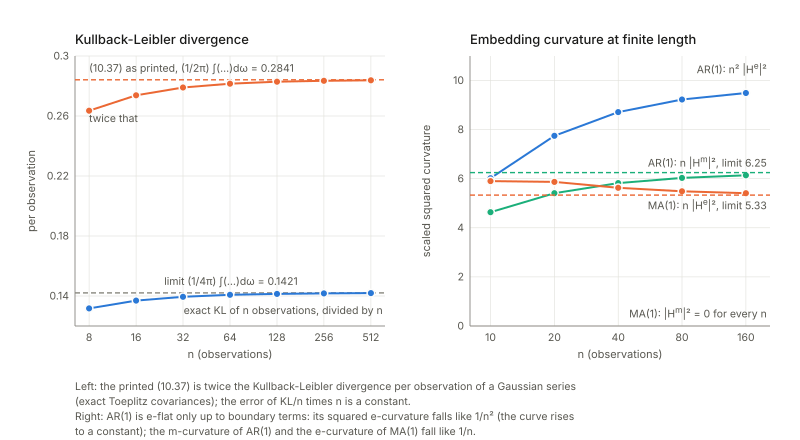

Notes for Chapter 10 of Amari, *Information Geometry and Its Applications* (Springer, 2016). The next section summarises the book's chapter in my own words. The sections after it are explorations that I asked for, one at a time, so they follow my questions and not the book's order. They keep the intuition, the figures and the derivations, and leave out numerical checks.

## What the chapter covers (a summary of the book's chapter)

The chapter applies the dually flat geometry of Part I to **time series**. A time series is a sequence of random numbers indexed by time; here it is produced by feeding white noise (independent Gaussian numbers) into a stable linear filter. Since such a series and the filter that makes it determine each other, studying the geometry of the series is the same as studying the geometry of linear systems, which is what control engineers care about. The author is open that the treatment is intuitive rather than rigorous: the set of all time series is infinite-dimensional, and the clean theory lives in the finite-dimensional models (AR, MA, ARMA). The sections in order:

- **§10.1 Stationary time series and linear system.** A series is stationary when shifting the clock changes none of its statistics, and ergodic when averaging one long record over time gives the same answer as averaging over the randomness. A linear system turns white noise into a weighted sum of present and past noise; the weights are its impulse response, and its transfer function packages them as a function of the delay. The power spectrum (how much variance sits at each frequency) is the squared size of the transfer function. Among the filters that give one spectrum, the book picks the minimum-phase one, so that the spectrum, the filter and the series all determine each other.
- **§10.2 Typical finite-dimensional manifolds of time series.** Three families of filters with finitely many parameters: autoregressive (AR, the series is regressed on its own past), moving average (MA, the series has a finite memory of the noise) and the quotient of the two (ARMA). All three are rational functions of the delay. The section also notes the continuous-time analogue.
- **§10.3 Dual geometry of the system manifold.** The central observation: the Fourier coefficients of a long record are, approximately, independent Gaussians whose variances are the spectrum at each frequency. So the set of spectra behaves like one exponential family with one scale parameter per frequency, and the machinery of Part I (potential, metric, divergence, entropy, two dual coordinate systems) carries over with sums replaced by integrals over frequency. The two coordinate systems are Fourier coefficients: the autocovariances of the spectrum (expectation-type, m) and those of its reciprocal (natural-parameter-type, e). The metric is Euclidean in the logarithm of the spectrum, and the space is dually flat for every value of $\alpha$, much like the manifold of positive measures.
- **§10.4 Geometry of AR, MA and ARMA models.** An AR model has finitely many non-zero inverse autocovariances, so it is a linear subspace in the e-coordinates (e-flat); an MA model has finitely many non-zero autocovariances, so it is m-flat; ARMA is neither. The Pythagorean theorem then does three jobs. Projecting a spectrum onto AR by the m-projection gives the classical *stochastic realisation* (the model that matches the first autocovariances); of all spectra that match them it has maximum entropy; and the dual construction for MA gives a minimum-entropy statement. The section closes with the ARMA singularity: where numerator and denominator of the transfer function share a factor, the model has a redundant parameter and is not a manifold there.
- **Closing remarks.** The use of Gaussian input confines the study to minimum-phase systems, and non-Gaussian input is needed to go beyond. AR is e-flat for an infinitely long series but a curved exponential family for a finite record. ARMA models split into several components joined at singular points (Brockett), which returns in Chapter 12 for multilayer perceptrons. Multi-input multi-output systems (a Grassmann manifold) and Markov chains, which behave like AR models, are mentioned as further directions.

## Links

- **[Interactive companion](figures/interactive.html)**: eight widgets. (1) The two coordinate systems of a spectrum (autocovariances and inverse autocovariances) for AR(2), MA(2) and ARMA(1,1): which sequence stops, which never does. (2) The e-geodesic and the m-geodesic between two models, with the coordinates that must vanish along each. (3) Exact Toeplitz Kullback–Leibler and Fisher information of $n$ observations against the spectral formulas: the factors $2$ and $2\pi$ and a constant boundary term. (4) The m-projection onto AR($p$) of an MA(1), ARMA(1,1) or AR(2) spectrum: Yule–Walker, prediction error, Pythagorean bars, and the second (e-)projection at $p=1$. (5) Maximum entropy: perturbations that keep $r^*_0..r^*_p$, and the white noise that breaks the theorem as printed. (6) The singular line $a=b$ of ARMA(1,1), its Fisher determinant and cepstral image. (7) The edge of the stable region: finite distance, one finite and one infinite divergence. (8) The periodogram, whose relative spread does not shrink with the record length.
- The book: Amari, *Information Geometry and Its Applications* (Springer, 2016), DOI [10.1007/978-4-431-55978-8](https://doi.org/10.1007/978-4-431-55978-8). These notes cover Chapter 10 only; equation numbers such as (10.37) refer to the book.
  No text of the book is reproduced here; everything is restated and re-derived.
- Neighbouring chapters: **[Chapter 9: Neyman–Scott and semiparametrics](../ch09-neyman-scott-and-semiparametrics/index.html)** before, **[Chapter 11: machine learning](../ch11-machine-learning/index.html)** after. Dependencies: dual flatness, Pythagoras and projections from **[Chapter 1](../ch01-dually-flat-structure/index.html)**, exponential families from **[Chapter 2](../ch02-exponential-and-mixture-families/index.html)**, embedding curvature from **[Chapter 5](../ch05-elements-of-differential-geometry/index.html)** and the dual connections of **[Chapter 6](../ch06-dual-connections/index.html)**, curved exponential families from **[Chapter 7](../ch07-asymptotic-theory-of-inference/index.html)**; the singularity of ARMA(1,1) is taken up again in **[Chapter 12](../ch12-natural-gradient-and-singular-regions/index.html)**.
  Background on the annotations site: **[The Fisher information matrix](https://msrepo.github.io/theory_inclined_papers_with_annotations/fisher-information/)**.

## In one paragraph

A **stationary time series** is a sequence of random numbers whose statistics do not drift with time. Feed white noise (independent Gaussian numbers) into a stable linear filter and you get one, and the only thing about it that a Gaussian model can see is its **power spectrum** $S(\omega)$: the variance it carries at each frequency, slow wobbles at small $\omega$, fast ones near $\pi$. For a filter with transfer function $H$ it is $S=\lvert H\rvert^2$.
The chapter's observation is that the variances at different frequencies behave as independent Gaussian scale parameters, so the set $L$ of spectra is (formally) **one exponential family with a continuum of parameters**: natural parameter $\theta(\omega)=1/S(\omega)$, expectation parameter $\eta(\omega)=-S(\omega)/2$. All of Part I then applies with sums replaced by integrals over frequency: a potential $\tfrac12\int\log S$, a diagonal metric that is Euclidean in $\log S$, dual flatness for every $\alpha$.
The two affine coordinate systems are Fourier coefficients: those of $S$ are the **autocovariances** (m-coordinates), those of $1/S$ the **inverse autocovariances** (e-coordinates). An **autoregressive** model (AR) is exactly a family with finitely many non-zero inverse autocovariances, hence **e-flat**; a **moving-average** model (MA) has finitely many autocovariances, hence **m-flat**; ARMA models are neither and are singular where numerator and denominator of $H$ share a factor. The Pythagorean theorem of Chapter 1 then gives, with no further work, the Yule–Walker equations (m-projection onto AR($p$)), the maximum-entropy property of AR models and a dual minimum-entropy theorem for MA models.
I tested these claims against exact Gaussian covariance matrices of $n$ observations and against spectral integrals. The structure holds; several printed details do not: the divergence (10.37) is **twice** the Kullback–Leibler rate, the metric (10.36) is $2\pi$ times the Fisher information per observation, the pairing (10.43) is biorthogonal rather than $0$, the e-flatness of AR holds only in the infinite-length limit (its squared e-curvature falls like $1/n^2$) while MA is exactly m-flat at every length, Theorems 10.2 and 10.3 need the zeroth coefficient as a hypothesis, a sign in (10.63) contradicts (10.64), and the MA index in (10.18) is off by one.

## The spine of the argument

1. A stationary Gaussian series is a white-noise-driven linear system $x=H(z)\varepsilon$; its spectrum is $S=\lvert H(e^{i\omega})\rvert^2$, and with the minimum-phase convention $S$, $H$ and the series determine each other (§10.1).
2. AR, MA and ARMA models are the rational transfer functions $1/A$, $B$, $B/A$ in $z^{-1}$ (§10.2).
3. The Fourier coefficients of a long record are independent Gaussians with variances $S(\omega)$: an exponential family indexed by frequency, with $\theta=1/S$, $\eta=-S/2$, $\psi=\tfrac12\int\log S-\tfrac\pi2$, metric $\tfrac12S^2$ per frequency, Euclidean in $\log S$ (§10.3, (10.26)–(10.38)).
4. Autocovariances $r^*_t$ and inverse autocovariances $r_t$ are dual affine coordinates; $L$ is dually flat for every $\alpha$, with $\alpha$-coordinates $S^{-\alpha}$ (Theorem 10.1).
5. AR($p$) is the linear subspace $r_{p+1}=r_{p+2}=\dots=0$ (e-flat), MA($q$) the subspace $r^*_{q+1}=\dots=0$ (m-flat); ARMA is neither, and is not a manifold where a factor cancels (§10.3–§10.4).
6. Pythagoras: the **stochastic realisation** (Yule–Walker model) of a spectrum is its m-projection onto AR($p$); it maximises entropy among spectra with the same first autocovariances (Theorem 10.2). Dually the MA model matching the first inverse autocovariances minimises entropy (Theorem 10.3).
7. ARMA(1,1): along the line $a=b$ the model is white noise whatever $a$ is, so the model set is two sheets glued at one point (Figure 10.3).
8. Remarks: for a finite record AR is a curved exponential family (curvature falling like $1/T$); Gaussian input sees only minimum phase systems; Markov chains behave like AR models.

## Setup and notation

| Symbol | Meaning | In the running examples |
|---|---|---|
| $x_t$, $\varepsilon_t$ | the series; Gaussian white noise with $\mathbb E\varepsilon_t^2=1$ (10.1) | |
| $h_i$, $H(z)=\sum_ih_iz^{-i}$ | impulse response and transfer function (10.3)–(10.10) | ARMA(1,1): $h$ starts at $1$ and then decays geometrically |
| $S(\omega)=\lvert H(e^{i\omega})\rvert^2$ | power spectrum (10.14) | AR(1): large at slow frequencies, small near $\pi$ |
| $e_0=1$, $e_t=2\cos t\omega$ | cosine basis (10.41) | |
| $r^*_t=\mathbb E[x_sx_{s-t}]$ | autocovariances; $S=\sum_tr^*_te_t$ (10.40)–(10.42); m-coordinates | AR(1): never stop, shrink geometrically |
| $r_t$ | inverse autocovariances, $1/S=\sum_tr_te_t$ (10.39); e-coordinates | AR(1): stop after lag 1 |
| $\theta(\omega)=1/S$, $\eta(\omega)=-S/2$ | natural and expectation parameters (10.27)–(10.28) | |
| $\psi$, $\varphi$ | $\tfrac12\int\log S\,d\omega-\tfrac\pi2$ and $-\tfrac12\int\log S\,d\omega-\tfrac\pi2$ (10.30)–(10.31) | |
| $g(\omega,\omega')$ | $\tfrac12S^2(\omega)$ on the diagonal (10.34) | |
| $D$, KL | the divergence (10.37) *as printed*, and the Kullback–Leibler rate $D_{\rm KL}=\tfrac1{4\pi}\int(\dots)$ per observation | $D=2D_{\rm KL}$ |
| $H_S$ | entropy rate $\tfrac1{4\pi}\int\log S+\tfrac12\log(2\pi e)$ (10.38) | |
| AR($p$), $a=(a_0,\dots,a_p)$ | $H=1/\sum a_iz^{-i}$ (10.16); $a_0$ is the gain | |
| MA($q$), ARMA($p,q$) | (10.19), (10.22) | |
| $M_p(r)$, $S_p$ | spectra sharing $r^*_0..r^*_p$ with $S$; the AR($p$) member of $M_p(r)$ | |

**Conventions.** I use the book's sign in (10.64): $H(z)=\dfrac{1+bz^{-1}}{1+az^{-1}}$, i.e. $x_t=-a\,x_{t-1}+\varepsilon_t+b\,\varepsilon_{t-1}$, so $a=-\phi$ means $x_t=\phi\,x_{t-1}+\varepsilon_t$. Divergences, metrics and entropies are quoted **per observation** (the $\tfrac1{4\pi}$ normalisation, justified in §3.2) unless I write "as printed". $\gamma_t$ and $r^*_t$ are the same thing.

**Running examples.** AR(1) (the free-gain family $s/\lvert1+ae^{-i\omega}\rvert^2$ is the book's AR(1), with $a_0=1/\sqrt s$); MA(1); ARMA(1,1); AR(2) and MA(2) pairs for geodesics. AR(1) and MA(1) are the workhorses (closed forms for curvature, projections and the boundary), ARMA(1,1) is the test case for singularities and curvature, and the AR(2)/MA(2) pairs show the geodesics. A *tiny example* to hold on to, AR(1) with $a=-0.6$: $S(\omega)=1/(1.36-1.2\cos\omega)$, so slow wobbles carry far more variance than the fastest ones; the autocovariances $\gamma_t$ shrink by the factor $0.6$ at every lag and never reach zero; and the inverse spectrum is the trigonometric polynomial $1.36-1.2\cos\omega$, so the inverse autocovariances $r_t$ vanish beyond lag 1. For an MA(1) it is the other way round: the autocovariances stop after lag 1 and the inverse autocovariances go on forever with alternating signs.

## 1. Time series, linear systems and spectra (§10.1)

**In plain words.** A time series is a list of random numbers indexed by time. It is *stationary* if shifting the clock changes none of its statistics, and *ergodic* if averaging one long record over time gives the same answer as averaging over the randomness (10.2). White noise is the simplest series. A *linear system* (filter) makes a coloured series out of it by taking a weighted sum of the present and past noise, $x_t=\sum_{i\ge0}h_i\varepsilon_{t-i}$ (10.3); the weights are the *impulse response* (the output for a single pulse of noise), and writing the delay as $z^{-1}$ gives $x=H(z)\varepsilon$ with the *transfer function* $H(z)=\sum h_iz^{-i}$. The variance of $x_t$ is $\sum h_i^2$, finite by (10.5)–(10.6).

**The spectrum.** Cutting a record into its frequencies, the variance carried at frequency $\omega$ is $S(\omega)=\lvert H(e^{i\omega})\rvert^2$ (10.14). Its cosine coefficients are the autocovariances: in the basis (10.41), $S=\sum_tr^*_te_t$ with $r^*_t=\mathbb E[x_sx_{s-t}]$ (10.40)–(10.42), so $\tfrac1{2\pi}\int S\,d\omega=r^*_0$ (the variance; not $\int S$). The autocovariances computed from the impulse response and from the spectrum agree, and so does the variance $\sum h_i^2$ with $\tfrac1{2\pi}\int S$; this is just Parseval's identity.

**Minimum phase.** Several filters share one spectrum: $\lvert1+be^{-i\omega}\rvert^2=b^2\lvert1+e^{-i\omega}/b\rvert^2$, so moving a zero of $H$ across the unit circle changes $H$ but not $S$ (up to a constant). The book singles out the one with all zeros inside the unit circle (the printed page says $H(z)\neq0$ for $\lvert z\rvert>1$; a text extraction of it shows "$=0$") and $h_0>0$; its leading coefficient is $h_0=\exp\{\tfrac1{4\pi}\int\log S\,d\omega\}$ (Szegő). The sign of $h_0$ is the only freedom left, a point the text passes over.
Why Gaussian noise cannot do better: the MA(1) filter $h=(1,b)$ (minimum phase for $\lvert b\rvert<1$) and its reverse $h=(b,1)$ give the *same* covariance matrix for any number of observations, hence the same Gaussian likelihood. With skewed noise the third-order cumulant $\operatorname{cum}(x_t,x_t,x_{t+1})=\kappa_3\sum_ih_i^2h_{i+1}$ differs between the two ($\kappa_3 b$ against $\kappa_3 b^2$), so non-Gaussian input can tell them apart. So the book's closing remark, that Gaussian input confines the study to minimum-phase systems and non-Gaussian input is needed to go beyond, is correct.

**A slip in (10.12) and in (10.25).** The text calls $S=\lvert X(\omega)\rvert^2$ a deterministic function. It is not: only its *mean* is. The periodogram $I=\lvert\sum_tx_te^{-i\omega t}\rvert^2/n$ of a simulated AR(1) has mean $S$ (this is what (10.28) really uses, $S=\mathbb E\lvert X\rvert^2$), but its spread relative to $S$ does not shrink however long the record: $I/S$ is asymptotically a unit exponential variable. Averaging neighbouring ordinates reduces the spread, which is how spectra are estimated. Neighbouring ordinates are uncorrelated and the phase is uniform, as (10.25) and the text say. But (10.25) as printed has an absolute value, $\mathbb E\lvert X(\omega)X(\omega')\rvert=0$ for $\omega'\neq\omega$, which is impossible for a non-negative quantity; the complex conjugate is meant, $\mathbb E[X(\omega)\overline{X(\omega')}]$. And for a real series $X(-\omega)=\overline{X(\omega)}$, so independence needs $\omega'\neq\pm\omega$.

**Why (10.13).** The condition $\int\lvert\log S\rvert^2d\omega<\infty$ is exactly what makes the norm (10.36) finite: $\log S$ is a point of a Hilbert space. It allows zeros of $S$ on the unit circle (e.g. $S=2+2\cos\omega$ has $\tfrac12\int(\log S)^2=\pi^3/3$), which will matter in §4.6.

## 2. The three model families (§10.2)

**In plain words.** An AR($p$) series is a *regression on its own past*, $a_0x_t=-\sum_{i\ge1}a_ix_{t-i}+\varepsilon_t$, with transfer function $1/\sum a_iz^{-i}$ and $p+1$ parameters ($a_0$ is a gain, $1/\sqrt{\text{innovation variance}}$). An MA($q$) series is a *finite memory of the noise*, $x_t=\sum b_i\varepsilon_{t-i}$, with $S=\lvert\sum b_te^{i\omega t}\rvert^2$. ARMA($p,q$) is the quotient (10.22)–(10.23). All three are rational in $z^{-1}$.

Four details of the printed text do not hold as written.

- **MA index (10.18)–(10.20).** The sum starts at $i=1$. Then the printed "MA(3)" has zero autocovariance already at lag 3: it is a delayed MA(2) with three parameters, while the later description of MA($q$) by the $q+1$ coordinates $r^*_0..r^*_q$ (10.52)–(10.53) needs $b_0$ too, as AR($p$) has $a_0$. The sum should start at $i=0$.
- **ARMA recursion (10.21).** The sum $-\sum_{i=0}^pa_ix_{t-i}$ contains $-a_0x_t$ on the right-hand side, which gives an impulse response different from the transfer function (10.22). The sum should start at $i=1$ with $a_0x_t$ moved to the left.
- **Sign in (10.63) against (10.64).** $x_t=ax_{t-1}+\varepsilon_t+b\varepsilon_{t-1}$ has $H=(1+bz^{-1})/(1-az^{-1})$, not the printed $(1+bz^{-1})/(1+az^{-1})$. The cancellation that the text puts on the diagonal $a=b$ (and Figure 10.3 draws there) holds for (10.64); for (10.63) it is on $a=-b$. I use (10.64).
- **The condition $\lvert b\rvert<1$ is not stability.** The text attributes both $\lvert a\rvert<1$ and $\lvert b\rvert<1$ to stability. Stability needs only $\lvert a\rvert<1$. The condition $\lvert b\rvert<1$ is *minimum phase* (invertibility): $b$ and $1/b$ give a stable system with the same spectrum up to a gain (§1). So the parameter square $\lvert a\rvert,\lvert b\rvert<1$ is a choice of representative of each spectrum, not a stability region.

Also, $(a_0..a_p,b_0..b_q)$ over-parametrise ARMA($p,q$) by one scale ($H$ is unchanged under $(a,b)\to(ca,cb)$), so the family has $p+q+1$ parameters, as AR($p$) has $p+1$ and MA($q$) has $q+1$. I did not check the continuous-time remark (10.24).

## 3. The dual geometry of the system manifold (§10.3)

### 3.1 The likelihood is an exponential family indexed by frequency

**In plain words.** Take the Fourier transform of a long record: you get one complex number per frequency, and (approximately) they are independent Gaussians with variance $S(\omega)$ each (10.25). So the likelihood factorises over frequencies. At a single frequency this is the Gaussian *scale* family $N(0,S)$: in exponential-family language the natural parameter is the precision $\theta=1/S$, the sufficient statistic is $-\lvert X\rvert^2/2$ and the expectation parameter is $\eta=-S/2$, and the whole spectrum is the product (10.26)–(10.29). (The integral in (10.26) runs over $[-\pi,\pi]$ and so counts each frequency twice, because $X(-\omega)=\overline{X(\omega)}$; the factor $\tfrac12$ compensates, and what is written is the density of independent complex Gaussians with variance $S(\omega)$ on $(0,\pi)$.) Dual flatness for every $\alpha$ is then close to a triviality: a product of one-dimensional families is flat in any $\alpha$-structure. The content is in what the coordinates are.

**Is "$\approx$" in (10.26) good?** The exact Gaussian log-likelihood of $n$ observations and the spectral form $-\tfrac12\sum_j[\log S(\omega_j)+I(\omega_j)/S(\omega_j)]$ over the Fourier frequencies differ by a quantity that stays of order one while the log-likelihood itself fluctuates like $\sqrt n$: the approximation error is a boundary term. For a **periodic** (circulant) series of period $n$ the spectral form is not an approximation at all: every Fourier frequency is an independent Gaussian with variance $S(\omega_k)$, so the Kullback–Leibler divergence of two circulant models equals $\tfrac12\sum_k(S_1/S_2-1-\log S_1/S_2)$ exactly, and the Fisher information is also exactly the spectral sum. So **the book's $L$ is exactly the manifold of circulant Gaussian series in the limit of large period**, and everything below is exact there; for ordinary (Toeplitz) records it holds up to boundary terms, which §3.5 discusses.

### 3.2 Potentials, metric, divergence, entropy

**In plain words.** Once the spectrum is an exponential family, Part I hands over its standard objects: a potential, a metric (how well data can tell two nearby spectra apart), a divergence (how surprising data from one spectrum look under another) and an entropy (the unpredictability per time step). The only open question is the *scale*: per how long a record? The comparisons below settle that.

With $\theta=1/S$ the cumulant function is $\psi=-\tfrac12\int\log\theta\,d\omega-\tfrac\pi2=\tfrac12\int\log S\,d\omega-\tfrac\pi2$, its Legendre dual is $\varphi=-\tfrac12\int\log S\,d\omega-\tfrac\pi2$, and (10.32) holds: $\psi+\varphi-\int\theta\eta\,d\omega=0$ with $\int\theta\eta\,d\omega=-\pi$. **A sign slip in (10.30):** its *first* expression, $\tfrac12\int\log\{-\theta\}$, is not even real for $\theta=1/S>0$, and its real part would be $-\tfrac12\int\log S$, opposite to the second expression. The first form should read $-\tfrac12\int\log\theta\,d\omega-\tfrac\pi2$ (or $-\tfrac12\int\log\{-\theta\}$ if $\theta=-1/S$ is used); (10.31) and the second forms are right.

**A closed-form two-dimensional example.** The free-gain AR(1) family is the cone $r_0>2\lvert r_1\rvert$ in the plane $(r_0,r_1)=(a_0^2+a_1^2,\,a_0a_1)$ (its boundary is the unit root $\lvert a\rvert=1$), and there the potential is explicit:
$$\psi(r_0,r_1)=-\pi\log\frac{r_0+\sqrt{r_0^2-4r_1^2}}{2}-\frac\pi2 .$$
Its gradient gives the expectation coordinates $\eta_t=\int e_t\eta\,d\omega$, which are $-\pi$ ($t=0$) and $-2\pi$ ($t\ge1$) times the autocovariances (that is the factor in (10.43), see 3.3); its Hessian is $\tfrac12\int S^2e_te_s\,d\omega$, the metric (10.34) in the $r$-chart; and the variance is $\gamma_0=1/\sqrt{r_0^2-4r_1^2}$, which is the familiar $s/(1-a^2)$.

**The metric (10.34)–(10.36) is Euclidean in $\log S$** ($\tfrac12S^2(\delta\theta)^2=\tfrac12(\delta\log S)^2$ per frequency), so $L$ is flat for the Levi-Civita connection and the $\alpha=0$ geodesic between two spectra is the geometric mean $S_1^{1-t}S_2^t$.

**Three normalisations, none of them "per observation" except one.** Comparing with the exact quantities for Gaussian records of $n$ observations (Toeplitz covariance matrices, divided by $n$):

*Divergence.* The printed (10.37), $\tfrac1{2\pi}\int(S_1/S_2-1-\log S_1/S_2)\,d\omega$, is **twice the Kullback–Leibler rate**: the exact KL of $n$ observations divided by $n$ converges to $\tfrac1{4\pi}\int(\dots)$, with a boundary correction that is a constant divided by $n$. For two white noises with variances $s_1,s_2$, (10.37) gives $s_1/s_2-1-\log(s_1/s_2)$, twice the familiar $\tfrac12(\dots)$.

*Entropy.* $H_S=\tfrac1{4\pi}\int\log S\,d\omega+\tfrac12\log(2\pi e)$ is right: the exact differential entropy of $n$ observations divided by $n$ approaches it with an error that is a constant divided by $n$. So **(10.38) is the entropy rate per observation**. It equals $\log h_0+\tfrac12\log(2\pi e)$, the entropy of a single innovation $h_0\varepsilon_t$: a stationary Gaussian series is exactly as unpredictable as its one-step prediction error (Kolmogorov–Szegő).

*Fisher information.* For ARMA(1,1) the per-observation Fisher information is $\tfrac1{4\pi}\int\partial_i\log S\,\partial_j\log S\,d\omega$, in closed form
$$G=\begin{bmatrix}\dfrac1{1-a^2}&-\dfrac1{1-ab}\\[2mm]-\dfrac1{1-ab}&\dfrac1{1-b^2}\end{bmatrix}.$$
The exact Fisher information of $n$ observations, divided by $n$, approaches it with an error of a constant over $n$. The book's metric (10.36) is $\tfrac12\int(\delta\log S)^2$, i.e. **$2\pi$ times the per-observation information**; the Hessian of (10.37) is twice it. In terms of record length, (10.36) is the information in $2\pi$ observations (Fourier frequencies spaced by exactly one), (10.37) is the divergence of $2$ observations and (10.38) the entropy of $1$. None of this affects any conclusion (they are constants), but the three cannot all be "per observation". That this metric is the statistically relevant one shows in the variance of the maximum-likelihood estimate of an AR(1) coefficient, which is $1/(n\,g_{aa})=(1-a^2)/n$ for long records.

### 3.3 Two coordinate systems, and the pairing (10.43)

**In plain words.** A spectrum can be summarised by a list of numbers in two dual ways: how strongly the series correlates with its own past at lag $t$ (the autocovariances), and the same quantity for the inverted spectrum $1/S$ (the inverse autocovariances). Each list is the dual basis of the other, which is what *biorthogonal* means below.

Expand $S=\sum_tr^*_te_t$ and $1/S=\sum_tr_te_t$. For an AR(2) the inverse autocovariances stop after lag 2 while the autocovariances go on indefinitely (oscillating and decaying); for an MA(2) the autocovariances stop after lag 2 while the inverse autocovariances go on; for an ARMA(1,1) neither stops, and both decay geometrically after the first lag or two (the interactive companion shows all three).

For AR($p$), $1/S=\lvert\sum a_te^{i\omega t}\rvert^2$, so $r_t=\sum_sa_sa_{s+t}$ and $r_t=0$ for $t>p$: the linear constraints (10.50). For MA($q$), $r^*_t=\sum_sb_sb_{s+t}$ and $r^*_t=0$ for $t>q$ (10.53). **In which coordinates is AR(2) flat?** In $r$, not in the coefficients $a$ (§3.5), and not in $r^*$ where its higher entries are non-zero though determined by the first three.

**(10.43) is false as printed.** It says the coordinate axes of $r_t$ and $r^*_s$ are orthogonal, $\langle e_t,e^*_s\rangle=0$, with no restriction on $t,s$. The tangent vector of the $r_t$ axis has $\delta\theta=e_t$; that of the $r^*_s$ axis has $\delta S=e_s$, i.e. $\delta\theta=-e_s/S^2$. With the metric (10.34),
$$\langle e_t,e^*_s\rangle=\tfrac12\int S^2\,e_t\bigl(-e_s/S^2\bigr)\,d\omega=-\tfrac12\int e_te_s\,d\omega,$$
which is independent of $S$: $-\pi$ for $t=s=0$, $-2\pi$ for $t=s\ge1$, and $0$ for $t\ne s$. The two axis systems are **biorthogonal** (dual bases, $\langle\partial_i,\partial^j\rangle=\delta_i^j$ up to the factors $-\pi,-2\pi$), as in every dually flat manifold. Orthogonality for all $t,s$ would make the metric degenerate. What the book then uses, that $r_s$ for $s>k$ is orthogonal to $r^*_1..r^*_k$, needs only $t\neq s$ and is right.

### 3.4 Theorem 10.1: every $\alpha$, and the $\alpha$-divergence

**In plain words.** The parameter $\alpha$ is a dial between two ways of averaging, the e-way ($\alpha=1$, mix the natural parameters) and the m-way ($\alpha=-1$, mix the expectation parameters); other settings mix an intermediate power of $S$. The theorem says that for time series every setting of the dial gives a flat geometry. The reason is that each frequency is a single scale parameter, and one dimension has no curvature to worry about.

The $\alpha$-connection of an exponential family has $\Gamma^{(\alpha)}_{ij,k}=\tfrac{1-\alpha}2T_{ijk}$ in $\theta$-coordinates (so $\alpha=1$ is the e-connection, flat in $\theta$). At one frequency, $g=\psi''=1/(2\theta^2)$ and $T=\psi'''=-1/\theta^3$, so $\Gamma^{(\alpha)}{}_{\theta\theta}{}^\theta=(\alpha-1)/\theta$. An affine coordinate $\rho$ must have $\rho''/\rho'=\Gamma$; for $\rho=-\tfrac1\alpha S^{-\alpha}=-\tfrac1\alpha\theta^\alpha$, the representation (10.46), this holds, since $\rho'=-\theta^{\alpha-1}$ and $\rho''/\rho'=(\alpha-1)/\theta$.

So $S^{-\alpha}$ is $\alpha$-affine at each frequency, and so are its Fourier coefficients: $L$ is dually flat for every $\alpha$ because it is a product of one-dimensional scale families. This is why the book says $L$ is like the positive measures rather than a probability simplex (where only $\alpha=\pm1$ are flat). The one-frequency computation is all the proof needs.
For the $\alpha$-divergence (10.45): $\alpha=-1$ reproduces the printed (10.37), $\alpha=+1$ is the same with the arguments swapped, the duality $D^{(\alpha)}(S_1\Vert S_2)=D^{(-\alpha)}(S_2\Vert S_1)$ holds, and the divergence is continuous in $\alpha$. For a small displacement $S_2=S_1e^{\epsilon h}$ all $\alpha$ give the same quadratic form $\tfrac1{4\pi}\int(\epsilon h)^2$: the metric induced by (10.45) is $\tfrac1\pi$ times the metric (10.36). The normalisations of Theorem 10.1 and of (10.34)–(10.36) differ by a factor $\pi$.

### 3.5 AR is e-flat, MA is m-flat: geodesics, coordinates, curvature

**In plain words, and a picture.** A straight line in the e-coordinates (the e-geodesic) mixes *inverse* spectra, $1/S_t=(1-t)/S_1+t/S_2$; a straight line in the m-coordinates mixes spectra, $S_t=(1-t)S_1+tS_2$. A family is e-flat if its e-geodesics stay in it.

**Geodesics between two models.** Between two AR(2) models the e-geodesic keeps $r_3=r_4=\dots=0$ and stays in AR(2), while the m-geodesic has non-zero higher inverse autocovariances and has left. Between two MA(2) models it is reversed: the m-geodesic stays in MA(2) and the e-geodesic leaves. For ARMA(1,1) a spectrum has $\gamma_{k+1}/\gamma_k=-a$ for all $k\ge2$; neither the m-midpoint nor the e-midpoint of two ARMA(1,1) models has constant ratios, so neither geodesic stays in ARMA(1,1). (In the figure the m-midpoint of the two AR(1) models has $r_2\ne0$, and the e-midpoint of the two MA(1) models has $\gamma_2\neq0$.)

**The coefficients are not affine, the inverse autocovariances are.** The e-midpoint of two AR(2) models has coefficients obtained by Fejér–Riesz factorisation of the midpoint $r$, and these are not the straight midpoint of the coefficients. The *Fejér–Riesz theorem* says every positive trigonometric polynomial $r_0+2\sum r_t\cos t\omega$ equals $\lvert\sum a_te^{i\omega t}\rvert^2$ for a unique stable $a$ with $a_0>0$, so the stable AR($p$) models with free gain are exactly the positive points of the linear space $r_{p+1}=\dots=0$: a **convex cone**, and mixing inverse spectra never leaves it. In the coefficients that fails: for $p=3$ the straight midpoint of two stable coefficient vectors can be unstable (the stable region is not convex in the coefficients), while for $p=2$ it cannot (the stability region is a triangle), and along the e-geodesic the midpoints always stay positive spectra with a stable AR(3) factor. So $r_t$ is the right chart for the stable AR family; the coefficients are not.

**Exactness and the finite record.** For the exact model of $n$ observations, mixing two AR(2) *precision* matrices (an e-geodesic of the Gaussian family) keeps the precision matrix banded, and in the middle of the record its covariance has the autocovariances of the spectral e-geodesic; but near the two ends the diagonal differs from its bulk value, so the exact e-geodesic is not Toeplitz at the ends. The m-geodesic of Toeplitz matrices is exactly Toeplitz (a mixture of covariance matrices). So the Toeplitz family is **exactly m-flat and only asymptotically e-flat**.

**Curvature.** The squared norms $\lvert H^e\rvert^2,\lvert H^m\rvert^2$ of the e- and m-embedding curvature (Chapter 5 §10; normal part of $\partial^2\theta$ resp. $\partial^2\eta$ in the Fisher metric, contracted with $g^{-1}g^{-1}$) per observation, for the free-gain families, come out as follows. In the infinite-length limit **AR(1) is e-flat and not m-flat, MA(1) the reverse, ARMA(1,1) neither**. If the gain is **pinned** ($a_0=1$, the one-parameter family $1/\lvert1+ae^{-i\omega}\rvert^2$, the dotted parabola $r_0=1+r_1^2$ in the figure) AR(1) is no longer e-flat: it acquires a constant e-curvature, and dually for MA(1) with m-curvature. The book's AR($p$) includes the gain $a_0$ and is e-flat; the usual statistician's model with a known innovation variance is not.
For the exact Toeplitz covariances of $n$ observations (inside the Gaussian family of all zero-mean covariances), the m-curvature of MA(1) is zero at **every** length (the matrices $\gamma_0I+\gamma_1(J+J^{\mathsf T})$ form a linear space). The e-curvature of AR(1) is **not zero at finite length but falls like $1/n^2$ in squared norm**, i.e. like $1/n$ in norm: the book's remark that AR is e-flat for a series of infinite length and a curved exponential family for a finite record, with curvature shrinking like $1/T$, is confirmed (for the norm; right panel of the figure in §3.2). For comparison, for $n$ i.i.d. observations from a curved family the metric scales with $n$ and $\theta''$ does not, so $\lvert H^e\rvert^2\sim1/n$ (Chapter 7); the AR(1) record is better by another factor $1/n$, because its likelihood is an exponential family in $(\sum x_t^2,\sum x_tx_{t-1})$ up to the single boundary statistic $x_1^2+x_n^2$. Seen as a $(3,2)$ curved exponential family with the statistics $\sum_{t=2}^{n-1}x_t^2$, $\sum x_tx_{t-1}$, $x_1^2+x_n^2$, the same curvature results.

## 4. AR, MA and ARMA models (§10.4)

### 4.1 The stochastic realisation is the m-projection onto AR($p$)

**In plain words.** Given a spectrum $S$ (say a long record's), which AR($p$) spectrum is "closest"? The book's answer: match the first autocovariances exactly and let the rest follow. In the geometry: the spectra sharing $r^*_0..r^*_p$ with $S$ form an m-flat set $M_p(r)$ (fixing $p+1$ m-coordinates), AR($p$) is e-flat with coordinates $r_0..r_p$, the two are biorthogonal by (10.43), so their intersection $S_p$ is the foot of the **m-projection** of $S$ onto AR($p$), and the Pythagorean theorem gives (10.57): $D[S{:}S_0]=D[S{:}S_p]+D[S_p{:}S_0]$ for any $S_0$ in AR($p$), in particular white noise. The m-projection is what the time-series literature calls the **Yule–Walker** model, computed by the Levinson–Durbin recursion.

**What the projection looks like.** Writing $\sigma_p^2$ for the prediction error variance of the order-$p$ model and $\sigma_\infty^2$ for the infinite-order one, the divergence of the m-projection is $D_{\rm KL}[S{:}S_p]=\tfrac12\log(\sigma_p^2/\sigma_\infty^2)$: how much a finite-order predictor loses against the best possible one, a different route (prediction theory) to the same quantity. As $p$ grows the divergence shrinks to zero, and the Pythagorean sum stays the same: the part measured from the model to white noise grows by exactly what the part from the process to the model loses. The m-projection also *is* the best linear predictor of order $p$, which is why Yule–Walker is a sensible estimate. The first autocovariances of $S_p$ equal those of $S$, and Pythagoras holds for every $S_0$ in the e-flat AR($p$) family, not only for white noise.

**Notation slips in the paragraph before (10.57).** The text uses $r$ where the autocovariances $r^*$ are meant, says that the higher autocorrelations of the AR($p$) system vanish right after saying they do not, and defines $M_p(r)$ by $r^*_1..r^*_p$. The stochastic realisation of an MA(1) has autocovariances that agree with the MA(1)'s up to lag 1 and then decay geometrically, so they do not vanish; it is the **inverse** autocovariances of an AR($p$) that vanish beyond lag $p$. And $M_p(r)$ must fix **$r^*_0$ as well** (the variance): AR($p$) has $p+1$ coordinates, and the foot of the projection is determined by $p+1$ numbers.

### 4.2 Theorem 10.2 (maximum entropy), and what it needs

**In plain words.** Of all spectra that agree with the data on the first $p+1$ autocovariances, the AR($p$) one adds the least extra structure: it is the least predictable, the one of maximum entropy. The theorem says that this least committal completion is the m-projection.

The stochastic realisation maximises the entropy among all spectra with the same first autocovariances. Behind it is an identity that is, I think, the shortest proof: for every $\tilde S\in M_p(r)$,
$$H(S_p)-H(\tilde S)=D_{\rm KL}[\tilde S{:}S_p],$$
because $\operatorname{mean}(\tilde S/S_p)=r_0\gamma_0+2\sum_{t\le p}r_t\gamma_t=1$ depends only on $\gamma_0..\gamma_p$ (all shared) and so the divergence is half the difference of $\operatorname{mean}\log$. Since a divergence is non-negative, every competitor has lower entropy, and the first-order change of the entropy under a perturbation inside $M_p(r)$ vanishes by orthogonality. The entropy gap between the realisation and $S$ itself shrinks as $p$ grows (Burg's argument: $\sigma_\infty^2\le\sigma_p^2$).

**The printed theorem omits a hypothesis.** It fixes $r=(r_1,\dots,r_p)$ only (the coordinates of AR($p$) in (10.49) are $r_0..r_p$). Without $r^*_0$ there is no maximum: adding white noise $c$ to $S_1$ keeps $r^*_1$ and raises the entropy without bound as $c$ grows (roughly like $\tfrac12\log c$). The same happens if the printed $r_1..r_p$ are read as normalised correlations: $S\to cS$ keeps them and raises the entropy by exactly $\tfrac12\log c$. The proof itself uses the constant $c_0$ in (10.58), which is $r^*_0$. (10.58) holds exactly as printed with $c_0=r^*_0$; it is consistent with (10.37) and (10.38) as printed, which is why its factor is $-2H_S$.

### 4.3 The MA side: dual realisation, Theorem 10.3, and a factor 2

**In plain words.** The same game played with inverse autocovariances picks the MA model, the most structured completion (minimum entropy).

For an MA model the roles of $r$ and $r^*$ swap. The **dual stochastic realisation** $S^{\rm MA}_q$ of $S$ is the MA($q$) spectrum with the same *inverse* autocovariances $r_0..r_q$; the printed text says "AR($q$)" and writes $r^*$ for them (twice), and Theorem 10.3 lists $r^*_1..r^*_q$ (again without the zeroth). It equals the reciprocal of the AR($q$) Yule–Walker fit of $1/S$. For an AR(1) spectrum, the MA(1) dual realisation matches $r_0$ and $r_1$ exactly; it cannot match the ratio $\gamma_1/\gamma_0$ of the AR(1), because an MA(1) has at most $\tfrac12$ there.

Its divergence to $S$ shrinks as $q$ grows by the same closed form as in §4.1, applied to $1/S$, which is a first-order spectrum of MA type. The Pythagorean theorem (10.61) holds: it is the e-projection onto the m-flat MA($q$).
**Theorem 10.3** (minimum entropy) has the dual identity $H(\tilde S)-H(S^{\rm MA}_q)=D_{\rm KL}[S^{\rm MA}_q{:}\tilde S]$ for every $\tilde S$ with the same $r_0..r_q$, and it too needs the zeroth coefficient: adding $c$ to $1/S_1$ keeps $r_1$ and lowers the entropy without bound as $c$ grows.
**(10.62) has the wrong factor.** It says $D[S_0{:}S]=H_S+\text{const}$. With the printed (10.37), $D[S_0{:}S]=r_0-1+\tfrac1{2\pi}\int\log S=2H_S+r_0-1-\log(2\pi e)$, consistent with the $-2H_S$ of (10.58)–(10.59): on a family with fixed $r_0$ the combination $D-2H_S$ is constant while $D-H_S$ varies. The conclusion of the theorem is unaffected. (With the true Kullback–Leibler rate the factor would be $1$ in (10.58)–(10.59) as well.) The book's closing comment on the section, that the Pythagorean relation is more fundamental than the maximum-entropy principle, is confirmed: the identities above are the Pythagorean relation.

### 4.4 The best AR(1) approximation of an MA(1), in each sense

The m-projection (minimising $D[S{:}S']$ over AR(1)) is Yule–Walker, $a=-b/(1+b^2)$. The **e-projection** (minimising $D[S'{:}S]$) is a different model, with a slightly larger coefficient in absolute value: the root in $(-1,0)$ of $b^2a^3+ba^2-a-b=0$. Each wins in its own divergence: the m-projection has the smaller $D[S{:}\cdot]$ and the e-projection the smaller $D[\cdot{:}S]$. Pythagoras holds for the m-projection onto the e-flat AR(1), $D[S{:}S_0]=D[S{:}S_m]+D[S_m{:}S_0]$, and **fails for the e-projection onto AR(1)**, which is not m-flat: the direct divergence $D[S_0{:}S]$ is larger than $D[S_0{:}S_e]+D[S_e{:}S]$. Onto AR(2) the two projections again differ slightly.

### 4.5 ARMA: neither flat, and singular

**In plain words.** If numerator and denominator of $H$ share a factor, that factor does nothing, so the model has a redundant parameter: a whole line of parameter values describes one spectrum. The Fisher metric then degenerates along that line, because a direction that changes nothing carries no information.

ARMA(1,1) is neither e-flat nor m-flat (§3.5), and it is not a manifold. On the diagonal $a=b$ the transfer function is $H=1$ whatever $a$ is: $\partial_a\log S+\partial_b\log S=0$ there. The per-observation Fisher determinant is
$$\det G=\frac{(a-b)^2}{(1-a^2)(1-b^2)(1-ab)^2},$$
which vanishes exactly on the diagonal: there the matrix is singular with kernel $(1,1)$, and $\det G$ grows like $(a-b)^2$ away from it. The same happens for **any** common factor: for ARMA(2,2) with numerator and denominator sharing a linear factor, the Fisher information has a null vector, exactly the direction that moves the common factor in numerator and denominator together.

**The two sheets.** $h_1=b-a$ is the sign that separates the triangles $b>a$ and $b<a$ (Brockett's disjoint components, for degree one). The cepstrum, the Fourier coefficients of $\log S=\sum_k2(-1)^{k+1}(b^k-a^k)\cos(k\omega)/k$, gives Euclidean coordinates for (10.36): $c_1=2(b-a)$, $c_2=a^2-b^2$, with Jacobian $4(b-a)$. The whole diagonal maps to the origin (white noise), each triangle to a half-plane. The distance from white noise is $d^2=\tfrac12\int(\log S)^2=2\pi[\mathrm{Li}_2(a^2)+\mathrm{Li}_2(b^2)-2\mathrm{Li}_2(ab)]$, and near the diagonal it grows linearly in $\lvert b-a\rvert$. The directions in which $S$ leaves white noise, $f_a=\partial_b\log S\vert_{b=a}$, have normalised inner products $\sqrt{(1-a^2)(1-a'^2)}/(1-aa')$, strictly below one for different $a$ and $a'$, so directions for different values of $a$ are independent. So near white noise the model set is a **cone over a curve**, not a smooth surface: a genuine singular point, as Figure 10.3 draws it.

### 4.6 The boundary of the stable region

**In plain words.** Push an AR model towards a unit root and its series stops being stationary; push an MA model towards $\lvert b\rvert=1$ and it stops being invertible (its spectrum touches zero). What does the geometry do at that edge?

For AR(1), $x_t=\phi x_{t-1}+\varepsilon_t$ ($a=-\phi$): the Fisher information per observation $1/(1-\phi^2)$ diverges at the unit root but the Fisher arc length from $0$ is $\arcsin\phi\to\pi/2$ (the whole interval has length $\pi$), so the boundary is at **finite distance**. The divergence is finite one way and infinite the other: $D_{\rm KL}[\text{white}{:}\text{AR}]=\phi^2/2$ stays bounded, while $D_{\rm KL}[\text{AR}{:}\text{white}]=\phi^2/(2(1-\phi^2))$ blows up. For MA(1) with $b\to1$ the spectrum acquires a zero at $\omega=\pi$, $1/S$ stops being integrable, and the **e-coordinates blow up while the m-coordinates and $\int(\log S)^2$ stay finite**: $r_0=1/(1-b^2)\to\infty$ while $\gamma_0=1+b^2\to2$ and $\tfrac12\int(\log S)^2=2\pi\mathrm{Li}_2(b^2)\to\pi^3/3$. So (10.13) holds at the edge but the e-chart does not exist there: the $r_t$ are linear functions of $\theta(\omega)$ only if $1/S\in L^1$, which (10.13) does not give. The cone picture of the figure in §3.5 is the same fact: the e-geodesics reach the boundary of the AR cone in finite parameter time.

## 5. The remarks that end the chapter (end of §10.4)

The remarks restate three things already examined: **Gaussian input sees only minimum phase** (§1: same likelihood, different third cumulant); **AR is e-flat for infinite series and a curved exponential family for a finite record**, curvature $\sim1/T$ (§3.5: norm of the e-curvature of the exact AR(1) likelihood $\sim1/n$); and **ARMA singularities** (§4.5, with the $a=b$ line, Brockett's components and any common factor).

**Markov chains.** The last remark says a Markov chain is an exponential family, curved when observed on $0\le t\le T$ because of the initial and final values, with e-curvature of order $1/T$. For a two-state chain with transition probabilities $P(0\to1)=\alpha$, $P(1\to0)=\beta$, every chain of length $T+1$ (any initial law, any transition matrix) lies in the 4-dimensional exponential family with statistics $(x_0,N_{01},N_{10},N_{11})$, the initial state and the transition counts. The stationary-start family and the family with a free initial law are curved subfamilies of it, and their squared e-embedding curvature falls like $1/T^2$, so the curvature itself falls like $1/T$, as the book says: the same behaviour as the AR(1) record, presumably for the same reason (the boundary statistics carry $O(1)$ information against $O(T)$ for the bulk).

Not checked: the **multi-input multi-output** (Grassmannian) remark, the continuous-time version (10.24), and the quoted higher-order asymptotic theory of Amari–Nagaoka and Taniguchi and the estimator behaviour near singularities of Fukumizu–Kuriki.

## Checks of the book's statements

Most of the chapter's structure holds up; the places where the printed text needs a correction are these, each explained in the section named.

- **Verified as stated:** the spectrum, autocovariance and minimum-phase relations (§1); the Gaussian-input remark (§1); the entropy rate (10.38) (§3.2); the Euclidean metric (10.34)–(10.36) up to normalisation (§3.2); Theorem 10.1 (§3.4); AR e-flat and MA m-flat, ARMA neither, with the singularity of ARMA(1,1) (§3.5, §4.5); the Pythagorean relation for the m-projection onto AR($p$) and its identification with Yule–Walker (§4.1); the closing remarks on finite records and Markov chains (§5).
- **Corrections:** $S=\lvert X\rvert^2$ is not deterministic and (10.25) needs a complex conjugate (§1); the MA index in (10.18)–(10.20) and the ARMA recursion (10.21) are off by one (§2); (10.63) disagrees in sign with (10.64) (§2); $\lvert b\rvert<1$ is minimum phase, not stability (§2); the first expression in (10.30) has a sign slip (§3.2); (10.37) is twice the Kullback–Leibler rate and (10.36) is $2\pi$ times the per-observation Fisher information (§3.2); (10.43) is biorthogonality, not orthogonality, for $t=s$ (§3.3); AR is e-flat only for infinite length (§3.5); the paragraph before (10.57) mixes $r$ and $r^*$ and omits $r^*_0$ (§4.1); Theorems 10.2 and 10.3 have no extremum unless the zeroth coefficient is held fixed (§4.2, §4.3); (10.62) has the wrong factor (§4.3).

## Questions and doubts

- **What is the manifold $L$, precisely?** The book says the treatment is intuitive. The Euclidean metric suggests $L\cong$ an open set of $\log S\in L^2$ (this is what (10.13) gives), but the e-chart needs $1/S\in L^1$ and the m-chart $S\in L^1$, neither of which follows (at $b=1$ the first fails while $\int(\log S)^2$ is finite). A precise statement would specify a space on which all three charts are defined; I did not find one in the chapter.
- **Which normalisation is "the" metric and divergence?** (10.36), (10.37) and (10.38) correspond to records of $2\pi$, $2$ and $1$ observations; Theorem 10.1's metric is a fourth ($\pi$ times smaller than (10.36)). No conclusion depends on it, but a formula quoted from this chapter (the divergence, the Cramér–Rao bound) needs the factor stated. Settling it means choosing the per-observation convention, as I did.
- **Is dual flatness for every $\alpha$ a property of time series, or of the product structure?** It is exact for circulant (periodic) series; for Toeplitz records I examined e-flatness of AR (squared curvature $\sim1/n^2$) and m-flatness of MA (exact), but not the flatness of the $\alpha$-connections for $\alpha\neq\pm1$ at finite $n$. A finite-$n$ curvature computation for $\alpha=0$ would settle it.
- **Does the $1/n$ e-curvature of AR matter?** It is smaller than the $1/\sqrt n$ of an i.i.d. curved family, so I expect it to be negligible in the second-order terms of Chapter 7, but I did not carry the Theorem 7.5 terms over to time series (the book cites Taniguchi and Amari–Nagaoka for that).
- **How does estimation behave near $a=b$?** $\det G\propto(a-b)^2$ means the Cramér–Rao variance of $(\hat a,\hat b)$ blows up like $1/((a-b)^2n)$ and the regularity assumptions of Chapter 7 fail. The book defers to Chapter 12 and Fukumizu–Kuriki; I did not study the distribution of the MLE there.
- **What does the Gaussian geometry say about non-Gaussian linear series?** The chapter's $L$ is built from the Gaussian likelihood. For non-Gaussian white noise the Fisher information depends on the noise density, and the minimum-phase restriction disappears (§1, third cumulant). Nothing in the chapter treats that case, and I looked only at the identifiability statement.
- **Is the printed MA convention a typo or a different model?** The off-by-one in (10.18)–(10.20) is consistent through (10.19), (10.20) and (10.22), but not with (10.52)–(10.53) or (10.64); I take it as a typo (the sum should start at 0): without $b_0$ the printed MA(1) would be white noise with a gain, and the hierarchy MA(0)$\subset$MA(1)$\subset\dots$ of (10.54) would not make sense.
- **Is the correspondence series, spectrum, transfer function really one-to-one?** §10.1 says so for ergodic time series. It holds for Gaussian series, where the spectrum determines the law. For non-Gaussian linear series it does not: the two MA(1) filters of §1 have the same spectrum and different third cumulants, so they are different processes. The chapter's $L$ is the set of Gaussian series (or of their second-order structure), not of all ergodic series.
- **Continuous time and multi-input systems.** Not checked (§5). I looked at the Markov-chain remark only for a two-state chain; a three-state chain or a longer record would show whether the constant in $\lvert H^e\rvert^2\sim c/T^2$ depends on the state space.

## Takeaways

- **A spectrum is one point of a product of Gaussian scale families.** $\theta=1/S$, $\eta=-S/2$, metric $\tfrac12(\delta\log S)^2$: Euclidean in $\log S$, dually flat for every $\alpha$. It is *exactly* the manifold of periodic Gaussian series (circulant covariance matrices) and the limit of ordinary ones, with $O(1)$ boundary terms (constants over $n$ for KL, Fisher information and entropy).
- **The affine coordinates are Fourier coefficients:** autocovariances $r^*_t$ of $S$ (m), inverse autocovariances $r_t$ of $1/S$ (e), biorthogonal with pairing $-\pi$, $-2\pi$ (not $0$). AR($p$): $r_t=0$ for $t>p$, e-flat; MA($q$): $r^*_t=0$ for $t>q$, m-flat; ARMA: neither.
- **Flatness is asymmetric at finite length:** MA is exactly m-flat for every $n$; AR is e-flat only up to boundary terms (squared e-curvature $\sim1/n^2$). In the coefficients $a$ the stable AR region is not even convex ($p\ge3$); in $r$ it is a convex cone (Fejér–Riesz). Pinning the gain adds a constant to the squared curvature.
- **Pythagoras gives three classical facts at once:** the m-projection onto AR($p$) is Yule–Walker, with $D_{\rm KL}=\tfrac12\log(\sigma_p^2/\sigma_\infty^2)$; entropy gap $H(S_p)-H(\tilde S)=D_{\rm KL}[\tilde S{:}S_p]$ (Burg); and the dual MA statement with inverse autocovariances. The theorems need the zeroth coefficient as hypothesis.
- **ARMA is singular where factors cancel:** $\det G\propto(a-b)^2$ on the line $a=b$; two sheets (sign of $h_1$) meeting in a cone over a curve at white noise.
- **Fine print:** (10.37) is twice the KL rate; (10.36) is $2\pi$ times the per-observation Fisher information; (10.43) is biorthogonality; $S=\lvert X\rvert^2$ is not deterministic; the sign of (10.63) and the first form of (10.30) are wrong; the MA index starts at 0; (10.62) has $2H_S$; $\lvert b\rvert<1$ is minimum phase, not stability.

| Term | One line |
|---|---|
| spectrum $S(\omega)$ | $\lvert H(e^{i\omega})\rvert^2$; variance carried at frequency $\omega$; $\tfrac1{2\pi}\int S=\gamma_0$ |
| minimum phase | all zeros of $H$ inside the unit circle; the unique $H$ (with $h_0>0$) of a spectrum; $h_0=\exp\{\tfrac1{4\pi}\int\log S\}$ |
| e-, m-coordinates | $\theta=1/S$ with Fourier coefficients $r_t$ (inverse autocovariances); $\eta=-S/2$ with $r^*_t=\gamma_t$ (autocovariances) |
| metric, divergence | $\tfrac12(\delta\log S)^2$ (10.36); KL rate $\tfrac1{4\pi}\int(S_1/S_2-1-\log S_1/S_2)$; (10.37) is twice it; Fisher information per observation $\tfrac1{4\pi}\int(\partial\log S)^2$ |
| AR($p$), MA($q$) | $r_{t>p}=0$ (e-flat); $r^*_{t>q}=0$ (m-flat); gain is a parameter ($a_0$, $b_0$) |
| stochastic realisation | m-projection of $S$ onto AR($p$): Yule–Walker; $D_{\rm KL}=\tfrac12\log(\sigma_p^2/\sigma_\infty^2)$ |
| maximum entropy | $H(S_p)-H(\tilde S)=D_{\rm KL}[\tilde S{:}S_p]$ on $M_p(r)$, needs $r^*_0$ fixed (Theorem 10.2) |
| dual realisation | MA($q$) with the same $r_0..r_q$; minimum entropy (Theorem 10.3, needs $r_0$) |
| ARMA(1,1) | $\det G=(a-b)^2/((1-a^2)(1-b^2)(1-ab)^2)$; $a=b$ is white noise; two sheets, cone over a curve |
| finite record | AR curved ($\lvert H^e\rvert\sim1/n$), MA exactly m-flat; circulant series exactly dually flat |

---

*Notes written 2026-10-02.*
