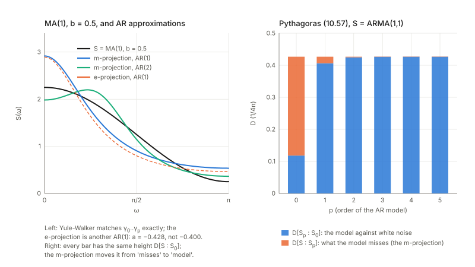
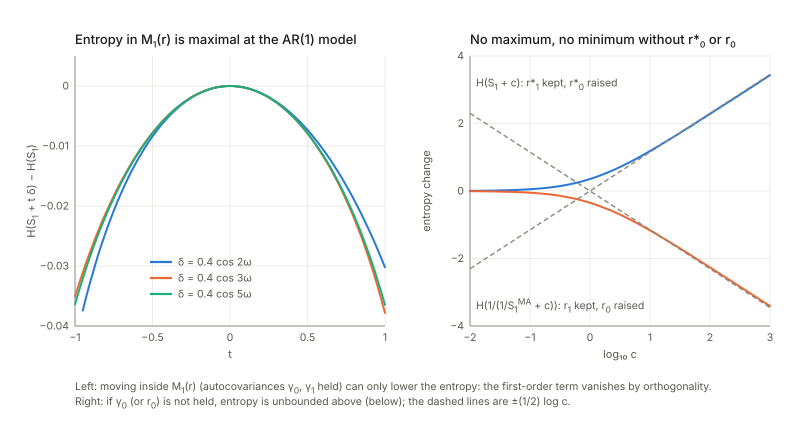

## Links

- **[Interactive companion](figures/interactive.html)**: eight widgets. (1) The two coordinate systems of a spectrum (autocovariances and inverse autocovariances) for AR(2), MA(2) and ARMA(1,1): which sequence stops, which never does. (2) The e-geodesic and the m-geodesic between two models, with the coordinates that must vanish along each. (3) Exact Toeplitz Kullback–Leibler and Fisher information of $n$ observations against the spectral formulas: the factors $2$ and $2\pi$ and a constant boundary term. (4) The m-projection onto AR($p$) of an MA(1), ARMA(1,1) or AR(2) spectrum: Yule–Walker, prediction error, Pythagorean bars, and the second (e-)projection at $p=1$. (5) Maximum entropy: perturbations that keep $r^*_0..r^*_p$, and the white noise that breaks the theorem as printed. (6) The singular line $a=b$ of ARMA(1,1), its Fisher determinant and cepstral image. (7) The edge of the stable region: finite distance, one finite and one infinite divergence. (8) The periodogram, whose relative spread does not shrink with the record length.
- **[Runnable checks](https://github.com/msrepo/information_geometry_notes/tree/main/chapters/ch10-linear-systems-and-time-series/code)**:
  `code/time_series_geometry.py` prints every number on this page and regenerates the figures with `python3 code/time_series_geometry.py --figures`; `make verify` runs it in about five seconds. Frequency integrals use a 4096-point grid (exact for the trigonometric polynomials involved); statements about finite records use exact Toeplitz covariance matrices; the few Monte Carlo runs have a fixed seed.
- The book: Amari, *Information Geometry and Its Applications* (Springer, 2016), DOI [10.1007/978-4-431-55978-8](https://doi.org/10.1007/978-4-431-55978-8). These notes cover Chapter 10 only; equation numbers such as (10.37) refer to the book.
  No text of the book is reproduced here; everything is restated and re-derived.
- Neighbouring chapters: **[Chapter 9: Neyman–Scott and semiparametrics](../ch09-neyman-scott-and-semiparametrics/index.html)** before, **[Chapter 11: machine learning](../ch11-machine-learning/index.html)** after. Dependencies: dual flatness, Pythagoras and projections from **[Chapter 1](../ch01-dually-flat-structure/index.html)**, exponential families from **[Chapter 2](../ch02-exponential-and-mixture-families/index.html)**, embedding curvature from **[Chapter 5](../ch05-elements-of-differential-geometry/index.html)** and the dual connections of **[Chapter 6](../ch06-dual-connections/index.html)**, curved exponential families from **[Chapter 7](../ch07-asymptotic-theory-of-inference/index.html)**; the singularity of ARMA(1,1) is taken up again in **[Chapter 12](../ch12-natural-gradient-and-singular-regions/index.html)**.
  Background on the annotations site: **[The Fisher information matrix](https://msrepo.github.io/theory_inclined_papers_with_annotations/fisher-information/)**.

## In one paragraph

A **stationary time series** is a sequence of random numbers whose statistics do not drift with time. Feed white noise (independent Gaussian numbers) into a stable linear filter and you get one, and the only thing about it that a Gaussian model can see is its **power spectrum** $S(\omega)$: the variance it carries at each frequency, slow wobbles at small $\omega$, fast ones near $\pi$. For a filter with transfer function $H$ it is $S=\lvert H\rvert^2$.
The chapter's observation is that the variances at different frequencies behave as independent Gaussian scale parameters, so the set $L$ of spectra is (formally) **one exponential family with a continuum of parameters**: natural parameter $\theta(\omega)=1/S(\omega)$, expectation parameter $\eta(\omega)=-S(\omega)/2$. All of Part I then applies with sums replaced by integrals over frequency: a potential $\tfrac12\int\log S$, a diagonal metric that is Euclidean in $\log S$, dual flatness for every $\alpha$.
The two affine coordinate systems are Fourier coefficients: those of $S$ are the **autocovariances** (m-coordinates), those of $1/S$ the **inverse autocovariances** (e-coordinates). An **autoregressive** model (AR) is exactly a family with finitely many non-zero inverse autocovariances, hence **e-flat**; a **moving-average** model (MA) has finitely many autocovariances, hence **m-flat**; ARMA models are neither and are singular where numerator and denominator of $H$ share a factor. The Pythagorean theorem of Chapter 1 then gives, with no further work, the Yule–Walker equations (m-projection onto AR($p$)), the maximum-entropy property of AR models and a dual minimum-entropy theorem for MA models.
I tested these claims against exact Gaussian covariance matrices of $n$ observations and against spectral integrals. The structure holds; several printed details do not: the divergence (10.37) is **twice** the Kullback–Leibler rate, the metric (10.36) is $2\pi$ times the Fisher information per observation, the pairing (10.43) is biorthogonal rather than $0$, the e-flatness of AR holds only in the infinite-length limit (its squared e-curvature falls like $1/n^2$) while MA is exactly m-flat at every length, Theorems 10.2 and 10.3 need the zeroth coefficient as a hypothesis, a sign in (10.63) contradicts (10.64), and the MA index in (10.18) is off by one.

## The spine of the argument

1. A stationary Gaussian series is a white-noise-driven linear system $x=H(z)\varepsilon$; its spectrum is $S=\lvert H(e^{i\omega})\rvert^2$, and with the minimum-phase convention $S$, $H$ and the series determine each other (§10.1).
2. AR, MA and ARMA models are the rational transfer functions $1/A$, $B$, $B/A$ in $z^{-1}$ (§10.2).
3. The Fourier coefficients of a long record are independent Gaussians with variances $S(\omega)$: an exponential family indexed by frequency, with $\theta=1/S$, $\eta=-S/2$, $\psi=\tfrac12\int\log S-\tfrac\pi2$, metric $\tfrac12S^2$ per frequency, Euclidean in $\log S$ (§10.3, (10.26)–(10.38)).
4. Autocovariances $r^*_t$ and inverse autocovariances $r_t$ are dual affine coordinates; $L$ is dually flat for every $\alpha$, with $\alpha$-coordinates $S^{-\alpha}$ (Theorem 10.1).
5. AR($p$) is the linear subspace $r_{p+1}=r_{p+2}=\dots=0$ (e-flat), MA($q$) the subspace $r^*_{q+1}=\dots=0$ (m-flat); ARMA is neither, and is not a manifold where a factor cancels (§10.3–§10.4).
6. Pythagoras: the **stochastic realisation** (Yule–Walker model) of a spectrum is its m-projection onto AR($p$); it maximises entropy among spectra with the same first autocovariances (Theorem 10.2). Dually the MA model matching the first inverse autocovariances minimises entropy (Theorem 10.3).
7. ARMA(1,1): along the line $a=b$ the model is white noise whatever $a$ is, so the model set is two sheets glued at one point (Figure 10.3).
8. Remarks: for a finite record AR is a curved exponential family (curvature falling like $1/T$); Gaussian input sees only minimum phase systems; Markov chains behave like AR models.

## Setup and notation

| Symbol | Meaning | In the running examples |
|---|---|---|
| $x_t$, $\varepsilon_t$ | the series; Gaussian white noise with $\mathbb E\varepsilon_t^2=1$ (10.1) | |
| $h_i$, $H(z)=\sum_ih_iz^{-i}$ | impulse response and transfer function (10.3)–(10.10) | ARMA(1,1): $h=(1,\,0.8,\,0.4,\,0.2,\dots)$ |
| $S(\omega)=\lvert H(e^{i\omega})\rvert^2$ | power spectrum (10.14) | AR(1): $S(0)=6.25$, $S(\pi)=0.3906$ |
| $e_0=1$, $e_t=2\cos t\omega$ | cosine basis (10.41) | |
| $r^*_t=\mathbb E[x_sx_{s-t}]$ | autocovariances; $S=\sum_tr^*_te_t$ (10.40)–(10.42); m-coordinates | AR(1): $1.5625,\,0.9375,\,0.5625,\dots$ |
| $r_t$ | inverse autocovariances, $1/S=\sum_tr_te_t$ (10.39); e-coordinates | AR(1): $1.36,\,-0.6,\,0,\,0$ |
| $\theta(\omega)=1/S$, $\eta(\omega)=-S/2$ | natural and expectation parameters (10.27)–(10.28) | |
| $\psi$, $\varphi$ | $\tfrac12\int\log S\,d\omega-\tfrac\pi2$ and $-\tfrac12\int\log S\,d\omega-\tfrac\pi2$ (10.30)–(10.31) | |
| $g(\omega,\omega')$ | $\tfrac12S^2(\omega)$ on the diagonal (10.34) | |
| $D$, KL | the divergence (10.37) *as printed*, and the Kullback–Leibler rate $D_{\rm KL}=\tfrac1{4\pi}\int(\dots)$ per observation | $D=2D_{\rm KL}$ |
| $H_S$ | entropy rate $\tfrac1{4\pi}\int\log S+\tfrac12\log(2\pi e)$ (10.38) | |
| AR($p$), $a=(a_0,\dots,a_p)$ | $H=1/\sum a_iz^{-i}$ (10.16); $a_0$ is the gain | |
| MA($q$), ARMA($p,q$) | (10.19), (10.22) | |
| $M_p(r)$, $S_p$ | spectra sharing $r^*_0..r^*_p$ with $S$; the AR($p$) member of $M_p(r)$ | |

**Conventions.** I use the book's sign in (10.64): $H(z)=\dfrac{1+bz^{-1}}{1+az^{-1}}$, i.e. $x_t=-a\,x_{t-1}+\varepsilon_t+b\,\varepsilon_{t-1}$, so $a=-0.6$ means $x_t=0.6\,x_{t-1}+\varepsilon_t$. Divergences, metrics and entropies are quoted **per observation** (the $\tfrac1{4\pi}$ normalisation, justified in §3.2) unless I write "as printed". $\gamma_t$ and $r^*_t$ are the same thing.

**Running examples.** AR(1) with $a=-0.6$ (the free-gain family $s/\lvert1+ae^{-i\omega}\rvert^2$ is the book's AR(1), with $a_0=1/\sqrt s$); MA(1) with $b=0.5$; ARMA(1,1) with $(a,b)=(-0.5,\,0.3)$; AR(2) and MA(2) pairs for geodesics. AR(1) and MA(1) are the workhorses (closed forms for curvature, projections and the boundary), ARMA(1,1) is the test case for singularities and curvature, and the AR(2)/MA(2) pairs show the geodesics. A *tiny example* to hold on to, AR(1) with $a=-0.6$: $S(\omega)=1/(1.36-1.2\cos\omega)$, so $S(0)=6.25$, $S(\pi/2)=0.7353$, $S(\pi)=0.3906$ (slow wobbles carry sixteen times the variance of the fastest ones); $\gamma_0..\gamma_3=1.5625,\,0.9375,\,0.5625,\,0.3375$ (each $0.6$ times the last); and the inverse spectrum is the trigonometric polynomial $1.36-1.2\cos\omega$, so $r=(1.36,\,-0.6,\,0,\,0)$: it stops at lag 1, while $\gamma_t$ never does. For the MA(1) with $b=0.5$ it is the other way round: $S(0)=2.25$, $S(\pi)=0.25$, $\gamma=(1.25,\,0.5,\,0,\,0)$, and $r_0..r_3=1.3333,\,-0.6667,\,0.3333,\,-0.1667$.

## 1. Time series, linear systems and spectra (§10.1)

**In plain words.** A time series is a list of random numbers indexed by time. It is *stationary* if shifting the clock changes none of its statistics, and *ergodic* if averaging one long record over time gives the same answer as averaging over the randomness (10.2). White noise is the simplest series. A *linear system* (filter) makes a coloured series out of it by taking a weighted sum of the present and past noise, $x_t=\sum_{i\ge0}h_i\varepsilon_{t-i}$ (10.3); the weights are the *impulse response* (the output for a single pulse of noise), and writing the delay as $z^{-1}$ gives $x=H(z)\varepsilon$ with the *transfer function* $H(z)=\sum h_iz^{-i}$. The variance of $x_t$ is $\sum h_i^2$, finite by (10.5)–(10.6).

**The spectrum.** Cutting a record into its frequencies, the variance carried at frequency $\omega$ is $S(\omega)=\lvert H(e^{i\omega})\rvert^2$ (10.14). Its cosine coefficients are the autocovariances: in the basis (10.41), $S=\sum_tr^*_te_t$ with $r^*_t=\mathbb E[x_sx_{s-t}]$ (10.40)–(10.42), so $\tfrac1{2\pi}\int S\,d\omega=r^*_0$ (the variance; not $\int S$). Check on ARMA(1,1) $(-0.5,0.3)$: $\sum h_i^2=1.853333$ equals the closed form $(1+b^2-2ab)/(1-a^2)$ and $\tfrac1{2\pi}\int S$; the autocovariances from the impulse response and from the spectrum agree to $4.4\times10^{-16}$ ($1.853333,\,1.226667,\,0.613333,\,0.306667$), and $S$ is rebuilt from $r^*_0..r^*_{200}$ with error $9.8\times10^{-15}$.

**Minimum phase.** Several filters share one spectrum: $\lvert1+be^{-i\omega}\rvert^2=b^2\lvert1+e^{-i\omega}/b\rvert^2$, so moving a zero of $H$ across the unit circle changes $H$ but not $S$ (up to a constant). Checked with $b=0.4$ and $1/b=2.5$: the spectra differ by exactly the factor $b^2$ (maximum deviation $7.1\times10^{-15}$). The book singles out the one with all zeros inside the unit circle (the printed page says $H(z)\neq0$ for $\lvert z\rvert>1$; a text extraction of it shows "$=0$") and $h_0>0$; its leading coefficient is $h_0=\exp\{\tfrac1{4\pi}\int\log S\,d\omega\}$ (Szegő), $1.0000$ for the ARMA above and $1.4142=\sqrt2$ for $2S$. The sign of $h_0$ is the only freedom left, a point the text passes over.
Why Gaussian noise cannot do better: the MA(1) filters $h=(1,0.4)$ (minimum phase) and $h=(0.4,1)$ (its reverse) give the *same* covariance matrix for 8 observations (difference exactly $0$), hence the same Gaussian likelihood. With skewed noise (centred exponential, $\kappa_3=2$) the third-order cumulant $\operatorname{cum}(x_t,x_t,x_{t+1})=\kappa_3\sum_ih_i^2h_{i+1}$ is $\kappa_3b=0.800$ for the first and $\kappa_3b^2=0.320$ for the second (simulated with $4\times10^6$ samples: $0.793$ and $0.316$). So the book's closing remark, that Gaussian input confines the study to minimum-phase systems and non-Gaussian input is needed to go beyond, is correct.

**A slip in (10.12) and in (10.25).** The text calls $S=\lvert X(\omega)\rvert^2$ a deterministic function. It is not: only its *mean* is. I simulated an AR(1) ($x_t=0.6x_{t-1}+\varepsilon_t$) and computed $I=\lvert\sum_tx_te^{-i\omega t}\rvert^2/n$ at the Fourier frequency $\pi/4$:

| $n$ | records | mean of $I/S$ | std of $I/S$ | corr of neighbouring ordinates | $\lvert\text{mean phase vector}\rvert$ | std of the average of 9 ordinates |
|---|---|---|---|---|---|---|
| 128 | 4000 | 1.0105 | 0.9808 | +0.0171 | 0.0045 | 0.3348 |
| 1024 | 4000 | 1.0064 | 1.0253 | +0.0225 | 0.0181 | 0.3394 |
| 8192 | 2000 | 0.9780 | 0.9901 | +0.0230 | 0.0143 | 0.3397 |

The mean is $S$ (this is what (10.28) really uses, $S=\mathbb E\lvert X\rvert^2$), but the spread relative to $S$ stays at $1$ however long the record: $I/S$ is asymptotically a unit exponential variable. Averaging nine neighbours gives about $1/3$, which is how spectra are estimated. Neighbouring ordinates are uncorrelated and the phase is uniform (resultant length of order $1/\sqrt R$), as (10.25) and the text say. But (10.25) as printed has an absolute value, $\mathbb E\lvert X(\omega)X(\omega')\rvert=0$ for $\omega'\neq\omega$, which is impossible for a non-negative quantity; the complex conjugate is meant, $\mathbb E[X(\omega)\overline{X(\omega')}]$. And for a real series $X(-\omega)=\overline{X(\omega)}$, so independence needs $\omega'\neq\pm\omega$.

**Why (10.13).** The condition $\int\lvert\log S\rvert^2d\omega<\infty$ is exactly what makes the norm (10.36) finite: $\log S$ is a point of a Hilbert space. It allows zeros of $S$ on the unit circle (e.g. $S=2+2\cos\omega$ has $\tfrac12\int(\log S)^2=\pi^3/3=10.3354$), which will matter in §4.6.

## 2. The three model families (§10.2)

**In plain words.** An AR($p$) series is a *regression on its own past*, $a_0x_t=-\sum_{i\ge1}a_ix_{t-i}+\varepsilon_t$, with transfer function $1/\sum a_iz^{-i}$ and $p+1$ parameters ($a_0$ is a gain, $1/\sqrt{\text{innovation variance}}$). An MA($q$) series is a *finite memory of the noise*, $x_t=\sum b_i\varepsilon_{t-i}$, with $S=\lvert\sum b_te^{i\omega t}\rvert^2$. ARMA($p,q$) is the quotient (10.22)–(10.23). All three are rational in $z^{-1}$.

Four details of the printed text do not hold as written; each is checked on the running examples.

- **MA index (10.18)–(10.20).** The sum starts at $i=1$. Then $b=(0.5,-0.4,0.3)$ ("MA(3)") has autocovariances $0.5,\,-0.32,\,0.15,\,0,\,0$: the lag-3 autocovariance is already $0$, so it is a delayed MA(2) with three parameters, while the later description of MA($q$) by the $q+1$ coordinates $r^*_0..r^*_q$ (10.52)–(10.53) needs $b_0$ too, as AR($p$) has $a_0$. The sum should start at $i=0$.
- **ARMA recursion (10.21).** The sum $-\sum_{i=0}^pa_ix_{t-i}$ contains $-a_0x_t$ on the right-hand side. For $p=q=1$, $(a_0,a_1,b_1)=(1,-0.5,0.3)$ its impulse response is $0,\,0.15,\,0.0375,\,0.0094,\dots$, while the transfer function (10.22) has $0,\,0.3,\,0.15,\,0.075,\dots$. The sum should start at $i=1$ with $a_0x_t$ moved to the left.
- **Sign in (10.63) against (10.64).** $x_t=ax_{t-1}+\varepsilon_t+b\varepsilon_{t-1}$ has $H=(1+bz^{-1})/(1-az^{-1})$, not the printed $(1+bz^{-1})/(1+az^{-1})$. At $(a,b)=(-0.5,0.3)$ the impulse responses are $1,\,-0.2,\,0.1,\dots$ against $1,\,0.8,\,0.4,\dots$. The cancellation that the text puts on the diagonal $a=b$ (and Figure 10.3 draws there) holds for (10.64); for (10.63) it is on $a=-b$: at $a=b=0.4$ the (10.64) response is $1,0,0,0$ and the (10.63) one is $1,\,0.8,\,0.32,\,0.128$. I use (10.64).
- **The condition $\lvert b\rvert<1$ is not stability.** The text attributes both $\lvert a\rvert<1$ and $\lvert b\rvert<1$ to stability. Stability needs only $\lvert a\rvert<1$. The condition $\lvert b\rvert<1$ is *minimum phase* (invertibility): $b=2.5$ gives a stable system with the same spectrum as $b=0.4$ up to a gain (§1). So the parameter square $\lvert a\rvert,\lvert b\rvert<1$ is a choice of representative of each spectrum, not a stability region.

Also, $(a_0..a_p,b_0..b_q)$ over-parametrise ARMA($p,q$) by one scale ($H$ is unchanged under $(a,b)\to(ca,cb)$), so the family has $p+q+1$ parameters, as AR($p$) has $p+1$ and MA($q$) has $q+1$. I did not check the continuous-time remark (10.24).

## 3. The dual geometry of the system manifold (§10.3)

### 3.1 The likelihood is an exponential family indexed by frequency

**In plain words.** Take the Fourier transform of a long record: you get one complex number per frequency, and (approximately) they are independent Gaussians with variance $S(\omega)$ each (10.25). So the likelihood factorises over frequencies. At a single frequency this is the Gaussian *scale* family $N(0,S)$: in exponential-family language the natural parameter is the precision $\theta=1/S$, the sufficient statistic is $-\lvert X\rvert^2/2$ and the expectation parameter is $\eta=-S/2$, and the whole spectrum is the product (10.26)–(10.29). (The integral in (10.26) runs over $[-\pi,\pi]$ and so counts each frequency twice, because $X(-\omega)=\overline{X(\omega)}$; the factor $\tfrac12$ compensates, and what is written is the density of independent complex Gaussians with variance $S(\omega)$ on $(0,\pi)$.) Dual flatness for every $\alpha$ is then close to a triviality: a product of one-dimensional families is flat in any $\alpha$-structure. The content is in what the coordinates are.

**Is "$\approx$" in (10.26) good?** Compare the exact Gaussian log-likelihood of $n$ observations of an AR(1) ($\phi=0.6$) with the spectral form $-\tfrac12\sum_j[\log S(\omega_j)+I(\omega_j)/S(\omega_j)]$ over the Fourier frequencies (2000 simulated records per $n$):

| $n$ | mean (exact − spectral) | sd (exact − spectral) | sd of the exact log-likelihood |
|---|---|---|---|
| 32 | +0.3017 | 1.0214 | 4.04 |
| 128 | +0.3624 | 1.0873 | 8.14 |
| 512 | +0.3546 | 1.0961 | 16.00 |

The difference is of order $1$ while the log-likelihood fluctuates like $\sqrt n$: the approximation error is a boundary term. For a **periodic** (circulant) series of period $n$ the spectral form is not an approximation at all: every Fourier frequency is an independent Gaussian with variance $S(\omega_k)$. Checked at $n=64$: the Kullback–Leibler divergence of two circulant models computed from the $64\times64$ matrices is $9.092267$, the same to all printed digits as $\tfrac12\sum_k(S_1/S_2-1-\log S_1/S_2)$, and the Fisher information for $a$ is $100.000000$ both ways ($=n/(1-a^2)$). So **the book's $L$ is exactly the manifold of circulant Gaussian series in the limit of large period**, and everything below is exact there; for ordinary (Toeplitz) records it holds up to boundary terms, which I quantify in §3.5.

### 3.2 Potentials, metric, divergence, entropy

**In plain words.** Once the spectrum is an exponential family, Part I hands over its standard objects: a potential, a metric (how well data can tell two nearby spectra apart), a divergence (how surprising data from one spectrum look under another) and an entropy (the unpredictability per time step). The only open question is the *scale*: per how long a record? The numbers below settle that.

With $\theta=1/S$ the cumulant function is $\psi=-\tfrac12\int\log\theta\,d\omega-\tfrac\pi2=\tfrac12\int\log S\,d\omega-\tfrac\pi2$, its Legendre dual is $\varphi=-\tfrac12\int\log S\,d\omega-\tfrac\pi2$, and (10.32) holds: for $S=2\times$ARMA(1,1) I get $\psi=0.606790$, $\varphi=-3.748382$, $\int\theta\eta\,d\omega=-\pi$ and $\psi+\varphi-\int\theta\eta\,d\omega=0$. **A sign slip in (10.30):** its *first* expression, $\tfrac12\int\log\{-\theta\}$, is not even real for $\theta=1/S>0$, and its real part would be $-2.177586=-\tfrac12\int\log S$, opposite to the second expression ($+2.177586$). The first form should read $-\tfrac12\int\log\theta\,d\omega-\tfrac\pi2$ (or $-\tfrac12\int\log\{-\theta\}$ if $\theta=-1/S$ is used); (10.31) and the second forms are right.

**A closed-form two-dimensional example.** The free-gain AR(1) family is the cone $r_0>2\lvert r_1\rvert$ in the plane $(r_0,r_1)=(a_0^2+a_1^2,\,a_0a_1)$ (its boundary is the unit root $\lvert a\rvert=1$), and there the potential is explicit:
$$\psi(r_0,r_1)=-\pi\log\frac{r_0+\sqrt{r_0^2-4r_1^2}}{2}-\frac\pi2 .$$
At $a=-0.6$, innovation variance $s=2$, i.e. $(r_0,r_1)=(0.68,-0.30)$: $\psi=0.606790$ in closed form and by quadrature; the gradient is $(-9.817477,\,-11.780973)=(-\pi\gamma_0,-2\pi\gamma_1)$, so the expectation coordinates $\eta_t=\int e_t\eta\,d\omega$ are $-\pi$ ($t=0$) and $-2\pi$ ($t\ge1$) times the autocovariances (that is the factor in (10.43), see 3.3); the Hessian $\left[\begin{smallmatrix}65.194&115.049\\115.049&221.507\end{smallmatrix}\right]$ equals $\tfrac12\int S^2e_te_s\,d\omega$, the metric (10.34) in the $r$-chart; and $\gamma_0=1/\sqrt{r_0^2-4r_1^2}=3.125000=s/(1-a^2)$.

**The metric (10.34)–(10.36) is Euclidean in $\log S$** ($\tfrac12S^2(\delta\theta)^2=\tfrac12(\delta\log S)^2$ per frequency), so $L$ is flat for the Levi-Civita connection and the $\alpha=0$ geodesic between two spectra is the geometric mean $S_1^{1-t}S_2^t$.

**Three normalisations, none of them "per observation" except one.** I computed the exact quantities for Gaussian records of $n$ observations (Toeplitz covariance matrices) and divided by $n$.

*Divergence.* $S_1$ = ARMA(1,1) $(-0.5,0.3)$, $S_2$ = AR(1) $(a=-0.3)$. The printed (10.37), $\tfrac1{2\pi}\int(S_1/S_2-1-\log S_1/S_2)\,d\omega$, is $0.284133$; with $\tfrac1{4\pi}$ it is $0.142067$.

| $n$ | 8 | 16 | 64 | 256 | 512 |
|---|---|---|---|---|---|
| exact KL of $n$ observations $/\,n$ | 0.131766 | 0.136916 | 0.140779 | 0.141745 | 0.141906 |
| twice that | 0.263533 | 0.273833 | 0.281558 | 0.283490 | 0.283811 |

KL per observation converges to $0.142067$: **(10.37) is twice the Kullback–Leibler rate**, and $n(\mathrm{KL}_n/n-0.142067)=-0.0824$ for every $n$ listed (a boundary term that does not grow). For two white noises with variances $s_1,s_2$, (10.37) gives $s_1/s_2-1-\log(s_1/s_2)$, twice the familiar $\tfrac12(\dots)$.

*Entropy.* $H_S=1.418939$ for the same $S_1$; the exact differential entropy of $n$ observations divided by $n$ exceeds it by $0.3308/n$ for every $n$ from 8 to 512. So **(10.38) is right**: the entropy rate per observation. It equals $\log h_0+\tfrac12\log(2\pi e)$ ($h_0=1.0000$ here), the entropy of a single innovation $h_0\varepsilon_t$: a stationary Gaussian series is exactly as unpredictable as its one-step prediction error (Kolmogorov–Szegő).

*Fisher information.* For ARMA(1,1) at $(a,b)=(-0.5,0.3)$ the per-observation Fisher information is $\tfrac1{4\pi}\int\partial_i\log S\,\partial_j\log S\,d\omega$, in closed form
$$G=\begin{bmatrix}\dfrac1{1-a^2}&-\dfrac1{1-ab}\\[2mm]-\dfrac1{1-ab}&\dfrac1{1-b^2}\end{bmatrix}=\begin{bmatrix}1.333333&-0.869565\\-0.869565&1.098901\end{bmatrix}$$
(the same by quadrature). The exact Fisher information of $n$ observations, divided by $n$, is $\left[\begin{smallmatrix}1.32304&-0.84779\\-0.84779&0.99695\end{smallmatrix}\right]$ at $n=16$, $\left[\begin{smallmatrix}1.33076&-0.86412\\-0.86412&1.07341\end{smallmatrix}\right]$ at $n=64$ and $\left[\begin{smallmatrix}1.33269&-0.8682\\-0.8682&1.09253\end{smallmatrix}\right]$ at $n=256$, and $n(I/n-G)=\left[\begin{smallmatrix}-0.1647&0.3484\\0.3484&-1.6313\end{smallmatrix}\right]$ for all three: again a constant. The book's metric (10.36) is $\tfrac12\int(\delta\log S)^2$, i.e. **$2\pi$ times the per-observation information** ($8.3776,\,-5.4636,\,6.9046$ here); the Hessian of (10.37) is twice it. In terms of record length, (10.36) is the information in $2\pi$ observations (Fourier frequencies spaced by exactly one), (10.37) is the divergence of $2$ observations and (10.38) the entropy of $1$. None of this affects any conclusion (they are constants), but the three cannot all be "per observation". That this metric is the statistically relevant one: for the AR(1) with $\phi=0.6$, $n=400$, $20000$ records, $n\operatorname{Var}(\hat\phi)=0.6473\pm0.0065$ against $1/g_{aa}=1-a^2=0.6400$.

### 3.3 Two coordinate systems, and the pairing (10.43)

**In plain words.** A spectrum can be summarised by a list of numbers in two dual ways: how strongly the series correlates with its own past at lag $t$ (the autocovariances), and the same quantity for the inverted spectrum $1/S$ (the inverse autocovariances). Each list is the dual basis of the other, which is what *biorthogonal* means below.

Expand $S=\sum_tr^*_te_t$ and $1/S=\sum_tr_te_t$. Examples, $t=0..6$ (a "0" is zero to rounding):

| system | $r_t$ (inverse autocovariances, e-coordinates) | $r^*_t$ (autocovariances, m-coordinates) |
|---|---|---|
| AR(2), $a=(1,-0.9,0.5)$ | 2.0600, −1.3500, 0.5000, 0, 0, 0, 0 | 2.0833, 1.2500, 0.0833, −0.5500, −0.5367, −0.2080, 0.0811 |
| MA(2), $b=(1,0.5,0.2)$ | 1.2605, −0.5252, 0.0105, 0.0998, −0.0520, 0.0060, 0.0074 | 1.2900, 0.6000, 0.2000, 0, 0, 0, 0 |
| ARMA(1,1), $(-0.5,0.3)$ | 1.7033, −1.0110, 0.3033, −0.0910, 0.0273, −0.0082, 0.0025 | 1.8533, 1.2267, 0.6133, 0.3067, 0.1533, 0.0767, 0.0383 |

For AR($p$), $1/S=\lvert\sum a_te^{i\omega t}\rvert^2$, so $r_t=\sum_sa_sa_{s+t}$ ($2.06,\,-1.35,\,0.5$ for AR(2)) and $r_t=0$ for $t>p$: the linear constraints (10.50). For MA($q$), $r^*_t=\sum_sb_sb_{s+t}$ and $r^*_t=0$ for $t>q$ (10.53). **In which coordinates is AR(2) flat?** In $r$, not in the coefficients $a$ (§3.5), and not in $r^*$ where its higher entries are non-zero though determined by the first three.

**(10.43) is false as printed.** It says the coordinate axes of $r_t$ and $r^*_s$ are orthogonal, $\langle e_t,e^*_s\rangle=0$, with no restriction on $t,s$. The tangent vector of the $r_t$ axis has $\delta\theta=e_t$; that of the $r^*_s$ axis has $\delta S=e_s$, i.e. $\delta\theta=-e_s/S^2$. With the metric (10.34),
$$\langle e_t,e^*_s\rangle=\tfrac12\int S^2\,e_t\bigl(-e_s/S^2\bigr)\,d\omega=-\tfrac12\int e_te_s\,d\omega,$$
which is independent of $S$: $-\pi$ for $t=s=0$, $-2\pi$ for $t=s\ge1$, and $0$ for $t\ne s$. The computed $4\times4$ block has diagonal $-3.1416,\,-6.2832,\,-6.2832,\,-6.2832$ and zeros elsewhere. The two axis systems are **biorthogonal** (dual bases, $\langle\partial_i,\partial^j\rangle=\delta_i^j$ up to the factors $-\pi,-2\pi$), as in every dually flat manifold. Orthogonality for all $t,s$ would make the metric degenerate. What the book then uses, that $r_s$ for $s>k$ is orthogonal to $r^*_1..r^*_k$, needs only $t\neq s$ and is right.

### 3.4 Theorem 10.1: every $\alpha$, and the $\alpha$-divergence

**In plain words.** The parameter $\alpha$ is a dial between two ways of averaging, the e-way ($\alpha=1$, mix the natural parameters) and the m-way ($\alpha=-1$, mix the expectation parameters); other settings mix an intermediate power of $S$. The theorem says that for time series every setting of the dial gives a flat geometry. The reason is that each frequency is a single scale parameter, and one dimension has no curvature to worry about.

The $\alpha$-connection of an exponential family has $\Gamma^{(\alpha)}_{ij,k}=\tfrac{1-\alpha}2T_{ijk}$ in $\theta$-coordinates (so $\alpha=1$ is the e-connection, flat in $\theta$). At one frequency ($\theta=1.7$): $g=\psi''=0.17301=1/(2\theta^2)$ and $T=\psi'''=-0.20356\approx-1/\theta^3$, so $\Gamma^{(\alpha)}{}_{\theta\theta}{}^\theta=(\alpha-1)/\theta$. An affine coordinate $\rho$ must have $\rho''/\rho'=\Gamma$; for $\rho=-\tfrac1\alpha S^{-\alpha}=-\tfrac1\alpha\theta^\alpha$, the representation (10.46), this holds:

| $\alpha$ | $-1$ | $-0.5$ | $0$ | $0.5$ | $1$ |
|---|---|---|---|---|---|
| $\Gamma^{(\alpha)}$ from $T$ and $g$ | −1.17657 | −0.88243 | −0.58829 | −0.29414 | 0 |
| $\rho''/\rho'$ | −1.17647 | −0.88235 | −0.58824 | −0.29412 | 0 |

So $S^{-\alpha}$ is $\alpha$-affine at each frequency, and so are its Fourier coefficients: $L$ is dually flat for every $\alpha$ because it is a product of one-dimensional scale families. This is why the book says $L$ is like the positive measures rather than a probability simplex (where only $\alpha=\pm1$ are flat). I checked it only at this one-frequency level, which is all the proof needs.
For the $\alpha$-divergence (10.45) between $S_1$ = ARMA(1,1) and $S_2$ = AR(1)$(-0.3)$: $\alpha=-1$ gives $0.284133$, the printed (10.37) exactly; $\alpha=+1$ gives $0.260208=\mathrm{KL}[S_2:S_1]$ in the printed normalisation; $\alpha=0$ gives $0.253141$ (and $0.253035$, $0.253251$ at $\alpha=\pm0.01$: continuous); $D^{(\alpha)}(S_1\Vert S_2)=D^{(-\alpha)}(S_2\Vert S_1)$ to $0$. For a small displacement $S_2=S_1e^{\epsilon h}$ all $\alpha$ give the same quadratic form $\tfrac1{4\pi}\int(\epsilon h)^2$ (ratios $1.0020,\,1.0010,\,1.0000,\,0.9990,\,0.9980$ for $\alpha=-1\ldots1$ at $\epsilon=0.02$): the metric induced by (10.45) is $\tfrac1\pi$ times the metric (10.36). The normalisations of Theorem 10.1 and of (10.34)–(10.36) differ by a factor $\pi$.

### 3.5 AR is e-flat, MA is m-flat: geodesics, coordinates, curvature

**In plain words, and a picture.** A straight line in the e-coordinates (the e-geodesic) mixes *inverse* spectra, $1/S_t=(1-t)/S_1+t/S_2$; a straight line in the m-coordinates mixes spectra, $S_t=(1-t)S_1+tS_2$. A family is e-flat if its e-geodesics stay in it.

**Numbers.** Between the AR(2) models $a=(1,-0.9,0.5)$ and $(1,0.4,0.3)$ (stable: largest root moduli $0.7071$, $0.5477$), at $t=0.5$ the e-geodesic has $r=(1.6550,\,-0.4150,\,0.4000,\,0,\,0,\dots)$ and stays in AR(2); the m-geodesic has $r=(0.7514,\,-0.2030,\,0.0738,\,-0.0044,\,0.0808,\,0.0191,\,-0.0177)$ and has left. Between the MA(2) models $b=(1,0.5,0.2)$ and $(1,-0.6,0.3)$ it is reversed: the m-geodesic has $r^*=(1.3700,\,-0.0900,\,0.2500,\,0,\dots)$, the e-geodesic $(0.7640,\,-0.0307,\,0.0044,\,0.0269,\,0.0462,\dots)$. For ARMA(1,1) a spectrum has $\gamma_{k+1}/\gamma_k=-a$ for all $k\ge2$; the two models $(-0.5,0.3)$ and $(0.6,-0.4)$ have ratios $0.5$ and $-0.6$, while the m-midpoint has ratios $-0.2201,\,-1.4631,\,-0.3050,\,-1.0835,\dots$ and the e-midpoint $-0.0298,\,3.4981,\,-0.0253,\,4.1203,\dots$: neither geodesic stays in ARMA(1,1). (Figure 1's pairs: AR(1) $P=(a=-0.6,s=1)$, $Q=(0.5,2)$, whose m-midpoint has $r_2=-0.149\ne0$, and MA(1) $P'=(0.5,1)$, $Q'=(-0.6,2)$, whose e-midpoint has $\gamma_2=-0.298\ne0$.)

**The coefficients are not affine, the inverse autocovariances are.** The e-midpoint of the two AR(2) models has coefficients $(a_0,a_1,a_2)=(1.21416,\,-0.26885,\,0.32945)$ (by Fejér–Riesz factorisation of $r_{\rm mid}$, error $4\times10^{-16}$), not the straight midpoint $(1,-0.25,0.4)$. The *Fejér–Riesz theorem* says every positive trigonometric polynomial $r_0+2\sum r_t\cos t\omega$ equals $\lvert\sum a_te^{i\omega t}\rvert^2$ for a unique stable $a$ with $a_0>0$, so the stable AR($p$) models with free gain are exactly the positive points of the linear space $r_{p+1}=\dots=0$: a **convex cone**, and mixing inverse spectra never leaves it. In the coefficients that fails: for $z^3+a_1z^2+a_2z+a_3$ with random stable roots, $464$ of $20000$ pairs have an *unstable* straight midpoint in $(a_1,a_2,a_3)$ (the worst case, $(-1.866,\,1.796,\,-0.82)$ and $(2.738,\,2.502,\,0.763)$, has the midpoint $(0.436,\,2.149,\,-0.028)$ with largest root modulus $1.4680$), while for $p=2$ it happens in $0$ of $20000$ (the stability region is a triangle), and along the e-geodesic all $1000$ of $1000$ midpoints are positive spectra with a stable AR(3) factor. So $r_t$ is the right chart for the stable AR family; the coefficients are not.

**Exactness and the finite record.** For the exact model of $n=200$ observations, mixing the two AR(2) *precision* matrices (an e-geodesic of the Gaussian family) keeps the precision matrix banded (largest entry beyond the second diagonal $1.3\times10^{-15}$) and in the middle of the record its covariance has the autocovariances of the spectral e-geodesic ($0.755160,\,0.131527,\,-0.175779,\,-0.074611$ both ways); but the diagonal is $1.147468,\,0.784343,\,0.784212,\,0.755566$ at $i=0,1,2,5$ against $0.755160$ in the bulk: the exact e-geodesic is not Toeplitz at the ends. The m-geodesic of Toeplitz matrices is exactly Toeplitz (a mixture of covariance matrices). So the Toeplitz family is **exactly m-flat and only asymptotically e-flat**.

**Curvature, quantified.** I computed the squared norms $\lvert H^e\rvert^2,\lvert H^m\rvert^2$ of the e- and m-embedding curvature (Chapter 5 §10; normal part of $\partial^2\theta$ resp. $\partial^2\eta$ in the Fisher metric, contracted with $g^{-1}g^{-1}$) per observation, for the free-gain families:

| family | parameter | $\lvert H^e\rvert^2$ | $\lvert H^m\rvert^2$ | $4/(1-a^2)$ or $4/(1-b^2)$ |
|---|---|---|---|---|
| AR(1) | $a=-0.6$ | $\sim10^{-13}$ | 6.2500 | 6.2500 |
| AR(1) | $a=0.3$ | $\sim10^{-14}$ | 4.3956 | 4.3956 |
| AR(1) | $a=0.8$ | $\sim10^{-12}$ | 11.1111 | 11.1111 |
| MA(1) | $b=0.5$ | 5.3333 | $\sim10^{-16}$ | 5.3333 |
| MA(1) | $b=-0.3$ | 4.3956 | $\sim10^{-15}$ | 4.3956 |
| MA(1) | $b=0.8$ | 11.1111 | $\sim10^{-16}$ | 11.1111 |
| ARMA(1,1) | $(a,b)=(-0.5,0.3)$ | 9.0831 | 11.0208 | |

So in the infinite-length limit **AR(1) is e-flat and not m-flat, MA(1) the reverse, ARMA(1,1) neither**, with the closed forms $\lvert H^m\rvert^2(\mathrm{AR})=\lvert H^e\rvert^2(\mathrm{MA})=4/(1-a^2)$ found numerically (not derived). If the gain is **pinned** ($a_0=1$, the one-parameter family $1/\lvert1+ae^{-i\omega}\rvert^2$, the dotted parabola $r_0=1+r_1^2$ in Figure 1) AR(1) is no longer e-flat: $\lvert H^e\rvert^2=2.0000$ for every $a$ tried ($-0.9,-0.6,0,0.3,0.8$) and $\lvert H^m\rvert^2=2+4/(1-a^2)$ ($23.0526,\,8.2500,\,6.0000,\,6.3956,\,13.1111$), and dually for MA(1): $\lvert H^m\rvert^2=2$, $\lvert H^e\rvert^2=2+4/(1-b^2)$ ($7.3333$ at $b=0.5$). The book's AR($p$) includes the gain $a_0$ and is e-flat; the usual statistician's model with a known innovation variance is not.
For the exact Toeplitz covariances of $n$ observations (inside the Gaussian family of all zero-mean covariances):

| $n$ | 10 | 20 | 40 | 80 | 160 |
|---|---|---|---|---|---|
| AR(1): $n^2\lvert H^e\rvert^2$ | 6.0209 | 7.7476 | 8.7142 | 9.2284 | 9.4940 |
| ratio $\lvert H^e\rvert^2(n/2)/\lvert H^e\rvert^2(n)$ | | 3.109 | 3.556 | 3.777 | 3.888 |
| AR(1): $n\,\lvert H^m\rvert^2$ | 4.6369 | 5.4119 | 5.8214 | 6.0331 | 6.1408 |
| MA(1): $n\,\lvert H^e\rvert^2$ | 5.9014 | 5.8695 | 5.6296 | 5.4858 | 5.4104 |
| MA(1): $\lvert H^m\rvert^2$ | $4\times10^{-32}$ | $3\times10^{-32}$ | $6\times10^{-33}$ | $3\times10^{-32}$ | $4\times10^{-32}$ |

($\phi=0.6$, $b=0.5$, gain $1$.) The m-curvature of MA(1) is zero at **every** length (the matrices $\gamma_0I+\gamma_1(J+J^{\mathsf T})$ form a linear space). The e-curvature of AR(1) is **not zero at finite length but falls like $1/n^2$ in squared norm**, ratio tending to $4$ per doubling, i.e. like $1/n$ in norm: the book's remark that AR is e-flat for a series of infinite length and a curved exponential family for a finite record, with curvature shrinking like $1/T$, is confirmed (for the norm; right panel of the figure in §3.2). For comparison, for $n$ i.i.d. observations from a curved family the metric scales with $n$ and $\theta''$ does not, so $\lvert H^e\rvert^2\sim1/n$ (Chapter 7); the AR(1) record is better by another factor $1/n$, because its likelihood is an exponential family in $(\sum x_t^2,\sum x_tx_{t-1})$ up to the single boundary statistic $x_1^2+x_n^2$. A second route gives the same number: treating the AR(1) likelihood as a $(3,2)$ curved exponential family with statistics $\sum_{t=2}^{n-1}x_t^2$, $\sum x_tx_{t-1}$, $x_1^2+x_n^2$, at $n=40$ I get $\lvert H^e\rvert^2=0.00544634$ against $0.00544635$ by the matrix computation.

## 4. AR, MA and ARMA models (§10.4)

### 4.1 The stochastic realisation is the m-projection onto AR($p$)

**In plain words.** Given a spectrum $S$ (say a long record's), which AR($p$) spectrum is "closest"? The book's answer: match the first autocovariances exactly and let the rest follow. In the geometry: the spectra sharing $r^*_0..r^*_p$ with $S$ form an m-flat set $M_p(r)$ (fixing $p+1$ m-coordinates), AR($p$) is e-flat with coordinates $r_0..r_p$, the two are biorthogonal by (10.43), so their intersection $S_p$ is the foot of the **m-projection** of $S$ onto AR($p$), and the Pythagorean theorem gives (10.57): $D[S{:}S_0]=D[S{:}S_p]+D[S_p{:}S_0]$ for any $S_0$ in AR($p$), in particular white noise. The m-projection is what the time-series literature calls the **Yule–Walker** model, computed by the Levinson–Durbin recursion.

**Checks on $S$ = MA(1), $b=0.5$** ($\gamma_0,\gamma_1=1.25,\,0.5$; $\sigma_\infty^2=\exp\{\tfrac1{2\pi}\int\log S\}=1.0000$). Writing $\sigma_p^2$ for the prediction error variance of the order-$p$ model:

| $p$ | $a_1..a_p$ | $\sigma_p^2$ | $\dfrac{1-b^{2p+4}}{1-b^{2p+2}}$ | $D_{\rm KL}[S{:}S_p]$ | $\tfrac12\log(\sigma_p^2/\sigma_\infty^2)$ |
|---|---|---|---|---|---|
| 0 | – | 1.250000 | 1.250000 | 0.111572 | 0.111572 |
| 1 | −0.4000 | 1.050000 | 1.050000 | 0.024395 | 0.024395 |
| 2 | −0.4762, 0.1905 | 1.011905 | 1.011905 | 0.005917 | 0.005917 |
| 3 | −0.4941, 0.2353, −0.0941 | 1.002941 | 1.002941 | 0.001468 | 0.001468 |
| 4 | −0.4985, 0.2463, −0.1173 | 1.000733 | 1.000733 | 0.000366 | 0.000366 |

The divergence of the m-projection is $\tfrac12\log(\sigma_p^2/\sigma_\infty^2)$, the log-ratio of the order-$p$ and infinite-order prediction error variances: a different route (prediction theory) to the same numbers (the last two columns agree to the digits shown). The first autocovariances match: $\gamma_0..\gamma_p$ of $S_p$ equal those of $S$ to $\le4.4\times10^{-16}$. The closed form $\sigma_p^2=(1-b^{2p+4})/(1-b^{2p+2})$ reproduces Levinson–Durbin to the digits shown for every $p$ listed (I found it by pattern and checked it, I did not derive it). Brute force, a derivative-free minimisation of $D[S{:}S']$ over stable AR($p$) models (Nelder–Mead on reflection coefficients) lands on the Yule–Walker coefficients to $\le1.1\times10^{-8}$ for $p=1,2$ on MA(1) and on ARMA(1,1), and its minimal value of $\operatorname{mean}(S\lvert A\rvert^2)$ equals $\sigma_p^2$: **the m-projection is the best linear predictor** ($1.05000000$ and $1.01190476$ for the MA(1), $p=1,2$).
Pythagoras, $S$ = MA(1), $S_0$ = white noise, $D[S{:}S_0]=0.125000$: $p=0$: $0.111572+0.013428$; $p=1$: $0.024395+0.100605$; $p=2$: $0.005917+0.119083$; $p=3$: $0.001468+0.123532$; $p=4$: $0.000366+0.124634$, each sum $0.125000$. For $S$ = ARMA(1,1) with $D[S{:}S_0]=0.426667$: $p=1$: $0.020302+0.406365$, $p=2$: $0.001787+0.424879$, $p=3$: $0.000161+0.426506$, and the identity holds to $\le7.1\times10^{-15}$ for white noise and for five random stable AR($p$) models $S_0$ each (it holds for every $S_0$ in the e-flat family).

**Notation slips in the paragraph before (10.57).** The text uses $r$ where the autocovariances $r^*$ are meant, says that the higher autocorrelations of the AR($p$) system vanish right after saying they do not, and defines $M_p(r)$ by $r^*_1..r^*_p$. Numerically: the stochastic realisation of the MA(1) has $\gamma_0..\gamma_5=1.2500,\,0.5000,\,0.2000,\,0.0800,\,0.0320,\,0.0128$ (equal to the MA(1)'s $1.25,\,0.5,\,0,0,0,0$ up to lag 1, then geometric) and **inverse** autocovariances $r_0..r_4=1.1048,\,-0.3810,\,0,0,0$ (the MA(1)'s are $1.3333,\,-0.6667,\,0.3333,\,-0.1667,\,0.0833$). It is the inverse autocovariances of an AR($p$) that vanish beyond lag $p$. And $M_p(r)$ must fix **$r^*_0$ as well** (the variance): AR($p$) has $p+1$ coordinates, and the foot of the projection is determined by $p+1$ numbers.

### 4.2 Theorem 10.2 (maximum entropy), and what it needs

**In plain words.** Of all spectra that agree with the data on the first $p+1$ autocovariances, the AR($p$) one adds the least extra structure: it is the least predictable, the one of maximum entropy. The theorem says that this least committal completion is the m-projection.

The stochastic realisation maximises the entropy among all spectra with the same first autocovariances. Behind it is an identity that I checked and that is, I think, the shortest proof: for every $\tilde S\in M_p(r)$,
$$H(S_p)-H(\tilde S)=D_{\rm KL}[\tilde S{:}S_p],$$
because $\operatorname{mean}(\tilde S/S_p)=r_0\gamma_0+2\sum_{t\le p}r_t\gamma_t=1$ depends only on $\gamma_0..\gamma_p$ (all shared) and so the divergence is half the difference of $\operatorname{mean}\log$. Over 4000 random perturbations of $S_1$ (cosines of orders 2 to 7 added, which keeps $r^*_0,r^*_1$) the identity holds to $5.2\times10^{-17}$ (size up to 60% of $\min S_1$) and $4.1\times10^{-17}$ (5%); the largest entropy change is $-6.24\times10^{-4}$, resp. $-4.02\times10^{-6}$ (all negative), and the ratio to the second-order prediction $-\tfrac14\operatorname{mean}(\delta^2/S_1^2)$ is $1.0674$, resp. $1.0006$ (the first-order term vanishes by orthogonality). The entropy gap to $S$ itself is $0.111572,\,0.024395,\,0.005917,\,0.001468,\,0.000366$ for $p=0..4$ (Burg's argument: $\sigma_\infty^2\le\sigma_p^2$).

**The printed theorem omits a hypothesis.** It fixes $r=(r_1,\dots,r_p)$ only (the coordinates of AR($p$) in (10.49) are $r_0..r_p$). Without $r^*_0$ there is no maximum: adding white noise $c$ to $S_1$ keeps $r^*_1$ and raises the entropy by $0.3549,\,1.1847,\,2.2844,\,3.4301$ for $c=1,10,100,1000$ (against $\tfrac12\log c=0,\,1.1513,\,2.3026,\,3.4539$). The same happens if the printed $r_1..r_p$ are read as normalised correlations: $S\to cS$ keeps them and raises the entropy by exactly $\tfrac12\log c$. The proof itself uses the constant $c_0$ in (10.58), which is $r^*_0$. (10.58) holds exactly as printed with $c_0=r^*_0$ (both sides equal $0.250000$ for the MA(1) and $0.853333$ for ARMA(1,1)); it is consistent with (10.37) and (10.38) as printed, which is why its factor is $-2H_S$.

### 4.3 The MA side: dual realisation, Theorem 10.3, and a factor 2

**In plain words.** The same game played with inverse autocovariances picks the MA model, the most structured completion (minimum entropy).

For an MA model the roles of $r$ and $r^*$ swap. The **dual stochastic realisation** $S^{\rm MA}_q$ of $S$ is the MA($q$) spectrum with the same *inverse* autocovariances $r_0..r_q$; the printed text says "AR($q$)" and writes $r^*$ for them (twice), and Theorem 10.3 lists $r^*_1..r^*_q$ (again without the zeroth). It equals the reciprocal of the AR($q$) Yule–Walker fit of $1/S$. For $S$ = AR(1), $a=-0.6$ ($r=1.36,\,-0.6,\,0,\dots$), the MA(1) dual realisation is $s'\lvert1+b'e^{-i\omega}\rvert^2$ with $b'=0.4412$, $s'=0.9130$; it matches $r_0,r_1=1.3600,\,-0.6000$ exactly (it cannot match $\gamma_1/\gamma_0=0.6$: an MA(1) has at most $\tfrac12$).

| $q$ | 0 | 1 | 2 | 3 | 4 |
|---|---|---|---|---|---|
| $D_{\rm KL}[S_q^{\rm MA}{:}S]$ | 0.153742 | 0.045511 | 0.015420 | 0.005437 | 0.001943 |
| $\tfrac12\log\dfrac{1-a^{2q+4}}{1-a^{2q+2}}$ | 0.153742 | 0.045511 | 0.015420 | 0.005437 | 0.001943 |

The first-row values are the divergences $D[S^{\rm MA}_q{:}S]$ computed from the spectra; the second is the same closed form as in §4.1 applied to $1/S$, which is a first-order spectrum $\lvert1+ae^{-i\omega}\rvert^2$ of MA type. The matching $r_0..r_q$ agree to $\le4.4\times10^{-16}$ and the autocovariances of $S_q^{\rm MA}$ beyond lag $q$ vanish to $\le5.5\times10^{-17}$. The Pythagorean theorem (10.61) holds, $D[S_0{:}S]=0.180000=0.134489+0.045511$ (violation $6.9\times10^{-17}$): the e-projection onto the m-flat MA($q$).
**Theorem 10.3** (minimum entropy) has the dual identity $H(\tilde S)-H(S^{\rm MA}_q)=D_{\rm KL}[S^{\rm MA}_q{:}\tilde S]$ for every $\tilde S$ with the same $r_0..r_q$ (violation $\le6.7\times10^{-17}$ over 4000 random perturbations; the smallest entropy increase is $1.01\times10^{-10}$, positive), and it too needs the zeroth coefficient: adding $c$ to $1/S_1$ keeps $r_1$ and changes the entropy by $-0.3491,\,-1.1679,\,-2.2638,\,-3.4090$ for $c=1,10,100,1000$, without bound.
**(10.62) has the wrong factor.** It says $D[S_0{:}S]=H_S+\text{const}$. With the printed (10.37), $D[S_0{:}S]=r_0-1+\tfrac1{2\pi}\int\log S=2H_S+r_0-1-\log(2\pi e)$, consistent with the $-2H_S$ of (10.58)–(10.59). On the AR(1)-type family with fixed $r_0=1.36$ and $r_1=-0.6,\,-0.3,\,0,\,0.3,\,0.6$: $D-2H_S=-2.477877$ for all five, while $D-H_S=-1.058939,\,-1.186355,\,-1.212681,\,-1.186355,\,-1.058939$ varies. The conclusion of the theorem is unaffected. (With the true Kullback–Leibler rate the factor would be $1$ in (10.58)–(10.59) as well.) The book's closing comment on the section, that the Pythagorean relation is more fundamental than the maximum-entropy principle, is confirmed: the identities above are the Pythagorean relation.

### 4.4 The best AR(1) approximation of an MA(1), in each sense

The m-projection (minimising $D[S{:}S']$ over AR(1)) is Yule–Walker, $a=-b/(1+b^2)=-0.400000$, $s=1.050000$. The **e-projection** (minimising $D[S'{:}S]$) is a different model: $a=-0.428007$, $s=0.946197$, the root in $(-1,0)$ of $b^2a^3+ba^2-a-b=0$ (found independently by golden-section search and as a root, $-0.428007$). Each wins in its own divergence: $D[S{:}S_m]=0.024395\le D[S{:}S_e]=0.027719$ and $D[S_e{:}S]=0.027652\le D[S_m{:}S]=0.031160$. Pythagoras holds for the m-projection onto the e-flat AR(1), $D[S{:}S_0]=0.125000=D[S{:}S_m]+D[S_m{:}S_0]$, and **fails for the e-projection onto AR(1)**, which is not m-flat: $D[S_0{:}S]=0.166667$ against $D[S_0{:}S_e]+D[S_e{:}S]=0.125234$. Onto AR(2) the two projections are $(-0.47619,\,0.19048)$ and $(-0.48622,\,0.19711)$.

### 4.5 ARMA: neither flat, and singular

**In plain words.** If numerator and denominator of $H$ share a factor, that factor does nothing, so the model has a redundant parameter: a whole line of parameter values describes one spectrum. The Fisher metric then degenerates along that line, because a direction that changes nothing carries no information.

ARMA(1,1) is neither e-flat nor m-flat ($\lvert H^e\rvert^2=9.0831$, $\lvert H^m\rvert^2=11.0208$ at $(-0.5,0.3)$, §3.5), and it is not a manifold. On the diagonal $a=b$ the transfer function is $H=1$ whatever $a$ is: $\partial_a\log S+\partial_b\log S=0$ there. The per-observation Fisher determinant is
$$\det G=\frac{(a-b)^2}{(1-a^2)(1-b^2)(1-ab)^2},$$
verified against quadrature and against exact finite-$n$ information. At $a=-0.5$, $b=a+\epsilon$:

| $\epsilon$ | 0.8 | 0.4 | 0.1 | 0.02 | 0 |
|---|---|---|---|---|---|
| $\det G$ | 0.70905780 | 0.23876811 | 0.02480159 | 0.00119979 | 0 |
| smallest eigenvalue | 0.338687 | 0.106751 | 0.009866 | 0.000456 | 0 |
| exact, $n=64$: $\det(I/n)$ | 0.68174994 | 0.22957206 | 0.02342304 | 0.00112272 | 0 |

(at $\epsilon=0$ the matrix is singular with kernel $(1,1)$; $\det G/\epsilon^2$ tends to $1/(1-a^2)^4=3.1605$ as $\epsilon\to0$.) The same happens for **any** common factor: for ARMA(2,2) with $A=(1+0.5w)(1-0.3w)=1+0.2w-0.15w^2$ and $B=(1+0.5w)(1+0.4w)=1+0.9w+0.2w^2$ the $4\times4$ Fisher information has eigenvalues $0,\,0.249627,\,1.365855,\,5.312373$, and its null vector is $(0.6667,-0.2000,0.6667,0.2667)$, exactly the direction $(1,-0.3,1,0.4)$ (normalised) that moves the common factor in numerator and denominator together.

**The two sheets.** $h_1=b-a$ is the sign that separates the triangles $b>a$ and $b<a$ (Brockett's disjoint components, for degree one). The cepstrum, the Fourier coefficients of $\log S=\sum_k2(-1)^{k+1}(b^k-a^k)\cos(k\omega)/k$, gives Euclidean coordinates for (10.36): $c_1=2(b-a)$, $c_2=a^2-b^2$, with Jacobian $4(b-a)$ (at $(-0.5,0.3)$: $c=(1.6000,\,0.1600)$, Jacobian $3.2000$, matching the numerical cepstrum). The whole diagonal maps to the origin (white noise), each triangle to a half-plane. The distance from white noise is $d^2=\tfrac12\int(\log S)^2=2\pi[\mathrm{Li}_2(a^2)+\mathrm{Li}_2(b^2)-2\mathrm{Li}_2(ab)]=4.079077$ here (numerically $4.079077$), and $d\approx\epsilon\sqrt{2\pi/(1-a^2)}$ near the diagonal ($0.028849$ against $0.028944$ at $\epsilon=0.01$). The directions in which $S$ leaves white noise, $f_a=\partial_b\log S\vert_{b=a}$, have normalised inner products $\sqrt{(1-a^2)(1-a'^2)}/(1-aa')$: for $a=-0.8,-0.4,0,0.4,0.8$ their Gram matrix has smallest eigenvalue $0.0056>0$, so five directions are independent (those of $a=\pm0.5$ are $53.13^\circ$ apart). So near white noise the model set is a **cone over a curve**, not a smooth surface: a genuine singular point, as Figure 10.3 draws it.

### 4.6 The boundary of the stable region

**In plain words.** Push an AR model towards a unit root and its series stops being stationary; push an MA model towards $\lvert b\rvert=1$ and it stops being invertible (its spectrum touches zero). What does the geometry do at that edge?

For AR(1), $x_t=\phi x_{t-1}+\varepsilon_t$ ($a=-\phi$): the Fisher information per observation $1/(1-\phi^2)$ diverges at the unit root but the Fisher arc length from $0$ is $\arcsin\phi\to\pi/2$ (the whole interval has length $\pi$), so the boundary is at **finite distance**. The divergence is finite one way and infinite the other:

| $\phi$ | 0.5 | 0.9 | 0.99 | 0.999 |
|---|---|---|---|---|
| $g=1/(1-\phi^2)$ | 1.3333 | 5.2632 | 50.2513 | 500.2501 |
| $\arcsin\phi$ | 0.5236 | 1.1198 | 1.4293 | 1.5261 |
| $D_{\rm KL}[\text{white}{:}\text{AR}]=\phi^2/2$ | 0.12500 | 0.40500 | 0.49005 | 0.49900 |
| $D_{\rm KL}[\text{AR}{:}\text{white}]=\phi^2/(2(1-\phi^2))$ | 0.1667 | 2.1316 | 24.6256 | 249.6251 |

(each closed form agrees with quadrature to the printed digits). For MA(1) with $b\to1$ the spectrum acquires a zero at $\omega=\pi$, $1/S$ stops being integrable, and the **e-coordinates blow up while the m-coordinates and $\int(\log S)^2$ stay finite**: $r_0=1/(1-b^2)=1.3333,\,5.2632,\,50.2513,\,500.2501$ for $b=0.5,\,0.9,\,0.99,\,0.999$ while $\gamma_0=1+b^2=1.2500,\,1.8100,\,1.9801,\,1.9980$ and $\tfrac12\int(\log S)^2=2\pi\mathrm{Li}_2(b^2)=1.6817,\,6.8807,\,9.7151,\,10.2447\to\pi^3/3=10.3354$. So (10.13) holds at the edge but the e-chart does not exist there: the $r_t$ are linear functions of $\theta(\omega)$ only if $1/S\in L^1$, which (10.13) does not give. The cone picture of Figure 1 is the same fact: the e-geodesics reach the boundary of the AR cone in finite parameter time.

## 5. The remarks that end the chapter (end of §10.4)

The remarks restate three things already tested: **Gaussian input sees only minimum phase** (§1: same likelihood, different third cumulant); **AR is e-flat for infinite series and a curved exponential family for a finite record**, curvature $\sim1/T$ (§3.5: norm of the e-curvature of the exact AR(1) likelihood $\sim1/n$); and **ARMA singularities** (§4.5, with the $a=b$ line, Brockett's components and any common factor).

**Markov chains.** The last remark says a Markov chain is an exponential family, curved when observed on $0\le t\le T$ because of the initial and final values, with e-curvature of order $1/T$. I tested it on a two-state chain ($P(0\to1)=\alpha$, $P(1\to0)=\beta$). Every such chain of length $T+1$ (any initial law, any transition matrix) lies in the 4-dimensional exponential family with statistics $(x_0,N_{01},N_{10},N_{11})$, the initial state and the transition counts, and enumerating all $2^{T+1}$ sequences gives its Fisher metric exactly. The squared e-embedding curvature of the stationary-start family ($(\alpha,\beta)=(0.3,0.4)$) and of the family with a free initial law ($(\pi_1,\alpha,\beta)=(0.43,0.3,0.4)$):

| $T$ | 4 | 8 | 12 | 16 | 18 |
|---|---|---|---|---|---|
| stationary start: $\lvert H^e\rvert^2$ | 0.1371 | 0.06755 | 0.03756 | 0.02363 | 0.01938 |
| stationary start: $T^2\lvert H^e\rvert^2$ | 2.1940 | 4.3232 | 5.4082 | 6.0495 | 6.2804 |
| free initial law: $T^2\lvert H^e\rvert^2$ | 2.3074 | 3.2634 | 3.5927 | 3.7574 | 3.8123 |

$T^2\lvert H^e\rvert^2$ rises and levels off (its increments shrink steadily), so $\lvert H^e\rvert^2\sim1/T^2$ and the curvature itself falls like $1/T$, as the book says: the same behaviour as the AR(1) record, presumably for the same reason (the boundary statistics carry $O(1)$ information against $O(T)$ for the bulk), at the one parameter point tried.

Not checked: the **multi-input multi-output** (Grassmannian) remark, the continuous-time version (10.24), and the quoted higher-order asymptotic theory of Amari–Nagaoka and Taniguchi and the estimator behaviour near singularities of Fukumizu–Kuriki.

## Checks of the book's statements

| Where | Statement | What I found |
|---|---|---|
| (10.6), (10.14), (10.40)–(10.42) | $S=\lvert H\rvert^2=\sum r^*_te_t$, $r^*_t=\mathbb E[x_sx_{s-t}]$ | verified: $\sum h_i^2=1.853333=\tfrac1{2\pi}\int S$; autocovariances agree to $4.4\times10^{-16}$; note $\tfrac1{2\pi}\int S=r^*_0$ |
| §10.1 | minimum-phase system unique | verified up to the sign of $h_0$ (not mentioned); $h_0=\exp\{\tfrac1{4\pi}\int\log S\}$ (Szegő); the printed "$H(z)=0$" is "$\neq0$" on the page |
| remark, §10.4 | Gaussian input sees only minimum phase | verified: same covariance matrix for $h=(1,0.4)$ and $(0.4,1)$; third cumulant $0.800$ against $0.320$ (simulated $0.793$, $0.316$) |
| (10.12), (10.25) | $S=\lvert X\rvert^2$ deterministic; $\mathbb E\lvert XX'\rvert$ | **not deterministic**: std of $I/S$ is $0.9808,\,1.0253,\,0.9901$ at $n=128,1024,8192$; **(10.25) needs a conjugate**, and independence only for $\omega'\neq\pm\omega$ |
| (10.18)–(10.20) | MA($q$) as $\sum_{i=1}^qb_i\varepsilon_{t-i}$ | **index off by one**: printed MA(3) has $r^*_3=0$ (a delayed MA(2)); the sum should start at $i=0$ |
| (10.21) | ARMA recursion | **index slip**: $-a_0x_t$ on the right; impulse response $0,0.15,0.0375$ against (10.22)'s $0,0.3,0.15$ |
| (10.63) against (10.64) | $x_t=ax_{t-1}+\dots$ and $H=(1+bz^{-1})/(1+az^{-1})$ | **sign mismatch**: (10.63) has $1-az^{-1}$; cancellation on $a=-b$ there, on $a=b$ for (10.64) |
| after (10.64) | $\lvert b\rvert<1$ attributed to stability | it is **minimum phase**; $b=2.5$ is stable and has the spectrum of $b=0.4$ up to a gain |
| (10.26) | $p(X;S)\approx\exp\{\dots\}$ | verified: exact minus spectral log-likelihood has sd $\approx1.02$–$1.10$ while the log-likelihood has sd $4.04,8.14,16.00$; **exact for circulant series** (KL $9.092267$ both ways) |
| (10.30) | $\psi=\tfrac12\int\log\{-\theta\}\,d\omega-\tfrac\pi2$ | **sign slip** in the first expression (should be $-\tfrac12\int\log\theta$); (10.31), (10.32) and the second forms verified ($\psi+\varphi-\int\theta\eta=0$) |
| (10.34)–(10.36) | metric $\tfrac12S^2$; Euclidean in $\log S$ | verified; it equals **$2\pi$ times** the Fisher information per observation (closed form $G$ for ARMA(1,1) verified against exact Toeplitz, $n(I/n-G)$ constant) |
| (10.37) | $\mathrm{KL}=D_{-1}=\tfrac1{2\pi}\int(\dots)$ | **twice the KL rate**: exact $\mathrm{KL}_n/n\to0.142067$, printed value $0.284133$ |
| (10.38) | entropy $\tfrac1{4\pi}\int\log S+\tfrac12\log(2\pi e)$ | verified (entropy per observation, error $0.3308/n$) |
| (10.43) | $\langle e_t,e^*_s\rangle=0$ | **false for $t=s$**: the pairing is $-\pi$ ($t=s=0$) and $-2\pi$ ($t=s\ge1$); biorthogonal; true for $t\ne s$ |
| Theorem 10.1, (10.45), (10.46) | $L$ dually flat for all $\alpha$; coordinates $S^{-\alpha}$ | verified at the one-frequency level ($\Gamma^{(\alpha)}=\rho''/\rho'$ to $10^{-4}$, finite-difference accuracy); $D^{(\alpha)}$ duality exact; its metric is $\tfrac1\pi$ times (10.36) |
| (10.49)–(10.51) | AR($p$) is e-flat (coordinates $r_t$) | verified: e-geodesics stay ($r_3..=0$), Fejér–Riesz cone; curvature $\lvert H^e\rvert^2\sim10^{-13}$ in the limit; **only for infinite length** ($\lvert H^e\rvert^2\sim1/n^2$ at finite $n$); not in the coefficients $a$ ($464/20000$ unstable midpoints for $p=3$) |
| (10.52)–(10.54) | MA($q$) is m-flat | verified, **exactly for every $n$** ($\lvert H^m\rvert^2\sim10^{-32}$); e-curvature $4/(1-b^2)=5.3333$ |
| §10.4, ARMA | neither e-flat nor m-flat; not a manifold | verified: $\lvert H^e\rvert^2=9.0831$, $\lvert H^m\rvert^2=11.0208$; $\det G\propto(a-b)^2$; cone over a curve; also ARMA(2,2) |
| paragraph before (10.57) | stochastic realisation; $M_p(r)$ | right idea; **notation mixes $r$ and $r^*$**, says the higher autocorrelations vanish (they do not: $0.2000,0.0800,\dots$), and $M_p(r)$ must include $r^*_0$ |
| (10.57) | Pythagoras for the m-projection onto AR($p$) | verified ($\le7.1\times10^{-15}$); $D_{\rm KL}[S{:}S_p]=\tfrac12\log(\sigma_p^2/\sigma_\infty^2)$ exactly; equals Yule–Walker (Nelder–Mead agrees to $1.1\times10^{-8}$) |
| Theorem 10.2, (10.58)–(10.59) | maximum entropy for $r_1..r_p$ | true **with $r^*_0$ fixed**; as printed **no maximum** (entropy $+3.4301$ at $c=1000$); exact identity $H(S_p)-H(\tilde S)=D_{\rm KL}[\tilde S{:}S_p]$; (10.58) verified with $c_0=r^*_0$ |
| Theorem 10.3, (10.61) | minimum entropy for the dual realisation | true with $r_0$ fixed; as printed **no minimum**; (10.61) verified; the text writes AR($q$) and $r^*$ where MA($q$) and $r$ are meant |
| (10.62) | $D[S_0{:}S]=H_S+\text{const}$ | **factor 2**: $D-2H_S=-2.477877$ constant, $D-H_S$ varies |
| Figure 10.3 | ARMA(1,1): two sheets joined at one point | verified: $\det G$, sign of $h_1$, cepstral image, any common factor |
| remark | AR and Markov chains are curved exponential families for a finite record, curvature $\sim1/T$ | verified for AR(1) (norm $\sim1/n$) and for a two-state Markov chain ($T^2\lvert H^e\rvert^2$ levels off at $6.2804$ ($T=18$) for the stationary start, $3.8123$ for a free initial law) |

## Questions and doubts

- **What is the manifold $L$, precisely?** The book says the treatment is intuitive. The Euclidean metric suggests $L\cong$ an open set of $\log S\in L^2$ (this is what (10.13) gives), but the e-chart needs $1/S\in L^1$ and the m-chart $S\in L^1$, neither of which follows (at $b=1$ the first fails while $\int(\log S)^2$ is finite). A precise statement would specify a space on which all three charts are defined; I did not find one in the chapter.
- **Which normalisation is "the" metric and divergence?** (10.36), (10.37) and (10.38) correspond to records of $2\pi$, $2$ and $1$ observations; Theorem 10.1's metric is a fourth ($\pi$ times smaller than (10.36)). No conclusion depends on it, but a formula quoted from this chapter (the divergence, the Cramér–Rao bound) needs the factor stated. Settling it means choosing the per-observation convention, as I did.
- **Is dual flatness for every $\alpha$ a property of time series, or of the product structure?** It is exact for circulant (periodic) series; for Toeplitz records I verified e-flatness of AR (squared curvature $\sim1/n^2$) and m-flatness of MA (exact), but not the flatness of the $\alpha$-connections for $\alpha\neq\pm1$ at finite $n$. A finite-$n$ curvature computation for $\alpha=0$ would settle it.
- **Does the $1/n$ e-curvature of AR matter?** It is smaller than the $1/\sqrt n$ of an i.i.d. curved family, so I expect it to be negligible in the second-order terms of Chapter 7, but I did not carry the Theorem 7.5 terms over to time series (the book cites Taniguchi and Amari–Nagaoka for that).
- **How does estimation behave near $a=b$?** $\det G\propto(a-b)^2$ means the Cramér–Rao variance of $(\hat a,\hat b)$ blows up like $1/((a-b)^2n)$ and the regularity assumptions of Chapter 7 fail. The book defers to Chapter 12 and Fukumizu–Kuriki; I did not simulate the MLE, so I have no numerical statement about its distribution there.
- **What does the Gaussian geometry say about non-Gaussian linear series?** The chapter's $L$ is built from the Gaussian likelihood. For non-Gaussian white noise the Fisher information depends on the noise density, and the minimum-phase restriction disappears (§1, third cumulant). Nothing in the chapter treats that case, and I checked only the identifiability statement.
- **Is the printed MA convention a typo or a different model?** The off-by-one in (10.18)–(10.20) is consistent through (10.19), (10.20) and (10.22), but not with (10.52)–(10.53) or (10.64); I take it as a typo (the sum should start at 0): without $b_0$ the printed MA(1) would be white noise with a gain, and the hierarchy MA(0)$\subset$MA(1)$\subset\dots$ of (10.54) would not make sense.
- **Is the correspondence series, spectrum, transfer function really one-to-one?** §10.1 says so for ergodic time series. It holds for Gaussian series, where the spectrum determines the law. For non-Gaussian linear series it does not: the two MA(1) filters of §1 have the same spectrum and different third cumulants ($0.800$ against $0.320$), so they are different processes. The chapter's $L$ is the set of Gaussian series (or of their second-order structure), not of all ergodic series.
- **Continuous time and multi-input systems.** Not checked (§5). I tested the Markov-chain remark only on a two-state chain with $T\le18$; a three-state chain or a larger $T$ (by transfer matrices instead of enumeration) would show whether the constant in $\lvert H^e\rvert^2\sim c/T^2$ depends on the state space.

## Takeaways

- **A spectrum is one point of a product of Gaussian scale families.** $\theta=1/S$, $\eta=-S/2$, metric $\tfrac12(\delta\log S)^2$: Euclidean in $\log S$, dually flat for every $\alpha$. It is *exactly* the manifold of periodic Gaussian series (circulant covariance matrices) and the limit of ordinary ones, with $O(1)$ boundary terms (constants over $n$ for KL, Fisher information and entropy).
- **The affine coordinates are Fourier coefficients:** autocovariances $r^*_t$ of $S$ (m), inverse autocovariances $r_t$ of $1/S$ (e), biorthogonal with pairing $-\pi$, $-2\pi$ (not $0$). AR($p$): $r_t=0$ for $t>p$, e-flat; MA($q$): $r^*_t=0$ for $t>q$, m-flat; ARMA: neither.
- **Flatness is asymmetric at finite length:** MA is exactly m-flat for every $n$; AR is e-flat only up to boundary terms (squared e-curvature $\sim1/n^2$). In the coefficients $a$ the stable AR region is not even convex ($p\ge3$); in $r$ it is a convex cone (Fejér–Riesz). Pinning the gain adds a constant $2$ to the squared curvature.
- **Pythagoras gives three classical facts at once:** the m-projection onto AR($p$) is Yule–Walker, with $D_{\rm KL}=\tfrac12\log(\sigma_p^2/\sigma_\infty^2)$; entropy gap $H(S_p)-H(\tilde S)=D_{\rm KL}[\tilde S{:}S_p]$ (Burg); and the dual MA statement with inverse autocovariances. The theorems need the zeroth coefficient as hypothesis.
- **ARMA is singular where factors cancel:** $\det G\propto(a-b)^2$ on the line $a=b$; two sheets (sign of $h_1$) meeting in a cone over a curve at white noise.
- **Fine print:** (10.37) is twice the KL rate; (10.36) is $2\pi$ times the per-observation Fisher information; (10.43) is biorthogonality; $S=\lvert X\rvert^2$ is not deterministic; the sign of (10.63) and the first form of (10.30) are wrong; the MA index starts at 0; (10.62) has $2H_S$; $\lvert b\rvert<1$ is minimum phase, not stability.

| Term | One line |
|---|---|
| spectrum $S(\omega)$ | $\lvert H(e^{i\omega})\rvert^2$; variance carried at frequency $\omega$; $\tfrac1{2\pi}\int S=\gamma_0$ |
| minimum phase | all zeros of $H$ inside the unit circle; the unique $H$ (with $h_0>0$) of a spectrum; $h_0=\exp\{\tfrac1{4\pi}\int\log S\}$ |
| e-, m-coordinates | $\theta=1/S$ with Fourier coefficients $r_t$ (inverse autocovariances); $\eta=-S/2$ with $r^*_t=\gamma_t$ (autocovariances) |
| metric, divergence | $\tfrac12(\delta\log S)^2$ (10.36); KL rate $\tfrac1{4\pi}\int(S_1/S_2-1-\log S_1/S_2)$; (10.37) is twice it; Fisher information per observation $\tfrac1{4\pi}\int(\partial\log S)^2$ |
| AR($p$), MA($q$) | $r_{t>p}=0$ (e-flat); $r^*_{t>q}=0$ (m-flat); gain is a parameter ($a_0$, $b_0$) |
| stochastic realisation | m-projection of $S$ onto AR($p$): Yule–Walker; $D_{\rm KL}=\tfrac12\log(\sigma_p^2/\sigma_\infty^2)$ |
| maximum entropy | $H(S_p)-H(\tilde S)=D_{\rm KL}[\tilde S{:}S_p]$ on $M_p(r)$, needs $r^*_0$ fixed (Theorem 10.2) |
| dual realisation | MA($q$) with the same $r_0..r_q$; minimum entropy (Theorem 10.3, needs $r_0$) |
| ARMA(1,1) | $\det G=(a-b)^2/((1-a^2)(1-b^2)(1-ab)^2)$; $a=b$ is white noise; two sheets, cone over a curve |
| finite record | AR curved ($\lvert H^e\rvert\sim1/n$), MA exactly m-flat; circulant series exactly dually flat |

---

*Notes written 2026-10-02.*
