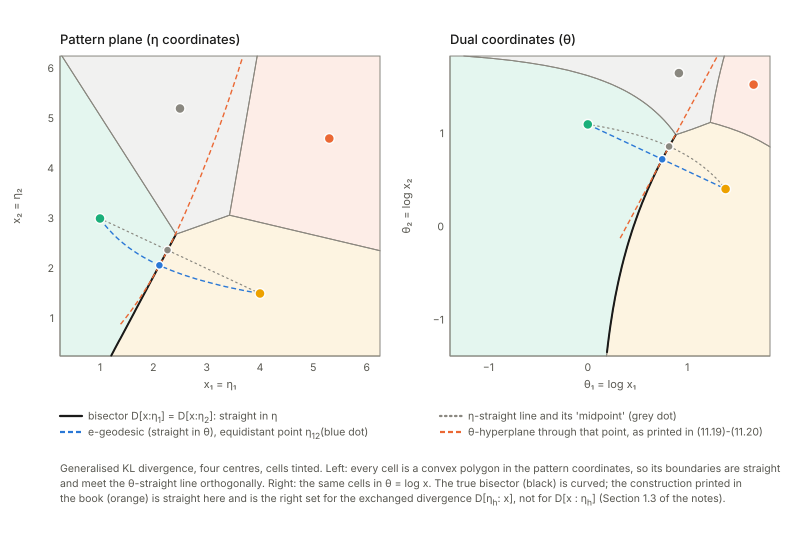
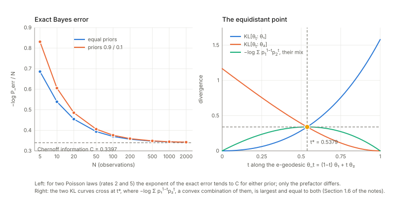
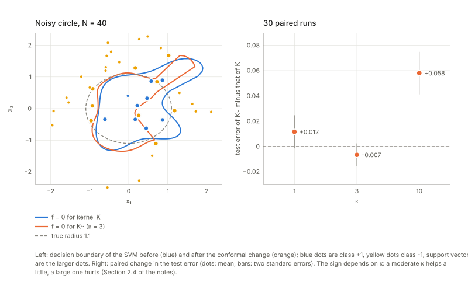
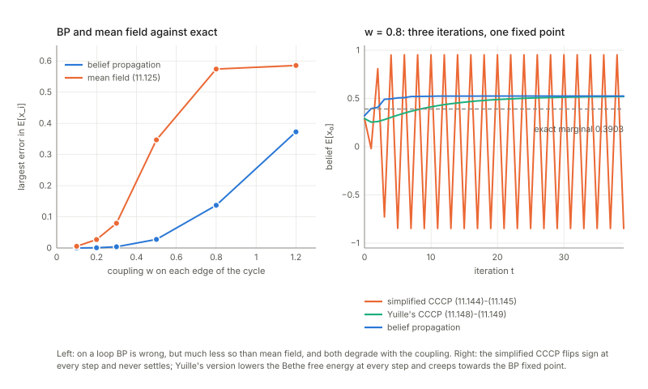
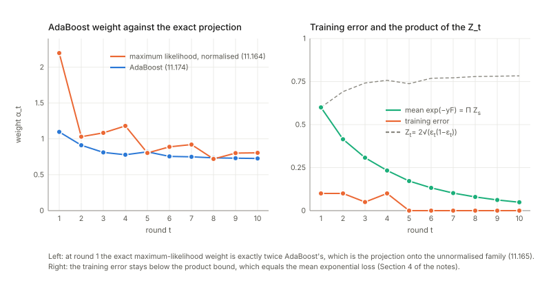
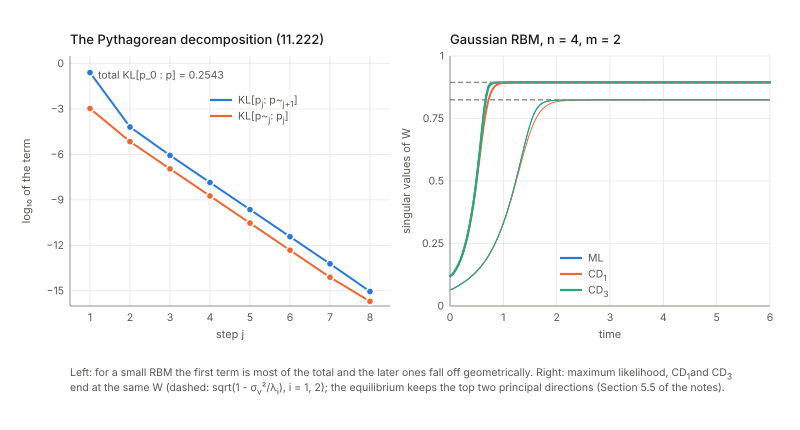

Notes for Chapter 11 of Amari, *Information Geometry and Its Applications* (Springer, 2016). The next section summarises the book's chapter in my own words. The sections after it are explorations that I asked for, one at a time, so they follow my questions and not the book's order. They keep the intuition, the figures and the derivations, and leave out numerical checks.

## What the chapter covers (a summary of the book's chapter)

The chapter takes the geometry of Part I (convex potentials, Bregman divergences, e- and m-projections, Pythagoras) and tries it on five standard problems of machine learning. The sections are short and fairly independent: each one recasts a known algorithm as a geometric operation and then points to what the geometry suggests. The sections in order:

- **§11.1 Clustering patterns.** Patterns are points of a dually flat space and closeness is measured by a Bregman divergence (11.1.1). The best single representative of a group of patterns, the "center" of a cluster, turns out to be the plain arithmetic average in the dual coordinates, whatever the convex function is, and the same holds for a whole distribution of patterns, whose center is its mean (11.1.2, Theorem 11.1). So the k-means algorithm (assign each pattern to the nearest center, recompute the centers, repeat) carries over unchanged to any such divergence; it stops after finitely many steps but need not find the best clustering, and a smarter choice of starting centers (k-means++) is mentioned (11.1.3). The regions of the space won by each center form a divergence-based Voronoi diagram, and the wall between two regions is a flat surface (a geodesic hyperplane in the primal coordinates) that cuts the straight segment joining the two centers at its midpoint at a right angle, which is the Pythagorean theorem at work (11.1.4, Theorem 11.2). In the stochastic version each cluster is read as a probability law that falls off exponentially with the divergence from its center, which is an exponential family (Theorem 11.3). Fitting a mixture of such laws with EM gives soft k-means, where each pattern gets a probability of belonging to every cluster and the centers are probability-weighted averages; the wall between two classes is again flat but shifted according to the class priors (11.1.5, Theorem 11.4). A single far-away outlier can drag an ordinary center a long way. The total Bregman divergence divides the usual one by a factor that grows with the slope of the convex function, and this makes the effect of any one outlier on the center bounded, so the center is robust (11.1.6, Theorem 11.5); the book mentions uses in medical imaging and image retrieval. Finally, when two classes are two exponential-family laws and many samples are averaged, the chance of choosing the wrong class falls off exponentially, with a rate called the Chernoff information. The best decision wall is again a Pythagorean one, cutting the exponential geodesic between the two laws at the point equidistant from both, and the rate is tied to the alpha-divergence; the class priors do not change the rate (11.1.7).
- **§11.2 Geometry of the support vector machine.** The chapter first recalls the linear classifier that separates two classes with the widest empty corridor (the margin); only the training points touching the corridor, the support vectors, matter, and the problem is solved through a dual quadratic problem that uses the patterns only through inner products (11.2.1). When the classes are not linearly separable, one first maps the patterns into a higher-dimensional space where they are, for example points inside versus outside a circle become separable once a squared-radius coordinate is added (11.2.2). The kernel trick says that one never needs the map itself, only the inner product after the map, which is the kernel; any positive-definite kernel (Mercer condition) will do, and the Gaussian and polynomial kernels are the usual examples (11.2.3). The geometry comes in 11.2.4: the map bends the original pattern space inside the feature space, so it carries an induced Riemannian metric, computed from second derivatives of the kernel, which tells how much volume is stretched near each point. Since only support vectors decide the boundary, the proposal is to rescale the kernel by a factor that is large near the support vectors (a conformal change), which magnifies the space exactly where the classes meet. Two choices of the factor are described, the later one depending on the decision function itself. Simulations reported in the book improve recognition by up to about ten percent.
- **§11.3 Stochastic reasoning: belief propagation and CCCP.** The setting is a graphical model, a joint law of many variables that factorises over small groups of mutually connected variables (cliques); given the observed ones, one wants to guess the unobserved binary variables, and the cheapest good guess takes the sign of each variable's mean, which is too costly to sum exactly (11.3.1). The mean-field idea compares the model with the family of fully independent laws, where means are easy. The m-projection onto that family keeps every mean exactly (Theorem 11.6) but is not computable; the mean-field approximation uses the e-projection instead, which is computable but only approximate, may have several solutions, and is worked out for a Boltzmann machine with pairwise interactions (11.3.2). Belief propagation is then rebuilt geometrically: for each clique there is a small model that keeps only that clique's interaction and replaces all others by a linear term, each such model is m-projected onto the independent family, the difference between the projection and the model is that clique's "belief", beliefs are added to update the independent model, and each clique model is rebuilt from the other cliques' beliefs (11.3.3). A fixed point satisfies an m-condition (all projections agree) and an e-condition (a linear relation between the parameters, equivalently the true law lies in a certain e-flat family); BP may fail to converge, and when the graph has no cycles the answer is exact (11.3.4, Theorem 11.7 and Theorem 11.8). The book also matches this with the textbook message-passing form of BP. CCCP (11.3.5) swaps the roles: at every step the m-condition is forced and the update pushes toward the e-condition; this version has no inner loop, always converges, and relates to Yuille's original method, which splits the free energy into a convex and a concave part. The approximation error of BP and CCCP can be studied through curvature (only cited).
- **§11.4 Information geometry of boosting.** Boosting builds a strong classifier as a weighted vote of many weak ones, added one at a time (11.4.1). To judge a machine, its real-valued score is read as a stochastic machine whose probability of the correct label grows with the score, and the loss on each training example (exponential of minus margin, normalised) is a distribution over the training set that is large on examples the current machine gets wrong (11.4.2). The next weak machine is trained on data resampled with these weights, so it concentrates on the hard examples, and any kind of learner can be used (11.4.3). The weight given to the new machine is found geometrically: adding the new machine with weight alpha traces a one-parameter exponential family, and the best fit to the data is the m-projection of the empirical distribution onto it. Solving that gives a closed form, half the log of the ratio of the weighted correct to the weighted wrong mass, and the example weights are then multiplied up or down accordingly (11.4.4).
- **§11.5 Bayesian inference and deep learning.** The chapter says plainly that this section is a preliminary attempt. Bayesian duality (11.5.1): for an exponential family with a prior on the parameter, the joint law of data and parameter is exponential, the posterior is again exponential with the roles of data and parameter swapped. Conjugate priors have the same form as the posterior, so seeing data just shifts two hyperparameters, as if extra pseudo-observations had been added; curved families and a model with extra weights W are suggested as a layered model of inference. A restricted Boltzmann machine, with a visible and a hidden layer and links only between layers, has a joint law of exactly this exponential form, so it is read as a Bayesian inference machine (11.5.2). Learning aims to make its visible marginal match the data law, an m-projection; working with joint laws instead, the best pair of a data-side family and the machine family is found by the em algorithm, i.e. alternating e- and m-projections (11.5.3, Theorem 11.9). The learning rule is the gradient of the KL divergence and reads as the difference of the average product of hidden and visible activity under the data-driven law and under the machine's own stationary law (Theorem 11.10); the natural gradient and a mixed coordinate system are suggested for improvement. Since the stationary average needs long sampling, contrastive divergence stops after k alternating sampling steps. Geometrically each step is an m-projection between two e-flat families (Theorem 11.11) and the KL divergence from the starting law to the stationary law splits into a sum of Pythagorean pieces (Theorem 11.12) (11.5.4). For the Gaussian RBM the learning equations can be solved: at equilibrium the machine does a principal component analysis, keeping directions whose variance exceeds the noise level and discarding the rest, and the equilibria are the same for exact learning and for contrastive divergence of any k (Theorem 11.13, proof omitted); the first-step version is said to work nearly as well as maximum likelihood (11.5.5). The closing remarks recall robust clustering, kernels, BP and boosting, note that the hierarchical, unsupervised side of deep learning needs a good model of the data law, and point to Chapter 12 for the supervised side, tied to singularities.

## Links

- **[Interactive companion](figures/interactive.html)**: eight widgets. (1) The centre of a cluster of six patterns: the point that minimises the average divergence, in each of the two slots of a Bregman divergence. (2) The boundary between two Bregman cells in pattern and in dual coordinates, against the construction printed in the book.
  (3) The error exponent of a two-class decision between Poisson laws: exact Bayes error, Chernoff information, equidistant point. (4) The volume element of a Gaussian kernel after a conformal change, as a map. (5) The margin of a linear SVM as a function of the direction of its normal.
  (6) Belief propagation, mean field and two CCCP algorithms on a four-cycle, with the coupling as a dial. (7) AdaBoost round by round, against the exact maximum-likelihood weight. (8) A Gaussian restricted Boltzmann machine learning: singular values of $W$ under maximum likelihood and under contrastive divergence.
- The book: Amari, *Information Geometry and Its Applications* (Springer, 2016), DOI [10.1007/978-4-431-55978-8](https://doi.org/10.1007/978-4-431-55978-8). These notes cover Chapter 11 only; equation numbers such as (11.55) refer to the book.
  No text of the book is reproduced here; everything is restated and re-derived.
- Neighbouring chapters: **[Chapter 10: linear systems and time series](../ch10-linear-systems-and-time-series/index.html)** before it, and **[Chapter 12: natural gradient and singular regions](../ch12-natural-gradient-and-singular-regions/index.html)** after it, to which the chapter defers the supervised side of deep learning.
  The tools used here are from **[Chapter 1: dually flat structure](../ch01-dually-flat-structure/index.html)** (Bregman divergences, projections, Pythagoras), **[Chapter 2: exponential and mixture families](../ch02-exponential-and-mixture-families/index.html)** and **[Chapter 8: hidden variables](../ch08-hidden-variables/index.html)** (the em algorithm).
  Background on the annotations site: **[The Fisher information matrix](https://msrepo.github.io/theory_inclined_papers_with_annotations/fisher-information/)** and **[Expectation–maximization](https://msrepo.github.io/theory_inclined_papers_with_annotations/expectation-maximization/)**.

## In one paragraph

The chapter tries the dually flat geometry of Part I on five problems of machine learning, loosely connected, each a few pages. **Clustering**: if closeness is measured by a Bregman divergence, the representative of a group of patterns is still their arithmetic mean (when the representative sits in the right slot of the divergence), k-means works word for word, the cells of the resulting Voronoi diagram have flat boundaries, the stochastic version is an exponential family fitted by EM, a rescaled divergence gives centres that ignore outliers, and the error rate of a two-class decision rule decays with a divergence, the Chernoff information.
**Support vector machines**: patterns are embedded in a feature space; the kernel is the inner product there, it induces a Riemannian metric on the pattern space, and multiplying the kernel by a position-dependent factor magnifies that metric near the support vectors. **Belief propagation** (BP) approximates the marginals of a graphical model; geometrically it alternates between an independent distribution and one-interaction models, matching means by m-projection and adding up "beliefs" in the e-coordinates; it is exact on trees, and the CCCP algorithm enforces the same two conditions in the other order.
**Boosting** adds weak classifiers one at a time, the weight of each being a projection of the data. **Bayesian inference and deep learning**: the joint law of data and parameter has two exponential faces, a restricted Boltzmann machine is such a joint law, its learning rule is the em algorithm, contrastive divergence is a chain of m-projections with a Pythagorean bookkeeping, and the Gaussian machine turns out to do PCA with a noise floor.
I re-derived every one of these on small cases. The geometry survives, but the printed text has an unusual density of slips, several of which change a statement (the boundary of two Bregman cells is flat in the *other* coordinate system; the M-step (11.32) lacks a division; that $M^*$ contains $q$ on a tree is false; the simplified CCCP does not always converge; the weights in (11.233) lose a factor), and I list them under *Checks of the book's statements* near the end.

## The spine of the argument

1. With a Bregman divergence $D_\varphi[x:\eta]$, the centre of a cluster is the mean of its members, for every $\varphi$ (Theorem 11.1); so k-means, with its two steps, carries over unchanged (§11.1.1–11.1.3).
2. The boundary between two cells is a hyperplane orthogonal to the geodesic joining the centres and meeting it at the equidistant point (Theorem 11.2; the printed version has e and m exchanged); a cluster defines an exponential family $p\propto e^{-D_\varphi}$, a mixture of them is fitted by EM (soft k-means), and priors shift the boundary by $\log(\pi_i/\pi_j)$ (Theorem 11.4) (§11.1.4–11.1.5).
3. Dividing the divergence by a slope-dependent factor (total Bregman divergence) makes centres robust to outliers; the exponent of the Bayes error of a two-class decision is the Chernoff information, the KL divergence from the point where the e-geodesic between the classes crosses the decision boundary to either class (§11.1.6–11.1.7).
4. A support vector machine maximises the margin, and its dual depends on inner products only; a kernel is such an inner product after an embedding, $g_{ij}=\partial_i\partial'_jK|_{x'=x}$ is the metric the embedding induces, and $\tilde K=\sigma\sigma'K$ changes it by $\sigma^2g+\nabla\sigma\nabla\sigma^{\mathsf T}$ (§11.2).
5. Binary graphical models are exponential families; the independent ones form an e-flat $M_0$; the m-projection onto $M_0$ gives the true marginals (Theorem 11.6), the e-projection is mean field (§11.3.1–11.3.2).
6. BP = repeated m-projection of one-clique models onto $M_0$ and addition of the beliefs; at a fixed point an m-condition and an e-condition hold (Theorem 11.7); the answer is exact on trees (Theorem 11.8); CCCP enforces the conditions in the opposite order (§11.3.3–11.3.5).
7. Boosting: the weights $W_t\propto e^{-yF_t}$ form an exponential family on the training set, and the weight $\alpha$ of the next machine comes from an m-projection of the empirical distribution onto a one-dimensional family (§11.4).
8. $p(x,\theta)$ has two exponential faces, with $x$ natural for $\theta$ and the other way round (Bayesian duality); a restricted Boltzmann machine is such a joint law, learning is the em algorithm between a data manifold and a model manifold (Theorems 11.9–11.10), contrastive divergence is an alternating chain of m-projections (Theorems 11.11–11.12), and the Gaussian machine finds the leading principal components (Theorem 11.13) (§11.5).

## Setup and notation

| Symbol | Meaning | In the examples |
|---|---|---|
| $\varphi,\psi$ | dual convex potentials, $\theta=\nabla\varphi(\eta)$, $\eta=\nabla\psi(\theta)$, $\psi(\theta)+\varphi(\eta)=\theta\cdot\eta$ (11.4)–(11.6) | $\tfrac12\lvert x\rvert^2$; $\sum(x\log x-x)$; $-\sum\log x$ |
| $D_\varphi[x:\eta]$ | $\varphi(x)-\varphi(\eta)-\nabla\varphi(\eta)\cdot(x-\eta)$ (11.3); the pattern $x$ (in $\eta$-coordinates) is in the **first** slot, the centre in the second | $=D_\psi[\theta:\theta_x]=\mathrm{KL}[p_x:p_\eta]$ for an exponential family |
| $G^{-1}=\nabla\nabla\varphi$ | inverse Fisher metric in the $\eta$ chart (11.11) | $\operatorname{diag}(1/x)$ for generalised KL |
| $\eta_C$, $B_{ij}$ | centre of a cluster (11.7); boundary of two cells (11.18) | |
| $z(x)$, $K(x,x')$ | feature map and kernel $K=z\cdot z'$ (11.79). The book writes $\varphi$ for the embedding too; I write $z$ so that it does not clash with the potential | $z=(x_1,x_2,x_1^2+x_2^2)$ (11.78) |
| $g_{ij}$, $\sigma(x)$, $\tilde K$ | metric induced by $K$ (11.90); conformal factor; $\tilde K=\sigma(x)\sigma(x')K$ (11.92) | $\tfrac{2}{\sigma_w^2}\delta_{ij}$ for the Gaussian kernel |
| $q(x)$, $M_0$, $M_r$, $\tilde M$ | target law on $x\in\{\pm1\}^n$; independent laws; the one-clique model of clique $r$; the big family (11.107)–(11.113), (11.127) | Ising model $q\propto e^{h\cdot x+\sum_rw_rx_ix_j}$ |
| $\theta_0,\theta_r,\xi_r$ | parameters of the point of $M_0$ and of $M_r$ (added to $h$); the belief of clique $r$ (11.134) | |
| $E^*$, $M^*$ | e-flat and m-flat hulls of the fixed point's $p_r^*$ and $p_0^*$ (11.138)–(11.139) | |
| $F_t=\sum_a\alpha_ah_a$, $W_t$, $\varepsilon_t$, $Z_t$ | boosting: output, weights on examples, weighted error, normaliser | |
| $p(v,h;W)$, $p_V$, $M_{V,H\vert q}$ | restricted Boltzmann machine, its visible marginal, the data manifold $\{q(v)r(h\vert v)\}$ (11.192), (11.203) | |
| $p_j$, $\tilde p_j$ | the $\mathrm{CD}_j$ distribution and its half-step (11.213)–(11.214) | |

**Running examples.** Small toy cases throughout: a few patterns in the positive quadrant with the generalised KL divergence, and two Poisson laws for the decision problem; a separable point set and a noisy circle for the kernel pictures; a handful of $\pm1$ spins on a cycle with fields and a common coupling that I vary as a dial; a toy set of training points with decision stumps for boosting; and a small binary RBM, small enough to list all its states, and a Gaussian one.

## 1. Clustering with a divergence (§11.1)

### 1.1 The centre of a cluster (Theorem 11.1)

**In plain words.** A *divergence* $D[x:c]$ says how badly $c$ stands in for $x$; it need not be symmetric. A *Bregman divergence* is the vertical gap between a convex curve $\varphi$ above the point $x$ and the tangent line to the curve drawn at $c$: half the squared distance for $\varphi=\tfrac12x^2$, the generalised Kullback–Leibler divergence $\sum x\log(x/c)-x+c$ for $\varphi=x\log x-x$, the Itakura–Saito divergence for $\varphi=-\log x$. The *centre* of a cluster is the point $c$ with the smallest average divergence from its members. For squared distance that is the arithmetic mean, as everyone using k-means knows. Theorem 11.1 (Banerjee et al.) says it **stays the arithmetic mean for every Bregman divergence**. The proviso the book does not state: this is for the centre in the *second* slot, $\frac1k\sum_iD_\varphi[x_i:c]$; with the centre in the first slot the minimiser is the mean in the dual coordinates $\theta=\nabla\varphi$.

**Example.** Take a few patterns in the positive quadrant with the generalised KL divergence. The arithmetic mean and the geometric mean (the mean in $\theta=\log x$) are two different points. With the centre in the second slot the arithmetic mean has the smaller average divergence; with the centre in the first slot the geometric mean wins. Each slot has its own winner (first widget).

**Formal statement.** With $x=\eta$ in the $\eta$-chart, $D_\varphi[x:\eta]=\varphi(x)-\varphi(\eta)-\nabla\varphi(\eta)\cdot(x-\eta)$ (11.3). Differentiating in the second argument gives $\partial_\eta D_\varphi[x:\eta]=-\nabla\nabla\varphi(\eta)\,(x-\eta)=-G^{-1}(\eta)(x-\eta)$, so the average (11.7) is stationary where $\sum_i(x_i-\eta)=0$, which is (11.9); $G^{-1}$ is positive definite, so it is the minimum. Integrating against a density $p$ instead of summing gives (11.12)–(11.13): the centre of a distribution is its expectation.

**Remarks on the book's statement.**

- **The sign in (11.10).** The book prints the gradient of the average divergence with a plus sign. Differentiating (11.3) as above gives a minus sign. The zero, hence (11.9), is untouched.
- **The converse.** The book states only one direction. A converse is known (the arithmetic mean is the optimal point estimate only for Bregman losses; I did not re-prove it), and other divergences are counterexamples: the squared Hellinger distance has its centre at the mean of the square roots, squared, and the $L^1$ distance has the median. A handy test: $D$ is Bregman exactly when $D[x:z]-D[x:y]$ is an affine function of $x$ for all $y,z$. So a k-means that renews its centres by the arithmetic mean can *raise* the cost for a non-Bregman divergence: the decrease of k-means is a property of Bregman divergences.

### 1.2 k-means (§11.1.3)

**In plain words.** Alternate two steps: assign each pattern to the centre with the smallest divergence (11.16), then move each centre to the mean of its cluster. Each step lowers the total cost (11.15) (the first by definition, the second by Theorem 11.1), there are finitely many partitions, so the procedure stops; where it stops is a local optimum.

**A remark.** There is no guarantee of optimality: the final partition depends on the starting centres, and k-means can stop at a local optimum that is worse than the best partition, for Bregman divergences just as in the Euclidean case. In every case I tried the cost never increased between steps.

### 1.3 The Voronoi diagram (§11.1.4, Theorem 11.2)

**In plain words.** The *cell* of a centre is the set of patterns closer to it than to any other centre, and neighbouring cells are separated by *bisectors*, where two divergences are equal. For squared distance these are the familiar straight perpendicular bisectors. Theorem 11.2 describes them for a Bregman divergence in geometric terms (a hyperplane orthogonal to a geodesic through an equidistant point), but as printed it has the two kinds of straightness exchanged.

**The computation.** With $\theta_i=\nabla\varphi(\eta_i)$,
$$D_\varphi[x:\eta_1]-D_\varphi[x:\eta_2]=(\theta_2-\theta_1)\cdot x+\text{const},$$
since the $\varphi(x)$ cancels and what is left is linear in $x=\eta$. So $B_{12}$ is a **hyperplane in the pattern coordinates $\eta$** with normal $\theta_2-\theta_1$: an m-flat hypersurface. The geodesic joining the centres that it meets orthogonally is the one that is straight in $\theta$ (the e-geodesic $\theta_t=(1-t)\theta_1+t\theta_2$), because a vector $\delta\theta$ and a covector $\delta\eta$ are orthogonal in the Fisher metric exactly when $\delta\theta\cdot\delta\eta=0$. It meets $B_{12}$ at the equidistant point $\eta_{12}$ on that geodesic. The Pythagorean relation (11.21) holds for $x$ on the hyperplane: in general
$$D_\varphi[x:\eta_i]-D_\varphi[x:\eta_{12}]-D_\varphi[\eta_{12}:\eta_i]=(\theta_{12}-\theta_i)\cdot(x-\eta_{12}),$$
which vanishes when an $e$-direction ($\theta_{12}-\theta_i$, along the e-geodesic from $\eta_i$) is orthogonal to an $m$-direction ($x-\eta_{12}$, in the hyperplane). The printed construction pairs two geodesics of the same kind.

**Example and corrections** (generalised KL, two centres).

- The boundary between two cells is a straight line in the pattern chart $\eta$ and a curve in the $\theta=\log x$ chart. The book says the boundary is linear in the $\theta$ chart and curved in the $\eta$ chart (p. 235): that is the other way round.
- Corrected construction: find the equidistant point on the $\theta$-straight line joining the centres; the hyperplane through it with normal $\theta_2-\theta_1$ is the boundary, and (11.21) holds on it exactly.
- The construction as printed (a $\theta$-hyperplane through the midpoint of the $\eta$-straight line) does not give equal divergences, and (11.21) fails on it.
- **Reconciliation.** The printed theorem is the *correct* one for the exchanged divergence $D_\varphi[\eta_h:x]$ (centres in the first slot). But for that divergence the cluster centre is the mean in $\theta$, not the mean, so Theorems 11.1 and 11.2 as printed cannot hold for one divergence. Everything else in §11.1 (and the book's own Chernoff paragraph, (11.48)–(11.50), which has the boundary as an m-flat hyperplane orthogonal to the e-geodesic) takes the pattern first, which is the version I corrected to.

### 1.4 The stochastic version: exponential families, soft k-means, priors (§11.1.5)

**In plain words.** A divergence can be turned into a probability: give a pattern the density $\propto e^{-D_\varphi[x:\eta_h]}$, high near the centre and decaying with the divergence. Theorem 11.3 says this is an exponential family whose natural parameter is the dual coordinate $\theta_h$ of the centre. A cluster then becomes a distribution, a set of clusters a mixture, and fitting a mixture by maximum likelihood is the EM algorithm (the em algorithm of Chapter 8): the E-step computes the posterior probability of each cluster for each pattern (11.30), the M-step re-estimates the weights and centres. "Soft k-means" is this with the posterior probabilities as weights; "hard" k-means is its limit.

**Corrections to the book's statements.**

- **The M-step (11.32).** The book renews the centre as $\eta_h=\frac1N\sum_ix_i\,p(C_h\vert x_i)$. The weighted mean needs a division by the total weight $\sum_ip(C_h\vert x_i)=N\pi_h$; without it $\eta_h$ is $\pi_h$ times the cluster mean, which shrinks the centres towards the origin and is not a stationary point of the likelihood. With the division, EM never decreases the likelihood. (11.31) for $\pi_h$ is right.
- **The base measure in (11.24)–(11.26).** The identity $e^{\varphi(x)}e^{-D_\varphi[x:\eta_h]}=e^{\theta_h\cdot x-\psi(\theta_h)}$ is true, and says the family is exponential with natural parameter $\theta_h$; but the stated base measure $e^{\varphi(x)}dx$ is not what makes it a density. For the exponential distribution the integral with respect to $dx$ is not exactly one, and for the Gaussian case $e^{\varphi}e^{-D}$ grows without bound while $e^{-D}$ alone is integrable. The general statement (Banerjee et al.) is $p=e^{-D_\varphi}\,b(x)$ with $b=e^{\varphi}\times$ the family's own base density; it equals $e^{\varphi}$ only for families whose base measure is $dx$.
- **Theorem 11.4 and (11.34).** With prior weights the posterior probabilities are equal where $\pi_ie^{-D_i}=\pi_je^{-D_j}$, i.e. $D_i-D_j=\log(\pi_i/\pi_j)$: the same flat boundary as without priors, shifted. The book prints $\pi_iD_\varphi[x\vert\eta_i]=\pi_jD_\varphi[x\vert\eta_j]$, which puts the boundary somewhere else (already visible in one dimension with two Gaussians of different priors). The geometric part of the theorem has the same e/m exchange as Theorem 11.2.

### 1.5 Robust centres and total Bregman divergence (§11.1.6)

**In plain words.** One far-away outlier drags a mean arbitrarily far. The *influence function* $z(x^*)$ is how much the centre of $k$ patterns moves, times $k$, when one pattern $x^*$ is added; a centre is *robust* if $z$ stays bounded. The *total Bregman divergence* (Vemuri et al.) measures, instead of the vertical gap $D_\varphi$ between the curve and its tangent, the *perpendicular* distance from the lifted point $(x,\varphi(x))$ to the tangent hyperplane: a steep tangent makes the same vertical gap a small perpendicular one.

**Corrections to the book's statements.**

- **Which gradient.** The perpendicular distance from the lifted point $(\eta',\varphi(\eta'))$ to the tangent hyperplane at $\eta$ is $D_\varphi[\eta':\eta]/\sqrt{1+\lvert\nabla\varphi(\eta)\rvert^2}$, with the slope at the *point of tangency*, the second argument. The book (11.37)–(11.38) puts the slope at $\eta'$.
- **Theorem 11.5 is proved for a different centre than the one defined.** The objective (11.40) puts the patterns in the first slot with weights $1/w(x_i)$; its minimiser is the weighted mean, whose influence function is $z\propto(x^*-\bar\eta)/w(x^*)$. That is bounded for $\varphi=\tfrac12x^2$ but not for generalised KL, where it keeps growing (roughly like $x^*/\log x^*$) as the outlier moves out. The influence function the book derives, (11.41)–(11.43), belongs to the centre in the *first* slot, $\nabla\varphi(\eta^*)=$ weighted mean of $\nabla\varphi(x_i)$, and that one is bounded for both. So the argument works if the divergence is exchanged (as in Liu et al., where the centre is the first argument).
- **The sign of (11.41).** The centre actually moves *towards* the outlier, so the printed sign is reversed (the formula is first order in $1/k$, so the magnitudes agree only approximately). Also $G$ in (11.42) is a weighted Hessian of $\varphi$, the inverse of the role the symbol $G$ has in (11.11).

### 1.6 Error probability and Chernoff information (§11.1.7)

**In plain words.** Two classes with distributions $p_1,p_2$ from an exponential family; $N$ patterns arrive from one of them and we must decide which. The best rule picks the class with the larger likelihood. Its error probability falls like $e^{-NC}$, and the rate $C$, the *Chernoff information*, is a divergence: $\mathrm{KL}[\theta^*:\theta_i]$ from the point $\theta^*$ where the e-geodesic between the two classes crosses the decision boundary to either class, the same number for both. Geometrically (Sanov, Chapter 3) the data summarise to the observed point $\bar\eta$, which is a random point near the true distribution; an error needs it to land on the wrong side of the boundary, which costs $e^{-N\min\mathrm{KL}}$, and the nearest point of the boundary is the foot of the perpendicular (Pythagoras).

**Example.** Poisson against Poisson with different rates, so $\theta_i=\log\lambda_i$ and $\psi(\theta)=e^\theta$. The e-geodesic is $\theta_t=(1-t)\theta_1+t\theta_2$ and the equidistant point (11.51) is where the KL divergences to the two ends are equal; that common value is the Chernoff information $C$, which also equals $-\min_t\log\sum_xp_1^{1-t}p_2^t$.

**Remarks.**

- *Exponents, not errors.* Summing the exact Bayes error over the sufficient statistic shows $-\frac1N\log P_{\rm err}$ tending to $C$ from above, for equal priors and for lopsided ones alike. So (11.54) holds as a statement about **exponents**, and the Remark (the prior does not matter) is right for the exponent. The error itself behaves like $N^{-1/2}e^{-NC}$ times a constant, and the Chernoff bound $P_{\rm err}\le\tfrac12e^{-NC}$ holds throughout.
- **(11.55) lacks a logarithm.** The book writes $D_{\rm KL}[\theta_{\lambda^*}:\theta_i]=\psi(\lambda^*)$ with $\psi(\lambda)=\int p_1^{\lambda}p_2^{1-\lambda}dx$ from (11.52). At the minimum that integral is a number below one; the KL divergence is its negative logarithm.
- **Two meanings of $\lambda$.** In (11.49)–(11.50) $\lambda$ weights $p_2$; in (11.52) it weights $p_1$. With the book's $\alpha$-divergence (3.39), $\int p_1^{\lambda}p_2^{1-\lambda}=1-\frac{1-\alpha^2}4D_\alpha[p_1:p_2]$ at $\lambda=\frac{1-\alpha}2$ (11.56), so the minimiser of (11.52) is $\lambda=1-t^*$, while the geodesic midpoint $t^*=(1+\alpha^*)/2$ is what (11.57) gives. The formulas are consistent only if $\lambda^*$ in (11.57) is read in the sense of (11.50).

## 2. Support vector machines (§11.2)

### 2.1 The linear machine, margin and dual (§11.2.1)

**In plain words.** If two classes of points in the plane can be separated by a line at all, many lines will do; the *support vector machine* picks the one with the widest empty corridor, the *margin*. The points that touch the corridor are the *support vectors*: they alone decide the line. The calculation of the widest corridor is a quadratic optimisation with a dual form in which the data enter only through inner products $x_i\cdot x_j$; replacing these by a kernel is the "kernel trick" (§2.2).

**Remarks** (a small separable set; the dual (11.71)–(11.72) solved by a simple SMO routine of my own).

- Only a few points are support vectors, and they alone determine $w=\sum\alpha_iy_ix_i$ and $b$; they sit exactly on the edges of the corridor ($y_if(x_i)=1$), and every other point lies strictly outside it (11.68).
- The margin is $1/\lvert w\rvert$ (11.65). As an independent route, rotating the direction of the hyperplane normal and measuring the gap between the projected classes gives a single peak, at the direction of $w$, with the same margin as the nearest points (11.63)–(11.66). The fifth widget lets you turn the normal and watch the peak.
- Strong duality: the primal value $\frac12\lvert w\rvert^2$ and the dual value (11.71) coincide, and $\sum_i\alpha_i=\lvert w\rvert^2$.
- **The Lagrangian (11.69).** The book writes $L=\frac12\lvert w\rvert^2-\sum\alpha_iy_i(w\cdot x_i+b)$, missing the $+\sum\alpha_i$ that comes from the right-hand side $1$ of the constraint (11.68). At the optimum the printed expression equals minus the optimum, the correct one equals the optimum. (Substituting (11.70) into the printed form could not give (11.71).)
- *The circle problem (11.78), Fig. 11.7.* Points inside and outside a circle cannot be separated by any line in the plane, but after $z=(x_1,x_2,x_1^2+x_2^2)$ the hard-margin SVM separates them with a plane, and the kernel form (11.84), $\sum\alpha_iy_iK(x_i,x)+b$, equals $w\cdot z(x)+b$.

### 2.2 Kernels (§11.2.2–11.2.3)

**In plain words.** A *kernel* $K(x,x')=z(x)\cdot z(x')$ is an inner product after an embedding $z$ into a feature space, possibly infinite-dimensional. Any function that behaves like an inner product ("positive semi-definite") is a kernel (Mercer), and then the embedding can be recovered from its eigenfunctions.

**Remarks.**

- **(11.80).** The book says $\sum c_ic_jK(x_i,x_j)>0$ for $c\neq0$ when the coordinate functions are linearly independent. That cannot be: for the embedding (11.78), five distinct points give a $5\times5$ Gram matrix of rank three, so some nonzero combination gives zero. Only $\ge0$ holds in general. The Gaussian kernel (infinite-dimensional) is strictly positive on distinct points and singular when a point is repeated.
- **(11.87).** The Gram matrix of $(x\cdot x'+1)^p$ has rank equal to the number $\binom{n+p}p$ of monomials of degree $\le p$, so this polynomial kernel really is a finite-dimensional embedding.
- **(11.83) has the wrong power.** Expanding $K=\sum_i\lambda_ik_i(x)k_i(x')$ (11.82) and comparing with $K=\sum_iz_iz_i'$ (11.79) gives $z_i=\sqrt{\lambda_i}\,k_i$, not $k_i/\sqrt{\lambda_i}$, and the accompanying sentence about dividing by the square roots is wrong with it. With the printed form the reconstruction of $K$ blows up; with the correct one a truncation to a few leading terms reproduces $K$ well.
- **(11.86).** For the Gaussian kernel on a circle the eigenvalues are $\sigma\sqrt\pi e^{-\sigma^2\omega^2/4}$ with eigenfunctions $e^{-i\omega x}$: the eigen-expansion is the Fourier series. With the *correct* embedding the metric (11.89) sums to $2/\sigma^2$, the value of §2.3; with the printed one the sum diverges as the cutoff grows.

### 2.3 The metric induced by a kernel (§11.2.4)

**In plain words.** The embedding $x\mapsto z(x)$ draws the pattern space as a curved sheet in feature space; the length of a short step on the sheet is the length in feature space of its image. That defines a Riemannian metric on the pattern space, $g_{ij}=\partial_iz\cdot\partial_jz$ (11.89), which can be computed from the kernel alone, $g_{ij}=\partial^2K(x,x')/\partial x_i\partial x'_j|_{x'=x}$ (11.90), and a volume element $\sqrt{\det g}\,dx$ (11.91) saying how much the embedding stretches volume at $x$.

**Examples.** For $K=(x\cdot x'+1)^2$ on $\mathbb R^2$ the 6-dimensional embedding is explicit, the metric from its Jacobian equals the one from the mixed second derivative of $K$, and both equal the closed form $2(\lvert x\rvert^2+1)I+2xx^{\mathsf T}$. The Gaussian kernel has $g=\frac2{\sigma^2}I$ at every point: the feature manifold of the Gaussian kernel is **intrinsically flat**, with constant volume element, although it sits curved in the Hilbert space. The embedding (11.78) has $g=I+4xx^{\mathsf T}$, with volume element $\sqrt{1+4\lvert x\rvert^2}$, equal to $\sqrt{\det g}$.

### 2.4 The conformal change of a kernel (§11.2.4)

**In plain words.** The decision of an SVM is made in the neighbourhood of the support vectors, so one wants the feature space to stretch there. Multiply the kernel by a position-dependent factor, $\tilde K(x,x')=\sigma(x)\sigma(x')K(x,x')$: the new feature vectors are $\sigma(x)z(x)$, longer where $\sigma$ is large. The new metric is (11.95), and for kernels with $\partial_{x_i}K(x,x')|_{x'=x}=0$, such as the Gaussian, simply $\tilde g=\sigma^2g+\nabla\sigma\nabla\sigma^{\mathsf T}K(x,x)$ (11.98). The book proposes $\sigma=\sum_ie^{-\kappa_i\lvert x-x_i^*\rvert}$ (11.93), large near the support vectors $x_i^*$, retraining with the new kernel, and reports improvements "up to ten percent".

**Remarks.**

- *The formulas.* Differentiating $\tilde K$ directly agrees with (11.95) for the polynomial and the Gaussian kernel, and with (11.98) for the Gaussian one. (11.98) is **not** valid without $K_i(x,x)=0$: for the polynomial kernel the first-derivative terms do not vanish and (11.98) misses. (11.97) holds for the Gaussian ($K_i=0$).
- *The volume.* With a few support vectors and the cone-shaped $\sigma$, the volume element $\sqrt{\det\tilde g}$ is several times the original at a support vector and a small fraction of it far away (fourth widget). So the volume is magnified near the support vectors and shrunk elsewhere, as intended. A small gap: $\sigma$ in (11.93) is cone-shaped, so at a support vector it has no gradient and (11.95) does not define $\tilde g$ there; I use the symmetric value $0$ for the gradient.
- *Does it help?* On a noisy-circle toy problem I trained, took the support vectors, retrained with $\tilde K$ and compared test errors over repeated runs. The change is small and not robust to $\kappa$: a small gain at one intermediate $\kappa$, nothing at a smaller one, and a clear loss at a larger one (the factor $\sigma$ vanishes away from the support vectors and the other patterns collapse towards the origin of the feature space). I cannot confirm "up to ten percent" on this toy.
- *Is the margin what grows?* On separable data the margin does grow for small $\kappa$, but so does the radius of the smallest ball enclosing the feature vectors. The scale-free ratio $(R/\rho)^2$, which is what generalisation bounds use, improves only for small $\kappa$. The larger margin is mostly a longer feature vector.

## 3. Stochastic reasoning: belief propagation and CCCP (§11.3)

### 3.1 Graphical models, mean field and the m-projection (§11.3.1–11.3.2)

**In plain words.** Many random $\pm1$ variables interact through small factors: $q(x)\propto\exp\{h\cdot x+\sum_rc_r(x)\}$, where each $c_r$ depends only on the variables of one clique (a group of variables all linked to one another). Given such a $q$ one wants the *marginals* $\eta_i=\mathbb E[x_i]$, but summing over $2^n$ states is out of reach for large $n$. The *independent* distributions $M_0=\{e^{\theta\cdot x-\psi}\}$ (each spin has $E[x_i]=\tanh\theta_i$, (11.114)) form an e-flat family. Two ways to approximate $q$ by an independent one: the **m-projection** (minimise $\mathrm{KL}[q:p]$ over $p\in M_0$), which keeps the means exactly (Theorem 11.6, since the gradient of $\mathrm{KL}[q:p_\theta]$ is $\mathbb E_{p_\theta}x-\mathbb E_qx$) and is therefore the thing we want but cannot compute; and the **e-projection** (minimise $\mathrm{KL}[p:q]$), which is cheap and is the *mean field approximation* (11.125).

**Remarks.**

- *Theorem 11.6.* Minimising $\mathrm{KL}[q:p]$ over independent $p$ gives a $p$ with exactly the same means as $q$. The e-projection, minimising $\mathrm{KL}[p:q]$, has different means, and the m-projection has the smaller $\mathrm{KL}[q:\cdot]$, as it must.
- *(11.125) and its solutions.* The equation $\eta_i=\tanh(\sum_jw_{ij}\eta_j+h_i)$ is the stationarity condition of $\mathrm{KL}[p:q]$ whose Hessian is $\operatorname{diag}(1/(1-\eta_i^2))-W$. For two strongly coupled spins with no field there are two minima (both spins up or both down) and a saddle at zero: not unique, as the book says. **The remark that a solution may be a maximum or a saddle point is half wrong: it is never a maximum.** $W$ has a zero diagonal, so the Hessian has trace $\sum1/(1-\eta_i^2)>0$ and cannot be negative definite.
- *(11.101).* The claim that the decomposition into potentials is unique when only maximal cliques are used is not so: multiplying the factor of $(x_0,x_1)$ by $g(x_1)$ and dividing that of $(x_1,x_2)$ by $g(x_1)$ changes both factors and not the product. What is unique (a standard fact) is the expansion of $\log q$ in products of spins, and with it the top-order coefficient of each maximal clique.

### 3.2 Belief propagation as projections (§11.3.3)

**In plain words.** For each clique $r$ take the model $M_r$ that keeps the real interaction $c_r$ of that clique and replaces all other interactions by a linear field $\theta_r\cdot x$ (11.127). This is easy to project onto $M_0$ by matching means. The algorithm: (i) m-project each $p_r(\theta_r)$ onto $M_0$, obtaining $\tilde\theta_{0r}$; (ii) the *belief* of clique $r$ is what it adds beyond its own field, $\xi_r=\tilde\theta_{0r}-\theta_r$ (11.134); (iii) the new independent model is the sum of all the beliefs, $\theta_0=\sum_r\xi_r$; (iv) the new $\theta_r$ is that sum without clique $r$'s own belief (11.135)–(11.136). Each clique is told what all the *others* think and reports what *it* adds: the usual message-passing idea.

**A remark.** The conventional algorithm (11.140)–(11.141) sends messages $m_{ki}(x_i)$ along edges; in log-odds form $u_{k\to i}=\frac12\log\frac{m_{ki}(+1)}{m_{ki}(-1)}$ and, for a pair interaction $w$, $u_{j\to i}=\operatorname{atanh}\{\tanh w\tanh(h_j+\sum_{k\ne i}u_{k\to j})\}$. Running the geometric algorithm literally (m-projection by listing all states) beside the message passing, from the same start, the two give the same beliefs at every step, and the belief $\xi_r^t$ of clique $r$ at node $i$ equals the message $u_{j\to i}$: the correspondence (11.142)–(11.143) is exact, step by step.

### 3.3 The solution: e- and m-conditions, trees, accuracy (§11.3.4)

**In plain words.** At a fixed point, every clique model has the same means as the independent model (the *m-condition*, nothing left to match), and the fields add up consistently, $(L-1)\theta_0=\sum_r\theta_r$ (the *e-condition*), which says exactly that $q$ itself lies on the e-flat hull $E^*$ through all the $p_r^*$ and $p_0^*$ (for $q$ is the product of the $p_r$ divided by $p_0^{L-1}$, up to normalisation). If in addition the m-flat hull $M^*$ of those points contains $q$, the m-projection of $q$ onto $M_0$ is the fixed point, and BP is exact.

**Remarks.**

- *Theorem 11.7 and the Corollary.* After BP has settled, the m-condition and the e-condition hold, and $\log q-\sum_r\log p_r+(L-1)\log p_0$ is constant over all states: $q\in E^*$. On a graph with a loop BP is nevertheless only approximate.
- **Theorem 11.8 is half right.** *Exact on trees*: on a three-spin chain BP gives exactly the true marginals. But "$M^*$ contains $q$" is **false**: under every $p_r$ and under $p_0$ the two end spins are independent, hence also under every point of $M^*$ (all share the same means), while under $q$ they are correlated. What *is* true on a tree is that each $p_r^*$ is the m-projection of $q$ onto its own $M_r$ (it matches the means and the pair correlation of its clique), which is what makes the node means exact. For a single edge $q$ does lie in $M^*$; for two *disjoint* edges it does not, because the product of the two pair correlations is a four-spin term that no combination of $p_1,p_2,p_0$ contains. So $q\in M^*$ holds only for a single interacting clique; for trees what holds is $q\in E^*$ (always) and $p_r^*=\Pi^m_{M_r}q$.
- *Accuracy on a loop.* On the four-cycle the error of the BP marginals grows with the coupling, but stays well below the error of mean field at every coupling I tried, and the same holds on average for random couplings on the seven-spin graph of Fig. 11.8. BP also needs more steps to converge as the coupling grows.

### 3.4 CCCP (§11.3.5)

**In plain words.** BP is known to look for stationary points of a *free energy*, the Bethe free energy $F$ (Yedidia et al.), but it is not a descent method and may fail to converge. The *convex–concave procedure* (Yuille) writes $F=F_{\rm vex}+F_{\rm cave}$ and iterates $\nabla F_{\rm vex}(z^{t+1})=-\nabla F_{\rm cave}(z^t)$: each step minimises a convex surrogate, which makes $F$ decrease at every step, so it converges. The book's geometric version (11.144)–(11.145) does the opposite of BP: choose $(\theta_0,\theta_r)$ so that the **m-condition** holds (the "inverse m-projection" of $p_0(\theta_0^t)$ to every $M_r$) and then correct $\theta_0^{t+1}=\sum_r(\theta_0^t-\theta_r^t)$ towards the e-condition; Yuille's original (11.148)–(11.149) uses the *new* $\theta_r^{t+1}$ on the right and so has an inner loop. The book calls the geometric version "simpler" and says CCCP "always converges" (p. 257, and again for Yuille's version on p. 260).

**What each iteration is.** For a pair interaction, the inverse m-projection onto one edge is closed-form (a quadratic for the pair correlation), so both versions can be run on the four-cycle. Writing $\Theta_i=\operatorname{atanh}$ of the node mean, the simplified step is $\Theta_i^{t+1}=h_i+\sum_{r\ni i}(\Theta_i^t-a_{r,i}^t)$ with $a_{r,i}^t$ the node field of the two-spin model of edge $r$ with the current means. Yuille's step solves $\Theta_i^{t+1}+\sum_{r\ni i}a_{r,i}(\Theta^{t+1})=h_i+d_i\Theta_i^t$ (a convex stationarity condition, solved by damped Newton), so the simplified one is *one Picard step of Yuille's inner equation started from the current point*. By my reading (derived by hand) Yuille's is exactly CCCP on $F_{\rm B}=[U-\sum S_{ij}-\sum_iS_i]+\sum_id_iS_i$, a legitimate convex-plus-concave split of the Bethe free energy (with $U$ the energy, $S_{ij}$, $S_i$ the entropies of pair and node beliefs and $d_i$ the degree).

**Remarks** (four-cycle, same kind of fields as above).

- **Yuille's CCCP decreases $F$ at every step at every coupling I tried**, and moves to the BP fixed point (slowly when the coupling is strong). **The simplified one converges only at weak coupling** and from moderate coupling on it oscillates, with $F$ going up in about half the steps: the belief of a spin alternates between two far-apart values while BP settles at an intermediate one. BP itself converges at all the couplings. So "always converges" is true of Yuille's version and not of the simplified one; the book's (11.144)–(11.145) is not shown to be a convex–concave procedure.
- *Why, in one line.* At $h=0$ the zero-field point is a fixed point; the simplified map multiplies the uniform mode by $2t/(1+t)$ and the alternating mode by $-2t/(1-t)$, with $t=\tanh w$, so it is unstable beyond $\tanh w=\frac13$, $w=\operatorname{atanh}(1/3)$. The BP message map has radius $\tanh w<1$, so it stays stable.
- *BP fixed points are stationary points of $F$.* At the BP fixed point the gradient of the Bethe free energy with respect to the pair beliefs vanishes.

## 4. Information geometry of boosting (§11.4)

**In plain words.** *Boosting* builds a strong classifier $F=\sum_a\alpha_ah_a$ from weak ones $h_a$ (each only slightly better than a coin toss), adding them one at a time. Each new weak machine is trained on the examples the current machine gets wrong, the *weights* $W_t(x_i)\propto e^{-y_iF_t(x_i)}$ of the examples being what the book calls the distribution of losses; the weight $\alpha$ of the new machine is chosen as best possible. The geometry: $W_t$ is the member with parameters $(\alpha_1,\dots,\alpha_t)$ of an exponential family on the training examples, and the choice of $\alpha$ is a projection.

**The AdaBoost formulas.** Setting the derivative of $\sum_ie^{-y_i(F_t(x_i)+\alpha h(x_i))}$ to zero gives (11.170); with $\varepsilon$ the weighted error of the new machine, $-\varepsilon e^{\alpha}+(1-\varepsilon)e^{-\alpha}=0$ (11.173), so $\alpha=\frac12\log\frac{1-\varepsilon}\varepsilon$ (11.174), and the weights update by $W_{t+1}\propto W_te^{-\alpha yh}$ (11.175).

**Remarks** (a small set of training points in the unit square with a family of decision stumps; exact weights, no resampling).

- *(11.170)–(11.175).* A numerical line search for the exponential loss gives the same $\alpha_t$ as the formula; $Z_t=2\sqrt{\varepsilon_t(1-\varepsilon_t)}$ exactly; after the update the same weak machine has weighted error exactly $\frac12$; and the training error stays below $\prod Z_s$, which equals the mean exponential loss $\frac1N\sum e^{-y_iF(x_i)}$ and is what makes AdaBoost drive the error to zero.
- **The neglected constant (11.155)–(11.157).** Writing the stochastic machine as $q(y\vert x)=c\,e^{yF/2}$, the error probability is $c'e^{-y^*F}$ with $c'=ce^{y^*F/2}=1/(1+e^{-y^*F})$, which is *not* constant in $x$: it runs from near $0$ to near $1$ as $y^*F$ goes from very negative to very positive. Dropping it replaces the model's error probability $1/(1+e^{y^*F})$ by the exponential loss $e^{-y^*F}$, by a factor $1+e^{-y^*F}$ that depends on the example. AdaBoost's weights are therefore not the model's error probabilities.
- **Which projection (11.164)–(11.169).** The text says the best $\alpha$ is given by the m-projection of the empirical distribution onto the exponential family $E_{t+1}$; that family, $q(y\vert x)=ce^{yF_{t+1}/2}$ with $c$ normalising, is the logistic model, and its m-projection is maximum likelihood. At the first round it gives $\alpha=\log\frac{1-\varepsilon}{\varepsilon}$, exactly **twice** AdaBoost's $\frac12\log\frac{1-\varepsilon}\varepsilon$, and later rounds differ in a less simple way. The book then drops the normalisation ((11.165) treats $E_{t+1}$ as a family of unnormalised positive measures) and projects onto *that*, which gives (11.169): the generalised KL divergence of the empirical distribution to $\tilde q(y\vert x)=e^{(y-y^*)F/2}$ differs between two values of $\alpha$ by the same amount as the exponential loss; the first sum in (11.168) is identically $0$ because $y_i=y^*(x_i)$. So AdaBoost is the m-projection onto the unnormalised family, and the sentence before it is about a different projection.
- *A projection that is in the literature and not in the book.* The update $W_{t+1}=W_te^{-\alpha yh}/Z$ is the e-projection (minimiser of $\mathrm{KL}[W:W_t]$) onto the m-flat set $\{W:\mathbb E_W[yh_t]=0\}$, and the Pythagorean identity $\mathrm{KL}[W:W_t]=\mathrm{KL}[W:W_{t+1}]+\mathrm{KL}[W_{t+1}:W_t]$ holds for every $W$ in that set. This is the picture of Kivinen–Warmuth and of Lebanon–Lafferty, which §11.4 cites.

## 5. Bayesian inference and deep learning (§11.5)

### 5.1 Bayesian duality and conjugate priors (§11.5.1)

**In plain words.** For an exponential family $p(x\vert\theta)=e^{\theta\cdot x-\bar k(x)-\psi(\theta)}$ put a prior $\pi(\theta)$ on the parameter. The joint law is $p(x,\theta)=e^{\theta\cdot x-\bar k(x)-\bar\psi(\theta)}$ with $\bar\psi=\psi-\log\pi$ (11.178)–(11.179): *symmetric* in the roles of $x$ and $\theta$. Conditioning on $\theta$ gives the exponential family with natural parameter $\theta$; conditioning on $x$ gives the posterior (11.180), also an exponential family, now in the random variable $\theta$ with natural parameter $x$ and its own log-partition function $k(x)$. The expectation parameters are $\eta=\mathbb E_\theta[x]$ and $\theta^*=\mathbb E_x[\theta]$ (11.183)–(11.184). A *conjugate prior* is one of the same shape as the posterior, so that Bayes' rule is just an update of two hyperparameters.

**Remarks.**

- *Duality with a non-conjugate prior.* Take $x\vert\theta\sim N(\theta,1)$ with a Laplace prior on $\theta$. The posterior mean $\theta^*(x)$ equals $\partial k/\partial x$ and equals $x+\frac{d}{dx}\log p(x)$ (Tweedie's formula, which is what $k=\bar k+\log p$ in (11.181) says); $k(x)-\bar k(x)-\log p(x)$ is the constant $\log\sqrt{2\pi}$, the Gaussian normalisation I dropped from $\bar k$.
- *Conjugate prior (11.185)–(11.188).* Take a Poisson likelihood with $\theta=\log\lambda$ and the conjugate prior $e^{\alpha\theta-\beta e^\theta-\chi(\alpha,\beta)}$ (a gamma prior on $\lambda$). Updating on two batches one after the other and updating on all observations at once give the same posterior, with hyperparameters $(\alpha+N\bar x,\beta+N)$ (11.188).
- **(11.186) has the wrong normaliser.** The posterior is $e^{\theta(\alpha+N\bar x)-(N+\beta)\psi(\theta)-\chi(\alpha,\beta)}$ in the book; the constant should be $\chi(\alpha+N\bar x,\beta+N)$, the prior's $\chi$ evaluated at the *updated* hyperparameters of (11.188). With the printed constant the density does not integrate to one.
- **Shifting the observed point by $\alpha/N$.** The posterior mode has $e^{\hat\theta}=(\alpha+N\bar x)/(N+\beta)$: the prior acts as $\beta$ extra observations of value $\alpha/\beta$, the book's second description, which is exact. The first, $\bar x+\alpha/N$, is right only to first order and only for small $\beta$.

### 5.2 The restricted Boltzmann machine and learning as em (§11.5.2–11.5.3)

**In plain words.** A *restricted Boltzmann machine* (RBM) has a visible layer $v$ and a hidden layer $h$ of binary units, interactions only *between* the layers, and the stationary law $p(v,h;W)=e^{h^{\mathsf T}Wv-\psi(W)}$ (biases dropped). Given the data law $q(v)$ one wants $W$ to minimise $\mathrm{KL}[q:p_V]$, the m-projection of $q$ onto the manifold $M_V$ of visible marginals. Since the hidden units are never observed this is exactly the *hidden-variable problem* of Chapter 8: put the data on the extended manifold $M_{V,H\vert q}=\{q(v)r(h\vert v)\}$ and the model on $M_{V,H}=\{p(v,h;W)\}$ and alternate an e-projection (fill in $h$ by $r=p(h\vert v)$) and an m-projection (refit $W$): the em algorithm.

**Remarks** (a small RBM; all its states can be listed).

- *The marginal is not exponential* (11.193). Log-probability ratios of $p(v,h)$ are affine in $W$; for $p_V$, $\log p_V(v)=\sum_j\log(1+e^{(Wv)_j})-\psi$ is not.
- *Theorem 11.9, (11.205).* For any $r(h\vert v)$, $\mathrm{KL}[q\,r:p]=\mathrm{KL}[q:p_V]+\mathbb E_q\mathrm{KL}[r:p(h\vert v)]$, so the minimum over $r$ is at $r=p(h\vert v)$ with value $\mathrm{KL}[q:p_V]$.
- *Theorem 11.10, (11.209).* The gradient of $\mathrm{KL}[q:p_V]$ is $-\langle hv^{\mathsf T}\rangle_{q\,p(h\vert v)}+\langle hv^{\mathsf T}\rangle_p$, so the learning rule (11.206) is gradient descent.

### 5.3 The natural-gradient remark (end of §11.5.3)

The book remarks that the natural gradient would work better if one had an algorithm for it, and suggests mixed coordinates. For an RBM the ingredients are all computable on a small machine. Write $G_{\rm joint}=\mathrm{Cov}_p(h_iv_j,h_kv_l)$ for the Fisher information of the *joint* exponential family (natural parameters $W$) and $G_V$ for that of the visible marginal. Since $\nabla_W^2\log p_V(v)=\mathrm{Cov}_{h\vert v}(hv^{\mathsf T})-G_{\rm joint}$, the Hessian of $\mathrm{KL}[q:p_V]$ is $G_{\rm joint}-\mathbb E_q\mathrm{Cov}_{h\vert v}(hv^{\mathsf T})$. What this gives:

- If $q=p_V(W)$ (realisable) the Hessian equals the Fisher information $G_V$ of the marginal, and $G_{\rm joint}-G_V$ is positive semi-definite: hiding the units loses information. The eigenvalues of $G_V$ are spread over a wide range, so the problem is badly conditioned.
- *Speed.* Near a realisable target the Hessian is $G_V$, so a unit natural-gradient step is Newton's step and converges in a handful of steps, while plain gradient descent with the best constant step needs thousands. Far from the target they differ, so the step must be damped: a unit natural step can overshoot from a start that is not close.
- *Invariance.* Reparametrise the weights by a nonlinear invertible map $W=f(u)$ with Jacobian $J$. The natural-gradient step in $u$, mapped back by $J$, equals the step in $W$; the plain gradient step in $u$ mapped back does not. That is the point of the geometry: the direction is defined by the model, not by how it is parametrised.

### 5.4 The geometry of contrastive divergence (§11.5.4)

**In plain words.** The learning rule needs $\langle hv^{\mathsf T}\rangle_p$ under the model's own stationary law, which needs a long Markov chain. *Contrastive divergence* ($\mathrm{CD}_k$) replaces it by the average after only $k$ rounds of Gibbs sampling started from the data: $v_0\sim q$, then alternately $h\sim p(h\vert v)$ and $v\sim p(v\vert h)$. Geometrically (Karakida): $p_j(v,h)=p_{V,j}(v)p(h\vert v)$ lives on the e-flat family $M_{H\vert V}=\{r(v)p(h\vert v)\}$, the half-step $\tilde p_{j+1}=p_{H,j}(h)p(v\vert h)$ on the e-flat family $\tilde M_{V\vert H}=\{\tilde r(h)p(v\vert h)\}$, and each Gibbs half-step is an *m-projection* onto the other family (Theorem 11.11); both families contain the model $p$, so the Pythagorean theorem splits the initial divergence into the sum of all the steps (Theorem 11.12).

**Remarks.**

- *Theorem 11.11.* The m-projection of $p_0$ onto the family of $\tilde r(h)p(v\vert h)$ has $\tilde r$ equal to the hidden marginal $p_{H,0}(h)$, and the same holds at every later step. (As printed the theorem's labels $M_{H\vert V}$, $\tilde M_{V\vert H}$ are swapped relative to (11.215)–(11.216); the proof uses the right ones.)
- *Theorem 11.12, (11.222).* $\mathrm{KL}[p_0:p]$ equals the sum of all the half-step divergences along the chain plus the final remaining term, and $\mathrm{KL}[p_j:p]$ shrinks geometrically with $j$.
- The $\mathrm{CD}_k$ direction $\langle hv^{\mathsf T}\rangle_q-\langle hv^{\mathsf T}\rangle_{p_k}$ approaches the exact $\langle hv^{\mathsf T}\rangle_q-\langle hv^{\mathsf T}\rangle_p$ quickly as $k$ grows.

### 5.5 The Gaussian RBM (§11.5.5, Theorem 11.13)

**In plain words.** If both layers are Gaussian the machine can be analysed exactly. Its stationary law (11.223) has the visible marginal $p_V\propto\exp\{-\frac1{2\sigma_v^2}v^{\mathsf T}(I-W^{\mathsf T}W)v\}$ (11.226). Learning from data with covariance $C$ drives $W$ to a point where the model covariance $\sigma_v^2(I-W^{\mathsf T}W)^{-1}$ equals $C$ in the leading directions, so the machine does **principal component analysis with a noise floor** $\sigma_v^2$: directions with data variance below $\sigma_v^2$ cannot be modelled and are replaced by $\sigma_v^2$.

**Remarks.**

- *The formulas.* From the joint precision matrix of $(v,h)$: the marginal covariance of $v$ is $\sigma_v^2(I-W^{\mathsf T}W)^{-1}$ (11.226); $\mathbb E[h\vert v]=\frac{\sigma_h}{\sigma_v}Wv$ (11.224, where the printed $\sigma_n$ is $\sigma_h$); and $\langle hv^{\mathsf T}\rangle_p/(\sigma_v\sigma_h)=W(I-W^{\mathsf T}W)^{-1}$. So (11.227)–(11.228) are averages of $hv^{\mathsf T}/(\sigma_v\sigma_h)$, the derivative of the exponent with respect to $W$, not of $hv^{\mathsf T}$.
- **(11.229) and (11.230) lose a factor $W$.** As printed the learning equations subtract the $n\times n$ matrix $(I-W^{\mathsf T}W)^{-1}$ (and in (11.230) $\sum_i(W^{\mathsf T}W)^i$) from the $m\times n$ matrix $\frac1{\sigma_v^2}WC$, so the shapes do not even match. The consistent forms are $\varepsilon\dot W=\frac1{\sigma_v^2}WC-W(I-W^{\mathsf T}W)^{-1}$ and, for $\mathrm{CD}_k$, $\varepsilon\dot W=\frac1{\sigma_v^2}WC-W\{\frac1{\sigma_v^2}(W^{\mathsf T}W)^kC(W^{\mathsf T}W)^k+\sum_{i<2k}(W^{\mathsf T}W)^i\}$. At the true equilibrium the printed (11.229) is not zero, and a simulation of the $\mathrm{CD}_k$ Gibbs chain agrees with the repaired form with $C_k=(W^{\mathsf T}W)^kC(W^{\mathsf T}W)^k+\sigma_v^2\sum_{i<2k}(W^{\mathsf T}W)^i$.
- **(11.233) has no $\sigma_v^2$, and needs $r\le m$.** Setting the right-hand side to zero gives $\tilde\Lambda_i=\sqrt{1-\sigma_v^2/\lambda_i}$ for $\lambda_i>\sigma_v^2$; the printed $\sqrt{1-1/\lambda_i}$ is right only for $\sigma_v=1$. Also $W$ is $m\times n$ with at most $m$ non-zero singular values, so if more than $m$ eigenvalues exceed $\sigma_v^2$ the printed form cannot exist: with too few hidden units the flow keeps only the top directions, the model covariance has those eigenvalues and floors the rest at $\sigma_v^2$ as in (11.234), and a direction with variance above $\sigma_v^2$ that the hidden units cannot carry is also floored. Maximum likelihood, $\mathrm{CD}_1$ and $\mathrm{CD}_3$ reach the same singular values.
- **The equilibria are not unique.** Any subset of the directions with $\lambda_i>\sigma_v^2$ can be kept, but only keeping all of them is stable (the rotations $U$ of (11.232) are the only flat directions); the other choices are unstable. The theorem lists the stable one. $\mathrm{CD}_k$ has the same equilibria (the retained covariance is a fixed point of the Gibbs chain) and relaxes more slowly. That is all I could check of the remark that $\mathrm{CD}_1$ performs well enough; the stability analysis the book cites is not reproduced.

## Checks of the book's statements

These are the places where the printed text and my re-derivation disagree. The corrected statements are in the sections above.

- **Theorem 11.1, (11.7)–(11.9).** True with the centre in the second slot; in the first slot the minimiser is the mean in $\theta$; the converse fails for non-Bregman divergences.
- **(11.10).** The sign is wrong; (11.9) is unaffected.
- **Theorem 11.2, (11.19)–(11.23).** E and m exchanged: with the pattern first the boundary is a hyperplane in the pattern coordinates, orthogonal to the e-geodesic through the equidistant point. The printed form is right for the exchanged divergence.
- **(11.24)–(11.26).** The natural parameter $\theta_h$ is right; the base measure $e^{\varphi}dx$ is not right in general.
- **(11.32).** Missing division by $\pi_h$.
- **(11.34).** Should be $D_i-D_j=\log(\pi_i/\pi_j)$.
- **(11.37)–(11.39).** The slope should be taken at the point of tangency, the second argument.
- **Theorem 11.5, (11.40)–(11.43).** The robustness result is about the first-slot centre, not the centre defined by (11.40), and (11.41) has the opposite sign.
- **(11.55) and (11.52), (11.57).** (11.55) needs a minus logarithm; $\lambda$ means two different things.
- **(11.69).** Missing $+\sum\alpha_i$.
- **(11.80).** Only $\ge0$, not $>0$.
- **(11.83).** The power should be $z_i=\sqrt{\lambda_i}\,k_i$.
- **(11.98).** Needs $K_i=0$; the cone-shaped $\sigma$ of (11.93) has no gradient at a support vector; the "up to ten percent" improvement is not confirmed on my toy.
- **After (11.125).** A solution is never a maximum.
- **(11.101).** The decomposition over maximal cliques is not unique.
- **Theorem 11.8.** Exact on trees, but $M^*\ni q$ is false except for a single clique; what is true is $q\in E^*$ and $p_r^*=\Pi^m_{M_r}q$.
- **§11.3.4–11.3.5, (11.144)–(11.149).** CCCP always converges for Yuille's version, not for the simplified one.
- **(11.153)–(11.157).** The neglected constant is not constant.
- **(11.164)–(11.169).** The projection onto the normalised family gives twice AdaBoost's weight at the first round; (11.169) is a projection onto the unnormalised family.
- **(11.186).** Normaliser should be $\chi(\alpha+N\bar x,\beta+N)$; "shift by $\alpha/N$" is first order only.
- **Theorem 11.11.** The labels $M_{H\vert V}$, $\tilde M_{V\vert H}$ are swapped relative to (11.215)–(11.216).
- **(11.224), (11.227)–(11.228).** $\sigma_n$ is $\sigma_h$; the averages are of $hv^{\mathsf T}/(\sigma_v\sigma_h)$.
- **(11.229), (11.230).** A factor $W$ is missing in the second term of each.
- **Theorem 11.13, (11.233).** $\sqrt{1-\sigma_v^2/\lambda_i}$, needs $r\le m$; equilibria are not unique.
- **Minor typography** (read off the page images). (11.147) writes $E_{\rm convex}$ for $F_{\rm vex}$; the cliques of §11.3.1 are in Fig. 11.8, not 11.7; the sign of the interaction is $-\frac12x^{\mathsf T}Wx$ in (11.191), $+h^{\mathsf T}Wv$ in (11.192), $+\sum w_{ij}x_ix_j$ in (11.121); $\hat r(v\vert h)$ after Theorem 11.9 should be $\hat r(h\vert v)$; the first entry of (11.233) has $\lambda$ for $\lambda_1$.

## Questions and doubts

- **Which slot does the chapter mean?** Everything in §11.1 puts the pattern first, $D_\varphi[x:\eta_h]$, except the geometry of Theorem 11.2 (and the geometric half of Theorem 11.4), which is right only with the centre first. Since the mean is the centre only for one of the two orders, the two theorems cannot both be about the same divergence. I corrected Theorem 11.2 to the pattern-first convention, which is also the book's own §11.1.7; I did not find which convention the cited papers (Nielsen–Nock, Boissonnat et al.) use for the bisector, and settling that would show whether the slip is the book's or a transcription.
- **Is the simplified CCCP a convex–concave procedure at all?** It is one Picard step of Yuille's inner equation, and it oscillates. Ikeda et al. may prove convergence under a condition (small coupling, damping, a different step) that the book omits; my threshold $\tanh w=\frac13$ is for a cycle with every node of degree $2$, and I did not compute it for other graphs. A damped version ($\theta_0^{t+1}=(1-\gamma)\theta_0^t+\gamma\sum_r(\theta_0^t-\theta_r^t)$) was not tried.
- **What would a correct Theorem 11.8 say geometrically?** For a tree, $q\in E^*$ and $p_r^*$ is the m-projection of $q$ onto $M_r$, and BP is exact, but $q\notin M^*$ as soon as there are two interacting edges, connected or not. I did not find a neat m-flat submanifold orthogonal to $M_0$ that contains $q$ on a tree; the standard proof by messages and the Bethe factorisation $q=\prod b_{ij}/\prod b_i^{d_i-1}$ (the e-condition) is what I used. Whether the original paper's $M^*$ is a different object is unverified.
- **How seriously to take the robustness of the total-Bregman centre?** The theorem is true for the first-slot centre (bounded influence for KL) and false for the centre defined by (11.40). Which one the experiments of Vemuri et al. and Liu et al. use I do not know; I only looked at one-dimensional examples.
- **Does the conformal modification of the kernel help?** On my toy at most a small improvement at one $\kappa$, and a loss at a large $\kappa$; the gain in the margin is mostly the growth of the feature radius. A real data set, a tuned $\sigma_w$ and $C$ and a validation-chosen $\kappa$ might do better; the cone-shaped $\sigma$ of (11.93) is not differentiable at the support vectors, where the metric matters most. The smoother (11.94), $\sigma=e^{-\kappa f^2}$, I did not test.
- **Normalised or unnormalised?** The book moves from the logistic model $q(y\vert x)=ce^{yF/2}$ to a family of positive measures in the middle of §11.4.4. The maximum-likelihood boosting weight is twice AdaBoost's at the first step; the later rounds differ in a non-trivial way (LogitBoost-like). I followed the algebra but not any claim about generalisation, and the chapter does not make one.
- **The natural gradient was looked at on one tiny RBM.** The Fisher information of the marginal, the Hessian, the realisable-target speed comparison and the invariance are exact for a small machine; whether a usable algorithm exists for large machines (the book's remark about mixed coordinates, Akaho–Takabatake) is not something I touched, and the conditioning is poor even here.
- **What the Gaussian RBM theorem leaves out.** Theorem 11.13's proof and the stability analysis are omitted and I only looked at the equilibria and flows on two small examples. The theorem assumes all eigenvalues of $C$ distinct and is silent about ties, in particular $\lambda_i=\sigma_v^2$, where the growth rate of the corresponding singular value is zero. The claim that the Gaussian–Bernoulli RBM performs ICA in restricted situations (Karakida et al.) is not checked.
- **A word on the Bayesian section.** The chapter calls its own treatment "half-baked". What I could follow is the duality, the conjugate update and the RBM identification $\theta=h$, $x=Wv$ (11.195)–(11.198), which is a relabelling and does not use any property of Bayesian inference beyond the joint being exponential in both variables.

## Takeaways

- **The centre of a cluster is the mean in the second slot.** For every Bregman divergence $D_\varphi[x:c]$, $\arg\min_c\sum_iD_\varphi[x_i:c]$ is the arithmetic mean; in the other slot it is the mean in the dual coordinates; for non-Bregman divergences (Hellinger, $L^1$) neither is the mean and k-means is not monotone. k-means itself, finite termination and local optima are all as in the Euclidean case.
- **A Bregman bisector is flat in the pattern coordinates**, orthogonal to the e-geodesic through the equidistant point; the book states it with e and m exchanged. Priors shift it by $\log\pi_i/\pi_j$, not by $\pi_iD_i=\pi_jD_j$.
- **The Bayes error exponent is a divergence**: the Chernoff information $C$ is the KL from the equidistant point of the e-geodesic to either class, independent of the prior, $=-\log\min_t\sum p_1^{1-t}p_2^t$.
- **A kernel's metric is $g_{ij}=\partial_i\partial'_jK|_{x'=x}$**: flat ($\frac2{\sigma^2}I$) for the Gaussian kernel, $I+4xx^{\mathsf T}$ for the circle embedding; a conformal change $\tilde K=\sigma\sigma'K$ gives $\sigma^2g+\nabla\sigma\nabla\sigma^{\mathsf T}$ (+ cross terms unless $K_i=0$) and magnifies the volume near support vectors; the gain in test error is small and fragile.
- **BP is alternating e/m-projections, exactly the message-passing algorithm**, exact on trees, wrong on loops by an amount that grows with the coupling (always better than mean field); its fixed points satisfy the m- and e-conditions and are stationary points of the Bethe free energy. $q\in E^*$ always, $q\in M^*$ not even on a 3-chain.
- **Yuille's CCCP always descends; the simplified one does not**: it oscillates beyond $\tanh w=1/3$ on a 4-cycle.
- **AdaBoost is the m-projection onto an unnormalised family**; the normalised one gives twice the weight at the first round. The weight update is the e-projection onto $\{\mathbb E_W[yh]=0\}$ with a Pythagorean identity; $\prod Z_t$ bounds the training error.
- **An RBM is learned by em**; the gradient is $\langle hv^{\mathsf T}\rangle_q-\langle hv^{\mathsf T}\rangle_p$; contrastive divergence is a chain of m-projections whose KL decomposes exactly (Pythagoras); the natural gradient of the visible marginal $G_V^{-1}\nabla$ is invariant under reparametrisation and, near a realisable target, converges far faster than gradient descent; the Gaussian machine finds the top principal components with $\sqrt{1-\sigma_v^2/\lambda_i}$, not $\sqrt{1-1/\lambda_i}$.
- **Printed slips to know about:** the sign of (11.10); e/m in Theorem 11.2; the base measure of (11.24)–(11.26); the missing $/\pi_h$ in (11.32); (11.34); the slope point in (11.37)–(11.39) and the centre and sign in (11.40)–(11.41); the missing $-\log$ in (11.55); the missing $+\sum\alpha_i$ in (11.69); strict positivity in (11.80); the power in (11.83); "maximum" after (11.125); "$M^*\ni q$" in Theorem 11.8; "CCCP always converges" for the simplified version; the normaliser in (11.186); the missing $W$ in (11.229)–(11.230); $\sigma_v^2$ missing in (11.233).

| Term | One line |
|---|---|
| Bregman divergence | $D_\varphi[x:\eta]=\varphi(x)-\varphi(\eta)-\nabla\varphi(\eta)\cdot(x-\eta)$; $=\mathrm{KL}[p_x:p_\eta]$ for an exponential family |
| centre of a cluster | $\arg\min_\eta\frac1k\sum D_\varphi[x_i:\eta]=$ mean (second slot); in the first slot the mean in $\theta$ |
| cell boundary | $D_\varphi[x:\eta_1]=D_\varphi[x:\eta_2]\iff(\theta_2-\theta_1)\cdot x=\text{const}$: flat in $\eta$, $\perp$ the e-geodesic |
| soft k-means | EM for the mixture $\sum\pi_he^{-D_\varphi[x:\eta_h]}$; M-step: weights $\frac1N\sum p$, centres $\sum xp/\sum p$ |
| Chernoff information | $C=-\min_t\log\sum p_1^{1-t}p_2^t=\mathrm{KL}[\theta^*:\theta_1]=\mathrm{KL}[\theta^*:\theta_2]$; $P_{\rm err}\approx e^{-NC}$ |
| SVM | margin $1/\lvert w\rvert$; dual $\sum\alpha-\frac12\sum\alpha_i\alpha_jy_iy_jK_{ij}$, $\alpha\ge0$, $\sum\alpha_iy_i=0$; $f=\sum\alpha_iy_iK(x_i,\cdot)+b$ |
| induced metric | $g_{ij}=\partial_i\partial'_jK|_{x'=x}$; Gaussian kernel: $\frac2{\sigma^2}\delta_{ij}$; conformal: $\tilde g=\sigma^2g+\nabla\sigma\nabla\sigma^{\mathsf T}K$ ($K_i=0$) |
| mean field / BP | e-projection of $q$ onto $M_0$ ($\eta=\tanh(W\eta+h)$) / alternating m-projection of $M_r$ onto $M_0$ with $\theta_0=\sum_r\xi_r$ |
| BP fixed point | m-condition $\mathbb E_r[x]=\mathbb E_0[x]$; e-condition $(L-1)\theta_0=\sum\theta_r$ ($\iff q\in E^*$); exact on trees |
| CCCP | Yuille: inner loop, $F$ decreases; simplified (11.144)–(11.145): one Picard step, unstable beyond $\tanh w=\frac13$ on the 4-cycle |
| AdaBoost | $\alpha=\frac12\log\frac{1-\varepsilon}\varepsilon$, $W_{t+1}\propto W_te^{-\alpha yh}$, $Z_t=2\sqrt{\varepsilon(1-\varepsilon)}$, error $\le\prod Z_t$ |
| Bayesian duality | $p(x,\theta)=e^{\theta\cdot x-\bar k(x)-\bar\psi(\theta)}$: natural for $\theta$ in $x$, for $x$ in $\theta$; $\theta^*=\partial k/\partial x$; conjugate update $(\alpha,\beta)\to(\alpha+N\bar x,\beta+N)$ |
| RBM learning | $\Delta W=\varepsilon(\langle hv^{\mathsf T}\rangle_q-\langle hv^{\mathsf T}\rangle_p)=-\varepsilon\nabla\mathrm{KL}[q:p_V]$; em between $M_{V,H\vert q}$ and $M_{V,H}$ |
| $\mathrm{CD}_k$ | $p_j$, $\tilde p_j$ alternating m-projections; $\mathrm{KL}[p_0:p]=\sum_j\mathrm{KL}[p_j:\tilde p_{j+1}]+\sum_j\mathrm{KL}[\tilde p_j:p_j]$ |
| Gaussian RBM | $W\to U\operatorname{diag}(\sqrt{1-\sigma_v^2/\lambda_i})O$; model covariance $\sigma_v^2(I-W^{\mathsf T}W)^{-1}$ keeps $\lambda_i$ and floors the rest at $\sigma_v^2$ |

---

*Notes written 2026-10-02.*