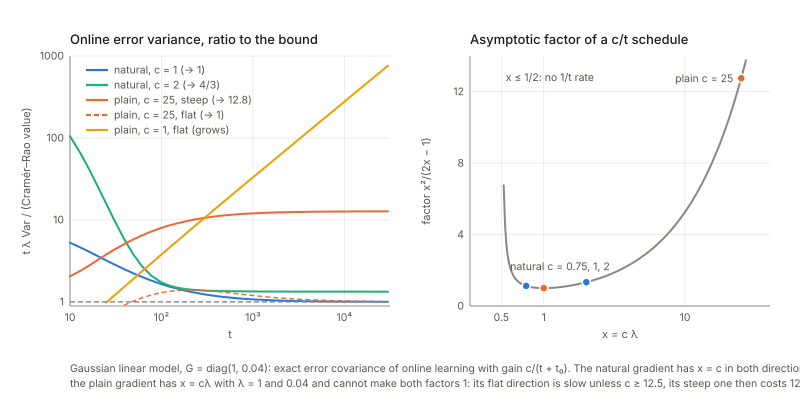

## Links

- **[Interactive companion](figures/interactive.html)**: seven widgets. (1) Steepest descent in a metric: the ellipse of steps of unit $G$-length, the natural against the plain direction, and what a change of chart does to each. (2) The exact error covariance of online learning in a Gaussian linear model, natural against plain gradient, with a $c/t$ learning constant.
  (3) Stochastic relaxation on three outcomes: the natural gradient is a constant vector. (4) Saturation of one erf neuron: the three sizes of the gradient, averaged iterations and an online simulation. (5) The Fisher matrix of the two-hidden-unit perceptron near the overlap singularity: eigenvalues against $u$, the null space on $R_o$. (6) Plain and natural gradient flows near $R_o$ for three teachers. (7) The adaptive learning constant: the averaged equations and the stochastic rule.
- **[Runnable checks](https://github.com/msrepo/information_geometry_notes/tree/main/chapters/ch12-natural-gradient-and-singular-regions/code)**:
  `code/natural_gradient.py` prints every number on this page and regenerates the figures with `python3 code/natural_gradient.py --figures`; `make verify` runs it in under twenty seconds. Everything is deterministic (fixed seeds). The perceptron part uses closed forms (arcsin kernels), so its learning flows are the book's averaged equations (12.129), integrated, not simulated.
- The book: Amari, *Information Geometry and Its Applications* (Springer, 2016), DOI [10.1007/978-4-431-55978-8](https://doi.org/10.1007/978-4-431-55978-8). These notes cover Chapter 12 only; equation numbers such as (12.141) refer to the book.
  No text of the book is reproduced here; everything is restated and re-derived.
- Neighbouring chapters: **[Chapter 11: machine learning](../ch11-machine-learning/index.html)** (the previous one; its last section is on Bayesian inference and deep learning) and **[Chapter 13: signal processing and optimization](../ch13-signal-processing-and-optimization/index.html)** (independent component analysis, where the natural gradient on matrices is used).
  The asymptotic efficiency that §6 builds on is **[Chapter 7](../ch07-asymptotic-theory-of-inference/index.html)**, the Fisher metric is in **[Chapter 5](../ch05-elements-of-differential-geometry/index.html)**, and the Legendre pair used in §5 is in **[Chapter 1](../ch01-dually-flat-structure/index.html)** and **[Chapter 2](../ch02-exponential-and-mixture-families/index.html)**.
  Background on the annotations site: **[The Fisher information matrix](https://msrepo.github.io/theory_inclined_papers_with_annotations/fisher-information/)**.

## In one paragraph

To learn is to move a parameter vector $\xi$ downhill on a loss $L(\xi)$. "Steepest downhill" only has a meaning once you say how long a step is, and the ordinary gradient silently uses the ruler in which every coordinate counts the same. For a statistical model the natural ruler measures how different the *distributions* $p(\cdot;\xi)$ and $p(\cdot;\xi+d\xi)$ are: the Fisher metric $G$. The steepest direction in that ruler is $G^{-1}\nabla L$, the **natural gradient**; it does not depend on how the model was parametrised, and online learning with it and the gain $1/t$ reaches the Cramér–Rao bound, as the best batch estimator does (Theorem 12.1). It also is not slowed down when a unit saturates (Theorem 12.2), and it appears wherever a loss lives on a family of distributions: relaxation of a discrete optimisation problem, policy gradients, mirror descent.
The second half studies the multilayer perceptron, whose Fisher matrix is *singular* on whole sets of parameters: two hidden units with the same input weights, a unit with zero output weight. Near such a set the plain gradient flow crawls (plateaus, "critical slowdown") and a positive-measure set of starting points is attracted into it (a Milnor attractor); the natural gradient, because $G^{-1}$ blows up exactly where $\nabla L$ vanishes, passes through at an ordinary speed in function space.
I rebuilt both halves on small models where everything can be computed exactly and checked each formula. Most of the chapter's *claims* hold (the steepest direction, Theorem 12.1, 12.2, the stability pattern of Theorems 12.3–12.4, the blow-down equations (12.153)–(12.158)); a number of printed *formulas* do not, among them the second-order expansion (12.139), the rates (12.141)–(12.142) and the exponent in (12.147); and two claims are not what they seem: the natural gradient's step in parameter units explodes at saturation and near the singular set, and the saddle-free Newton method does not behave like the natural gradient near the critical region.

## The spine of the argument

1. Of all steps of a fixed length in a metric $G$, the one lowering $L$ most is $G^{-1}\nabla L$. It is a vector, the ordinary gradient a covector; so the natural gradient flow is chart independent and the plain one is not (§1).
2. The Fisher matrix $G$ equals the Hessian $H$ of the loss only at (and where the model reproduces) the truth, $H=G-\mathbb E[(f_0-f)\nabla\nabla f]$; $G$ is always positive semidefinite, which is why the natural gradient is not trapped at saddles (§2).
3. The natural gradient is the right object in several settings: it is the constant vector $f_i-f_0$ in stochastic relaxation (§3), the coefficient vector $w$ of a compatible critic in policy gradients (§4), and the first-order form of mirror descent (§5).
4. Online natural gradient with gain $1/t$ is Fisher efficient: the error covariance $V_t$ obeys $V_{t+1}=(1-2/t)V_t+G^{-1}/t^2$, solved by $G^{-1}/t$ (§6). It does not shrink when a sigmoid saturates (§7), $G^{-1}$ can be tracked by a rank-one recursion (§8), and the gain can itself be adapted (§9).
5. A perceptron's output is unchanged by sign flips, permutations, and on the critical region $R$ by continuous families of weights; there the Fisher matrix degenerates (§10).
6. In the chart $(u,z,s,r)$ the plain gradient flow near the overlap set $R_o$ reduces to two equations whose stability is governed by the sign of $(1-z^2)K$: slow convergence $u\sim t^{-1/2}$ if the teacher is in $R$, trapping on part of $R_o$ otherwise (§11–§12).
7. In blow-down coordinates $\mu=(\delta,\gamma)$ the Fisher matrix is regular and the natural gradient flow is $\dot\mu=-\mu$: no plateau (§13).
8. Singular models violate the regularity behind AIC, MDL and the Gaussian limit of the maximum likelihood estimator (§14; one toy computation, the cited theorems not checked).

## Setup and notation

| Symbol | Meaning | In the checks |
|---|---|---|
| $\xi$ | all parameters of the learner | $(w_1,w_2,v_1,v_2)$ for the perceptron |
| $l(x,y;\xi)$, $L(\xi)$ | instantaneous loss; its expectation (12.3)–(12.4) | $\tfrac12(y-f)^2$ |
| $\nabla L$ | ordinary gradient, components $\partial_jL$ (a covector) | |
| $G(\xi)$ | Fisher information, the metric: $\mathbb E_\xi[\nabla l\,\nabla l^{\mathsf T}]=\mathbb E_x[\nabla f\nabla f^{\mathsf T}]$ for unit Gaussian noise (12.34) | |
| $\tilde\nabla L=G^{-1}\nabla L$ | natural gradient (12.22), a vector $A^i=g^{ij}\partial_jL$ (12.24) | |
| $H(\xi)$ | Hessian of $L$ (12.30); $\lvert H\rvert=O^{\mathsf T}\operatorname{diag}(\lvert\lambda_i\rvert)O$ (12.37) | |
| $\eta_t$ | learning constant (gain) | $c/t$, $c/(t+t_0)$ |
| $\bar G$ | $\mathbb E_{\xi_0}[\nabla l\,\nabla l^{\mathsf T}]$, second moment of the gradient under the truth (12.81) | |
| $\varphi$, $w_i$, $v_i$ | sigmoid $\varphi(u)=\operatorname{erf}(u/\sqrt2)$ (12.103); input and output weights, $f=\sum_iv_i\varphi(w_i\cdot x)$ | scalar input $x\sim N(0,1)$, two units |
| $R$, $R_o$, $R_e$ | critical region; overlap part ($w_1=w_2$); elimination part ($v_1v_2=0$) (12.113)–(12.135) | |
| $M$, $\tilde M=M/{\approx}$ | parameter space; the space of output functions obtained by identifying equivalent weights, the *behaviour manifold*, which is a manifold only after the singular points are removed (12.111) | |
| $\zeta=(u,z,s,r)$ | $u=w_2-w_1$, $z=\frac{v_1-v_2}{v_1+v_2}$, $s=\frac{v_1w_1+v_2w_2}{v_1+v_2}$, $r=v_1+v_2$ (12.130)–(12.132); $R_o=\{u=0\}$, $R_e=\{z=\pm1\}$ | |
| $K$ | $\frac r4\,\mathbb E[(f_0-f)\,\varphi''(sx)x^2]$ (12.143), a number for scalar input | |
| $\mu=(\delta,\gamma)$ | blow-down: $\delta=(1-z^2)u^2$, $\gamma=z(1-z^2)u^3$ (12.155)–(12.156) | |

**Running examples**, all small enough to be exact: a $2\times2$ metric; the Bernoulli model in two charts; a three-outcome distribution with costs $(0,\tfrac12,1)$; a random three-state, three-action Markov decision process; the Gaussian linear model $y=\xi\cdot x+\varepsilon$ with input covariance (hence $G$) $=\operatorname{diag}(1,0.04)$, whose online error covariance obeys an *exact* recursion; a two-dimensional logistic regression; one erf neuron; and, for the whole second half, the **two-hidden-unit perceptron** $f=v_1\varphi(w_1x)+v_2\varphi(w_2x)$ with scalar input $x\sim N(0,1)$. For this $\varphi$ every Gaussian average of a product of two units is a closed form,
$$\mathbb E[\varphi(ax)\varphi(bx)]=\frac2\pi\arcsin\frac{ab}{\sqrt{(1+a^2)(1+b^2)}},$$
and its derivatives in $a$ and $b$ give the gradient, the Fisher matrix and the Hessian of the expected loss exactly. Three teachers $f_0$: $T_{\rm in}=\varphi(x)$ (one neuron, inside $R$), $T_{\rm pos}=10\varphi(0.4x)+5\varphi(4x)$ and $T_{\rm neg}=10\varphi(0.3x)-10\varphi(x)$ (two neurons, outside $R$; the values of $K$ are $+0.116$ and $-0.018$).

## 1. Batch, on-line, and the steepest direction (§12.1.1–12.1.2)

**In plain words.** A learner has a loss that it wants small. *Batch* learning averages the gradient over all training examples before each step; *on-line* learning takes a step after every single example, and each step is a noisy copy of the true gradient. Now suppose you want the direction of steepest descent. Look at all steps of length $\varepsilon$ and pick the one that lowers $L$ most. If "length" is the ordinary Euclidean length, the answer is the negative gradient. But if the coordinates are not on equal footing (one parameter is a probability near $0$, another a scale; a step of $0.01$ means very different things), the set of "equally long" steps is an ellipse and the answer changes. In a model of probability distributions the right ellipse is the one where steps are equally long when they change the distribution by the same amount, which is what the Fisher matrix $G$ measures to second order.

*A concrete case.* $G=\left[\begin{smallmatrix}4&1.2\\1.2&0.5\end{smallmatrix}\right]$, $\nabla L=(1,0.6)$. Over $2\times10^5$ directions on the ellipse $a^{\mathsf T}Ga=1$ the largest decrease $\nabla L\cdot a$ is $0.944911$, reached at $a=(-0.4158,2.2678)$; $G^{-1}\nabla L$ normalised to the same length points to the same place (difference $3.5\times10^{-6}$) and its decrease is $\sqrt{\nabla L^{\mathsf T}G^{-1}\nabla L}=0.944911$. The plain gradient, normalised to the same $G$-length, decreases $L$ by only $0.5737$, $0.607$ of the best; the square of that ratio is $(g\cdot g)^2/\big((g^{\mathsf T}Gg)(g^{\mathsf T}G^{-1}g)\big)=0.3686$, which is $1$ only if $\nabla L$ is an eigenvector of $G$.

**Formal statement.** Maximise $\nabla L\cdot a$ subject to $a^{\mathsf T}Ga=1$ (12.17)–(12.20). A Lagrange multiplier gives $\nabla L=2\lambda Ga$, so $a\propto G^{-1}\nabla L$ (12.21); this is the natural gradient (12.22), and the learning rules (12.27)–(12.28) replace $\nabla l$ by $\tilde\nabla l$, one example at a time or averaged over $T$ of them.

**Vector against covector.** Under a change of chart $\xi'=J\xi$ the gradient components transform with the inverse Jacobian, $\nabla'L=J^{-\mathsf T}\nabla L$ (a covector, index down: a slope), the metric as $G'=J^{-\mathsf T}GJ^{-1}$, and the natural gradient as $\tilde\nabla'L=J\tilde\nabla L$ (a vector, index up: a displacement). Check with $J=\left[\begin{smallmatrix}1&0.3\\0&2\end{smallmatrix}\right]$: $\lvert G'^{-1}\nabla'L-JG^{-1}\nabla L\rvert=0$ to machine precision, and $\lvert\nabla'L-J\nabla L\rvert=1.05$. The two agree only when $G=I$ (12.26), which is the book's remark. (Strictly, for one given $L$ they can also coincide by accident; the statement is about all $L$.)

**Chart independence of the flow.** Take the Bernoulli model, loss $L=-0.9\log p-0.1\log(1-p)$ (target $0.9$), start $p=0.01$. The natural gradient flow is $\dot p=-(p-0.9)$, i.e. $p(t)=0.9-0.89e^{-t}$, **in the logit chart and in the chart $p$ alike**: $p(1)=0.5725872974$ both ways (exact $0.5725872974$), $p(3)=0.8556895094$ and $0.8556895092$. The plain gradient flows from the same start: $p(1)=0.023867$ in the logit chart and $0.899557$ in the chart $p$; $p(3)=0.116009$ and $0.900000$. Time to reach $p=0.89$: $4.49$ for the natural flow, $32.9$ in the logit chart, $0.66$ in the chart $p$ (accidentally natural-like there, because $dL/dp$ is huge near $p=0$).

**On-line against batch.** The book (§12.1.1) fears that on-line learning loses efficiency compared with the batch estimator and then says this is not so; §6 checks the efficiency claim. I did not check the remark that on-line learning can follow a drifting target, which is the reason the learning constant of §9 is adapted.

## 2. Fisher matrix, Hessian and the absolute Hessian (§12.1.3)

**In plain words.** Newton's method uses the curvature $H$ of the loss: step $-H^{-1}\nabla L$. It converges fast near a minimum but near a *saddle* (a point that is a minimum in some directions and a maximum in others) $H$ has a negative eigenvalue and Newton's method is attracted *to* the saddle. The natural gradient uses the Fisher matrix instead, which is positive semidefinite by construction, so it cannot do that. The relation is explicit for regression with unit Gaussian noise: $G=\mathbb E_x[\nabla f\,\nabla f^{\mathsf T}]$ and
$$H=G-\mathbb E_x\big[(f_0-f)\,\nabla\nabla f\big]\qquad(12.34\text{–}12.35),$$
the second term being the model's residual times its own curvature. At the truth (and wherever the model reproduces the teacher's output) the residual is zero and $H=G$; that is why on a well-specified model the natural gradient step is a Gauss–Newton step.

*Checks on the perceptron* (teacher $T_{\rm pos}$, a random point): the Hessian obtained by differentiating the exact gradient equals $G-\mathbb E[(f_0-f)\nabla\nabla f]$ to $1.9\times10^{-10}$. There $\lvert G-H\rvert/\lvert G\rvert=6.80$, so the first equality of **(12.32), $G=\nabla\nabla L$, is wrong as printed**: $G(\xi)$ is $\mathbb E_{p(\xi)}[\nabla\nabla l]$ (average over the model's own distribution), while $\nabla\nabla L$ of (12.33) averages over the true one, and they coincide only there. With a teacher *inside* $R$ and a point of $R_o$ or $R_e$ (output equal to the teacher's, $L=0$): $\lvert G-H\rvert=0$; a point with a different output: $5.0\times10^{-2}$.

**The book's claim that $G$ and $H$ coincide at the critical and singular regions of the perceptron fails when the teacher is outside $R$.** Take $T_{\rm pos}$; the best single neuron is $r\varphi(sx)$ with $s=1.8387$, $r=9.5568$ (loss $L_1=0.2657$), $K=0.1161$. On $R_o$ with $(s,r)$ at that optimum the gradient vanishes ($\lvert\nabla L\rvert\sim3\times10^{-8}$), so it is a critical set, but

| point of $R_o$ | eigenvalues of $G$ | eigenvalues of $H$ | $(1-z^2)K$ |
|---|---|---|---|
| $z=0.6$ | $0,\,0,\,0.3497,\,2.6012$ | $-0.1157,\,0,\,0.2201,\,2.3822$ | $+0.0743$ |
| $z=1.5$ | $0,\,0,\,0.4294,\,5.0627$ | $0,\,0.0736,\,0.35,\,4.6042$ | $-0.1451$ |

$H$ differs from $G$ by $12$–$15$ percent in norm, carries the number $K$, and has a negative eigenvalue exactly where $(1-z^2)K>0$ (which will be the unstable part of $R_o$ in §11). Note also that $G$ has **two** zero eigenvalues on $R_o$ while $\lvert H\rvert$ has one (for $z=0.6$ its eigenvalues are $0.1157,0,0.2201,2.3822$): §13 uses this.

*The saddle-free Newton method* (12.36)–(12.38) replaces $H$ by $\lvert H\rvert$. On the toy saddle $L=\tfrac12(x^2-y^2)$ the linearised update maps have eigenvalues $(0.9,1.1)$ for gradient descent ($\eta=0.1$), $(0.95,1.2)$ for a natural gradient with a positive definite metric $\operatorname{diag}(2,0.5)$, $(0,0)$ for Newton (attracted to the saddle) and $(0,2)$ for saddle-free Newton: all but Newton leave along $y$, as the book says.

## 3. Stochastic relaxation (§12.1.4)

**In plain words.** To minimise a function $f$ on a finite set (hard if the set is huge or discrete), replace it by the expected cost $L(p)=\mathbb E_p[f]$ over a family of probability distributions $p$ and let $p$ drift by gradient descent; $p$ ends up concentrated on a minimiser. On the family of all distributions on three outcomes, in the natural parameters $\theta_i=\log(p_i/p_0)$, the cost is *linear* in the expectation parameters $\eta_i=p_i$, and the metric is $G=\partial\eta/\partial\theta$. Hence
$$\tilde\nabla_\theta L=G^{-1}\partial_\theta L=\partial L/\partial\eta=(f_i-f_0)_i\qquad\text{at every }p,$$
a **constant vector** (the book states (12.40) and says the method works well for a carefully chosen model; this is the exact statement). Check at $p=(0.001,0.998,0.001)$ with costs $(0,0.5,1)$: $G^{-1}\nabla L=(0.5,1.0)=(f_1-f_0,f_2-f_0)$, and at five random $p$ the deviation is $9\times10^{-16}$.

The natural flow is therefore a straight line in $\theta$, $\theta'=-(f_i-f_0)$, that is **exponential reweighting** $p_t\propto p_0e^{-tf}$: at $t=7$ the integrated flow and the closed form agree, $(0.0321152,\,0.96785551,\,2.929\times10^{-5})$. The plain gradient is $p_j(f_j-L)$ and carries a factor $p_j$ that dies near a vertex. Starting at the *wrong* vertex $p=(0.001,0.998,0.001)$ the time until the best outcome has probability $0.9$ is $18.21$ for the natural gradient and $4073$ for the plain gradient in $\theta$, $224$ times longer. This is the cleanest picture of why the natural gradient does not suffer from saturation (§7).

## 4. Natural policy gradient (§12.1.5)

**In plain words.** In reinforcement learning a *policy* $\pi(u\mid x;\theta)$ picks an action $u$ in state $x$ and the learner wants to raise the discounted reward $J(\theta)$. The metric is the average Fisher information of the policy over visited states, $G=\int d^\pi(x)F(\theta\mid x)\,dx$ (12.46)–(12.47), where $d^\pi$ is the discounted visitation weight (it sums to $1/(1-\gamma)$, not $1$). The natural policy gradient is $G^{-1}\nabla J$. The book's trick: approximate the action-value function by a linear combination of the *compatible* features $a(x,u)=\nabla_\theta\log\pi(u\mid x)$, $Q\approx a\cdot w$; then $\nabla J=Gw$ and so $\tilde\nabla J=w$ (12.49)–(12.53): the natural gradient is just the critic's weight vector.

*Check* on a random MDP (3 states, 3 actions, $\gamma=0.9$, softmax policy with 6 free logits, $J=0.6977$): the policy gradient formula (12.51) against finite differences of $J$, relative error $4.4\times10^{-10}$; with $w$ the weighted least-squares fit of $Q$ on $a$ under the weights $d(x)\pi(u\mid x)$, $\nabla J=Gw$ to $4.8\times10^{-16}$ and $G=\sum dF$ equals $A^{\mathsf T}WA$ to $2.2\times10^{-16}$. For a tabular softmax $G^{-1}\nabla J$ is exactly the table $Q(x,u)-Q(x,0)$ (deviation $8.9\times10^{-16}$), whatever the state weights are: natural policy gradient is a soft policy-improvement step.

**The recursion (12.55)–(12.56) cannot be right as printed.** $a(x)=\int\pi(u\mid x)\,a(x,u)\,du$ is the expected score, which is identically $0$ (largest entry over the states: $5.6\times10^{-17}$), so $w_{t+1}=w_t+\alpha\delta_ta(x_t)$ never moves $w$. What works is the least-mean-squares form $w\leftarrow w+\alpha(\delta_t-a\cdot w)\,a(x_t,u_t)$ with the *sampled* action: its mean is $\bar E-Mw$ ($\bar E$ the mean of $\delta a$, equal to $\nabla J$ since the mean TD error given $(x,u)$ is the advantage $Q-V$), and its fixed point is $G^{-1}\nabla J$ to $6.7\times10^{-16}$. Without the term $-a\cdot w$ the expected update is $\nabla J$ (error $2.1\times10^{-16}$): the vanilla policy gradient.

## 5. Mirror descent (§12.1.6)

**In plain words.** Mirror descent works with a convex potential $\psi(\theta)$ and its Legendre dual: the dual coordinates $\eta=\nabla\psi(\theta)$ are updated by the *plain* step $\eta_{t+1}=\eta_t-\varepsilon\nabla f(\theta_t)$ (12.59) and mapped back, $\theta_{t+1}=\nabla\varphi(\eta_{t+1})$ (12.60). It is the dually flat structure of Chapter 1 used as an optimiser. The book says this is the natural gradient for the metric $G=\nabla\nabla\psi$.

*Check* (Bernoulli, $\psi=\log(1+e^\theta)$, $f=\tfrac12(\theta-1.5)^2$, one step from $\theta=-0.5$): the mirror step and the natural step $-\varepsilon G^{-1}f'$ differ by $3.09\times10^{-3},\,8.28\times10^{-4},\,2.14\times10^{-4},\,5.45\times10^{-5}$ for $\varepsilon=0.02,\,0.01,\,0.005,\,0.0025$: divided by $\varepsilon^2$ they approach $8.72$, the predicted $\tfrac12G'f'^2/G^3=8.87$. So (12.61)–(12.62) hold **to first order** in the step. In continuous time the two are the same flow: $\theta(1)=1.492886843401$ from both.

**The book's argument that the update is invariant because $\eta$ and $\nabla f$ are both covariant holds only for affine changes of chart.** The mirror map $\eta=\nabla\psi$ is tied to the chart in which $\psi$ is the potential. Run the mirror flow with the potential $\psi(h(\tau))$ in a new chart $\theta=h(\tau)$ (so that the *same* convex function of the same point is used): for $h(\tau)=2\tau+1$ one gets $\theta(1)=1.492886846$, the same; for $h(\tau)=\tau+0.3\tau^2$ (convex in $\tau$, a perfectly good change of chart) one gets $1.286576$. The natural gradient flow gives $1.492886843$ in every chart. The honest statement is that mirror descent is the natural gradient flow of the *dually flat* structure, and agrees with a chart-free statement only up to affine changes.

## 6. On-line natural gradient is Fisher efficient (§12.1.7.1)

**In plain words.** Given $t$ examples from the model, no estimator that is on average right can have an error covariance below $G^{-1}/t$ (the Cramér–Rao bound of Chapter 7), and the batch maximum likelihood estimator attains it for large $t$. On-line learning sees each example once and throws it away, so one expects to lose something. Theorem 12.1 says that with the natural gradient and the learning constant $\eta_t=1/t$ nothing is lost asymptotically.

**The proof, restated.** Let $e_t=\xi_t-\xi_0$ and $V_t=\mathbb E[e_te_t^{\mathsf T}]$. Expand the update around the truth: $e_{t+1}=(I-\tfrac1tG^{-1}\nabla\nabla l)e_t-\tfrac1tG^{-1}\nabla l(\xi_0)$. The new example is independent of $e_t$, $\mathbb E\nabla l=0$, $\mathbb E\nabla\nabla l=G$ and the variance of the score is $G$, so
$$V_{t+1}=V_t-\tfrac2tV_t+\tfrac1{t^2}G^{-1}+O(t^{-3})\qquad(12.66),$$
and $V_t=G^{-1}/t$ solves it (12.70): $V_{t+1}-V_t$ is $-G^{-1}/t^2$ on the left and $-2G^{-1}/t^2+G^{-1}/t^2$ on the right. (The homogeneous solutions decay like $t^{-2}$.) Everything hinges on the coefficient $1$ in front of $1/t$ and on the score variance equalling $G$.

**An exact version.** For the Gaussian linear model $y=\xi\cdot x+\varepsilon$, $x\sim N(0,\operatorname{diag}(1,0.04))$, noise variance $1$, the covariance recursion can be written exactly with Isserlis' formula for the fourth moment of a Gaussian: one step is $V\to V-\eta(PGV+VGP)+\eta^2[2PGVGP+PGP\operatorname{tr}(GV)]+\eta^2PGP$, with $P=G^{-1}$ (natural) or $I$ (plain). I checked it against simulation ($2\times10^5$ runs, $t=30$): $t\lambda\operatorname{Var}=(3.039,2.871)$ against $(3.007,2.893)$ for natural $c=1$, and $(4.296,0.78)$ against $(4.292,0.781)$ for plain $c=25$, $t_0=100$. The table (natural rows with $t_0=0$, plain rows with $t_0=100$) gives $t\lambda_a\operatorname{Var}_a$, the ratio to the Cramér–Rao value $1/(t\lambda_a)$, in the two eigen-directions ($\lambda=1$ and $0.04$):

| learning constant | $t=100$ | $t=1000$ | $t=10^4$ | $t=3\cdot10^4$ | limit |
|---|---|---|---|---|---|
| natural $c=1$ | 1.683, 1.648 | 1.077, 1.074 | 1.008, 1.008 | 1.003, 1.003 | 1, 1 |
| natural $c=0.75$ | 2.112, 1.978 | 1.451, 1.408 | 1.229, 1.216 | 1.185, 1.177 | $c^2/(2c-1)=1.125$ |
| natural $c=2$ | 1.732, 1.731 | 1.342, 1.342 | 1.334, 1.334 | 1.334, 1.334 | $1.333$ |
| natural $c=0.5$ | 3.450, 2.687 | 4.056, 3.290 | 4.635, 3.868 | 4.910, 4.143 | grows (no $1/t$ rate) |
| plain $c=1$ ($t_0=100$) | 25.514, 3.786 | 9.275, 33.048 | 2.010, 276.782 | 1.359, 760.891 | 1 and $t^{0.92}$ growth |
| plain $c=12.5$ | 3.685, 2.105 | 6.051, 4.232 | 6.462, 5.162 | 6.494, 5.469 | 6.51, log growth |
| plain $c=25$ | 7.992, 1.299 | 12.026, 1.198 | 12.678, 1.028 | 12.729, 1.010 | 12.76, 1 |

**The learning-rate conditions.** With a schedule $c/t$ and the natural gradient the limit is $c^2/(2c-1)$ for $c>\tfrac12$, equal to $1$ only at $c=1$ (the theorem's proviso on the learning constant means exactly $c=1$); at $c=\tfrac12$ the variance grows; for $c<\tfrac12$ the error variance decays like $t^{-2c}$, slower than $t^{-1}$. For the plain gradient the factor in direction $a$ is $(c\lambda_a)^2/(2c\lambda_a-1)$ and needs $c\lambda_a>\tfrac12$ to have a $1/t$ rate at all: with $c=1$ the flat direction ($\lambda=0.04$) has error variance decaying like $t^{-0.08}$, ratio $760.9$ at $t=3\cdot10^4$; with $c=25$ the flat direction is fine ($1.010$) but the steep one pays $12.73$. No single $c$ is efficient in both directions unless $G$ is a multiple of $I$; that is what the natural gradient buys. The book's $\sum\eta_t$ and $\sum\eta_t^2$ conditions (12.87) say only that the algorithm converges, not that it is efficient.

**Batch against on-line.** Ordinary least squares in this model has $\mathbb E\operatorname{Cov}=G^{-1}/(t-k-1)$, ratio $t/(t-3)=1.0003$ at $t=10^4$; the on-line value is $1.0084$, so on-line loses $0.8$ percent at $t=10^4$ and $0.3$ percent at $3\cdot10^4$: an $O(1/t)$ cost from the start at error $1$, vanishing in the limit.

**A non-Gaussian model.** Two-dimensional logistic regression $P(y=1\mid x)=\sigma(\xi\cdot x)$, $x\sim N(0,\operatorname{diag}(1,1/9))$, $\xi_0=(1,2)$: $G(\xi_0)$ has eigenvalues $0.01807$ and $0.14457$, so the Cramér–Rao matrix is $\left[\begin{smallmatrix}7.302&4.304\\4.304&54.963\end{smallmatrix}\right]$. I ran $600$ chains of $1000$ steps started at $\xi_0$ (the local regime the proof uses) with gain $1/(t+20)$ (the shift avoids a wild first step; its only effect is a shrinkage factor, $0.961$ at $t=1000$ in the linear theory below), and to see small differences each estimate is compared with the linearised oracle $S_t=G^{-1}\cdot$(mean score at $\xi_0$), whose covariance is exactly $G^{-1}/t$ (a control variate, which removes most of the Monte Carlo noise of the natural estimators). Ratios to the Cramér–Rao value in the (flat, steep) eigen-directions of $G(\xi_0)$ at $t=1000$:
natural with the exact $G(\xi_t)$: $(0.959,0.948)$ against the linear theory $(0.961,0.961)$ for this schedule; batch maximum likelihood $(0.987,1.008)$; plain gradient with $c=40$: $(0.986,3.115)$ against linear theory $(0.949,3.11)$. So the model behaves as the linear theory says: the natural gradient has nothing left to lose, the plain gradient loses a factor $3.1$ in the steep direction.

## 7. Saturation (§12.1.7.2)

**In plain words.** A sigmoid unit $\varphi(w\cdot x)$ with large weights is almost always at its ceiling or floor, where its slope $\varphi'$ is nearly $0$. The gradient of the loss carries a factor $\varphi'$ and nearly vanishes: learning stalls. For a deep network the factors multiply layer by layer. The book argues that the natural gradient is free of this, because its size is measured with the metric $G$, which carries the same factors.

**Theorem 12.2.** The Riemannian size of the natural gradient is $\mathbb E\lVert\tilde\nabla l\rVert^2=\operatorname{tr}(\bar GG^{-1})$ (12.80), because $\mathbb E[\nabla l^{\mathsf T}G^{-1}\nabla l]=\operatorname{tr}(G^{-1}\mathbb E[\nabla l\nabla l^{\mathsf T}])$; at the truth $\bar G=G$ and it equals the number $k$ of parameters (12.82). Away from the truth $\bar G=G+\mathbb E[(f_0-f)^2\nabla f\nabla f^{\mathsf T}]\ge G$, so the size is at least $k$ however small $\varphi'$ is.

*One erf neuron*, $f=\varphi(wx)$, true weight $w_0=1$, noise variance $1$ ($G(w)=\frac2\pi(1+2w^2)^{-3/2}$, closed form):

| $w$ | $G$ | $\mathbb E\lvert\nabla l\rvert^2=\bar G$ | $\operatorname{tr}(\bar GG^{-1})$ | $\bar G/G^2$ | $dL/dw$ |
|---|---|---|---|---|---|
| 0.5 | 0.34653 | 0.37429 | 1.0801 | 3.1 | $-0.13161$ |
| 1.0 | 0.12252 | 0.12252 | 1.0000 | 8.2 | $0$ |
| 2.0 | 0.02358 | 0.02540 | 1.0774 | 45.7 | $+0.03290$ |
| 4.0 | 0.00336 | 0.00414 | 1.2320 | 366.9 | $+0.01725$ |
| 8.0 | 0.00043 | 0.00059 | 1.3577 | 3124.6 | $+0.00569$ |

The plain gradient's squared size $\bar G$ falls roughly like $w^{-3}$; the natural gradient's Riemannian size stays between $1$ and $1.36$ (Monte Carlo at $w=2$: $1.0788$ against $1.0774$). *But the last column* — the squared length of the natural *step in parameter units*, $\bar G/G^2$ — grows like $w^3$: with gain $1$ a single sample moves $w$ by about $19$ units at $w=4$ and $56$ at $w=8$.

**Consequences.** On the averaged iteration from $w=4$ to $\lvert w-1\rvert<0.05$ the plain gradient with $\eta=1$ needs $124$ steps ($25$ with $\eta=5$) and the natural gradient $5$ ($\eta=1$), $4$ ($0.5$), $15$ ($0.2$); from $w=6$: $287$ and $58$ against $9,4,16$. Online (one sample per step, $400$ runs, median $\lvert w-w_0\rvert$ at $t=10,30,100,400$): plain $\eta=1$: $2.857,\,2.492,\,1.129,\,0.794$; natural with gain $0.05$: $1.095,\,0.352,\,0.303,\,0.289$; natural with gain $0.2$: $1.155,\,0.917,\,1.505,\,3067.988$ (the runs are thrown far away and do not come back). The book's claim that the natural gradient is free of saturation is true of the *direction and Riemannian size*; in parameter units the natural step is as dangerous as $G^{-1}$ is large, and the gain must be small enough to compensate. The same $G^{-1}$ that rescues the gradient at saturation causes the divergences of §13.

## 8. Adaptive natural gradient and its approximations (§12.1.7.3–12.1.7.4)

**In plain words.** The natural gradient needs $G^{-1}(\xi_t)$ at every step, which is expensive and needs the input distribution. The book proposes to track it recursively from the gradients that are computed anyway, using $\mathbb E[\nabla l\nabla l^{\mathsf T}]=G$.

**What (12.84)–(12.85) really are.** The book introduces (12.85), $G^{-1}_{t+1}=(1+\varepsilon_t)G_t^{-1}-\varepsilon_tG_t^{-1}\nabla l\nabla l^{\mathsf T}G_t^{-1}$, as the result of Taylor expanding $G(\xi_{t+1})$ with $\xi_{t+1}=\xi_t-\eta_tG^{-1}\nabla l$ and inverting. A Taylor expansion of $G$ would contain the derivative of $G$ with respect to $\xi$, which does not appear in (12.85). The recursion is instead the **first-order (in $\varepsilon$) Sherman–Morrison inverse of the running average** $G_{t+1}=(1-\varepsilon_t)G_t+\varepsilon_t\nabla l\nabla l^{\mathsf T}$. Against the exact inverse the error is $O(\varepsilon^2)$: $\lvert{\rm exact}-(12.85)\rvert/\varepsilon^2=2.569,\,2.663,\,2.723$ for $\varepsilon=0.1,0.05,0.025$ on a random $2\times2$ example.

**It is not positive definite by construction.** The subtraction of a rank-one term can destroy positive definiteness when $\varepsilon_t\,\nabla l^{\mathsf T}G^{-1}\nabla l$ is not small. In $3000$ runs of the logistic regression above, with a wrong initial $G^{-1}=\tfrac12\times$ the truth, the first-order recursion lost positive definiteness within $200$ steps in $11.4$ percent of runs for $\varepsilon_t=1/(t+10)$ and in none for $\varepsilon_t=1/(t+200)$; the exact Sherman–Morrison form stays positive definite always. With $\varepsilon_t=1/(t+200)$ both give the same numbers (within $0.001$ in the table below), so the first-order truncation is harmless once $\varepsilon$ is small.

*Performance* (same logistic runs, ratio of $t\operatorname{Cov}$ to the Cramér–Rao value, flat and steep direction, at $t=250,500,1000$): the exact natural gradient $(0.869,0.837)$, $(0.934,0.918)$, $(0.959,0.948)$; adaptive (12.85), first order $(0.623,0.597)$, $(0.763,0.766)$, $(0.857,0.894)$; adaptive Sherman–Morrison $(0.624,0.598)$, $(0.764,0.766)$, $(0.857,0.893)$. The adaptive runs started from $G^{-1}$ at half the truth, so their effective gain is too small at first (the error $\lVert G_t^{-1}-G^{-1}\rVert/\lVert G^{-1}\rVert$ has median $0.155$ and $0.147$ at $t=1000$ for the two recursions) and the ratios creep up toward the exact one. I did not test the adaptive method on a multilayer network.

**Approximations (K-FAC).** The book remarks that the Kronecker and tridiagonal approximations keep most of the singular structure. I tested the coarsest part, a **layer-wise block-diagonal $G$** (input weights $\mid$ output weights) for the perceptron: on $R_o$ its eigenvalues are $(0,0,0.0368,0.8649)$ and *both* null vectors of §10 survive; but near $R_o$ its two small eigenvalues scale like $u^2$ (slopes $1.95$ and $2.00$ at $u=0.025$), whereas those of the true $G$ scale like $u^2$ and $u^6$. So the *location* of the singularity is kept; the strength of the blow-up of the inverse is not. The Kronecker factorisation itself I did not check.

## 9. The learning constant (§12.1.7.5)

**In plain words.** A big gain moves fast but fluctuates; a small gain is accurate but slow. Stochastic approximation theory asks for $\sum\eta_t=\infty$ (enough total movement to get anywhere) and $\sum\eta_t^2<\infty$ (noise averages out): $c/t$ qualifies. **(12.87) is printed with $\sum\eta_t>\infty$, a misprint for $=\infty$.** The book then proposes the rule $\eta_{t+1}=\eta_t\exp\{\alpha[\beta\,l_t-\eta_t]\}$ (12.90): the gain grows when the instantaneous loss is large and shrinks when it is small.

**The averaged equations.** With $e_t=\tfrac12\tilde\xi^{\mathsf T}G_0\tilde\xi$ the error, (12.97)–(12.98) read $\dot e=-2\eta e$, $\dot\eta=\alpha\beta\eta e-\alpha\eta^2$, and the book states the solution $e_t\simeq\frac1\beta\big(\frac12-\frac1\alpha\big)\frac1t$, $\eta_t\simeq\frac1{2t}$ (12.99)–(12.100). Substituting $\eta=a/t$, $e=b/t$ gives $a=\tfrac12$ and $b=\frac1\beta(\frac12-\frac1\alpha)$, **which needs $\alpha>2$** (otherwise $b\le0$ although $e$ is a square). Numerically (integrating the equations; $t\cdot e_t$ and $t\cdot\eta_t$ at $t\approx10^3,10^4,10^5,10^6$): for $(\alpha,\beta)=(4,1)$: $0.2504,0.2501,0.2500,0.2500$ and $0.5007,0.5001,0.5000,0.5000$ (formula $0.2500$, $0.5$); for $(3,2)$: $0.0852,0.0839,0.0835,0.0834$ (formula $0.0833$); for $\alpha=2$ the formula gives $0$ and $t e_t$ decays slowly ($0.0559,\ldots,0.0302$); for $\alpha=1.5$ the formula gives $-0.1667$ and what happens is $t\eta_t\to1/\alpha=0.667$ ($0.6873,\ldots,0.6684$) with $e_t$ decaying faster than $1/t$ ($t e_t=0.0129,\ldots,0.0012$).

**With real sampling.** The stochastic rule on $y=\xi x+\text{noise}$ ($x\sim N(0,1)$, so $G=1$, natural gradient step, $\beta=0.05$, $400$ runs from $\xi=0.7$, $\eta=0.05$): without noise and $\alpha=4$, at $t=10^4$ the mean of $t\,e_t$ is $4.843$ and the median $t\,\eta_t$ is $0.490$ (prediction $5.0$ and $0.5$); with $\alpha=1.5$, $t\eta_t=0.679$ at $t=10^4$. So in the *realisable* (noise-free) case the book's averaged analysis holds. **With noise it does not**: for noise sd $0.3$ the gain stalls at $\eta_t=2.24\times10^{-3}$, the value $\beta\sigma^2/2=2.25\times10^{-3}$ at which $\beta\langle l\rangle=\eta$ with $\langle l\rangle=\sigma^2/2$ the irreducible loss, and $t\eta_t$ grows linearly (median $22.4$ at $t=10^4$). (12.95) replaces $\langle l\rangle$ by the error $e_t$, i.e. it assumes the loss is measured from its minimum, which the instantaneous loss of a noisy problem is not; as stated, the rule then behaves as a *tracker*, not a converging schedule, which is the use the book has in mind for moving targets. Note also that $t\eta_t\to\tfrac12$ is the boundary value $c=\tfrac12$ of §6: with noise a gain $\tfrac1{2t}$ would not even give a $1/t$ error.

## 10. The perceptron and its singular regions (§12.2.1–12.2.2)

**In plain words.** A three-layer perceptron computes $f(x)=\sum_iv_i\varphi(w_i\cdot x)$: $m$ hidden units, each a sigmoid of a weighted sum of the input, combined linearly. Different weights can give the *same function*: $\varphi$ is odd, so flipping the signs of $(w_i,v_i)$ changes nothing, and permuting the units changes nothing. These are the isolated symmetries ($2^mm!=8$ elements for $m=2$; the book writes $\xi\approx-\xi$, which is only the flip of all units at once). The serious trouble is *continuous* families of equivalent weights. Two units with the same input weights, $w_1=w_2=w$, compute $(v_1+v_2)\varphi(w\cdot x)$ whatever $v_1-v_2$ is; a unit with $v_i=0$ does nothing whatever $w_i$ is; a unit with $w_i=0$ outputs $0$ whatever $v_i$ is. Together: the **critical region** $R$ (12.113)–(12.125), the overlap part $R_o$ and the elimination part $R_e$. On $R_o$ the loss takes one value for all $z$ (spread $3.6\times10^{-15}$ over $z=-3,\dots,2$); on $R_e$ for all $w_2$ (spread $0$).

**The chart.** Since $R_o$ is only a line inside the four-dimensional parameter space, the book switches to $\zeta=(u,z,s,r)$: $u=w_2-w_1$ is the distance of the two input weights, $r=v_1+v_2$ the total output weight, $s$ the output-weighted mean input weight and $z=(v_1-v_2)/(v_1+v_2)$ the asymmetry. Then $w_1=s+\frac{z-1}2u$, $w_2=s+\frac{z+1}2u$, $v_1=\frac r2(1+z)$, $v_2=\frac r2(1-z)$ and the output is (12.138); I checked that this is the same function ($0$ difference). $R_o=\{u=0\}$ and $R_e=\{z=\pm1\}$ (12.133). Expanding in $u$ (the linear term vanishes because $s$ is the weighted mean),
$$f=r\varphi(sx)+\frac r8(1-z^2)\,u^2J(x)+\frac r{24}\,z(1-z^2)\,u^3\,\varphi'''(sx)x^3+O(u^4),\qquad J=\varphi''(sx)x^2.$$
**(12.139) as printed lacks the factor $r$ in the second term.** With $r=2$, $s=1$, $z=0.4$ the $L^2$ error of the printed expansion against the exact output is $1.767\times10^{-3},4.579\times10^{-4},1.165\times10^{-4}$ for $u=0.2,0.1,0.05$ (it decays like $u^2$), with the factor $r$ it is $1.729\times10^{-4},2.235\times10^{-5},2.841\times10^{-6}$ (like $u^3$); ratio $10.2,20.5,41.0$. The definition $K=\frac r4\langle(y-f)J\rangle$ (12.143) is consistent with the corrected form.

**The Fisher matrix on $R$ is degenerate, but the book's description is incomplete.** (12.126)–(12.127) say the null directions of $G$ are the directions inside $R$. At a generic point the eigenvalues of $G$ are $(1.0\times10^{-5},0.00196,0.01497,1.00714)$. On $R_o$ they are $(0,0,0.01001,0.89171)$: **two** zero eigenvalues. The null vectors are $(0,0,1,-1)$ (along $R_o$; $z$ changes, $f$ does not) and $(v_2,-v_1,0,0)$ (move the two input weights apart at fixed $s$: $f$ changes only at second order in $u$); $R_o$ itself is one-dimensional. For an input of dimension $n$ the second family becomes $(v_2b,-v_1b,0,0)$ for any $b\in\mathbb R^n$: the null space has dimension $n+1$ while $R_o$ stays a line. On $R_e$ the eigenvalues are $(0,0.00062,0.01742,1.11998)$: rank $3$, one null direction (the weight $w_2$ of the dead unit), as the book says.

**How fast $G$ degenerates.** The book only says that $G^{-1}$ diverges. At fixed $(s,r,z)=(1,1,0.4)$ the four eigenvalues for $u=0.4,0.2,0.1,0.05,0.025$ are
$(3.8\times10^{-7},2.1\times10^{-4},0.0098,0.7872)$, $(7.7\times10^{-9},5.3\times10^{-5},0.0104,0.7589)$, $(1.3\times10^{-10},1.3\times10^{-5},0.0108,0.7432)$, $(2.1\times10^{-12},3.2\times10^{-6},0.0111,0.7349)$, $(3.3\times10^{-14},7.9\times10^{-7},0.0112,0.7307)$: the two small ones scale like $u^6$ and $u^2$ (log-log slopes $5.99$ and $2.01$ between the last two rows) and the determinant like $u^8$ (slope $7.99$). Not $u^2$ and $u^4$ as the $u$- and $z$-directions would suggest: $\partial f/\partial u\approx\frac r4(1-z^2)uJ$ and $\partial f/\partial z\approx-\frac r4zu^2J$ are both multiples of the *same* function $J(x)$ at leading order, so their Gram determinant cancels and only the next term ($\varphi'''x^3$) separates them. This is why a plain Taylor count of orders in $u$ is not enough and the book needs the blow-down.

**Blow-down.** In the coordinates $\mu=(\delta,\gamma,s,r)$ with $\delta=(1-z^2)u^2$ and $\gamma=z(1-z^2)u^3$ (12.155)–(12.156) the output is $f\approx r\varphi(sx)+\frac r8\delta J+\frac r{24}\gamma\varphi'''x^3$: the coefficients of the first two non-trivial terms of the expansion. The Fisher matrix $G_\mu=M^{-\mathsf T}GM^{-1}$, $M=\partial\mu/\partial\xi$, has eigenvalues $(5.76\times10^{-5},2.49\times10^{-4},0.0156,0.441)$ at $u=0.3$, $(6.35\times10^{-5},2.54\times10^{-4},0.0169,0.443)$ at $u=0.1$, $(6.40\times10^{-5},2.57\times10^{-4},0.0171,0.443)$ at $u=0.03$, while $G$ itself has smallest eigenvalue $7.8\times10^{-8}$, $1.3\times10^{-10}$, $9.8\times10^{-14}$; the limit $u\to0$, the Gram matrix of $\frac r8J,\frac r{24}\varphi'''x^3,r\varphi'x,\varphi$ computed by quadrature, is $(6.39\times10^{-5},2.59\times10^{-4},0.0171,0.443)$. So in these coordinates the matrix is finite and invertible up to and including the singular point, the property (12.155)–(12.157) rely on. (The image of the two-neuron family in the plane $(\delta,\gamma)$ is the plane minus a cusp $\delta<0$, $\lvert\gamma\rvert<\lvert\delta\rvert^{3/2}$: the singular point is on the boundary of the image, which is one more way to see that $\tilde M$ is not a manifold there.)

## 11. Dynamics near the overlap singularity (§12.2.3)

**In plain words.** Suppose the learner has two hidden units and the loss is minimised by gradient flow $\dot\xi=-\nabla L$ (the average of the stochastic update over examples, (12.129)). Points of $R_o$ with the optimal $(s,r)$ are equilibria: the loss is flat along $R_o$ and the units' common weight is already the best a single unit can do. The question is what the flow does *near* $R_o$. For a teacher that is a single neuron the best single unit is the teacher and $R_o$ is a set of global minima; for a teacher outside $R$ (here: a different two-neuron function) it is a plateau at the loss $L_1$ of the best single neuron.

**The reduced equations and their stability pattern.** Keeping the second-order term, the book finds $\dot u=2(1-z^2)Ku$, $\dot z=-\frac{z(z^2+3)}{r^2}Ku^2$ (12.141)–(12.143) (with $\eta=1$), where $K$ measures whether the residual of the best single unit correlates with the curvature function $J$. The coefficient $(1-z^2)$ is positive when $v_1,v_2$ have the same sign ($\lvert z\rvert<1$) and negative when the signs differ; near $R_o$ the loss is $L\approx L_1-\tfrac12K(1-z^2)u^2$. So $u$ shrinks, and $R_o$ is stable, exactly when $(1-z^2)K<0$: for $K>0$ on $\lvert z\rvert>1$ (Theorem 12.4 (1)), for $K<0$ on $\lvert z\rvert<1$ (case (2)). **I checked the signs on the exact flow in both cases** (rates of $u=u_0e^{\lambda t}$; $T_{\rm pos}$ has $K=+0.11611$, $T_{\rm neg}$ has $K=-0.01815$). Case (3), indefinite $K$, needs vector inputs and I did not test it.

**The printed rates are wrong, the pattern is right.** Rates $\lambda$ of $u$ on the exact flow, started at $(s,r)$ equal to the single-neuron optimum and measured after the fast variables have settled; "book" is $2(1-z^2)K$:

| teacher | $z$ | measured $\lambda$ | book (12.141) | measured/book | slow manifold (below) | Theorem 12.4 |
|---|---|---|---|---|---|---|
| $T_{\rm pos}$ | 0.5 | $+0.14631$ | $+0.17417$ | 0.840 | $+0.14653$ | unstable: right |
| $T_{\rm pos}$ | 1.5 | $-0.07355$ | $-0.29028$ | 0.253 | $-0.07356$ | stable: right |
| $T_{\rm pos}$ | 2.5 | $-0.10908$ | $-1.21918$ | 0.089 | $-0.10914$ | stable: right |
| $T_{\rm neg}$ | 0.5 | $-0.02141$ | $-0.02723$ | 0.786 | $-0.02140$ | stable: right |
| $T_{\rm neg}$ | 1.5 | $+0.01453$ | $+0.04538$ | 0.320 | $+0.01445$ | unstable: right |
| $T_{\rm neg}$ | 2.5 | $+0.02860$ | $+0.19059$ | 0.150 | $+0.02850$ | unstable: right |

*Why, and what is right.* The book assumes the fast variables $(s,r)$ have already settled to the optimum of the single-neuron problem, i.e. that the residual $e=f-f_0$ is orthogonal to $\varphi(sx)$ and to $\varphi'(sx)x$ (call these overlaps $A_0$ and $A_1$ and set them to $0$). But $A_0$ and $A_1$ are of order $u$, because the fast variables follow a **slow manifold that tilts linearly with $u$**: $s=s^*+s_1u$, $r=r^*+r_1u$, so $\dot s=s_1\dot u$ and $\dot r=r_1\dot u$ are of order $u$, the same order as the terms the book keeps. Writing the plain gradient flow in the chart (not shown here: it follows from $\dot v_i=-\partial_{v_i}L$, $\dot w_i=-\partial_{w_i}L$ and the expansion of $\varphi(w_ix)$ around $s$) one gets, to first order in $u$,
$$\dot u=rzA_1+2(1-z^2)Ku,\quad\dot r=-2A_0,\quad\dot s=-\tfrac r2(1+z^2)A_1-z(1-z^2)Ku,$$
with $(A_0,rA_1)=H_1(r_1,s_1)\,u$, where $H_1=\left[\begin{smallmatrix}a&b\\b&d\end{smallmatrix}\right]$ is the Hessian in $(r,s)$ of the single-neuron loss, $a=\mathbb E\varphi(sx)^2$, $b=r\mathbb E[\varphi\varphi'x]$, $d=r^2\mathbb E[\varphi'^2x^2]-4K$. Requiring $\dot s=s_1\dot u$, $\dot r=r_1\dot u$ gives three equations for $(\lambda,r_1,s_1)$:
$$\lambda r_1=-2(ar_1+bs_1),\quad\lambda s_1=-\tfrac{1+z^2}2(br_1+ds_1)-z(1-z^2)K,\quad\lambda=z(br_1+ds_1)+2(1-z^2)K .$$
Its slow root is the "slow manifold" column: it matches the measured rates to within $0.5$ percent. (If the fast directions were infinitely stiff it would reduce to $2(1-z^2)K/(1+z^2)$, still not the book's value.) It depends on the Hessian of the one-neuron problem, not only on $K$. Along an exact trajectory from $(u,z)=(0.2,1.5)$ the quantity $v_1-v_2$ changes only from $14.33520$ to $14.33049$ (relative $3\times10^{-4}$) while $z$ moves between $1.49951$ and $1.50512$: the foot point on $R_o$ is set by $v_1-v_2$, and $z$ itself shifts by an amount of order $u$, not the $O(u^2)$ of (12.142).

**The first integral.** From (12.141)–(12.142), $dh/dz=-2r^2(1-z^2)/(z(z^2+3))$ with $h=\frac12u^2$, which integrates to $h=\frac{2r^2}3\log\frac{(z^2+3)^2}{\lvert z\rvert}+c$. That is **(12.148); the exponent $3$ in (12.147) is a misprint** (along a numerical solution of the printed (12.141)–(12.142) the quantity $h-\frac{2r^2}3\log((z^2+3)^p/\lvert z\rvert)$ varies by $1.9\times10^{-11}$ for $p=2$ and by $0.024$ for $p=3$). But on the *exact* flow from the same point it is not conserved: it varies by $0.163$ over the trajectory while $h(u_0)$ is $0.020$; the invariant curves of Fig. 12.9 are those of the reduced system, not of the flow.

**The edge $z=\pm1$ is not made of equilibria.** (12.144) says every point of $R=R_o\cup R_e$ is an equilibrium. On $R_o$ (with $(s,r)$ optimal) this holds ($\lvert\nabla L\rvert=3.1\times10^{-8}$). On $R_e$ with the live unit optimal ($v_2=0$, $w_1=s^*$, $v_1=r^*$, $w_2=s^*+0.5$): $\nabla L=(0,0,0,-0.00485)$, the dead unit's output weight is pushed by the residual's correlation with $\varphi(w_2x)$, and $\dot z=-1.02\times10^{-3}$ on the exact flow (the printed (12.142) at $z=1$, $u=0.5$ gives $-4Ku^2/r^2=-1.27\times10^{-3}$). $R_e$ is a set of equilibria only when the teacher is in $R$ (all gradients vanish there). This is what lets trajectories cross $z=\pm1$ in Fig. 12.9.

**(12.149) has the wrong sign.** For a teacher in $R$, $y-f\to f_0-f=-e$ with $e=f-f_0$ (12.150), so (12.143) gives $K=-\frac r4\langle eJ\rangle$; (12.149) prints $+\frac r4\langle eJ\rangle$. At $(u,z,s,r)=(0.3,0.4,1,1)$ the correct $K$ is $-4.571\times10^{-4}$, the printed one would be $+4.571\times10^{-4}$; with the printed sign $u$ would *grow* and Theorem 12.3 (stability of the equilibria) would be false. On the exact flow $u$ decays ($d\ln u/dt=-4.19\times10^{-5}$ at this point).

**Milnor attractor.** The stable part of $R_o$ (for $T_{\rm pos}$: $\lvert z\rvert>1$) attracts a set of starting points of *positive measure*, yet it is not Lyapunov stable: points arbitrarily close to $R_o$ with $\lvert z\rvert$ barely above $1$ leave. The first integral gives the basin boundary near $z=1$ as a wedge $z_c-1=u_0/r$ (here $1/r=0.1046$). Bisection on the exact flow for the smallest $z_0>1$ whose trajectory is trapped ($u\to0$): $z_c=1.0434$ at $u_0=0.4$, $(z_c-1)/u_0=0.1086$, and $z_c=1.0209$ at $u_0=0.2$, $0.1047$. So the wedge is reproduced to $4$ percent, even though the rates are not: at $z=1$ both printed rates are too large by the same factor $\tfrac12$ in the stiff limit of the slow manifold (the factor $1/(1+z^2)$), and their ratio, which sets the separatrix, survives.

## 12. Critical slowdown (§12.2.4)

**Teacher inside $R$** (the over-realisable case: the student has more units than needed). Start $T_{\rm in}=\varphi(x)$ at $(u,z,s,r)=(0.3,0.4,1,1)$ and integrate the plain gradient flow to $t=10^7$: $u$ falls from $0.3$ to $0.0095$ and $L$ from $8.2\times10^{-6}$ to $6.7\times10^{-13}$; on $[10^6,10^7]$ the local slopes are $d\ln u/d\ln t=-0.496$ and $d\ln L/d\ln t=-1.984$, i.e. $u\sim t^{-1/2}$, $L\sim t^{-2}$: the exponent $\dot u=O(u^3)$ of (12.151)–(12.152) is confirmed ($u^{-2}$ is a straight line in $t$ to $0.2$ percent). Contrast with an ordinary quadratic minimum, where the loss would fall like $e^{-ct}$: an algebraic law means no characteristic time at all, which is what "critical slowdown" means. Starting at $z_0=2$ ($\lvert z\rvert>1$) gives the same ($u$ from $0.3$ to $0.1559$ at $t=10^4$): Theorem 12.3, stable for every $z$.

**The coefficient is not the printed one.** $u^{-2}=u_0^{-2}+2ct$ with $c=5.80\times10^{-4}$ (window $[3\cdot10^4,10^5]$, mean $z=0.438$) and $5.56\times10^{-4}$ ($[10^6,10^7]$, $z=0.445$); the printed reduction (12.141) with (12.143) gives $c=(r^2/16)(1-z^2)^2\langle J^2\rangle=8.34\times10^{-3}$ and $8.21\times10^{-3}$, **14–15 times too large**. The reason: the optimal $(s,r)$ shift by $O(u^2)$ to absorb the part of $J=\varphi''(sx)x^2$ that lies along $\varphi(sx)$ and $\varphi'(sx)x$ (the neurons can re-tune their common weight and gain). Only the projected curvature $\langle(PJ)^2\rangle=0.0166$ counts, instead of $\langle J^2\rangle=0.2042$, and the loss on the flow is $L=\frac{r^2}{128}(1-z^2)^2u^4\langle(PJ)^2\rangle$ (measured at $t=10^7$: $6.717\times10^{-13}$ against $6.712\times10^{-13}$, ratio $1.001$; with $\langle J^2\rangle$ it would be $8.253\times10^{-12}$). With the metric factor $1/(1+z^2)$ the rate is $c=\frac1{1+z^2}\frac{r^2}{16}(1-z^2)^2\langle(PJ)^2\rangle=5.69\times10^{-4}$ and $5.57\times10^{-4}$, within $2$ percent of the measurements.

**Teacher outside $R$.** For $T_{\rm pos}$ started with $u_0=0.1$: on the stable part $z_0=1.5$ the loss stays at $L_1=0.26573$ for ever (at $t=400$, $u=2.4\times10^{-14}$, loss $0.26573$): trapped; on the unstable part $z_0=0.6$ the loss falls below $L_1/2$ at $t=40.8$ (the escape takes about $\ln(1/u_0)/\lambda$). **Online SGD does not change the picture on any horizon I could afford**: $100$ chains, $\eta=0.01$, started on the stable part at $z_0=1.1$, $u_0=0$: after $100$ time units no run had left the plateau; the median loss is $0.2682$ against $L_1=0.2657$, the noise keeps $\lvert u\rvert$ at a thermal level near $0.04$ instead of $0$, and the median $z$ drifted from $1.100$ to $1.092$. The book's picture (a long random walk along $R_o$ to the edge $\lvert z\rvert=1$, then escape) is consistent with this, but escape times are far beyond $10^2$ time units here and I did not measure one.

## 13. The natural gradient and plateaus (§12.2.5)

**In plain words.** Near $R$ the loss is almost constant, so $\nabla L$ is small, while $G$ is nearly singular, so $G^{-1}$ is huge: small times large, which the book says comes out ordinary. In function space it does.

**Teacher inside $R$** (Cousseau et al., (12.153)–(12.158)). In the blow-down chart $\langle\nabla l\rangle=G_\mu\mu$ (12.157), because the error is linear in $\mu$ to leading order: the relative error $\lvert\nabla_\mu L-G_\mu(\delta,\gamma,0,0)\rvert/\lvert\nabla_\mu L\rvert$ is $0.001,0.000,0.000$ at $u=0.3,0.1,0.03$. Hence $\dot\mu=-\mu$, i.e. $\delta,\gamma\propto e^{-t}$, and since $\gamma/\delta=zu$ is constant, $\dot u=-\frac12(1-z^2)u$, $\dot z=\frac12(1-z^2)z$ (12.153)–(12.154). Checked on the exact natural flow at $z=0.4$: $\dot u/u=-0.4312,-0.4219,-0.4201$ and $\dot z=0.1606,0.1661,0.1680$ at $u=0.3,0.1,0.03$ against $-0.4200$ and $0.1680$. Integrated from $(0.3,0.4,1,1)$ to $t=9$: $\ln\delta+t$ changes by $+0.0031$ ($-2.5823\to-2.5792$), $uz$ stays $0.12\to0.1169$, $L$ falls by $5.83\times10^7$ (against $e^{18}=6.57\times10^7$) as $e^{-2t}$. **But the flow does not end on $R_o$**: $z\to\pm1$ ($0.99966$ at $t=9$) with $u\to u_0z_0\ne0$ ($0.117$): it ends on $R_e$, one of the *other* equilibrium sets, whereas the plain gradient flow ends on $R_o$.

**Teacher outside $R$: in what sense the natural gradient stays ordinary.** The rate of decrease of the loss along the natural flow is $-\nabla L^{\mathsf T}G^{-1}\nabla L=-\lVert Pe_0\rVert^2$, the squared length of the residual's projection on the (limiting) tangent space; at $z=1.5$ on the stable segment it is $0.4773,0.4789,0.4725$ at $u=0.3,0.1,0.03$, against the quadrature limit $0.4818$ (the span of $\varphi,\varphi'x,\varphi''x^2,\varphi'''x^3$), while the plain rate $\lvert\nabla L\rvert^2=1.287\times10^{-3},2.826\times10^{-4},3.362\times10^{-5}$ vanishes like $u^2$. So in **function space** the natural flow keeps moving at an ordinary speed through the singular set, as the book says. **In parameter space it does not**: the largest entry of $G^{-1}\nabla L$ is $433,\,1.97\times10^3,\,1.09\times10^4,\,6.9\times10^4,\,5.45\times10^5$ at $u=0.5,0.25,0.125,0.0625,0.03$ (log-log slopes $-2.19,-2.46,-2.67,-2.82$, heading for $-3$, the value the pseudo-inverse picture predicts since the smallest singular value of the Jacobian of the output scales like $u^3$); with the teacher *inside* $R$ it is ordinary ($0.495\to0.469$). The weights move at a speed $\sim u^{-3}$: the claim that the natural gradient stays ordinary near $R$ holds for the output, and for the weights only in the over-realisable case the cited analysis treats.

**Leaving the plateau.** At $u_0=0.1$, $z_0=0.6$ (the unstable part) the Fisher eigenvalues are $1.9\times10^{-11},1.6\times10^{-4},0.345,2.655$ and the loss falls, in function space, at the rate $\nabla L^{\mathsf T}G^{+}\nabla L=0.4797=1.808\,L$, an ordinary rate (the $u_0\to0$ limit $0.4818$ quoted above equals $1.813\,L_1$): $L$ should halve in about $\ln2/1.808=0.38$ time units. Integrating the natural flow with steps $0.002,0.001,0.0005$ gives $L=0.1772,0.1677,0.1657$ at $t=0.25$ and $0.0411,0.0389,0.0385$ at $t=1$, so the sequence converges; the finest step gives $L=0.2654,0.1657,0.1025,0.0629,0.0385$ at $t=0,0.25,\dots,1$, a crossing of $L_1/2$ at $t=0.38$ against $40.8$ for the plain flow, and local decay rates $1.92,1.95,1.97$, approaching the $e^{-2t}$ of the over-realisable case. From $u_0=0.3$ the crossing is at $t=0.375$ (from $u_0=0.1$: $0.380$). So the natural flow leaves the plateau in about $0.4$ time units and hardly cares how close to $R_o$ it starts, as the book says. Two cautions. The *weights* move absurdly fast at the start, $\max\lvert\dot\xi\rvert=1.5\times10^4$ ($\dot u=-244$, $\dot z=-3202$; one step of $0.001$ would change $v_1$ by $15$), so the parameter path is not resolved and only the loss curve can be trusted; and for $u_0\le0.05$ I could not get converged integrations (the loss either blew up or changed with the step). Starting from the *stable* part $z_0=1.5$ the loss also fell below $L_1/2$ within $t<1$ in my integrations, but the parameters made huge excursions and the result depended on the step size, so I do not quote a trajectory; my guess is that the route goes round the cusp of the image mentioned in §10, which would also explain the huge speeds. That is a conjecture, not a result.

**The saddle-free Newton method is not the same as the Fisher natural gradient here.** The book says three times that the absolute-Hessian dynamics behave like the Fisher natural gradient near the critical region (pp. 286, 302, 310). For the flow $\dot\xi=-\lvert H\rvert^{+}\nabla L$ from $z_0=0.6$ and $u_0=0.1,0.01,0.001$ the loss falls below $L_1/2$ at $t=2.38,\ 4.63,\ 6.91$ (step $0.05$): $2.24$ and $2.29$ per decade of $u_0$, i.e. $\ln10=2.30$: a Newton-type escape at rate $1$, $t\approx\ln(1/u_0)$ — much faster than the plain gradient ($40.8$ at $u_0=0.1$) but not independent of $u_0$ like the natural gradient's $0.375$ and $0.380$ (at $u_0=0.3,0.1$). From the stable part ($z_0=1.5$, $u_0=0.1$) it stays at $L=0.26573=L_1$ up to $t=30$. The reason is in §2: $a^{\mathsf T}\lvert H\rvert a=0$ holds along the null direction *inside* $R$ (12.128), but in the direction $u$ the eigenvalue of $H$ at $R_o$ is nonzero when $K\neq0$, so $\lvert H\rvert$, unlike $G$, is not degenerate there. (For the natural flow itself I have converged integrations only at $u_0=0.3$ and $0.1$; below that the $u_0$-independence rests on the function-space rate.)

## 14. Singular statistical models, model selection and Bayes (§12.2.6–12.2.7)

**In plain words.** A model is *regular* if the parameter set is open and the Fisher matrix is nonsingular: then the maximum likelihood estimator is asymptotically Gaussian with covariance $G^{-1}/N$, the likelihood ratio is $\chi^2$, and AIC and MDL (derived from these facts) are sound. In a *singular* model with the truth on the singular set none of this holds. The book states the consequences as results of Fukumizu, Watanabe and others and points to their papers: the estimator is not asymptotically Gaussian (though $\sqrt N$-consistent); the log likelihood ratio diverges like $\log N$ for perceptrons and $\log\log N$ for mixtures; AIC and MDL are invalid for hierarchical models, and the AIC penalty should be $\log N$ per parameter instead of $2$; a smooth prior on $M$ puts an infinite mass on the singular point of $\tilde M$ (it collects a whole equivalence class $R_{ij}$), so the MAP estimate favours smaller models. The geometry of §10 gives the reason in one line: on $R$ the likelihood is flat along the null directions of $G$, so there is no quadratic approximation to build a Gaussian limit on.

**A computed example.** Take the smallest singular model, one erf neuron $y=v\varphi(wx)+\text{noise}$ with unit noise and the truth on the singular set, $v=0$ (then $w$ cannot be identified). The statistic for $H_0:v=0$ is $2\log\mathrm{LR}=\max_wT_N(w)^2$ with $T_N(w)=\sum_iy_i\varphi(wx_i)/\sqrt{\sum_i\varphi(wx_i)^2}$, and for large $N$ the process $T_N$ is Gaussian with correlation $C(w,w')/\sqrt{C(w,w)C(w',w')}$, $C$ the arcsin kernel of the setup. Simulating the limit ($10^5$ draws, weights $w\in[0.05,W]$ on a grid): the mean is $1.134$ for $W=1$, $1.428$ for $W=10$ ($1.432$ on a grid twice as fine) and $1.539$ for $W=1000$; the $95$ percent points are $4.144$, $4.735$ ($4.750$) and $5.005$. A regular model with $w$ known would give mean $1$ and $95$ percent point $3.841$ ($\chi^2_1$); with two free parameters, $2$ and $5.991$ ($\chi^2_2$). So the statistic is neither, and the heavier-than-$\chi^2_1$ tail comes from maximising over $w$. It **stays bounded as the range of $w$ grows** (the mean saturates near $1.5$): in this bounded model the limit is a finite supremum and nothing grows with $N$. The $\log N$ divergence the book cites is therefore not what happens here; I do not know the hypotheses of the cited theorem for perceptrons, so this is a statement about my toy only. A penalty of $\log N$ per parameter cannot be right for a regular model, where the likelihood ratio is $\chi^2_k$ and does not grow with $N$. The statements on MAP, Watanabe's criterion and the algebraic-geometry results I did not check.

## Checks of the book's statements

| Where | Statement | What I found |
|---|---|---|
| (12.20)–(12.22) | steepest direction in the metric is $G^{-1}\nabla L$ | verified by brute force on $2\times10^5$ directions ($3.5\times10^{-6}$); decrease $0.944911$; plain direction gets $0.5737$ ($61$ percent) |
| (12.24)–(12.26) | natural gradient contravariant, gradient covariant | verified: $0$ against $1.05$ under $\xi'=J\xi$; natural flow identical in two charts ($p(1)=0.5725872974$ both) while plain flows give $0.0239$ and $0.8996$ |
| (12.14) | batch rule $\xi_{t+1}=\xi_t-\eta_t\frac1T\sum l$ | **misprint: the gradient $\nabla$ is missing** (compare (12.28)) |
| (12.32) | $G=\nabla\nabla L=\mathbb E_{p(\xi)}[\nabla\nabla l]$ | **first equality wrong**: $G$ is the average over the model, $\nabla\nabla L$ over the truth (12.33); $\lvert G-H\rvert/\lvert G\rvert=6.80$ at a random point |
| (12.34)–(12.35) | $G=\mathbb E[\nabla f\nabla f^{\mathsf T}]$, $H=G-\mathbb E[(f_0-f)\nabla\nabla f]$ | verified ($1.9\times10^{-10}$); the remark that $G$ is positive definite needs correcting: it is semidefinite and singular on $R$ |
| p. 285 | $G$ and $H$ equal at critical or singular regions of the perceptron | **only when the teacher is realised**; at $R_o$ with teacher outside $R$ they differ by $12$–$15$ percent and $H$ has a negative eigenvalue iff $(1-z^2)K>0$ |
| (12.38) | saddle-free Newton, not trapped | toy saddle: Newton attracted $(0,0)$, others escape; **but** near $R_o$ its escape takes $\ln(1/u_0)$: $2.38,4.63,6.91$, vs $0.38$ for natural, and it is trapped on the stable part |
| (12.40) | stochastic relaxation works well | exact: $G^{-1}\nabla L=f_i-f_0$ at every $p$; flow $p_t\propto p_0e^{-tf}$; $18.21$ against $4073$ for the plain gradient |
| (12.51)–(12.53) | $\nabla J=Gw$, $\tilde\nabla J=w$ | verified ($4.4\times10^{-10}$, $4.8\times10^{-16}$); tabular softmax: $Q(x,u)-Q(x,0)$ |
| (12.55)–(12.56) | recursion with $a(x)=\int\pi a\,du$ | **$a(x)\equiv0$ ($5.6\times10^{-17}$): the update never moves $w$**; the LMS form with sampled $a(x_t,u_t)$ and $-a\cdot w$ converges to $G^{-1}\nabla J$ |
| (12.59)–(12.62) | mirror descent is the natural gradient, and invariant | first order only (difference $/\varepsilon^2\to8.72$, predicted $8.87$); same continuous flow; **invariant only under affine charts** ($1.286576$ against $1.492887$ for a convex quadratic chart) |
| Theorem 12.1, (12.63)–(12.70) | on-line natural gradient with $1/t$ is efficient | verified: exact recursion $1.003,1.003$ at $t=3\cdot10^4$; MC check of the recursion; logistic $0.959,0.948$ against linear theory $0.961$; **needs gain exactly $c=1$**: $c^2/(2c-1)$ otherwise, plain gradient $12.76$ and $1$ for $c=25$ |
| §12.1.7.1 | efficiency proviso on the learning constant | $c=1$ only; the plain gradient is not efficient in both directions for any $c$ |
| Theorem 12.2, (12.80)–(12.82) | natural gradient size $\operatorname{tr}(\bar GG^{-1})\ge k$ | verified ($1.0788$ against $1.0774$); **but** its step in parameter units $\sqrt{\bar G}/G$ grows like $w^{3/2}$ ($19$ at $w=4$, $56$ at $w=8$); online gain $0.2$ diverges |
| (12.84)–(12.85) | adaptive $G^{-1}$ said to follow from a Taylor expansion of (12.84) | **not a Taylor expansion**: first-order Sherman–Morrison of a running average; error $2.6\varepsilon^2$; not positive definite in $11.4$ percent of runs for $\varepsilon_t=1/(t+10)$ |
| §12.1.7.4 | K-FAC approximations keep the singular structure | layer-wise blocks keep both null vectors on $R_o$ but become singular like $u^2,u^2$, not $u^2,u^6$ |
| (12.87) | $\sum\eta_t>\infty$ | **misprint for $=\infty$** |
| (12.99)–(12.100) | $e_t\to\frac1\beta(\frac12-\frac1\alpha)\frac1t$, $\eta_t\to\frac1{2t}$ | verified for $\alpha>2$ ($0.2500$, $0.5000$); **needs $\alpha>2$**; for $\alpha<2$, $\eta_t\to1/(\alpha t)$ ($0.668$ for $1.5$); with noise $\eta_t\to\beta\sigma^2/2$ ($2.24\times10^{-3}$) |
| (12.108)–(12.110) | symmetries $\xi\approx-\xi$, permutations | per-unit sign flips: group of order $2^mm!$ |
| (12.126)–(12.127) | null directions of $G$ are the directions in $R$ | **on $R_o$ the null space is 2-dimensional** ($n+1$ for $n$ inputs); eigenvalues scale like $u^6$ and $u^2$, determinant $u^8$ (not stated) |
| (12.138) | output in $(u,z,s,r)$ | verified ($0$ difference) |
| (12.139) | $f=r\varphi(sx)+\frac18(1-z^2)u^{\mathsf T}Ju$ | **factor $r$ missing**: errors $1.8\times10^{-3}$ against $1.7\times10^{-4}$ at $u=0.2$ (ratio $10$, $20$, $41$) |
| (12.141)–(12.143), Thms 12.3–12.4 | reduced dynamics and stability pattern | **sign pattern verified** for $K>0$ and $K<0$; **rates wrong** (measured/book $0.84,0.25,0.09$); corrected slow-manifold rate within $0.5$ percent |
| (12.144) | $d\zeta/dt=0$ on all of $R_o\cup R_e$ | **false on $R_e$** unless the teacher is in $R$: $dL/dv_2=-0.0049$, $\dot z=-1.02\times10^{-3}$ |
| (12.147) vs (12.148) | first integral, exponent $3$ or $2$ | **(12.147) misprint**: integral of (12.141)–(12.142) has exponent $2$ ($1.9\times10^{-11}$ against $0.024$); not conserved on the exact flow ($0.163$ against $h=0.020$) |
| Thm 12.5, Fig. 12.9, Milnor | basin of finite measure, wedge near $\lvert z\rvert=1$ | verified: $(z_c-1)/u_0=0.1086,0.1047$ against $1/r=0.1046$; plain gradient trapped at $L_1=0.26573$ vs escape at $t=40.8$ |
| (12.149) | $K=\frac r4\langle eJ\rangle$, $e=f-f_0$ | **sign error** relative to (12.143): $K=-\frac r4\langle eJ\rangle$; with the printed sign Theorem 12.3 would fail |
| (12.151)–(12.152) | $K=O(u^2)$, $\dot u=O(u^3)$ | exponent verified ($-0.496$, $-1.984$); **coefficient $14$–$15$ times smaller** than the printed reduction (projected curvature) |
| (12.153)–(12.158) | natural flow near $R$, blow-down | verified ($\dot u/u=-0.4201$, $\dot z=0.1680$ at $u=0.03$; $\ln\delta+t$ constant to $0.003$; (12.157) to $10^{-3}$); **the flow ends on $R_e$**, not $R_o$ |
| p. 309 | the natural gradient stays ordinary near $R$ | true for the output (rate $0.4773$–$0.4725$ against $0.4818$; the loss halves at $t=0.375$ and $0.380$ from $u_0=0.3$ and $0.1$, against $40.8$ for the plain flow); **false for the weights** when the teacher is outside $R$: speed $\sim u^{-2.8\to-3}$, $1.5\times10^4$ at $u_0=0.1$ |
| pp. 286, 302, 310 | absolute-Hessian dynamics behave like the Fisher natural gradient near $R$ | **not seen**: $\lvert H\rvert$ has one null direction on $R_o$ (not two) and its escape time grows like $\ln(1/u_0)$ |
| §12.2.6 | likelihood ratio of a singular model is not $\chi^2$, diverges like $\log N$ for perceptrons | toy neuron: limit is a supremum, mean $1.134$, $1.428$, $1.539$ for $W=1,10,1000$ (not $\chi^2_1$ or $\chi^2_2$), **bounded**, no $\log N$ growth in this model; the cited theorem not checked |
| §12.2.7 | smooth prior piles mass on the singular point; MAP, Watanabe | not checked |

## Questions and doubts

- **The rates (12.141)–(12.142) come from Wei et al. 2008, not derived in the book.** I cannot tell whether the papers treat the fast variables correctly and the chapter dropped something in the condensation, or whether the printed reduction is the paper's. My slow-manifold correction reproduces the exact rates to $0.5$ percent in six cases, but it is my derivation, assuming the fast variables are slaved quickly; what would settle it is the original derivation, or a perturbation expansion done in the book's chart with the Fisher metric kept.
- **Does the natural gradient escape from the stable segment at all?** On the unstable part it leaves in $t=0.38$ from $u_0=0.1$; from the stable part my integrator gave an escape through huge parameter values and was step-size dependent. If the true flow does leave, the route is through infinity in weight space (the closure of the family contains *derivative units* $v_1(\varphi(w_1x)-\varphi(w_2x))$ as $v_1\to\infty$, $w_2\to w_1$); if it does not, the book's statement that the trajectory enters $R$ and leaves immediately is not general. A higher-precision integrator or work in the blow-down chart would settle it.
- **Only scalar input.** Everything in §10–§13 is for $x\in\mathbb R$, so $u$ is a number and $K$ a scalar; Theorem 12.4 (3) (indefinite $K$) cannot occur. A two-dimensional input with a teacher of two orthogonal units would make the plateau much deeper (the best single unit explains only about half of the teacher) and test the matrix statements; the closed forms extend, but I did not do it.
- **The plateau in stochastic learning.** Noise keeps $u$ at about $0.04$ at $\eta=0.01$, and $z$ creeps toward the edge by $0.008$ in $100$ time units; the escape time presumably scales like a power of $1/\eta$ with an exponent I do not know. The book's Fig. 12.12–12.13 (learning curves of a multilayer perceptron) are not reproducible from the text: no model, no sample size.
- **What is the right claim about saturation?** The natural gradient is free of the factor $\varphi'$ in its Riemannian size, but its step in weight units is $\sim G^{-1/2}$; in practice a damped $G+\lambda I$ is used (not discussed). With gain $0.2$ the online run diverged (median $3068$ at $t=400$), with $0.05$ it converged in about $30$ steps. How should the gain be chosen from the model? The $c/t$ schedule helps only after the transient.
- **Does the stated Gauss–Newton relation hold for general losses?** The book calls the natural gradient a version of the Gauss–Newton method. That is exact for squared error with unit noise ($H=G$ when the residual vanishes); for other losses (ICA, relaxation of a discrete problem) the loss and the metric are unrelated, as the book also says, and there is nothing to compare.
- **Adaptive $G^{-1}$ on real networks.** With a wrong start the adaptive recursion is inefficient for a long time ($0.857,0.894$ at $t=1000$ against $0.959,0.948$) and its first-order form can lose positive definiteness; I did not test the K-FAC Kronecker structure or any deep model.
- **What exactly does the $\log N$ result need?** In my bounded erf neuron the likelihood-ratio statistic has a finite limit, so a $\log N$ divergence needs more (an unbounded or richer family, or a different range of weights); and a $\log N$ penalty per parameter looks too strong to be general. Settling it needs the hypotheses of Fukumizu's theorem, or a simulation with unbounded activations.
- **The natural flow of $T_{\rm neg}$ is not shown on the page**: from the unstable part my fixed-step integrator returned a loss far above its starting value, which an exact descent flow cannot do; the same weakness limits what I can say about the natural flow from the stable part of $R_o$. I suspect the finite-difference Jacobian used by the implicit step (it is dominated by rounding noise when the smallest Fisher eigenvalue is $10^{-11}$); an analytic Jacobian, or integrating in the blow-down chart, would settle it.

## Takeaways

- **The natural gradient is the steepest descent direction in the Fisher metric**, a vector: $G^{-1}\nabla L$. Its flow is the same in every chart; the plain gradient flow depends on the chart ($p(1)=0.0239$ or $0.8996$ against $0.5726$).
- **On-line natural gradient with gain exactly $1/t$ is Fisher efficient**: $V_{t+1}=(1-2/t)V_t+G^{-1}/t^2$, ratio to the bound $1.003$ at $t=3\cdot10^4$. With $c/t$ the factor is $c^2/(2c-1)$; the plain gradient cannot be efficient in two directions of different curvature at once (ratio $12.8$ and $1.0$ for $c=25$).
- **It is free of saturation in the metric**, not in the weights: Riemannian size $\ge1$, but the step in parameter units grows like $w^{3/2}$; a small gain is needed.
- **Natural gradient shows up exactly**: constant vector $f_i-f_0$ in stochastic relaxation, critic weights $w$ in policy gradients; mirror descent is its first-order form, invariant only under affine charts.
- **The two-hidden-unit perceptron has a degenerate Fisher matrix on $R_o$ with a two-dimensional null space** and eigenvalues $\sim u^6,u^2$ near it. The chart $(u,z,s,r)$ and the blow-down $\mu=(\delta,\gamma)$ make the structure visible; the natural flow there is $\dot\mu=-\mu$ and ends on $R_e$.
- **The printed reduced equations get signs right and rates wrong.** Stability of $R_o$: $(1-z^2)K<0$. The true rates need the slow manifold; the critical slowdown $u\sim t^{-1/2}$ has the coefficient $c=5.6\times10^{-4}$ (projected curvature), not the printed $8.3\times10^{-3}$. The Milnor wedge near $\lvert z\rvert=1$ survives.
- **The natural gradient leaves the plateau in $O(1)$ time in function space** ($0.38$ against $40.8$ for the plain flow); the weights move at speed $\sim u^{-3}$; the saddle-free Newton method is *not* equivalent ($\ln(1/u_0)$).
- **A singular model's likelihood ratio is not $\chi^2$**: for one neuron with an unidentified weight it is a supremum of a Gaussian process (mean $1.5$, $95$ percent point $5.0$ at large range), bounded, not growing with $N$ in that model.
- **Fine print:** (12.14) lacks $\nabla$; (12.32) $G\ne\nabla\nabla L$; (12.55)–(12.56) is a no-op; (12.85) is not a Taylor expansion; (12.87) misprint; (12.99) needs $\alpha>2$; (12.139) lacks $r$; (12.144) fails on $R_e$; (12.147) exponent; (12.149) sign.

| Term | One line |
|---|---|
| natural gradient | $\tilde\nabla L=G^{-1}\nabla L$: steepest descent for $a^{\mathsf T}Ga=1$; a vector; chart independent as a flow |
| Fisher efficiency | $V_t=G^{-1}/t$ for gain exactly $1/t$; $c^2/(2c-1)$ for $c/t$ |
| saturation | $\operatorname{tr}(\bar GG^{-1})\ge k$ but step $\bar G/G^2\sim w^3$ |
| stochastic relaxation | $G^{-1}\nabla_\theta\mathbb E[f]=f_i-f_0$; $p_t\propto p_0e^{-tf}$ |
| natural policy gradient | $Q\approx a\cdot w$, $\tilde\nabla J=w$; tabular: $Q(x,u)-Q(x,0)$ |
| mirror descent | first-order natural gradient in the flat chart; same flow, affine invariance only |
| critical region $R$ | $R_o$: $w_1=w_2$; $R_e$: $v_1v_2=0$; $G$ degenerate (null space 2-dimensional on $R_o$) |
| chart $\zeta$, blow-down $\mu$ | $(u,z,s,r)$; $\delta=(1-z^2)u^2$, $\gamma=z(1-z^2)u^3$; $\dot\mu=-\mu$ |
| stability of $R_o$ | $u$ grows iff $(1-z^2)K>0$, $K=\frac r4\mathbb E[(f_0-f)\varphi''(sx)x^2]$ |
| critical slowdown | $u\sim t^{-1/2}$, $L\sim t^{-2}$ (teacher in $R$); trapped on the stable part otherwise |
| Milnor attractor | positive-measure basin, not Lyapunov stable; wedge $z_c-1=u_0/r$ |

---

*Notes written 2026-10-02.*
