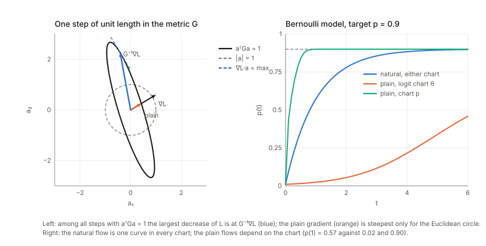
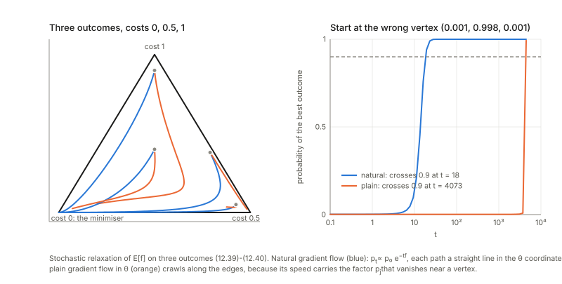

Notes for Chapter 12 of Amari, *Information Geometry and Its Applications* (Springer, 2016). The next section summarises the book's chapter in my own words. The sections after it are explorations that I asked for, one at a time, so they follow my questions and not the book's order. They keep the intuition, the figures and the derivations, and leave out numerical checks.

## What the chapter covers (a summary of the book's chapter)

The chapter asks what "steepest descent" should mean when the thing being learned is a probability distribution. The ordinary gradient treats every parameter as equally important, which is an accident of how the model was written down. The Fisher metric measures how much a step changes the *distribution*, and the steepest direction in that ruler is the **natural gradient**. The first half of the chapter shows where this direction appears and why it learns well. The second half studies the multilayer perceptron, whose parameter space contains *singular* sets where the Fisher metric degenerates, shows how this produces long plateaus for ordinary gradient learning, and shows that the natural gradient avoids them. The sections in order:

- **§12.1.1 On-line learning and batch learning.** The setting is supervised learning: noisy teacher outputs, a parameterised family of candidate functions, and a loss whose average over the true data (generalization error) can only be approximated by the average over the training set (training error). Typical losses are the squared error, the negative log likelihood and the logistic loss. Batch learning uses all examples per step. On-line learning uses one example per step and discards it, so each step is a noisy copy of the true gradient step, which is why it is called stochastic descent (the book notes this is back-propagation, with an early use by Amari in 1967). On-line learning is good at tracking a moving target, and the question left open is whether it pays for that in accuracy when the target is fixed.
- **§12.1.2 Natural gradient: steepest descent direction in a Riemannian manifold.** Among all small steps of the same length, measured with the metric of the space, the step that lowers the loss most is the inverse metric applied to the ordinary gradient. The ordinary gradient is a slope (covariant) and the natural gradient is a displacement (contravariant), and they coincide only in orthonormal coordinates of a flat space. The learning rule is stated for on-line and batch modes. When metric and loss both come from one log likelihood the method is a Gauss-Newton method, but the metric need not be related to the loss (independent component analysis, with the invariant metric on mixing matrices, is the example). The section lists uses in deep learning, policy gradients and stochastic relaxation.
- **§12.1.3 Riemannian metric, Hessian and absolute Hessian.** Newton's method uses the Hessian of the loss, and in high dimensions most critical points are saddles, which Newton's method is attracted to. For Gaussian noise the Fisher matrix is always non-negative, while the Hessian equals it minus a residual term that can have either sign. The two agree at the true parameter and wherever the model already gives the true function, and the book says they also agree in the singular regions met later. The saddle-free Newton method uses the Hessian with its eigenvalues replaced by their absolute values as the metric, so it is a natural gradient and is not trapped at saddles. It behaves like the Fisher natural gradient near the optimum and in singular regions.
- **§12.1.4 Stochastic relaxation of an optimization problem.** A hard problem, such as a discrete one, is turned into minimising the expected cost over a family of distributions, so ordinary gradient ideas apply. Since the family is a Riemannian manifold, the natural gradient with the Fisher metric is used, with a careful choice of family. Efficient ways to implement it are cited. The book does not claim a special closed form here.
- **§12.1.5 Natural policy gradient in reinforcement learning.** The policy is a family of conditional distributions over actions, with discounted state-value and action-value functions and a discounted state distribution. The Fisher matrix of the policy, averaged along trajectories, gives the natural policy gradient. If the action value is approximated linearly using the policy's score functions as features, the natural gradient equals the weight vector of that approximation, which is fitted online from the temporal-difference error (the natural actor-critic).
- **§12.1.6 Mirror descent and natural gradient.** Mirror descent for a convex function takes its step in the dual coordinates of a convex potential and maps back to the original coordinates. Because the dual-coordinate change is the metric times the primal change, the step in the original coordinates is exactly a natural gradient step with the Hessian of the potential as metric. The dually flat structure also allows e- and m-projections onto a constraint region, which the next chapter uses for sparse signals.
- **§12.1.7 Properties of natural gradient learning.** Five properties. (1) *Fisher efficiency* (Theorem 12.1): on-line natural gradient with learning constant $1/t$ has error covariance asymptotically equal to the inverse Fisher matrix over $t$, so it reaches the Cramér-Rao bound like batch maximum likelihood, and tracking ability costs nothing in efficiency. (2) *Saturation freedom* (Theorem 12.2): for a sigmoid unit or a deep stack of them, the plain gradient carries derivative factors that vanish when units saturate. The Riemannian size of the natural gradient step is the trace of a product of two matrices (the second moment of the loss gradient and the inverse Fisher matrix), does not vanish, and is about the number of parameters near the optimum. (3) *Adaptive natural gradient*: the inverse Fisher matrix is updated recursively from each example, avoiding repeated matrix inversion and the need to know the input distribution; the same trick gives the inverse Hessian. (4) *Approximations*: K-FAC uses a Kronecker factorisation of the layer blocks and a tridiagonal approximation of the inverse, and keeps enough of the singular structure to also avoid plateaus. (5) *Learning constant*: the classical conditions for convergence (steps whose sum diverges and whose squares sum to a finite value, such as $c/t$), and an adaptive rule that raises the constant when the loss is large and lowers it near the target, which converges at rate $1/t$ for a fixed target and tracks a moving one.
- **§12.2.1 Multilayer perceptron.** A three-layer perceptron with an input layer, one hidden layer of sigmoid units (an odd, error-function type) and one linear output unit, with all weights collected into one parameter vector. The perceptron is described as a universal approximator that has returned in deep learning. The set of all such networks is a manifold of parameters.
- **§12.2.2 Singularities in $M$.** Two parameters are equivalent when they give the same function. Sign flips and permutations of hidden units are isolated, harmless symmetries. The trouble is two continuous families. In the *eliminating* singularity a unit has output weight zero (its input weights are then arbitrary) or input weights zero (the unit does nothing). In the *overlapping* singularity two units have equal input weights, so only the sum of their output weights matters. These combine into an elementary critical region made of three pieces that all give one function, and the regions form a net across the parameter space. The space of functions, the behaviour manifold or neuromanifold, is then not a manifold at those points. Along the critical region the loss is constant and the Fisher matrix (and the absolute Hessian) has null directions, so its inverse diverges, and the model is not a regular statistical model.
- **§12.2.3 Dynamics of learning in $M$.** Two flaws of perceptron learning are named, local minima and plateaus, and the plateaus are traced to the symmetry structure. For two hidden units, with Gaussian inputs and averaged continuous-time dynamics, a new coordinate system (a difference of input weights, an asymmetry, and the weighted mean and total of the output weights) turns the critical region into simple sets. Two of the coordinates relax fast, and the other two obey slow equations. Every point of the critical region is an equilibrium, and stability depends on a matrix $K$ built from the residual and the curvature of the sigmoid. Theorem 12.3: if the teacher function lies in the critical region (the over-realizable case), the equilibria are stable. Theorem 12.4: if it lies outside, stability depends on whether $K$ is positive definite, negative definite or indefinite, and which part of the overlap set (by the asymmetry coordinate) is stable switches accordingly. Theorem 12.5 gives the learning trajectories near the overlap set in closed form.
- **§12.2.4 Critical slowdown of dynamics.** Case 1, teacher in the critical region: the distance from the overlap set shrinks with a cubic right-hand side, so convergence is algebraic and extremely slow. Case 2, teacher outside: the learner is attracted to the stable part of the overlap set, wanders near it under the noise of random inputs, drifts to the edge of the stable part and then leaves quickly. This differs from a saddle, whose basin has measure zero and which is escaped quickly by small perturbations. The basin of the critical region has positive measure, and in function space it is a Milnor attractor. A network contains many such regions, so the learning curve shows repeated plateaus.
- **§12.2.5 Natural gradient learning is free of plateaus.** Along the critical region the metric degenerates, so its inverse is infinite while the gradient is zero, and the product stays an ordinary number. For a teacher inside the critical region, the natural gradient dynamics converge at a linear rate, with no slowdown. A blow-down coordinate change (due to Cousseau and coauthors, algebraic geometry) collapses the critical region to a single point where the Fisher matrix is regular nearby, and the dynamics become a simple exponential decay. For a teacher outside, the trajectory enters the critical region and leaves again at once, still a Milnor attractor but with no waiting. The absolute-Hessian method behaves the same way, and an example learning curve compares adaptive natural gradient with ordinary back-propagation.
- **§12.2.6 Singular statistical models.** A model is regular when the parameter set is open and the Fisher matrix is non-singular. Singular models include mixtures, perceptrons, changing-time (Nile River) and ARMA models, and also location models with finite support whose Fisher information is infinite, which need a non-Riemannian (Finsler) geometry that is not yet developed. In regular models the log likelihood ratio is chi-square and the maximum likelihood estimator is asymptotically Gaussian with covariance the inverse Fisher matrix over the sample size. At a singular true parameter the estimator is not Gaussian, though it is still consistent at the usual rate, and Fukumizu showed that the likelihood ratio grows like $\log N$ for perceptrons and $\log\log N$ for mixtures. Model selection (choosing the number of hidden units) then breaks the derivations of AIC and MDL, since a smaller model sits in the critical region of a larger one. The book says the AIC penalty for perceptrons should scale like $\log N$ times the number of parameters, and points to Watanabe's criterion.
- **§12.2.7 Bayesian inference and singular models.** The prior adds a penalty to the log posterior, which fades with more data in regular models, so MAP approaches maximum likelihood. In a singular model a smooth prior on parameters piles up the prior mass of a whole critical region onto one singular point of function space, so smaller models get a large prior weight and MAP tends to choose a smaller model, with no guarantee of optimality. Watanabe's algebraic-geometry treatment is mentioned as beyond the book's scope.
- **Closing remarks.** The chapter's summary notes that the natural gradient (with Fisher or absolute Hessian metric, and with K-FAC) avoids singularity plateaus, and leaves open how learning behaves near a singularity when the true model is not in it. It also lists related topics (other metrics such as the Killing metric, Riemannian MCMC, natural Newton and conjugate gradient methods, efficient inverse-Fisher computation).

## Links

- **[Interactive companion](figures/interactive.html)**: seven widgets. (1) Steepest descent in a metric: the ellipse of steps of unit $G$-length, the natural against the plain direction, and what a change of chart does to each. (2) The exact error covariance of online learning in a Gaussian linear model, natural against plain gradient, with a $c/t$ learning constant.
  (3) Stochastic relaxation on three outcomes: the natural gradient is a constant vector. (4) Saturation of one erf neuron: the three sizes of the gradient, averaged iterations and an online simulation. (5) The Fisher matrix of the two-hidden-unit perceptron near the overlap singularity: eigenvalues against $u$, the null space on $R_o$. (6) Plain and natural gradient flows near $R_o$ for three teachers. (7) The adaptive learning constant: the averaged equations and the stochastic rule.
- The book: Amari, *Information Geometry and Its Applications* (Springer, 2016), DOI [10.1007/978-4-431-55978-8](https://doi.org/10.1007/978-4-431-55978-8). These notes cover Chapter 12 only; equation numbers such as (12.141) refer to the book.
  No text of the book is reproduced here; everything is restated and re-derived.
- Neighbouring chapters: **[Chapter 11: machine learning](../ch11-machine-learning/index.html)** (the previous one; its last section is on Bayesian inference and deep learning) and **[Chapter 13: signal processing and optimization](../ch13-signal-processing-and-optimization/index.html)** (independent component analysis, where the natural gradient on matrices is used).
  The asymptotic efficiency that §6 builds on is **[Chapter 7](../ch07-asymptotic-theory-of-inference/index.html)**, the Fisher metric is in **[Chapter 5](../ch05-elements-of-differential-geometry/index.html)**, and the Legendre pair used in §5 is in **[Chapter 1](../ch01-dually-flat-structure/index.html)** and **[Chapter 2](../ch02-exponential-and-mixture-families/index.html)**.
  Background on the annotations site: **[The Fisher information matrix](https://msrepo.github.io/theory_inclined_papers_with_annotations/fisher-information/)**.

## In one paragraph

To learn is to move a parameter vector $\xi$ downhill on a loss $L(\xi)$. "Steepest downhill" only has a meaning once you say how long a step is, and the ordinary gradient silently uses the ruler in which every coordinate counts the same. For a statistical model the natural ruler measures how different the *distributions* $p(\cdot;\xi)$ and $p(\cdot;\xi+d\xi)$ are: the Fisher metric $G$. The steepest direction in that ruler is $G^{-1}\nabla L$, the **natural gradient**; it does not depend on how the model was parametrised, and online learning with it and the gain $1/t$ reaches the Cramér–Rao bound, as the best batch estimator does (Theorem 12.1). It also is not slowed down when a unit saturates (Theorem 12.2), and it appears wherever a loss lives on a family of distributions: relaxation of a discrete optimisation problem, policy gradients, mirror descent.
The second half studies the multilayer perceptron, whose Fisher matrix is *singular* on whole sets of parameters: two hidden units with the same input weights, a unit with zero output weight. Near such a set the plain gradient flow crawls (plateaus, "critical slowdown") and a positive-measure set of starting points is attracted into it (a Milnor attractor); the natural gradient, because $G^{-1}$ blows up exactly where $\nabla L$ vanishes, passes through at an ordinary speed in function space.
I rebuilt both halves on small models where everything can be worked out exactly and examined each formula. Most of the chapter's *claims* hold (the steepest direction, Theorem 12.1, 12.2, the stability pattern of Theorems 12.3–12.4, the blow-down equations (12.153)–(12.158)); a number of printed *formulas* do not, among them the second-order expansion (12.139), the rates (12.141)–(12.142) and the exponent in (12.147); and two claims are not what they seem: the natural gradient's step in parameter units explodes at saturation and near the singular set, and the saddle-free Newton method does not behave like the natural gradient near the critical region.

## The spine of the argument

1. Of all steps of a fixed length in a metric $G$, the one lowering $L$ most is $G^{-1}\nabla L$. It is a vector, the ordinary gradient a covector; so the natural gradient flow is chart independent and the plain one is not (§1).
2. The Fisher matrix $G$ equals the Hessian $H$ of the loss only at (and where the model reproduces) the truth, $H=G-\mathbb E[(f_0-f)\nabla\nabla f]$; $G$ is always positive semidefinite, which is why the natural gradient is not trapped at saddles (§2).
3. The natural gradient is the right object in several settings: it is the constant vector $f_i-f_0$ in stochastic relaxation (§3), the coefficient vector $w$ of a compatible critic in policy gradients (§4), and the first-order form of mirror descent (§5).
4. Online natural gradient with gain $1/t$ is Fisher efficient: the error covariance $V_t$ obeys $V_{t+1}=(1-2/t)V_t+G^{-1}/t^2$, solved by $G^{-1}/t$ (§6). It does not shrink when a sigmoid saturates (§7), $G^{-1}$ can be tracked by a rank-one recursion (§8), and the gain can itself be adapted (§9).
5. A perceptron's output is unchanged by sign flips, permutations, and on the critical region $R$ by continuous families of weights; there the Fisher matrix degenerates (§10).
6. In the chart $(u,z,s,r)$ the plain gradient flow near the overlap set $R_o$ reduces to two equations whose stability is governed by the sign of $(1-z^2)K$: slow convergence $u\sim t^{-1/2}$ if the teacher is in $R$, trapping on part of $R_o$ otherwise (§11–§12).
7. In blow-down coordinates $\mu=(\delta,\gamma)$ the Fisher matrix is regular and the natural gradient flow is $\dot\mu=-\mu$: no plateau (§13).
8. Singular models violate the regularity behind AIC, MDL and the Gaussian limit of the maximum likelihood estimator (§14; one toy model, the cited theorems not examined).

## Setup and notation

| Symbol | Meaning | Example |
|---|---|---|
| $\xi$ | all parameters of the learner | $(w_1,w_2,v_1,v_2)$ for the perceptron |
| $l(x,y;\xi)$, $L(\xi)$ | instantaneous loss; its expectation (12.3)–(12.4) | $\tfrac12(y-f)^2$ |
| $\nabla L$ | ordinary gradient, components $\partial_jL$ (a covector) | |
| $G(\xi)$ | Fisher information, the metric: $\mathbb E_\xi[\nabla l\,\nabla l^{\mathsf T}]=\mathbb E_x[\nabla f\nabla f^{\mathsf T}]$ for unit Gaussian noise (12.34) | |
| $\tilde\nabla L=G^{-1}\nabla L$ | natural gradient (12.22), a vector $A^i=g^{ij}\partial_jL$ (12.24) | |
| $H(\xi)$ | Hessian of $L$ (12.30); $\lvert H\rvert=O^{\mathsf T}\operatorname{diag}(\lvert\lambda_i\rvert)O$ (12.37) | |
| $\eta_t$ | learning constant (gain) | $c/t$, $c/(t+t_0)$ |
| $\bar G$ | $\mathbb E_{\xi_0}[\nabla l\,\nabla l^{\mathsf T}]$, second moment of the gradient under the truth (12.81) | |
| $\varphi$, $w_i$, $v_i$ | sigmoid $\varphi(u)=\operatorname{erf}(u/\sqrt2)$ (12.103); input and output weights, $f=\sum_iv_i\varphi(w_i\cdot x)$ | scalar input $x\sim N(0,1)$, two units |
| $R$, $R_o$, $R_e$ | critical region; overlap part ($w_1=w_2$); elimination part ($v_1v_2=0$) (12.113)–(12.135) | |
| $M$, $\tilde M=M/{\approx}$ | parameter space; the space of output functions obtained by identifying equivalent weights, the *behaviour manifold*, which is a manifold only after the singular points are removed (12.111) | |
| $\zeta=(u,z,s,r)$ | $u=w_2-w_1$, $z=\frac{v_1-v_2}{v_1+v_2}$, $s=\frac{v_1w_1+v_2w_2}{v_1+v_2}$, $r=v_1+v_2$ (12.130)–(12.132); $R_o=\{u=0\}$, $R_e=\{z=\pm1\}$ | |
| $K$ | $\frac r4\,\mathbb E[(f_0-f)\,\varphi''(sx)x^2]$ (12.143), a number for scalar input | |
| $\mu=(\delta,\gamma)$ | blow-down: $\delta=(1-z^2)u^2$, $\gamma=z(1-z^2)u^3$ (12.155)–(12.156) | |

**Running examples**, all small enough to be worked exactly: a $2\times2$ metric; the Bernoulli model in two charts; a three-outcome distribution with costs $0$, $\tfrac12$ and $1$; a small Markov decision process; the Gaussian linear model $y=\xi\cdot x+\varepsilon$ with two input directions of very different variance, whose online error covariance obeys an *exact* recursion; a two-dimensional logistic regression; one erf neuron; and, for the whole second half, the **two-hidden-unit perceptron** $f=v_1\varphi(w_1x)+v_2\varphi(w_2x)$ with scalar input $x\sim N(0,1)$. For this $\varphi$ every Gaussian average of a product of two units is a closed form,
$$\mathbb E[\varphi(ax)\varphi(bx)]=\frac2\pi\arcsin\frac{ab}{\sqrt{(1+a^2)(1+b^2)}},$$
and its derivatives in $a$ and $b$ give the gradient, the Fisher matrix and the Hessian of the expected loss exactly. Three teachers $f_0$: $T_{\rm in}=\varphi(x)$ (one neuron, inside $R$), $T_{\rm pos}=10\varphi(0.4x)+5\varphi(4x)$ and $T_{\rm neg}=10\varphi(0.3x)-10\varphi(x)$ (two neurons, outside $R$; $K$ is positive for the first and negative for the second).

## 1. Batch, on-line, and the steepest direction (§12.1.1–12.1.2)

**In plain words.** A learner has a loss that it wants small. *Batch* learning averages the gradient over all training examples before each step; *on-line* learning takes a step after every single example, and each step is a noisy copy of the true gradient. Now suppose you want the direction of steepest descent. Look at all steps of length $\varepsilon$ and pick the one that lowers $L$ most. If "length" is the ordinary Euclidean length, the answer is the negative gradient. But if the coordinates are not on equal footing (one parameter is a probability near $0$, another a scale; a step of $0.01$ means very different things), the set of "equally long" steps is an ellipse and the answer changes. In a model of probability distributions the right ellipse is the one where steps are equally long when they change the distribution by the same amount, which is what the Fisher matrix $G$ measures to second order.

*A concrete case.* Take a $2\times2$ metric $G$ and a gradient that is not an eigenvector of it. Searching over all directions on the ellipse $a^{\mathsf T}Ga=1$ for the largest decrease $\nabla L\cdot a$ finds the direction of $G^{-1}\nabla L$, and its decrease is $\sqrt{\nabla L^{\mathsf T}G^{-1}\nabla L}$. The plain gradient, rescaled to the same $G$-length, decreases $L$ by a smaller amount; the square of the ratio is $(g\cdot g)^2/\big((g^{\mathsf T}Gg)(g^{\mathsf T}G^{-1}g)\big)$, which is $1$ only if $\nabla L$ is an eigenvector of $G$ (Cauchy–Schwarz).

**Formal statement.** Maximise $\nabla L\cdot a$ subject to $a^{\mathsf T}Ga=1$ (12.17)–(12.20). A Lagrange multiplier gives $\nabla L=2\lambda Ga$, so $a\propto G^{-1}\nabla L$ (12.21); this is the natural gradient (12.22), and the learning rules (12.27)–(12.28) replace $\nabla l$ by $\tilde\nabla l$, one example at a time or averaged over $T$ of them.

**Vector against covector.** Under a change of chart $\xi'=J\xi$ the gradient components transform with the inverse Jacobian, $\nabla'L=J^{-\mathsf T}\nabla L$ (a covector, index down: a slope), the metric as $G'=J^{-\mathsf T}GJ^{-1}$, and the natural gradient as $\tilde\nabla'L=J\tilde\nabla L$ (a vector, index up: a displacement). So $G'^{-1}\nabla'L=JG^{-1}\nabla L$ exactly, while $\nabla'L\neq J\nabla L$ in general. The two agree only when $G=I$ (12.26), which is the book's remark. (Strictly, for one given $L$ they can also coincide by accident; the statement is about all $L$.)

**Chart independence of the flow.** Take the Bernoulli model with a target probability $0.9$ and loss $L=-0.9\log p-0.1\log(1-p)$. The natural gradient flow is $\dot p=-(p-0.9)$, i.e. $p(t)=0.9-(0.9-p(0))e^{-t}$, **in the logit chart and in the chart $p$ alike**. The plain gradient flows from the same start are different curves in the two charts: in the logit chart it is very slow from a start near $p=0$ (the slope in $\theta$ carries a factor $p(1-p)$ that is tiny there), while in the chart $p$ it is fast (accidentally natural-like, because $dL/dp$ is huge near $p=0$). Only the natural flow is the same curve in both.

**On-line against batch.** The book (§12.1.1) fears that on-line learning loses efficiency compared with the batch estimator and then says this is not so; §6 examines the efficiency claim. I did not examine the remark that on-line learning can follow a drifting target, which is the reason the learning constant of §9 is adapted.

## 2. Fisher matrix, Hessian and the absolute Hessian (§12.1.3)

**In plain words.** Newton's method uses the curvature $H$ of the loss: step $-H^{-1}\nabla L$. It converges fast near a minimum but near a *saddle* (a point that is a minimum in some directions and a maximum in others) $H$ has a negative eigenvalue and Newton's method is attracted *to* the saddle. The natural gradient uses the Fisher matrix instead, which is positive semidefinite by construction, so it cannot do that. The relation is explicit for regression with unit Gaussian noise: $G=\mathbb E_x[\nabla f\,\nabla f^{\mathsf T}]$ and
$$H=G-\mathbb E_x\big[(f_0-f)\,\nabla\nabla f\big]\qquad(12.34\text{–}12.35),$$
the second term being the model's residual times its own curvature. At the truth (and wherever the model reproduces the teacher's output) the residual is zero and $H=G$; that is why on a well-specified model the natural gradient step is a Gauss–Newton step.

*On the perceptron.* The Hessian obtained by differentiating the exact gradient agrees with $G-\mathbb E[(f_0-f)\nabla\nabla f]$, as it must. In general $G$ and $H$ are different matrices, so the first equality of **(12.32), $G=\nabla\nabla L$, is wrong as printed**: $G(\xi)$ is $\mathbb E_{p(\xi)}[\nabla\nabla l]$ (average over the model's own distribution), while $\nabla\nabla L$ of (12.33) averages over the true one, and they coincide only there. With a teacher *inside* $R$ and a point of $R_o$ or $R_e$ (output equal to the teacher's, $L=0$) the two matrices are equal; at a point with a different output they are not.

**The book's claim that $G$ and $H$ coincide at the critical and singular regions of the perceptron fails when the teacher is outside $R$.** Take $T_{\rm pos}$; the best single neuron is some $r\varphi(sx)$ with loss $L_1>0$, and $K\neq0$. On $R_o$ with $(s,r)$ at that optimum the gradient vanishes, so it is a critical set, but $H$ differs from $G$ there, it carries the number $K$, and it has a negative eigenvalue exactly where $(1-z^2)K>0$ (which will be the unstable part of $R_o$ in §11). Note also that $G$ has **two** zero eigenvalues on $R_o$ while $\lvert H\rvert$ has one: §13 uses this.

*The saddle-free Newton method* (12.36)–(12.38) replaces $H$ by $\lvert H\rvert$. On the toy saddle $L=\tfrac12(x^2-y^2)$ the linearised update maps show the pattern the book describes: plain gradient descent and a natural gradient with a positive definite metric both leave along $y$, Newton's method is attracted to the saddle (its update map kills both directions), and saddle-free Newton leaves along $y$ as well.

## 3. Stochastic relaxation (§12.1.4)

**In plain words.** To minimise a function $f$ on a finite set (hard if the set is huge or discrete), replace it by the expected cost $L(p)=\mathbb E_p[f]$ over a family of probability distributions $p$ and let $p$ drift by gradient descent; $p$ ends up concentrated on a minimiser. On the family of all distributions on three outcomes, in the natural parameters $\theta_i=\log(p_i/p_0)$, the cost is *linear* in the expectation parameters $\eta_i=p_i$, and the metric is $G=\partial\eta/\partial\theta$. Hence
$$\tilde\nabla_\theta L=G^{-1}\partial_\theta L=\partial L/\partial\eta=(f_i-f_0)_i\qquad\text{at every }p,$$
a **constant vector** (the book states (12.40) and says the method works well for a carefully chosen model; this is the exact statement). It does not depend on $p$ at all, even at a point very close to a vertex of the simplex.

The natural flow is therefore a straight line in $\theta$, $\theta'=-(f_i-f_0)$, that is **exponential reweighting** $p_t\propto p_0e^{-tf}$. The plain gradient is $p_j(f_j-L)$ and carries a factor $p_j$ that dies near a vertex. Starting at the *wrong* vertex (almost all mass on a bad outcome) the plain gradient takes a very long time to move, because every component carries a vanishing factor, whereas the natural gradient takes a short time that depends only on the cost gaps. This is the cleanest picture of why the natural gradient does not suffer from saturation (§7).

## 4. Natural policy gradient (§12.1.5)

**In plain words.** In reinforcement learning a *policy* $\pi(u\mid x;\theta)$ picks an action $u$ in state $x$ and the learner wants to raise the discounted reward $J(\theta)$. The metric is the average Fisher information of the policy over visited states, $G=\int d^\pi(x)F(\theta\mid x)\,dx$ (12.46)–(12.47), where $d^\pi$ is the discounted visitation weight (it sums to $1/(1-\gamma)$, not $1$). The natural policy gradient is $G^{-1}\nabla J$. The book's trick: approximate the action-value function by a linear combination of the *compatible* features $a(x,u)=\nabla_\theta\log\pi(u\mid x)$, $Q\approx a\cdot w$; then $\nabla J=Gw$ and so $\tilde\nabla J=w$ (12.49)–(12.53): the natural gradient is just the critic's weight vector.

*Check of the idea.* On a small random MDP with a softmax policy the policy-gradient formula (12.51) agrees with the derivative of $J$; with $w$ the weighted least-squares fit of $Q$ on $a$, $\nabla J=Gw$ holds exactly, and $G=\sum dF$ equals $A^{\mathsf T}WA$ for the matrix $A$ of features. For a tabular softmax $G^{-1}\nabla J$ is exactly the table $Q(x,u)-Q(x,0)$, whatever the state weights are: natural policy gradient is a soft policy-improvement step.

**The recursion (12.55)–(12.56) cannot be right as printed.** $a(x)=\int\pi(u\mid x)\,a(x,u)\,du$ is the expected score, which is identically $0$, so $w_{t+1}=w_t+\alpha\delta_ta(x_t)$ never moves $w$. What works is the least-mean-squares form $w\leftarrow w+\alpha(\delta_t-a\cdot w)\,a(x_t,u_t)$ with the *sampled* action: its mean is $\bar E-Mw$ ($\bar E$ the mean of $\delta a$, equal to $\nabla J$ since the mean TD error given $(x,u)$ is the advantage $Q-V$), and its fixed point is $G^{-1}\nabla J$. Without the term $-a\cdot w$ the expected update is $\nabla J$: the vanilla policy gradient.

## 5. Mirror descent (§12.1.6)

**In plain words.** Mirror descent works with a convex potential $\psi(\theta)$ and its Legendre dual: the dual coordinates $\eta=\nabla\psi(\theta)$ are updated by the *plain* step $\eta_{t+1}=\eta_t-\varepsilon\nabla f(\theta_t)$ (12.59) and mapped back, $\theta_{t+1}=\nabla\varphi(\eta_{t+1})$ (12.60). It is the dually flat structure of Chapter 1 used as an optimiser. The book says this is the natural gradient for the metric $G=\nabla\nabla\psi$.

*Check of the idea* (Bernoulli, $\psi=\log(1+e^\theta)$): the mirror step and the natural step $-\varepsilon G^{-1}f'$ differ at second order in the step, by a term of the form $\tfrac12\varepsilon^2G'f'^2/G^3$. So (12.61)–(12.62) hold **to first order** in the step. In continuous time the two are the same flow.

**The book's argument that the update is invariant because $\eta$ and $\nabla f$ are both covariant holds only for affine changes of chart.** The mirror map $\eta=\nabla\psi$ is tied to the chart in which $\psi$ is the potential. Run the mirror flow with the potential $\psi(h(\tau))$ in a new chart $\theta=h(\tau)$ (so that the *same* convex function of the same point is used): for an affine $h$ one gets the same flow, but for a non-affine $h$ such as $\tau+0.3\tau^2$ (convex in $\tau$, a perfectly good change of chart) the flow ends up in a different place. The natural gradient flow is the same in every chart. The honest statement is that mirror descent is the natural gradient flow of the *dually flat* structure, and agrees with a chart-free statement only up to affine changes.

## 6. On-line natural gradient is Fisher efficient (§12.1.7.1)

**In plain words.** Given $t$ examples from the model, no estimator that is on average right can have an error covariance below $G^{-1}/t$ (the Cramér–Rao bound of Chapter 7), and the batch maximum likelihood estimator attains it for large $t$. On-line learning sees each example once and throws it away, so one expects to lose something. Theorem 12.1 says that with the natural gradient and the learning constant $\eta_t=1/t$ nothing is lost asymptotically.

**The proof, restated.** Let $e_t=\xi_t-\xi_0$ and $V_t=\mathbb E[e_te_t^{\mathsf T}]$. Expand the update around the truth: $e_{t+1}=(I-\tfrac1tG^{-1}\nabla\nabla l)e_t-\tfrac1tG^{-1}\nabla l(\xi_0)$. The new example is independent of $e_t$, $\mathbb E\nabla l=0$, $\mathbb E\nabla\nabla l=G$ and the variance of the score is $G$, so
$$V_{t+1}=V_t-\tfrac2tV_t+\tfrac1{t^2}G^{-1}+O(t^{-3})\qquad(12.66),$$
and $V_t=G^{-1}/t$ solves it (12.70): $V_{t+1}-V_t$ is $-G^{-1}/t^2$ on the left and $-2G^{-1}/t^2+G^{-1}/t^2$ on the right. (The homogeneous solutions decay like $t^{-2}$.) Everything hinges on the coefficient $1$ in front of $1/t$ and on the score variance equalling $G$.

**An exact version.** For the Gaussian linear model $y=\xi\cdot x+\varepsilon$ with unit noise variance and an input covariance with one large and one small eigenvalue, the covariance recursion can be written exactly with Isserlis' formula for the fourth moment of a Gaussian: one step is $V\to V-\eta(PGV+VGP)+\eta^2[2PGVGP+PGP\operatorname{tr}(GV)]+\eta^2PGP$, with $P=G^{-1}$ (natural) or $I$ (plain). Iterating it shows the picture the theory predicts. With the natural gradient and $c=1$, $t\lambda_a\operatorname{Var}_a$ (the ratio to the Cramér–Rao value) tends to $1$ in both eigen-directions. With another $c>\tfrac12$ the ratio tends to a constant above $1$, with $c=\tfrac12$ it grows, and the plain gradient cannot be efficient in both directions at once.

**The learning-rate conditions.** With a schedule $c/t$ and the natural gradient the limit is $c^2/(2c-1)$ for $c>\tfrac12$, equal to $1$ only at $c=1$ (the theorem's proviso on the learning constant means exactly $c=1$); at $c=\tfrac12$ the variance grows; for $c<\tfrac12$ the error variance decays like $t^{-2c}$, slower than $t^{-1}$. For the plain gradient the factor in direction $a$ is $(c\lambda_a)^2/(2c\lambda_a-1)$ and needs $c\lambda_a>\tfrac12$ to have a $1/t$ rate at all: with a small $c$ the flat direction (small $\lambda$) has an error variance that decays far slower than $1/t$; with a large $c$ the flat direction is fine but the steep one pays a constant factor above $1$. No single $c$ is efficient in both directions unless $G$ is a multiple of $I$; that is what the natural gradient buys. The book's $\sum\eta_t$ and $\sum\eta_t^2$ conditions (12.87) say only that the algorithm converges, not that it is efficient.

**Batch against on-line.** Ordinary least squares in this model has $\mathbb E\operatorname{Cov}=G^{-1}/(t-k-1)$, so its ratio to the bound is $t/(t-k-1)$, slightly above $1$ at finite $t$. The on-line value is also slightly above $1$ at finite $t$ and approaches $1$ as $t$ grows: an $O(1/t)$ cost from the start, vanishing in the limit.

**A non-Gaussian model.** The same picture holds for a two-dimensional logistic regression $P(y=1\mid x)=\sigma(\xi\cdot x)$ with inputs of unequal variances, started at the truth (the local regime the proof uses) with a gain $1/(t+t_0)$ (the shift avoids a wild first step; its only effect is a shrinkage factor in the linear theory). Each estimate can be compared with the linearised oracle $S_t=G^{-1}\cdot$(mean score at $\xi_0$), whose covariance is exactly $G^{-1}/t$ (a control variate, which removes most of the Monte Carlo noise of the natural estimators). The natural gradient with the exact $G(\xi_t)$ behaves as the linear theory says, as does batch maximum likelihood; the plain gradient loses a constant factor in the steep direction. So the natural gradient has nothing left to lose, the plain gradient does.

## 7. Saturation (§12.1.7.2)

**In plain words.** A sigmoid unit $\varphi(w\cdot x)$ with large weights is almost always at its ceiling or floor, where its slope $\varphi'$ is nearly $0$. The gradient of the loss carries a factor $\varphi'$ and nearly vanishes: learning stalls. For a deep network the factors multiply layer by layer. The book argues that the natural gradient is free of this, because its size is measured with the metric $G$, which carries the same factors.

**Theorem 12.2.** The Riemannian size of the natural gradient is $\mathbb E\lVert\tilde\nabla l\rVert^2=\operatorname{tr}(\bar GG^{-1})$ (12.80), because $\mathbb E[\nabla l^{\mathsf T}G^{-1}\nabla l]=\operatorname{tr}(G^{-1}\mathbb E[\nabla l\nabla l^{\mathsf T}])$; at the truth $\bar G=G$ and it equals the number $k$ of parameters (12.82). Away from the truth $\bar G=G+\mathbb E[(f_0-f)^2\nabla f\nabla f^{\mathsf T}]\ge G$, so the size is at least $k$ however small $\varphi'$ is.

*One erf neuron*, $f=\varphi(wx)$ with a true weight $w_0$ and unit noise, has the closed-form Fisher information $G(w)=\frac2\pi(1+2w^2)^{-3/2}$ at $w_0=1$. Three sizes of the gradient can be compared as $w$ grows. The plain gradient's squared size $\bar G$ falls roughly like $w^{-3}$; the natural gradient's Riemannian size $\operatorname{tr}(\bar GG^{-1})$ stays of order $1$, never below $1$ and growing only slowly. *But the third size*, the squared length of the natural *step in parameter units*, $\bar G/G^2$, grows like $w^3$: with gain $1$ a single sample moves $w$ by many units once $w$ is large.

**Consequences.** On the averaged iteration from a large $w$ back to the truth the plain gradient needs a very large number of steps, the natural gradient only a handful, provided the gain is moderate. Online (one sample per step) the picture is the same for a small natural gain, while a large natural gain throws the runs far away and they do not come back. The book's claim that the natural gradient is free of saturation is true of the *direction and Riemannian size*; in parameter units the natural step is as dangerous as $G^{-1}$ is large, and the gain must be small enough to compensate. The same $G^{-1}$ that rescues the gradient at saturation causes the divergences of §13.

## 8. Adaptive natural gradient and its approximations (§12.1.7.3–12.1.7.4)

**In plain words.** The natural gradient needs $G^{-1}(\xi_t)$ at every step, which is expensive and needs the input distribution. The book proposes to track it recursively from the gradients that are computed anyway, using $\mathbb E[\nabla l\nabla l^{\mathsf T}]=G$.

**What (12.84)–(12.85) really are.** The book introduces (12.85), $G^{-1}_{t+1}=(1+\varepsilon_t)G_t^{-1}-\varepsilon_tG_t^{-1}\nabla l\nabla l^{\mathsf T}G_t^{-1}$, as the result of Taylor expanding $G(\xi_{t+1})$ with $\xi_{t+1}=\xi_t-\eta_tG^{-1}\nabla l$ and inverting. A Taylor expansion of $G$ would contain the derivative of $G$ with respect to $\xi$, which does not appear in (12.85). The recursion is instead the **first-order (in $\varepsilon$) Sherman–Morrison inverse of the running average** $G_{t+1}=(1-\varepsilon_t)G_t+\varepsilon_t\nabla l\nabla l^{\mathsf T}$. Against the exact inverse the error is $O(\varepsilon^2)$, as one expects from dropping the second-order terms of the expansion.

**It is not positive definite by construction.** The subtraction of a rank-one term can destroy positive definiteness when $\varepsilon_t\,\nabla l^{\mathsf T}G^{-1}\nabla l$ is not small. With a wrong initial $G^{-1}$ and a large $\varepsilon_t$ at the start, the first-order recursion can lose positive definiteness within a few hundred steps in a noticeable share of runs, and with a smaller $\varepsilon_t$ it does not; the exact Sherman–Morrison form stays positive definite always. Once $\varepsilon$ is small the two give practically the same results, so the first-order truncation is harmless there.

*Performance.* With a wrong initial $G^{-1}$ the adaptive runs have a too small effective gain at first, so their efficiency ratios creep up toward the exact natural gradient's from below. I did not test the adaptive method on a multilayer network.

**Approximations (K-FAC).** The book remarks that the Kronecker and tridiagonal approximations keep most of the singular structure. I examined the coarsest part, a **layer-wise block-diagonal $G$** (input weights $\mid$ output weights) for the perceptron: on $R_o$ both null vectors of §10 survive; but near $R_o$ its two small eigenvalues both shrink like $u^2$, whereas those of the true $G$ shrink like $u^2$ and $u^6$. So the *location* of the singularity is kept; the strength of the blow-up of the inverse is not. The Kronecker factorisation itself I did not examine.

## 9. The learning constant (§12.1.7.5)

**In plain words.** A big gain moves fast but fluctuates; a small gain is accurate but slow. Stochastic approximation theory asks for $\sum\eta_t=\infty$ (enough total movement to get anywhere) and $\sum\eta_t^2<\infty$ (noise averages out): $c/t$ qualifies. **(12.87) is printed with $\sum\eta_t>\infty$, a misprint for $=\infty$.** The book then proposes the rule $\eta_{t+1}=\eta_t\exp\{\alpha[\beta\,l_t-\eta_t]\}$ (12.90): the gain grows when the instantaneous loss is large and shrinks when it is small.

**The averaged equations.** With $e_t=\tfrac12\tilde\xi^{\mathsf T}G_0\tilde\xi$ the error, (12.97)–(12.98) read $\dot e=-2\eta e$, $\dot\eta=\alpha\beta\eta e-\alpha\eta^2$, and the book states the solution $e_t\simeq\frac1\beta\big(\frac12-\frac1\alpha\big)\frac1t$, $\eta_t\simeq\frac1{2t}$ (12.99)–(12.100). Substituting $\eta=a/t$, $e=b/t$ gives $a=\tfrac12$ and $b=\frac1\beta(\frac12-\frac1\alpha)$, **which needs $\alpha>2$** (otherwise $b\le0$ although $e$ is a square). Integrating the equations confirms the formula for $\alpha>2$. For $\alpha=2$ the formula gives $0$ and $te_t$ decays slowly; for $\alpha<2$ what happens is $t\eta_t\to1/\alpha$ with $e_t$ decaying faster than $1/t$.

**With real sampling.** The stochastic rule on $y=\xi x+\text{noise}$ ($x\sim N(0,1)$, so $G=1$, natural gradient step) agrees with the averaged analysis in the *realisable* (noise-free) case. **With noise it does not**: the gain stalls at the value $\beta\sigma^2/2$ at which $\beta\langle l\rangle=\eta$, with $\langle l\rangle=\sigma^2/2$ the irreducible loss, and $t\eta_t$ grows linearly. (12.95) replaces $\langle l\rangle$ by the error $e_t$, i.e. it assumes the loss is measured from its minimum, which the instantaneous loss of a noisy problem is not; as stated, the rule then behaves as a *tracker*, not a converging schedule, which is the use the book has in mind for moving targets. Note also that $t\eta_t\to\tfrac12$ is the boundary value $c=\tfrac12$ of §6: with noise a gain $\tfrac1{2t}$ would not even give a $1/t$ error.

## 10. The perceptron and its singular regions (§12.2.1–12.2.2)

**In plain words.** A three-layer perceptron computes $f(x)=\sum_iv_i\varphi(w_i\cdot x)$: $m$ hidden units, each a sigmoid of a weighted sum of the input, combined linearly. Different weights can give the *same function*: $\varphi$ is odd, so flipping the signs of $(w_i,v_i)$ changes nothing, and permuting the units changes nothing. These are the isolated symmetries ($2^mm!$ elements; the book writes $\xi\approx-\xi$, which is only the flip of all units at once). The serious trouble is *continuous* families of equivalent weights. Two units with the same input weights, $w_1=w_2=w$, compute $(v_1+v_2)\varphi(w\cdot x)$ whatever $v_1-v_2$ is; a unit with $v_i=0$ does nothing whatever $w_i$ is; a unit with $w_i=0$ outputs $0$ whatever $v_i$ is. Together: the **critical region** $R$ (12.113)–(12.125), the overlap part $R_o$ and the elimination part $R_e$. On $R_o$ the loss takes one value for all $z$; on $R_e$ for all $w_2$.

**The chart.** Since $R_o$ is only a line inside the four-dimensional parameter space, the book switches to $\zeta=(u,z,s,r)$: $u=w_2-w_1$ is the distance of the two input weights, $r=v_1+v_2$ the total output weight, $s$ the output-weighted mean input weight and $z=(v_1-v_2)/(v_1+v_2)$ the asymmetry. Then $w_1=s+\frac{z-1}2u$, $w_2=s+\frac{z+1}2u$, $v_1=\frac r2(1+z)$, $v_2=\frac r2(1-z)$ and the output is (12.138); this is just the same function written in new variables. $R_o=\{u=0\}$ and $R_e=\{z=\pm1\}$ (12.133). Expanding in $u$ (the linear term vanishes because $s$ is the weighted mean),
$$f=r\varphi(sx)+\frac r8(1-z^2)\,u^2J(x)+\frac r{24}\,z(1-z^2)\,u^3\,\varphi'''(sx)x^3+O(u^4),\qquad J=\varphi''(sx)x^2.$$
**(12.139) as printed lacks the factor $r$ in the second term.** With the factor missing, the expansion is off already at order $u^2$ whenever $r\neq1$; with it, the error falls like $u^3$. The definition $K=\frac r4\langle(y-f)J\rangle$ (12.143) is consistent with the corrected form.

**The Fisher matrix on $R$ is degenerate, but the book's description is incomplete.** (12.126)–(12.127) say the null directions of $G$ are the directions inside $R$. At a generic point $G$ has four positive eigenvalues, some of them small. On $R_o$ there are **two** zero eigenvalues. The null vectors are $(0,0,1,-1)$ (along $R_o$; $z$ changes, $f$ does not) and $(v_2,-v_1,0,0)$ (move the two input weights apart at fixed $s$: $f$ changes only at second order in $u$); $R_o$ itself is one-dimensional. For an input of dimension $n$ the second family becomes $(v_2b,-v_1b,0,0)$ for any $b\in\mathbb R^n$: the null space has dimension $n+1$ while $R_o$ stays a line. On $R_e$ the rank is $3$, with one null direction (the weight $w_2$ of the dead unit), as the book says.

**How fast $G$ degenerates.** The book only says that $G^{-1}$ diverges. Close to $R_o$, the two small eigenvalues scale like $u^6$ and $u^2$ and the determinant like $u^8$. Not $u^2$ and $u^4$ as the $u$- and $z$-directions would suggest: $\partial f/\partial u\approx\frac r4(1-z^2)uJ$ and $\partial f/\partial z\approx-\frac r4zu^2J$ are both multiples of the *same* function $J(x)$ at leading order, so their Gram determinant cancels and only the next term ($\varphi'''x^3$) separates them. This is why a plain Taylor count of orders in $u$ is not enough and the book needs the blow-down.

**Blow-down.** In the coordinates $\mu=(\delta,\gamma,s,r)$ with $\delta=(1-z^2)u^2$ and $\gamma=z(1-z^2)u^3$ (12.155)–(12.156) the output is $f\approx r\varphi(sx)+\frac r8\delta J+\frac r{24}\gamma\varphi'''x^3$: the coefficients of the first two non-trivial terms of the expansion. The Fisher matrix $G_\mu=M^{-\mathsf T}GM^{-1}$, $M=\partial\mu/\partial\xi$, stays finite and invertible as $u\to0$: its limit is the Gram matrix of the four functions $\frac r8J,\frac r{24}\varphi'''x^3,r\varphi'x,\varphi$, which are linearly independent, while $G$ itself degenerates. So in these coordinates the matrix is regular up to and including the singular point, the property (12.155)–(12.157) rely on. (The image of the two-neuron family in the plane $(\delta,\gamma)$ is the plane minus a cusp $\delta<0$, $\lvert\gamma\rvert<\lvert\delta\rvert^{3/2}$: the singular point is on the boundary of the image, which is one more way to see that $\tilde M$ is not a manifold there.)

## 11. Dynamics near the overlap singularity (§12.2.3)

**In plain words.** Suppose the learner has two hidden units and the loss is minimised by gradient flow $\dot\xi=-\nabla L$ (the average of the stochastic update over examples, (12.129)). Points of $R_o$ with the optimal $(s,r)$ are equilibria: the loss is flat along $R_o$ and the units' common weight is already the best a single unit can do. The question is what the flow does *near* $R_o$. For a teacher that is a single neuron the best single unit is the teacher and $R_o$ is a set of global minima; for a teacher outside $R$ (here: a different two-neuron function) it is a plateau at the loss $L_1$ of the best single neuron.

**The reduced equations and their stability pattern.** Keeping the second-order term, the book finds $\dot u=2(1-z^2)Ku$, $\dot z=-\frac{z(z^2+3)}{r^2}Ku^2$ (12.141)–(12.143) (with $\eta=1$), where $K$ measures whether the residual of the best single unit correlates with the curvature function $J$. The coefficient $(1-z^2)$ is positive when $v_1,v_2$ have the same sign ($\lvert z\rvert<1$) and negative when the signs differ; near $R_o$ the loss is $L\approx L_1-\tfrac12K(1-z^2)u^2$. So $u$ shrinks, and $R_o$ is stable, exactly when $(1-z^2)K<0$: for $K>0$ on $\lvert z\rvert>1$ (Theorem 12.4 (1)), for $K<0$ on $\lvert z\rvert<1$ (case (2)). **The signs agree with the exact flow in both cases** ($T_{\rm pos}$ has $K>0$, $T_{\rm neg}$ has $K<0$). Case (3), indefinite $K$, needs vector inputs and I did not examine it.

**The printed rates are wrong, the pattern is right.** The rate at which $u=u_0e^{\lambda t}$ grows or decays on the exact flow, started at $(s,r)$ equal to the single-neuron optimum and measured after the fast variables have settled, has the sign the theorem predicts in every case I tried, but its size is a fraction of the printed value $2(1-z^2)K$, and the fraction gets smaller as $\lvert z\rvert$ grows.

*Why, and what is right.* The book assumes the fast variables $(s,r)$ have already settled to the optimum of the single-neuron problem, i.e. that the residual $e=f-f_0$ is orthogonal to $\varphi(sx)$ and to $\varphi'(sx)x$ (call these overlaps $A_0$ and $A_1$ and set them to $0$). But $A_0$ and $A_1$ are of order $u$, because the fast variables follow a **slow manifold that tilts linearly with $u$**: $s=s^*+s_1u$, $r=r^*+r_1u$, so $\dot s=s_1\dot u$ and $\dot r=r_1\dot u$ are of order $u$, the same order as the terms the book keeps. Writing the plain gradient flow in the chart (not shown here: it follows from $\dot v_i=-\partial_{v_i}L$, $\dot w_i=-\partial_{w_i}L$ and the expansion of $\varphi(w_ix)$ around $s$) one gets, to first order in $u$,
$$\dot u=rzA_1+2(1-z^2)Ku,\quad\dot r=-2A_0,\quad\dot s=-\tfrac r2(1+z^2)A_1-z(1-z^2)Ku,$$
with $(A_0,rA_1)=H_1(r_1,s_1)\,u$, where $H_1=\left[\begin{smallmatrix}a&b\\b&d\end{smallmatrix}\right]$ is the Hessian in $(r,s)$ of the single-neuron loss, $a=\mathbb E\varphi(sx)^2$, $b=r\mathbb E[\varphi\varphi'x]$, $d=r^2\mathbb E[\varphi'^2x^2]-4K$. Requiring $\dot s=s_1\dot u$, $\dot r=r_1\dot u$ gives three equations for $(\lambda,r_1,s_1)$:
$$\lambda r_1=-2(ar_1+bs_1),\quad\lambda s_1=-\tfrac{1+z^2}2(br_1+ds_1)-z(1-z^2)K,\quad\lambda=z(br_1+ds_1)+2(1-z^2)K .$$
Its slow root reproduces the measured rates closely. (If the fast directions were infinitely stiff it would reduce to $2(1-z^2)K/(1+z^2)$, still not the book's value.) It depends on the Hessian of the one-neuron problem, not only on $K$. Along an exact trajectory the quantity $v_1-v_2$ barely changes while $z$ itself shifts by an amount of order $u$, not the $O(u^2)$ of (12.142): the foot point on $R_o$ is set by $v_1-v_2$.

**The first integral.** From (12.141)–(12.142), $dh/dz=-2r^2(1-z^2)/(z(z^2+3))$ with $h=\frac12u^2$, which integrates to $h=\frac{2r^2}3\log\frac{(z^2+3)^2}{\lvert z\rvert}+c$. That is **(12.148); the exponent $3$ in (12.147) is a misprint** (along a solution of the printed (12.141)–(12.142) the exponent $2$ gives a conserved quantity and the exponent $3$ does not). But on the *exact* flow it is not conserved: the invariant curves of Fig. 12.9 are those of the reduced system, not of the flow.

**The edge $z=\pm1$ is not made of equilibria.** (12.144) says every point of $R=R_o\cup R_e$ is an equilibrium. On $R_o$ (with $(s,r)$ optimal) this holds. On $R_e$ with the live unit optimal ($v_2=0$, $w_1=s^*$, $v_1=r^*$) the gradient does not vanish: the dead unit's output weight is pushed by the residual's correlation with $\varphi(w_2x)$, so $z$ moves, at a rate of the same order as the printed (12.142) at $z=1$. $R_e$ is a set of equilibria only when the teacher is in $R$ (all gradients vanish there). This is what lets trajectories cross $z=\pm1$ in Fig. 12.9.

**(12.149) has the wrong sign.** For a teacher in $R$, $y-f\to f_0-f=-e$ with $e=f-f_0$ (12.150), so (12.143) gives $K=-\frac r4\langle eJ\rangle$; (12.149) prints $+\frac r4\langle eJ\rangle$. With the printed sign $u$ would *grow* and Theorem 12.3 (stability of the equilibria) would be false. On the exact flow $u$ decays.

**Milnor attractor.** The stable part of $R_o$ (for $T_{\rm pos}$: $\lvert z\rvert>1$) attracts a set of starting points of *positive measure*, yet it is not Lyapunov stable: points arbitrarily close to $R_o$ with $\lvert z\rvert$ barely above $1$ leave. The first integral gives the basin boundary near $z=1$ as a wedge $z_c-1=u_0/r$. Bisection on the exact flow for the smallest $z_0>1$ whose trajectory is trapped ($u\to0$) reproduces this wedge, even though the rates are not the printed ones: at $z=1$ both printed rates are too large by the same factor in the stiff limit of the slow manifold (the factor $1/(1+z^2)$), and their ratio, which sets the separatrix, survives.

## 12. Critical slowdown (§12.2.4)

**Teacher inside $R$** (the over-realisable case: the student has more units than needed). Start from $T_{\rm in}=\varphi(x)$ and integrate the plain gradient flow over a very long time: $u$ and $L$ keep falling, but algebraically, $u\sim t^{-1/2}$ and $L\sim t^{-2}$ (the exponent $\dot u=O(u^3)$ of (12.151)–(12.152) is confirmed: $u^{-2}$ is a straight line in $t$). Contrast with an ordinary quadratic minimum, where the loss would fall like $e^{-ct}$: an algebraic law means no characteristic time at all, which is what "critical slowdown" means. Starting with $\lvert z\rvert>1$ gives the same behaviour: Theorem 12.3, stable for every $z$.

**The coefficient is not the printed one.** The slope of $u^{-2}$ against $t$ is much smaller than the printed reduction (12.141) with (12.143) gives, $c=(r^2/16)(1-z^2)^2\langle J^2\rangle$, by more than an order of magnitude. The reason: the optimal $(s,r)$ shift by $O(u^2)$ to absorb the part of $J=\varphi''(sx)x^2$ that lies along $\varphi(sx)$ and $\varphi'(sx)x$ (the neurons can re-tune their common weight and gain). Only the projected curvature $\langle(PJ)^2\rangle$ counts, instead of $\langle J^2\rangle$, and the loss on the flow is $L=\frac{r^2}{128}(1-z^2)^2u^4\langle(PJ)^2\rangle$. With the metric factor $1/(1+z^2)$ the rate is $c=\frac1{1+z^2}\frac{r^2}{16}(1-z^2)^2\langle(PJ)^2\rangle$, which matches the measured slope.

**Teacher outside $R$.** For $T_{\rm pos}$ started close to $R_o$: on the stable part the loss stays at the plateau value $L_1$ for ever (trapped); on the unstable part the loss leaves $L_1$ after a time of order $\ln(1/u_0)/\lambda$. **Online SGD does not change the picture on any horizon I could afford**: chains started on the stable part never left the plateau, the noise keeps $\lvert u\rvert$ at a small thermal level instead of $0$, and $z$ drifts only slowly. The book's picture (a long random walk along $R_o$ to the edge $\lvert z\rvert=1$, then escape) is consistent with this, but escape times are far beyond the horizon and I did not measure one.

## 13. The natural gradient and plateaus (§12.2.5)

**In plain words.** Near $R$ the loss is almost constant, so $\nabla L$ is small, while $G$ is nearly singular, so $G^{-1}$ is huge: small times large, which the book says comes out ordinary. In function space it does.

**Teacher inside $R$** (Cousseau et al., (12.153)–(12.158)). In the blow-down chart $\langle\nabla l\rangle=G_\mu\mu$ (12.157), because the error is linear in $\mu$ to leading order. Hence $\dot\mu=-\mu$, i.e. $\delta,\gamma\propto e^{-t}$, and since $\gamma/\delta=zu$ is constant, $\dot u=-\frac12(1-z^2)u$, $\dot z=\frac12(1-z^2)z$ (12.153)–(12.154). The exact natural flow follows these equations more and more closely as $u\to0$, and the loss falls as $e^{-2t}$. **But the flow does not end on $R_o$**: $z\to\pm1$ with $u\to u_0z_0\ne0$: it ends on $R_e$, one of the *other* equilibrium sets, whereas the plain gradient flow ends on $R_o$.

**Teacher outside $R$: in what sense the natural gradient stays ordinary.** The rate of decrease of the loss along the natural flow is $-\nabla L^{\mathsf T}G^{-1}\nabla L=-\lVert Pe_0\rVert^2$, the squared length of the residual's projection on the (limiting) tangent space (the span of $\varphi,\varphi'x,\varphi''x^2,\varphi'''x^3$); it stays at a finite value as $u\to0$, while the plain rate $\lvert\nabla L\rvert^2$ vanishes like $u^2$. So in **function space** the natural flow keeps moving at an ordinary speed through the singular set, as the book says. **In parameter space it does not**: the largest entry of $G^{-1}\nabla L$ grows as $u\to0$, with a log-log slope heading for $-3$, the value the pseudo-inverse picture predicts since the smallest singular value of the Jacobian of the output scales like $u^3$; with the teacher *inside* $R$ it is ordinary. The weights move at a speed $\sim u^{-3}$: the claim that the natural gradient stays ordinary near $R$ holds for the output, and for the weights only in the over-realisable case the cited analysis treats.

**Leaving the plateau.** From the unstable part, the loss falls in function space at a rate $\nabla L^{\mathsf T}G^{+}\nabla L$ that is a fixed multiple of $L$, an ordinary rate, so $L$ should halve in a time of order one. Integrating the natural flow with decreasing step sizes converges, and the loss crosses $L_1/2$ in a fraction of a time unit, hardly depending on how close to $R_o$ the start was, as the book says, against a much longer time for the plain flow; the local decay rate approaches the $e^{-2t}$ of the over-realisable case. Two cautions. The *weights* move absurdly fast at the start, so the parameter path is not resolved and only the loss curve can be trusted; and for starts very close to $R_o$ I could not get converged integrations (the loss either blew up or changed with the step). Starting from the *stable* part the loss also fell below $L_1/2$ in my integrations, but the parameters made huge excursions and the result depended on the step size, so I do not quote a trajectory; my guess is that the route goes round the cusp of the image mentioned in §10, which would also explain the huge speeds. That is a conjecture, not a result.

**The saddle-free Newton method is not the same as the Fisher natural gradient here.** The book says three times that the absolute-Hessian dynamics behave like the Fisher natural gradient near the critical region (pp. 286, 302, 310). For the flow $\dot\xi=-\lvert H\rvert^{+}\nabla L$ from the unstable part the escape time grows like $\ln(1/u_0)$ as $u_0$ shrinks: a Newton-type escape at rate $1$ — much faster than the plain gradient but not independent of $u_0$ like the natural gradient's. From the stable part it stays at $L_1$. The reason is in §2: $a^{\mathsf T}\lvert H\rvert a=0$ holds along the null direction *inside* $R$ (12.128), but in the direction $u$ the eigenvalue of $H$ at $R_o$ is nonzero when $K\neq0$, so $\lvert H\rvert$, unlike $G$, is not degenerate there. (For the natural flow itself I have converged integrations only for starts not too close to $R_o$; below that the $u_0$-independence rests on the function-space rate.)

## 14. Singular statistical models, model selection and Bayes (§12.2.6–12.2.7)

**In plain words.** A model is *regular* if the parameter set is open and the Fisher matrix is nonsingular: then the maximum likelihood estimator is asymptotically Gaussian with covariance $G^{-1}/N$, the likelihood ratio is $\chi^2$, and AIC and MDL (derived from these facts) are sound. In a *singular* model with the truth on the singular set none of this holds. The book states the consequences as results of Fukumizu, Watanabe and others and points to their papers: the estimator is not asymptotically Gaussian (though $\sqrt N$-consistent); the log likelihood ratio diverges like $\log N$ for perceptrons and $\log\log N$ for mixtures; AIC and MDL are invalid for hierarchical models, and the AIC penalty should be $\log N$ per parameter instead of $2$; a smooth prior on $M$ puts an infinite mass on the singular point of $\tilde M$ (it collects a whole equivalence class $R_{ij}$), so the MAP estimate favours smaller models. The geometry of §10 gives the reason in one line: on $R$ the likelihood is flat along the null directions of $G$, so there is no quadratic approximation to build a Gaussian limit on.

**A toy example.** Take the smallest singular model, one erf neuron $y=v\varphi(wx)+\text{noise}$ with unit noise and the truth on the singular set, $v=0$ (then $w$ cannot be identified). The statistic for $H_0:v=0$ is $2\log\mathrm{LR}=\max_wT_N(w)^2$ with $T_N(w)=\sum_iy_i\varphi(wx_i)/\sqrt{\sum_i\varphi(wx_i)^2}$, and for large $N$ the process $T_N$ is Gaussian with correlation $C(w,w')/\sqrt{C(w,w)C(w',w')}$, $C$ the arcsin kernel of the setup. Simulating the limit shows a statistic that is neither $\chi^2_1$ (a regular model with $w$ known) nor $\chi^2_2$ (two free parameters): its tail is heavier than $\chi^2_1$, which comes from maximising over $w$. It **stays bounded as the range of $w$ grows**: in this bounded model the limit is a finite supremum and nothing grows with $N$. The $\log N$ divergence the book cites is therefore not what happens here; I do not know the hypotheses of the cited theorem for perceptrons, so this is a statement about my toy only. A penalty of $\log N$ per parameter cannot be right for a regular model, where the likelihood ratio is $\chi^2_k$ and does not grow with $N$. The statements on MAP, Watanabe's criterion and the algebraic-geometry results I did not examine.

## Checks of the book's statements

| Where | Statement | What I found |
|---|---|---|
| (12.20)–(12.22) | steepest direction in the metric is $G^{-1}\nabla L$ | verified; the plain direction does strictly worse unless $\nabla L$ is an eigenvector of $G$ |
| (12.24)–(12.26) | natural gradient contravariant, gradient covariant | verified; the natural flow is the same in two charts, the plain flows are not |
| (12.14) | batch rule $\xi_{t+1}=\xi_t-\eta_t\frac1T\sum l$ | **misprint: the gradient $\nabla$ is missing** (compare (12.28)) |
| (12.32) | $G=\nabla\nabla L=\mathbb E_{p(\xi)}[\nabla\nabla l]$ | **first equality wrong**: $G$ is the average over the model, $\nabla\nabla L$ over the truth (12.33) |
| (12.34)–(12.35) | $G=\mathbb E[\nabla f\nabla f^{\mathsf T}]$, $H=G-\mathbb E[(f_0-f)\nabla\nabla f]$ | verified; the remark that $G$ is positive definite needs correcting: it is semidefinite and singular on $R$ |
| p. 285 | $G$ and $H$ equal at critical or singular regions of the perceptron | **only when the teacher is realised**; at $R_o$ with the teacher outside $R$ they differ and $H$ has a negative eigenvalue iff $(1-z^2)K>0$ |
| (12.38) | saddle-free Newton, not trapped | toy saddle: Newton attracted, the others escape; **but** near $R_o$ its escape time grows like $\ln(1/u_0)$, unlike the natural gradient's, and it is trapped on the stable part |
| (12.40) | stochastic relaxation works well | exact: $G^{-1}\nabla L=f_i-f_0$ at every $p$; flow $p_t\propto p_0e^{-tf}$; much faster than the plain gradient from a bad vertex |
| (12.51)–(12.53) | $\nabla J=Gw$, $\tilde\nabla J=w$ | verified; tabular softmax: $Q(x,u)-Q(x,0)$ |
| (12.55)–(12.56) | recursion with $a(x)=\int\pi a\,du$ | **$a(x)\equiv0$: the update never moves $w$**; the LMS form with sampled $a(x_t,u_t)$ and $-a\cdot w$ converges to $G^{-1}\nabla J$ |
| (12.59)–(12.62) | mirror descent is the natural gradient, and invariant | first order only; same continuous flow; **invariant only under affine charts** |
| Theorem 12.1, (12.63)–(12.70) | on-line natural gradient with $1/t$ is efficient | verified (exact recursion, and a logistic regression); **needs gain exactly $c=1$**: $c^2/(2c-1)$ otherwise, and the plain gradient is inefficient in some direction for any $c$ |
| §12.1.7.1 | efficiency proviso on the learning constant | $c=1$ only |
| Theorem 12.2, (12.80)–(12.82) | natural gradient size $\operatorname{tr}(\bar GG^{-1})\ge k$ | verified; **but** its step in parameter units grows like $w^{3/2}$ and a large online gain diverges |
| (12.84)–(12.85) | adaptive $G^{-1}$ said to follow from a Taylor expansion of (12.84) | **not a Taylor expansion**: first-order Sherman–Morrison of a running average, error $O(\varepsilon^2)$; not always positive definite |
| §12.1.7.4 | K-FAC approximations keep the singular structure | layer-wise blocks keep both null vectors on $R_o$ but become singular like $u^2,u^2$, not $u^2,u^6$ |
| (12.87) | $\sum\eta_t>\infty$ | **misprint for $=\infty$** |
| (12.99)–(12.100) | $e_t\to\frac1\beta(\frac12-\frac1\alpha)\frac1t$, $\eta_t\to\frac1{2t}$ | verified for $\alpha>2$; **needs $\alpha>2$**; for $\alpha<2$, $\eta_t\to1/(\alpha t)$; with noise $\eta_t\to\beta\sigma^2/2$ |
| (12.108)–(12.110) | symmetries $\xi\approx-\xi$, permutations | per-unit sign flips: group of order $2^mm!$ |
| (12.126)–(12.127) | null directions of $G$ are the directions in $R$ | **on $R_o$ the null space is 2-dimensional** ($n+1$ for $n$ inputs); eigenvalues scale like $u^6$ and $u^2$, determinant $u^8$ (not stated) |
| (12.138) | output in $(u,z,s,r)$ | verified |
| (12.139) | $f=r\varphi(sx)+\frac18(1-z^2)u^{\mathsf T}Ju$ | **factor $r$ missing** |
| (12.141)–(12.143), Thms 12.3–12.4 | reduced dynamics and stability pattern | **sign pattern verified** for $K>0$ and $K<0$; **rates wrong**; corrected slow-manifold rate matches |
| (12.144) | $d\zeta/dt=0$ on all of $R_o\cup R_e$ | **false on $R_e$** unless the teacher is in $R$ |
| (12.147) vs (12.148) | first integral, exponent $3$ or $2$ | **(12.147) misprint**: the integral of (12.141)–(12.142) has exponent $2$; not conserved on the exact flow |
| Thm 12.5, Fig. 12.9, Milnor | basin of finite measure, wedge near $\lvert z\rvert=1$ | verified: wedge $z_c-1=u_0/r$ reproduced; plain gradient trapped on the plateau on the stable part |
| (12.149) | $K=\frac r4\langle eJ\rangle$, $e=f-f_0$ | **sign error** relative to (12.143): $K=-\frac r4\langle eJ\rangle$; with the printed sign Theorem 12.3 would fail |
| (12.151)–(12.152) | $K=O(u^2)$, $\dot u=O(u^3)$ | exponent verified; **coefficient much smaller** than the printed reduction (projected curvature) |
| (12.153)–(12.158) | natural flow near $R$, blow-down | verified; **the flow ends on $R_e$**, not $R_o$ |
| p. 309 | the natural gradient stays ordinary near $R$ | true for the output (the loss halves in a fraction of a time unit, hardly depending on $u_0$); **false for the weights** when the teacher is outside $R$: speed $\sim u^{-3}$ |
| pp. 286, 302, 310 | absolute-Hessian dynamics behave like the Fisher natural gradient near $R$ | **not seen**: $\lvert H\rvert$ has one null direction on $R_o$ (not two) and its escape time grows like $\ln(1/u_0)$ |
| §12.2.6 | likelihood ratio of a singular model is not $\chi^2$, diverges like $\log N$ for perceptrons | toy neuron: limit is a supremum, neither $\chi^2_1$ nor $\chi^2_2$, **bounded**, no $\log N$ growth in this model; the cited theorem not examined |
| §12.2.7 | smooth prior piles mass on the singular point; MAP, Watanabe | not examined |

## Questions and doubts

- **The rates (12.141)–(12.142) come from Wei et al. 2008, not derived in the book.** I cannot tell whether the papers treat the fast variables correctly and the chapter dropped something in the condensation, or whether the printed reduction is the paper's. My slow-manifold correction reproduces the exact rates closely in every case I tried, but it is my derivation, assuming the fast variables are slaved quickly; what would settle it is the original derivation, or a perturbation expansion done in the book's chart with the Fisher metric kept.
- **Does the natural gradient escape from the stable segment at all?** On the unstable part it leaves in a short time; from the stable part my integrator gave an escape through huge parameter values and was step-size dependent. If the true flow does leave, the route is through infinity in weight space (the closure of the family contains *derivative units* $v_1(\varphi(w_1x)-\varphi(w_2x))$ as $v_1\to\infty$, $w_2\to w_1$); if it does not, the book's statement that the trajectory enters $R$ and leaves immediately is not general. A higher-precision integrator or work in the blow-down chart would settle it.
- **Only scalar input.** Everything in §10–§13 is for $x\in\mathbb R$, so $u$ is a number and $K$ a scalar; Theorem 12.4 (3) (indefinite $K$) cannot occur. A two-dimensional input with a teacher of two orthogonal units would make the plateau much deeper (the best single unit explains only about half of the teacher) and test the matrix statements; the closed forms extend, but I did not do it.
- **The plateau in stochastic learning.** Noise keeps $u$ at a small thermal level and $z$ creeps toward the edge; the escape time presumably scales like a power of $1/\eta$ with an exponent I do not know. The book's Fig. 12.12–12.13 (learning curves of a multilayer perceptron) are not reproducible from the text: no model, no sample size.
- **What is the right claim about saturation?** The natural gradient is free of the factor $\varphi'$ in its Riemannian size, but its step in weight units is $\sim G^{-1/2}$; in practice a damped $G+\lambda I$ is used (not discussed). With a large gain the online run diverged, with a small one it converged within a few dozen steps. How should the gain be chosen from the model? The $c/t$ schedule helps only after the transient.
- **Does the stated Gauss–Newton relation hold for general losses?** The book calls the natural gradient a version of the Gauss–Newton method. That is exact for squared error with unit noise ($H=G$ when the residual vanishes); for other losses (ICA, relaxation of a discrete problem) the loss and the metric are unrelated, as the book also says, and there is nothing to compare.
- **Adaptive $G^{-1}$ on real networks.** With a wrong start the adaptive recursion is inefficient for a long time and its first-order form can lose positive definiteness; I did not test the K-FAC Kronecker structure or any deep model.
- **What exactly does the $\log N$ result need?** In my bounded erf neuron the likelihood-ratio statistic has a finite limit, so a $\log N$ divergence needs more (an unbounded or richer family, or a different range of weights); and a $\log N$ penalty per parameter looks too strong to be general. Settling it needs the hypotheses of Fukumizu's theorem, or a simulation with unbounded activations.
- **The natural flow of $T_{\rm neg}$ is not shown on the page**: from the unstable part my fixed-step integrator returned a loss far above its starting value, which an exact descent flow cannot do; the same weakness limits what I can say about the natural flow from the stable part of $R_o$. I suspect the finite-difference Jacobian used by the implicit step (it is dominated by rounding noise when the smallest Fisher eigenvalue is tiny); an analytic Jacobian, or integrating in the blow-down chart, would settle it.

## Takeaways

- **The natural gradient is the steepest descent direction in the Fisher metric**, a vector: $G^{-1}\nabla L$. Its flow is the same in every chart; the plain gradient flow depends on the chart.
- **On-line natural gradient with gain exactly $1/t$ is Fisher efficient**: $V_{t+1}=(1-2/t)V_t+G^{-1}/t^2$, ratio to the bound tending to $1$. With $c/t$ the factor is $c^2/(2c-1)$; the plain gradient cannot be efficient in two directions of different curvature at once.
- **It is free of saturation in the metric**, not in the weights: Riemannian size $\ge1$, but the step in parameter units grows like $w^{3/2}$; a small gain is needed.
- **Natural gradient shows up exactly**: constant vector $f_i-f_0$ in stochastic relaxation, critic weights $w$ in policy gradients; mirror descent is its first-order form, invariant only under affine charts.
- **The two-hidden-unit perceptron has a degenerate Fisher matrix on $R_o$ with a two-dimensional null space** and eigenvalues $\sim u^6,u^2$ near it. The chart $(u,z,s,r)$ and the blow-down $\mu=(\delta,\gamma)$ make the structure visible; the natural flow there is $\dot\mu=-\mu$ and ends on $R_e$.
- **The printed reduced equations get signs right and rates wrong.** Stability of $R_o$: $(1-z^2)K<0$. The true rates need the slow manifold; the critical slowdown $u\sim t^{-1/2}$ has a much smaller coefficient (projected curvature) than the printed one. The Milnor wedge near $\lvert z\rvert=1$ survives.
- **The natural gradient leaves the plateau in $O(1)$ time in function space** (against a very long time for the plain flow); the weights move at speed $\sim u^{-3}$; the saddle-free Newton method is *not* equivalent ($\ln(1/u_0)$).
- **A singular model's likelihood ratio is not $\chi^2$**: for one neuron with an unidentified weight it is a supremum of a Gaussian process, bounded, not growing with $N$ in that model.
- **Fine print:** (12.14) lacks $\nabla$; (12.32) $G\ne\nabla\nabla L$; (12.55)–(12.56) is a no-op; (12.85) is not a Taylor expansion; (12.87) misprint; (12.99) needs $\alpha>2$; (12.139) lacks $r$; (12.144) fails on $R_e$; (12.147) exponent; (12.149) sign.

| Term | One line |
|---|---|
| natural gradient | $\tilde\nabla L=G^{-1}\nabla L$: steepest descent for $a^{\mathsf T}Ga=1$; a vector; chart independent as a flow |
| Fisher efficiency | $V_t=G^{-1}/t$ for gain exactly $1/t$; $c^2/(2c-1)$ for $c/t$ |
| saturation | $\operatorname{tr}(\bar GG^{-1})\ge k$ but step $\bar G/G^2\sim w^3$ |
| stochastic relaxation | $G^{-1}\nabla_\theta\mathbb E[f]=f_i-f_0$; $p_t\propto p_0e^{-tf}$ |
| natural policy gradient | $Q\approx a\cdot w$, $\tilde\nabla J=w$; tabular: $Q(x,u)-Q(x,0)$ |
| mirror descent | first-order natural gradient in the flat chart; same flow, affine invariance only |
| critical region $R$ | $R_o$: $w_1=w_2$; $R_e$: $v_1v_2=0$; $G$ degenerate (null space 2-dimensional on $R_o$) |
| chart $\zeta$, blow-down $\mu$ | $(u,z,s,r)$; $\delta=(1-z^2)u^2$, $\gamma=z(1-z^2)u^3$; $\dot\mu=-\mu$ |
| stability of $R_o$ | $u$ grows iff $(1-z^2)K>0$, $K=\frac r4\mathbb E[(f_0-f)\varphi''(sx)x^2]$ |
| critical slowdown | $u\sim t^{-1/2}$, $L\sim t^{-2}$ (teacher in $R$); trapped on the stable part otherwise |
| Milnor attractor | positive-measure basin, not Lyapunov stable; wedge $z_c-1=u_0/r$ |

---

*Notes written 2026-10-02.*
