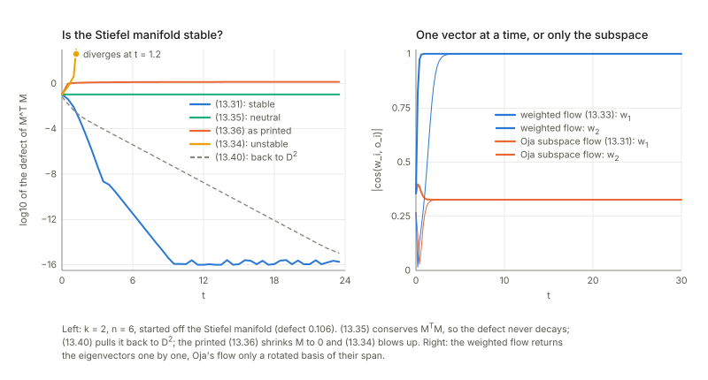
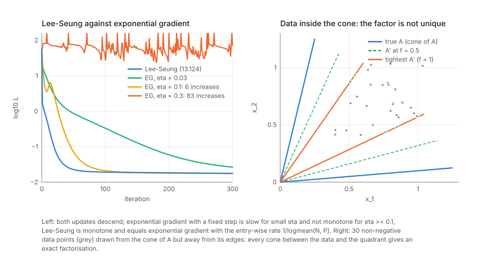
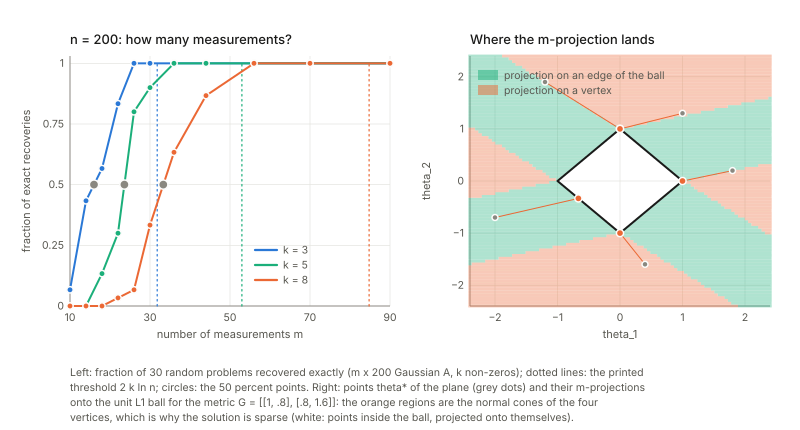
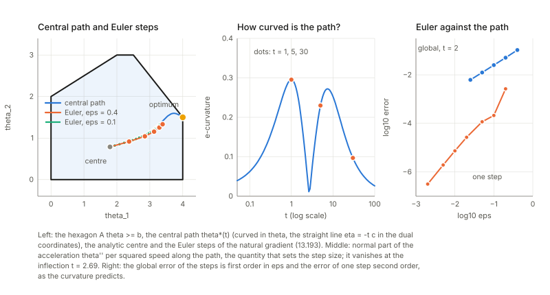
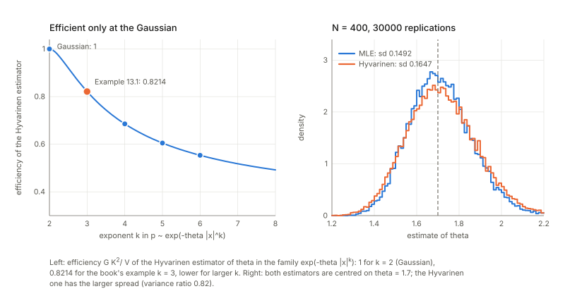

Notes for Chapter 13 of Amari, *Information Geometry and Its Applications* (Springer, 2016). The next section summarises the book's chapter in my own words. The sections after it are explorations that I asked for, one at a time, so they follow my questions and not the book's order. They keep the intuition, the figures and the derivations, and leave out numerical checks.

## What the chapter covers (a summary of the book's chapter)

The last chapter of the book shows the dually flat geometry at work in signal processing and optimisation. Its message is that techniques that look unrelated to statistics (finding the main directions of a cloud of data, unmixing signals, factorising positive matrices, recovering sparse signals, solving linear programmes, estimating without a normalising constant) each have a piece of the geometry inside them: a manifold with a natural metric, a convex potential with two coordinate systems, or a projection. The sections in order:

- **§13.1 Principal component analysis.** For centred data, the eigenvectors of the covariance matrix give the directions along which the data are widest (§13.1.1). Rotating into that frame makes the components uncorrelated, and keeping only the first few (the principal subspace) loses the least squared error, while the last few (the minor subspace) are the worst choice and are the principal ones for the inverse covariance (§13.1.2). Rescaling each component by its spread gives whitening, but whitening leaves a free rotation that second-order statistics cannot remove, which is what motivates ICA. The geometric content is in §13.1.3, on learning rules for data arriving one at a time. The classical one-neuron rule (Amari 1977, rediscovered by Oja) finds the first component, and its matrix version finds only the principal subspace, not the individual eigenvectors; Xu's version with distinct weights on the columns recovers the eigenvectors themselves. Orthonormal frames form a curved sheet (the Stiefel manifold) inside the space of all matrices. The principal-subspace flow is stable around that sheet, so rounding errors are corrected, but the obvious sign-flipped rule for minor components is unstable and drifts off, which explains why it fails. Two rules of Chen and co-workers are only neutrally stable (errors neither grow nor shrink); they conserve some quantities (a lemma lists them), and with a full square matrix they give the Brockett flow, a natural-gradient flow on orthogonal matrices. A later version of Chen and Amari adds a restoring term so that the sheet is truly stable for both principal and minor components.
- **§13.2 Independent component analysis.** Uncorrelated does not mean independent except for Gaussians, so PCA cannot unmix signals; a uniform square sheared into a parallelogram is the book's picture, and the cocktail-party problem (several speakers, several microphones, unknown mixing) is the standing example. Sources are recovered only up to order and scale, and at most one source may be Gaussian. The key idea is to look for a matrix that makes the outputs as independent as possible. Geometrically, the set of independent distributions is e-flat, the family of outputs for different unmixing matrices is a curved family that meets it, and the two are orthogonal at the true unmixing. Because the true source densities are unknown, one uses a guessed product density in a KL-type loss, and the true unmixing is then a critical point of the loss, which is a minimum, saddle or maximum depending on the guess (a minimum when the guess is close to the truth). Other contrast functions, such as non-Gaussianity measured by cumulants, fit the same analysis. The gradient is made natural using the group structure of invertible matrices: the metric is defined by shifting every nearby matrix back to the identity, which is a coordinate-free notion (a non-holonomic one, with no global coordinates behind it), and the resulting learning rule behaves the same whatever the true mixing matrix is. §13.2.3 treats ICA as a semiparametric problem (the unknown source densities are the infinite-dimensional nuisance part) and describes a class of estimating functions. Multiplying them by an invertible operator changes stability and speed but not the answer; the Newton choice gives the standard estimating function. A super-efficiency theorem says the leftover correlation between outputs shrinks faster than the usual rate when the standard function is used (Theorem 13.1). A closing remark says that time correlations in the sources can be exploited too, for example by jointly diagonalising delayed covariances, which works even for Gaussian sources.
- **§13.3 Non-negative matrix factorisation.** If sources are non-negative, the observations lie in a cone, and the problem is to factor a non-negative data matrix into two non-negative matrices (images are the example). One picks a divergence between matrices (squared Frobenius distance, generalised KL, and the alpha, beta families) and alternates: fix one factor, minimise over the other, and swap. Ordinary gradient steps can push entries negative, but an exponential-gradient step is gradient descent on the logarithms of the entries, so entries stay positive, and for the squared-error loss it gives the Lee and Seung multiplicative updates. A pointer to non-negative tensor factorisation is included.
- **§13.4 Sparse signal processing.** The section opens with the sparse model (few active components, with k of order log n), the overdetermined noisy case (least squares) and the underdetermined case where the usual pseudo-inverse solution is dense. Theorem 13.2 is the compressed-sensing statement that about 2k log n measurements recover a k-sparse signal in most cases. §13.4.1 casts it as regression with a convex loss that defines a dually flat structure (the coefficients are the e-coordinates and the gradient of the loss gives the dual ones): the sparsest solution counts non-zeros and is hard, the $L_1$ norm is a convex stand-in, and the two agree at roughly the same measurement count. §13.4.2 treats a general convex loss (the logistic regression example included) inside an $L_1$ ball, and Theorem 13.3 says the constrained minimiser is the m-projection of the unconstrained optimum onto the ball. The ball is a polyhedron with corners where several supporting directions (the subgradient) exist, so many unconstrained optima project onto a corner or edge, which is why the answer is sparse. §13.4.3 follows the solution path as the budget changes: it is continuous but changes direction whenever a coefficient enters or leaves the active set, with a lemma on the dual coordinates and Theorem 13.4, the least-angle (equiangular) property that generalises LARS from least squares to any convex loss. §13.4.4 shows that this path is a steepest-descent flow for the $L_1$ norm (a Minkowskian gradient), which moves only the coordinates whose dual value is largest in magnitude. §13.4.5 notes that when there are fewer measurements than unknowns, the loss is no longer strictly convex, so the metric does not exist and the transformation to dual coordinates is not one-to-one, yet the same path equations and the least-angle theorem still hold and the same algorithm applies.
- **§13.5 Convex programming.** A barrier function (convex and infinite at the boundary of the allowed region, such as minus the log of the slack in each constraint) turns the interior of the region into a dually flat space (§13.5.1 and §13.5.2). Linear programming uses the sum of log slacks; semidefinite programming uses minus the log determinant, whose geometry is that of zero-mean Gaussians with covariance X. Interior-point methods are natural-gradient descent of the linear cost with this metric, as in Karmarkar's polynomial-time method. In the dual coordinates the continuous flow is a straight line, but converting back to the original coordinates is expensive, so in practice primal-dual Newton methods are used. §13.5.3 studies the central path (minimise the cost times t plus the barrier, and let t grow): it starts at the centre of the region, is an m-geodesic (straight in the dual coordinates) and curved in the primal ones. The number of steps needed depends on that embedding curvature, as shown by Kakihara, Ohara and Tsuchiya.
- **§13.6 Dual geometry derived from game theory.** §13.6.1 views estimation as a game against Nature: a score (loss) for a proposed distribution gives a relative entropy, and when the score is proper (truth is the best announcement) it gives a divergence and hence a dual geometry (the book calls it S-geometry); log loss gives KL and maximum likelihood. Each such score yields an estimating function, so its estimator is consistent. A family built from a convex function of the density gives Bregman-type scores that are dually flat. Efficiency is analysed by splitting the estimating function into a part along the likelihood score and an orthogonal remainder; the extra asymptotic variance comes only from the remainder, and the estimator is efficient exactly when it vanishes. §13.6.2 introduces the Hyvärinen score, built from first and second derivatives of the log density. Lemma 13.3 says its divergence is half the average squared gap between the derivatives of the two log densities, so it ignores the normalising constant, useful when that constant is expensive. It is not a Bregman divergence, so the geometry is not dually flat. Example 13.1 works it out for a simple one-parameter exponential family with a cubic exponent: the estimator is unbiased in the limit but loses efficiency. Theorem 13.5 states that it is efficient for multivariate Gaussians and for no other family. The section ends with a version for discrete variables on a homogeneous graph, built from a graph Laplacian and also free of the normalising constant (Theorem 13.6 gives its divergence), described as a recent idea left for future work. The chapter's closing remarks also point to $L_p$ minimisation with p below 1 and to stochastic relaxation for discrete optimisation as further topics.

## Links

- **[Interactive companion](figures/interactive.html)**: eight widgets. (1) The matrix flows for principal and minor components: which of them keep the Stiefel manifold, which push away from it, which are neutral. (2) Two independent sources rotated: the outputs stay uncorrelated for every angle, the mutual information and the kurtosis see the angle; switch to Gaussian sources and nothing does.
  (3) The Hessian of the independent-component loss at the separating point for any pair of sources and either nonlinearity, its stability verdict, and a simulation of the learning rule. (4) Natural gradient against ordinary gradient for two mixing matrices. (5) Lee–Seung against exponential gradient. (6) The exact lasso path of a three-column design, with the segment where an inactive axis is the closer one.
  (7) The central path of a linear programme, straight in the dual coordinates, with Euler steps of the natural gradient. (8) The Hyvärinen score-matching estimator against the maximum likelihood estimator.
- The book: Amari, *Information Geometry and Its Applications* (Springer, 2016), DOI [10.1007/978-4-431-55978-8](https://doi.org/10.1007/978-4-431-55978-8). These notes cover Chapter 13 only; equation numbers such as (13.36) refer to the book.
  No text of the book is reproduced here; everything is restated and re-derived.
- Neighbouring chapters: **[Chapter 12: natural gradient and singular regions](../ch12-natural-gradient-and-singular-regions/index.html)** (the natural gradient used in §2 and §5), **[Chapter 11: machine learning](../ch11-machine-learning/index.html)**, **[Chapter 9: Neyman–Scott and semiparametrics](../ch09-neyman-scott-and-semiparametrics/index.html)** (estimating functions with nuisance functions, §2.5), **[Chapter 7: asymptotic theory of inference](../ch07-asymptotic-theory-of-inference/index.html)** (efficiency of an estimating function, §6),
  **[Chapter 1: dually flat structure](../ch01-dually-flat-structure/index.html)** and **[Chapter 2: exponential and mixture families](../ch02-exponential-and-mixture-families/index.html)** (projections and Pythagoras, used in §1.5, §4, §5 and §6.5). Background on the annotations site: **[The Fisher information matrix](https://msrepo.github.io/theory_inclined_papers_with_annotations/fisher-information/)**.

## In one paragraph

The last chapter of the book is a tour of six techniques that are not obviously about statistics, and the point is that a piece of the dually flat geometry sits inside each. **Principal components** are the eigenvectors of a covariance matrix, and the chapter's geometric content is the *flow of an algorithm on a space of matrices*: orthonormal frames form a curved sheet (the Stiefel manifold) inside the flat space of all matrices, and whether a learning rule stays on the sheet, drifts off or is pushed back is a statement about the flow in the larger space.
**Independent components** need more than covariances; the loss is a KL divergence from a product distribution, the independent distributions form an e-flat set, the mixing family cuts it orthogonally (up to the scale directions, as I show), and the *natural gradient* of the loss is both simpler and independent of the unknown mixing matrix. **Non-negative matrix factorisation** wants positive entries, and an exponential-gradient step keeps them positive because it is gradient descent in the logarithm.
**Sparse recovery** is a projection: the L1-constrained minimiser of a convex loss is the m-projection of the unconstrained optimum onto the L1 ball, and the corners of the ball catch many points, which is why the answer is sparse. **Convex programming** by interior-point methods follows the *central path*, which in the dual coordinates of the barrier function is a straight line, an m-geodesic. And a **proper scoring rule** from decision theory gives a divergence and so a geometry; the Hyvärinen score is the example that needs no normalising constant, at a price in efficiency that I compute.
Throughout I tested the claims by a second route. Most hold; where they do not, the failures are specific: a wrong sign in (13.36), (13.86), (13.120), (13.214) and in four formulas of Example 13.1; a missing logarithm in (13.143) and a missing factor $1/12$ in (13.46); a hypothesis missing from Lemma 13.3; a stated measurement count (13.128) that is safe but far from the real threshold; and Theorem 13.4 (2), which is false, for a reason that matches a known condition in lasso theory (from my memory of the literature, not checked here). What I could not test at all is listed under *Questions and doubts*.

## The spine of the argument

1. Learning rules for principal components are flows of a matrix $M$ in the space of $n\times k$ matrices; the Stiefel manifold $S_{n,k}$ of orthonormal frames is stable under Oja's flow (13.31), unstable under the naive minor-component flow (13.34), and neutral under the flows (13.35)–(13.36) of Chen et al., whose invariants are $M^{\mathsf T}M$ and the singular values and vectors of $M$ (Lemma 13.1); (13.40)–(13.41) add a restoring term (§13.1).
2. Independent component analysis is semiparametric: the unknowns are the matrix $W$ and the source densities. The loss $\mathrm{KL}[p_Y(\cdot;W)\Vert q]$ is minimised, with $q$ any product density, at the separating point; the family $S_W$ meets the e-flat set $S_I$ of independent distributions orthogonally there (§13.2.1).
3. The Lie-group structure of $\mathrm{GL}(n)$ gives the Riemannian metric invariant under right multiplication; the natural gradient is $\Delta W=\varepsilon(I-\varphi(y)y^{\mathsf T})W$, and because it acts on $C=WA$ without involving $A$, its behaviour does not depend on the mixing (§13.2.2).
4. A whole class of estimating functions $I-\varphi(y)y^{\mathsf T}$ solves the semiparametric problem; the Newton-type *standard* version has $J=I$ and, the book claims, *super-efficient* cross-covariances (§13.2.3).
5. NMF alternates two minimisations over positive matrices; exponential gradient keeps positivity because it is gradient descent on the logarithms, and the Lee–Seung updates are exponential-gradient steps with entry-wise rates (§13.3).
6. Sparse regression is the minimisation of a convex $\psi$ on an $L_1$ ball; the solution is the m-projection of the unconstrained optimum, its path in $c$ is piecewise linear with an equiangular structure (LARS), which the book relates to a Minkowskian ($L_1$) gradient flow (§13.4).
7. A barrier function $\psi$ makes the interior of a polytope dually flat; the central path is the m-geodesic $\eta=-tc$, and interior-point steps are natural-gradient steps whose accuracy is governed by the curvature of the path (§13.5).
8. A strictly proper game score gives a divergence $D_S$ and hence a dual geometry; the estimator of a score has covariance $G^{-1}+G^{-1}AG^{-1}$ with $A$ the part of the score orthogonal to the Fisher score; the book says the Hyvärinen estimator is efficient only for Gaussians; a graph-Laplacian version exists for discrete $x$ (§13.6).

## Setup and notation

| Symbol | Meaning | Used in |
|---|---|---|
| $V_X=\mathbb E[xx^{\mathsf T}]$, $\lambda_i$, $o_i$ | covariance (13.2), its eigenvalues and unit eigenvectors (13.5) | §1 |
| $S_{n,k}\subset M_{n,k}$ | $n\times k$ matrices with orthonormal columns (13.25)–(13.26), inside all $n\times k$ matrices | §1 |
| $x=As$, $y=Wx$, $C=WA$ | mixing, demixing, and the overall matrix | §2 |
| $k(s)=\prod k_i(s_i)$, $q(y)=\prod q_i(y_i)$ | true source density (13.51), model (product) density (13.56) | §2 |
| $S_I$, $S_W$ | all independent distributions (e-flat), the curved family $\{p_Y(\cdot\,;W)\}$ (13.59)–(13.60) | §2 |
| $\varphi_i=-q_i'/q_i$ | the nonlinearity (13.70); not the dual potential of the earlier chapters | §2 |
| $\mathrm dX=\mathrm dW\,W^{-1}$ | relative increment, non-holonomic (13.77) | §2 |
| $X=AS$ | a non-negative matrix factorised into non-negative factors (13.117) | §3 |
| $\psi$, $\eta=\nabla\psi$, $G=\nabla\nabla\psi$ | convex potential, dual coordinate, metric | §4, §5 |
| $B_c$, $\lambda$, $A(\theta)$ | $L_1$ ball (13.141), multiplier of (13.145), active set (13.153) | §4 |
| $\theta^*(t)$, $c$ | central path of (13.196), cost vector (13.191) | §5 |
| $S(x,q)$, $D_S$, $\dot l$ | game score, game divergence, $x$-derivative of $\log q$ | §6 |

**Running examples**, one per section so that every claim has a small case to think through.
(1) A covariance matrix with a few well-separated eigenvalues, and the book's own two-source example (13.44)–(13.45).
(2) Independent sources of different shapes: uniform, a bimodal mixture, logistic, hyperbolic secant, Laplace; a skewed one for §2.5.
(3) A non-negative matrix of low rank, and a $2\times2$ cone.
(4) Gaussian measurement matrices, and a small regression design with correlated columns.
(5) A hexagon $A\theta\ge b$ with a linear cost, whose optimum is a vertex.
(6) The family $p\propto\exp(-\theta\lvert x\rvert^k)$, which at $k=3$ is the book's Example 13.1.

## 1. Principal component analysis (§13.1)

### 1.1 The loss, whitening and the rotation that is left over

**In plain words.** A cloud of centred data $x$ has covariance $V_X$. Its eigenvectors $o_1,\dots,o_n$, ordered by the eigenvalues $\lambda_1>\dots>\lambda_n$, are the directions in which the cloud is widest, then second widest, and so on; $s_i=o_i\cdot x$ are the uncorrelated components (13.3)–(13.9). Keeping the first $k$ means projecting the cloud onto the plane (or hyperplane) of the widest directions. What does it cost? The loss is the average squared distance from the cloud to its projection, $L=\tfrac12\mathbb E\lvert x-\sum_{i\le k}s_io_i\rvert^2$ (13.11), and it equals half the sum of the *discarded* eigenvalues: $L=\tfrac12\sum_{i>k}\lambda_i$.
Keeping the first two components therefore costs half the sum of all the smaller eigenvalues. No other plane does better (a classical fact), and the worst plane is the **minor subspace**, spanned by the directions of *smallest* variance: its loss is half the sum of the eigenvalues it leaves out, which are the large ones. So the minor subspace *maximises* the same loss.

**A slip in (13.13).** The book says that the projection onto the minor subspace is the maximiser of a loss, and the formula it prints for that loss is *the same as (13.11)*, with the sum over $i=1,\dots,k$. As printed, that loss is minimised, not maximised, by the first $k$ components; the sum has to run over the minor indices $n-k+1,\dots,n$ (as in (13.12)). A slip in the index range, not in the idea: the matrix flows of §1.3 find both extremes, the principal flows the minimum and the minor ones the maximum.

**Whitening and the left-over rotation.** Dividing each component by $\sqrt{\lambda_i}$ gives $\tilde s$ with covariance $I$ (13.14)–(13.18). A further rotation $U$ keeps it (13.19): whitening fixes the data up to a rotation, which is why ICA needs more than second-order statistics.
The book's example (13.44)–(13.45) mixes two independent variables uniform on $[-\tfrac12,\tfrac12]$ into $x_1=s_1$, $x_2=s_1+2s_2$. Its covariance is printed as $\left[\begin{smallmatrix}1&1\\1&5\end{smallmatrix}\right]$ (13.46), but a variable uniform on $[-\tfrac12,\tfrac12]$ has variance $1/12$, so the covariance is $\tfrac1{12}\left[\begin{smallmatrix}1&1\\1&5\end{smallmatrix}\right]$ (the printed matrix is right for unit-variance sources).
After rescaling to unit variance, the PCA components are the sources rotated by an angle that is not a multiple of $90^\circ$, and those are the only angles at which the outputs would be independent. The PCA outputs are uncorrelated but not independent: their squares are still correlated, which second-order statistics cannot see. The mutual information of the two outputs of a rotation of two independent uniform sources by an angle $t$ has the closed form $I=2\ln a+b/a$ with $a=\max(\lvert\cos t\rvert,\lvert\sin t\rvert)$ and $b=\min(\lvert\cos t\rvert,\lvert\sin t\rvert)$ (the marginals are trapezoids). It is zero at $0^\circ$ and $90^\circ$, largest at $45^\circ$, and strictly positive at the PCA solution. That curve is the first panel of the figure in §2.4; the second widget of the interactive page lets you turn it.

### 1.2 Learning the first component: Oja's rule

**In plain words.** Oja's rule nudges the vector $w$ towards each incoming sample $x$ in proportion to how well they already agree ($y=w\cdot x$), and shrinks $w$ by $y^2w$ so that its length stays near one; on average it climbs towards the direction of largest variance. For $k=1$ the rule (13.24), $w\leftarrow w+yx-y^2w$ with $y=w\cdot x$, is the stochastic version of the flow $\dot w=V_Xw-(w^{\mathsf T}V_Xw)w$. The flow can be solved: in the eigenbasis the ratio $w_i/w_1$ evolves as $e^{-(\lambda_1-\lambda_i)t}$, so every other eigen-direction dies out relative to the top one, and $\lvert w\rvert^2$ goes to $1$. The printed rule has no learning rate; it is meant with a small one, and with a small constant rate it finds the top eigenvector up to a noise floor that comes from the constant gain.

### 1.3 Matrix flows, the Stiefel manifold, and the printed (13.36)

**In plain words.** To find a $k$-dimensional principal subspace one runs a flow for an $n\times k$ matrix $W$ whose columns should stay orthonormal: $W^{\mathsf T}W=I$ defines the **Stiefel manifold** $S_{n,k}$, a curved sheet in the flat space $M_{n,k}$ of all matrices. Numerically, $W$ is pushed slightly off the sheet at every step. A flow defined on the whole of $M_{n,k}$ can then treat the sheet in three ways: it can pull $W$ back (the sheet is **stable**), leave it where it is (**neutral**), or throw it away (**unstable**). The book states which is which; I tested each statement.
The cleanest case is $k=1$ with $r=\lvert w\rvert^2$ and $a=w^{\mathsf T}V_Xw>0$, where the radius obeys a one-line equation:

| flow | $r'$ | the sheet $r=1$ is |
|---|---|---|
| Oja (13.31) | $2a(1-r)$ | attracting |
| ascent for minor components (13.34) | $2a(r-1)$ | repelling |
| Chen et al. (13.35) | $0$ | neutral |

**Lemma 13.1(1)**, that $M^{\mathsf T}M$ is invariant under (13.35) and (13.36), is an algebraic identity valid for any $k$ (the terms of the derivative of $M^{\mathsf T}M$ cancel in pairs). It fails for (13.31) and (13.34), whose derivative of $M^{\mathsf T}M$ is not zero.

**The printed (13.36) is wrong.** It reads $\dot M=-V_XMM^{\mathsf T}M-MM^{\mathsf T}V_XM$, with a minus in front of *both* terms. That is not the negative of (13.35), and it does not conserve $M^{\mathsf T}M$: the rate of change is $-2[(M^{\mathsf T}M)(M^{\mathsf T}VM)+(M^{\mathsf T}VM)(M^{\mathsf T}M)]$, which is not zero, whereas the true negative of (13.35), $-V_XMM^{\mathsf T}M+MM^{\mathsf T}V_XM$, does conserve it. For $k=1$ the printed flow gives $r'=-4ar$, so it shrinks $M$ to $0$. The reading that makes Lemma 13.1 true is the second term with a plus; the book's own on-line version (13.37) has the $\pm$ in front of the whole brace, and (13.41) has the parentheses.
Integrating the flows numerically from a point of $S_{n,k}$ plus a small perturbation gives the picture in the left panel of the figure below. Oja's flow (13.31) pulls the perturbation back onto the sheet and ends at the principal subspace. The naive ascent flow (13.34) leaves the sheet and blows up in finite time (this is the puzzle the book mentions; with $k=1$ it is the sign of $r-1$). The flows (13.35) and the corrected (13.36) are *neutral*: the defect from the sheet keeps its initial value, and they end at the principal and the minor subspace respectively. The printed (13.36) shrinks $M$ towards zero. The flows (13.40) and (13.41) add a restoring term that pulls $M^{\mathsf T}M$ back to $D^2$ while following the principal and the minor subspace respectively. In terms of the loss (13.29), the flows find the minimiser (principal) and the maximiser (minor).

### 1.4 Lemma 13.1, Xu's algorithm and Brockett's flow

**In plain words.** Any matrix $M$ can be split into an orthonormal frame $W$, a set of stretch factors $D$, and a rotation $U$ of the coordinates inside the subspace. The flows (13.35)–(13.36) never change the stretches or the internal rotation; they only turn the frame $W$ towards the target subspace. That is why they are neutral on the sheet (they conserve $M^{\mathsf T}M=U^{\mathsf T}D^2U$), and why a clever choice of the initial stretches (Xu's trick) can pin each column of $W$ to a single eigenvector.

Write $M=WDU$ (singular value decomposition: $W\in S_{n,k}$, $D$ diagonal, $U$ orthogonal). Lemma 13.1 says $M^{\mathsf T}M=U^{\mathsf T}D^2U$, hence $D$ and $U$, do not change under (13.35)–(13.36): starting from $M(0)=W_0DU_0$, the singular values and the internal rotation stay put along the flow.
**Xu's algorithm (13.33).** Start from $M(0)=[D;0]$, so $U=I$ and $M=WD$ at all times. Rewriting (13.35) in $W=MD^{-1}$ gives $\dot W=V_XWD^2-WD^2W^{\mathsf T}V_XW$: the weights are the **squares** $d_i^2$, not the $d_i$ of the printed (13.33). The point of the construction is that, for $d_1>d_2$, the columns of $M$ end at $m_i=d_io_i$. Oja's subspace flow (13.31), from a random start, reaches the right *subspace* but not the right vectors: its columns end as a rotation of $(o_1,o_2)$, as the book says; the weighted flow gets each eigenvector.
**Brockett's flow (13.39).** For $k=n$ both (13.35) and (13.36) become Brockett's double-bracket flow, with cost $L(M)=\pm\mathrm{tr}(MM^{\mathsf T}V)$. Along (13.35), $L$ rises monotonically towards its maximum, and $\mathrm dL/\mathrm dt=\lVert[H,D^2]\rVert_F^2$ with $H=W^{\mathsf T}V_XW$.
The book adds, citing Chen et al., that this is a natural-gradient flow on the orthogonal matrices; I checked the double-bracket form and the monotone rise of $L$, not that claim (it needs a metric on the orthogonal group, which I did not set up).

### 1.5 PCA as an m-projection (not in the book)

**In plain words.** Fitting a Gaussian with a few strong directions plus a floor of equal noise in every other direction amounts to keeping the top eigenvectors, and the price of the fit is how unequal the discarded eigenvalues are.

The book gives no information-geometric reading of the PCA solution itself; here is one. The probabilistic PCA family $S_k=\{N(0,WW^{\mathsf T}+s^2I)\}$ (a curved model: rank-$k$ signal plus isotropic noise; this is the model of Tipping and Bishop, as I remember it) contains, for every data Gaussian $N(0,V_X)$, a closest member in the m-sense: the one minimising $\mathrm{KL}[N(0,V_X)\Vert N(0,\Sigma)]$, which is the maximum-likelihood fit. The closed-form answer: the subspace is the principal one, the noise level $s^2$ is the *arithmetic mean of the discarded eigenvalues*, and the minimal KL is $\tfrac{n-k}2\ln(\mathrm{AM}/\mathrm{GM})$ of those eigenvalues. For $k=n-1$ one eigenvalue is discarded, AM $=$ GM, and the model reproduces $V_X$ exactly (KL $=0$); the more unequal the discarded eigenvalues, the worse the isotropic floor fits them. In the language of Chapter 1 this is an m-projection of the data Gaussian onto a curved model; I did not check the orthogonality of the m-geodesic to the model, only the minimum.

## 2. Independent component analysis (§13.2)

### 2.1 The problem and what the book's geometry is

**In plain words.** Several independent signals $s_1,\dots,s_n$ are recorded only through linear mixtures $x=As$; one wants to recover them without knowing $A$. If the signals were Gaussian there would be nothing to find (§1.1: the rotation is free). If at most one is Gaussian the independent components can be recovered up to **order and scale**. One looks for $W$ such that $y=Wx$ has independent components, and needs a number that measures *how far from independent* $y$ is.
The book uses $L(W)=\mathrm{KL}[p_Y(\cdot;W)\Vert q]$ (13.62) with $q=\prod q_i$ a product density: not the true $k$ (unknown), only some product. In the space of all distributions the **independent ones form a set $S_I$**, e-flat because the logarithm of a product is a sum of functions of single variables; the **mixing family** $S_W$ passes through it at the separating point (Fig. 13.5) and the book says they meet **orthogonally**. I tested each step below.

**The density and the loss (13.52), (13.64)–(13.66).** For $y=Wx$, $x=As$, the density is $p_Y(y;W)=\lvert\det WA\rvert^{-1}k(A^{-1}W^{-1}y)$, the change-of-variables formula. The entropy relation (13.66), $H(Y)=H(X)+\log\lvert\det W\rvert$, holds for the same reason: the volume element is scaled by $\lvert\det W\rvert$. The loss $-H(Y)-\mathbb E\log q$ can be computed in $y$-space or in terms of the sources, and the two routes agree.
The density of $x$ itself, in the semiparametric model of §2.5, is printed in (13.88) without the factor $\lvert\det W\rvert$: as printed it integrates over $x$ to $1/\lvert\det W\rvert$, not to $1$; with the factor it integrates to $1$.

### 2.2 Do $S_W$ and $S_I$ meet orthogonally? Modulo the scales, and only for zero means

**In plain words.** $S_I$ is the set of all distributions whose coordinates are independent; $S_W$ is the family of distributions of $Wx$ as $W$ varies. They touch at the separating point, and the book says they cross at a right angle, which is why $W=A^{-1}$ should be a stationary point of the loss whatever product density $q$ is used. Here is what the angle actually is.

At the separating point the tangent space of $S_W$ in the relative coordinates $\mathrm dX$ is spanned by the scores $\varphi_i(s_i)s_j-\delta_{ij}$ (with $\varphi_i=-k_i'/k_i$, the true densities). Their Fisher Gram matrix has no coupling between the diagonal and the off-diagonal directions. The tangent space of $S_I$ is every zero-mean function of a single variable. The two **off-diagonal** directions (mixing the outputs) are orthogonal to $S_I$, but the two **diagonal** directions (rescaling an output) lie *inside* $S_I$, because a rescaled product of densities is still a product. So the two meet orthogonally only modulo the scale indeterminacy, which the book says it neglects.
The orthogonality also needs the assumption (13.50) $\mathbb E[s_i]=0$: the inner product of the direction $\mathrm dX_{12}$ with the $S_I$ direction $s_1$ is $\mathbb E[\varphi_1s_1]\mathbb E[s_2]$, which is not zero if the second source has a non-zero mean.

**Is $W=A^{-1}$ a critical point of $L$ for a wrong $q$? Only up to a $q$-dependent scale.** The gradient of $L$ in the relative coordinates is $\mathbb E[\varphi(y)y^{\mathsf T}]-I$. At $W=A^{-1}$ the off-diagonal entries are $\mathbb E[\varphi_i(s_i)]\mathbb E[s_j]=0$, but the diagonal entries are $\mathbb E[\varphi_i(s_i)s_i]-1$, which vanish only if the model's scale matches. For a matched model ($q=k$) they vanish. For a wrong $q$ (a sech or a tanh model for logistic sources, say) they do not, and the minimum of $L$ along the scale direction sits at the scale $c$ where $\mathbb E[\varphi(cs)cs]=1$.

So the critical point is $DA^{-1}$ with a diagonal $D$ fixed by $q$: the scale is chosen by the loss, it is not free. Two statements of the book are therefore too generous: the requirement (13.89) that an estimating function vanish at every $W'$ equivalent to $W$ up to scales cannot hold for the class (13.92), which vanishes only where $\mathbb E[\varphi_i(y_i)y_i]=1$; and the remark that everything is the same for all equivalent $W$ holds only up to this scale.
For the matched model the Hessian of $L$ at the solution equals the Fisher Gram matrix, which is positive definite: $A^{-1}$ is a local minimum when $q=k$ (the book says global minimum when $q$ is close to $k$; I did not test that). For other $q$ it can be a saddle or a maximum; §2.4 gives the rule.

### 2.3 The natural gradient (13.67)–(13.87) and its sign

**In plain words.** The instantaneous loss of a sample $x$ is $l=-\log\lvert\det W\rvert-\log q(Wx)$ (13.67). Its derivative in $W$ is $-W^{-\mathsf T}+\varphi(y)x^{\mathsf T}$ (13.73). The ordinary gradient depends on how $W$ is parametrised. The book instead measures a small change $\mathrm dW$ by the *relative* increment $\mathrm dX=\mathrm dW\,W^{-1}$, which is what $\mathrm dW$ becomes if $W$ is moved to $I$ by right multiplication (13.75)–(13.80); the metric $\mathrm{tr}(\mathrm dX\,\mathrm dX^{\mathsf T})$ is then invariant under $W\mapsto WB$ (the book calls it the Killing metric). $\mathrm dX$ is not the differential of any function of $W$ (the book calls such increments non-holonomic: the total change depends on the path), which is harmless for defining a metric. In $\mathrm dX$ the gradient is simply $-(I-\varphi(y)y^{\mathsf T})$ (13.85); in $W$ the Euclidean gradient $-(I-\varphi y^{\mathsf T})W^{-\mathsf T}$ multiplied by $W^{\mathsf T}W$ gives the **natural gradient** $-(I-\varphi(y)y^{\mathsf T})W$ (13.87).

**A sign slip in (13.86).** The book sets the increment $\Delta X_{ij}=-\varepsilon\{\delta_{ij}-\varphi_i(y_i)y_j\}$ equal to (a multiple of) the gradient $\nabla_Xl=-(I-\varphi y^{\mathsf T})$ of (13.85), whereas a descent step is *minus* the gradient: $\Delta X=+\varepsilon(I-\varphi(y)y^{\mathsf T})$. With the printed sign, a small step increases the loss (it is an ascent step); with the plus it decreases it, by exactly the first-order prediction $-\varepsilon\lVert I-\varphi y^{\mathsf T}\rVert_F^2$. The algorithm everyone uses is $W\leftarrow W+\varepsilon(I-\varphi(y)y^{\mathsf T})W$. Both (13.86) and (13.87) also put $\varepsilon$ inside what they call the gradient; (13.87) itself has the right sign for a gradient. By the same algebra the learning rule (13.91) with the estimating function $F=I-\varphi y^{\mathsf T}$ of (13.92) would ascend (the standard version $J^{-1}F$ of §2.5 does not care about the sign of $F$, because $J$ changes sign with it).

**Equivariance.** The remark after (13.87), credited to Cardoso and Laheld and to Amari and co-authors, says that the convergence of the learning dynamics does not depend on the true mixing matrix, and neither does stability. With $C=WA$ the update $C\leftarrow C+\varepsilon(I-\varphi(Cs)(Cs)^{\mathsf T})C$ contains no $A$. So two different mixing matrices, fed the same source samples and started from the same $C(0)$ (so that $W(0)=C(0)A^{-1}$ differs), give the same trajectory of $C$ and the same cross-talk at every step. The ordinary gradient $W\leftarrow W+\varepsilon(W^{-\mathsf T}-\varphi(y)x^{\mathsf T})$ gives $\Delta C=\varepsilon(C^{-\mathsf T}-\varphi(y)s^{\mathsf T})A^{\mathsf T}A$: it depends on $A$, so a badly conditioned mixing makes it slow or even makes it diverge. So the invariance is the whole point of the natural gradient, not decoration.

### 2.4 When does the separating point attract? The Hessian

**In plain words.** Near the separating point the loss is a bowl in most directions. The delicate direction is a tiny rotation of the outputs, which second-order statistics cannot see (§1.1); only the shapes of the source densities, through the nonlinearity $\varphi$, can bend the loss upward there. The book says only that stability depends on $q$ and on the m-embedding curvature of $S_W$ at $q=k$. Here is an explicit answer, which I derived.
Rescale the sources so that $\mathbb E[\varphi(s)s]=1$ (the equilibrium scale of §2.2) and write $m_i=\mathbb E[\varphi_i'(s_i)]$, $\sigma_i^2=\mathbb E[s_i^2]$. The Hessian of $L$ in the relative coordinates is block diagonal: a diagonal block $\mathbb E[\varphi_i'(s_i)s_i^2]+1$ for each $\mathrm dX_{ii}$, and for each pair a $2\times2$ block
$$\begin{bmatrix}m_i\sigma_j^2&1\\1&m_j\sigma_i^2\end{bmatrix}\quad\text{on }(\mathrm dX_{ij},\mathrm dX_{ji}).$$
With $\kappa_i=m_i\sigma_i^2$, the separating point is a minimum iff all $\kappa_i>0$ and $\kappa_i\kappa_j>1$ for every pair; the weak direction is the antisymmetric pair $(1,-1)$, **a rotation of the outputs**, the very direction that second-order statistics leave free (§1.1). The Jacobian of the natural-gradient flow is minus this Hessian.

Some verdicts that follow. Two uniform sources with the cubic $\varphi=y^3$ are stable; two logistic sources, or two Laplace sources, with $y^3$ are unstable. Two Laplace sources with $\tanh$ are stable; two uniform sources with $\tanh$ are unstable. A uniform source with a hyperbolic-secant source under $y^3$ sits exactly on the boundary.

For the cubic $\varphi=y^3$ it simplifies: $\kappa_i=3/(3+k_i)$ with $k_i$ the excess kurtosis, so the condition is $(3+k_1)(3+k_2)<9$. This is the familiar rule of thumb that $y^3$ separates sub-Gaussian sources and $\tanh$ separates super-Gaussian ones (as I remember it from the ICA literature), with the pair condition made exact: a uniform source (sub-Gaussian) with a mildly super-Gaussian one such as the logistic still works, a uniform with a strongly super-Gaussian one such as the Laplace does not, and a uniform with a sech source sits *on* the boundary with a zero eigenvalue.
**The learning rule itself.** The Hessian is a statement about the mean update, and the stochastic algorithm bears it out: a small perturbation along the weakest direction decays (or grows) in the online rule at the rate the Hessian predicts, once the step size is taken to zero (for a finite step the leftover gap is the noise-induced correction of stochastic approximation). In the unstable case, a uniform pair under $\tanh$, the perturbation grows in the actual algorithm.

### 2.5 Estimating functions, and Theorem 13.1 to order $\eta$

**In plain words.** Since the source densities are unknown, ICA is a *semiparametric* problem (§13.2.3): the density of $x$ is $\lvert\det W\rvert\prod_ik_i(\sum_jW_{ij}x_j)$ with $W$ the parameter of interest and the $k_i$ nuisance functions (Chapter 9 treats this setting). An *estimating function* $F(x,W)$ is a matrix function whose expectation vanishes at the true $W$; solving $\sum_tF(x_t,W)=0$ gives an estimate, and the learning rule is an on-line version. The class $F=I-\varphi(y)y^{\mathsf T}$ with any vector function $\varphi$ is available (13.92). Composing with a linear map $R(W)$ does not change the solution but changes the stability and the speed (13.93)–(13.96); the choice $R=J^{-1}$, with $J=\mathbb E[\partial F/\partial X]$, is a Newton method and gives the *standard* estimating function, with $J=I$ (13.99)–(13.103). The Jacobian of the plain function has different eigenvalues, so different directions converge at different speeds; that of the standard one is the identity, so all directions converge at the same rate.
The condition (13.106) $\mathbb E[\varphi_i(s_i)]=0$ holds if $\varphi_i=-(\log k_i)'$ (the integral of a derivative of a density vanishes) and if $k_i$ is even and $\varphi_i$ odd (for example $\tanh$ with a symmetric source); for a skewed source and $\tanh$ it fails.

**Theorem 13.1 (the book's *super efficiency*).** Under (13.106), with the standard estimating function, the book states that the off-diagonal covariances $V_{ij}=\mathbb E[y_iy_j]$ of the recovered signals decrease like $1/t^2$ with a decreasing gain $1/t$ (13.107) and like $\eta^2$ with a fixed gain $\eta$ (13.108): faster than the $1/t$ and $\eta$ of the error of the demixing matrix itself. The proof is only cited (Amari 1999). I could check the statement at order $\eta$ only, and there I found something the theorem does not say. For the fixed-gain rule $C\leftarrow C-\eta A(Cs)C$ near the solution, with a skewed source and a logistic one, I computed the stationary moments to order $\eta$ (a Lyapunov equation for the covariance of $X=C-I$, then the bias from the second derivatives of the mean update).

The diagonal entries (the scales) have a first-order bias; the symmetric off-diagonal part, and hence $\mathbb E[y_1y_2]$, has **no order-$\eta$ term**, with or without the standard form, and also with $\tanh$, for which (13.106) fails. The reason is short: the noise of the diagonal entries is uncorrelated with that of the off-diagonal ones, because $\mathbb E[s_j]=0$. So at this order the effect does not depend on the hypotheses of the theorem; whether they matter at order $\eta^2$ I did not test.

## 3. Non-negative matrix factorisation (§13.3)

**In plain words.** Some signals are intrinsically non-negative (pixel brightness). Writing $X=AS$ with non-negative $A$ and $S$ means every observation is a non-negative combination of the columns of $A$. Geometrically (Fig. 13.7), the non-negative combinations of the columns of $A$ form a *cone*; the data lie in it, and one hopes the cone of the data reveals the cone of $A$. The factorisation is found by alternately minimising a divergence over $S$ and over $A$ (13.118), and the trouble with plain gradient descent is that it leaves the non-negative orthant. The **exponential gradient** $A\leftarrow A\exp(-\eta\,\partial L/\partial A)$ (13.121) cannot: it is plain gradient descent on $\log A$ (13.122), and a positive number times $\exp$ of anything stays positive. In the language of dual geometry (my gloss; the book only says gradient descent on $\log A$) this is a natural-gradient flow: for positive numbers with the potential $\sum(a\log a-a)$ the metric is $\mathrm{diag}(1/a)$, so the natural gradient is $A\odot\nabla L$ and $\mathrm d\log A/\mathrm dt=-\nabla L$ (algebra only, not run).

The gradients (13.123), $\partial L/\partial A=-XS^{\mathsf T}+ASS^{\mathsf T}$ and $-A^{\mathsf T}X+A^{\mathsf T}AS$, are the standard matrix derivatives of $L=\tfrac12\lVert X-AS\rVert^2$.
**A sign slip in (13.120).** The generalised KL divergence of non-negative matrices is printed as $\sum\{a\log(a/b)-a-b\}$. That is not a divergence: at $b=a$ it is negative instead of $0$, and it falls without bound as $b$ grows. The correct form is $\sum\{a\log(a/b)-a+b\}$: it is zero at $b=a$ and positive elsewhere.
**Plain gradient descent breaks positivity:** a single step of moderate size drives some entries of $A$ negative; the exponential-gradient step cannot.

The book presents the multiplicative update (13.124)–(13.125) as the analogue of (13.121), with the gradient replaced by a difference of logarithms. It is exactly an exponential-gradient step, but with an **entry-wise** rate: writing $\partial L/\partial A=P-N$ with $P=ASS^{\mathsf T}$ and $N=XS^{\mathsf T}$, the update $A\leftarrow A\,N/P$ equals $A\exp(-\eta_{it}(P-N)_{it})$ with $\eta_{it}=(\log N-\log P)/(N-P)=1/\mathrm{logmean}(N_{it},P_{it})$, where $\mathrm{logmean}(N,P)=(N-P)/(\log N-\log P)$ is the logarithmic mean. The rates vary from entry to entry, so no constant $\eta$ reproduces the step. The same holds for the generalised KL (13.120, corrected), with $P=\mathbf 1S^{\mathsf T}$ the row sums and $N=(X/(AS))S^{\mathsf T}$.
**Monotonicity.** Lee–Seung decreases the loss at *every* iteration, and so does the generalised-KL version. A fixed-$\eta$ exponential gradient is monotone only for small $\eta$: with a larger step it increases the loss at some iterations, and with a still larger one it diverges.

**When is the factorisation unique? The cone picture needs the data to reach the edge.** The book says $A$ can be recovered from the cone of $X$. Take a $2\times2$ matrix $A$ whose two columns span a cone in the positive quadrant. If some data points lie on both edges of the cone, nothing else works: the data fill the whole cone and there is no slack. If the data stay strictly inside, they fill only a narrower cone, and *every* pair of columns between the data cone and the edges of the quadrant gives an exact non-negative factorisation (move the columns inwards by any fraction of the slack, up to the point where an entry of $S'$ reaches zero). Uniqueness needs a condition of the type that the data touch the faces of the cone (the literature calls such conditions separability or sufficient scattering, as I remember it); the book states the conclusion without it.

## 4. Sparse signal processing (§13.4)

### 4.1 L2, L0 and L1, and the measurement count

**In plain words.** A signal $s\in\mathbb R^n$ with only $k$ non-zero entries is measured through $m<n$ linear measurements $x=As$. There are infinitely many solutions; the one of smallest Euclidean norm, the generalised inverse $A^{\mathsf T}(AA^{\mathsf T})^{-1}x$ (13.135)–(13.136), is dense. The sparsest solution minimises the number of non-zeros, $L_0$ (13.137), a combinatorial problem; the **$L_1$ norm** is a convex stand-in. For a sparse truth the generalised inverse gives a dense answer with every component non-zero, while the minimum-$L_1$ solution (computed as the end of the lasso path) is sparse and equals the truth, with an optimality certificate: a vector $y$ with $\lvert A^{\mathsf T}y\rvert_\infty=1$ and $x\cdot y=\lvert\theta\rvert_1$ (zero duality gap).
$L_1$ does not always equal $L_0$: in small problems, where an exhaustive search over all small supports is exact, the $L_1$ solution equals the sparsest one in some random instances and not in others (sometimes the sparsest has two non-zeros while the $L_1$ minimiser has more, with a smaller $L_1$ norm).

**Theorem 13.2 and (13.128), (13.139): $m>2k\log n$.** The book states that a $k$-sparse $s$ is recovered "in most cases" from $m>2k\log n$ measurements and that the $L_0$ and $L_1$ solutions coincide for $m\approx2k\log n$. I tried it with Gaussian measurement matrices and exact minimum-$L_1$ recovery, asking how often a $k$-sparse signal is recovered exactly as $m$ grows. Recovery goes from rare to certain over a fairly narrow window of $m$, and the window moves right as $k$ grows. So $m>2k\log n$ is a comfortable *sufficient* condition at this size, but it is **not the threshold**: the threshold is a fraction of it, and its growth with $k$ is closer to $k\ln(n/m)$. As I remember the literature on phase transitions for $L_1$ recovery (Donoho and Tanner), the asymptotic law for small $k/n$ has the form $m\approx2k\ln(n/m)$; I did not check that source. The $\log n$ of the book differs only by the constant inside the logarithm, which matters at moderate $n$.

### 4.2 The constrained minimiser is an m-projection; why corners

**In plain words.** The loss $\psi(\theta)=\tfrac12\lvert x-A\theta\rvert^2$ (13.130) is the negative Gaussian log likelihood, convex with Hessian $G=A^{\mathsf T}A$: it defines a dually flat structure with $\theta$ the e-affine and $\eta=\nabla\psi=G\theta-A^{\mathsf T}x$ the m-affine coordinate (13.147). The divergence is $D[\theta:\theta']=\psi(\theta)-\psi(\theta')-\nabla\psi(\theta')\cdot(\theta-\theta')$ (13.149), and since $\nabla\psi(\theta^*)=0$ at the unconstrained optimum, $D[\theta:\theta^*]=\psi(\theta)-\text{const}$ (13.150). So minimising $\psi$ over the $L_1$ ball $B_c$ means minimising the divergence from $\theta$ to the optimum, which the book reads as the dual divergence from $\theta^*$ to $\theta$: **Theorem 13.3** says the answer is the m-projection of $\theta^*$ onto $B_c$, unique because the ball is convex in $\theta$ (e-convex). Below, $D$ is used exactly as in (13.149), with $\theta$ in the first slot.
The stationarity condition is $\nabla\psi(\theta^*_c)=-\lambda\nabla L(\theta^*_c)$ (13.151), where $\nabla L$ is the *subgradient* of the $L_1$ norm: $\mathrm{sgn}\,\theta_i$ on the active set and anything in $[-1,1]$ off it (13.154). I tested all of it on a small regression design with correlated columns: the exact lasso path has one segment for each change of the active set and ends at the unconstrained optimum $\theta^*$.

- **Lemma 13.2.** Along the path $\eta_A+\lambda s_A=0$ on the active set and $\lvert\eta_j\rvert<\lambda$ on the inactive coordinates. ✓.
- **Theorem 13.3.** At half the full $L_1$ norm the path gives a sparse point, and an independent algorithm (accelerated projected gradient onto the $L_1$ ball) lands on the same point; $\eta_c$ is $-\lambda s$ on the active set and smaller than $\lambda$ in magnitude off it. ✓.
- **The projection theorem for a set that is convex but not flat.** For points $x$ of $B_c$, $D[x:\theta^*]-D[x:\theta_c]-D[\theta_c:\theta^*]=\eta_c\cdot(x-\theta_c)\ge0$: an *inequality*; the Pythagorean equality of Chapter 1 needs a flat set. On the facet containing $\theta_c$ (same support and signs, $\lvert x\rvert_1=c$), which is flat, the slack is zero: equality along the flat piece. ✓.
- **Why sparse.** At a regular boundary point (all components non-zero) there is one normal and one m-geodesic ending there; at a corner, a whole cone of unconstrained optima ends there. Moving $\theta^*$ anywhere inside that cone (any $\tilde\theta^*=\theta_c-G^{-1}\tilde\eta$ with $\tilde\eta_A=-\lambda s_A$ and $\tilde\eta_j\in[-\lambda,\lambda]$ on the inactive coordinates) gives the *same* projection $\theta_c$: a cone whose dimension is the number of inactive coordinates lands on this one point. The smaller the budget, the more of space is caught by corners: for a Gaussian cloud of unconstrained optima and $G=I$, stronger shrinkage maps a larger share of points to a non-regular point (some $\theta_i=0$) and a larger share to a vertex. The figure's right panel shows the normal cones for a $2\times2$ metric.
- **Logistic regression (13.142)–(13.144).** The printed cumulant function $\tilde\psi=1+\exp\{\theta\cdot x_i\}$ lacks the logarithm: $\sum_y\exp(yu-\tilde\psi)$ does not add up to $1$ with the printed form, and does with $\tilde\psi=\log(1+e^u)$. The loss (13.144) is strictly convex when the inputs span $\mathbb R^n$ (its Hessian is then positive definite).

### 4.3 The solution path and the least-angle theorem

**In plain words.** As the budget $c$ of the $L_1$ ball grows from $0$, the solution walks from the origin to the unconstrained optimum along a path made of straight pieces; on each piece the set of non-zero coordinates is fixed, and the path bends only when a coordinate enters or leaves. The least-angle theorem is a claim about the direction of the walk on one straight piece.

Along the path the active set $A$ changes at isolated values of $c$ (or $\lambda$) and the direction is piecewise constant; on a segment $\theta_A$ moves along $d=G_{AA}^{-1}s_A$ per unit decrease of $\lambda$ and the dual coordinates move by $\dot\eta_j=(G_{jA}d)=:g_j$ for inactive $j$, while $\lvert\dot\eta_i\rvert=1$ for active $i$. **Theorem 13.4** claims (1) that the angle between the path direction $\dot\theta$ and every active coordinate axis is the same; (2) that the angle with every inactive axis is *larger*.

**(1) is right, with a proviso.** $\lvert\langle\dot\theta,e_i\rangle\rvert=\lvert\dot\eta_i\rvert$ is the same for all active $i$ on every segment (I found no violation on random designs with correlated unit-norm columns). But *same angle* follows from *same inner product* only when the axes have equal length, $G_{ii}$ all equal (the standard LARS normalisation). With unequal column norms the inner products are equal but the angles are not.

**(2) is false, for a reason that is a known condition.** The printed inequality (13.161) is $\lvert\langle\dot\theta,e_i\rangle\rvert<\lvert\langle\dot\theta,e_j\rangle\rvert$ for $i\in A$, $j\in\bar A$, which says the inactive axis has the *larger* inner product, the opposite of the sentence it illustrates. The corrected statement ($\lvert g_j\rvert<1$) fails as well. The proof in the book argues that $\dot\eta$ is proportional to $\nabla L$, whose components are $1$ on $A$ and $<1$ off $A$; but the *values* $\lvert\eta_j\rvert<\lambda$ constrain where $\eta_j$ is, not how fast it moves, and off $A$ the velocity $\dot\eta_{\bar A}=G_{\bar AA}\dot\theta_A$ is not proportional to $\nabla L$. In random designs it fails constantly: on a large share of path segments some inactive axis has $\lvert g_j\rvert>1$, sometimes by a wide margin. A clean counterexample: three unit columns in $\mathbb R^3$ with $G_{12}$ close to $-1$ (two almost opposite directions) and the third nearly in their span; for suitable data the path has active set $\{1,2\}$ with equal signs on an interval of $\lambda$; there the active inner products are $1$ and the inactive one is larger than $1$, so the angle between $\dot\theta$ and the active axes is large and the angle with the inactive axis is small: the inactive axis is much the closer.
$\lvert G_{jA}G_{AA}^{-1}s_A\rvert<1$ for all inactive $j$ is the **irrepresentable condition** known from the theory of lasso model selection (Zhao–Yu, Meinshausen–Bühlmann; I am quoting it from memory, not from this book). The book's statement (2) is that condition required at every active set along the path, which fails for generic correlated designs. A segment with a single active variable never violates it ($\lvert g_j\rvert=\lvert G_{ji}\rvert\le1$ for unit columns), so violations need at least two active variables. The equiangular property of Efron et al. is (1) alone, as I remember it.

### 4.4 The Minkowskian gradient flow is forward stagewise, and equals the lasso only on monotone paths

In formulas, the $L_1$-steepest direction (13.168)–(13.170) moves only the coordinates whose $\lvert\partial_i\psi\rvert$ is maximal, by $\pm1$; the discrete flow (13.172) $\theta^{t+1}=\theta^t-\varepsilon\tilde\nabla_M\psi$ is then *incremental forward stagewise regression*, and the book says it explains the properties of LARS: the path of the extended LARS is the Minkowskian gradient flow. The two coincide only when no active coefficient has to move toward zero. Call a lasso path *monotone* if on every segment every active coefficient moves away from $0$ ($s_i(G_{AA}^{-1}s_A)_i>0$). I compared the two paths on random correlated designs, measuring the sup-norm distance between them at equal $L_1$ norm, and sorted the designs by what the lasso path does:

- **monotone path:** the flow reproduces the lasso path to about one step size;
- **some coefficient shrinks, none drops out:** the two differ by several step sizes;
- **a variable leaves the active set:** the two differ by several step sizes as well, and by the most.

So for monotone paths the flow reproduces the lasso, but otherwise the two differ by clearly more than the step. The flow cannot make a tied coordinate *decrease*, and the lasso sometimes must. As I recall it, Efron et al. state this relation between LARS, lasso and stagewise (stagewise needs a non-negativity condition); the book's one-sentence equivalence omits it. Note also that (13.167) prints $\lVert a\rVert_q=\sum\lvert a_i\rvert^q$, which is the $q$-th power of the norm (harmless, the constraint set is the same).

### 4.5 The underdetermined case

For $m<n$ the Hessian $G$ is singular and the metric does not exist; the book says that (13.151) and the path equation (13.156) still hold, and that the least-angle theorem is proved in the same way. What I tested is the consequence that matters: running the exact path down to $\lambda\to0$ ends at a minimum-$L_1$ interpolating solution, with a dual certificate in every instance of §4.1; the vector $y=\lim r/\lambda$ solves the dual (basis-pursuit) problem. I did not test (13.156) separately for $m<n$.

## 5. Optimization in convex programming (§13.5)

### 5.1 The barrier and the dually flat structure

**In plain words.** To minimise a linear cost $c\cdot\theta$ over the polytope $\{A\theta\ge b\}$, an interior-point method replaces the hard wall by a soft one, the **barrier** $\psi(\theta)=-\sum_\kappa\log(A_\kappa\theta-b_\kappa)$ (13.181), which is $+\infty$ on the boundary and convex. A convex function defines a dually flat structure (Chapter 1): $\theta$ are the e-affine coordinates, $\eta=\nabla\psi=-\sum A_\kappa/s_\kappa$ the m-affine ones and $G=\sum A_\kappa A_\kappa^{\mathsf T}/s_\kappa^2$ the metric, with the slacks $s_\kappa=A_\kappa\theta-b_\kappa$ (13.186)–(13.189). These agree with finite differences of $\psi$ on the hexagon example.
**A slip in (13.188)–(13.189).** They are printed as integrals over $\omega$ without the weight $w(\omega)$ of (13.179), yet they are said to treat the polyhedral barrier (13.181), where the barrier is a finite sum over constraints; the right forms are the sums above (or integrals with $w(\omega)$).

### 5.2 The central path is a straight line in $\eta$

**In plain words.** The wall $\psi$ pushes the minimiser away from the boundary, and the weight $t$ on the cost decides how close to the best vertex it gets; following the minimiser as $t$ grows traces a path from the middle of the polytope to the best vertex.

Minimise $L(\theta,t)=tc\cdot\theta+\psi(\theta)$ (13.196). The stationarity condition $tc+\nabla\psi=0$ is $\eta^*(t)=-tc$ (13.197): in the dual coordinates the central path is the **ray from the analytic centre** ($\eta=0$, the minimiser of $\psi$), a straight line, an **m-geodesic**; in the primal coordinates it is curved. Solving the barrier problem by damped Newton for increasing $t$ confirms this on the hexagon. The dual vector $y_\kappa=1/(ts_\kappa)$ is feasible ($A^{\mathsf T}y=c$; this is the stationarity condition rewritten), and the gap between the primal cost and the dual objective is *exactly* $m/t$ (number of constraints over $t$): the suboptimality is at most $m/t$.
The book says the path connects the centre and the optimum $\eta^*$. The optimum is a vertex, $\lVert\nabla\psi\rVert\to\infty$ there, and $\eta^*(t)=-tc\to\infty$: the m-geodesic is a *ray to infinity*, not a segment between two finite points. (A loose phrase, not a mistake.)

### 5.3 Natural-gradient steps follow the path; the curvature sets the step

**In plain words.** A natural-gradient step lowers the cost fastest in the metric of the barrier; near a wall the metric is large, so the steps shrink by themselves. In the dual coordinates the flow is a straight line, but each discrete step is straight in the *primal* coordinates, where the path bends, and the bend sets the error.

The natural gradient flow of the cost, $\dot\theta=-\varepsilon G(\theta)^{-1}c$ (13.192), gives $\dot\eta=G\dot\theta=-\varepsilon c$ (13.194): a straight line in $\eta$, $\eta(t)=\eta(0)-\varepsilon tc$ (13.195). Started at the analytic centre it **is** the central path. Started elsewhere, $\eta(t)=\eta(0)-tc$ still. The discrete step $\Delta\theta=-\varepsilon G^{-1}c$ (13.193) is straight in $\theta$ but the path is curved there, so each step has an error governed by the *e-acceleration* of the m-geodesic: $\theta'(t)=-G^{-1}c$ and $\theta''=-G^{-1}T(\theta',\theta')$ (with $T$ the cubic tensor of $\psi$) give the velocity and the bend of the path in the primal chart. Along the path the normal part of the bend has two humps and changes sign once (an inflection of the path).
Euler steps from the centre, compared with the central path at the same $t=k\varepsilon$, have a global error that is first order in $\varepsilon$ (halving the step halves the error), and one step from the centre has error $\tfrac12\varepsilon^2\lvert\theta''(0)\rvert$, second order. So the curvature of the path in the $\theta$ chart is what bounds the step, as the section says. The book's *quantitative* statement, that the number of steps needed is bounded by an integral of this curvature (Kakihara–Ohara–Tsuchiya), I did not test.

**What I could not verify.** The book calls the step (13.193) the affine-projection method of Karmarkar and says it is known to have polynomial-time complexity (citing Tanabe, 1980). No experiment can show polynomial complexity. As far as I recall the literature, an algorithm with this step, $\Delta\theta\propto-G^{-1}c$ for the log barrier, is the *affine scaling* method of Dikin rather than Karmarkar's projective method, and polynomial bounds are known for path-following (centred Newton) methods rather than for pure affine scaling; I did not check these sources, so I record the sentence as unverified.

### 5.4 Equality constraints, and the cone programme

**In plain words.** Linear programmes are often written with equality constraints and non-negative slack variables; the feasible set is then a slice (an affine subspace) of the positive orthant, and the straight line in the dual coordinates has to be read inside that slice.

If the problem is written with equality constraints (as in the standard form of LP and (13.184) for SDP) the central path is a straight line only in the *induced* dual coordinates of the feasible affine set. Take the hexagon in slack form, $x=A\theta-b\in\mathbb R^6_+$, with ambient dual coordinates $\eta=-1/x$: points of the central path are *not* collinear in these ambient coordinates, but the induced coordinates $A^{\mathsf T}\eta$ (the dual coordinates of the restricted potential $\psi(A\theta-b)$) lie on the line $-tc$. The statement that the central path is an m-geodesic is then about the induced structure of the feasible set (restricting the potential to an affine subspace gives again a convex potential, whose dual coordinates are $A^{\mathsf T}\eta$), not about the ambient one.
**The barrier $-\log\det X$ (13.185).** The book says the geometry is the same as the invariant geometry of the zero-mean Gaussians with covariance $X$. Comparing the two on a positive-definite $X$ with a direction $\mathrm dX$: $\partial^2(-\log\det X)=\mathrm{tr}(X^{-1}\mathrm dXX^{-1}\mathrm dX)$, while the Fisher metric of $N(0,X)$ in the covariance coordinates is half of this: the barrier's metric is **twice the Fisher metric**. The Bregman divergence of the barrier is $D_\psi[X:Y]=2\,\mathrm{KL}[N(0,X):N(0,Y)]$. In particular the barrier's e-affine coordinate $X$ is the *m*-affine (covariance) coordinate of the Gaussian family, and $-\log\det X$ is twice the (negative) entropy: the same geometry with e and m exchanged and a factor $2$.

## 6. Dual geometry derived from game theory (§13.6)

### 6.1 Scores, divergences and the sign of (13.214)

**In plain words.** Estimation as a game against Nature: Nature draws $x\sim p$, you announce a distribution $q$, and you pay a *score* $S(x,q)$; the expected payment $H_S[p:q]=\mathbb E_p S(x,q)$ is a *proper* score if it is smallest at $q=p$ (13.206). The log score $-\log q(x)$ gives the Shannon entropy and the KL divergence. For any strictly proper score the excess $D_S[p:q]=H_S[p:q]-H_S[p:p]$ is a divergence and induces a dual geometry (the book credits Dawid, 2007). The estimating function of a score is $s=\partial_\xi S$ (13.212); $\mathbb E_{p(\xi)}[s]=0$ is the condition that $\xi'=\xi$ minimises $D_S[\xi:\xi']$.
The book builds proper scores from Bregman divergences (13.214)–(13.220). **A sign slip.** It requires $\psi$ strictly *convex* and prints $D_\psi[p:q]=\int[\psi(q)-\psi(p)+(p-q)\psi'(q)]$, which is **minus** the Bregman divergence. Test (with the first term of the score (13.215) read, as printed, as $\psi'(q(x))$): with $\psi(u)=-u\log u$ (which is *concave*, and is the choice (13.216) that recovers the log score) the printed $D_\psi$ equals the generalised KL $\sum p\log(p/q)-p+q$ and the score (13.215) reduces to $-\log q(x)$ exactly; with a strictly convex $\psi(u)=u^2/2$ the printed $D_\psi$ is negative and the resulting score is improper. So (13.214)–(13.215) are consistent with (13.216) only for concave $\psi$: the word convex should read concave, or the sign of (13.214) should be reversed. The estimating function (13.217)–(13.218) $s=\psi''(p)\partial_\xi p-\mathbb E[\psi''(p)\partial_\xi p]$ is the derivative of (13.215). A smaller wording slip: the text speaks of a strictly positive game-score where it must mean strictly proper.

### 6.2 The efficiency of an estimating function

**In plain words.** Any recipe that turns data into an estimate by solving $\sum_is(x_i,\xi)=0$ makes some error; the most accurate recipe is maximum likelihood, and every other recipe loses exactly the part of $s$ that points away from the likelihood score.

Take any estimating function $s$ with $\mathbb E_\xi[s]=0$. Its estimator has asymptotic covariance $K^{-1}VK^{-\mathsf T}/N$ with $K=\mathbb E[\partial_\xi s]$ and $V=\mathbb E[ss^{\mathsf T}]$ (13.221)–(13.227). Split $s=c\,\partial_\xi l+a$ with $a$ orthogonal to the score $\partial_\xi l$ (13.228)–(13.229) and normalise $c=1$: then $K=-G$ and $V=G+\mathbb E[aa^{\mathsf T}]$, so the covariance is $G^{-1}+G^{-1}AG^{-1}$ with $A=\mathbb E[aa^{\mathsf T}]$ (13.234)–(13.236): the information lost is the part of $s$ orthogonal to the score.
**A gloss in (13.231).** The justification of $K=-G$ writes $0=\mathbb E[s]=\mathbb E[\partial_\xi l+\partial_\xi a]$, but with $s=\partial_\xi l+a$ one has $\mathbb E[s]=\mathbb E[\partial_\xi l+a]=\mathbb E[a]$. The argument needs two facts: $\mathbb E[a]=0$ and $\mathbb E[\partial_\xi a]=-\mathbb E[a\,\partial_\xi l^{\mathsf T}]=0$ (differentiate $\mathbb E_\xi[a]=0$ and use the orthogonality (13.229)). Both sides of the printed line happen to vanish, but the equality between them is not an identity. The conclusion $K=-G$ is right: in general $\mathbb E[\partial_\xi s]=-\mathbb E[s\,\partial_\xi l^{\mathsf T}]$, so after dividing by $c$, $K=-G$ (checked in §6.3).
Two smaller slips nearby. The sentence after (13.236) says the covariance increases by $GAG^{-1}$; it should read $G^{-1}AG^{-1}$ (for a scalar parameter the printed form is $A$ itself, which is not the increase). And (13.233), the explicit formula for $a$, has the two matrices in the wrong order for a vector parameter (for an $s$ not yet normalised to $c=1$): the coefficient of the score is $\mathbb E[s\,\partial_\xi l^{\mathsf T}]G^{-1}$, not $G^{-1}\mathbb E[s\,\partial_\xi l^{\mathsf T}]$. In the Gaussian family of §6.3 the correct order gives $a=0$, as it should, while the printed order leaves a non-zero residual.

### 6.3 The Hyvärinen score

**In plain words.** The Hyvärinen score $S(x,q)=\ddot l+\tfrac12\dot l^2$ with $l=\log q$ and the dot the derivative in $x$ (13.203) involves only derivatives of $\log q$ in $x$, so the normalising constant of $q$ drops out ((13.244): $D[p:cq]=D[p:q]$): useful when the normaliser is expensive. The divergence is $D=\tfrac12\int p(\dot l_p-\dot l_q)^2$ (**Lemma 13.3**; elsewhere it is called the Fisher divergence, a name the book does not use), and for an exponential family the estimating equation is linear in the parameter, so the estimator has a closed form (Example 13.1 below). The book notes that this divergence is not a Bregman divergence, so the geometry it induces is not dually flat.

**Lemma 13.3 needs a hypothesis.** The proof integrates by parts. For smooth densities that decay at the ends (a mixture of two Gaussians against a logistic) the two sides agree, and the game entropy $-\tfrac12\mathbb E_p[\dot l^2]$ equals $\mathbb E_p[S(x,p)]$. But for $p=\mathrm{Exp}(1)$ and $q=\mathrm{Exp}(2)$ on $(0,\infty)$ ($\dot l_p=-1$, $\dot l_q=-2$, all $\ddot l=0$): $\mathbb E_p[S(x,q)-S(x,p)]=2-\tfrac12=\tfrac32$ but $\tfrac12\mathbb E_p[(\dot l_p-\dot l_q)^2]=\tfrac12$. The partial integration needs $p\,\dot l_q\to0$ at the ends of the support; the missing term is $-p(0)(\dot l_q(0)-\dot l_p(0))=1$, and $\tfrac12+1=\tfrac32$. The lemma holds only under that condition, which the book does not state, and without it the score is not even proper: for $q=\mathrm{Exp}(\tfrac12)$ ($\dot l_q=-\tfrac12$) the excess $\mathbb E_p[S(x,q)-S(x,p)]=(\tfrac14-1)/2$ is negative. (The condition does hold in Example 13.1, where $\dot l=-3\theta x^2\to0$ at $x=0$.)

**Example 13.1 has four sign slips.** The family is $p=\exp(-\theta x^3-\psi(\theta))$ on $x>0$.
- **(13.248)** says $\psi=\tfrac13\log\theta+c$. The normaliser is $Z=\Gamma(\tfrac43)\theta^{-1/3}$ (substitute $u=\theta x^3$), so $\psi=-\tfrac13\log\theta+\log\Gamma(\tfrac43)$ and $\psi'=-1/(3\theta)$. (13.249) $\eta=1/(3\theta)$ is $\mathbb E[x^3]$, not the expectation of the statistic $-x^3$ that goes with $\theta$.
- **(13.251)** $s=-6x-9\theta x^4$: the score is $\partial_\theta(\ddot l+\tfrac12\dot l^2)$ with $\dot l=-3\theta x^2$, $\ddot l=-6\theta x$, i.e. $s=-6x+9\theta x^4$. With the corrected sign $\mathbb E[s]=0$ (an estimating function), with the printed sign it is not; and (13.252) $\hat\theta=\tfrac23\sum x_i/\sum x_i^4$ solves the corrected equation (the printed one would give a negative value).
- **(13.253)** the Fisher score is $-x^3-\psi'(\theta)$, not $x^3-\psi'$.
(The MLE (13.250), $N/(3\sum x_i^3)$, is right.)

**The price of the score.** With $K=\mathbb E[\partial_\theta s]$ and $V=\mathbb E[s^2]$ the Hyvärinen estimator has asymptotic variance $K^{-1}VK^{-1}$, which exceeds the Cramér–Rao bound $3\theta^2$ by a fixed factor: the efficiency is a number below $1$, the same at every $\theta$ (a scale family). The decomposition of §6.2 reproduces it, with the information lost being the part of $s$ orthogonal to the Fisher score. A Monte Carlo comparison of the two estimators agrees with this efficiency, and both are asymptotically unbiased. The book's verdict, asymptotically unbiased but not efficient, is right: the Hyvärinen estimator throws away a noticeable fraction of the information.

**Theorem 13.5: efficient for Gaussians, and (the book says) only for them.** For the Gaussian family $N(\mu,\sigma^2)$, in natural parameters, the estimating function lies in the span of $\{1,\text{score components}\}$ and the sandwich $K^{-1}VK^{-\mathsf T}$ equals $G^{-1}$: efficient ✓. For non-Gaussian families the proof is a single sentence asserting that the span condition holds only for Gaussians. In the one-parameter families $p\propto\exp(-\theta\lvert x\rvert^k)$, where $s=T''+\theta T'^2$, the efficiency (computed by quadrature, with a closed form from Gamma functions) equals one at $k=2$ and falls steadily for $k=3,4,5,6$; for a Gaussian plus a quartic term, $p\propto\exp(-\theta x^2-\delta x^4)$, it falls as $\delta$ grows: it leaves $1$ as soon as the family leaves the Gaussian. That is evidence for the *only*, not a proof.

### 6.4 The discrete score (13.254)–(13.265)

**In plain words.** For discrete data there is no derivative in $x$, so the Hyvärinen trick of differentiating $\log q$ is replaced by comparing $q(x)$ with its neighbours on a graph: $\Delta q/q$ plays the role of $\dot l$.

For discrete $x$ on a graph (a Boltzmann machine is the $n$-cube) the book builds a score from the graph Laplacian. I verified **Theorem 13.6** on the $3$-cube and on a path graph. The Lemma (13.257) $\sum_x(\Delta f)h=\sum_xf\,\Delta'h$, with $\Delta'$ the transpose, holds on the cube. For $S(x,p)=(\Delta p/p)^2-2\Delta(\Delta p/p)$ (13.261) the divergence is $\mathbb E_p[S(x,q)-S(x,p)]=\mathbb E_p[(\Delta q/q-\Delta p/p)^2]$ on the cube ✓; it is non-negative, vanishes for $q$ proportional to $p$ and does not depend on the normalisation: consistent with strict propriety up to scaling. The book restricts (13.261) to homogeneous graphs ($\Delta'=\Delta$), and rightly: on a path graph, where the nodes have different numbers of neighbours, the literal formula breaks the identity, while with $\Delta'$ in the second term of $S$ the identity holds there too: in that form the theorem is true on any graph, and homogeneity is only a convenience. The two definitions of $\Delta$ in the book have opposite signs ((13.254) is $f(x)-\text{average}$, (13.256) is $\text{average}-f(x)$); $S$ and $D$ do not depend on the sign, so the slip is harmless.

### 6.5 The game has a saddle point (not in the book)

The book speaks of a game against Nature but states no minimax result; here is the simplest one. For log loss and Nature restricted to the m-flat set $\Gamma=\{p\text{ on }\{0,1,2,3\}:\mathbb E[x]=\mu_0\}$ (a fixed mean), the maximum-entropy member is the exponential tilt $p^*$. Because $\log p^*$ is linear in $x$, the payoff $\mathbb E_v[-\log p^*]$ at every vertex $v$ of $\Gamma$ (the two-point laws) is the same, equal to $H(p^*)$: $p^*$ is an *equaliser*. It is Pythagoras: for $p\in\Gamma$, $\mathrm{KL}[p\Vert p^*]=H(p^*)-H(p)$, so $p^*$ is the e-projection of the uniform law onto the m-flat set $\Gamma$ (Chapter 1), and the minimax value is the maximum entropy with saddle point $(p^*,p^*)$.

## Checks of the book's statements

I tested the chapter's statements by a second route as I went. Most hold; the places where they do not are collected here, each discussed in the section named.

- **Wrong signs.** (13.36) has a minus on both terms (§1.3); (13.86) is the sign of an ascent step (§2.3); (13.120) has $-a-b$ where it needs $-a+b$ (§3); (13.214) prints minus the Bregman divergence, so $\psi$ must be concave, not convex (§6.1); and in Example 13.1 the formulas (13.248), (13.249), (13.251) and (13.253) each have a sign slip (§6.3).
- **Missing or misplaced pieces.** The index range in (13.13); a factor $1/12$ in (13.46); a factor $\lvert\det W\rvert$ in (13.88); a logarithm in (13.143); the weight $w(\omega)$ in (13.188)–(13.189); the matrix order in (13.233) and $GAG^{-1}$ in place of $G^{-1}AG^{-1}$ after (13.236); a conflation of $\mathbb E[a]$ and $\mathbb E[\partial a]$ in (13.231), whose conclusion is right; weights $d_i^2$ rather than $d_i$ in (13.33).
- **Statements that hold only with a proviso.** The orthogonality of $S_W$ and $S_I$ holds only modulo scales and for zero-mean sources, and $W=A^{-1}$ is critical only at a scale fixed by $q$ (§2.2); the cone picture of NMF needs data on the edges of the cone (§3); equal active *angles* in Theorem 13.4 (1) need equal axis lengths (§4.3); the Minkowskian flow equals the lasso path only on monotone paths (§4.4); Lemma 13.3 needs the boundary term to vanish (§6.3); (13.261) is stated for homogeneous graphs but holds on any graph with the transposed operator in the second term (§6.4); the barrier $-\log\det X$ gives twice the Fisher metric of the Gaussian with e and m exchanged (§5.4).
- **False.** Theorem 13.4 (2): the printed inequality is reversed and the corrected form fails in general, for a reason that matches the irrepresentable condition of lasso theory (§4.3).
- **Safe but far from sharp.** The measurement count $m>2k\log n$ is sufficient but well above the observed threshold (§4.1).
- **Verified as stated.** The Oja flow and its solution; stability and instability of the Stiefel manifold under (13.31) and (13.34); Lemma 13.1; the density, entropy and loss relations; the natural-gradient formulas and their equivariance; the Hessian rule for stability, which makes the book's remark explicit (§2.4); the properties of the central path and the m/t gap; the Hyvärinen divergence and its efficiency loss; Theorems 13.3, 13.5 and 13.6 as far as I tested them.
- **Not verified.** Super efficiency in Theorem 13.1 beyond first order; the natural-gradient reading of Brockett's flow; the polynomial-time and iteration-count claims of §13.5.

## Questions and doubts

- **Does Theorem 13.1 need its hypotheses, and what is its precise statement?** At order $\eta$ the cross-covariance of the outputs vanishes for the plain and the standard rule, with and without $\mathbb E[\varphi_i]=0$, simply because the sources have zero mean (§2.5). The content of the theorem would sit at order $\eta^2$, where I did not compute: is (13.106) needed there, and is the standard form? And what is meant exactly by the decay like $1/t^2$ with the decreasing gain $1/t$: the expected cross-product $\mathbb E[y_i(t)y_j(t)]$ of the outputs at time $t$? The proof is cited from Amari (1999), which I did not read.
- **What is the exact statement of the orthogonality of $S_W$ and $S_I$, and of the criticality of $W=A^{-1}$?** Both hold modulo the $n$ scale directions and for zero-mean sources: the diagonal directions lie inside $S_I$, so $S_W\cap S_I$ is the $n$-parameter family of rescalings of $A^{-1}$, not a point, and the picture of two manifolds crossing at a right angle needs the quotient by scales (and permutations). I would like the statement made on the quotient, and the same for the m-embedding curvature in the book's stability sentence: my Hessian formula is explicit, but I did not identify which curvature it is.
- **Is the $\log n$ of (13.128) meant as $\log(n/m)$ or $\log(n/k)$?** In my experiment the measured threshold grows like $k\ln(n/m)$, and $2k\log n$ is only a safe sufficient count. The book cites Candès et al. (2006) and Donoho (2006), which I did not read; I would need the exact form of those theorems (constants, matrix ensemble, the sense of in most cases) to say what is being claimed.
- **Is the Minkowskian gradient flow supposed to be the lasso path or the stagewise path?** The book's sentence suggests the lasso (LARS) path; my comparison says the flow is the stagewise path, which agrees with the lasso only when no coefficient shrinks (§4.4). A cleaner statement would add a monotonicity hypothesis, or define the flow with ties resolved by an equiangular direction subject to non-negative speeds; I did not derive that.
- **Is Theorem 13.4 (2) about some inactive axis or all of them?** In the counterexample there is only one inactive axis and its inner product exceeds $1$, so the printed version fails either way; I do not know whether a weaker true statement (an angle bound at the moment a variable enters?) was intended.
- **The complexity statement of §13.5.2–13.5.3.** I could neither verify nor refute polynomial time for the step (13.193), or the identification with Karmarkar's algorithm; the curvature-step relation is checked locally (one step, global first order), not as the iteration-count theorem the book attributes to Kakihara, Ohara and Tsuchiya. A single worked LP cannot test an asymptotic complexity bound.
- **Is the Hyvärinen estimator efficient only for Gaussians?** My evidence is examples (the powers $\lvert x\rvert^k$, a quartic perturbation) plus the observation that in a one-parameter exponential family $s=T''+(\theta T'+k')T'$ has to lie in $\mathrm{span}\{1,T\}$ for every $\theta$, which forces $T'^2$ into that span. I did not complete the argument (it would classify such $T$) and did not look for a counterexample beyond the listed cases.
- **What is the right object in (13.261) for a non-homogeneous graph?** The book restricts to $\Delta'=\Delta$; the theorem is true on any graph with $\Delta'$ in the second term (§6.4). Is that version the natural one for graphical models whose variables have different numbers of neighbours (Boltzmann machines are homogeneous; general ones are not)? I did not examine the geometry it induces.
- **Existence in §13.4.2.** The $L_1$ ball is compact, so the minimiser exists, and it is unique for a strictly convex $\psi$ (so Theorem 13.3 is safe). For the logistic loss on separable data $\psi$ has no unconstrained minimiser $\theta^*$ (13.146), and the construction through $\theta^*$ would have to be replaced by the penalised form only. I did not check this.

## Takeaways

- **A learning rule is a flow on a bigger space; the sheet it is meant to stay on can be stable, neutral or unstable.** Oja's flow is stable; (13.35) is exactly neutral (its invariant is $M^{\mathsf T}M$); the printed (13.36) is not what is meant (it shrinks $M$ to $0$); (13.40)–(13.41) add the restoring term. Only the *weighted* flow returns individual eigenvectors, and its weights are the squared singular values.
- **PCA is an m-projection of the data Gaussian onto rank-$k$ plus isotropic noise,** with noise level the mean of the discarded eigenvalues and information loss $\tfrac{n-k}2\ln(\mathrm{AM}/\mathrm{GM})$.
- **ICA lives in the leftover rotation.** The outputs of PCA are the sources rotated; the mutual information of the rotated pair $2\ln a+b/a$ sees the angle, covariances do not; it is positive at the PCA solution of the book's example.
- **The natural gradient is equivariant:** $C=WA$ obeys $C\leftarrow C+\varepsilon(I-\varphi(Cs)(Cs)^{\mathsf T})C$ with no $A$; the same trajectory for any mixing matrix, while the ordinary gradient can diverge. The correct step is $+\varepsilon(I-\varphi yy^{\mathsf T})$.
- **Stability of the separating point is the sign of one eigenvalue,** the antisymmetric pair of $\left[\begin{smallmatrix}m_i\sigma_j^2&1\\1&m_j\sigma_i^2\end{smallmatrix}\right]$: $\kappa_1\kappa_2>1$; for $y^3$, $(3+k_1)(3+k_2)<9$. $A^{-1}$ is critical only up to a scale fixed by $q$.
- **Exponential gradient keeps positivity because it is gradient descent in $\log A$;** Lee–Seung is that with entry-wise rate $1/\mathrm{logmean}(N,P)$; the cone argument needs data on the edges.
- **Sparse recovery is an m-projection onto the $L_1$ ball,** sparse because normal cones of the corners are large; the $m>2k\log n$ rule is safe but well above the observed threshold.
- **The least-angle statement (2) of Theorem 13.4 is false** (it is the irrepresentable condition); the Minkowskian gradient flow is forward stagewise.
- **The central path is the straight line $\eta=-tc$** from the analytic centre, with gap exactly $m/t$; Euler steps of the natural gradient follow it with an error governed by the curvature of the path in the primal chart.
- **A proper score gives a divergence; the estimator's covariance is $G^{-1}+G^{-1}AG^{-1}$.** The Hyvärinen estimator in Example 13.1 loses a fixed fraction of the information (efficiency below one), and it is efficient for the Gaussian.
- **Fine print:** wrong signs in (13.36), (13.86), (13.120), (13.214) and in Example 13.1 ((13.248), (13.249), (13.251), (13.253)); a missing logarithm in (13.143), a missing factor $1/12$ in (13.46), a missing $\lvert\det W\rvert$ in (13.88) and a missing weight in (13.188); a missing hypothesis in Lemma 13.3; the index range in (13.13); the matrix order in (13.233) and $GAG^{-1}$ after (13.236).

| Term | One line |
|---|---|
| Stiefel manifold | $S_{n,k}=\{W:W^{\mathsf T}W=I\}\subset M_{n,k}$; a flow can be stable, neutral or unstable on it |
| (13.31), (13.35) | Oja: stable; $\dot M=VMM^{\mathsf T}M-MM^{\mathsf T}VM$: $M^{\mathsf T}M$ invariant, neutral |
| whitening | $\tilde s_i=s_i/\sqrt{\lambda_i}$: covariance $I$ up to a rotation $U$ |
| $S_I$, $S_W$ | independent distributions (e-flat) and the mixing family; meet orthogonally modulo scales |
| natural gradient | $\Delta W=\varepsilon(I-\varphi(y)y^{\mathsf T})W$; equivariant in $A$ |
| stability | minimum iff $\kappa_i>0$, $\kappa_i\kappa_j>1$, $\kappa_i=m_i\sigma_i^2$ |
| standard estimating function | $J^{-1}F$, Jacobian $I$: all directions at one rate |
| exponential gradient | $A\leftarrow A\exp(-\eta\,\partial L/\partial A)$: gradient descent on $\log A$ |
| Lee–Seung | exponential gradient with rate $1/\mathrm{logmean}(N,P)$ |
| $L_1$ projection | $\nabla\psi(\theta_c)=-\lambda\partial\lVert\theta\rVert_1$; normal cones of the corners |
| lasso path | piecewise linear, $\eta_A=-\lambda s_A$; irrepresentable condition $\lvert G_{jA}G_{AA}^{-1}s_A\rvert<1$ |
| central path | $\nabla\psi(\theta^*(t))=-tc$: straight in $\eta$; gap $m/t$ |
| barrier $-\log\det X$ | twice the Fisher metric of $N(0,X)$; e and m exchanged |
| game divergence | $D_S[p:q]=H_S[p:q]-H_S[p:p]$; Hyvärinen: $\tfrac12\int p(\dot l_p-\dot l_q)^2$ |
| efficiency of a score | covariance $G^{-1}+G^{-1}AG^{-1}$, $A$ the part orthogonal to the Fisher score; Hyvärinen below $1$ at $k=3$ |

---

*Notes written 2026-10-02.*
