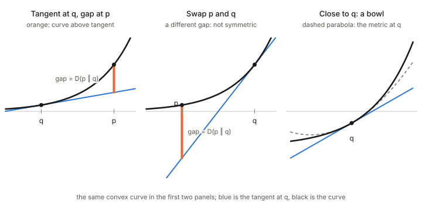

## In one paragraph

Take a convex function $\psi$ and two points $p$ and $q$. Draw the tangent to $\psi$ at $q$ and follow it to $p$. Because $\psi$ is convex, the graph at $p$ lies on or above that tangent, and the vertical gap between them is the **Bregman divergence** $D_\psi(p\,\|\,q)$. It measures how far the function curves away from its own straight-line approximation at $q$. It is never negative, it is zero only when $p=q$, and it is generally not symmetric, so it is a divergence and not a distance. For nearby points it is a bowl set by the Hessian of $\psi$, which is how a divergence yields a metric.

## The picture

<figure>

<figcaption>Left: the tangent at $q$ and the gap at $p$. Middle: swap the roles of $p$ and $q$ on the same curve and the gap changes, so the divergence is asymmetric. Right: close to $q$, the curve and its tangent are separated by a bowl whose curvature is the metric.</figcaption>
</figure>

## Definition

$$D_\psi(p\,\|\,q)=\psi(p)-\psi(q)-\langle\nabla\psi(q),\,p-q\rangle\;\ge 0 .$$

In words: the true value of $\psi$ at $p$, minus what the tangent at $q$ predicts for $p$.

## Why it behaves like a distance

- **Never negative.** Convexity puts tangents below the graph: see [Convex function and the Legendre transform](../convex-function-and-legendre-transform/index.html). For a strictly convex $\psi$ the gap is zero only when $p=q$.
- **Small when close.** Near $q$ the function barely leaves its tangent.
- **Curvature sets the scale.** For nearby points the gap is about half the curvature of $\psi$ at $q$ times the squared step, so the Hessian of $\psi$ is the ruler for small steps (right panel). That is the link from a divergence to a metric: see [Distance, divergence and metric](../distance-divergence-metric/index.html).

## Why it is not a distance

The tangent is drawn at the second argument, so swapping the arguments changes which tangent you use, and the gap changes (the middle panel). The triangle inequality fails in general too. A Bregman divergence keeps the first two rules of a distance only.

## Examples

- **The squared length:** $\psi(x)=\tfrac12\|x\|^2$ has the same curvature everywhere, so the gap is the ordinary squared Euclidean distance, which is symmetric.
- **Negative entropy:** $\psi(p)=\sum_i p_i\log p_i$ gives the **Kullback–Leibler divergence**.
- **Log-determinant:** $\psi(X)=-\log\det X$ on positive definite matrices gives the log-det divergence between covariance matrices ([Positive definite matrices](../positive-definite-matrices/index.html); Chapter 4).

## The dual picture

With the Legendre transform, if $\eta=\nabla\psi(q)$ is the slope at $q$, the same gap is

$$D_\psi(p\,\|\,q)=\psi(p)+\psi^*(\eta)-\langle p,\eta\rangle .$$

It is zero exactly when $\eta$ is the slope at $p$, and positive otherwise. Exchanging the roles of $\psi$ and $\psi^*$ gives the reverse divergence, so the two orders of the arguments are two views of one geometry.

## The Pythagorean theorem

A Bregman divergence satisfies a three-point rule. If $r$ is the point of a flat set closest to $p$ in the divergence, then for any other point $q$ in the set

$$D(p\,\|\,q)=D(p\,\|\,r)+D(r\,\|\,q),$$

provided the path from $p$ to $r$ meets the set at a right angle in the dual sense. This is the projection theorem of [Chapter 1](../ch01-dually-flat-structure/index.html), and it makes minimising a divergence behave like dropping a perpendicular.

## In these notes

The convex potential $\psi$ is the log-partition function of an exponential family ([Potential, function and vector field](../potential-function-vector-field/index.html)), and its Bregman divergence is the KL divergence between two members of that family. The same potential supplies the metric (its Hessian), the dual coordinates (its gradient) and the divergence (its tangent gap), so one convex function organises the whole geometry.

- **The metric it induces:** for a family of distributions this is the Fisher information matrix, and the steepest descent direction in it is the natural gradient: [Fisher information and the natural gradient](../fisher-information-and-natural-gradient/index.html).

## Takeaways

1. A Bregman divergence is the gap between a convex function and its tangent at the other point.
2. It is non-negative, zero only at equal points, and generally asymmetric.
3. Near the second argument it is a bowl whose curvature is the Hessian: the metric.
4. KL divergence and squared distance are special cases, and a Pythagorean theorem holds for it.
