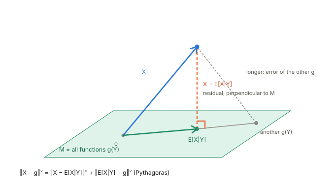
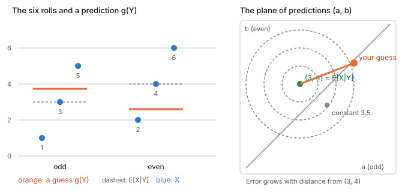
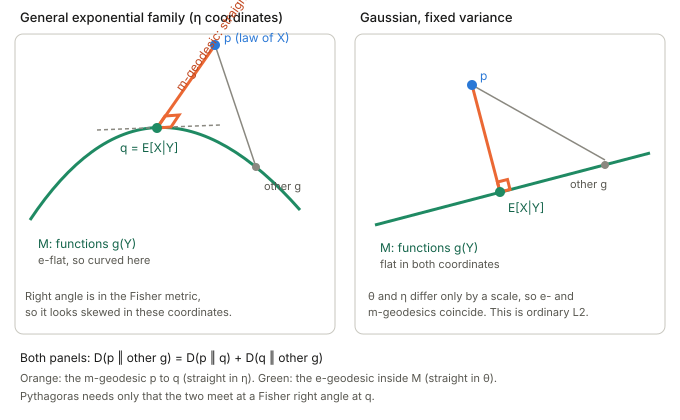

## In one paragraph

To predict a random quantity $X$ using only what you know about $Y$, the best answer in mean-squared error is the **conditional expectation** $E[X\mid Y]$. Picture every random variable as an arrow. The predictions that depend only on $Y$ form a flat plane of arrows, and $E[X\mid Y]$ is the shadow of $X$ on that plane: the closest point, found by dropping a perpendicular. What is left over, $X-E[X\mid Y]$, is perpendicular to every function of $Y$. Information geometry says this is a special case of a much wider statement: for any Bregman divergence the best prediction is still the conditional mean, and the error still splits by a Pythagorean theorem. Squared error is the case where the geometry happens to be flat and Euclidean.

Related video: [Conditional Expectations Are Just Projections](https://www.youtube.com/watch?v=q5D7w_i2JPg) (Math with Ming).

## The picture

<figure>

<figcaption>The plane $M$ is every function $g(Y)$. The foot of the perpendicular from $X$ is $E[X\mid Y]$. Any other $g$ is farther away, and by Pythagoras the extra distance is exactly the distance from the foot to $g$.</figcaption>
</figure>

## Random variables as arrows

Take all random variables with finite variance. You can add them and scale them, so they behave like arrows. Two things turn this into geometry:

- **Inner product:** $\langle X,Z\rangle=E[XZ]$.
- **Distance:** the distance between $X$ and $Z$ is $\sqrt{E[(X-Z)^2]}$, the root-mean-square error.

The set of everything you can compute from $Y$ alone, $M=\{g(Y)\}$, is a flat subspace. Asking for the best prediction of $X$ from $Y$ is asking for the point of $M$ nearest to $X$. The answer is the orthogonal projection, and it equals $E[X\mid Y]$.

## A concrete example: one die

Roll a fair die. Let $X$ be the number and $Y$ whether it is odd or even.

- A function of $Y$ takes one value on the odds and one on the evens, so $g(Y)=(a,b,a,b,a,b)$. These form a 2-dimensional plane inside the 6-dimensional space of lists of six numbers. The next subsection spells out why.
- Averaging $X$ inside each group gives $3$ for the odds and $4$ for the evens, so $E[X\mid Y]=(3,4,3,4,3,4)$.
- The residual is $(-2,-2,0,0,2,2)$. Inside each group it adds up to zero, so it has no component along "odd" or "even": it is perpendicular to the plane.

<figure>

<figcaption>Left: the six rolls, a guess $g(Y)$ in orange, and $E[X\mid Y]$ dashed. Right: the same family of guesses drawn as the $(a,b)$ plane. Error grows with distance from $(3,4)$, and the constant guess $3.5$ sits on the diagonal $a=b$, a little off the best point.</figcaption>
</figure>

The unavoidable part of the error is the spread of the rolls inside each group, which no choice of $a,b$ can remove. The extra part is the squared distance from your $(a,b)$ to $(3,4)$. Total error is the sum of the two.

### Why a function of $Y$ looks like $(a,b,a,b,a,b)$

1. **A random variable is a list of numbers.** The sample space is the six faces, $\Omega=\{1,\dots,6\}$. A random variable is a function $Z:\Omega\to\mathbb R$, and it is fixed by its six values $(Z(1),\dots,Z(6))$. So each random variable is one point of $\mathbb R^6$.
2. **$Y$ is a function on the faces.** $Y(\omega)$ is "odd" for $\omega\in\{1,3,5\}$ and "even" for $\omega\in\{2,4,6\}$. It only ever takes two values.
3. **A function of $Y$ is a composition.** Take any rule $g$ whose inputs are the two values "odd" and "even". Then $g(Y)$ is the random variable $\omega\mapsto g(Y(\omega))$. Because $g$ only has two possible inputs, it is completely defined by two numbers, $a=g(\text{odd})$ and $b=g(\text{even})$. You choose them freely, and there is nothing else to choose.
4. **Evaluate from the inside out.** First compute $Y(\omega)$, then feed the result into $g$.

| face $\omega$ | 1 | 2 | 3 | 4 | 5 | 6 |
|---|---|---|---|---|---|---|
| $Y(\omega)$ | odd | even | odd | even | odd | even |
| $g(Y(\omega))$ | $a$ | $b$ | $a$ | $b$ | $a$ | $b$ |

   For face 3, $Y(3)=$ odd, so $g(Y(3))=g(\text{odd})=a$. For face 4, $Y(4)=$ even, so $g(Y(4))=b$. The function $g$ cannot tell face 1 from face 3, because it only sees $Y(\omega)$, and that is the same for both.
5. **Why it is a plane.** The set of all such lists is $\{\,a\,(1,0,1,0,1,0)+b\,(0,1,0,1,0,1)\,\}$, the span of two vectors that share no positions. They are independent, so it is a 2-dimensional subspace of the 6-dimensional space.
6. **The converse.** A random variable that is constant on the odds and constant on the evens, with values $a$ and $b$, is $g(Y)$ for the $g$ with $g(\text{odd})=a$ and $g(\text{even})=b$. So the plane is exactly the set of functions of $Y$. In general, $Z$ is a function of $Y$ exactly when it is constant on each set $\{\omega: Y(\omega)=y\}$, which is why $E[X\mid Y]$ averages inside those sets.

This restriction is what makes the plane small: a general random variable could give all six faces different values, but a function of $Y$ cannot. The conditional expectation is the closest member of this small plane to $X$.

## A second example: two dice

Roll two fair dice $D_1,D_2$. Let $X=D_1+D_2$ and $Y=D_1$. Fix $D_1=y$; the second die is still a fair die, so $E[X\mid Y]=D_1+3.5$. The residual is $D_2-3.5$.

Because the two dice are independent, $E[(D_2-3.5)\,g(D_1)]=E[D_2-3.5]\cdot E[g(D_1)]=0$ for every $g$. So the residual is perpendicular to the whole plane, and it is independent of $D_1$ because it carries no information about the first die.

Ignoring $Y$ entirely means predicting with a constant, which is a point of a much smaller subspace. Conditioning on the first die explains half of the total spread and leaves the other half, the spread of $D_2$.

## What the geometry gives for free

- **Perpendicular residual:** $E[(X-E[X\mid Y])\,g(Y)]=0$ for every $g$. This is the usual defining property of conditional expectation, now read as a right angle.
- **Pythagoras:** for any other prediction $g$,
$$E[(X-g)^2]=E[(X-E[X\mid Y])^2]+E[(E[X\mid Y]-g)^2].$$
The first term is unavoidable and the second is the cost of using the wrong $g$.
- **Variance splits in two:** with $g$ a constant, the same identity becomes $\operatorname{Var}(X)=\operatorname{Var}(E[X\mid Y])+E[\operatorname{Var}(X\mid Y)]$, the part $Y$ explains plus the part it leaves behind.
- **Tower property:** projecting onto a smaller subspace after a larger one is the same as projecting onto the smaller one directly, so $E[E[X\mid Y]]=E[X]$.
- **Idempotence:** projecting something already in $M$ changes nothing, so $E[E[X\mid Y]\mid Y]=E[X\mid Y]$.

## The information-geometric view

**Squared error is a divergence.** For two Gaussians with the same variance $\sigma^2$, the KL divergence is $(\mu_1-\mu_2)^2/(2\sigma^2)$. Choosing a prediction $g(Y)$ is choosing the Gaussian $N(g(Y),\sigma^2)$ for $X$, and squared error is the KL divergence up to the constant $\sigma^2$. See [Bregman divergence](../bregman-divergence/index.html).

**The mean is the m-projection.** Among the members of an exponential family, the one that minimises $\mathrm{KL}(p\,\|\,q)$ is the one whose mean parameter matches that of $p$: moment matching. Fix $Y=y$ and project the conditional law of $X$ onto the fixed-variance Gaussian family: the best member has mean $E[X\mid Y=y]$. So $E[X\mid Y]$ is the m-projection of the conditional law, group by group.

**Pythagoras holds for any Bregman divergence $D$:**
$$E[D(X,g(Y))]=E[D(X,E[X\mid Y])]+E[D(E[X\mid Y],g(Y))].$$
So $E[X\mid Y]$ is the best predictor for KL, for Poisson deviance and for squared error alike. See [Convex function and the Legendre transform](../convex-function-and-legendre-transform/index.html).

**Why the right angle is a right angle.** An exponential family has two coordinate systems: the natural parameter $\theta$ and the mean parameter $\eta=E[T]$. The functions $g(Y)$ are straight in $\theta$ (e-flat), and the residual direction is straight in $\eta$ (an m-geodesic). The two meet at a right angle in the Fisher metric, and that is exactly what the Pythagorean theorem of Chapter 1 asks for. For fixed-variance Gaussians the Fisher metric is the constant $1/\sigma^2$, so $\theta$ and $\eta$ differ only by a scale and the two flat structures coincide. That is the flat picture in the first figure.

<figure>

<figcaption>Left: a general exponential family in mean coordinates $\eta$. The set of predictions bends, the m-geodesic is straight, and the right angle is in the Fisher metric so it looks skewed. Right: the Gaussian case, where everything is straight and the picture is ordinary $L^2$.</figcaption>
</figure>

**The explained part is mutual information.** In the Gaussian-variance picture the total spread splits into a part $Y$ explains and a part it leaves behind. The entropy version of the same split is:

| Quantity | $L^2$ picture | Information picture |
|---|---|---|
| Total spread | $\operatorname{Var}(X)$ | $H(X)$ |
| Explained by $Y$ | $\operatorname{Var}(E[X\mid Y])$ | $I(X;Y)$ |
| Left over | $E[\operatorname{Var}(X\mid Y)]$ | $H(X\mid Y)$ |

Mutual information is itself a projection distance: $I(X;Y)=\mathrm{KL}\big(p(x,y)\,\|\,p(x)p(y)\big)$ is the divergence from the joint law to the nearest independent one. The $L^2$ decomposition is the second-order, Gaussian shadow of the entropy decomposition.

**When the picture bends.** If $X$ is Poisson or Bernoulli instead of Gaussian, the best predictor is still $E[X\mid Y]$, but the geometry is no longer flat Euclidean: the mean and natural parameters differ and the loss is no longer a plain squared distance. A squared-error fit to a Bernoulli outcome projects with the wrong divergence for that family.

## Takeaways

1. $E[X\mid Y]$ is the orthogonal projection of $X$ onto the plane of functions of $Y$.
2. The residual is perpendicular to every function of $Y$, and the error splits into unavoidable plus extra by Pythagoras.
3. Squared error is KL between fixed-variance Gaussians, so the projection is the m-projection onto that family.
4. For any Bregman divergence the best predictor is still the conditional mean and the Pythagorean theorem still holds.
5. The variance split is the Gaussian shadow of the entropy split $H(X)=I(X;Y)+H(X\mid Y)$.
