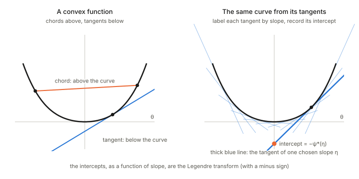

## In one paragraph

A function is **convex** when it is a bowl: the straight line between any two points of its graph lies on or above the graph, and every tangent line lies on or below it. For a strictly convex function the slope strictly increases, so each slope value occurs at exactly one point, and a point of the curve can be labelled by its slope instead of its position. The **Legendre transform** is the bookkeeping that makes this switch without losing information: it records, for each slope, how far the tangent of that slope sits from the origin. In dually flat geometry it turns the potential $\psi(\theta)$ into the dual potential $\psi^*(\eta)$.

## The picture

<figure>

<figcaption>Left: convex means chords above and tangents below. Right: the curve is recovered as the envelope of its tangent lines; label each tangent by its slope, record where it cuts the vertical axis, and those intercepts (with a minus sign) are the Legendre transform.</figcaption>
</figure>

## Convex function

A function $\psi$ is convex if for all $a,b$ and $0\le t\le1$,

$$\psi\big(ta+(1-t)b\big)\le t\,\psi(a)+(1-t)\,\psi(b).$$

A convex function is a bowl: no dents, no second hill, so any local minimum is the global one. Three equivalent views for smooth functions:

- **Chords above the graph:** the definition above.
- **Tangents below the graph:** every tangent line or plane lies on or below the graph. The gap between $\psi$ and its tangent at another point is never negative, and this gap is what a Bregman divergence measures.
- **Slope only increases:** in one dimension $\psi'$ never decreases; in several dimensions the Hessian is positive semi-definite everywhere (positive definite for strict convexity). Compare [Jacobian and Hessian](../jacobian-and-hessian/index.html): convexity is the global version of "the Hessian is positive definite".

## Legendre transform

For strictly convex $\psi$, each slope $\eta=\psi'(\theta)$ occurs at exactly one point, so a point of the curve can be named by its slope. The Legendre transform is

$$\psi^*(\eta)=\max_\theta\big(\theta\,\eta-\psi(\theta)\big).$$

Picture it in the right panel. The tangent line of slope $\eta$ cuts the vertical axis at $-\psi^*(\eta)$. A convex curve can therefore be described in two equivalent ways: by its points $(\theta,\psi(\theta))$, or by the family of all its tangent lines, each labelled by its slope and its intercept. The two descriptions carry the same information, like describing a shape by its outline or by the lines that touch it.

## What to remember about it

- **Slopes swap roles.** The slope of $\psi$ at $\theta$ is $\eta$, and the slope of $\psi^*$ at $\eta$ is $\theta$: $\eta=\nabla\psi(\theta)$ and $\theta=\nabla\psi^*(\eta)$.
- **It undoes itself.** Transforming twice returns $\psi$, for a convex function.
- **Curvatures invert.** The Hessian of $\psi^*$ is the inverse of the Hessian of $\psi$ at the matching points: a sharply curved bowl becomes a gently curved one, and the reverse.
- **The pairing is a divergence.** The quantity $\psi(\theta)+\psi^*(\eta)-\theta\eta$ is zero when $\eta$ is the slope at $\theta$ and positive otherwise. That is the Bregman divergence.

## In information geometry

This is the structure of the dually flat geometry of [Chapter 1](../ch01-dually-flat-structure/index.html):

- $\psi(\theta)$ is the convex potential (the log-partition function of an exponential family) and $\theta$ are the natural parameters; see [Potential, function and vector field](../potential-function-vector-field/index.html).
- The expectation parameters are its slopes, $\eta=\nabla\psi(\theta)$.
- The dual potential is the Legendre transform $\psi^*(\eta)$, which for an exponential family is the negative entropy.
- The metric is the Hessian of $\psi$ in the $\theta$ coordinates and the Hessian of $\psi^*$ in the $\eta$ coordinates, and the two are inverse matrices: that is why the geometry is "dually flat".

## Takeaways

1. Convex means a bowl: chords above the graph, tangents below.
2. A strictly convex curve can be labelled by slope instead of position; the Legendre transform records each tangent's intercept so that nothing is lost.
3. Slopes and positions swap roles under the transform, and the two Hessians are inverses.
4. In these notes $\psi$ gives the natural parameters, its gradient gives the expectation parameters, and $\psi^*$ completes the dual picture.
