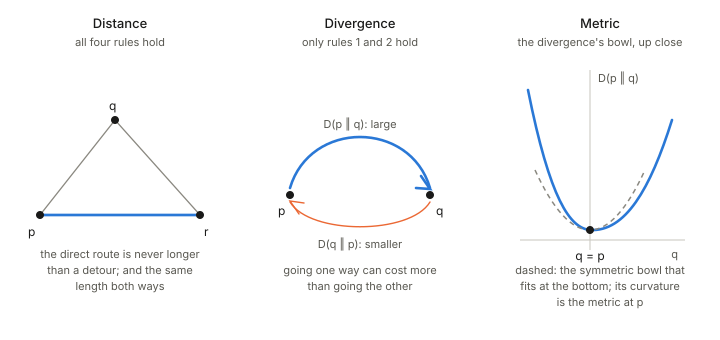

## In one paragraph

Distance, divergence and metric all measure how far apart two things are, and they differ in which everyday rules of distance they keep. A **distance** keeps all four. A **divergence** keeps only the first two, so it may be lopsided. A **Riemannian metric** is something else: a ruler for tiny steps at one point of a curved space, which yields distances by adding up the steps. Information geometry starts from a divergence and reads a metric off its bottom.

## The picture

<figure>

<figcaption>Left: a distance; the detour through $q$ is never shorter. Middle: a divergence can cost more one way than the other. Right: zoom in to the bottom of a divergence bowl and it looks like a symmetric one; the curvature of that symmetric bowl is the metric.</figcaption>
</figure>

## Distance

A distance $d(p,q)$ gives a number to every pair of points and obeys four rules:

1. **Non-negative:** $d(p,q) \ge 0$.
2. **Zero only for identical points:** $d(p,q)=0$ exactly when $p=q$.
3. **Symmetric:** $d(p,q)=d(q,p)$. The trip there is as long as the trip back.
4. **Triangle inequality:** $d(p,r)\le d(p,q)+d(q,r)$. A detour never shortens a trip.

Straight-line distance on a map obeys all four. (Analysts call a function with these four rules a "metric", which is not the Riemannian metric below; that is the main source of confusion.)

## Divergence

A divergence $D(p\,\|\,q)$ keeps rules 1 and 2 and drops the other two. It says how different $q$ is from $p$, but it may differ from $D(q\,\|\,p)$ and it need not obey the triangle inequality.

The standard example is the Kullback–Leibler divergence between two probability distributions. Think of forecasting: predicting rain on a day that stays dry costs something different from predicting dry weather on a day that rains, so asking "how bad is $q$ as a stand-in for $p$" is a one-way question. A divergence still behaves like a squared distance near its minimum: zero at $q=p$ and rising like a bowl around it, which is the positive definite picture of [the previous foundations page](../positive-definite-matrices/index.html).

## Riemannian metric

A Riemannian metric is a ruler attached to every point of a curved space. At each point $p$ it is a positive definite matrix $g(p)$, and it measures a tiny step $dx$ as $dx^\top g(p)\,dx$. Adding up these tiny lengths along a path gives the path's length, and the shortest path is a **geodesic**; its length is the distance between the endpoints. So a metric is a local ruler that produces a global distance.

## How they connect

- A **distance** works between any two points, near or far.
- A **metric tensor** works only for tiny steps at a point; distances are built from it by adding up steps along paths.
- A **divergence** is a one-way, possibly lopsided measure. For two nearby points its leading behaviour is a squared length, and that squared length defines a metric: $D(p\,\|\,p+dp)$ is, to leading order, half of $dp^\top g(p)\,dp$. In the figure this is the dashed bowl fitted at the bottom of the lopsided one.

That last link is the opening idea of Amari's book: the KL divergence between nearby distributions produces the Fisher information matrix as its metric. What the divergence carries beyond the metric, namely its lopsidedness, is the extra structure of the dual connections. Chapter 1 begins from divergences: [Chapter 1: dually flat structure](../ch01-dually-flat-structure/index.html).

## Takeaways

1. A distance obeys four rules: non-negative, zero only for identical points, symmetric, and the triangle inequality.
2. A divergence keeps the first two only, so it may be lopsided; KL is the main example.
3. A Riemannian metric is a positive definite matrix at each point that measures tiny steps; distances come from adding steps along a path.
4. Near its minimum a divergence is a squared length, and the matrix of that squared length is the metric.
