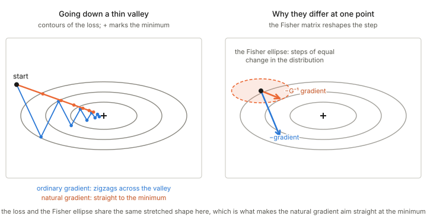

## In one paragraph

**Fisher information** measures how sensitive a probability distribution is to its parameter: how much the distribution really changes when the parameter is nudged, as far as data could tell. It is a positive (semi-)definite matrix, it is the metric of information geometry, and it keeps the same meaning under any reparametrisation. The **natural gradient** is the direction of steepest descent when steps are measured with that ruler instead of the plain Euclidean one: it is the ordinary gradient corrected by the inverse Fisher matrix. In a long thin valley the ordinary gradient zigzags across it, and the natural gradient points down it.

## The picture

<figure>

<figcaption>Left: the ordinary gradient zigzags across a thin valley; the natural gradient goes straight down it. Right: at one point, the Fisher ellipse shows which parameter steps change the distribution equally; the natural gradient is the ordinary one reshaped by it. (In this sketch the loss and the Fisher ellipse have the same stretched shape, which is what makes the natural gradient aim straight at the minimum.)</figcaption>
</figure>

## Fisher information

**The question.** For a family $p(x\mid\theta)$, how much does the distribution change when $\theta$ is nudged a little?

**The definition.** The *score* is the slope of the log-likelihood, $\nabla_\theta\log p(x\mid\theta)$: it says which way to move $\theta$ to make the observation $x$ more likely. Fisher information is how much the score fluctuates over data drawn from the model,

$$G(\theta)=\mathbb E\big[\nabla_\theta\log p\;\nabla_\theta\log p^\top\big].$$

Three readings:

- **Sensitivity.** Large means a small change of $\theta$ changes the distribution a lot, so the data pin $\theta$ down tightly; small means the data say little about $\theta$.
- **Curvature of the likelihood.** Near the true parameter it is the curvature of the expected log-likelihood bowl: see [Jacobian and Hessian](../jacobian-and-hessian/index.html).
- **A ruler.** For nearby distributions, the KL divergence is half the Fisher information times the squared step, so it is the metric of the family: see [Distance, divergence and metric](../distance-divergence-metric/index.html) and [Bregman divergence](../bregman-divergence/index.html).

**Why not just the distance between parameters?** A parameter can be badly scaled: one unit of the variance and one unit of the standard deviation are not the same change in a Gaussian. Fisher information corrects for this and keeps its meaning under any reparametrisation, which is what makes it the right ruler.

## The flaw in the ordinary gradient

Plain gradient descent follows the direction of steepest descent, and "steepest" depends on how steps are measured. The plain gradient uses the ordinary Euclidean ruler on the parameters, which is arbitrary: reparametrise and the steepest direction changes. Worse, equal steps in $\theta$ can change the distribution by very different amounts, so some updates are tiny and others violent.

## The natural gradient

Ask for the steepest descent direction when steps are measured with the Fisher ruler, so that each step changes the *distribution* by a fixed amount. The answer is the ordinary gradient corrected by the inverse of the Fisher matrix,

$$\tilde\nabla L=G(\theta)^{-1}\,\nabla L,\qquad \theta\leftarrow\theta-\epsilon\,G(\theta)^{-1}\nabla L.$$

**Intuition.** The Fisher ellipse in the right panel is long in the directions where moving $\theta$ barely changes the distribution and short where it changes it a lot. Multiplying by $G^{-1}$ undoes that stretch: it shrinks the step along the sensitive directions and enlarges it along the insensitive ones. In a long thin valley the ordinary gradient zigzags across it and the natural gradient points down it.

**Properties:**

- **Invariance.** The natural-gradient path is the same however the model is parametrised; the ordinary gradient's is not.
- **Fixed-size steps in distribution space.** Each step changes the distribution by about the same KL amount, which stabilises learning.
- **Kinship with Newton's method.** For a log-likelihood loss the Fisher matrix is the expected Hessian, so the natural gradient resembles a Newton step.
- **Its limit.** Near singular points of the model, where $G$ loses rank (for example neural networks with redundant units), the inverse blows up and the dynamics become slow or erratic.

## In these notes

The Fisher metric is the unique invariant metric on a family of distributions ([Chapter 3](../ch03-invariant-geometry/index.html)). For an exponential family it is the Hessian of the log-partition function ([Convex function and the Legendre transform](../convex-function-and-legendre-transform/index.html)). It sets the accuracy of estimation in [Chapter 7](../ch07-asymptotic-theory-of-inference/index.html), and the natural gradient and its behaviour near singular regions are the subject of [Chapter 12](../ch12-natural-gradient-and-singular-regions/index.html).

## Takeaways

1. Fisher information measures how much a distribution changes per change of parameter; it is a positive (semi-)definite matrix and the metric of the family.
2. It keeps its meaning under reparametrisation, which the Euclidean ruler on parameters does not.
3. The natural gradient is the ordinary gradient multiplied by the inverse Fisher matrix: steepest descent measured in distribution space.
4. In a thin valley it goes down the valley instead of zigzagging across it, and it fails near singular points where the Fisher matrix loses rank.
