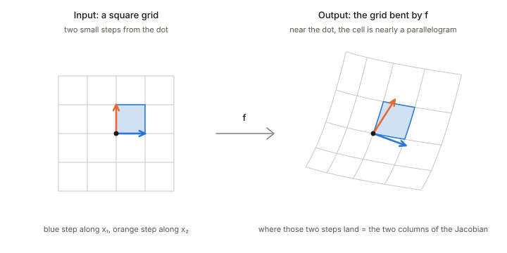
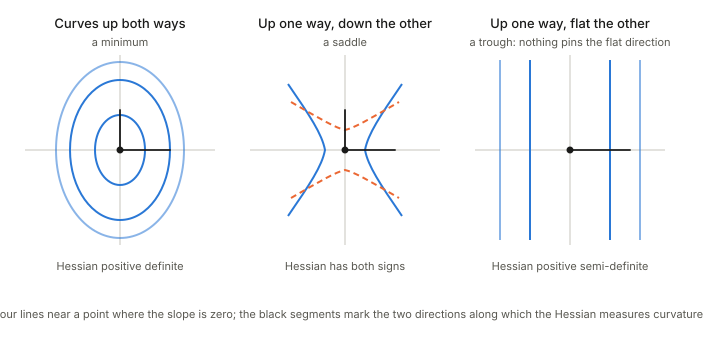

## In one paragraph

Both are matrices of derivatives. The **Jacobian** collects the first derivatives of a function that maps vectors to vectors, and it is the linear map that the function looks like when you zoom in. The **Hessian** collects the second derivatives of a function that returns one number, and it measures how the ground bends in each direction. The Hessian is the Jacobian of the gradient.

## Jacobian: the local linear map

Take $f$ that sends an input $x=(x_1,\dots,x_n)$ to an output $f(x)=(f_1,\dots,f_m)$. Its Jacobian at a point is the $m\times n$ matrix of first partial derivatives,

$$J_{ij}=\frac{\partial f_i}{\partial x_j}.$$

Column $j$ answers one question: if input $x_j$ is nudged a little, where does the output move?

<figure>

<figcaption>Zoom in on a smooth map and it looks linear. The two small input steps land on the two columns of the Jacobian, and the small square becomes a parallelogram.</figcaption>
</figure>

Near the dot the bent grid is almost a grid of parallelograms. The Jacobian is that stretch, rotation and shear. It also tells how small areas scale: a small square becomes a parallelogram whose area is $|\det J|$ times as large (for $m=n$), which is why $|\det J|$ shows up when a change of variables is made inside an integral.

Information geometry uses it whenever it changes coordinates, for example from natural parameters $\theta$ to expectation parameters $\eta$.

## Hessian: the curvature

For $f:\mathbb R^n\to\mathbb R$ the Hessian is the $n\times n$ matrix of second partial derivatives,

$$H_{ij}=\frac{\partial^2 f}{\partial x_i\,\partial x_j}.$$

It is symmetric for smooth $f$. The gradient says which way is uphill; the Hessian says how the ground bends as you walk, and $v^\top H v$ is the curvature along the direction $v$.

<figure>

<figcaption>Contour lines near a point where the slope is zero, sorted by the Hessian there: curving up both ways is a minimum, up one way and down the other is a saddle, and flat in one direction is a trough.</figcaption>
</figure>

This is the positive-definite picture of [the earlier foundations page](../positive-definite-matrices/index.html) applied to curvature:

- **Positive definite:** the ground curves up in every direction, so the point is a minimum.
- **Both signs:** it curves up one way and down the other, so the point is a saddle.
- **Semi-definite:** it is flat along one direction, so nothing pins the point down along that direction.

## In information geometry

For a convex potential $\psi(\theta)$, the Hessian is positive definite and serves as the metric; for an exponential family it is the Fisher information matrix. That is how a ruler comes out of a potential function: see [Chapter 1: dually flat structure](../ch01-dually-flat-structure/index.html) and, for the idea of a metric, [distance, divergence and metric](../distance-divergence-metric/index.html).

## Takeaways

1. The Jacobian is the local linear map of a vector-valued function: its columns are where the coordinate steps land, and $|\det J|$ is the local area scaling.
2. The Hessian is the matrix of curvature of a real-valued function: $v^\top H v$ is the bend along $v$.
3. The Hessian is the Jacobian of the gradient.
4. A positive definite Hessian means a minimum; mixed signs mean a saddle; a zero direction means a trough.
