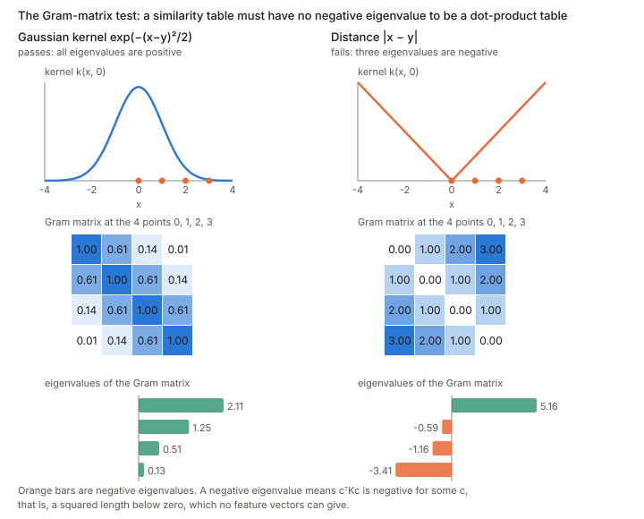
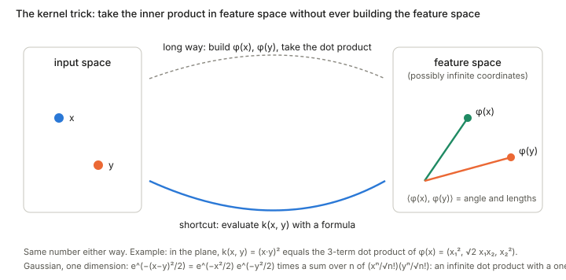
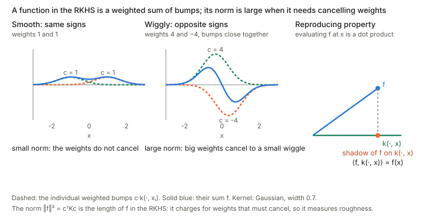

## In one paragraph

A **kernel function** $k(x,y)$ takes two points and returns a number saying how similar they are: large when $x$ and $y$ are close or alike, small when they are far apart. A **positive definite** kernel is one that is guaranteed to behave like a dot product, $k(x,y)=\langle\varphi(x),\varphi(y)\rangle$, of some feature vectors $\varphi(x)$ that live in a (possibly infinite-dimensional) space. The **kernel trick** is that you can take that dot product with a formula in the original space, without ever building the feature vectors. The [kernel exponential family](../ch02-exponential-and-mixture-families/index.html) uses a kernel to turn a weight function $\theta(y)$ into a smooth log-density.

## What a kernel looks like

For a fixed $y$, the function $x\mapsto k(x,y)$ is a bump placed at $y$. The standard example is the Gaussian kernel

$$k_\sigma(x,y)=\exp\Big\{-\frac{(x-y)^2}{2\sigma^2}\Big\},$$

a bump of width $\sigma$ around $y$: a small $\sigma$ gives a narrow bump (only nearby points count as similar), a large $\sigma$ a wide one. Other kernels are the linear kernel $x\cdot y$, the polynomial kernel $(x\cdot y+1)^d$, and, as the extreme case, the delta function $\delta(x-y)$, which is $1$ at $x=y$ and $0$ elsewhere.

## Positive definite: the Gram-matrix test

Pick any finite list of points $x_1,\dots,x_n$ and write the table of all their similarities, the **Gram matrix** $K_{ij}=k(x_i,x_j)$. The kernel is **positive (semi-)definite** if $K$ is a positive (semi-)definite matrix for *every* choice of points, that is, if

$$\sum_{i,j}c_ic_j\,k(x_i,x_j)\ \ge 0\quad\text{for all numbers }c_1,\dots,c_n .$$

Letting the points fill the line, the sum becomes the integral $\iint k(x,y)f(x)f(y)\,dx\,dy>0$ for every function $f\neq0$, which is the condition the book states for the kernel exponential family. This is the matrix condition of the [positive definite matrices page](../positive-definite-matrices/index.html) applied to similarity tables.

<figure>

<figcaption>The same test on two kernels at the points $0,1,2,3$. The Gaussian kernel gives a table whose eigenvalues are all positive. The distance $|x-y|$ gives a table with negative eigenvalues (orange), so it is not a valid kernel, even though it measures how far apart two points are.</figcaption>
</figure>

### Why a negative eigenvalue rules out a dot product

Suppose $k(x,y)=\langle\varphi(x),\varphi(y)\rangle$. For any numbers $c_i$, collect the vectors into one vector $v=\sum_i c_i\varphi(x_i)$. Then

$$c^\top Kc=\sum_{i,j}c_ic_j\langle\varphi(x_i),\varphi(x_j)\rangle=\Big\langle\sum_ic_i\varphi(x_i),\sum_jc_j\varphi(x_j)\Big\rangle=\|v\|^2\ \ge 0 .$$

So a table of dot products can never give a negative $c^\top Kc$, which is the squared length of a vector. If $u$ is an eigenvector of $K$ with eigenvalue $\lambda$, then $u^\top Ku=\lambda\|u\|^2$, so a negative eigenvalue would give a negative squared length. That is impossible, so no feature vectors exist. The converse holds as well (Mercer, Moore–Aronszajn): if no eigenvalue is ever negative, write $K=Q\Lambda Q^\top$ and take the rows of $Q\Lambda^{1/2}$ as the feature vectors.

A passing result on one set of points proves nothing about the kernel in general, since it has to pass for *every* set of points; a single negative eigenvalue on any set is enough to rule a kernel out.

### Why not just use "1 minus the distance"?

A distance measures dissimilarity, so $1-|x-y|$ looks like a natural similarity, but it fails as soon as two points are more than $2$ apart (the similarity becomes negative so badly that the two-point table has a negative eigenvalue). The reason is that subtracting a distance does not respect the dot-product structure. If $k$ is a dot product with $k(x,x)=1$, then the squared distance between the feature vectors is

$$\|\varphi(x)-\varphi(y)\|^2=k(x,x)+k(y,y)-2k(x,y),\qquad\text{so}\qquad k(x,y)=1-\tfrac12\|\varphi(x)-\varphi(y)\|^2 .$$

The correct "one minus distance" subtracts half the *squared* distance between *feature vectors*, not a distance measured in the input space. The usual way to turn a distance into a valid similarity is to exponentiate the squared distance, as in the Gaussian kernel (Schoenberg's theorem says exactly when this works).

## The kernel trick: never build the feature space

<figure>

<figcaption>Two routes to the same number. The long route maps $x$ and $y$ into the feature space and takes the dot product there. The shortcut evaluates a closed-form kernel in the input space.</figcaption>
</figure>

The infinite dimension does not go away: it is where the dot product lives. The trick is that the dot product has a closed form, so you never write the coordinates.

- **A finite example.** In the plane, $k(x,y)=(x\cdot y)^2=x_1^2y_1^2+2x_1x_2y_1y_2+x_2^2y_2^2$ is the dot product of $\varphi(x)=(x_1^2,\sqrt2\,x_1x_2,x_2^2)$. Computing the kernel needs one dot product and a square, whichever the size of the feature space.
- **The infinite case is the same.** In one dimension, $e^{-(x-y)^2/2}=e^{-x^2/2}e^{-y^2/2}e^{xy}$ and $e^{xy}=\sum_n\frac{x^n}{\sqrt{n!}}\frac{y^n}{\sqrt{n!}}$, a dot product of two infinite vectors. The infinite sum collapses into one exponential.
- **Algorithms only need the table.** Kernel regression, SVMs and the like use only inner products between the feature vectors of the *data points*, that is, the $n\times n$ Gram matrix. The representer theorem says the best solution lies in the span of $\varphi(x_1),\dots,\varphi(x_n)$, so everything is a finite computation with $n$ numbers. The price is that the cost grows with the number of data points rather than with the feature dimension.

Positive definiteness is what guarantees that the hidden feature space exists. A kernel that fails the Gram test has no feature space, and the trick would give meaningless answers.

## The reproducing kernel Hilbert space

A **reproducing kernel Hilbert space** (RKHS) is the space of functions you can build by adding up bumps of a positive definite kernel, with a dot product chosen so that evaluating a function at a point is itself a dot product. It is the feature space of the kernel trick, made concrete as a space of functions.

**Functions made of bumps.** For each point $y$, $k(\cdot,y)$ is a bump centred at $y$. The RKHS $H_k$ is the set of weighted sums of bumps (and their limits),

$$f(x)=\sum_ic_i\,k(x,x_i).$$

This is the same "smear weights through the kernel" construction as $f(x)=\int\theta(y)k(x,y)\,dy$ in the kernel exponential family: those $f$ are elements of this space.

**A dot product on functions.** Require the bumps to act like the feature vectors, $\langle k(\cdot,x),k(\cdot,y)\rangle=k(x,y)$, and extend linearly. For $f=\sum_ic_ik(\cdot,x_i)$ this gives

$$\|f\|^2=\sum_{i,j}c_ic_j\,k(x_i,x_j)=c^\top Kc,$$

the quantity of the Gram-matrix test. Positive definiteness of $k$ is what makes this a genuine squared length. ("Hilbert" means a space with such an inner product that has no gaps: every sequence that settles down has a limit in the space.)

**The reproducing property.** Take the inner product of $f$ with a single bump:

$$\langle f,k(\cdot,x)\rangle=\sum_ic_ik(x_i,x)=f(x).$$

Evaluating $f$ at $x$ is the same as taking a dot product with the bump at $x$. That is the "reproducing" in the name, and it is the kernel trick in function form: the feature vector of the point $x$ is the bump $\varphi(x)=k(\cdot,x)$, and $\langle\varphi(x),\varphi(y)\rangle=k(x,y)$.

<figure>

<figcaption>Left and middle: a function in the RKHS is a weighted sum of bumps (dashed), and its norm $c^\top Kc$ is small when the weights do not cancel and large when large weights have to cancel to make a small wiggle. Right: the reproducing property, drawn as a projection: the shadow of $f$ on the bump at $x$ has the value $f(x)$.</figcaption>
</figure>

**Why this is more than a convenience.** In an ordinary function space, two functions can be close in length but differ wildly at one point, so evaluating at a point is not a well-behaved operation. In an RKHS, evaluation is continuous: $|f(x)|\le\|f\|\sqrt{k(x,x)}$, so a small norm means small values everywhere. This property characterises these spaces: every positive definite kernel has such a space, and every Hilbert space of functions with continuous evaluation has such a kernel (the Moore–Aronszajn theorem).

**The norm measures roughness.** With a Gaussian kernel, a function that wiggles quickly can only be made from large cancelling weights, so it has a big norm, while a smooth function has a small one. Kernel methods exploit this by minimising a fit error plus $\lambda\|f\|^2$, which prefers smooth fits. It is also why a wide kernel allows only smooth functions, as in the kernel-smoothing figure of the [kernel exponential family section](../ch02-exponential-and-mixture-families/index.html).

## Where it appears

In the kernel exponential family, $\int\theta(y)k(x,y)\,dy$ is an element of the RKHS and an inner product in the feature space, with $\theta$ the weights, so the family is an ordinary exponential family with a function-valued parameter. The positivity of the kernel is what makes $\psi[\theta]$ convex.
