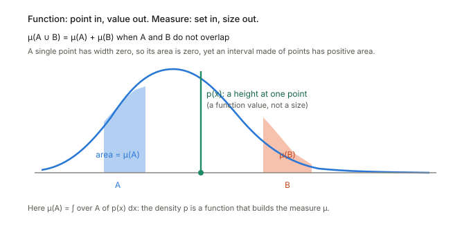

## In one paragraph

A **measure** is a rule that gives a size to *sets* of a space: length, area, mass, or probability. It takes a set $A$ and returns a number $\mu(A)\ge 0$, and it obeys one sanity rule: if you glue together pieces that do not overlap, their sizes add. A probability measure is the case where the whole space has size $1$, and $P(A)$ is the chance of the event $A$.

## The picture

<figure>

<figcaption>A function eats a point and returns a value, here the height $p(x)$. A measure eats a set and returns a size, here the area under the curve over that set. The two shaded pieces do not overlap, so the size of "$A$ or $B$" is the sum of their areas.</figcaption>
</figure>

## The definition, piece by piece

A measure $\mu$ is defined on a space $X$ together with a collection $\mathcal A$ of subsets, the **measurable sets**. It must satisfy:

1. **Nothing has no size:** $\mu(\varnothing)=0$.
2. **Additivity:** for non-overlapping $A_1,A_2,\dots$ in $\mathcal A$, $\mu\big(\bigcup_i A_i\big)=\sum_i \mu(A_i)$.

Why only *some* sets? On the real line one cannot give every subset a consistent length. So you keep a well-behaved collection $\mathcal A$, called a **$\sigma$-algebra**: it contains $X$, and it is closed under complements and countable unions. Together, $(X,\mathcal A,\mu)$ is a **measure space**. In practice you rarely meet a non-measurable set.

## Common examples

- **Length (Lebesgue measure)** on the line: the size of $[a,b]$ is $b-a$.
- **Counting measure:** the size of $A$ is how many elements it has.
- **Dirac measure at $x_0$:** the size is $1$ if $x_0\in A$, else $0$. All the mass sits on one point.
- **Probability measure:** total mass $1$. For a continuous variable, a single value has probability $0$, while an interval has positive probability.

## Measure versus function

A measure is technically a function, but its input is a **set**, not a point. This is why a probability *density* $p(x)$ is not itself a probability: it can exceed $1$. It is a *rate*, turned into a size by adding it up over a set,

$$\mu(A)=\int_A p(x)\,dx .$$

So a function $p$ can *build* a measure $\mu$, and $p$ is then called the **density** of $\mu$. Some measures have no density at all: the Dirac measure cannot be written as an ordinary function. This is the reason measures are the more general tool. Going the other way, a measure is what you integrate *against*: $\int f\,d\mu$ weights the values of $f$ by how much $\mu$ puts on each region, and the expectation $E[f]$ is this for a probability measure.

## "Positive" measure

A **positive measure** has $\mu(A)\ge 0$ for every $A$. This is just the ordinary case, named so to set it apart from **signed** measures (which can be negative) and **complex** measures. A signed measure splits into a difference of two positive ones, $\mu=\mu^+-\mu^-$, which is why positive measures are the basic building block.

## Why it matters for information geometry

- A point of a **statistical manifold** is a probability measure (usually given by a density $p(x;\theta)$). The manifold is a family of them.
- Distances between them, such as the KL divergence, compare two measures. KL needs one to have a density with respect to the other, the **Radon–Nikodym derivative** $dP/dQ$, which exists exactly when $P\ll Q$ (absolute continuity: $Q(A)=0$ forces $P(A)=0$).
- The **distribution of a random variable** $f(X)$ is the **pushforward** of the measure of $X$ through $f$.

## Related ideas to learn next

$\sigma$-algebra, measurable function, Lebesgue integral, absolute continuity, Radon–Nikodym derivative, pushforward measure, product measure.
