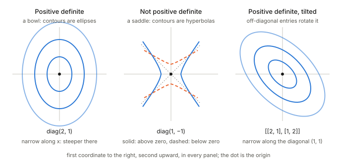
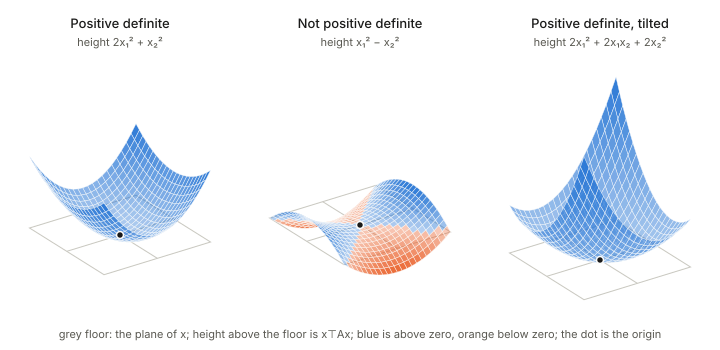

## In one paragraph

A symmetric matrix $A$ is **positive definite** when $x^\top A x > 0$ for every nonzero vector $x$. Picture the number $x^\top A x$ as a height over the plane of $x$: positive definite means the surface is a **bowl** that rises in every direction away from the origin. The same fact says that $A$ is a legitimate **ruler**: $x^\top A x$ can serve as a squared length, because no nonzero vector gets a zero or negative one. The Fisher information matrix and every Riemannian metric in these notes are positive definite for exactly this reason.

## The picture

<figure>

<figcaption>Contour lines of $x^\top A x$ for three matrices: the points where the surface has equal height. Closed ellipses mean a bowl, so $A$ is positive definite. Open hyperbolas mean a saddle, so it is not.</figcaption>
</figure>

## Three ways to see it

**1. A bowl.** The function $x^\top A x$ has its single minimum at the origin and rises whichever way you walk. If there were a direction in which it fell, or stayed flat, the matrix would not be positive definite. The contour lines are the level sets of the bowl, and for a positive definite matrix they are nested ellipses (left and right panels).

**2. A ruler.** The ordinary squared length is $x^\top x$, which is the matrix $A = I$ and gives circles as the set of vectors of length one. A positive definite $A$ gives another ruler, $\|x\|_A^2 = x^\top A x$, whose unit set is an ellipse. The ruler stretches some directions and shrinks others, but it never gives a nonzero vector a length of zero or less. The saddle in the middle panel cannot be a ruler: moving along its dashed directions would have a negative squared length.

**3. A stretch without a flip.** The axes of the ellipse are the eigenvector directions of $A$, and the eigenvalues say how steep the bowl is along each. In the left panel the bowl is steeper along the first coordinate, so the ellipse is narrow there. In the right panel the off-diagonal entries tilt the axes onto the diagonals, with the steep direction along $(1,1)$. Positive definite means every eigenvalue is positive: no axis is flattened (zero) or flipped (negative).

## The same three, as surfaces

<figure>

<figcaption>The height above the floor is $x^\top A x$ for the three matrices of the contour picture, seen from the same side. The contour lines above are what you get by slicing these surfaces at equal heights and looking straight down.</figcaption>
</figure>

On the left and on the right every part of the surface lies above the floor except the single point at the origin, which sits on it: that is positive definiteness. In the middle the surface climbs above the floor in one direction and sinks below it in the other, so there are vectors with a negative value: the saddle. Compare the tilted bowl with the plain one: both are bowls, but the tilted one is steep along one diagonal and shallow along the other, which is the same ellipse as before turned onto the diagonals.

## The three examples

- **Left, $\mathrm{diag}(2,1)$.** Positive definite. A bowl that is steeper along the first coordinate.
- **Middle, $\mathrm{diag}(1,-1)$.** Not positive definite. The surface goes up along one axis and down along the other: a saddle. Solid curves are where the surface is above zero, dashed curves where it is below zero, and the dotted diagonals are where it is exactly zero.
- **Right, the matrix with rows $(2,1)$ and $(1,2)$.** Positive definite. The same kind of bowl as the left panel, turned onto the diagonals by the off-diagonal entries.

## Related terms and equivalent tests

- **Positive semi-definite** allows $x^\top A x = 0$ for some nonzero $x$. The bowl then has a flat direction, like a trough. Covariance matrices are always at least semi-definite, and positive definite when no variable is a perfect linear combination of the others.
- Any one of these is equivalent to positive definiteness for a symmetric matrix: all eigenvalues are positive; $A = B^\top B$ for some invertible $B$; all the leading principal minors are positive.

## Why it matters in these notes

- A **Riemannian metric** is a positive definite matrix at every point of the manifold: it is the ruler that measures lengths of small steps there. The Fisher information matrix is the metric on a family of distributions, and it is positive definite whenever the parameters are not redundant.
- A **change of coordinates** keeps a positive definite matrix positive definite (the bowl is the same bowl, only described in other coordinates). That is why "positive definite" is a property of the geometry and not of one coordinate system.
- **Chapter 4** treats the set of positive definite matrices as a manifold in its own right: [Chapter 4: α-geometry, Tsallis q-entropy and positive-definite matrices](../ch04-alpha-geometry/index.html).

## Takeaways

1. Positive definite means a bowl: $x^\top A x > 0$ for all nonzero $x$.
2. Equivalently it is a valid ruler, with an ellipse for its unit sphere.
3. Equivalently all eigenvalues are positive: the ellipse axes point along the eigenvectors, and no direction is flat or flipped.
4. A saddle (hyperbolic contours) is the picture of failure.
