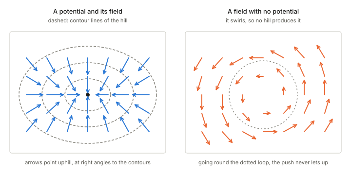

## In one paragraph

A **function** (a scalar field) gives one number at every point, like the height of the ground. A **vector field** gives an arrow at every point, like wind or the force on a particle. A **potential** is not a third kind of object: it is a function with a job, namely that its slope generates a vector field. If $\phi$ is a potential, the arrows are its gradient, $F=\nabla\phi$ (or $F=-\nabla\phi$ in physics). The potential is the hidden landscape, and the field is the slope of that landscape.

## The picture

<figure>

<figcaption>Left: a potential (the hill, shown by its contour lines) and the vector field it generates (the arrows point uphill, at right angles to the contours). Right: a swirling field that no hill produces.</figcaption>
</figure>

Think of a ball on a hillside. The height at each place is the function. The push on the ball, one arrow per place, is the vector field, and it always points along the steepest slope, at right angles to the contour lines. The hill is one number per point while the field is several, so a potential packs a whole field of arrows into a single function.

## Why a potential is useful

- **Less to store.** In $n$ dimensions a vector field needs $n$ numbers at every point, and a potential needs one.
- **Path independence.** If a field comes from a potential, the total push along a route between two points depends only on the endpoints, because it equals the change in height. A long route and a short one give the same answer.
- **Special points.** Where the arrows vanish the potential is flat, and the Hessian then says whether the point is a minimum, a saddle or a trough: see [Jacobian and Hessian](../jacobian-and-hessian/index.html).

## Not every vector field is a gradient

A swirling field cannot come from a hill: walking once around a loop, you would be pushed forward the whole way and finish with a net gain, but a hill gives back exactly what it takes. A field comes from a potential exactly when it has no swirl (it is *curl-free*, on a region with no holes). A flow circling a drain is the standard field with no potential.

## In these notes

- In a dually flat space there is a potential $\psi(\theta)$, and the two coordinate systems are tied together by its gradient: $\eta=\nabla\psi(\theta)$. The expectation parameters are the arrows, and the log-partition function $\psi$ is the landscape.
- The Hessian of $\psi$ is the metric: see [Jacobian and Hessian](../jacobian-and-hessian/index.html) and [distance, divergence and metric](../distance-divergence-metric/index.html).
- A Bregman divergence is built from the potential: it is the gap between $\psi$ at one point and its tangent-line approximation taken from the other point: [Chapter 1: dually flat structure](../ch01-dually-flat-structure/index.html).

## Takeaways

1. A potential is a function whose gradient is a vector field: the landscape behind the arrows.
2. The arrows point along the steepest slope, at right angles to the contour lines.
3. A field is a gradient only if it has no swirl; a circulating flow has no potential.
4. In dually flat geometry the potential $\psi$ gives the other coordinates by its gradient and the metric by its Hessian.
